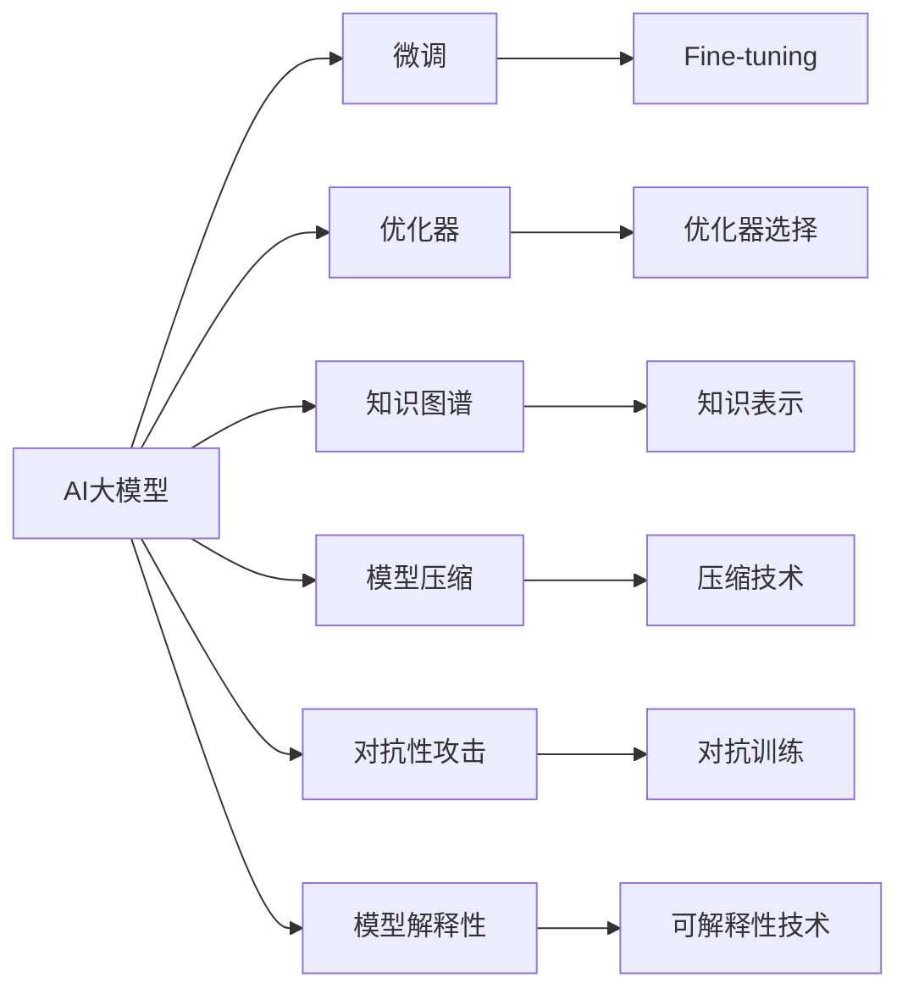

                 

# AI大模型创业：如何应对未来技术挑战？

> 关键词：AI大模型, 创业, 技术挑战, 自然语言处理, 深度学习, 微调, 优化器, 深度神经网络, 知识图谱, 模型压缩

## 1. 背景介绍

### 1.1 问题由来
近年来，随着人工智能（AI）技术的快速发展，大模型在多个领域取得了突破性进展。无论是图像识别、自然语言处理（NLP）、语音识别，还是自动驾驶、机器人控制等，大模型都展现了卓越的性能。在AI创业领域，基于大模型的应用也成为热门方向，吸引了大量创业公司和个人加入。然而，大模型的应用并非一帆风顺，特别是在实际落地时，面对各种技术挑战，如何应对这些挑战，成为摆在AI创业者面前的重要课题。

### 1.2 问题核心关键点
AI大模型创业中的技术挑战主要包括以下几个方面：

- **模型泛化能力不足**：尽管大模型在训练集上表现出色，但在未见过的数据上，泛化能力往往不尽如人意。
- **计算资源需求高**：大模型需要大量的计算资源进行训练和推理，这对于初创公司来说是一个巨大的挑战。
- **数据隐私和伦理问题**：在处理敏感数据时，如何保护隐私和遵循伦理规范是一个难题。
- **实时性和效率问题**：实时应用场景下，大模型需要高效且低延迟的推理能力。
- **对抗性攻击和鲁棒性问题**：模型需要具备一定的对抗性，能够在对抗性攻击下保持稳定。
- **模型解释性不足**：黑箱模型使得难以解释模型的决策过程，这在商业应用中可能会带来问题。
- **持续学习和自我优化**：模型需要具备持续学习的能力，以适应数据分布的变化。

### 1.3 问题研究意义
对于AI创业者而言，理解这些技术挑战，并制定有效的应对策略，是确保产品成功落地的关键。本文将深入探讨这些挑战，并提出相应的解决方案，为AI大模型创业提供有价值的参考。

## 2. 核心概念与联系

### 2.1 核心概念概述

为了更好地理解如何应对AI大模型创业中的技术挑战，我们将介绍以下几个核心概念：

- **AI大模型**：指基于深度神经网络（DNN）、大规模预训练和微调等技术构建的通用模型，如BERT、GPT-3等。这些模型通过自监督学习和监督学习的方式，学习了大量的知识，具备强大的泛化能力。
- **微调（Fine-tuning）**：在预训练模型基础上，通过少量有标签数据进行优化，使其适应特定任务的过程。微调是提高模型性能的重要手段。
- **优化器（Optimizer）**：用于调整模型参数的算法，如SGD、Adam、Adagrad等。选择合适的优化器能够加速模型收敛，提高模型性能。
- **知识图谱（Knowledge Graph）**：一种结构化的知识表示方式，用于增强模型的知识整合能力，特别是在多模态任务中。
- **模型压缩（Model Compression）**：在保持模型性能的前提下，通过剪枝、量化、蒸馏等技术，减小模型规模，降低计算和存储需求。
- **对抗性攻击（Adversarial Attack）**：通过添加特定的扰动，使模型产生错误预测的攻击手段。模型需要具备一定的鲁棒性，抵御对抗性攻击。
- **模型解释性（Model Interpretability）**：指模型输出结果的可解释性和透明性，对于商业应用尤其重要。

这些概念之间的逻辑关系可以通过以下Mermaid流程图来展示：



这个流程图展示了AI大模型从预训练到微调，再到应用的过程，并指出了其中的关键技术点。理解这些概念及其相互关系，将有助于应对大模型创业中的技术挑战。

## 3. 核心算法原理 & 具体操作步骤
### 3.1 算法原理概述

AI大模型的核心算法原理主要包括预训练和微调两个步骤。

**预训练**：通过大规模无标签数据对模型进行预训练，学习通用的语言或视觉表示。这一步通常使用自监督学习任务，如语言建模、视觉特征匹配等。

**微调**：在特定任务上对预训练模型进行有监督学习优化，使其适应该任务。微调过程通常包括选择合适的优化器、设置合适的超参数、数据增强、对抗训练等。

### 3.2 算法步骤详解

下面是AI大模型微调的具体操作步骤：

1. **数据准备**：收集标注数据集，划分为训练集、验证集和测试集。确保数据集与预训练数据集分布一致。
2. **模型加载**：选择预训练模型，如BERT、GPT等，加载到内存中。
3. **适配层添加**：根据任务类型，添加适配层（如全连接层、Softmax层等），并设置损失函数。
4. **优化器设置**：选择合适的优化器（如Adam、SGD等），并设置超参数（如学习率、批大小等）。
5. **训练过程**：使用训练集数据迭代训练模型，并在验证集上监控模型性能。
6. **测试评估**：使用测试集数据评估模型性能，确保模型能够在新数据上表现良好。

### 3.3 算法优缺点

AI大模型微调具有以下优点：

- **高效**：相较于从头训练，微调能够快速适应特定任务，提升模型性能。
- **灵活**：微调可以针对不同任务进行优化，适用于各种应用场景。
- **泛化能力强**：预训练模型已经学习了大量的通用知识，微调过程中可以充分利用这些知识。

同时，微调也存在一些缺点：

- **依赖标注数据**：微调的性能很大程度上取决于标注数据的质量和数量，获取高质量标注数据的成本较高。
- **过拟合风险**：在标注数据较少的情况下，微调模型容易出现过拟合现象。
- **计算资源需求高**：预训练和微调过程需要大量的计算资源。

### 3.4 算法应用领域

AI大模型微调在多个领域得到了广泛应用，包括但不限于：

- **自然语言处理（NLP）**：文本分类、命名实体识别、机器翻译、问答系统等。
- **计算机视觉（CV）**：图像分类、目标检测、图像生成等。
- **语音识别**：语音命令识别、情感分析、语音合成等。
- **自动驾驶**：场景理解、路径规划、行为预测等。
- **机器人控制**：导航、交互、决策等。
- **金融**：风险评估、欺诈检测、客户服务自动化等。

## 4. 数学模型和公式 & 详细讲解 & 举例说明

### 4.1 数学模型构建

为了更好地理解微调过程，我们将使用数学语言对模型构建进行详细阐述。

假设我们有预训练模型 $M_{\theta}$，其中 $\theta$ 为模型参数。现在，我们希望在特定任务 $T$ 上进行微调。微调的目标是找到一个新的参数 $\hat{\theta}$，使得模型在新数据集 $D$ 上的表现更好。

微调过程可以表示为：

$$
\hat{\theta} = \mathop{\arg\min}_{\theta} \mathcal{L}(M_{\theta}, D)
$$

其中，$\mathcal{L}$ 为损失函数，$D$ 为微调数据集。常见的损失函数包括交叉熵损失、均方误差损失等。

### 4.2 公式推导过程

以二分类任务为例，假设模型的输出为 $\hat{y} = M_{\theta}(x)$，真实标签为 $y \in \{0,1\}$。二分类交叉熵损失函数为：

$$
\ell(y, \hat{y}) = -y\log \hat{y} - (1-y)\log(1-\hat{y})
$$

微调的损失函数为：

$$
\mathcal{L}(\theta) = \frac{1}{N}\sum_{i=1}^N \ell(y_i, M_{\theta}(x_i))
$$

其中 $N$ 为样本数量。

通过梯度下降算法，微调过程可以表示为：

$$
\theta \leftarrow \theta - \eta \nabla_{\theta}\mathcal{L}(\theta)
$$

其中，$\eta$ 为学习率，$\nabla_{\theta}\mathcal{L}(\theta)$ 为损失函数对模型参数的梯度。

### 4.3 案例分析与讲解

假设我们有一家创业公司，希望开发一个情感分析系统。具体步骤如下：

1. **数据准备**：收集标注数据集，划分为训练集、验证集和测试集。
2. **模型加载**：选择预训练模型（如BERT），加载到内存中。
3. **适配层添加**：在模型顶部添加一个全连接层和一个Softmax层，用于输出情感分类概率。
4. **优化器设置**：使用Adam优化器，设置学习率为0.001，批大小为128。
5. **训练过程**：使用训练集数据迭代训练模型，并在验证集上监控模型性能。
6. **测试评估**：使用测试集数据评估模型性能，确保模型能够在新数据上表现良好。

## 5. 项目实践：代码实例和详细解释说明

### 5.1 开发环境搭建

在进行微调实践前，我们需要准备好开发环境。以下是使用Python进行PyTorch开发的环境配置流程：

1. **安装Anaconda**：从官网下载并安装Anaconda，用于创建独立的Python环境。
2. **创建并激活虚拟环境**：
```bash
conda create -n pytorch-env python=3.8 
conda activate pytorch-env
```

3. **安装PyTorch**：根据CUDA版本，从官网获取对应的安装命令。例如：
```bash
conda install pytorch torchvision torchaudio cudatoolkit=11.1 -c pytorch -c conda-forge
```

4. **安装Transformers库**：
```bash
pip install transformers
```

5. **安装各类工具包**：
```bash
pip install numpy pandas scikit-learn matplotlib tqdm jupyter notebook ipython
```

完成上述步骤后，即可在`pytorch-env`环境中开始微调实践。

### 5.2 源代码详细实现

以下是使用PyTorch对BERT模型进行情感分析任务微调的代码实现。

```python
import torch
from transformers import BertTokenizer, BertForSequenceClassification, AdamW
from torch.utils.data import Dataset, DataLoader
from sklearn.metrics import accuracy_score

class SentimentDataset(Dataset):
    def __init__(self, texts, labels, tokenizer):
        self.texts = texts
        self.labels = labels
        self.tokenizer = tokenizer
    
    def __len__(self):
        return len(self.texts)
    
    def __getitem__(self, item):
        text = self.texts[item]
        label = self.labels[item]
        
        encoding = self.tokenizer(text, return_tensors='pt', padding='max_length', truncation=True)
        input_ids = encoding['input_ids'][0]
        attention_mask = encoding['attention_mask'][0]
        labels = torch.tensor(label, dtype=torch.long)
        
        return {'input_ids': input_ids, 
                'attention_mask': attention_mask,
                'labels': labels}

# 加载数据集和预训练模型
train_dataset = SentimentDataset(train_texts, train_labels, tokenizer)
val_dataset = SentimentDataset(val_texts, val_labels, tokenizer)
test_dataset = SentimentDataset(test_texts, test_labels, tokenizer)
model = BertForSequenceClassification.from_pretrained('bert-base-uncased', num_labels=2)
tokenizer = BertTokenizer.from_pretrained('bert-base-uncased')

# 设置优化器和超参数
optimizer = AdamW(model.parameters(), lr=2e-5)
epochs = 5
max_length = 128

# 训练和评估
device = torch.device('cuda') if torch.cuda.is_available() else torch.device('cpu')
model.to(device)
for epoch in range(epochs):
    model.train()
    loss = 0
    for batch in DataLoader(train_dataset, batch_size=16):
        input_ids = batch['input_ids'].to(device)
        attention_mask = batch['attention_mask'].to(device)
        labels = batch['labels'].to(device)
        model.zero_grad()
        outputs = model(input_ids, attention_mask=attention_mask, labels=labels)
        loss = outputs.loss
        loss.backward()
        optimizer.step()
        
    model.eval()
    with torch.no_grad():
        correct = 0
        total = 0
        for batch in DataLoader(val_dataset, batch_size=16):
            input_ids = batch['input_ids'].to(device)
            attention_mask = batch['attention_mask'].to(device)
            labels = batch['labels'].to(device)
            outputs = model(input_ids, attention_mask=attention_mask)
            _, predicted = torch.max(outputs.logits, 1)
            total += labels.size(0)
            correct += (predicted == labels).sum().item()
        
        val_accuracy = correct / total
        print(f'Epoch {epoch+1}, Validation Accuracy: {val_accuracy:.3f}')
        
print('Test Accuracy:')
with torch.no_grad():
    correct = 0
    total = 0
    for batch in DataLoader(test_dataset, batch_size=16):
        input_ids = batch['input_ids'].to(device)
        attention_mask = batch['attention_mask'].to(device)
        labels = batch['labels'].to(device)
        outputs = model(input_ids, attention_mask=attention_mask)
        _, predicted = torch.max(outputs.logits, 1)
        total += labels.size(0)
        correct += (predicted == labels).sum().item()
        
test_accuracy = correct / total
print(f'Test Accuracy: {test_accuracy:.3f}')
```

### 5.3 代码解读与分析

上述代码实现了对BERT模型的情感分析任务微调。

1. **SentimentDataset类**：
   - `__init__`方法：初始化文本、标签和分词器。
   - `__len__`方法：返回数据集的样本数量。
   - `__getitem__`方法：对单个样本进行处理，将文本输入编码为token ids，将标签编码为数字，并进行定长padding。

2. **模型加载和适配层添加**：
   - 使用BERT预训练模型。
   - 在模型顶部添加一个全连接层和一个Softmax层，用于输出情感分类概率。

3. **优化器和超参数设置**：
   - 使用Adam优化器，设置学习率为0.001，批大小为128。

4. **训练和评估**：
   - 使用训练集数据迭代训练模型，并在验证集上监控模型性能。
   - 在测试集上评估模型性能，输出测试准确率。

## 6. 实际应用场景

### 6.1 金融风险管理

金融行业需要实时监控市场波动，预测风险，避免损失。基于大模型的微调系统可以实时分析金融数据，预测市场趋势，辅助风险管理决策。

**具体实现**：
1. **数据收集**：收集金融市场的各种数据，包括股票价格、交易量、新闻报道等。
2. **模型训练**：在金融数据上训练BERT模型，进行情感分析和事件分类。
3. **实时预测**：实时接收金融市场数据，输入模型进行情感分析和事件分类，预测市场趋势。
4. **风险预警**：根据预测结果，触发相应的风险预警机制，规避潜在风险。

### 6.2 医疗诊断

医疗行业需要快速准确地进行疾病诊断和治疗方案推荐。基于大模型的微调系统可以辅助医生进行诊断，推荐个性化治疗方案。

**具体实现**：
1. **数据收集**：收集医生的诊断记录、病人的病历、医疗文献等。
2. **模型训练**：在医疗数据上训练BERT模型，进行疾病分类和症状匹配。
3. **诊断支持**：实时接收病人的病历，输入模型进行疾病分类和症状匹配，辅助医生诊断。
4. **治疗推荐**：根据诊断结果，推荐个性化治疗方案，辅助医生决策。

### 6.3 智能客服

智能客服系统需要能够处理大量的客户咨询，提供准确的答案。基于大模型的微调系统可以理解客户的意图，提供个性化的服务。

**具体实现**：
1. **数据收集**：收集客户的历史咨询记录。
2. **模型训练**：在客户咨询记录上训练BERT模型，进行意图分类和问题回答。
3. **实时对话**：实时接收客户的咨询，输入模型进行意图分类和问题回答，提供个性化服务。
4. **知识更新**：根据客户咨询记录，更新知识库，提高系统的服务质量。

## 7. 工具和资源推荐

### 7.1 学习资源推荐

为了帮助开发者系统掌握大语言模型微调的理论基础和实践技巧，这里推荐一些优质的学习资源：

1. **《Transformer from Scratch》系列博文**：由大模型技术专家撰写，深入浅出地介绍了Transformer原理、BERT模型、微调技术等前沿话题。
2. **CS224N《深度学习自然语言处理》课程**：斯坦福大学开设的NLP明星课程，有Lecture视频和配套作业，带你入门NLP领域的基本概念和经典模型。
3. **《Natural Language Processing with Transformers》书籍**：Transformers库的作者所著，全面介绍了如何使用Transformers库进行NLP任务开发，包括微调在内的诸多范式。
4. **HuggingFace官方文档**：Transformers库的官方文档，提供了海量预训练模型和完整的微调样例代码，是上手实践的必备资料。
5. **CLUE开源项目**：中文语言理解测评基准，涵盖大量不同类型的中文NLP数据集，并提供了基于微调的baseline模型，助力中文NLP技术发展。

通过对这些资源的学习实践，相信你一定能够快速掌握大语言模型微调的精髓，并用于解决实际的NLP问题。

### 7.2 开发工具推荐

高效的开发离不开优秀的工具支持。以下是几款用于大语言模型微调开发的常用工具：

1. **PyTorch**：基于Python的开源深度学习框架，灵活动态的计算图，适合快速迭代研究。大部分预训练语言模型都有PyTorch版本的实现。
2. **TensorFlow**：由Google主导开发的开源深度学习框架，生产部署方便，适合大规模工程应用。同样有丰富的预训练语言模型资源。
3. **Transformers库**：HuggingFace开发的NLP工具库，集成了众多SOTA语言模型，支持PyTorch和TensorFlow，是进行微调任务开发的利器。
4. **Weights & Biases**：模型训练的实验跟踪工具，可以记录和可视化模型训练过程中的各项指标，方便对比和调优。与主流深度学习框架无缝集成。
5. **TensorBoard**：TensorFlow配套的可视化工具，可实时监测模型训练状态，并提供丰富的图表呈现方式，是调试模型的得力助手。
6. **Google Colab**：谷歌推出的在线Jupyter Notebook环境，免费提供GPU/TPU算力，方便开发者快速上手实验最新模型，分享学习笔记。

合理利用这些工具，可以显著提升大语言模型微调任务的开发效率，加快创新迭代的步伐。

### 7.3 相关论文推荐

大语言模型和微调技术的发展源于学界的持续研究。以下是几篇奠基性的相关论文，推荐阅读：

1. **Attention is All You Need**：提出了Transformer结构，开启了NLP领域的预训练大模型时代。
2. **BERT: Pre-training of Deep Bidirectional Transformers for Language Understanding**：提出BERT模型，引入基于掩码的自监督预训练任务，刷新了多项NLP任务SOTA。
3. **Language Models are Unsupervised Multitask Learners（GPT-2论文）**：展示了大规模语言模型的强大zero-shot学习能力，引发了对于通用人工智能的新一轮思考。
4. **Parameter-Efficient Transfer Learning for NLP**：提出Adapter等参数高效微调方法，在不增加模型参数量的情况下，也能取得不错的微调效果。
5. **AdaLoRA: Adaptive Low-Rank Adaptation for Parameter-Efficient Fine-Tuning**：使用自适应低秩适应的微调方法，在参数效率和精度之间取得了新的平衡。

这些论文代表了大语言模型微调技术的发展脉络。通过学习这些前沿成果，可以帮助研究者把握学科前进方向，激发更多的创新灵感。

## 8. 总结：未来发展趋势与挑战

### 8.1 总结

本文对AI大模型微调方法进行了全面系统的介绍。首先阐述了AI大模型和微调技术的研究背景和意义，明确了微调在拓展预训练模型应用、提升下游任务性能方面的独特价值。其次，从原理到实践，详细讲解了微调的数学原理和关键步骤，给出了微调任务开发的完整代码实例。同时，本文还广泛探讨了微调方法在金融、医疗、客服等多个行业领域的应用前景，展示了微调范式的巨大潜力。最后，本文精选了微调技术的各类学习资源，力求为开发者提供全方位的技术指引。

通过本文的系统梳理，可以看到，AI大模型微调技术正在成为NLP领域的重要范式，极大地拓展了预训练语言模型的应用边界，催生了更多的落地场景。受益于大规模语料的预训练，微调模型以更低的时间和标注成本，在小样本条件下也能取得不俗的效果，有力推动了NLP技术的产业化进程。未来，伴随预训练语言模型和微调方法的持续演进，相信NLP技术将在更广阔的应用领域大放异彩，深刻影响人类的生产生活方式。

### 8.2 未来发展趋势

展望未来，AI大模型微调技术将呈现以下几个发展趋势：

1. **模型规模持续增大**：随着算力成本的下降和数据规模的扩张，预训练语言模型的参数量还将持续增长。超大规模语言模型蕴含的丰富语言知识，有望支撑更加复杂多变的下游任务微调。
2. **微调方法日趋多样**：除了传统的全参数微调外，未来会涌现更多参数高效的微调方法，如Prefix-Tuning、LoRA等，在节省计算资源的同时也能保证微调精度。
3. **持续学习成为常态**：随着数据分布的不断变化，微调模型也需要持续学习新知识以保持性能。如何在不遗忘原有知识的同时，高效吸收新样本信息，将成为重要的研究课题。
4. **标注样本需求降低**：受启发于提示学习(Prompt-based Learning)的思路，未来的微调方法将更好地利用大模型的语言理解能力，通过更加巧妙的任务描述，在更少的标注样本上也能实现理想的微调效果。
5. **多模态微调崛起**：当前的微调主要聚焦于纯文本数据，未来会进一步拓展到图像、视频、语音等多模态数据微调。多模态信息的融合，将显著提升语言模型对现实世界的理解和建模能力。
6. **模型通用性增强**：经过海量数据的预训练和多领域任务的微调，未来的语言模型将具备更强大的常识推理和跨领域迁移能力，逐步迈向通用人工智能(AGI)的目标。

以上趋势凸显了大语言模型微调技术的广阔前景。这些方向的探索发展，必将进一步提升NLP系统的性能和应用范围，为人类认知智能的进化带来深远影响。

### 8.3 面临的挑战

尽管AI大模型微调技术已经取得了瞩目成就，但在迈向更加智能化、普适化应用的过程中，它仍面临着诸多挑战：

1. **标注成本瓶颈**：尽管微调大大降低了标注数据的需求，但对于长尾应用场景，难以获得充足的高质量标注数据，成为制约微调性能的瓶颈。如何进一步降低微调对标注样本的依赖，将是一大难题。
2. **模型鲁棒性不足**：当前微调模型面对域外数据时，泛化性能往往大打折扣。对于测试样本的微小扰动，微调模型的预测也容易发生波动。如何提高微调模型的鲁棒性，避免灾难性遗忘，还需要更多理论和实践的积累。
3. **实时性和效率问题**：大模型推理速度较慢，难以满足实时应用的需求。如何在保证性能的同时，简化模型结构，提升推理速度，优化资源占用，将是重要的优化方向。
4. **模型解释性不足**：当前微调模型更像是"黑盒"系统，难以解释其内部工作机制和决策逻辑。对于医疗、金融等高风险应用，算法的可解释性和可审计性尤为重要。如何赋予微调模型更强的可解释性，将是亟待攻克的难题。
5. **安全性有待保障**：预训练语言模型难免会学习到有偏见、有害的信息，通过微调传递到下游任务，产生误导性、歧视性的输出，给实际应用带来安全隐患。如何从数据和算法层面消除模型偏见，避免恶意用途，确保输出的安全性，也将是重要的研究课题。
6. **知识整合能力不足**：现有的微调模型往往局限于任务内数据，难以灵活吸收和运用更广泛的先验知识。如何让微调过程更好地与外部知识库、规则库等专家知识结合，形成更加全面、准确的信息整合能力，还有很大的想象空间。

正视微调面临的这些挑战，积极应对并寻求突破，将是大语言模型微调走向成熟的必由之路。相信随着学界和产业界的共同努力，这些挑战终将一一被克服，大语言模型微调必将在构建安全、可靠、可解释、可控的智能系统铺平道路。

### 8.4 未来突破

面对AI大模型微调所面临的种种挑战，未来的研究需要在以下几个方面寻求新的突破：

1. **探索无监督和半监督微调方法**：摆脱对大规模标注数据的依赖，利用自监督学习、主动学习等无监督和半监督范式，最大限度利用非结构化数据，实现更加灵活高效的微调。
2. **研究参数高效和计算高效的微调范式**：开发更加参数高效的微调方法，在固定大部分预训练参数的同时，只更新极少量的任务相关参数。同时优化微调模型的计算图，减少前向传播和反向传播的资源消耗，实现更加轻量级、实时性的部署。
3. **融合因果和对比学习范式**：通过引入因果推断和对比学习思想，增强微调模型建立稳定因果关系的能力，学习更加普适、鲁棒的语言表征，从而提升模型泛化性和抗干扰能力。
4. **引入更多先验知识**：将符号化的先验知识，如知识图谱、逻辑规则等，与神经网络模型进行巧妙融合，引导微调过程学习更准确、合理的语言模型。同时加强不同模态数据的整合，实现视觉、语音等多模态信息与文本信息的协同建模。
5. **结合因果分析和博弈论工具**：将因果分析方法引入微调模型，识别出模型决策的关键特征，增强输出解释的因果性和逻辑性。借助博弈论工具刻画人机交互过程，主动探索并规避模型的脆弱点，提高系统稳定性。
6. **纳入伦理道德约束**：在模型训练目标中引入伦理导向的评估指标，过滤和惩罚有偏见、有害的输出倾向。同时加强人工干预和审核，建立模型行为的监管机制，确保输出符合人类价值观和伦理道德。

这些研究方向的探索，必将引领大语言模型微调技术迈向更高的台阶，为构建安全、可靠、可解释、可控的智能系统铺平道路。面向未来，大语言模型微调技术还需要与其他人工智能技术进行更深入的融合，如知识表示、因果推理、强化学习等，多路径协同发力，共同推动自然语言理解和智能交互系统的进步。只有勇于创新、敢于突破，才能不断拓展语言模型的边界，让智能技术更好地造福人类社会。

## 9. 附录：常见问题与解答

**Q1：大语言模型微调是否适用于所有NLP任务？**

A: 大语言模型微调在大多数NLP任务上都能取得不错的效果，特别是对于数据量较小的任务。但对于一些特定领域的任务，如医学、法律等，仅仅依靠通用语料预训练的模型可能难以很好地适应。此时需要在特定领域语料上进一步预训练，再进行微调，才能获得理想效果。此外，对于一些需要时效性、个性化很强的任务，如对话、推荐等，微调方法也需要针对性的改进优化。

**Q2：微调过程中如何选择合适的学习率？**

A: 微调的学习率一般要比预训练时小1-2个数量级，如果使用过大的学习率，容易破坏预训练权重，导致过拟合。一般建议从1e-5开始调参，逐步减小学习率，直至收敛。也可以使用warmup策略，在开始阶段使用较小的学习率，再逐渐过渡到预设值。需要注意的是，不同的优化器(如AdamW、Adagrad等)以及不同的学习率调度策略，可能需要设置不同的学习率阈值。

**Q3：采用大模型微调时会面临哪些资源瓶颈？**

A: 目前主流的预训练大模型动辄以亿计的参数规模，对算力、内存、存储都提出了很高的要求。GPU/TPU等高性能设备是必不可少的，但即便如此，超大批次的训练和推理也可能遇到显存不足的问题。因此需要采用一些资源优化技术，如梯度积累、混合精度训练、模型并行等，来突破硬件瓶颈。同时，模型的存储和读取也可能占用大量时间和空间，需要采用模型压缩、稀疏化存储等方法进行优化。

**Q4：如何缓解微调过程中的过拟合问题？**

A: 过拟合是微调面临的主要挑战，尤其是在标注数据较少的情况下。常见的缓解策略包括：
1. **数据增强**：通过回译、近义替换等方式扩充训练集
2. **正则化**：使用L2正则、Dropout、Early Stopping等避免过拟合
3. **对抗训练**：引入对抗样本，提高模型鲁棒性
4. **参数高效微调**：只调整少量参数(如Adapter、Prefix等)，减小过拟合风险
5. **多模型集成**：训练多个微调模型，取平均输出，抑制过拟合

这些策略往往需要根据具体任务和数据特点进行灵活组合。只有在数据、模型、训练、推理等各环节进行全面优化，才能最大限度地发挥大模型微调的威力。

**Q5：微调模型在落地部署时需要注意哪些问题？**

A: 将微调模型转化为实际应用，还需要考虑以下因素：
1. **模型裁剪**：去除不必要的层和参数，减小模型尺寸，加快推理速度
2. **量化加速**：将浮点模型转为定点模型，压缩存储空间，提高计算效率
3. **服务化封装**：将模型封装为标准化服务接口，便于集成调用
4. **弹性伸缩**：根据请求流量动态调整资源配置，平衡服务质量和成本
5. **监控告警**：实时采集系统指标，设置异常告警阈值，确保服务稳定性
6. **安全防护**：采用访问鉴权、数据脱敏等措施，保障数据和模型安全

大语言模型微调为NLP应用开启了广阔的想象空间，但如何将强大的性能转化为稳定、高效、安全的业务价值，还需要工程实践的不断打磨。唯有从数据、算法、工程、业务等多个维度协同发力，才能真正实现人工智能技术在垂直行业的规模化落地。总之，微调需要开发者根据具体任务，不断迭代和优化模型、数据和算法，方能得到理想的效果。

---

作者：禅与计算机程序设计艺术 / Zen and the Art of Computer Programming

