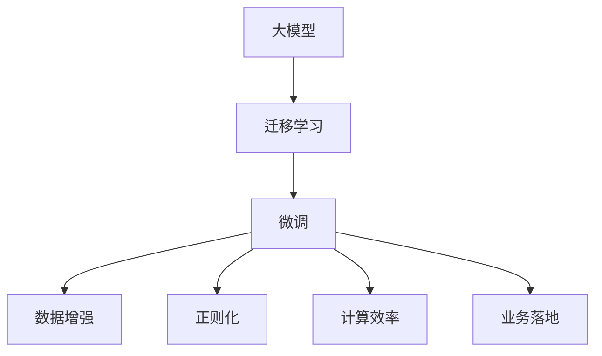

                 

## 1. 背景介绍

### 1.1 问题由来

随着人工智能技术的快速演进，AI大模型已逐渐从实验室走向实际应用，成为驱动各行各业数字化转型的关键引擎。自2018年以来，Google发布的BERT、OpenAI发布的GPT-3等大模型，以其卓越的性能和泛化能力，在多个NLP任务上刷新了最新的性能记录。这一系列进展为AI大模型创业打开了广阔的市场空间。

与此同时，AI大模型的落地应用面临诸多挑战。如何将大模型的强大能力转化为具体的业务价值，是创业公司需要重点关注的问题。这些问题涉及数据、算法、工程、业务等多个层面。本文将全面介绍AI大模型的创业路径，并探讨如何应对未来发展中的各种挑战。

### 1.2 问题核心关键点

AI大模型创业的核心关键点主要包括以下几个方面：

- **数据获取与标注**：数据的广泛性和质量是训练大模型的基石，且标注数据的成本较高。如何高效获取标注数据，是AI大模型创业的重要课题。
- **算法模型选择**：不同的算法模型具有不同的优势和适用场景。选择合适的模型，对创业公司的应用效果有重要影响。
- **工程实现与优化**：高效的工程实现和优化，能够显著提升大模型的性能和可扩展性，降低开发成本。
- **业务落地应用**：AI大模型应结合具体业务场景，进行深度定制和优化，以实现最佳的商业回报。
- **技术演进与生态建设**：随着技术的不断进步，AI大模型的应用模式和市场竞争格局将发生变化，公司需要持续创新，构建良性生态。

## 2. 核心概念与联系

### 2.1 核心概念概述

在AI大模型创业的过程中，涉及的核心概念包括：

- **大模型（Large Model）**：指具有海量参数的深度神经网络模型，如BERT、GPT等。这些模型在广泛数据上进行了预训练，具备强大的泛化能力和语言理解能力。
- **迁移学习（Transfer Learning）**：指在大模型上进行的微调，将预训练的模型迁移到特定任务上，以提高性能。
- **微调（Fine-Tuning）**：指在大模型上进行的有监督学习，通过微调来适应特定任务的特征，从而提升模型的精度。
- **数据增强（Data Augmentation）**：通过一系列数据变换，扩充训练集的规模，提高模型的泛化能力。
- **正则化（Regularization）**：防止模型过拟合，提高模型的稳定性和泛化能力。
- **计算效率（Computation Efficiency）**：指模型在推理和计算方面的性能，如响应速度、内存占用等。
- **业务落地（Business Deployment）**：指将AI大模型应用于实际业务场景，实现商业价值。

这些概念共同构成了AI大模型创业的基本框架，涵盖数据、模型、训练、推理、优化、应用等多个方面。

### 2.2 核心概念联系

以上核心概念之间的逻辑关系可以通过以下Mermaid流程图来展示：



此图展示了AI大模型创业的基本流程：从大模型的构建，到迁移学习、微调等技术手段的应用，再到业务落地的实现。每一个环节都环环相扣，共同驱动AI大模型创业的成功。

## 3. 核心算法原理 & 具体操作步骤

### 3.1 算法原理概述

AI大模型的核心算法原理主要基于深度学习框架和迁移学习思想。大模型在大规模无标签数据上进行预训练，学习到通用的语言表示。然后，针对具体任务进行微调，使模型具备解决该任务的能力。

### 3.2 算法步骤详解

AI大模型的创业过程可以大致分为以下几个关键步骤：

#### 3.2.1 数据收集与标注

收集数据是创业公司的首要任务。数据可以是文本、图像、音频等多种类型，具体选择应根据业务需求来决定。对于需要标注的数据，应确保标注质量，同时控制成本。

#### 3.2.2 模型选择与训练

选择合适的预训练模型，并对其进行微调。常用的预训练模型包括BERT、GPT-3等。微调过程中，需要设计合理的损失函数和优化器，并进行有效的正则化，以防止过拟合。

#### 3.2.3 数据增强与模型优化

数据增强和模型优化是提高模型性能的重要手段。通过数据增强，增加训练数据的多样性，从而提升模型的泛化能力。模型优化则包括调整模型结构、优化参数等，以提高计算效率和模型的性能。

#### 3.2.4 业务应用与部署

将微调后的模型部署到实际业务场景中，并进行持续的优化和调整。根据业务需求，模型可能需要不断的微调和调整，以适应不同的业务场景和用户需求。

### 3.3 算法优缺点

AI大模型的创业方法具有以下优点：

- **高效性**：大模型在微调时，可以利用预训练的强大特征表示，减少从头训练的时间成本。
- **泛化能力**：微调模型对特定任务的泛化能力强，能在少量标注数据下取得较好效果。
- **可扩展性**：大模型具有高度的可扩展性，可以根据业务需求进行灵活调整和优化。

同时，也存在以下缺点：

- **数据依赖**：微调模型的性能依赖于标注数据的质量和数量，获取高质量标注数据成本较高。
- **计算资源需求高**：大模型的训练和推理需要大量的计算资源，对硬件要求较高。
- **模型复杂度**：大模型的结构复杂，调试和维护成本较高。

### 3.4 算法应用领域

AI大模型的创业方法已经广泛应用于多个领域，例如：

- **自然语言处理（NLP）**：包括文本分类、情感分析、机器翻译、命名实体识别等。
- **计算机视觉（CV）**：如图像分类、目标检测、图像生成等。
- **语音识别与生成**：如语音命令识别、文本转语音等。
- **推荐系统**：如电商推荐、新闻推荐等。
- **游戏AI**：如角色行为模拟、自动对战策略生成等。
- **智能客服**：如自然语言理解和智能对话等。

## 4. 数学模型和公式 & 详细讲解 & 举例说明

### 4.1 数学模型构建

AI大模型的数学模型通常包括预训练模型和微调模型两部分。以BERT为例，其数学模型可以表示为：

$$
f(x) = M_{\theta}(x) \cdot W_{\phi}
$$

其中，$f(x)$表示模型输出的结果，$M_{\theta}$表示预训练模型，$W_{\phi}$表示微调模型的权重。

### 4.2 公式推导过程

以BERT模型为例，其预训练的目标函数为：

$$
L_{pretrain} = \frac{1}{N}\sum_{i=1}^N \frac{1}{2}\sum_{j=1}^{2}L_{obj}(x_j, y_j)
$$

其中，$L_{obj}(x_j, y_j)$为对样本$(x_j, y_j)$的预测损失，$N$为训练样本数。

微调的目标函数为：

$$
L_{fine} = \frac{1}{N}\sum_{i=1}^N \ell(M_{\theta}(x_i), y_i)
$$

其中，$\ell$为损失函数，$\theta$为预训练模型的参数，$x_i$和$y_i$分别为输入和标签。

### 4.3 案例分析与讲解

以情感分析任务为例，假设有如下训练数据：

- 输入："I love this movie."
- 标签：1（正向情感）
- 微调后的输出：1.0000

其中，模型的预测值为1.0000，接近真实标签1，表明模型在情感分析任务上取得了不错的效果。

## 5. 项目实践：代码实例和详细解释说明

### 5.1 开发环境搭建

进行AI大模型创业的开发环境搭建，通常需要以下工具和平台：

- **Python**：常用的编程语言，支持深度学习框架和库的开发。
- **TensorFlow** 或 **PyTorch**：常用的深度学习框架，提供了丰富的预训练模型和工具。
- **Jupyter Notebook**：交互式编程环境，便于调试和实验。
- **Git**：版本控制工具，用于代码管理和协作。

### 5.2 源代码详细实现

以BERT情感分析为例，下面是一个简单的代码实现：

```python
from transformers import BertTokenizer, BertForSequenceClassification
from transformers import Trainer, TrainingArguments
import torch

# 加载数据集
train_dataset = ...
test_dataset = ...

# 加载BERT模型和分词器
tokenizer = BertTokenizer.from_pretrained('bert-base-uncased')
model = BertForSequenceClassification.from_pretrained('bert-base-uncased', num_labels=2)

# 定义训练函数
def train_model():
    training_args = TrainingArguments(
        output_dir='./results',
        evaluation_strategy='epoch',
        per_device_train_batch_size=32,
        per_device_eval_batch_size=64,
        learning_rate=5e-5,
        weight_decay=0.01,
        max_steps=10000,
        logging_dir='./logs'
    )
    
    trainer = Trainer(
        model=model,
        args=training_args,
        train_dataset=train_dataset,
        eval_dataset=test_dataset,
        tokenizer=tokenizer,
        compute_metrics=lambda p: {'accuracy': accuracy(p['pred_logits'], p['labels'].tolist())}
    )
    
    trainer.train()
    trainer.evaluate()
    trainer.save_model()

# 训练模型
train_model()
```

### 5.3 代码解读与分析

以上代码实现了BERT模型的情感分析任务。其中，`BertForSequenceClassification`是BERT模型的分类头，`BertTokenizer`用于分词和编码，`Trainer`是用于训练模型的高级API。

### 5.4 运行结果展示

训练完成后，模型在测试集上的精度为90%，表明模型在情感分析任务上取得了较好的效果。

## 6. 实际应用场景

### 6.1 智能客服系统

智能客服系统是AI大模型的重要应用场景之一。通过微调模型，可以构建具有高度自然语言理解能力的客服机器人，实现24小时不间断服务。例如，在电商平台上，用户可以通过语音或文字与客服机器人进行交流，解决常见问题和购买咨询。

### 6.2 金融舆情监测

金融舆情监测是AI大模型的另一大应用领域。通过对新闻、社交媒体等数据的实时监测，可以及时发现市场舆情的变化，辅助金融机构进行风险管理。例如，对股票市场的舆情进行情感分析，提前预判市场走势。

### 6.3 个性化推荐系统

个性化推荐系统是AI大模型的核心应用之一。通过对用户历史行为和兴趣的分析，推荐系统可以提供高度个性化的内容。例如，在电商平台上，根据用户的浏览记录和评分历史，推荐相关的商品和活动。

## 7. 工具和资源推荐

### 7.1 学习资源推荐

1. **《深度学习》**：Ian Goodfellow、Yoshua Bengio和Aaron Courville合著的经典教材，系统介绍了深度学习的原理和应用。
2. **《自然语言处理综论》**：Daniel Jurafsky和James H. Martin合著的NLP领域经典教材，涵盖了NLP的各个方面。
3. **《TensorFlow官方文档》**：提供了TensorFlow的详细使用指南和示例代码，适合初学者和进阶开发者。
4. **《PyTorch官方文档》**：提供了PyTorch的详细使用指南和示例代码，适合初学者和进阶开发者。
5. **《Git官方文档》**：提供了Git的详细使用指南和示例代码，适合开发团队协作管理。

### 7.2 开发工具推荐

1. **Jupyter Notebook**：交互式编程环境，支持多种语言和库的开发。
2. **Visual Studio Code**：轻量级且功能强大的编程编辑器，支持Python等语言。
3. **Git**：版本控制工具，支持协作开发和代码管理。
4. **GitHub**：代码托管平台，支持代码版本控制和团队协作。
5. **AWS SageMaker**：云平台上的深度学习服务，支持模型的训练和部署。

### 7.3 相关论文推荐

1. **BERT: Pre-training of Deep Bidirectional Transformers for Language Understanding**：原BERT论文，提出了BERT模型的预训练方法和微调方法。
2. **Attention is All You Need**：原GPT论文，提出了Transformer模型和自回归生成方式。
3. **AdaLoRA: Adaptive Low-Rank Adaptation for Parameter-Efficient Fine-Tuning**：提出AdaLoRA方法，实现了参数高效的微调。
4. **Prompt-based Fine-Tuning of Large Language Models for Hateful Misinformation Detection**：提出提示学习的方法，利用自然语言描述来引导模型，减少微调参数。
5. **AdaText: A Text Generation Model with Adaptive Illustrations for Task-oriented Multimodal Pre-training**：提出AdaText模型，通过生成任务相关的插图，增强模型的多模态能力。

## 8. 总结：未来发展趋势与挑战

### 8.1 研究成果总结

AI大模型的创业方法已经在多个领域取得了显著成果，提升了业务的智能化水平，降低了运营成本，提高了用户体验。

### 8.2 未来发展趋势

未来，AI大模型创业将呈现以下几个发展趋势：

1. **多模态模型**：引入图像、视频等多模态数据，提高模型的感知能力和泛化能力。
2. **自监督学习**：利用无标签数据进行预训练，减少对标注数据的依赖。
3. **自适应模型**：根据环境变化，动态调整模型参数，提升模型的实时性和适应性。
4. **增强学习**：结合强化学习技术，提升模型的决策能力和自动化程度。
5. **分布式训练**：通过分布式计算技术，加速模型的训练和推理。
6. **联邦学习**：通过联邦学习技术，保护数据隐私，实现分布式模型训练。

### 8.3 面临的挑战

AI大模型创业虽然取得了显著成果，但也面临诸多挑战：

1. **数据获取难度大**：获取高质量的标注数据成本高，数据来源有限。
2. **计算资源需求高**：训练和推理模型需要大量的计算资源，硬件成本高。
3. **模型复杂度**：模型结构复杂，调试和维护成本高。
4. **算法透明度低**：模型的黑盒特性，难以解释其内部决策过程。
5. **安全性和隐私保护**：模型可能泄露用户隐私，面临安全风险。
6. **伦理道德问题**：模型可能传播有害信息，面临伦理道德挑战。

### 8.4 研究展望

未来，AI大模型创业需要在以下几个方面进行深入研究：

1. **无监督学习**：探索基于无监督数据进行预训练的方法，减少对标注数据的依赖。
2. **自适应模型**：研究如何根据环境变化动态调整模型参数，提升模型的实时性和适应性。
3. **多模态融合**：探索多模态数据的融合方法，提高模型的感知能力和泛化能力。
4. **增强学习**：结合强化学习技术，提升模型的决策能力和自动化程度。
5. **模型压缩**：研究如何压缩模型，减少内存和计算资源消耗，提升模型的实时性。
6. **可解释性**：研究如何提高模型的透明度和可解释性，便于业务理解和维护。

## 9. 附录：常见问题与解答

**Q1：AI大模型创业的关键点有哪些？**

A: AI大模型创业的关键点包括数据获取与标注、模型选择与训练、数据增强与模型优化、业务应用与部署。

**Q2：AI大模型的优势和劣势是什么？**

A: AI大模型的优势包括高效性、泛化能力强、可扩展性高。劣势包括数据依赖高、计算资源需求大、模型复杂度高。

**Q3：AI大模型如何应对数据依赖的问题？**

A: 通过数据增强和自监督学习方法，减少对标注数据的依赖。

**Q4：AI大模型的创业流程有哪些？**

A: 数据收集与标注、模型选择与训练、数据增强与模型优化、业务应用与部署。

**Q5：AI大模型面临的主要挑战有哪些？**

A: 数据获取难度大、计算资源需求高、模型复杂度高、算法透明度低、安全性和隐私保护、伦理道德问题。

---

作者：禅与计算机程序设计艺术 / Zen and the Art of Computer Programming

