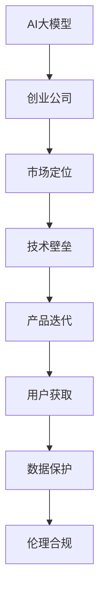

                 

# AI大模型创业：如何应对未来竞争对手？

> 关键词：AI大模型,创业,竞争策略,市场定位,技术壁垒,产品迭代,用户获取,数据保护,伦理合规

## 1. 背景介绍

随着人工智能(AI)技术的飞速发展，大模型已成为科技创新的焦点。AI大模型以其强大的数据处理和决策能力，在医疗、金融、教育、零售、自动驾驶等多个领域展现出巨大的商业潜力。越来越多的创业公司看到了AI大模型巨大的市场机会，纷纷涌入这个领域，试图抓住这个“风口”。但随之而来的是激烈的市场竞争，如何应对未来的竞争对手，成为每一位AI大模型创业者必须深思的问题。

### 1.1 行业现状与挑战

AI大模型领域正处于快速变革的阶段。一方面，巨头的介入使得市场竞争加剧，无论是BAT还是Google、Microsoft等科技巨头，都开始布局AI大模型技术，并推出各自的解决方案。另一方面，创业公司层出不穷，通过创新技术和灵活的商业模式，逐步蚕食大公司的市场份额。

当前行业主要面临以下挑战：

1. **技术竞争激烈**：各大公司纷纷投入巨资研发新一代AI大模型，在算法、模型规模、计算能力等方面不断突破。技术迭代速度加快，创业公司需要紧跟行业前沿，持续进行技术创新。
2. **市场规模有限**：虽然AI大模型前景广阔，但目前规模尚小，实际应用场景有限，如何拓展市场份额，成为创业公司的首要任务。
3. **数据安全和隐私保护**：AI大模型的训练依赖大量数据，数据隐私和安全问题不容忽视，如何合法合规地获取和使用数据，成为创业公司必须面对的重要课题。
4. **伦理合规要求高**：AI大模型在决策过程中可能存在偏见和歧视，如何确保模型公正、透明、可解释，符合伦理规范，是一个重要的研究方向。

## 2. 核心概念与联系

### 2.1 核心概念概述

在讨论如何应对未来竞争对手之前，我们需要先理解几个关键概念：

- **AI大模型**：指使用深度学习技术，经过大规模数据训练得到的具有较强通用学习能力的模型，如BERT、GPT-3等。
- **创业公司**：指在新兴技术领域创立的公司，通常规模较小、灵活性高，通过创新技术迅速占领市场。
- **市场定位**：指公司在其所处市场中的角色和定位，包括目标用户、产品差异化、竞争策略等。
- **技术壁垒**：指公司独有的技术优势，如专利、算法、数据资源等，用于保持市场竞争优势。
- **产品迭代**：指公司对产品进行持续优化和升级，以满足市场需求和技术发展的趋势。
- **用户获取**：指通过各种手段吸引用户使用产品，包括市场推广、用户体验优化等。
- **数据保护**：指保护用户隐私和数据安全，避免数据泄露和滥用，符合相关法律法规。
- **伦理合规**：指公司运营过程中遵循伦理和法律规范，确保产品和服务符合社会价值观和法律要求。

这些概念构成了AI大模型创业的基础框架，理解其内涵有助于制定有效的竞争策略。

### 2.2 核心概念原理和架构的 Mermaid 流程图



该流程图展示了AI大模型创业中各环节的相互关系。创业公司需明确自身市场定位，构建强大的技术壁垒，持续进行产品迭代，有效获取用户，确保数据安全，遵守伦理规范，才能在激烈的市场竞争中脱颖而出。

## 3. 核心算法原理 & 具体操作步骤

### 3.1 算法原理概述

AI大模型的创业核心在于构建和应用高质量的AI大模型，提供优质的AI服务，以竞争优势赢得市场。其核心算法原理包括但不限于：

- **深度学习框架**：如TensorFlow、PyTorch等，为模型训练和推理提供基础支持。
- **优化算法**：如Adam、SGD等，用于提高模型训练效率和收敛速度。
- **数据处理技术**：如数据清洗、特征工程、数据增强等，用于提升模型训练质量。
- **分布式计算**：如GPU、TPU等高性能计算资源，用于支持大规模模型训练和推理。
- **迁移学习**：利用预训练模型，在小规模数据上进行微调，提升模型效果。

### 3.2 算法步骤详解

AI大模型的创业大致分为以下步骤：

1. **市场调研**：分析目标市场和用户需求，明确公司定位和目标用户群体。
2. **技术选型**：根据市场定位选择合适的深度学习框架和算法，构建技术团队。
3. **模型训练**：使用大规模数据训练AI大模型，并在实际应用中不断优化模型参数。
4. **产品开发**：将AI大模型嵌入到产品中，开发用户界面和API，提升用户体验。
5. **市场推广**：通过社交媒体、SEO、SEM等渠道，推广产品和服务，获取用户。
6. **持续优化**：根据用户反馈和市场需求，持续优化产品和服务，提升竞争力。

### 3.3 算法优缺点

**优点**：
- **高效性**：利用AI大模型的通用学习能力，可以在短时间内获得高性能模型。
- **灵活性**：可以根据市场需求快速迭代产品，灵活应对变化。
- **高价值**：AI大模型在医疗、金融、教育等领域具有广泛应用，商业潜力巨大。

**缺点**：
- **技术门槛高**：深度学习和分布式计算等技术要求高，需要专业人才。
- **数据依赖**：模型训练和优化依赖大量高质量数据，获取难度大。
- **风险高**：竞争激烈，技术更新快，难以长期保持竞争优势。
- **伦理风险**：AI模型存在偏见和歧视，可能引发社会和伦理问题。

### 3.4 算法应用领域

AI大模型在多个领域有着广泛的应用，如：

- **医疗**：辅助诊断、药物研发、个性化治疗等。
- **金融**：风险评估、信用评分、智能投顾等。
- **教育**：个性化教学、作业批改、学习分析等。
- **零售**：推荐系统、价格优化、库存管理等。
- **自动驾驶**：环境感知、决策规划、路径优化等。

## 4. 数学模型和公式 & 详细讲解 & 举例说明

### 4.1 数学模型构建

假设我们有n个训练样本 $(x_1, y_1), (x_2, y_2), \ldots, (x_n, y_n)$，其中 $x_i \in \mathcal{X}$ 为输入， $y_i \in \mathcal{Y}$ 为输出，我们的目标是通过深度学习模型 $\mathcal{M}$ 来拟合数据，使得损失函数 $\mathcal{L}$ 最小化：

$$
\min_{\mathcal{M}} \mathcal{L} = \frac{1}{n}\sum_{i=1}^n \mathcal{L}(x_i, \mathcal{M}(x_i))
$$

常用的损失函数包括交叉熵损失、均方误差损失等。对于分类任务，常用交叉熵损失函数：

$$
\mathcal{L}(x, \hat{y}) = -\frac{1}{n}\sum_{i=1}^n y_i \log \mathcal{M}(x_i)
$$

其中，$\mathcal{M}(x_i)$ 表示模型在输入 $x_i$ 下的预测输出。

### 4.2 公式推导过程

以二分类任务为例，假设模型使用二分类逻辑回归：

$$
\mathcal{M}(x_i) = \sigma(\mathbf{w}^T \varphi(x_i) + b)
$$

其中，$\sigma$ 为 sigmoid 函数，$\mathbf{w}$ 为权重向量，$\varphi(x_i)$ 为输入的特征映射。模型输出的概率为：

$$
\mathcal{M}(x_i) = \frac{1}{1+\exp(-\mathbf{w}^T \varphi(x_i) - b)}
$$

交叉熵损失函数可表示为：

$$
\mathcal{L}(x_i, \hat{y}) = -(y_i \log \mathcal{M}(x_i) + (1-y_i) \log (1-\mathcal{M}(x_i)))
$$

### 4.3 案例分析与讲解

假设我们要训练一个情感分析模型，使用一个包含1000个标注样本的数据集，每条样本有5个特征。我们使用随机梯度下降算法进行优化：

1. **数据预处理**：将数据标准化，归一化特征值，处理缺失值和异常值。
2. **模型初始化**：初始化权重向量 $\mathbf{w}$ 和偏置项 $b$，通常使用随机值。
3. **前向传播**：将每个样本输入模型，计算预测概率 $\mathcal{M}(x_i)$。
4. **损失计算**：计算交叉熵损失 $\mathcal{L}(x_i, \hat{y})$。
5. **反向传播**：计算损失对权重向量的梯度 $\frac{\partial \mathcal{L}}{\partial \mathbf{w}}$。
6. **权重更新**：使用梯度下降更新权重向量 $\mathbf{w} \leftarrow \mathbf{w} - \eta \frac{\partial \mathcal{L}}{\partial \mathbf{w}}$，其中 $\eta$ 为学习率。
7. **迭代训练**：重复步骤3至6，直至模型收敛或达到预设的迭代次数。

## 5. 项目实践：代码实例和详细解释说明

### 5.1 开发环境搭建

以下是使用Python和TensorFlow搭建AI大模型开发环境的示例：

1. **安装TensorFlow**：
```
pip install tensorflow
```

2. **配置环境**：
```
# 设置TensorFlow版本
tf_version='2.6.0'
# 安装指定版本的TensorFlow
!pip install tensorflow==${tf_version}
```

3. **安装相关库**：
```
pip install numpy pandas sklearn tf-estimator matplotlib
```

### 5.2 源代码详细实现

以下是一个简单的情感分析模型训练代码示例：

```python
import tensorflow as tf
import numpy as np
import pandas as pd

# 准备数据
data = pd.read_csv('emotions.csv')
X = data.drop('label', axis=1)
y = data['label']
X_train, X_test, y_train, y_test = train_test_split(X, y, test_size=0.2, random_state=42)

# 定义模型
def model_fn(features, labels, mode, params):
    # 定义特征输入层
    input_layer = tf.feature_column.input_layer(features, params['feature_columns'])
    # 定义隐藏层
    hidden_layer = tf.layers.dense(input_layer, units=64, activation=tf.nn.relu)
    # 定义输出层
    output_layer = tf.layers.dense(hidden_layer, units=2, activation=None)
    # 定义预测操作
    predictions = output_layer

    # 定义损失函数
    loss = tf.losses.sparse_softmax_cross_entropy(labels=labels, logits=predictions)

    # 定义评估指标
    eval_metric_ops = {
        'accuracy': tf.metrics.accuracy(labels=labels, predictions=tf.argmax(predictions, axis=1))
    }

    if mode == tf.estimator.ModeKeys.TRAIN:
        # 定义优化器
        optimizer = tf.train.AdamOptimizer(learning_rate=0.001)
        # 定义训练操作
        train_op = optimizer.minimize(loss, global_step=tf.train.get_global_step())
        return tf.estimator.EstimatorSpec(mode=mode, loss=loss, train_op=train_op)
    elif mode == tf.estimator.ModeKeys.EVAL:
        return tf.estimator.EstimatorSpec(mode=mode, loss=loss, eval_metric_ops=eval_metric_ops)
    elif mode == tf.estimator.ModeKeys.PREDICT:
        return tf.estimator.EstimatorSpec(mode=mode, predictions=predictions)

# 定义特征列
feature_columns = [tf.feature_column.numeric_column('feature'), tf.feature_column.categorical_column_with_vocabulary_list('label', vocabulary_list=['positive', 'negative'])]

# 定义模型
model = tf.estimator.Estimator(model_fn=model_fn, feature_columns=feature_columns)

# 训练模型
model.train(input_fn=lambda: tf.estimator.inputs.numpy_input_fn(X_train, y_train, batch_size=32), steps=1000)

# 评估模型
model.evaluate(input_fn=lambda: tf.estimator.inputs.numpy_input_fn(X_test, y_test, batch_size=32))

# 预测新样本
predictions = model.predict(input_fn=lambda: tf.estimator.inputs.numpy_input_fn(X_test, y_test, batch_size=32))
```

### 5.3 代码解读与分析

1. **数据准备**：使用Pandas库读取数据集，并进行标准化处理。
2. **模型定义**：定义一个简单的线性模型，包括输入层、隐藏层和输出层。
3. **损失函数**：使用交叉熵损失函数计算模型预测与真实标签之间的差异。
4. **评估指标**：定义模型在训练过程中的评估指标，如准确率。
5. **训练操作**：使用Adam优化器进行模型参数的更新，最小化损失函数。
6. **模型评估**：使用评估函数对模型进行评估，输出准确率等指标。
7. **预测操作**：使用预测函数对新样本进行预测。

## 6. 实际应用场景

### 6.1 医疗领域

AI大模型在医疗领域有广泛应用，如辅助诊断、药物研发、个性化治疗等。例如，可以利用大模型训练一个疾病预测模型，根据患者的医疗记录、基因信息等数据，预测其是否患病，并提供个性化的治疗建议。

### 6.2 金融领域

在金融领域，AI大模型可用于信用评分、风险评估、智能投顾等。例如，利用大模型训练一个贷款违约预测模型，根据借款人的历史还款记录、收入信息等数据，预测其是否会违约，从而优化贷款审批流程。

### 6.3 教育领域

AI大模型在教育领域也有巨大潜力，如个性化教学、作业批改、学习分析等。例如，利用大模型训练一个学习推荐系统，根据学生的学习习惯、知识掌握情况等数据，推荐个性化的学习资源，提升学习效果。

### 6.4 未来应用展望

未来，AI大模型将在更多领域得到广泛应用，带来颠覆性变革。以下是一些可能的应用场景：

1. **智慧城市**：利用AI大模型进行交通管理、能源优化、环境监测等，提升城市治理效率。
2. **农业**：利用AI大模型进行农作物病虫害预测、气象预警、种植优化等，提高农业生产效率。
3. **物流**：利用AI大模型进行路线规划、货物跟踪、仓储管理等，提升物流效率。
4. **游戏**：利用AI大模型进行智能生成内容、玩家行为分析、推荐系统等，提升游戏体验。
5. **安全**：利用AI大模型进行网络安全监测、异常行为检测、入侵检测等，提升网络安全防护能力。

## 7. 工具和资源推荐

### 7.1 学习资源推荐

1. **《深度学习入门》书籍**：由林轩田教授所著，深入浅出地介绍了深度学习的基本概念和算法。
2. **Coursera《深度学习专项课程》**：由Andrew Ng教授主讲，涵盖深度学习的理论和实践。
3. **《TensorFlow实战》书籍**：由王啸著，详细介绍了TensorFlow的使用方法和最佳实践。
4. **Kaggle竞赛平台**：提供了大量数据集和竞赛题目，适合实践和提升。
5. **GitHub开源项目**：如OpenAI的GPT-3模型、Google的BERT模型等，可供学习和研究。

### 7.2 开发工具推荐

1. **TensorFlow**：Google开源的深度学习框架，支持分布式计算和GPU加速。
2. **PyTorch**：Facebook开源的深度学习框架，灵活性和易用性高。
3. **Keras**：Keras提供了高层API，可以快速搭建深度学习模型。
4. **Jupyter Notebook**：支持数据可视化、代码执行和交互式学习，方便开发者使用。

### 7.3 相关论文推荐

1. **《Attention is All You Need》论文**：提出Transformer结构，开启了NLP领域的预训练大模型时代。
2. **《BERT: Pre-training of Deep Bidirectional Transformers for Language Understanding》论文**：提出BERT模型，引入掩码自监督预训练任务，刷新了多项NLP任务SOTA。
3. **《AlphaGo Zero》论文**：展示了AlphaGo Zero通过自我对弈进行无监督学习，取得SOTA成绩。
4. **《GPT-3》论文**：展示了GPT-3在自然语言生成、问答、翻译等任务上的突破。
5. **《AdaLoRA: Adaptive Low-Rank Adaptation for Parameter-Efficient Fine-Tuning》论文**：提出AdaLoRA方法，实现参数高效的微调，避免灾难性遗忘。

## 8. 总结：未来发展趋势与挑战

### 8.1 研究成果总结

AI大模型在多个领域取得了显著成果，特别是在医疗、金融、教育等领域，提升了效率和精度。但与此同时，也面临着技术竞争、数据获取、伦理合规等挑战。

### 8.2 未来发展趋势

未来，AI大模型将继续向更加高效、智能、普适的方向发展，主要趋势包括：

1. **算法创新**：深度学习算法不断创新，产生新的模型结构和优化方法。
2. **模型规模**：模型参数量持续增长，模型规模不断扩大。
3. **应用拓展**：在更多领域得到应用，产生更广泛的社会价值。
4. **技术合作**：公司和科研机构加强合作，共同推进AI技术发展。
5. **数据开放**：更多高质量数据集和公开数据源，促进AI技术发展。
6. **伦理规范**：建立和完善AI伦理规范，确保AI技术的应用符合社会价值观。

### 8.3 面临的挑战

AI大模型创业面临的挑战包括：

1. **技术壁垒**：如何构建和应用高质量的AI大模型，是创业公司的核心竞争力。
2. **数据获取**：如何合法合规地获取高质量的数据，是创业公司必须面对的问题。
3. **伦理合规**：AI模型的偏见和歧视可能引发伦理问题，需要严格遵守相关法律法规。
4. **市场竞争**：如何与巨头公司竞争，是创业公司必须面对的市场挑战。
5. **用户需求**：如何准确把握用户需求，提供有价值的产品和服务，是创业公司必须解决的问题。
6. **资源限制**：AI大模型的训练和部署需要大量计算资源，创业公司需要寻找合理的资源解决方案。

### 8.4 研究展望

未来，AI大模型研究的方向包括：

1. **算法优化**：进一步优化深度学习算法，提升模型训练效率和精度。
2. **模型压缩**：研究模型压缩技术，降低计算资源需求，提升模型可扩展性。
3. **数据增强**：研究数据增强技术，提升模型泛化能力和鲁棒性。
4. **迁移学习**：研究迁移学习技术，提升模型在不同任务之间的迁移能力。
5. **伦理规范**：研究AI伦理规范，确保AI技术符合社会价值观和法律法规。
6. **应用拓展**：研究AI大模型在更多领域的应用，提升社会价值。

## 9. 附录：常见问题与解答

**Q1：AI大模型创业的关键是什么？**

A: AI大模型创业的关键在于构建和应用高质量的AI大模型，提供优质的AI服务，以竞争优势赢得市场。

**Q2：AI大模型创业面临哪些主要挑战？**

A: AI大模型创业面临的主要挑战包括技术壁垒、数据获取、伦理合规、市场竞争、用户需求、资源限制等。

**Q3：如何应对未来的竞争对手？**

A: 应对未来竞争对手需要不断创新技术，加强数据获取，确保伦理合规，优化市场策略，提升用户体验，合理利用资源，建立合作伙伴关系等。

**Q4：AI大模型的伦理问题如何处理？**

A: AI大模型的伦理问题需要通过建立和完善AI伦理规范，确保模型公平、透明、可解释，符合社会价值观和法律法规。

**Q5：AI大模型如何适应不同应用场景？**

A: AI大模型需要通过迁移学习、数据增强、参数高效微调等方法，提升模型在不同应用场景中的适应能力。

总之，AI大模型创业需要综合考虑技术、市场、伦理等多个方面的因素，通过不断的创新和优化，才能在激烈的市场竞争中脱颖而出，实现商业价值和社会价值。

