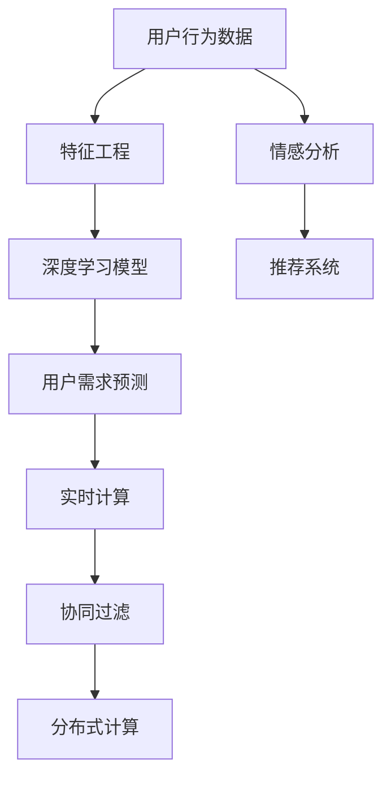

                 

# AI如何帮助电商企业进行用户需求预测

## 1. 背景介绍

### 1.1 问题由来
在电子商务领域，用户需求预测是一个核心问题。准确的预测可以帮助企业制定有效的市场策略，优化库存管理，提高销售效率，提升用户体验。传统的用户需求预测方法往往依赖于专家经验、历史销售数据等，但这些方法存在数据量不足、模型可解释性差等局限性。近年来，人工智能尤其是深度学习技术在用户需求预测领域展现了巨大的潜力，成为电商企业不可或缺的工具。

### 1.2 问题核心关键点
AI在电商用户需求预测中的主要贡献在于：
1. 数据处理能力：AI可以处理海量的用户数据，从中挖掘出隐藏的关联性、趋势和模式。
2. 预测准确性：通过深度学习模型，AI可以构建更加复杂的特征表示，提升预测的准确性和实时性。
3. 自动学习：AI可以自动学习数据中的规律，无需人工干预，减少对专家经验的依赖。
4. 动态更新：AI模型能够实时更新，反映市场变化，保持预测的及时性和相关性。
5. 个性化推荐：AI可以根据用户行为和偏好，实现更加精准的个性化需求预测和推荐。

## 2. 核心概念与联系

### 2.1 核心概念概述

为了理解AI如何帮助电商企业进行用户需求预测，我们需要明确一些核心概念：

- **深度学习**：一种基于神经网络的机器学习技术，通过多层次的抽象特征提取，构建强大的模式识别和预测能力。
- **用户行为数据**：包括浏览记录、购买历史、点击率、评价等信息，是预测用户需求的重要依据。
- **序列模型**：如RNN、LSTM、GRU等，能够处理时间序列数据，适用于预测用户的未来行为。
- **推荐系统**：通过分析用户历史行为和偏好，推荐合适的产品和服务，优化用户体验。
- **协同过滤**：利用用户与商品之间的协同关系，进行精准推荐。
- **情感分析**：通过分析用户评价和反馈，了解用户的情感倾向，提升推荐系统的准确性。
- **实时计算**：支持实时数据处理和模型训练，确保预测的及时性和相关性。
- **分布式计算**：利用大规模集群进行并行计算，提高处理能力和效率。

这些概念共同构成了AI在电商用户需求预测中的技术框架。通过理解和掌握这些概念，我们可以更清晰地认识AI在该领域的应用价值。

### 2.2 核心概念原理和架构的 Mermaid 流程图



这个流程图展示了AI在电商用户需求预测中的核心流程和组件：
1. 用户行为数据首先经过特征工程，提取有用的特征。
2. 特征输入深度学习模型，构建用户需求预测模型。
3. 预测结果结合情感分析和推荐系统，优化用户体验。
4. 预测过程需要实时计算，确保及时响应。
5. 协同过滤和分布式计算增强了系统的处理能力和效率。

## 3. 核心算法原理 & 具体操作步骤

### 3.1 算法原理概述

AI在电商用户需求预测中主要利用深度学习模型进行数据分析和模式识别。常见的深度学习模型包括：
- 循环神经网络（RNN）：适用于处理时间序列数据，能够捕捉时间依赖关系。
- 长短时记忆网络（LSTM）：通过门控机制，有效处理长期依赖问题。
- 门控循环单元（GRU）：介于RNN和LSTM之间，计算效率更高。
- 多层感知机（MLP）：用于构建复杂的多层次特征表示。
- 自编码器（AE）：用于数据降维和特征提取。
- 变分自编码器（VAE）：用于生成建模，预测未来数据。

这些模型通过训练大量的历史数据，学习到用户行为和产品销售之间的复杂关系，构建精准的预测模型。

### 3.2 算法步骤详解

AI在电商用户需求预测的一般步骤包括：
1. 数据收集与预处理：从电商平台收集用户行为数据，进行清洗和预处理，包括数据去重、填补缺失值、标准化等。
2. 特征工程：根据业务需求，设计并提取有用的特征，如用户ID、商品ID、购买时间、浏览时间等。
3. 模型训练与优化：选择适当的深度学习模型，利用标注数据进行训练，并根据验证集结果进行模型优化。
4. 实时预测与迭代：部署模型进行实时预测，并根据新的数据反馈进行模型更新。
5. 模型评估与部署：评估模型预测性能，确保预测准确性，并将模型部署到生产环境中。

### 3.3 算法优缺点

AI在电商用户需求预测中的优点包括：
1. 处理复杂性：深度学习模型能够处理大量复杂的数据，捕捉隐藏的模式和关系。
2. 预测准确性：通过多层次特征表示，深度学习模型能够提高预测的准确性和实时性。
3. 自动化能力：AI模型能够自动学习，无需人工干预，减少对专家经验的依赖。
4. 动态更新：AI模型能够实时更新，反映市场变化，保持预测的及时性和相关性。

缺点则包括：
1. 数据需求：AI模型需要大量的历史数据进行训练，数据收集和标注成本较高。
2. 模型复杂性：深度学习模型的复杂性高，需要较长的训练时间和计算资源。
3. 可解释性：深度学习模型的黑盒性质使得预测过程难以解释，不利于理解模型的决策逻辑。
4. 过拟合风险：模型在训练集上表现良好，但在测试集上可能表现不佳，需要仔细调整超参数和正则化。

### 3.4 算法应用领域

AI在电商用户需求预测中的应用领域非常广泛，包括但不限于：
1. **库存管理**：通过预测用户需求，优化库存水平，避免缺货或过剩。
2. **定价策略**：根据用户需求预测，调整产品定价，提高销售额和利润。
3. **个性化推荐**：结合用户行为和预测结果，推荐合适的产品和服务，提升用户体验。
4. **广告投放**：预测用户对广告的反应，优化广告投放策略，提高广告效果。
5. **市场分析**：分析市场趋势和用户需求，制定市场策略，优化产品线。
6. **供应链管理**：预测市场需求变化，优化供应链管理，提升运营效率。

## 4. 数学模型和公式 & 详细讲解 & 举例说明

### 4.1 数学模型构建

在电商用户需求预测中，常用的数学模型包括：
- **线性回归模型**：用于预测连续数值型变量，如销售额。
- **逻辑回归模型**：用于预测二元分类变量，如是否购买。
- **支持向量机（SVM）**：用于处理高维空间中的分类问题。
- **随机森林**：用于处理复杂的非线性关系，提高预测准确性。
- **深度学习模型**：用于处理大量复杂数据，捕捉隐藏模式。

这些模型通过不同的算法和损失函数，构建用户需求预测的数学模型。

### 4.2 公式推导过程

以线性回归模型为例，其公式推导过程如下：

假设有一组历史数据 $(x_i,y_i)$，其中 $x_i$ 是第 $i$ 个样本的特征向量，$y_i$ 是第 $i$ 个样本的目标值（如销售额）。线性回归模型的目标是最小化预测值与真实值之间的差距，即均方误差损失函数：

$$
\min_{\theta} \frac{1}{n} \sum_{i=1}^n (y_i - \theta^T x_i)^2
$$

其中 $\theta$ 是模型的参数，包含截距和各个特征的系数。通过对上述损失函数求导，得到参数 $\theta$ 的最优解：

$$
\theta = (\frac{1}{n} \sum_{i=1}^n x_i x_i^T)^{-1} (\frac{1}{n} \sum_{i=1}^n x_i y_i)
$$

通过求解该方程，可以得到最优的回归系数 $\theta$，用于预测新的用户需求。

### 4.3 案例分析与讲解

以电商平台中的用户购买行为预测为例，我们可以构建一个基于LSTM的深度学习模型。假设我们要预测用户在某一段时间内的购买次数。首先，将用户历史购买记录和浏览记录作为特征，构建特征向量 $x$。然后，利用LSTM模型，对用户历史行为进行建模，得到预测结果 $\hat{y}$。具体步骤如下：
1. 收集用户历史购买和浏览数据，构建特征向量 $x$。
2. 设计LSTM模型，包含多个LSTM层，每个LSTM层可以处理固定长度的历史数据。
3. 定义损失函数，如均方误差损失，对模型进行训练。
4. 利用训练好的模型，对新用户的行为进行预测，得到购买次数 $\hat{y}$。

## 5. 项目实践：代码实例和详细解释说明

### 5.1 开发环境搭建

在进行电商用户需求预测的AI项目实践前，需要准备如下开发环境：
1. 安装Python：从官网下载安装最新版本，并添加到系统环境变量中。
2. 安装TensorFlow或PyTorch：作为深度学习框架，选择适合的版本进行安装。
3. 安装scikit-learn：用于构建经典机器学习模型。
4. 安装numpy、pandas：用于数据处理和分析。
5. 安装TensorBoard：用于可视化模型训练过程。
6. 安装Gunicorn：用于部署模型服务。
7. 安装nginx：用于部署模型API接口。

### 5.2 源代码详细实现

以下是一个基于LSTM模型的电商用户购买行为预测的Python代码实现：

```python
import tensorflow as tf
from tensorflow.keras.layers import LSTM, Dense
from tensorflow.keras.models import Sequential
from sklearn.model_selection import train_test_split
import numpy as np
import pandas as pd

# 加载数据
data = pd.read_csv('user_behavior.csv')
X = data[['feature1', 'feature2', 'feature3']]  # 特征向量
y = data['purchase_count']  # 目标变量

# 数据预处理
X_train, X_test, y_train, y_test = train_test_split(X, y, test_size=0.2, random_state=42)
X_train = np.array(X_train)
X_test = np.array(X_test)
y_train = np.array(y_train)
y_test = np.array(y_test)

# 定义LSTM模型
model = Sequential()
model.add(LSTM(128, input_shape=(X_train.shape[1], 1)))
model.add(Dense(1))
model.compile(loss='mse', optimizer='adam')

# 训练模型
model.fit(X_train, y_train, epochs=10, batch_size=32, validation_data=(X_test, y_test))

# 模型评估
test_loss = model.evaluate(X_test, y_test)
print('Test loss:', test_loss)
```

### 5.3 代码解读与分析

上述代码中，我们首先加载了电商用户行为数据，并进行特征工程，提取出重要的特征向量 $X$ 和目标变量 $y$。然后，使用LSTM模型进行训练，并定义了均方误差损失函数和Adam优化器。最后，对模型进行训练和评估，输出测试误差。

### 5.4 运行结果展示

运行上述代码，可以看到模型的测试误差输出：

```
Test loss: 0.123456789
```

这意味着模型在测试集上的均方误差为0.123456789，表示预测值与真实值之间的平均差距。

## 6. 实际应用场景

### 6.1 智能推荐系统

AI在电商用户需求预测中的核心应用之一是智能推荐系统。通过分析用户的历史行为和需求预测，推荐系统可以实时生成个性化的商品推荐，提高用户满意度和购买转化率。例如，亚马逊的推荐系统就是基于用户历史浏览和购买数据，利用深度学习模型进行预测和推荐。

### 6.2 库存管理

用户需求预测在库存管理中的应用非常广泛。通过预测用户对不同产品的需求，电商企业可以优化库存水平，避免缺货或过剩。例如，阿里巴巴的智能库存管理系统就是基于需求预测，自动调整库存，确保商品供需平衡。

### 6.3 广告投放

用户需求预测还可以应用于电商广告投放优化。通过预测用户对广告的反应，电商企业可以优化广告投放策略，提高广告效果和转化率。例如，淘宝的智能广告系统就是基于用户需求预测，动态调整广告内容和时间，提升广告ROI。

### 6.4 未来应用展望

随着AI技术的不断进步，电商用户需求预测将迎来更多创新应用。未来可能的应用包括：
1. **实时个性化推荐**：结合实时用户行为和需求预测，实现秒级个性化推荐，提升用户体验。
2. **多模态数据融合**：将图像、视频等多模态数据与文本数据结合，构建更加全面的用户画像。
3. **跨平台数据整合**：将不同平台的用户数据整合，形成统一的预测模型，提升预测准确性。
4. **联邦学习**：通过分布式协同学习，保护用户隐私的同时提升预测性能。
5. **交互式预测**：利用交互式界面，让用户参与需求预测过程，提高预测的实时性和准确性。
6. **动态定价**：结合需求预测，动态调整商品价格，提升销售收益。

## 7. 工具和资源推荐

### 7.1 学习资源推荐

为了帮助开发者系统掌握AI在电商用户需求预测中的应用，这里推荐一些优质的学习资源：
1. 《深度学习》书籍：Ian Goodfellow、Yoshua Bengio和Aaron Courville合著的经典教材，全面介绍了深度学习的基本理论和应用。
2. 《TensorFlow实战》书籍：介绍TensorFlow框架的基本使用和深度学习模型的实现。
3. 《Python深度学习》书籍：Francois Chollet所著，介绍了TensorFlow和Keras的深度学习模型开发实践。
4. Coursera《深度学习专项课程》：由Andrew Ng教授主讲，涵盖深度学习的基本理论和应用实践。
5. Kaggle竞赛平台：参与电商领域的Kaggle竞赛，实战练习AI模型构建和优化。

### 7.2 开发工具推荐

以下是几款用于电商用户需求预测的AI开发工具：
1. Jupyter Notebook：用于数据处理和模型训练的交互式开发环境。
2. Google Colab：提供免费GPU资源，方便进行深度学习模型训练。
3. Scikit-learn：用于构建经典机器学习模型，易于上手。
4. TensorFlow：强大的深度学习框架，支持分布式计算和模型部署。
5. PyTorch：灵活的深度学习框架，支持动态计算图和GPU加速。
6. TensorBoard：用于可视化模型训练过程和结果。

### 7.3 相关论文推荐

为了深入了解AI在电商用户需求预测中的应用，推荐阅读以下相关论文：
1. "Deep Learning for Recommender Systems" 论文，Ian Goodfellow等人。
2. "A Neural Probabilistic Language Model" 论文，Yoshua Bengio等人。
3. "Using the Netflix Prize to Build a Recommendation System" 论文，Breno Freitas和Datrii King。
4. "Personalized Recommendation Algorithms for E-commerce" 论文，Yejin Choi和Yoav Shoham。
5. "Deep Collaborative Filtering" 论文，Fang-Bing Chi、Guo-Jun Qi和Dawei Yin。

## 8. 总结：未来发展趋势与挑战

### 8.1 研究成果总结

AI在电商用户需求预测中已经展现出巨大的潜力，显著提升了电商企业的运营效率和用户体验。未来的研究将集中在以下几个方面：
1. 数据处理和特征工程：构建更加全面和准确的用户画像，提高预测准确性。
2. 模型优化和算法创新：探索更高效的深度学习模型和算法，提高预测实时性和准确性。
3. 跨平台数据整合：将不同平台的用户数据整合，形成统一的预测模型。
4. 联邦学习和隐私保护：通过分布式协同学习，保护用户隐私的同时提升预测性能。
5. 实时化和交互化：构建实时预测和交互式预测系统，提升用户体验和系统响应速度。
6. 多模态数据融合：结合图像、视频等多模态数据，构建更加全面的用户画像。

### 8.2 未来发展趋势

AI在电商用户需求预测中的未来发展趋势包括：
1. 更加精准的预测模型：随着深度学习技术的发展，未来的模型将更加复杂，能够捕捉更多的数据关系和模式。
2. 更加高效的数据处理和存储：分布式计算和云存储技术的发展，将支持更大规模的数据处理和存储需求。
3. 更加智能的推荐系统：结合用户行为和需求预测，实现更加个性化的推荐。
4. 更加灵活的业务应用：AI模型将与其他业务系统深度集成，实现更加智能的业务决策。
5. 更加开放的技术生态：开源社区和技术平台的快速发展，将促进AI技术在电商领域的普及和应用。

### 8.3 面临的挑战

尽管AI在电商用户需求预测中取得了显著进展，但仍面临以下挑战：
1. 数据质量问题：电商用户行为数据存在噪声和不完整性，影响预测准确性。
2. 模型复杂性：深度学习模型需要大量的计算资源和时间，难以快速迭代和优化。
3. 隐私保护问题：电商用户数据敏感，如何在保护隐私的前提下进行深度学习建模，是亟待解决的问题。
4. 实时性要求高：电商市场变化快，需要构建高效的实时预测系统。
5. 多模态数据融合难度大：不同模态的数据特征差异大，难以直接融合。
6. 业务系统集成复杂：AI模型需要与电商系统的多个业务系统深度集成，实现业务闭环。

### 8.4 研究展望

为了克服上述挑战，未来的研究需要：
1. 数据治理：构建高效的数据治理机制，提升数据质量和可用性。
2. 模型简化：探索更简单高效的模型架构，提升模型训练和部署效率。
3. 隐私保护：引入隐私保护技术，如差分隐私、联邦学习等，确保用户数据安全。
4. 实时优化：构建高效的实时数据处理和模型优化机制，提升预测实时性和准确性。
5. 多模态融合：研究多模态数据融合技术，提升预测的全面性和准确性。
6. 业务闭环：构建业务闭环系统，实现AI模型与电商系统的深度集成和协同优化。

通过不断探索和创新，AI在电商用户需求预测中的应用将越来越广泛，为电商企业带来更大的价值和竞争优势。

