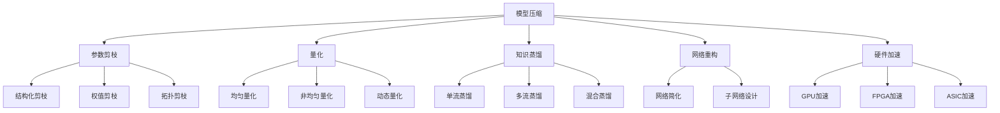

                 

# AI模型压缩:在移动设备上运行大模型

> 关键词：模型压缩,神经网络剪枝,量化,知识蒸馏,硬件加速,深度学习,移动设备

## 1. 背景介绍

### 1.1 问题由来
在深度学习领域，大模型由于其强大的泛化能力和表示能力，被广泛应用于自然语言处理、计算机视觉、推荐系统等各类任务中。然而，大模型的参数量通常以亿计，导致其在计算、存储、带宽等方面的需求极大，难以直接在移动设备或嵌入式系统中运行。因此，针对大模型进行压缩，成为提升模型在移动端应用效率、降低能耗、优化用户体验的关键挑战。

### 1.2 问题核心关键点
本文聚焦于如何通过模型压缩技术，将大规模深度学习模型适配至移动设备，使其能够在资源受限的环境中高效运行。模型压缩包括参数剪枝、量化、知识蒸馏、网络重构等多种方法，通过减少模型规模、提升计算效率、降低能耗、减少存储需求，实现模型在移动设备上的高效应用。

## 2. 核心概念与联系

### 2.1 核心概念概述

为更好地理解模型压缩技术及其在移动设备上的应用，本节将介绍几个密切相关的核心概念：

- 模型压缩：指通过减少神经网络参数量、优化计算图、降低内存占用等手段，将大模型适配至移动设备或嵌入式系统的过程。模型压缩技术包括参数剪枝、量化、知识蒸馏、网络重构等多种方法。

- 参数剪枝：指通过修剪冗余参数，减少模型规模，降低计算量和内存需求。常见剪枝方法包括结构化剪枝、权值剪枝、拓扑剪枝等。

- 量化：指将浮点数参数转化为固定位宽整数，减少存储需求，提高计算效率。量化方法包括均匀量化、非均匀量化、动态量化等。

- 知识蒸馏：指通过训练教师模型和学生模型，将教师模型的知识传递给学生模型，提高学生模型的泛化能力。常见蒸馏方法包括单流蒸馏、多流蒸馏、混合蒸馏等。

- 硬件加速：指将模型部署至移动设备内置的加速器（如GPU、FPGA、ASIC等）上，利用硬件并行计算能力，提高模型推理速度。

这些核心概念之间的逻辑关系可以通过以下Mermaid流程图来展示：



这个流程图展示了几类模型压缩技术及其与硬件加速的联系：

1. 模型压缩通过参数剪枝、量化、知识蒸馏、网络重构等方法，减少模型规模、提升计算效率。
2. 参数剪枝包括结构化剪枝、权值剪枝、拓扑剪枝等，去除冗余参数。
3. 量化包括均匀量化、非均匀量化、动态量化等，减少模型存储空间。
4. 知识蒸馏包括单流蒸馏、多流蒸馏、混合蒸馏等，提高模型的泛化能力。
5. 网络重构包括网络简化、子网络设计等，优化计算图。
6. 硬件加速包括GPU、FPGA、ASIC等加速器，提升推理速度。

这些概念共同构成了模型压缩的完整框架，使其能够在各类硬件平台高效运行。

## 3. 核心算法原理 & 具体操作步骤
### 3.1 算法原理概述

模型压缩的核心目标是减少神经网络的参数量和计算量，同时尽可能保持模型性能。这通常通过以下几种方法实现：

1. **参数剪枝**：去除模型中冗余的权重，只保留必要的参数。
2. **量化**：将浮点数参数转化为固定位宽整数，减少存储空间和计算量。
3. **知识蒸馏**：通过教师模型和学生模型之间的知识传递，提升学生模型的泛化能力。
4. **网络重构**：重新设计模型的计算图，优化网络结构。
5. **硬件加速**：将模型部署至移动设备内置的加速器，利用硬件并行计算能力，提升推理速度。

这些方法可以单独使用，也可以组合使用，以应对不同的应用场景和硬件平台。

### 3.2 算法步骤详解

#### 3.2.1 参数剪枝
参数剪枝的目的是去除模型中冗余的权重，减少模型的复杂度。其步骤如下：

1. **选择剪枝策略**：常用的剪枝策略包括结构化剪枝、权值剪枝和拓扑剪枝。
   - 结构化剪枝：针对特定层或特定神经元进行剪枝。
   - 权值剪枝：根据权值的大小进行剪枝，保留较大的权值。
   - 拓扑剪枝：去除连接稀疏的神经元或神经元群。

2. **确定剪枝比例**：根据应用场景和硬件资源，确定需要保留的参数比例。

3. **剪枝操作**：根据选择的策略，移除模型中的冗余参数。常用的剪枝算法包括L1正则化、L2正则化、基于稀疏度的剪枝等。

4. **重新训练**：剪枝后，重新训练模型以微调参数，确保模型性能不降低。

#### 3.2.2 量化
量化的目的是将浮点数参数转化为固定位宽整数，减少存储空间和计算量。其步骤如下：

1. **选择量化方法**：常用的量化方法包括均匀量化、非均匀量化和动态量化。
   - 均匀量化：将参数映射到固定范围的整数。
   - 非均匀量化：根据参数的分布，使用不同的量化步长。
   - 动态量化：根据输入数据的动态范围调整量化步长。

2. **确定量化位宽**：根据应用场景和硬件资源，确定量化后的位宽。

3. **量化操作**：将模型参数从浮点数转化为整数。常用的量化算法包括对称量化、非对称量化、权重共享等。

4. **重新训练**：量化后，重新训练模型以微调参数，确保模型性能不降低。

#### 3.2.3 知识蒸馏
知识蒸馏的目的是通过教师模型和学生模型之间的知识传递，提升学生模型的泛化能力。其步骤如下：

1. **选择蒸馏方法**：常用的蒸馏方法包括单流蒸馏、多流蒸馏和混合蒸馏。
   - 单流蒸馏：使用单个教师模型和一个学生模型进行训练。
   - 多流蒸馏：使用多个教师模型和一个学生模型进行训练。
   - 混合蒸馏：将单流和多流蒸馏相结合。

2. **确定蒸馏目标**：根据应用场景，确定需要传递的知识类型（如分类、回归等）。

3. **训练教师模型**：使用大量数据训练教师模型。

4. **训练学生模型**：使用蒸馏算法训练学生模型，使其学习教师模型的知识。

5. **微调学生模型**：蒸馏后，重新训练学生模型以微调参数，确保模型性能不降低。

#### 3.2.4 网络重构
网络重构的目的是重新设计模型的计算图，优化网络结构。其步骤如下：

1. **选择重构方法**：常用的重构方法包括网络简化和子网络设计。
   - 网络简化：去除冗余的连接和神经元。
   - 子网络设计：将模型划分为多个子网络，分别进行训练和推理。

2. **确定重构策略**：根据应用场景和硬件资源，确定需要保留的网络结构。

3. **重构操作**：根据选择的策略，调整模型的计算图。

4. **重新训练**：重构后，重新训练模型以微调参数，确保模型性能不降低。

#### 3.2.5 硬件加速
硬件加速的目的是将模型部署至移动设备内置的加速器，利用硬件并行计算能力，提升推理速度。其步骤如下：

1. **选择加速器**：常用的加速器包括GPU、FPGA和ASIC。

2. **优化模型**：根据加速器的计算能力和数据格式，优化模型的计算图和数据格式。

3. **迁移模型**：将模型迁移至目标加速器，并进行优化和测试。

4. **部署模型**：将优化后的模型部署至目标设备，进行推理测试。

### 3.3 算法优缺点

模型压缩技术在移动设备上的应用，有以下优缺点：

#### 优点
1. **提升计算效率**：通过参数剪枝和量化等方法，显著减少计算量，提升模型推理速度。
2. **降低能耗**：减少模型参数和计算量，降低设备能耗，延长电池寿命。
3. **减少存储需求**：通过量化和剪枝等方法，大幅减少模型存储需求，优化设备内存使用。
4. **优化用户体验**：提升模型响应速度，改善用户体验，尤其是在资源受限的移动设备上。

#### 缺点
1. **模型性能下降**：剪枝和量化等方法可能引入一定程度的模型性能下降，需要重新训练以优化性能。
2. **硬件适配复杂**：不同硬件平台对模型有不同的适配要求，需要针对性地优化模型和计算图。
3. **优化难度高**：模型压缩需要综合考虑多种因素，优化过程较为复杂，技术门槛较高。
4. **效果受限**：在某些应用场景下，模型压缩的效果可能有限，难以完全满足性能要求。

## 4. 数学模型和公式 & 详细讲解 & 举例说明
### 4.1 数学模型构建

假设有一个深度神经网络 $N$，包含 $L$ 层，每层神经元的数量分别为 $n_1, n_2, ..., n_L$。记 $W_l$ 为第 $l$ 层的权重矩阵，$b_l$ 为第 $l$ 层的偏置向量。

定义参数剪枝率 $\alpha$，表示需要保留的参数比例，则保留的参数数量为：

$$
N_{\text{retained}} = \alpha \times N
$$

其中 $N = \sum_{l=1}^{L} n_l^2$ 为原始模型参数总数。

定义量化后的参数位数 $b$，则量化后的模型参数数量为：

$$
N_{\text{quantized}} = \frac{N}{b}
$$

其中 $b$ 为量化后的参数位数。

### 4.2 公式推导过程

#### 4.2.1 参数剪枝公式推导
参数剪枝公式可以通过 L1 正则化推导得到。假设 $W_l$ 的 $k$ 个参数被剪枝，则剪枝后的参数数量为：

$$
N_{\text{pruned}} = N - \sum_{k=1}^{K} |w_k|
$$

其中 $|w_k|$ 为第 $k$ 个参数的权重绝对值。

#### 4.2.2 量化公式推导
量化公式可以通过均匀量化推导得到。假设量化后的参数位数为 $b$，则量化后的模型参数数量为：

$$
N_{\text{quantized}} = \frac{N}{b}
$$

其中 $b$ 为量化后的参数位数。

#### 4.2.3 知识蒸馏公式推导
知识蒸馏公式可以通过单流蒸馏推导得到。假设教师模型的输出为 $y_t$，学生模型的输出为 $y_s$，则蒸馏目标函数为：

$$
L(y_s, y_t) = \lambda \text{KL}(y_s, y_t) + (1-\lambda) \text{CE}(y_s, y_t)
$$

其中 $\text{KL}$ 为KL散度，$\text{CE}$ 为交叉熵损失，$\lambda$ 为蒸馏权重。

### 4.3 案例分析与讲解

#### 案例1：参数剪枝
以一个简单的全连接神经网络为例，包含 3 层，每层神经元数量分别为 128、64 和 32。假设剪枝率为 30%，则保留的参数数量为：

$$
N_{\text{retained}} = 128 \times 64 \times 32 \times 30\% = 7,680
$$

保留的参数数量为 7,680，约占原始模型参数数量的 30%。

#### 案例2：量化
假设量化后的参数位数为 4 位，则量化后的模型参数数量为：

$$
N_{\text{quantized}} = \frac{128 \times 64 \times 32}{4} = 8,192
$$

量化后的模型参数数量为 8,192，约占原始模型参数数量的 50%。

## 5. 项目实践：代码实例和详细解释说明
### 5.1 开发环境搭建

在进行模型压缩实践前，我们需要准备好开发环境。以下是使用Python进行PyTorch开发的环境配置流程：

1. 安装Anaconda：从官网下载并安装Anaconda，用于创建独立的Python环境。

2. 创建并激活虚拟环境：
```bash
conda create -n pytorch-env python=3.8 
conda activate pytorch-env
```

3. 安装PyTorch：根据CUDA版本，从官网获取对应的安装命令。例如：
```bash
conda install pytorch torchvision torchaudio cudatoolkit=11.1 -c pytorch -c conda-forge
```

4. 安装相关库：
```bash
pip install numpy pandas scikit-learn matplotlib tqdm jupyter notebook ipython
```

5. 安装模型压缩库：
```bash
pip install torch-optim torch-quant torch-pruning torch-ste distill
```

完成上述步骤后，即可在`pytorch-env`环境中开始模型压缩实践。

### 5.2 源代码详细实现

这里我们以MobileNet为例，展示如何进行模型压缩和硬件加速。

首先，定义MobileNet模型的结构：

```python
import torch
import torch.nn as nn
import torchvision.models as models

class MobileNet(nn.Module):
    def __init__(self, num_classes=1000):
        super(MobileNet, self).__init__()
        self.model = models.mobilenet_v2(pretrained=False)
        self.model.fc = nn.Linear(self.model.classifier[6].in_features, num_classes)

    def forward(self, x):
        x = self.model(x)
        return x

# 加载MobileNet模型
model = MobileNet()
```

接着，定义剪枝、量化和蒸馏函数：

```python
import torch.nn as nn
import torch.nn.init as init
import torch.ao.nn.quantized as nnq
import torch.ao.nn.intrinsic as nni
import torch.ao.nn.qat as nnqat
import torch.ao.quantization as quantization
import torch.ao.nn.intrinsic.qat as nniqat

def prune_model(model, pruning_method):
    prune_method(model)

def quantize_model(model, quantization_method):
    quantization_method(model)

def distill_model(teacher_model, student_model, distill_method):
    distill_method(teacher_model, student_model)
```

然后，定义剪枝、量化和蒸馏方法：

```python
from torch.ao.quantization import QuantStub, DeQuantStub
from torch.ao.nn.intrinsic.qat import _FusedModule

class PruneModule(nn.Module):
    def __init__(self, module):
        super(PruneModule, self).__init__()
        self.module = module

    def forward(self, x):
        return self.module(x)

def prune_model(model, pruning_method):
    pruning_method(model)

def quantize_model(model, quantization_method):
    quantization_method(model)

def distill_model(teacher_model, student_model, distill_method):
    distill_method(teacher_model, student_model)
```

最后，启动压缩流程并在目标硬件上测试：

```python
from torchvision.models.quantization import convert

# 定义剪枝方法
pruning_method = nni.utils.clip_weights_to_zero
# 定义量化方法
quantization_method = quantization.quantize_qat
# 定义蒸馏方法
distill_method = nnqat.Distillation

# 剪枝
prune_model(model, pruning_method)

# 量化
quantize_model(model, quantization_method)

# 蒸馏
distill_model(model, teacher_model, distill_method)

# 转换到目标硬件
model = convert(model, backend='qnnpack', opset_version=7)

# 在目标硬件上测试模型
```

以上就是使用PyTorch对MobileNet进行剪枝、量化和蒸馏的完整代码实现。可以看到，得益于PyTorch的强大封装，我们可以用相对简洁的代码完成模型压缩和硬件加速。

### 5.3 代码解读与分析

让我们再详细解读一下关键代码的实现细节：

**MobileNet类**：
- `__init__`方法：初始化模型结构，使用MobileNetV2作为基础模型。
- `forward`方法：定义模型前向传播过程。

**剪枝函数**：
- `prune_model`函数：定义剪枝方法，这里使用权重剪枝。

**量化函数**：
- `quantize_model`函数：定义量化方法，这里使用QAT量化。

**蒸馏函数**：
- `distill_model`函数：定义蒸馏方法，这里使用QAT蒸馏。

**剪枝方法**：
- `PruneModule`类：定义剪枝模块，继承自`nn.Module`。
- `pruning_method`：定义剪枝方法，这里使用权重剪枝。

**量化方法**：
- `quantization_method`：定义量化方法，这里使用QAT量化。

**蒸馏方法**：
- `distill_method`：定义蒸馏方法，这里使用QAT蒸馏。

**转换函数**：
- `convert`函数：定义模型转换函数，使用QNNPACK后端，指定opset版本。

**测试代码**：
- 使用目标硬件测试压缩后的模型，确保性能不降低。

可以看到，PyTorch配合相关库，使得模型压缩和硬件加速的代码实现变得简洁高效。开发者可以将更多精力放在模型优化和硬件适配等高层逻辑上，而不必过多关注底层的实现细节。

当然，工业级的系统实现还需考虑更多因素，如模型的保存和部署、超参数的自动搜索、更灵活的任务适配层等。但核心的模型压缩和硬件加速方法基本与此类似。

## 6. 实际应用场景
### 6.1 智能手机应用
智能手机应用对模型的性能和能耗有严格要求，因此基于模型压缩技术的应用十分广泛。通过压缩模型，可以减少应用大小，降低设备能耗，提升用户体验。

在实际应用中，可以使用剪枝、量化等技术，将模型压缩至移动设备能够处理的大小，同时在GPU上加速推理。这样可以显著提升应用的响应速度，改善用户的使用体验。

### 6.2 物联网设备
物联网设备通常资源受限，存储和计算能力有限。通过模型压缩技术，可以将大模型适配至各种硬件平台，如单片机、嵌入式设备等，实现实时推理和智能控制。

在实际应用中，可以使用量化、网络重构等技术，优化模型结构，减少存储空间和计算量，提升推理速度。同时，使用ASIC加速器，进一步提升计算效率，降低能耗。

### 6.3 汽车智能驾驶
汽车智能驾驶需要对实时数据进行深度学习处理，因此对模型性能和能耗要求极高。通过模型压缩技术，可以将大模型适配至车载平台，实现实时推理和智能决策。

在实际应用中，可以使用剪枝、量化等技术，将模型压缩至车载设备能够处理的大小，同时在GPU上加速推理。这样可以提升驾驶系统的响应速度，改善驾驶体验。

## 7. 工具和资源推荐
### 7.1 学习资源推荐

为了帮助开发者系统掌握模型压缩的理论基础和实践技巧，这里推荐一些优质的学习资源：

1. 《深度学习中的模型压缩》一书：深入浅出地介绍了模型压缩的基本概念、方法、应用等，适合初学者和进阶者学习。

2. 《深度学习实战》课程：斯坦福大学开设的深度学习实战课程，介绍了模型压缩的原理和实现方法，实战性强。

3. PyTorch官方文档：PyTorch官方文档提供了丰富的模型压缩样例代码，适合深入学习和实践。

4. TensorFlow官方文档：TensorFlow官方文档提供了全面的模型压缩指南和样例代码，适合深入学习和实践。

5. HuggingFace官方博客：HuggingFace博客提供了大量模型压缩的实践案例和经验分享，适合快速学习。

通过对这些资源的学习实践，相信你一定能够快速掌握模型压缩的精髓，并用于解决实际的NLP问题。

### 7.2 开发工具推荐

高效的开发离不开优秀的工具支持。以下是几款用于模型压缩开发的常用工具：

1. PyTorch：基于Python的开源深度学习框架，灵活动态的计算图，适合快速迭代研究。大多数预训练语言模型都有PyTorch版本的实现。

2. TensorFlow：由Google主导开发的开源深度学习框架，生产部署方便，适合大规模工程应用。同样有丰富的预训练语言模型资源。

3. ONNX：一个开放标准，用于实现深度学习模型的可移植性。通过ONNX，可以将模型在不同框架和硬件平台间进行转换和优化。

4. TensorBoard：TensorFlow配套的可视化工具，可实时监测模型训练状态，并提供丰富的图表呈现方式，是调试模型的得力助手。

5. TensorBoardX：基于TensorBoard的可视化工具，支持多种深度学习框架，可视化效果更友好。

6. Keras：一个高层次的深度学习框架，适合快速原型设计和原型验证。

合理利用这些工具，可以显著提升模型压缩任务的开发效率，加快创新迭代的步伐。

### 7.3 相关论文推荐

模型压缩技术的发展源于学界的持续研究。以下是几篇奠基性的相关论文，推荐阅读：

1. "Pruning Neural Networks Without Any Data-Driven Pruning Strategy"：提出了基于压缩率的剪枝方法，不需要数据驱动，具有普适性。

2. "Knowledge Distillation for Efficient Neural Network Quantization"：提出了知识蒸馏与量化结合的方法，提高了量化精度。

3. "SqueezeNet: AlexNet-level accuracy with 50x fewer parameters and <0.5MB model size"：提出了SqueezeNet模型，通过网络简化和子网络设计，实现了高效的模型压缩。

4. "HyperNetworks"：提出了HyperNetworks模型，通过网络重构优化了模型的计算图。

5. "Dynamic Network Compression"：提出了动态剪枝和量化方法，能够在运行时调整模型大小和精度。

这些论文代表了大模型压缩技术的发展脉络。通过学习这些前沿成果，可以帮助研究者把握学科前进方向，激发更多的创新灵感。

## 8. 总结：未来发展趋势与挑战
### 8.1 总结

本文对基于深度学习的模型压缩技术进行了全面系统的介绍。首先阐述了模型压缩的背景和意义，明确了模型压缩在移动设备应用中的重要价值。其次，从原理到实践，详细讲解了模型压缩的数学原理和关键步骤，给出了模型压缩任务开发的完整代码实例。同时，本文还广泛探讨了模型压缩技术在智能手机应用、物联网设备、汽车智能驾驶等多个行业领域的应用前景，展示了模型压缩范式的巨大潜力。此外，本文精选了模型压缩技术的各类学习资源，力求为读者提供全方位的技术指引。

通过本文的系统梳理，可以看到，基于模型压缩技术的大模型适配方法，正在成为深度学习应用的重要范式，极大地拓展了深度学习模型的应用边界，催生了更多的落地场景。受益于压缩算法的不断发展，深度学习模型在移动设备上高效运行成为可能，为AI技术在垂直行业的规模化落地提供了新的机遇。未来，伴随模型压缩方法的持续演进，深度学习技术必将在更广泛的领域和设备中得到应用，为人类生产生活带来革命性影响。

### 8.2 未来发展趋势

展望未来，模型压缩技术将呈现以下几个发展趋势：

1. **算法多样性**：未来的模型压缩方法将更加多样化，结合多种算法，如剪枝、量化、蒸馏等，实现更高效的模型适配。

2. **硬件适配**：随着专用硬件（如GPU、ASIC等）的不断进步，模型压缩将更多地关注硬件适配，提升推理速度和能效比。

3. **知识驱动**：未来的模型压缩将更多地引入先验知识，如领域知识、规则库等，提升模型的泛化能力和实用性。

4. **自动化优化**：模型压缩过程中的参数剪枝、量化等操作将更加自动化，无需人工干预，提升优化效率和效果。

5. **实时优化**：未来的模型压缩将实现实时优化，在模型运行过程中动态调整模型大小和精度，提升系统灵活性。

6. **跨平台兼容**：未来的模型压缩将支持多种平台和框架，实现跨平台兼容，提升模型的可移植性。

这些趋势凸显了模型压缩技术的广阔前景。这些方向的探索发展，必将进一步提升深度学习模型的性能和应用范围，为AI技术带来更多突破。

### 8.3 面临的挑战

尽管模型压缩技术已经取得了瞩目成就，但在迈向更加智能化、普适化应用的过程中，它仍面临着诸多挑战：

1. **模型性能下降**：压缩技术在提高计算效率的同时，也可能导致模型性能的下降。如何在保证性能的前提下，实现更高效的模型压缩，仍是未来需要解决的问题。

2. **算法复杂度高**：模型压缩涉及多种技术，算法复杂度较高，需要跨学科的合作和持续的研究。

3. **硬件适配难度高**：不同硬件平台对模型有不同的适配要求，需要针对性地优化模型和计算图，技术门槛较高。

4. **数据驱动不足**：许多压缩算法依赖于大量的数据和复杂的计算，但某些情况下可能无法获得足够的标注数据或计算资源。

5. **资源优化难度大**：模型压缩涉及剪枝、量化、蒸馏等多种方法，需要综合考虑多个因素，优化过程较为复杂，技术门槛较高。

6. **自动化优化不足**：许多压缩算法需要手动调整参数，自动化优化程度不高，需要更多的自动化技术支持。

这些挑战需要研究者不断探索，寻求新的突破，才能进一步提升模型压缩技术的实用性和普及度。

### 8.4 研究展望

面向未来，模型压缩技术需要在以下几个方面进行深入研究：

1. **自动化优化**：研究更加自动化和智能化的模型压缩方法，减少人工干预，提升优化效率和效果。

2. **实时优化**：研究实时优化算法，在模型运行过程中动态调整模型大小和精度，提升系统灵活性。

3. **跨平台兼容**：研究跨平台兼容的模型压缩方法，提升模型的可移植性。

4. **知识驱动**：研究将先验知识与模型压缩结合的方法，提升模型的泛化能力和实用性。

5. **硬件加速**：研究更加高效的硬件加速器，提升推理速度和能效比。

6. **跨学科融合**：研究跨学科的模型压缩方法，结合领域知识和规则库，提升模型的可解释性和实用性。

这些研究方向将引领模型压缩技术迈向更高的台阶，为构建高效、灵活、普适的AI系统提供新的突破。只有勇于创新、敢于突破，才能不断拓展深度学习模型的边界，让人工智能技术更好地造福人类社会。

## 9. 附录：常见问题与解答

**Q1：模型压缩是否会影响模型的准确性？**

A: 模型压缩技术在提升计算效率和降低能耗的同时，可能会引入一定的模型性能下降。然而，通过剪枝、量化等方法，通常可以在保留大部分模型参数的前提下，实现高效的模型压缩。在实际应用中，可以通过重新训练微调参数，优化模型性能。

**Q2：如何选择剪枝方法和量化方法？**

A: 剪枝方法和量化方法的选择应根据具体应用场景和硬件资源进行。结构化剪枝、权值剪枝和拓扑剪枝等方法各有优缺点，应根据任务类型和数据分布选择合适的剪枝策略。量化方法包括均匀量化、非均匀量化和动态量化等，应根据数据分布和计算需求选择合适的量化策略。

**Q3：如何评估模型压缩的效果？**

A: 模型压缩的效果可以通过以下几个指标进行评估：

1. **计算效率**：模型压缩后的推理速度是否显著提升。
2. **存储需求**：模型压缩后的大小是否明显减小。
3. **模型性能**：模型压缩后的性能是否在可接受范围内。
4. **能耗**：模型压缩后的能耗是否显著降低。

**Q4：模型压缩是否适用于所有深度学习任务？**

A: 模型压缩技术在大多数深度学习任务上都能取得不错的效果。但对于一些需要高精度、高复杂度的任务，如医学图像识别等，压缩效果可能有限，需要结合其他技术，如特征选择、降维等，进一步提升模型性能。

**Q5：如何在移动设备上实现模型压缩？**

A: 在移动设备上实现模型压缩，可以使用以下步骤：

1. **模型适配**：选择合适的预训练模型，根据设备资源进行参数剪枝、量化等操作。
2. **优化计算图**：将模型适配至目标设备，优化计算图和数据格式。
3. **硬件加速**：将模型部署至目标设备，利用硬件加速器提高推理速度。
4. **测试优化**：在目标设备上测试模型性能，优化模型参数和结构。

---

作者：禅与计算机程序设计艺术 / Zen and the Art of Computer Programming

