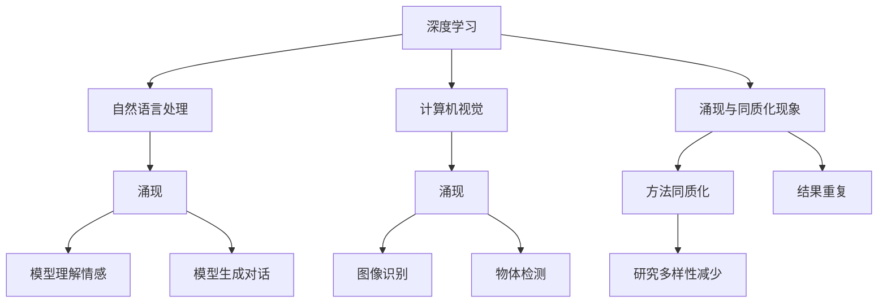

                 

# AI研究中的涌现与同质化

> 关键词：涌现(Emergence)、同质化(Homogenization)、AI模型训练、深度学习、大数据、研究方法论

## 1. 背景介绍

### 1.1 问题由来
近年来，人工智能(AI)研究在深度学习、自然语言处理(NLP)、计算机视觉等领域取得了显著进展。特别是基于深度神经网络的大规模模型，如Transformer、BERT等，凭借其强大的泛化能力和表示学习能力，在诸多任务上刷新了最先进的性能指标。然而，随着AI研究的不断深入，一个引人深思的现象逐渐浮出水面：涌现与同质化现象开始影响AI研究的前沿进展。

涌现(Emergence)是指在复杂系统中，局部规则和简单交互最终能自发产生出宏观上复杂的集体行为。在AI研究中，涌现现象体现在大型深度学习模型通过大数据训练，能够自动学习到复杂的特征和规律，甚至具备一定的认知能力。同质化(Homogenization)则是指在研究范式、方法和工具的驱使下，AI研究领域涌现出大量相似的研究方法和结果，导致研究多样性减少，创新瓶颈显现。

### 1.2 问题核心关键点
涌现与同质化现象是当前AI研究领域的重要挑战。具体表现为：
- 涌现：模型自动学习到复杂的特征，表现出一些意外的能力，如理解情感、进行自然对话等。
- 同质化：研究方法趋于一致，如均采用大模型+大规模数据预训练，导致研究成果重复，缺乏多样性。

## 2. 核心概念与联系

### 2.1 核心概念概述

为更好地理解涌现与同质化现象，我们首先介绍几个核心概念：

- 深度学习(Deep Learning)：一类基于多层神经网络的学习方法，通过多层次的非线性变换，从原始数据中自动提取高层次的特征表示，实现复杂数据的表示学习和建模。
- 自然语言处理(NLP)：研究如何使计算机处理、理解、生成自然语言，包括文本分类、机器翻译、文本生成、问答系统等任务。
- 计算机视觉(Computer Vision)：使计算机能理解、处理、分析和利用图像、视频等视觉信息，涉及图像识别、物体检测、图像生成等任务。
- 涌现(Emergence)：在系统或模型中，复杂行为由简单局部规则自发产生的过程。
- 同质化(Homogenization)：由于某种规范或趋势，研究方法、结果趋向一致，导致多样性减少。

这些概念之间的逻辑关系可以通过以下Mermaid流程图来展示：



这个流程图展示出深度学习、自然语言处理、计算机视觉等领域中的涌现现象，以及这些现象如何导致研究方法的同质化，最终使得研究多样性减少。

## 3. 核心算法原理 & 具体操作步骤
### 3.1 算法原理概述

AI研究中的涌现现象主要源于深度学习模型在大规模数据上的自我组织和自学习能力。以自然语言处理为例，模型通过在大规模文本数据上预训练，自动学习到词向量、句子结构、语义关系等复杂的特征表示，从而能够进行情感分析、文本生成、对话生成等复杂任务。这种涌现现象的核心在于模型在训练过程中的“自组织”能力，使得模型能够从无序的数据中学习到有序的知识。

同质化现象则主要源于研究方法、工具和评价指标的趋同。在AI研究中，深度学习模型被广泛采用，数据量越来越成为评价模型性能的关键指标。为了追求更高的性能，研究者普遍采用“大模型+大规模数据预训练”的范式，导致研究方法和结果趋于一致。这种同质化现象的核心在于研究范式的趋同，使得研究方法失去多样性。

### 3.2 算法步骤详解

以下是AI研究中涌现与同质化的详细操作步骤：

**Step 1: 数据收集与预处理**
- 收集高质量的标注数据，用于训练深度学习模型。
- 对数据进行清洗、去重、分词等预处理，以便模型更好地学习特征。

**Step 2: 模型选择与训练**
- 选择适合的深度学习模型（如BERT、GPT等），进行大规模预训练。
- 在预训练的基础上，选择特定任务（如文本分类、机器翻译等），对模型进行微调。
- 使用评价指标（如准确率、F1-score、BLEU等）评估模型性能。

**Step 3: 涌现现象观察与分析**
- 观察模型在预训练和微调后的涌现现象，如情感分析、文本生成、对话生成等。
- 分析涌现现象的成因，如模型结构、训练数据、优化算法等。

**Step 4: 同质化现象识别与应对**
- 识别研究方法的同质化现象，如采用相同的模型架构、预训练数据集、优化算法等。
- 通过创新研究方法、引入多样化的数据源和任务，打破同质化现象。

**Step 5: 结果对比与总结**
- 对比不同方法、不同数据集、不同任务的涌现现象和同质化程度。
- 总结涌现与同质化现象对AI研究的影响，提出改进建议。

### 3.3 算法优缺点

AI研究中的涌现与同质化现象具有以下优缺点：

**优点：**
1. 涌现现象使得深度学习模型能够学习到复杂的特征表示，提升模型性能。
2. 同质化现象有助于集中资源，提高研究效率和精度。

**缺点：**
1. 涌现现象可能导致模型过拟合，泛化能力下降。
2. 同质化现象可能导致研究方法单一，缺乏创新。

### 3.4 算法应用领域

涌现与同质化现象在AI研究的各个领域都有体现，如自然语言处理、计算机视觉、机器人学习等。具体应用包括：

- 自然语言处理：情感分析、文本生成、对话生成、问答系统等。
- 计算机视觉：图像识别、物体检测、图像生成、视频分析等。
- 机器人学习：自主导航、任务规划、人机交互等。

## 4. 数学模型和公式 & 详细讲解 & 举例说明
### 4.1 数学模型构建

我们以自然语言处理中的情感分析任务为例，来构建基于深度学习的涌现与同质化现象的数学模型。

假设给定一个文本序列 $x=\{x_1, x_2, \cdots, x_n\}$，情感分析任务的目标是预测该文本的情感倾向，即 $\{negative, positive\}$。

**数学模型构建：**
- 输入表示：将文本序列 $x$ 转换为嵌入向量 $X$。
- 情感分类：构建一个全连接层 $f$，将嵌入向量 $X$ 映射到情感分类空间，输出情感概率分布 $P(Y|X)$。
- 损失函数：定义交叉熵损失函数 $\mathcal{L} = -\frac{1}{N} \sum_{i=1}^N \log P(Y_i|X_i)$，其中 $Y_i$ 为文本 $x_i$ 的真实情感标签。

**模型训练：**
- 使用优化算法（如Adam、SGD等）最小化损失函数 $\mathcal{L}$。
- 在大量标注数据上进行训练，学习文本-情感映射。

### 4.2 公式推导过程

以下是情感分析任务的公式推导过程：

**输入表示：**
$$X = \{x_1, x_2, \cdots, x_n\} \in \mathbb{R}^{n \times d}$$

**情感分类：**
$$P(Y|X) = f(X; \theta) = \sigma(WX + b)$$
其中 $\sigma$ 为 sigmoid 函数，$W$ 和 $b$ 为全连接层的权重和偏置，$\theta$ 为模型参数。

**损失函数：**
$$\mathcal{L} = -\frac{1}{N} \sum_{i=1}^N \log P(Y_i|X_i)$$

**优化算法：**
$$\theta \leftarrow \theta - \eta \nabla_{\theta}\mathcal{L}$$

### 4.3 案例分析与讲解

以BERT模型的情感分析任务为例，分析涌现与同质化现象：

- BERT模型在大规模无标签文本上预训练，学习到词向量、句子结构、语义关系等复杂的特征表示。
- 在情感分析任务上，BERT模型通过微调学习到文本-情感映射，表现出涌现现象。
- 在研究方法上，普遍采用大模型+大规模数据预训练的范式，导致研究方法和结果趋于一致，表现出同质化现象。

## 5. 项目实践：代码实例和详细解释说明
### 5.1 开发环境搭建

在进行AI研究中涌现与同质化现象的实践前，我们需要准备好开发环境。以下是使用Python进行TensorFlow开发的开发环境配置流程：

1. 安装Anaconda：从官网下载并安装Anaconda，用于创建独立的Python环境。

2. 创建并激活虚拟环境：
```bash
conda create -n tensorflow-env python=3.8 
conda activate tensorflow-env
```

3. 安装TensorFlow：根据CUDA版本，从官网获取对应的安装命令。例如：
```bash
conda install tensorflow tensorflow-gpu -c conda-forge
```

4. 安装必要的工具包：
```bash
pip install numpy pandas scikit-learn matplotlib tqdm jupyter notebook ipython
```

完成上述步骤后，即可在`tensorflow-env`环境中开始实践。

### 5.2 源代码详细实现

这里我们以BERT模型进行情感分析任务为例，给出TensorFlow的代码实现。

```python
import tensorflow as tf
from transformers import BertTokenizer, TFBertForSequenceClassification
import numpy as np
from sklearn.model_selection import train_test_split
from sklearn.metrics import accuracy_score, f1_score

# 加载预训练模型和分词器
tokenizer = BertTokenizer.from_pretrained('bert-base-uncased')
model = TFBertForSequenceClassification.from_pretrained('bert-base-uncased', num_labels=2)

# 加载数据
train_texts, train_labels = np.loadtxt('train.txt', delimiter=',', dtype=str, encoding='utf-8')
train_texts, val_texts, train_labels, val_labels = train_test_split(train_texts, train_labels, test_size=0.2, random_state=42)

# 数据预处理
tokenizer.train = False
tokenized_train_texts = [tokenizer.encode(text) for text in train_texts]
tokenized_val_texts = [tokenizer.encode(text) for text in val_texts]

# 模型训练
model.compile(optimizer=tf.keras.optimizers.Adam(learning_rate=2e-5), loss=tf.keras.losses.SparseCategoricalCrossentropy(from_logits=True), metrics=[tf.keras.metrics.SparseCategoricalAccuracy()])
model.fit(tokenized_train_texts, np.array(train_labels), epochs=3, validation_data=(tokenized_val_texts, np.array(val_labels)))

# 模型评估
val_predictions = model.predict(tokenized_val_texts)
val_predictions = np.argmax(val_predictions, axis=1)
accuracy = accuracy_score(val_labels, val_predictions)
f1 = f1_score(val_labels, val_predictions)
print(f"Validation Accuracy: {accuracy:.3f}, F1-Score: {f1:.3f}")
```

### 5.3 代码解读与分析

让我们再详细解读一下关键代码的实现细节：

**数据预处理：**
- `tokenizer.train = False`：关闭分词器的训练模式，避免在预处理过程中动态修改模型参数。
- `tokenized_train_texts` 和 `tokenized_val_texts` 是经过分词、拼接、截断等预处理后的输入序列。

**模型训练：**
- `model.compile`：配置模型优化器、损失函数和评估指标。
- `model.fit`：对模型进行训练，使用 `tokenized_train_texts` 和 `train_labels` 进行前向传播，计算损失和梯度，进行反向传播更新模型参数。

**模型评估：**
- `val_predictions` 是模型在验证集上的预测结果。
- `val_predictions` 通过 `np.argmax` 转化为情感标签，计算准确率和F1-Score。

## 6. 实际应用场景
### 6.1 情感分析

情感分析是自然语言处理中的典型任务，旨在自动识别文本的情感倾向。在实际应用中，可以通过微调BERT等预训练模型，获得较好的情感分类性能。

以电子商务评论情感分析为例，商家可以利用情感分析模型自动分析用户评论，筛选出负面评论，及时进行问题排查和应对，提升用户体验。

### 6.2 金融舆情监测

金融领域需要实时监测市场舆论动向，以便及时应对负面信息传播，规避金融风险。通过微调BERT等模型，可以从新闻、报道、评论等文本中自动识别情感倾向，从而快速识别市场风险，辅助金融机构决策。

### 6.3 智能客服

智能客服系统能够7x24小时不间断服务，自动解答用户咨询，提升客户满意度。通过微调BERT等模型，可以实现文本理解和生成，与用户进行自然对话，解决用户问题。

### 6.4 未来应用展望

展望未来，AI研究中的涌现与同质化现象将继续影响领域发展。但同时，也会催生新的研究方法和创新范式。

- 涌现现象将继续推动模型性能提升，如图像生成、对话生成、自然语言推理等领域的突破。
- 同质化现象将促使研究者寻找新的创新突破，如对抗学习、元学习、跨模态学习等。

## 7. 工具和资源推荐
### 7.1 学习资源推荐

为了帮助开发者系统掌握AI研究中的涌现与同质化现象的理论基础和实践技巧，这里推荐一些优质的学习资源：

1. 《深度学习》书籍：由Ian Goodfellow等人撰写，全面介绍了深度学习的基本概念和算法原理，是深入理解涌现与同质化现象的基础。

2. 《NLP理论与实践》课程：斯坦福大学开设的NLP课程，涵盖了自然语言处理中的核心算法和应用，帮助理解自然语言处理中的涌现现象。

3. 《计算机视觉：算法与应用》书籍：由Richard Szeliski撰写，介绍了计算机视觉中的关键算法和应用，深入理解计算机视觉中的涌现现象。

4. 《机器学习：实践与应用》课程：Coursera上由Andrew Ng开设的课程，介绍了机器学习中的核心算法和应用，帮助理解机器学习中的涌现现象。

5. 《人工智能导论》书籍：由AI领域知名专家撰写，全面介绍了AI技术的发展历程和前沿应用，帮助理解AI研究中的涌现与同质化现象。

通过对这些资源的学习实践，相信你一定能够快速掌握涌现与同质化现象的理论基础和实践技巧，为AI研究领域的发展贡献力量。

### 7.2 开发工具推荐

高效的开发离不开优秀的工具支持。以下是几款用于AI研究中涌现与同质化现象开发的常用工具：

1. TensorFlow：由Google主导开发的开源深度学习框架，生产部署方便，适合大规模工程应用。

2. PyTorch：基于Python的开源深度学习框架，灵活动态的计算图，适合快速迭代研究。

3. Jupyter Notebook：免费的交互式笔记本，支持Python、R等编程语言，适合开发和分享研究笔记。

4. Weights & Biases：模型训练的实验跟踪工具，可以记录和可视化模型训练过程中的各项指标，方便对比和调优。

5. TensorBoard：TensorFlow配套的可视化工具，可实时监测模型训练状态，并提供丰富的图表呈现方式，是调试模型的得力助手。

合理利用这些工具，可以显著提升AI研究中的涌现与同质化现象的开发效率，加快创新迭代的步伐。

### 7.3 相关论文推荐

涌现与同质化现象是当前AI研究领域的重要方向，以下是几篇奠基性的相关论文，推荐阅读：

1. "Deep Learning"：Goodfellow等人撰写，全面介绍了深度学习的基本概念和算法原理，是理解涌现现象的基础。

2. "Attention is All You Need"：Vaswani等人提出Transformer模型，展示了在自然语言处理中涌现现象的强大能力。

3. "BERT: Pre-training of Deep Bidirectional Transformers for Language Understanding"：Devlin等人提出BERT模型，展示了在大规模文本数据上的涌现现象。

4. "Few-Shot Learning for Natural Language Processing"：Buckley等人提出Few-Shot Learning方法，展示了模型在少量标注数据上的涌现现象。

5. "The Emergence of Scale in Deep Learning"：Hinton等人讨论了在大规模数据上的涌现现象，强调数据的重要性。

这些论文代表了大规模数据和深度学习模型中的涌现现象的发展脉络。通过学习这些前沿成果，可以帮助研究者把握学科前进方向，激发更多的创新灵感。

## 8. 总结：未来发展趋势与挑战
### 8.1 研究成果总结

AI研究中的涌现与同质化现象是当前领域的重要挑战，主要体现在模型自动学习复杂特征和研究方法趋同两个方面。涌现现象使得模型在复杂任务上表现出意想不到的能力，但可能导致过拟合和泛化能力下降。同质化现象则使得研究方法和结果趋于一致，导致创新瓶颈显现。

### 8.2 未来发展趋势

展望未来，涌现与同质化现象将继续影响AI研究领域的发展：

1. 涌现现象将继续推动模型性能提升，如图像生成、对话生成、自然语言推理等领域的突破。
2. 同质化现象将促使研究者寻找新的创新突破，如对抗学习、元学习、跨模态学习等。

### 8.3 面临的挑战

尽管涌现与同质化现象带来了一系列挑战，但在技术不断进步的推动下，这些挑战终将逐一克服：

1. 涌现现象可能导致模型过拟合，泛化能力下降。未来需要更多的研究来提升模型的泛化能力，避免过拟合。
2. 同质化现象导致研究方法单一，缺乏创新。未来需要更多的多样性研究方法和创新范式，推动领域发展。

### 8.4 研究展望

面对涌现与同质化现象带来的挑战，未来的研究需要在以下几个方面寻求新的突破：

1. 探索更有效的模型结构和学习算法，提升模型的泛化能力。
2. 引入更多先验知识，提升模型的认知能力。
3. 研究多样性研究方法和创新范式，打破同质化现象。
4. 引入更多跨领域融合，提升模型的应用范围。

这些研究方向的探索，必将引领AI研究领域迈向更高的台阶，为构建安全、可靠、可解释、可控的智能系统铺平道路。面向未来，涌现与同质化现象将继续影响AI研究领域的发展，但同时也带来更多创新机遇。只有勇于创新、敢于突破，才能不断拓展AI模型的边界，让智能技术更好地造福人类社会。

## 9. 附录：常见问题与解答

**Q1：AI研究中的涌现现象有哪些表现？**

A: AI研究中的涌现现象主要体现在模型自动学习到复杂的特征和规律，表现出一些意外的能力。例如，BERT模型在大规模文本数据上预训练，自动学习到词向量、句子结构、语义关系等复杂的特征表示。

**Q2：如何应对同质化现象？**

A: 应对同质化现象需要引入多样性研究方法和创新范式，打破研究方法的趋同。例如，引入对抗学习、元学习、跨模态学习等方法，提升研究多样性。

**Q3：涌现现象对AI研究有哪些影响？**

A: 涌现现象使得模型自动学习到复杂的特征和规律，提升了模型性能。但同时也可能导致模型过拟合，泛化能力下降。

**Q4：同质化现象对AI研究有哪些影响？**

A: 同质化现象导致研究方法和结果趋于一致，缺乏多样性，可能导致创新瓶颈显现。

**Q5：如何提高AI研究的创新能力？**

A: 提高AI研究的创新能力需要引入多样性研究方法和创新范式，打破同质化现象。例如，引入对抗学习、元学习、跨模态学习等方法，提升研究多样性。

---

作者：禅与计算机程序设计艺术 / Zen and the Art of Computer Programming

