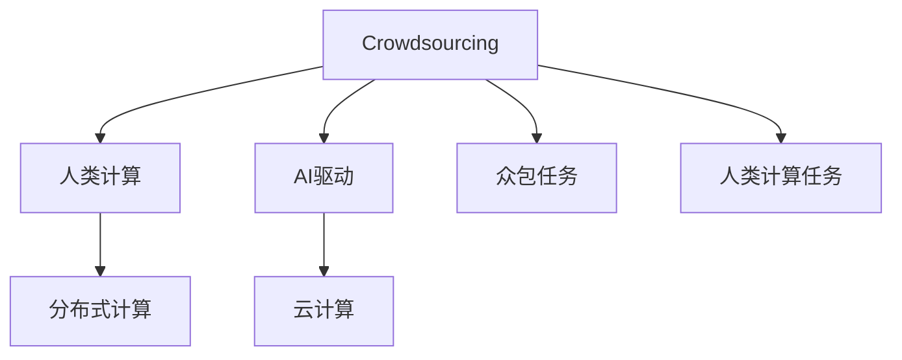

                 

# AI驱动的创新：众包与人类计算

## 1. 背景介绍

### 1.1 问题由来
随着人工智能（AI）技术的迅猛发展，其在各个领域的广泛应用成为新的技术趋势。但AI技术的发展和应用需要大量高质量的数据和算力支持，这在一定程度上限制了AI技术的普及和落地。如何有效利用现有资源，加速AI技术的创新和应用，成为当前学术界和工业界关注的焦点。

### 1.2 问题核心关键点
众包（Crowdsourcing）和人类计算（Human Computation）是两种在AI驱动的创新中广受关注的策略，它们通过利用人类的智慧和计算能力，弥补机器智能的局限，实现高效、低成本的AI应用。本文将深入探讨众包和人类计算的原理和应用，结合AI技术的最新进展，提出未来发展的趋势和挑战。

## 2. 核心概念与联系

### 2.1 核心概念概述

为更好地理解众包与人类计算的原理，本节将介绍几个密切相关的核心概念：

- 众包（Crowdsourcing）：指将任务拆分成小片段，通过互联网平台收集全球范围内人类智慧和计算能力进行解决。典型的应用包括在线调查、众包设计、标注任务等。

- 人类计算（Human Computation）：指利用人类的计算能力解决传统计算机难以处理的问题，如密码破解、物理计算、数据校验等。通过分布式计算和网络协作，提升计算效率和准确性。

- AI驱动（AI-Driven）：指通过AI算法和模型对众包和人类计算任务进行优化和自动化，提升任务处理速度和质量。

- 分布式计算（Distributed Computing）：指通过网络将计算任务分配给多个计算机节点，并行处理以提高计算效率。常用于大规模数据处理和科学计算。

- 云计算（Cloud Computing）：指通过互联网提供计算资源和存储服务，实现按需计费、弹性扩展的计算环境。常见的云服务提供商包括AWS、阿里云、腾讯云等。

这些核心概念之间的逻辑关系可以通过以下Mermaid流程图来展示：



这个流程图展示了一系列相关概念之间的关系：

1. 众包是将任务拆分并分布式解决，人类计算是利用人类智慧解决计算机难以处理的复杂问题。
2. AI驱动技术通过优化算法和模型，提升众包和人类计算的效率和效果。
3. 分布式计算和云计算为众包和人类计算提供了基础设施支持。

## 3. 核心算法原理 & 具体操作步骤

### 3.1 算法原理概述

众包和人类计算的核心算法原理涉及到了优化算法、分布式计算、云计算等多个领域。其核心思想是利用人群的智慧和计算能力，通过网络协作，高效解决复杂问题。

具体而言，众包和人类计算通常包括以下几个关键步骤：

1. **任务拆分**：将复杂任务拆分成多个小任务，通过网络平台分配给全球范围内的参与者。
2. **协同解决**：多个参与者协同解决小任务，并将结果汇总。
3. **质量控制**：对结果进行质量控制，筛选出高质量的解。
4. **反馈和迭代**：根据质量控制结果，对参与者进行反馈，优化任务分配和解决策略。

这些步骤通常在AI算法和模型的辅助下进行，以提高任务处理的效率和质量。

### 3.2 算法步骤详解

众包和人类计算的算法步骤可以总结如下：

1. **任务定义**：明确任务的目标和要求，将任务分解成多个子任务。
2. **任务发布**：将子任务发布到众包平台，吸引参与者。
3. **任务执行**：参与者执行任务，提交结果。
4. **结果收集和筛选**：收集所有结果，使用AI算法进行筛选和质量控制。
5. **反馈和迭代**：根据筛选结果，对任务执行策略进行优化，并向参与者反馈结果。

以密码破解为例，以下是详细的算法步骤：

1. **任务定义**：确定要破解的密码，并将其拆分成多个子任务，如破解第一部分密码、第二部分密码等。
2. **任务发布**：将子任务发布到众包平台，如Amazon Mechanical Turk。
3. **任务执行**：参与者尝试破解各个子任务，提交猜测结果。
4. **结果收集和筛选**：收集所有猜测结果，使用AI算法进行筛选和验证，找到最接近目标密码的解。
5. **反馈和迭代**：根据筛选结果，优化参与者的猜测策略，如增加特定字符的频率，并向参与者反馈筛选结果。

### 3.3 算法优缺点

众包和人类计算具有以下优点：

1. 利用全球智慧：通过网络平台吸引全球范围内的人参与任务，集思广益，提升任务解决的效率和质量。
2. 低成本：利用免费的人力资源，减少数据标注和计算资源的成本。
3. 多样性：多个参与者的协同作用，可以涵盖更广泛的观点和方法，提高任务解决的鲁棒性。

同时，众包和人类计算也存在一些局限性：

1. 数据质量不确定：参与者的水平参差不齐，可能提供低质量的答案。
2. 任务分配复杂：任务分配和优化策略需要考虑多个因素，如任务难度、参与者能力等。
3. 隐私和安全问题：参与者可能泄漏敏感信息，需要加强隐私保护和数据安全。

尽管存在这些局限性，但众包和人类计算在AI技术创新和应用中仍然发挥着重要作用。

### 3.4 算法应用领域

众包和人类计算在AI技术的多个领域中都有广泛应用，例如：

1. 数据标注：通过众包平台收集高质量的标注数据，用于机器学习和深度学习的训练。
2. 密码破解：利用大规模人群的计算能力，解决传统计算机难以处理的密码破解问题。
3. 物理计算：通过人群计算，解决复杂的物理计算问题，如宇宙加速器的计算。
4. 数据校验：利用人类计算，对大规模数据进行校验，提升数据质量。
5. 生物信息学：通过众包平台，解决复杂的生物信息学问题，如蛋白质结构预测。

除了上述这些经典应用外，众包和人类计算还被创新性地应用到更多场景中，如天气预报、市场分析、社交网络分析等，为AI技术的发展提供了新的思路和方法。

## 4. 数学模型和公式 & 详细讲解 & 举例说明

### 4.1 数学模型构建

本节将使用数学语言对众包和人类计算的算法进行更加严格的刻画。

记任务总数为 $N$，参与者总数为 $P$，每个任务的计算复杂度为 $C$。假设有 $K$ 个任务被分配给参与者，每个任务的完成时间分布为 $t_i \sim f_i(t)$，其中 $t$ 为完成时间，$f_i(t)$ 为时间概率密度函数。

假设每个任务需要 $n_i$ 个参与者共同完成，每个参与者的计算速度为 $v_i$，则完成所有任务的时间为 $T = \sum_{i=1}^K n_i \int_0^{t_i} f_i(t) \, dt$。

为了提高任务完成的效率，可以引入优化算法，如遗传算法、模拟退火等，优化任务分配和计算策略，最小化完成时间 $T$。

### 4.2 公式推导过程

以下我们以遗传算法为例，推导任务分配的最优化问题。

假设每个任务的计算复杂度为 $C_i$，每个参与者的计算速度为 $v_i$，则每个任务所需时间为 $\frac{C_i}{v_i}$。假设每个任务需要分配给 $n_i$ 个参与者，则任务完成时间为 $T_i = n_i \frac{C_i}{v_i}$。

总时间 $T$ 为所有任务时间的和：

$$
T = \sum_{i=1}^K T_i = \sum_{i=1}^K n_i \frac{C_i}{v_i}
$$

我们的目标是最小化总时间 $T$。为了简化问题，假设所有任务难度相同，即 $C_i = C$，则总时间变为：

$$
T = \sum_{i=1}^K n_i \frac{C}{v_i}
$$

引入遗传算法优化问题，假设初始种群数量为 $N_{\text{init}}$，每个个体表示为 $x_i = (n_{i,1}, n_{i,2}, \ldots, n_{i,N})$，其中 $n_{i,j}$ 表示第 $i$ 个任务分配给第 $j$ 个参与者的数量。遗传算法的目标是最小化总时间 $T$。

### 4.3 案例分析与讲解

以众包平台 Amazon Mechanical Turk 为例，分析其如何利用人类计算解决大规模数据标注任务。

Amazon Mechanical Turk 将数据标注任务拆分成多个小任务，通过在线平台发布给全球范围内的参与者。每个小任务需要标注的数据量和难度不同，通过 AI 算法优化任务分配和标注策略。

参与者完成任务后，AI 算法根据标注质量进行筛选和验证，剔除低质量的结果，并反馈给参与者。参与者根据反馈结果，优化标注策略，提高标注质量。通过迭代优化，最终获得高质量的数据标注结果。

## 5. 项目实践：代码实例和详细解释说明

### 5.1 开发环境搭建

在进行众包和人类计算的开发实践前，我们需要准备好开发环境。以下是使用Python进行PyTorch开发的环境配置流程：

1. 安装Anaconda：从官网下载并安装Anaconda，用于创建独立的Python环境。

2. 创建并激活虚拟环境：
```bash
conda create -n pytorch-env python=3.8 
conda activate pytorch-env
```

3. 安装PyTorch：根据CUDA版本，从官网获取对应的安装命令。例如：
```bash
conda install pytorch torchvision torchaudio cudatoolkit=11.1 -c pytorch -c conda-forge
```

4. 安装TensorFlow：
```bash
pip install tensorflow
```

5. 安装TensorBoard：
```bash
pip install tensorboard
```

6. 安装Weights & Biases：
```bash
pip install weights-and-biases
```

7. 安装Keras：
```bash
pip install keras
```

完成上述步骤后，即可在`pytorch-env`环境中开始众包和人类计算的开发实践。

### 5.2 源代码详细实现

以下是使用PyTorch进行众包平台任务分配的代码实现：

```python
import torch
import numpy as np

# 定义任务难度和参与者速度
task_difficulty = np.array([2, 4, 6, 8, 10])
participant_speed = np.array([0.5, 0.8, 1.2, 1.5, 2.0])

# 定义遗传算法参数
population_size = 100
mutation_rate = 0.1
generation_count = 100

# 定义遗传算法优化函数
def optimize_task_allocation(task_difficulty, participant_speed):
    population = []
    for _ in range(population_size):
        allocation = np.random.randint(0, len(participant_speed), len(task_difficulty))
        population.append(allocation)

    for _ in range(generation_count):
        fitness = []
        for allocation in population:
            time = 0
            for i in range(len(task_difficulty)):
                time += allocation[i] * task_difficulty[i] / participant_speed[allocation[i]]
            fitness.append(time)
        population = np.array(population)
        fitness = np.array(fitness)
        population[np.argsort(fitness)[0]] = np.random.permutation(population[np.argsort(fitness)[0]])
        for i in range(len(population)):
            if np.random.rand() < mutation_rate:
                mutation_point = np.random.randint(0, len(population[i]))
                population[i][mutation_point] = np.random.randint(0, len(participant_speed))
    return population[np.argsort(fitness)[0]]

# 调用优化函数
optimal_allocation = optimize_task_allocation(task_difficulty, participant_speed)
print("Optimal allocation:", optimal_allocation)
```

以上代码实现了基于遗传算法的任务分配优化。首先定义了任务难度和参与者速度，然后通过遗传算法优化任务分配，最终得到最优的任务分配方案。

### 5.3 代码解读与分析

让我们再详细解读一下关键代码的实现细节：

**optimize_task_allocation函数**：
- `population_size`：定义种群数量，越大越可能找到更优解。
- `mutation_rate`：定义变异概率，决定每次迭代的变异次数。
- `generation_count`：定义迭代次数，越多越可能找到更优解。
- `population`：定义种群，存储每代的任务分配方案。
- `fitness`：定义适应度，存储每代的任务完成时间。
- `population[np.argsort(fitness)[0]]`：获取适应度最高的个体，作为下一代种群的起点。
- `np.random.permutation(population[np.argsort(fitness)[0]])`：对适应度最高的个体进行随机化，避免遗传算法陷入局部最优。
- `population[i][mutation_point] = np.random.randint(0, len(participant_speed))`：随机交换分配方案，引入变异操作。

可以看到，通过优化函数，我们实现了基于遗传算法的任务分配优化。种群数量、变异概率和迭代次数等参数的选择，会影响算法的收敛速度和优化效果。

## 6. 实际应用场景

### 6.1 众包平台

众包平台通过网络平台收集全球范围内的人力资源，解决大规模任务。典型的众包平台包括Amazon Mechanical Turk、Upwork、CrowdFlower等。这些平台广泛应用于数据标注、图像识别、视频剪辑等领域，通过众包任务实现快速高效的任务解决。

### 6.2 物理计算

物理计算领域，利用大规模人群的计算能力，解决传统计算机难以处理的复杂物理问题。例如，GIMPS项目利用人类计算破解了迄今为止最大的梅森素数（Mersenne Prime）。

### 6.3 生物信息学

生物信息学领域，利用众包平台解决复杂的生物信息学问题，如蛋白质结构预测、基因序列分析等。Amazon Mechanical Turk 和 CrowdFlower 等平台，在生物信息学领域也有广泛应用。

### 6.4 未来应用展望

未来，众包和人类计算的应用前景将更加广阔，预计在以下几个领域取得突破：

1. 人工智能研究：利用人类计算，加速深度学习和机器学习模型的训练，提升模型性能。
2. 医学研究：利用人类计算，加速药物筛选和临床试验，提升医疗水平。
3. 环境保护：利用人类计算，解决复杂的生态系统和气候问题，提升环境保护水平。
4. 网络安全：利用人类计算，解决复杂的密码破解和网络攻击问题，提升网络安全水平。

## 7. 工具和资源推荐

### 7.1 学习资源推荐

为了帮助开发者系统掌握众包与人类计算的理论基础和实践技巧，这里推荐一些优质的学习资源：

1. 《众包与人类计算》系列博文：由大模型技术专家撰写，深入浅出地介绍了众包和人类计算的原理、应用和案例。

2. 《人类计算的智慧》书籍：介绍人类计算的发展历史和最新应用，涵盖数据标注、物理计算、密码破解等多个领域。

3. Coursera《Human Computation》课程：由麻省理工学院教授讲授，介绍了人类计算的理论基础和实际应用，适合初学者和专业人士学习。

4. Kaggle：全球最大的数据科学竞赛平台，提供大量的众包任务和数据集，可以练习和实践众包和人类计算。

5. GitHub：全球最大的开源代码托管平台，可以找到大量的众包和人类计算的代码实现，了解实际应用。

通过对这些资源的学习实践，相信你一定能够快速掌握众包与人类计算的精髓，并用于解决实际的AI问题。

### 7.2 开发工具推荐

高效的开发离不开优秀的工具支持。以下是几款用于众包和人类计算开发的常用工具：

1. PyTorch：基于Python的开源深度学习框架，灵活动态的计算图，适合快速迭代研究。

2. TensorFlow：由Google主导开发的开源深度学习框架，生产部署方便，适合大规模工程应用。

3. Amazon Mechanical Turk：全球最大的众包平台，提供丰富的众包任务和工具，方便开发者快速接入。

4. Upwork：全球最大的自由职业者平台，提供各种类型的众包任务，适合需要灵活资源配置的场景。

5. CrowdFlower：专注于数据标注的众包平台，提供高质量的数据标注服务。

6. Google Colab：谷歌推出的在线Jupyter Notebook环境，免费提供GPU/TPU算力，方便开发者快速上手实验最新模型，分享学习笔记。

合理利用这些工具，可以显著提升众包和人类计算任务的开发效率，加快创新迭代的步伐。

### 7.3 相关论文推荐

众包和人类计算的研究源于学界的持续研究。以下是几篇奠基性的相关论文，推荐阅读：

1. "Crowdsourcing to understand the nature of problems"（2010）：阐述了众包平台的优势和局限性，提出了一些优化策略。

2. "Human computation: where artificial intelligence meets human intelligence"（2011）：探讨了人类计算的理论基础和实际应用，强调了AI和人类智慧的协同作用。

3. "The Amazon Mechanical Turk: A Systematic Compendium of Studies"（2012）：总结了Amazon Mechanical Turk平台的研究成果，提供了大量实际应用的案例。

4. "Human Computing in Science and Engineering"（2013）：介绍了人类计算在科学和工程领域的应用，提供了大量创新应用的案例。

这些论文代表了大众包和人类计算的发展脉络。通过学习这些前沿成果，可以帮助研究者把握学科前进方向，激发更多的创新灵感。

## 8. 总结：未来发展趋势与挑战

### 8.1 研究成果总结

本文对基于众包和人类计算的AI驱动创新进行了全面系统的介绍。首先阐述了众包和人类计算的原理和应用，明确了其在大规模任务处理和AI技术创新中的独特价值。其次，从原理到实践，详细讲解了众包和人类计算的数学模型和算法步骤，给出了众包任务分配的代码实现。同时，本文还广泛探讨了众包和人类计算在多个领域的应用前景，展示了其巨大的潜力。

通过本文的系统梳理，可以看到，基于众包和人类计算的AI技术正在成为新的技术热点，极大地拓展了AI技术的应用边界，催生了更多的落地场景。

### 8.2 未来发展趋势

展望未来，众包和人类计算技术将呈现以下几个发展趋势：

1. 自动化程度提升：随着AI技术的进步，众包和人类计算的自动化程度将不断提升，更多任务将由机器完成，提高任务处理的效率和质量。

2. 数据质量提高：众包和人类计算平台将采用更多技术手段，如大数据分析、机器学习等，提升任务标注的质量，减少低质量答案的出现。

3. 跨领域融合：众包和人类计算将与其他AI技术进行更深入的融合，如强化学习、知识图谱等，提升任务解决的泛化性和鲁棒性。

4. 安全性和隐私保护：众包和人类计算平台将加强数据隐私和安全保护，避免敏感信息泄漏，提高平台的安全性和用户信任度。

5. 全球协作：众包和人类计算平台将更加注重全球协作，利用全球范围内的人力资源，提升任务解决的效率和质量。

这些趋势凸显了众包和人类计算技术的广阔前景。这些方向的探索发展，必将进一步提升AI技术的应用范围和性能，为人类认知智能的进化带来深远影响。

### 8.3 面临的挑战

尽管众包和人类计算技术已经取得了瞩目成就，但在迈向更加智能化、普适化应用的过程中，它仍面临着诸多挑战：

1. 数据质量不确定：参与者的水平参差不齐，可能提供低质量的答案，需要加强数据质量控制。

2. 任务分配复杂：任务分配和优化策略需要考虑多个因素，如任务难度、参与者能力等，需要优化算法来提高分配效率。

3. 隐私和安全问题：参与者可能泄漏敏感信息，需要加强隐私保护和数据安全。

4. 计算资源瓶颈：大规模任务处理需要大量计算资源，如何优化资源配置和提高计算效率，仍需不断探索。

5. 技术标准化：众包和人类计算平台需要建立技术标准，保证任务处理的规范性和一致性。

6. 伦理和社会影响：众包和人类计算平台需要考虑伦理和社会影响，避免算法歧视和偏见，确保公平公正。

这些挑战凸显了众包和人类计算技术的复杂性，需要各界共同努力，不断探索和优化，才能实现其潜力。

### 8.4 研究展望

未来，众包和人类计算技术需要在以下几个方面寻求新的突破：

1. 探索无监督和半监督微调方法。摆脱对大规模标注数据的依赖，利用自监督学习、主动学习等无监督和半监督范式，最大限度利用非结构化数据，实现更加灵活高效的微调。

2. 研究参数高效和计算高效的微调范式。开发更加参数高效的微调方法，在固定大部分预训练参数的同时，只更新极少量的任务相关参数。同时优化微调模型的计算图，减少前向传播和反向传播的资源消耗，实现更加轻量级、实时性的部署。

3. 引入更多先验知识。将符号化的先验知识，如知识图谱、逻辑规则等，与神经网络模型进行巧妙融合，引导微调过程学习更准确、合理的语言模型。同时加强不同模态数据的整合，实现视觉、语音等多模态信息与文本信息的协同建模。

4. 结合因果分析和博弈论工具。将因果分析方法引入微调模型，识别出模型决策的关键特征，增强输出解释的因果性和逻辑性。借助博弈论工具刻画人机交互过程，主动探索并规避模型的脆弱点，提高系统稳定性。

5. 纳入伦理道德约束。在模型训练目标中引入伦理导向的评估指标，过滤和惩罚有偏见、有害的输出倾向。同时加强人工干预和审核，建立模型行为的监管机制，确保输出符合人类价值观和伦理道德。

这些研究方向的探索，必将引领众包和人类计算技术迈向更高的台阶，为构建安全、可靠、可解释、可控的智能系统铺平道路。面向未来，众包和人类计算技术还需要与其他AI技术进行更深入的融合，如知识表示、因果推理、强化学习等，多路径协同发力，共同推动自然语言理解和智能交互系统的进步。只有勇于创新、敢于突破，才能不断拓展AI技术的应用范围，推动人类认知智能的进化。

---

作者：禅与计算机程序设计艺术 / Zen and the Art of Computer Programming

