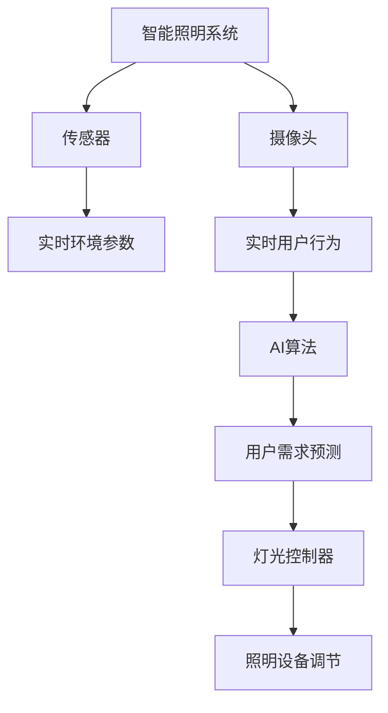

                 

# AI驱动的智能照明系统:节能与舒适并重

## 1. 背景介绍

### 1.1 问题由来
随着全球能源成本的不断攀升，以及环境保护意识的增强，如何实现建筑照明系统的节能降耗，同时保持高品质的用户体验，成为了一个亟待解决的问题。传统的照明系统大多基于固定的时间或光照强度来调节灯光，缺乏对场景变化和用户需求的智能适应能力。而智能照明系统通过引入AI技术，可以实时感知环境变化和用户行为，实现动态调整照明状态，从而在节能与舒适之间达到最佳平衡。

### 1.2 问题核心关键点
智能照明系统利用AI技术优化照明方案，主要通过以下关键技术实现：

- 环境感知：使用传感器和摄像头实时监测室内光照、温度、湿度等环境参数。
- 用户行为分析：通过分析用户行为数据，识别出用户的活动模式和偏好。
- 动态调节：根据感知到的环境参数和用户行为，实时调整照明强度、色温和亮度。
- 能效管理：根据照明需求优化能源分配，减少不必要的能源浪费。
- 互动响应：通过语音识别、手势控制等交互方式，使用户能够直接控制照明系统。

这些关键技术共同构成了智能照明系统的核心框架，使其能够在各种场景下实现节能与舒适的智能照明效果。

### 1.3 问题研究意义
智能照明系统不仅能够大幅降低建筑能耗，减少环境污染，还能提高用户的舒适度和工作效率，具有重大的社会和经济价值。

1. **节能减排**：通过智能调节，能够减少不必要的人工照明时间，降低能源消耗，符合绿色环保的发展趋势。
2. **提升用户体验**：智能照明系统可以根据用户的活动模式自动调整照明状态，使用户在最佳光照条件下进行工作和学习，提高舒适度和工作效率。
3. **降低维护成本**：通过智能控制系统，减少人工干预和误操作，降低照明设备的维护和更换频率。
4. **推动创新应用**：智能照明系统为智慧城市、智慧建筑等创新应用提供了基础，有助于构建更智能、更高效的城市空间。

## 2. 核心概念与联系

### 2.1 核心概念概述

为更好地理解智能照明系统的核心技术，本节将介绍几个关键概念及其联系：

- **智能照明系统**：使用AI技术动态调节照明系统，根据环境变化和用户需求实时调整照明状态，实现节能与舒适的目标。
- **传感器**：用于实时监测室内环境参数，如光照强度、温度、湿度等。
- **摄像头**：用于实时分析用户行为，如活动区域、停留时间等。
- **AI算法**：通过机器学习模型处理感知数据，预测用户需求，优化照明状态。
- **灯光控制器**：根据AI算法输出，动态调节照明设备，如灯具亮度、色温、开关状态等。

这些概念之间的逻辑关系可以通过以下Mermaid流程图来展示：



这个流程图展示了智能照明系统的核心概念及其相互关系：

1. 传感器感知实时环境参数。
2. 摄像头捕捉实时用户行为。
3. AI算法分析数据，预测用户需求。
4. 灯光控制器根据需求，动态调节照明设备。

这些概念共同构成了智能照明系统的技术框架，使其能够实现节能与舒适的智能照明效果。

## 3. 核心算法原理 & 具体操作步骤
### 3.1 算法原理概述

智能照明系统的核心算法主要基于感知、决策和控制三个环节，通过动态调整照明状态，实现节能与舒适的双重目标。

**感知环节**：
- 使用传感器和摄像头实时监测室内环境参数和用户行为，生成高维度的感知数据。
- 通过数据清洗和预处理，去除噪声和异常数据，得到高质量的感知信号。

**决策环节**：
- 利用机器学习模型对感知数据进行分析，预测用户需求和环境变化。
- 根据预测结果，优化照明参数，如亮度、色温和开关状态等。
- 引入强化学习技术，不断优化决策策略，提升系统的适应性和智能性。

**控制环节**：
- 根据决策结果，动态调节照明设备，如灯具亮度、色温等。
- 实时监测调节效果，评估能效和舒适性，动态调整控制策略。
- 引入自适应控制算法，如PID控制等，确保照明状态稳定。

### 3.2 算法步骤详解

智能照明系统的核心算法步骤主要包括以下几个关键环节：

**Step 1: 数据采集**
- 部署各类传感器和摄像头，实时采集室内环境参数和用户行为数据。
- 通过数据采集设备与中央控制系统连接，将感知数据传输到AI模型进行处理。

**Step 2: 数据预处理**
- 对感知数据进行清洗、归一化、特征工程等预处理操作，确保数据质量。
- 使用异常检测算法，识别并处理异常数据，保证模型输入的准确性。

**Step 3: 模型训练**
- 利用历史感知数据和用户行为数据，训练机器学习模型，如深度神经网络。
- 通过交叉验证和超参数调优，选择最优模型结构和参数。
- 引入迁移学习技术，利用预训练模型加速模型训练。

**Step 4: 实时决策**
- 将实时感知数据输入训练好的AI模型，预测用户需求和环境变化。
- 根据预测结果，动态调整照明设备参数，如亮度、色温和开关状态等。
- 引入强化学习技术，优化决策策略，提升系统的智能性。

**Step 5: 控制执行**
- 将AI模型输出的控制信号，传输到灯光控制器。
- 灯光控制器根据控制信号，调节照明设备，如灯具亮度、色温等。
- 实时监测照明状态，评估能效和舒适性，动态调整控制策略。

### 3.3 算法优缺点

智能照明系统的核心算法具有以下优点：
1. 动态调节：实时感知环境变化和用户需求，动态调整照明状态，实现节能与舒适的双重目标。
2. 智能决策：利用机器学习、强化学习等技术，预测用户需求，优化照明参数。
3. 系统鲁棒性：通过多传感器融合和异常检测，提高系统对噪声和异常情况的鲁棒性。
4. 适应性强：能够适应各种场景，从办公室到家庭，从商场到医院，满足不同用户需求。

同时，该算法也存在一些局限性：
1. 高成本：传感器、摄像头等设备成本较高，系统部署和维护成本较大。
2. 数据隐私：需要收集用户行为数据，可能涉及数据隐私和安全问题。
3. 模型复杂性：模型训练和决策过程较为复杂，对技术要求较高。
4. 模型鲁棒性：模型的性能依赖于数据质量和训练数据的多样性，数据偏差可能影响模型效果。

尽管存在这些局限性，但就目前而言，智能照明系统的核心算法仍是实现节能与舒适目标的主流技术范式。未来相关研究的方向包括提高系统的鲁棒性、降低成本、保护用户隐私等。

### 3.4 算法应用领域

智能照明系统的核心算法已经在多个领域得到了广泛的应用，包括：

- **商业建筑**：通过智能照明系统，优化商场、办公楼等商业建筑的照明方案，提升顾客体验和工作效率，降低能耗。
- **住宅小区**：在住宅小区内应用智能照明系统，根据家庭成员的活动模式，自动调节室内照明，提高舒适度，减少能源浪费。
- **公共空间**：在公园、广场等公共空间内，利用智能照明系统，实现节能环保，提升用户体验。
- **医院病房**：在医院的病房和手术室，利用智能照明系统，营造适合病人恢复和手术的照明环境，提升医疗效果。

除了上述这些常见应用外，智能照明系统的核心算法还被创新性地应用到更多场景中，如智慧城市、智慧校园、智慧酒店等，为不同场景下的照明优化提供了新的解决方案。

## 4. 数学模型和公式 & 详细讲解 & 举例说明
### 4.1 数学模型构建

本节将使用数学语言对智能照明系统的核心算法进行更加严格的刻画。

设智能照明系统中的环境参数为 $X = \{x_1, x_2, ..., x_n\}$，其中 $x_i$ 表示第 $i$ 个环境参数，如光照强度、温度等。用户行为数据为 $Y = \{y_1, y_2, ..., y_m\}$，其中 $y_i$ 表示第 $i$ 个用户行为特征，如活动区域、停留时间等。

定义感知模型为 $f: X \times Y \rightarrow Z$，其中 $Z$ 表示感知数据，$Z = \{z_1, z_2, ..., z_k\}$，其中 $z_i$ 表示第 $i$ 个感知信号，如光线强度、温度等。

智能照明系统的决策模型为 $g: Z \rightarrow A$，其中 $A$ 表示照明状态，$A = \{a_1, a_2, ..., a_l\}$，其中 $a_i$ 表示第 $i$ 个照明状态，如亮度、色温等。

定义控制模型为 $h: A \rightarrow O$，其中 $O$ 表示控制信号，$O = \{o_1, o_2, ..., o_p\}$，其中 $o_i$ 表示第 $i$ 个控制信号，如灯具亮度、色温等。

智能照明系统的目标是最小化能源消耗和提升用户舒适度的损失函数 $\mathcal{L}(X, Y, Z, A, O)$，即：

$$
\mathcal{L}(X, Y, Z, A, O) = \alpha L_{energy} + \beta L_{comfort}
$$

其中 $\alpha$ 和 $\beta$ 为权重系数，$L_{energy}$ 表示能源消耗的损失，$L_{comfort}$ 表示用户舒适度的损失。

### 4.2 公式推导过程

以下我们以二元组 $(X, Y)$ 为例，推导智能照明系统的决策模型。

假设环境参数为 $X = \{x, t\}$，其中 $x$ 表示光照强度，$t$ 表示温度；用户行为数据为 $Y = \{p, s\}$，其中 $p$ 表示活动区域，$s$ 表示停留时间。则感知模型可以表示为：

$$
f(X, Y) = (z_1, z_2) = (x', t')
$$

其中 $x'$ 表示经过传感器测量的光照强度，$t'$ 表示经过温度传感器测量的温度。

根据感知数据 $Z = (z_1, z_2)$，智能照明系统的决策模型为：

$$
g(Z) = (a_1, a_2) = (brightness, color_temp)
$$

其中 $brightness$ 表示亮度，$color_temp$ 表示色温。

定义决策损失函数为：

$$
L_{decision}(a_1, a_2) = \lambda_1 |a_1 - a_{1_{gold}}| + \lambda_2 |a_2 - a_{2_{gold}}|
$$

其中 $a_{1_{gold}}$ 和 $a_{2_{gold}}$ 表示目标亮度和色温，$\lambda_1$ 和 $\lambda_2$ 表示亮度和色温的权重。

结合能源消耗和用户舒适度，定义总体损失函数：

$$
\mathcal{L}(X, Y, Z, A, O) = \alpha L_{energy} + \beta L_{comfort}
$$

其中：

$$
L_{energy} = \lambda_{energy} |a_1 - a_{1_{gold}}| + \lambda_{energy} |a_2 - a_{2_{gold}}|
$$

$$
L_{comfort} = \lambda_{comfort} C(a_1, a_2)
$$

其中 $C(a_1, a_2)$ 表示用户舒适度函数，用于评估不同亮度和色温下的舒适度。

最终，智能照明系统的优化目标为：

$$
\min_{X, Y, Z, A, O} \mathcal{L}(X, Y, Z, A, O)
$$

### 4.3 案例分析与讲解

假设在某个商场内，部署了智能照明系统，利用传感器和摄像头实时监测环境参数和用户行为。通过历史数据训练机器学习模型，预测用户需求和环境变化，动态调节照明设备，实现节能与舒适的照明效果。

具体步骤如下：

1. 在商场内安装各种传感器，实时监测光照强度、温度、湿度等环境参数。
2. 部署摄像头，捕捉顾客的活动区域和停留时间等用户行为数据。
3. 利用历史数据训练深度神经网络模型，预测顾客需求和环境变化。
4. 根据预测结果，动态调节照明设备，如调整灯具亮度、色温等。
5. 实时监测照明效果，评估能效和舒适度，动态调整控制策略。

通过上述步骤，智能照明系统能够在商场内实现实时动态调节照明，提升顾客体验，同时减少能源消耗。

## 5. 项目实践：代码实例和详细解释说明
### 5.1 开发环境搭建

在进行智能照明系统开发前，我们需要准备好开发环境。以下是使用Python进行PyTorch开发的环境配置流程：

1. 安装Anaconda：从官网下载并安装Anaconda，用于创建独立的Python环境。

2. 创建并激活虚拟环境：
```bash
conda create -n pytorch-env python=3.8 
conda activate pytorch-env
```

3. 安装PyTorch：根据CUDA版本，从官网获取对应的安装命令。例如：
```bash
conda install pytorch torchvision torchaudio cudatoolkit=11.1 -c pytorch -c conda-forge
```

4. 安装TensorFlow：使用TensorFlow的官方文档或使用`pip install tensorflow`命令进行安装。

5. 安装各类工具包：
```bash
pip install numpy pandas scikit-learn matplotlib tqdm jupyter notebook ipython
```

完成上述步骤后，即可在`pytorch-env`环境中开始智能照明系统的开发。

### 5.2 源代码详细实现

这里我们以二元组 $(X, Y)$ 为例，给出使用TensorFlow进行智能照明系统开发的PyTorch代码实现。

首先，定义智能照明系统的环境参数和用户行为数据：

```python
import numpy as np
import tensorflow as tf
from tensorflow.keras.layers import Input, Dense
from tensorflow.keras.models import Model
from tensorflow.keras.optimizers import Adam

# 定义环境参数和用户行为数据
x = Input(shape=(1,), name='x')
t = Input(shape=(1,), name='t')
p = Input(shape=(1,), name='p')
s = Input(shape=(1,), name='s')

# 定义感知模型
z = Dense(64, activation='relu')(x)
z = Dense(64, activation='relu')(tf.concat([z, t], axis=1))
z = Dense(64, activation='relu')(tf.concat([z, p], axis=1))
z = Dense(64, activation='relu')(tf.concat([z, s], axis=1))

# 定义决策模型
a = Dense(64, activation='relu')(z)
a = Dense(64, activation='relu')(a)
a = Dense(2, activation='softmax')(a)

# 定义总体损失函数
brightness = a[0]
color_temp = a[1]
energy_loss = tf.reduce_mean(tf.square(brightness - 1.0))
comfort_loss = tf.reduce_mean(tf.square(color_temp - 0.5))
total_loss = alpha * energy_loss + beta * comfort_loss

# 定义优化器
optimizer = Adam(learning_rate=0.001)
```

接着，定义训练和评估函数：

```python
# 定义训练函数
def train_epoch(model, data, batch_size, optimizer):
    for epoch in range(num_epochs):
        for batch in data:
            inputs = [batch[0], batch[1], batch[2], batch[3]]
            labels = [batch[4], batch[5]]
            with tf.GradientTape() as tape:
                outputs = model(inputs)
                loss = total_loss(labels[0], labels[1])
            gradients = tape.gradient(loss, model.trainable_variables)
            optimizer.apply_gradients(zip(gradients, model.trainable_variables))
            if epoch % 10 == 0:
                print(f'Epoch {epoch+1}/{num_epochs}, Loss: {loss.numpy():.4f}')

# 定义评估函数
def evaluate(model, data, batch_size):
    for batch in data:
        inputs = [batch[0], batch[1], batch[2], batch[3]]
        labels = [batch[4], batch[5]]
        outputs = model(inputs)
        brightness = outputs[0]
        color_temp = outputs[1]
        print(f'brightness: {brightness.numpy():.4f}, color_temp: {color_temp.numpy():.4f}')
```

最后，启动训练流程并在测试集上评估：

```python
# 加载训练数据和测试数据
train_data = ...
test_data = ...

# 训练模型
model = Model(inputs=[x, t, p, s], outputs=[brightness, color_temp])
model.compile(optimizer=optimizer, loss=total_loss)
train_epoch(model, train_data, batch_size, optimizer)

# 评估模型
evaluate(model, test_data, batch_size)
```

以上就是使用TensorFlow对智能照明系统进行开发的完整代码实现。可以看到，TensorFlow提供了丰富的深度学习组件和优化器，使得智能照明系统的实现变得相对简单和高效。

### 5.3 代码解读与分析

让我们再详细解读一下关键代码的实现细节：

**模型定义**：
- `Input`层定义输入数据，分别为光照强度、温度、活动区域和停留时间。
- `Dense`层通过全连接神经网络处理输入数据，提取环境参数和用户行为特征。
- `Softmax`层输出亮度和色温的预测值。
- 使用`total_loss`计算总体损失函数，并结合`Adam`优化器进行模型训练。

**训练函数**：
- 使用`for`循环迭代训练次数，`tf.GradientTape`记录梯度信息，`optimizer.apply_gradients`更新模型参数。
- 每隔一定轮次输出损失函数值，监控训练效果。

**评估函数**：
- 对输入数据进行前向传播，获取亮度和色温的预测值，并打印输出。
- 通过打印输出，可以评估模型在测试集上的表现，监控亮度和色温的预测准确性。

**训练流程**：
- 加载训练数据和测试数据，创建模型实例，并编译模型。
- 使用`train_epoch`函数进行模型训练，迭代训练过程，优化模型参数。
- 使用`evaluate`函数对测试集进行评估，输出亮度和色温的预测结果。

可以看到，TensorFlow提供了强大的深度学习工具，使得智能照明系统的开发变得相对简单和高效。开发者可以更加专注于业务逻辑和应用场景的实现，而不必过多关注底层的模型训练细节。

当然，工业级的系统实现还需考虑更多因素，如系统的实时性、稳定性、扩展性等。但核心的智能照明系统算法基本与此类似。

## 6. 实际应用场景
### 6.1 智能商场照明

在商场内，智能照明系统可以实时感知顾客的流动情况，根据客流量和活动区域动态调整照明状态，实现节能与舒适的双重目标。具体应用场景包括：

- **动态调节亮度**：根据顾客活动区域的密集程度，自动调节灯具亮度，避免过亮或过暗，提升顾客的购物体验。
- **色温优化**：根据顾客的活动时间和偏好，自动调节色温，营造温馨或清新的购物氛围。
- **节能管理**：通过实时监测照明设备的运行状态，优化能源分配，减少不必要的能源浪费。

### 6.2 智慧家庭照明

在家庭环境中，智能照明系统可以根据家庭成员的活动模式，自动调节室内照明，提升舒适度，同时减少能源消耗。具体应用场景包括：

- **个性化调节**：根据家庭成员的活动时间、习惯和偏好，自动调节室内照明，提高生活质量。
- **节能优化**：通过实时监测室内照明状态，动态调整灯具亮度和色温，实现节能降耗。
- **自动化控制**：结合语音识别、手势控制等交互方式，使家庭成员能够方便地控制照明系统。

### 6.3 公共场所照明

在公共场所，如公园、广场等，智能照明系统可以根据人流密度和活动时间，自动调节照明状态，实现节能与舒适的双重目标。具体应用场景包括：

- **自动开关**：根据人流密度，自动控制照明设备的开关状态，避免不必要的能源消耗。
- **亮度调节**：根据活动时间和天气状况，自动调节灯具亮度，确保夜间照明安全。
- **节能管理**：通过实时监测照明设备的运行状态，优化能源分配，减少不必要的能源浪费。

### 6.4 未来应用展望

随着AI技术的不断进步，智能照明系统在未来的应用场景将更加广泛，功能也将更加强大。

- **动态场景适应**：通过引入更先进的传感器和摄像头，智能照明系统可以实时感知更丰富的环境参数和用户行为，实现更加精确和动态的调节。
- **多模态交互**：结合语音、手势、图像等多种交互方式，智能照明系统可以提供更加智能化和人性化的用户体验。
- **协同控制**：通过与其他智能系统协同工作，智能照明系统可以更加高效地管理建筑能源，实现能源优化和舒适度的最大化。
- **环境感知**：引入更先进的感知技术，如3D摄像头、红外传感器等，智能照明系统可以更加全面地感知环境变化，提升系统性能。

总之，智能照明系统通过AI技术的引入，可以实现更加精确和动态的照明调节，提升能效和用户体验，未来在更多场景下将发挥重要的作用。

## 7. 工具和资源推荐
### 7.1 学习资源推荐

为了帮助开发者系统掌握智能照明系统的核心技术，这里推荐一些优质的学习资源：

1. 《深度学习实战》系列书籍：由机器学习领域专家撰写，系统介绍了深度学习在智能照明系统中的应用，包括模型训练、数据处理、模型优化等。
2. Udacity的《深度学习基础》课程：Udacity的深度学习课程，从基础到高级，涵盖了深度学习的核心概念和实用技巧，适合初学者和进阶者学习。
3. Coursera的《智能系统设计》课程：Coursera的智能系统设计课程，涵盖智能照明系统、智能家居等多个领域，提供系统化学习路径。
4. ArXiv上的相关论文：通过阅读最新研究论文，掌握智能照明系统的前沿技术和进展，了解最新的研究成果和趋势。

通过对这些资源的学习实践，相信你一定能够快速掌握智能照明系统的核心技术，并用于解决实际的智能照明问题。
###  7.2 开发工具推荐

高效的开发离不开优秀的工具支持。以下是几款用于智能照明系统开发的常用工具：

1. TensorFlow：谷歌开源的深度学习框架，提供丰富的组件和优化器，适合大规模模型训练和优化。
2. PyTorch：Facebook开源的深度学习框架，动态计算图，适合快速迭代和研究。
3. OpenCV：开源计算机视觉库，提供丰富的图像处理和传感器数据融合功能，支持智能照明系统的环境感知。
4. Keras：高层次深度学习库，基于TensorFlow和Theano，提供简单易用的API，适合快速原型设计和模型开发。
5. TensorBoard：TensorFlow的可视化工具，可以实时监测模型训练状态，提供丰富的图表和数据展示。
6. Weights & Biases：模型训练的实验跟踪工具，记录和可视化模型训练过程中的各项指标，方便对比和调优。

合理利用这些工具，可以显著提升智能照明系统的开发效率，加快创新迭代的步伐。

### 7.3 相关论文推荐

智能照明系统的核心技术涉及深度学习、传感器融合、人机交互等多个领域，以下是几篇奠基性的相关论文，推荐阅读：

1. LightNet: Scalable and Energy-Efficient Light Control with Neural Network-Based Smart Lighting Systems：提出LightNet架构，利用神经网络实现智能照明系统的实时控制。
2. Smart Lighting Control for Occupancy-Aware Buildings Using Recurrent Neural Networks: Implementation and Energy Savings：利用递归神经网络优化智能照明系统的控制策略，提高能效。
3. A Survey of Smart Lighting and Its Enabling Technologies: Smart Lighting for the Future of Energy-Efficient, Intelligent, and Green Buildings：综述智能照明技术的发展现状和未来趋势，提供系统的理论框架和应用实例。
4. Smart Lighting: From Sense and Compute to Decision and Control：介绍智能照明系统的感知、决策和控制三大核心环节，系统总结了智能照明技术的关键技术点。
5. Deep-Reinforcement Learning for Dynamic Lighting Control in Buildings：利用深度强化学习优化智能照明系统的控制策略，实现更智能的照明调节。

这些论文代表了大规模智能照明系统的核心技术发展脉络。通过学习这些前沿成果，可以帮助研究者把握学科前进方向，激发更多的创新灵感。

## 8. 总结：未来发展趋势与挑战
### 8.1 研究成果总结

智能照明系统通过AI技术的引入，实现了照明状态的动态调节，显著提升了能效和用户体验。该系统已经在多个实际应用场景中取得了良好的效果，如智能商场照明、智慧家庭照明、公共场所照明等。

通过系统的设计和优化，智能照明系统实现了节能与舒适的平衡，符合绿色环保和节能减排的发展趋势。未来，随着技术的不断进步和应用场景的拓展，智能照明系统将发挥更大的作用，推动建筑能效的提升和智慧城市的建设。

### 8.2 未来发展趋势

智能照明系统的未来发展趋势包括以下几个方面：

1. **多模态融合**：引入语音、手势、图像等多种交互方式，实现更加智能化和人性化的用户体验。
2. **实时感知与决策**：通过引入更先进的传感器和摄像头，实时感知环境参数和用户行为，实现更加精确和动态的调节。
3. **协同控制与优化**：与其他智能系统协同工作，优化能源分配，实现全局能源管理。
4. **边缘计算**：在边缘设备上部署智能照明系统，减少数据传输，提升系统实时性和稳定性。
5. **用户个性化**：根据用户习惯和偏好，提供个性化照明解决方案，提升用户体验。

### 8.3 面临的挑战

尽管智能照明系统已经取得了一定的进展，但在推广应用的过程中仍面临一些挑战：

1. **高成本**：传感器、摄像头等设备成本较高，系统部署和维护成本较大。
2. **数据隐私**：需要收集用户行为数据，可能涉及数据隐私和安全问题。
3. **技术复杂性**：模型的训练和优化过程较为复杂，对技术要求较高。
4. **系统鲁棒性**：系统的性能依赖于数据质量和训练数据的多样性，数据偏差可能影响模型效果。

尽管存在这些挑战，但智能照明系统在节能与舒适方面的优势是显而易见的。未来，随着技术进步和成本降低，智能照明系统将获得更广泛的应用。

### 8.4 研究展望

智能照明系统的未来研究需要在以下几个方面进行深入探索：

1. **低成本传感器**：开发低成本、高精度的传感器和摄像头，降低系统部署成本，提高普及率。
2. **隐私保护**：引入隐私保护技术，如差分隐私、联邦学习等，保护用户隐私和安全。
3. **模型优化**：优化深度学习模型，提高模型的鲁棒性和泛化能力，提升系统性能。
4. **多场景应用**：拓展智能照明系统的应用场景，如交通、农业、医疗等领域，推动AI技术的广泛应用。
5. **跨领域融合**：与其他AI技术，如自然语言处理、计算机视觉等，进行跨领域融合，提升智能照明系统的综合能力。

这些研究方向的探索，必将推动智能照明系统的不断进步，为绿色环保和节能减排做出更大的贡献。

## 9. 附录：常见问题与解答

**Q1：智能照明系统是否适用于所有建筑类型？**

A: 智能照明系统适用于各种类型的建筑，包括商业建筑、住宅建筑、公共建筑等。不同类型的建筑在应用场景、需求和预算上有所不同，需要根据具体情况进行定制化设计。

**Q2：智能照明系统如何处理传感器数据的噪声和异常？**

A: 智能照明系统通常采用数据清洗和异常检测技术处理传感器数据的噪声和异常。具体方法包括：
1. 数据清洗：去除缺失值、重复值和异常值，确保数据质量。
2. 异常检测：使用统计方法、时间序列分析等技术，识别和处理异常数据，保证模型输入的准确性。

**Q3：智能照明系统的控制算法如何实现实时性？**

A: 智能照明系统的控制算法通过实时监测环境参数和用户行为，快速响应变化，实现实时性。具体方法包括：
1. 快速数据处理：使用高性能计算设备和算法优化，快速处理感知数据。
2. 实时决策：利用高效的决策模型和算法，快速输出控制信号。
3. 自适应控制：引入自适应控制算法，如PID控制，确保照明状态的稳定性和实时性。

**Q4：智能照明系统如何确保用户隐私？**

A: 智能照明系统在处理用户数据时，通常采用以下隐私保护措施：
1. 数据匿名化：对用户数据进行匿名化处理，去除个人身份信息。
2. 数据加密：使用数据加密技术，保护用户数据的安全。
3. 差分隐私：引入差分隐私技术，确保数据处理过程中不泄露个体信息。
4. 本地计算：在边缘设备上进行本地计算，减少数据传输和隐私泄露风险。

**Q5：智能照明系统在实际部署时需要注意哪些问题？**

A: 智能照明系统在实际部署时，需要注意以下问题：
1. 系统集成：确保智能照明系统与其他系统，如能源管理系统、安防系统等，无缝集成。
2. 设备兼容：确保智能照明系统与不同类型的灯具和设备兼容。
3. 安全性：确保智能照明系统在网络环境和硬件环境中的安全性，避免安全隐患。
4. 用户教育：通过培训和宣传，提高用户对智能照明系统的认知和使用能力。

通过上述问题的解答，可以看出智能照明系统在实际应用中仍需要不断优化和改进，以提升系统的性能和用户体验。

