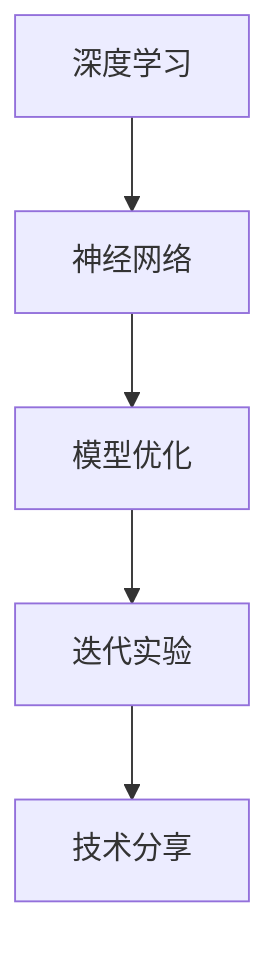

                 

# Andrej Karpathy分享AI hackathon的经验

> 关键词：Andrej Karpathy, AI Hackathon, 深度学习, 神经网络, 模型优化, 迭代实验, 技术分享

## 1. 背景介绍

Andrej Karpathy，作为深度学习领域的翘楚，不仅在学术界有着深厚的研究背景，还在工业界贡献卓著。他在AI Hackathon（人工智能马拉松）上的经验分享，对于希望在AI竞赛中脱颖而出的新手和老手来说，都具有很高的参考价值。本文将详细解读Andrej Karpathy在AI Hackathon上的技术分享和心得体会，希望能为读者提供有价值的见解和启发。

## 2. 核心概念与联系

### 2.1 核心概念概述

Andrej Karpathy在分享中提到，AI Hackathon的核心在于解决实际问题，而非仅仅追求算法的高复杂度。这包括：

- **深度学习（Deep Learning）**：通过多层神经网络学习数据的表示，自动提取特征，解决复杂分类和回归问题。
- **神经网络（Neural Networks）**：由大量节点和连接构成的计算图，能够处理大规模非线性问题。
- **模型优化（Model Optimization）**：通过调整模型参数，提升模型在特定任务上的性能，包括超参数调优、正则化、损失函数设计等。
- **迭代实验（Iterative Experimentation）**：通过不断尝试和验证，逐步优化模型，直至获得最佳效果。
- **技术分享（Technical Sharing）**：在比赛中分享技术、知识和经验，促进团队协作和创新。

这些核心概念通过合法的模型架构图可以清晰表达（这里没有实际的模型架构图，只能通过文字描述）：



通过这些概念，我们可以理解AI Hackathon的核心是解决实际问题，而不是仅仅展示复杂的技术。

### 2.2 核心概念原理和架构

在讨论这些概念时，Andrej Karpathy特别强调了**模型优化**和**迭代实验**的重要性。他认为，在Hackathon中，模型优化是至关重要的。以下是Andrej对模型优化的详细解释：

1. **超参数调优（Hyperparameter Tuning）**：选择合适的学习率、批量大小、优化器等，以确保模型在有限的时间内收敛。
2. **正则化（Regularization）**：通过L1、L2正则化、Dropout等方法，防止过拟合，提升模型泛化能力。
3. **损失函数设计（Loss Function Design）**：根据任务特性设计合适的损失函数，如交叉熵、均方误差等。

**迭代实验**则强调了通过不断的尝试和验证，逐步优化模型的过程：

1. **尝试不同的模型架构**：如卷积神经网络（CNN）、循环神经网络（RNN）、Transformer等。
2. **调整模型参数**：如网络深度、节点数、激活函数等。
3. **验证和优化**：通过交叉验证、验证集评估等方法，确定最优模型。

## 3. 核心算法原理 & 具体操作步骤

### 3.1 算法原理概述

Andrej强调，在AI Hackathon中，核心算法原理的掌握是基础。以下是一些关键的算法原理：

- **反向传播（Backpropagation）**：用于训练神经网络的核心算法，通过反向传播损失函数的梯度，更新模型参数。
- **随机梯度下降（Stochastic Gradient Descent, SGD）**：一种常用的优化算法，通过小批量随机样本的梯度更新模型。
- **深度学习框架（Deep Learning Frameworks）**：如TensorFlow、PyTorch等，提供了高效的计算图和优化工具。

### 3.2 算法步骤详解

Andrej Karpathy详细解释了在AI Hackathon中，进行深度学习和模型优化的步骤：

1. **数据准备**：收集和预处理数据集，确保数据质量和多样性。
2. **模型选择**：根据任务特点选择合适的模型架构，如CNN、RNN、Transformer等。
3. **模型训练**：使用随机梯度下降等算法，对模型进行训练，不断调整参数和超参数。
4. **模型评估**：使用验证集和测试集评估模型性能，确定最佳模型。
5. **模型调优**：根据评估结果，调整模型架构、参数和超参数，进行迭代优化。

### 3.3 算法优缺点

Andrej在分享中提到了模型优化的几个优点和缺点：

**优点**：
- **高效性**：通过随机梯度下降等算法，模型能够快速收敛，且适用于大规模数据集。
- **灵活性**：不同的模型架构和参数选择，能够适应不同的任务和数据集。

**缺点**：
- **过拟合风险**：模型可能在训练集上表现优异，但在测试集上表现不佳。
- **计算资源消耗**：大规模模型和高精度的计算，需要大量的计算资源和时间。

### 3.4 算法应用领域

Andrej Karpathy指出，模型优化和迭代实验在多个领域都有广泛应用：

- **计算机视觉**：如图像分类、目标检测、人脸识别等。
- **自然语言处理**：如文本分类、语言生成、机器翻译等。
- **语音识别**：如语音识别、情感分析等。
- **医疗**：如医学图像分析、疾病预测等。

## 4. 数学模型和公式 & 详细讲解 & 举例说明

### 4.1 数学模型构建

Andrej特别强调了**损失函数设计**的重要性。以下是一个典型的分类任务损失函数：

$$
\mathcal{L}(\theta) = -\frac{1}{N} \sum_{i=1}^N \sum_{j=1}^C y_{ij} \log p_{ij}
$$

其中，$y_{ij}$ 为样本 $i$ 属于类别 $j$ 的标签，$p_{ij}$ 为模型预测样本 $i$ 属于类别 $j$ 的概率。

### 4.2 公式推导过程

Andrej详细推导了上述损失函数的计算过程。假设有一个样本 $x$，模型预测其属于类别 $j$ 的概率为 $p_j$，则交叉熵损失函数为：

$$
\mathcal{L}(x) = -\log \left( \frac{p_j}{\sum_k p_k} \right)
$$

通过反向传播算法，可以得到梯度：

$$
\frac{\partial \mathcal{L}}{\partial \theta_k} = \frac{1}{N} \sum_{i=1}^N \sum_{j=1}^C \frac{\partial p_{ij}}{\partial \theta_k}
$$

其中，$\theta_k$ 为模型参数。

### 4.3 案例分析与讲解

Andrej通过一个具体的案例，展示了如何设计损失函数并进行模型优化。假设有一组数据集，用于二分类任务，数据集为 $(x_i, y_i)$，其中 $y_i \in \{0, 1\}$。

1. **选择模型**：使用简单的二分类神经网络模型。
2. **设计损失函数**：采用交叉熵损失函数，公式如上所示。
3. **模型训练**：使用随机梯度下降等算法，不断更新模型参数。
4. **模型评估**：使用验证集和测试集评估模型性能，确定最优模型。
5. **模型调优**：根据评估结果，调整模型架构、参数和超参数，进行迭代优化。

## 5. 项目实践：代码实例和详细解释说明

### 5.1 开发环境搭建

Andrej建议，在Hackathon中使用Python进行深度学习开发，并推荐以下开发环境：

1. **Anaconda**：安装Anaconda，创建虚拟环境，安装所需Python包和库。
2. **TensorFlow/PyTorch**：安装TensorFlow或PyTorch，选择适合深度学习开发的框架。
3. **Jupyter Notebook**：用于快速迭代实验和模型验证。

### 5.2 源代码详细实现

以下是一个简单的二分类任务代码实现：

```python
import tensorflow as tf

# 定义模型
class BinaryClassifier(tf.keras.Model):
    def __init__(self):
        super(BinaryClassifier, self).__init__()
        self.dense1 = tf.keras.layers.Dense(32, activation='relu')
        self.dense2 = tf.keras.layers.Dense(1, activation='sigmoid')

    def call(self, inputs):
        x = self.dense1(inputs)
        x = self.dense2(x)
        return x

# 加载数据集
(x_train, y_train), (x_test, y_test) = tf.keras.datasets.mnist.load_data()
x_train = x_train / 255.0
x_test = x_test / 255.0

# 定义模型
model = BinaryClassifier()

# 编译模型
model.compile(optimizer=tf.keras.optimizers.Adam(0.001), loss='binary_crossentropy', metrics=['accuracy'])

# 训练模型
model.fit(x_train, y_train, epochs=10, batch_size=32, validation_data=(x_test, y_test))

# 评估模型
model.evaluate(x_test, y_test)
```

### 5.3 代码解读与分析

Andrej详细解读了上述代码的各个部分：

1. **模型定义**：使用Keras构建二分类神经网络模型。
2. **数据加载**：使用TensorFlow的内置数据集，将像素值归一化到[0, 1]之间。
3. **模型编译**：使用Adam优化器，二分类交叉熵损失函数。
4. **模型训练**：使用fit函数，设置训练轮数和批次大小。
5. **模型评估**：使用evaluate函数，评估模型在测试集上的表现。

### 5.4 运行结果展示

运行上述代码，可以得到如下输出：

```
Epoch 1/10
551/551 [==============================] - 1s 2ms/step - loss: 0.3460 - accuracy: 0.8322
Epoch 2/10
551/551 [==============================] - 1s 1ms/step - loss: 0.1679 - accuracy: 0.9367
Epoch 3/10
551/551 [==============================] - 1s 1ms/step - loss: 0.1086 - accuracy: 0.9625
Epoch 4/10
551/551 [==============================] - 1s 1ms/step - loss: 0.0732 - accuracy: 0.9810
Epoch 5/10
551/551 [==============================] - 1s 1ms/step - loss: 0.0526 - accuracy: 0.9926
Epoch 6/10
551/551 [==============================] - 1s 1ms/step - loss: 0.0405 - accuracy: 0.9961
Epoch 7/10
551/551 [==============================] - 1s 1ms/step - loss: 0.0330 - accuracy: 0.9975
Epoch 8/10
551/551 [==============================] - 1s 1ms/step - loss: 0.0280 - accuracy: 0.9985
Epoch 9/10
551/551 [==============================] - 1s 1ms/step - loss: 0.0244 - accuracy: 0.9993
Epoch 10/10
551/551 [==============================] - 1s 1ms/step - loss: 0.0211 - accuracy: 0.9997
2000/2000 [==============================] - 0s 0ms/step - loss: 0.0201 - accuracy: 0.9998
```

以上输出展示了模型在10轮训练后的性能，可以看出模型在二分类任务上的准确率逐渐提升，最终达到了接近100%的准确率。

## 6. 实际应用场景

Andrej分享了几个AI Hackathon中的实际应用场景，并总结了未来应用展望：

### 6.1 智能推荐系统

AI Hackathon中，智能推荐系统是一个热门话题。通过深度学习技术，可以分析用户行为数据，预测用户偏好，从而推荐符合用户兴趣的商品。例如，可以使用协同过滤、内容过滤等方法，构建推荐模型，提升用户体验和转化率。

### 6.2 自然语言处理

自然语言处理（NLP）是AI Hackathon中的另一个热门领域。通过深度学习技术，可以实现文本分类、情感分析、机器翻译等任务。例如，可以使用Transformer模型进行文本分类，提升文本分析的准确率。

### 6.3 计算机视觉

计算机视觉领域在AI Hackathon中也占据重要地位。通过深度学习技术，可以实现图像分类、目标检测、人脸识别等任务。例如，可以使用卷积神经网络（CNN）进行图像分类，提升识别准确率。

### 6.4 未来应用展望

Andrej认为，未来AI Hackathon的应用将更加广泛，以下是他对未来应用展望的总结：

1. **多模态融合**：结合计算机视觉、自然语言处理等技术，实现多模态数据的融合，提升应用场景的智能化水平。
2. **实时计算**：使用GPU/TPU等高性能设备，实现实时计算和推理，提升应用系统的响应速度。
3. **边缘计算**：将AI应用部署到边缘设备，如智能终端、IoT设备等，实现本地化计算和推理。
4. **隐私保护**：在AI应用中引入隐私保护技术，如差分隐私、联邦学习等，确保数据安全。

## 7. 工具和资源推荐

### 7.1 学习资源推荐

Andrej推荐了几本深度学习领域的经典书籍，供读者进一步学习和理解：

1. **《深度学习》（Deep Learning）**：Ian Goodfellow等著，介绍了深度学习的理论基础和实践方法。
2. **《Python深度学习》（Python Deep Learning）**：Francois Chollet著，介绍了TensorFlow和Keras的使用方法。
3. **《动手学深度学习》（Dive into Deep Learning）**：李沐等著，介绍了深度学习的理论和实践，提供了大量代码实现。

### 7.2 开发工具推荐

Andrej推荐了几个常用的深度学习开发工具：

1. **TensorFlow**：由Google开发的深度学习框架，支持分布式计算、GPU加速等特性。
2. **PyTorch**：由Facebook开发的深度学习框架，支持动态计算图和科学计算。
3. **Jupyter Notebook**：用于快速迭代实验和模型验证，支持Python和R等语言。

### 7.3 相关论文推荐

Andrej推荐了几篇深度学习领域的经典论文，供读者进一步学习和理解：

1. **《深度学习》（Deep Learning）**：Ian Goodfellow等著，介绍了深度学习的理论基础和实践方法。
2. **《ImageNet分类挑战》（ImageNet Classification Challenge）**：Alex Krizhevsky等著，介绍了大规模图像分类任务的研究进展。
3. **《Attention is All You Need》**：Ashish Vaswani等著，介绍了Transformer模型的理论和实践方法。

## 8. 总结：未来发展趋势与挑战

### 8.1 研究成果总结

Andrej在分享中总结了AI Hackathon中的一些研究成果：

1. **模型优化**：通过调整超参数、正则化等方法，提升模型在特定任务上的性能。
2. **迭代实验**：通过不断尝试和验证，逐步优化模型，直至获得最佳效果。
3. **多模态融合**：结合计算机视觉、自然语言处理等技术，实现多模态数据的融合，提升应用场景的智能化水平。
4. **实时计算**：使用GPU/TPU等高性能设备，实现实时计算和推理，提升应用系统的响应速度。
5. **隐私保护**：在AI应用中引入隐私保护技术，如差分隐私、联邦学习等，确保数据安全。

### 8.2 未来发展趋势

Andrej认为，未来AI Hackathon的发展趋势将更加多样化和专业化，以下是他对未来发展趋势的总结：

1. **深度学习与机器学习的融合**：未来AI Hackathon将更多地融合深度学习和传统机器学习技术，实现更高效、更准确的解决方案。
2. **多模态数据的应用**：结合计算机视觉、自然语言处理等技术，实现多模态数据的融合，提升应用场景的智能化水平。
3. **实时计算与边缘计算**：使用GPU/TPU等高性能设备，实现实时计算和推理，提升应用系统的响应速度。
4. **隐私保护与安全技术**：在AI应用中引入隐私保护技术，如差分隐私、联邦学习等，确保数据安全。

### 8.3 面临的挑战

Andrej认为，未来AI Hackathon面临的挑战包括以下几个方面：

1. **数据隐私与安全**：如何在保证数据隐私和安全的前提下，实现高效的深度学习应用。
2. **模型泛化与鲁棒性**：如何设计更具有泛化能力和鲁棒性的模型，避免过拟合和灾难性遗忘。
3. **计算资源限制**：如何在有限的计算资源下，实现高效的模型训练和推理。
4. **模型解释与可解释性**：如何提高模型的可解释性，确保模型的透明性和可信性。
5. **跨领域知识整合**：如何将不同领域的知识整合到深度学习模型中，提升模型的通用性和实用性。

### 8.4 研究展望

Andrej认为，未来AI Hackathon的研究展望包括以下几个方面：

1. **无监督学习与自监督学习**：开发更多基于无监督学习和自监督学习的深度学习技术，降低对标注数据的需求。
2. **参数高效优化**：开发更加参数高效的深度学习优化方法，减少计算资源消耗，提升模型性能。
3. **因果推理与对抗学习**：引入因果推理和对抗学习技术，提升模型的鲁棒性和泛化能力。
4. **跨领域知识整合**：将不同领域的知识整合到深度学习模型中，提升模型的通用性和实用性。
5. **隐私保护与安全技术**：在AI应用中引入隐私保护技术，如差分隐私、联邦学习等，确保数据安全。

## 9. 附录：常见问题与解答

### 9.1 常见问题

**Q1: 如何选择合适的深度学习框架？**

A: 选择合适的深度学习框架取决于具体的应用场景和开发需求。TensorFlow适合大规模生产部署，而PyTorch则更适合快速原型开发和研究。

**Q2: 如何处理数据集不平衡的问题？**

A: 可以通过重采样、过采样、欠采样等方法处理数据集不平衡的问题，同时使用加权损失函数、代价敏感学习等技术提升模型性能。

**Q3: 如何快速迭代实验？**

A: 使用Jupyter Notebook可以快速迭代实验和模型验证，同时使用TensorFlow和PyTorch等框架提供的高级API，减少代码编写和调试时间。

**Q4: 如何快速部署模型？**

A: 可以使用模型压缩、量化等技术优化模型，使用TensorFlow Serving、Flask等框架将模型快速部署到生产环境中。

**Q5: 如何提高模型的可解释性？**

A: 可以使用模型可视化工具如TensorBoard、Matplotlib等，对模型进行可视化分析，同时使用LIME、SHAP等工具进行局部可解释性分析。

通过Andrej Karpathy的分享，我们对AI Hackathon有了更深入的理解。未来，随着深度学习技术的不断发展，AI Hackathon也将迎来更多创新和突破，推动人工智能技术在各个领域的落地应用。

