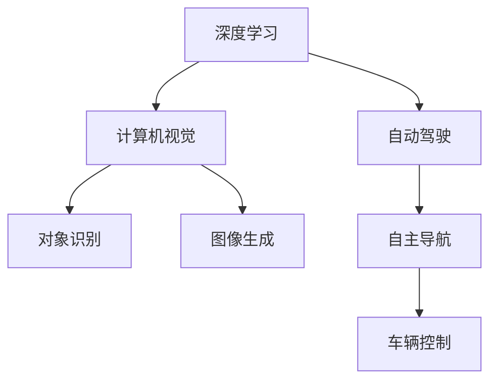

                 

## 1. 背景介绍

安德里·卡帕希（Andrej Karpathy）是机器学习领域的重要人物之一，他以其在深度学习、计算机视觉和自动驾驶等方面的贡献而闻名于世。卡帕希的研究和教学在机器学习社区中有着深远的影响，他提出的诸多概念和算法已经成为该领域的标准。本文旨在探讨卡帕希对人工智能未来发展方向的见解，包括他的研究进展、技术突破以及应对挑战的策略。

## 2. 核心概念与联系

### 2.1 核心概念概述

卡帕希的研究涵盖了深度学习、计算机视觉和自动驾驶等多个领域，他的核心概念和理论对机器学习的发展产生了深远的影响。以下是几个关键概念的概述：

- **深度学习**：一种通过多层次非线性处理单元构建的神经网络，能够自动从数据中提取高级特征，是实现复杂模式识别和预测任务的关键技术。
- **计算机视觉**：研究如何让计算机从图像和视频中提取信息，理解视觉场景，并进行对象识别、图像生成等任务。
- **自动驾驶**：结合计算机视觉、机器学习、控制理论等技术，使车辆能够自主导航，实现交通出行自动化。

### 2.2 核心概念原理和架构的 Mermaid 流程图



## 3. 核心算法原理 & 具体操作步骤

### 3.1 算法原理概述

卡帕希的研究集中在深度学习算法的设计和优化上，特别是卷积神经网络（CNN）和循环神经网络（RNN）。他提出的算法如RNN的变体LSTM和GRU，以及用于图像识别的卷积神经网络，极大地推动了深度学习技术的发展。

#### 3.1.1 RNN与LSTM

RNN是一种递归神经网络，能够处理序列数据，但由于梯度消失问题，难以长时间训练。LSTM（长短期记忆网络）通过引入门控机制，解决了这一问题，使得模型可以更好地捕捉长期依赖关系。

#### 3.1.2 卷积神经网络

卷积神经网络通过卷积操作提取图像中的局部特征，再通过池化操作减少特征图的大小，最后通过全连接层进行分类。卡帕希在图像分类、目标检测等任务上，通过改进卷积神经网络的结构和训练策略，实现了多项SOTA结果。

### 3.2 算法步骤详解

卡帕希的研究方法通常包括以下步骤：

1. **问题定义**：明确研究问题的背景和目标，包括数据集、评估指标等。
2. **算法设计**：设计相应的神经网络结构和训练策略，如卷积层、池化层、激活函数等。
3. **模型训练**：使用优化器（如Adam、SGD等）和损失函数（如交叉熵、均方误差等）训练模型，调整超参数以优化性能。
4. **模型评估**：在验证集和测试集上评估模型性能，调整模型结构或训练策略以提高准确率。

### 3.3 算法优缺点

#### 3.3.1 优点

- **自动特征提取**：深度学习模型能够自动从数据中学习特征，减少了手动特征工程的工作量。
- **泛化能力强**：经过大量数据训练后，深度学习模型在未见过的数据上也能表现良好。
- **可扩展性强**：通过堆叠更多的神经网络层，可以显著提升模型的性能。

#### 3.3.2 缺点

- **训练时间长**：深度学习模型通常需要大量的计算资源和时间进行训练。
- **参数量大**：模型的参数量随着层数的增加而急剧增加，可能导致过拟合。
- **数据依赖性强**：深度学习模型对数据质量要求较高，数据不平衡、噪声等问题会影响模型性能。

### 3.4 算法应用领域

卡帕希的研究成果在多个领域得到了广泛应用：

- **计算机视觉**：用于图像分类、目标检测、图像生成等任务。
- **自然语言处理**：用于机器翻译、情感分析、问答系统等任务。
- **自动驾驶**：用于环境感知、路径规划、决策制定等。

## 4. 数学模型和公式 & 详细讲解 & 举例说明

### 4.1 数学模型构建

在卷积神经网络中，数学模型通常包括卷积层、池化层、全连接层等组件。以图像分类任务为例，模型通常包含卷积层提取图像特征，池化层减少特征图大小，最后通过全连接层进行分类。

#### 4.1.1 卷积层

卷积层通过卷积核（Filter）对输入图像进行卷积操作，提取图像的局部特征。数学表达式如下：

$$
y_i = f(\sum_{k=1}^{K} w_{k,i} \cdot x_{k,j-1} + b_{k})
$$

其中 $x$ 为输入特征，$w$ 为卷积核权重，$b$ 为偏置项，$f$ 为激活函数。

#### 4.1.2 池化层

池化层通过下采样操作减少特征图大小，通常采用最大池化或平均池化。最大池化表达式如下：

$$
y_i = \max\limits_{j \in R} x_{i,j}
$$

其中 $x$ 为输入特征，$y$ 为输出特征。

#### 4.1.3 全连接层

全连接层通过连接所有神经元实现分类。数学表达式如下：

$$
z = \sum_{i=1}^{n} w_i x_i + b
$$

其中 $z$ 为输出，$w$ 为权重，$x$ 为输入，$b$ 为偏置项。

### 4.2 公式推导过程

以卷积神经网络为例，其训练过程包括前向传播和反向传播。

#### 4.2.1 前向传播

前向传播过程中，卷积层的输出经过激活函数后，传递到下一层。池化层通过下采样减少特征图大小。最后，全连接层将特征图转换为类别概率，表达式如下：

$$
y = \sigma(\sum_{i=1}^{n} w_i x_i + b)
$$

其中 $\sigma$ 为激活函数，如Sigmoid、ReLU等。

#### 4.2.2 反向传播

反向传播过程中，通过链式法则计算梯度，更新权重和偏置项。梯度下降表达式如下：

$$
w \leftarrow w - \eta \frac{\partial \ell}{\partial w}
$$

其中 $\eta$ 为学习率，$\ell$ 为损失函数，$\partial \ell / \partial w$ 为梯度。

### 4.3 案例分析与讲解

以图像分类任务为例，使用ResNet模型进行说明。ResNet模型通过引入残差连接（Residual Connections）解决深度网络中的梯度消失问题，使得网络可以更深。

#### 4.3.1 ResNet模型

ResNet模型结构如下：

```
[input] --> [conv1] --> [conv2] --> [conv3] --> [conv4] --> [conv5] --> [avgpool] --> [fc]
```

其中，[conv1]至[conv5]为卷积层，[avgpool]为池化层，[fc]为全连接层。

#### 4.3.2 训练过程

以ImageNet数据集为例，使用SGD优化器进行训练。模型先经过前向传播计算损失，然后通过反向传播计算梯度，最后使用SGD更新参数。

```python
import torch
import torch.nn as nn
import torch.optim as optim
from torchvision import datasets, transforms

# 定义模型
model = nn.Sequential(
    nn.Conv2d(3, 64, kernel_size=3, stride=1, padding=1),
    nn.ReLU(),
    nn.MaxPool2d(kernel_size=2, stride=2),
    nn.Conv2d(64, 128, kernel_size=3, stride=1, padding=1),
    nn.ReLU(),
    nn.MaxPool2d(kernel_size=2, stride=2),
    nn.Conv2d(128, 256, kernel_size=3, stride=1, padding=1),
    nn.ReLU(),
    nn.MaxPool2d(kernel_size=2, stride=2),
    nn.Conv2d(256, 512, kernel_size=3, stride=1, padding=1),
    nn.ReLU(),
    nn.MaxPool2d(kernel_size=2, stride=2),
    nn.AdaptiveAvgPool2d((1, 1)),
    nn.Linear(512, 1000),
    nn.Sigmoid()
)

# 加载数据
train_dataset = datasets.ImageFolder('train', transform=transforms.ToTensor())
test_dataset = datasets.ImageFolder('test', transform=transforms.ToTensor())

# 定义优化器和损失函数
optimizer = optim.SGD(model.parameters(), lr=0.01, momentum=0.9)
criterion = nn.BCELoss()

# 训练模型
for epoch in range(10):
    model.train()
    for data, target in train_loader:
        optimizer.zero_grad()
        output = model(data)
        loss = criterion(output, target)
        loss.backward()
        optimizer.step()

    model.eval()
    with torch.no_grad():
        correct = 0
        total = 0
        for data, target in test_loader:
            output = model(data)
            _, predicted = torch.max(output, 1)
            total += target.size(0)
            correct += (predicted == target).sum().item()
        print(f'Accuracy: {100 * correct / total}%')
```

## 5. 项目实践：代码实例和详细解释说明

### 5.1 开发环境搭建

要使用卡帕希的研究成果，需要安装深度学习框架和相关库。以下是在PyTorch环境下搭建开发环境的示例：

1. 安装PyTorch：

```
pip install torch torchvision torchaudio
```

2. 安装相关库：

```
pip install numpy scipy matplotlib tensorboard
```

3. 安装Google Colab：

```
pip install --upgrade google-auth google-auth-oauthlib google-auth-httplib2 google-api-python-client google-auth-netrc google-auth-oauthlib
```

### 5.2 源代码详细实现

以下是一个使用PyTorch实现卷积神经网络的示例代码：

```python
import torch
import torch.nn as nn
import torch.optim as optim
from torchvision import datasets, transforms

# 定义模型
class Net(nn.Module):
    def __init__(self):
        super(Net, self).__init__()
        self.conv1 = nn.Conv2d(1, 6, 3, padding=1)
        self.conv2 = nn.Conv2d(6, 16, 5, padding=2)
        self.pool = nn.MaxPool2d(2, 2)
        self.fc1 = nn.Linear(16 * 5 * 5, 120)
        self.fc2 = nn.Linear(120, 84)
        self.fc3 = nn.Linear(84, 10)

    def forward(self, x):
        x = self.pool(torch.relu(self.conv1(x)))
        x = self.pool(torch.relu(self.conv2(x)))
        x = x.view(-1, 16 * 5 * 5)
        x = torch.relu(self.fc1(x))
        x = torch.relu(self.fc2(x))
        x = self.fc3(x)
        return x

# 加载数据
train_dataset = datasets.MNIST(root='data', train=True, transform=transforms.ToTensor(), download=True)
test_dataset = datasets.MNIST(root='data', train=False, transform=transforms.ToTensor(), download=True)

# 定义优化器和损失函数
model = Net()
optimizer = optim.SGD(model.parameters(), lr=0.001, momentum=0.9)
criterion = nn.CrossEntropyLoss()

# 训练模型
for epoch in range(10):
    model.train()
    for data, target in train_loader:
        optimizer.zero_grad()
        output = model(data)
        loss = criterion(output, target)
        loss.backward()
        optimizer.step()

    model.eval()
    with torch.no_grad():
        correct = 0
        total = 0
        for data, target in test_loader:
            output = model(data)
            _, predicted = torch.max(output, 1)
            total += target.size(0)
            correct += (predicted == target).sum().item()
        print(f'Accuracy: {100 * correct / total}%')
```

### 5.3 代码解读与分析

#### 5.3.1 模型定义

定义了一个卷积神经网络模型Net，包含卷积层、池化层和全连接层。其中，卷积层通过卷积核提取特征，池化层通过下采样减少特征图大小，全连接层进行分类。

#### 5.3.2 训练过程

使用SGD优化器和交叉熵损失函数训练模型。在每个epoch中，先进行前向传播计算损失，然后进行反向传播更新参数。

## 6. 实际应用场景

### 6.4 未来应用展望

卡帕希对人工智能的未来发展方向有着深刻的见解，以下是他的几点展望：

#### 6.4.1 深度学习的发展

深度学习技术将继续发展，通过更复杂的网络结构、更大的数据集、更高效的优化算法，实现更高的性能。同时，深度学习在计算机视觉、自然语言处理等领域的广泛应用将进一步深化。

#### 6.4.2 自动驾驶的突破

自动驾驶技术将成为未来交通运输的核心技术。随着传感器和计算技术的进步，自动驾驶系统将变得更加智能化、安全可靠。

#### 6.4.3 人工智能伦理与安全

随着人工智能技术的广泛应用，伦理和安全问题将受到越来越多的关注。如何确保人工智能系统的透明性、公正性、安全性，将是未来的重要研究方向。

## 7. 工具和资源推荐

### 7.1 学习资源推荐

卡帕希的讲座和论文是学习深度学习的极佳资源。以下是一些推荐的学习资源：

1. **Deep Learning Specialization**：卡帕希在Coursera上开设的深度学习课程系列，涵盖深度学习的基本概念和实践技巧。

2. **CS231n: Convolutional Neural Networks for Visual Recognition**：斯坦福大学计算机视觉课程，详细讲解卷积神经网络的结构和训练方法。

3. **Playing Weird Visual Games with Deep Learning**：卡帕希的Kaggle竞赛项目，展示了深度学习在计算机视觉领域的有趣应用。

4. **ArXiv预印本**：卡帕希的研究论文大多发表在ArXiv上，可以方便地下载和阅读。

### 7.2 开发工具推荐

以下是一些常用的深度学习开发工具和库：

1. **PyTorch**：深度学习框架，支持动态计算图，适合研究和实验。

2. **TensorFlow**：Google开发的深度学习框架，支持静态计算图，适合生产部署。

3. **Keras**：高级神经网络API，支持多种深度学习框架。

4. **Jupyter Notebook**：交互式编程环境，支持多种编程语言和库。

### 7.3 相关论文推荐

以下是一些卡帕希的代表性论文：

1. **Visualizing and Understanding the Deep Image Prior**：提出了一种基于深度学习的图像生成方法，通过预训练的卷积神经网络作为图像生成器。

2. **Long Short-Term Memory**：提出LSTM模型，解决了传统RNN中的梯度消失问题，实现了长序列数据的有效建模。

3. **End-to-End Learning for Self-Driving Cars**：介绍了自动驾驶系统中的端到端学习框架，实现了从环境感知到决策制定的全流程自动化。

## 8. 总结：未来发展趋势与挑战

### 8.1 研究成果总结

卡帕希的研究成果涵盖了深度学习、计算机视觉、自动驾驶等多个领域，其核心思想和方法已成为机器学习领域的重要组成部分。

### 8.2 未来发展趋势

#### 8.2.1 深度学习的发展

深度学习将继续发展，通过更复杂的网络结构、更大的数据集、更高效的优化算法，实现更高的性能。同时，深度学习在计算机视觉、自然语言处理等领域的广泛应用将进一步深化。

#### 8.2.2 自动驾驶的突破

自动驾驶技术将成为未来交通运输的核心技术。随着传感器和计算技术的进步，自动驾驶系统将变得更加智能化、安全可靠。

#### 8.2.3 人工智能伦理与安全

随着人工智能技术的广泛应用，伦理和安全问题将受到越来越多的关注。如何确保人工智能系统的透明性、公正性、安全性，将是未来的重要研究方向。

### 8.3 面临的挑战

尽管深度学习在多个领域取得了显著进展，但也面临一些挑战：

#### 8.3.1 数据依赖性强

深度学习模型对数据质量要求较高，数据不平衡、噪声等问题会影响模型性能。

#### 8.3.2 训练时间较长

深度学习模型通常需要大量的计算资源和时间进行训练。

#### 8.3.3 模型复杂度高

深度学习模型的参数量随着层数的增加而急剧增加，可能导致过拟合。

### 8.4 研究展望

未来，深度学习将继续拓展应用领域，推动人工智能技术的发展。同时，解决数据依赖、训练时间长、模型复杂度高等问题，将是重要的研究方向。

## 9. 附录：常见问题与解答

### Q1: 深度学习算法有哪些缺点？

A: 深度学习算法的主要缺点包括：
- 数据依赖性强：需要大量的标注数据进行训练，获取数据成本较高。
- 训练时间长：模型参数量较大，训练时间较长。
- 模型复杂度高：深度学习模型通常结构复杂，难以解释和调试。

### Q2: 卷积神经网络有哪些应用？

A: 卷积神经网络在计算机视觉领域有广泛应用，如图像分类、目标检测、图像生成等。同时，卷积神经网络在自然语言处理领域也有重要应用，如文本分类、情感分析等。

### Q3: 如何提高深度学习模型的泛化能力？

A: 提高深度学习模型的泛化能力可以采取以下措施：
- 数据增强：通过扩充训练数据集，提高模型的泛化能力。
- 正则化：通过L2正则、Dropout等方法，避免过拟合。
- 迁移学习：利用预训练模型在大规模数据上进行训练，然后在小规模数据上进行微调。

### Q4: 什么是LSTM？它与RNN有何不同？

A: LSTM（长短期记忆网络）是一种特殊的递归神经网络（RNN），通过引入门控机制解决传统RNN中的梯度消失问题。LSTM在处理长序列数据时效果更好，能够捕捉长期依赖关系。

### Q5: 自动驾驶系统中的端到端学习框架是什么？

A: 自动驾驶系统中的端到端学习框架是一种全流程自动化学习方法，通过学习从环境感知到决策制定的全过程，实现自动驾驶系统的智能化。

