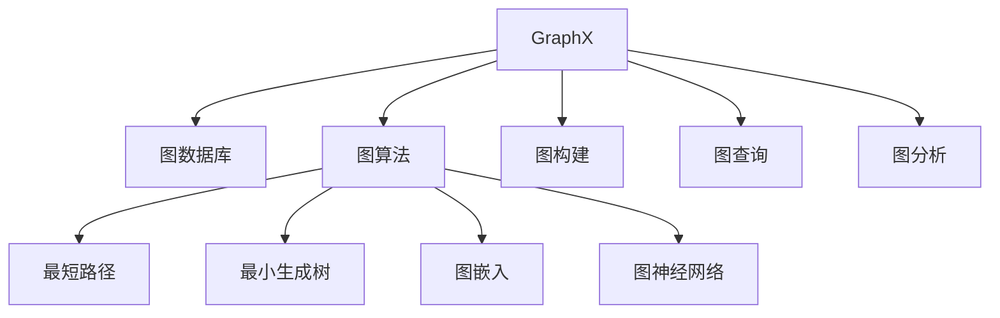

                 

# GraphX原理与代码实例讲解

> 关键词：GraphX, 图数据库, 图算法, 图神经网络, 图计算, 可视化

## 1. 背景介绍

在数据处理和分析的众多框架中，图数据库（Graph Database）正变得越来越重要。与传统的行式数据库不同，图数据库以图形的方式存储和查询数据，可以更好地处理复杂的关系网络数据。GraphX是Apache Spark提供的一个用于大规模图处理和分析的框架，它整合了Spark的数据处理能力和图形处理能力，支持对大规模图数据的高效处理和分析。

本篇文章将对GraphX的基本概念、原理、核心算法、操作步骤以及实际应用进行详细讲解，并通过丰富的代码实例和分析，帮助读者全面掌握GraphX的使用。

## 2. 核心概念与联系

### 2.1 核心概念概述

**图数据库（Graph Database）**：以图形的方式存储和查询数据，支持复杂关系网络数据的存储和查询。常见的图数据库包括Neo4j、OrientDB、ArangoDB等。

**GraphX**：Apache Spark提供的大规模图处理和分析框架。支持基于Spark的大规模图计算，包括图构建、图查询、图分析和图算法等功能。

**图（Graph）**：由节点（Vertex）和边（Edge）组成的数据结构。节点表示实体，边表示实体之间的关系。

**图算法（Graph Algorithms）**：用于在图上进行操作的算法，如最短路径、最小生成树、图嵌入等。

**图神经网络（Graph Neural Networks, GNNs）**：利用图结构处理数据的深度学习模型，广泛应用于推荐系统、社交网络分析等领域。

**图计算（Graph Computation）**：在大规模图数据上执行的各种计算操作，如图嵌入、图算法等。

### 2.2 核心概念原理和架构的 Mermaid 流程图



## 3. 核心算法原理 & 具体操作步骤

### 3.1 算法原理概述

GraphX基于图数据库构建图的计算框架，支持图数据的加载、存储、计算、分析和可视化。GraphX的算法原理主要包括以下几个方面：

1. **图构建（Graph Construction）**：将数据转换为图数据结构，支持多种数据格式，包括边文件（Edge File）、点文件（Vertex File）等。
2. **图查询（Graph Query）**：基于图数据库的查询语言，支持SPARQL和Pregel等查询方式。
3. **图分析（Graph Analysis）**：提供多种分析算法，如度数分布、节点间相似度计算、子图模式匹配等。
4. **图算法（Graph Algorithms）**：实现多种图算法，包括最短路径、最小生成树、聚类等。

### 3.2 算法步骤详解

#### 3.2.1 图构建

GraphX支持多种图数据格式，包括边文件（Edge File）和点文件（Vertex File）。以下是常见的图数据格式和GraphX的代码实现：

1. **边文件（Edge File）**：

```python
# 读取边文件
edges = EdgeFile("edges.txt")

# 构建图
G = Graph().AddEdgeSet(edges)
```

2. **点文件（Vertex File）**：

```python
# 读取点文件
vertices = VertexFile("vertices.txt")

# 构建图
G = Graph().AddVerticesSet(vertices)
```

#### 3.2.2 图查询

GraphX支持多种查询方式，包括SPARQL和Pregel。以下是常用的查询操作：

1. **SPARQL查询**：

```python
# 查询顶点
query = "SELECT ?vertex FROM vertices WHERE id=123"
vertex = G.gql(query)
```

2. **Pregel查询**：

```python
# 查询顶点和边
vertex = G.pregel("SELECT ?vertex FROM vertices WHERE id=123")
edge = G.pregel("SELECT ?edge FROM edges WHERE source=123")
```

#### 3.2.3 图分析

GraphX提供了多种图分析算法，包括度数分布、节点间相似度计算、子图模式匹配等。以下是常用的分析操作：

1. **度数分布**：

```python
# 查询顶点度数分布
degreeDistribution = G.degreeStatistics()
```

2. **节点间相似度计算**：

```python
# 计算节点间相似度
similarityMatrix = G.similarityGraph()
```

3. **子图模式匹配**：

```python
# 查询子图模式
subgraph = G.subgraph("SELECT ?vertex, ?edge FROM vertices WHERE id=123")
```

#### 3.2.4 图算法

GraphX实现了多种图算法，包括最短路径、最小生成树、聚类等。以下是常用的算法操作：

1. **最短路径**：

```python
# 查询最短路径
shortestPath = G.shortestPaths(123)
```

2. **最小生成树**：

```python
# 查询最小生成树
minimumSpanningTree = G.minimumSpanningTree()
```

3. **聚类**：

```python
# 进行聚类
clusters = G.cluster()
```

### 3.3 算法优缺点

#### 3.3.1 优点

1. **高效处理大规模图数据**：GraphX基于Spark，支持大规模分布式计算，能够高效处理大规模图数据。
2. **支持多种图数据格式**：GraphX支持多种图数据格式，包括边文件和点文件，支持多种数据源和格式。
3. **多种图算法和分析算法**：GraphX提供了多种图算法和分析算法，支持丰富的图操作和分析。
4. **可视化支持**：GraphX支持多种可视化工具，能够将分析结果可视化展示，方便理解和分析。

#### 3.3.2 缺点

1. **复杂性高**：GraphX需要一定的编程能力和数据处理能力，对于初学者来说，可能有一定的学习难度。
2. **性能瓶颈**：GraphX的性能瓶颈主要集中在图数据的加载和存储上，对于大规模图数据的处理，需要较高的计算资源。
3. **缺乏特定领域算法支持**：GraphX提供的算法主要是通用的图算法，对于特定领域的应用，可能需要自行实现特定算法。

### 3.4 算法应用领域

GraphX主要应用于以下领域：

1. **社交网络分析**：GraphX可以用于分析社交网络中的关系和影响力，识别社交网络中的关键节点和社区。
2. **推荐系统**：GraphX可以用于构建用户和物品之间的关系图，进行推荐系统中的关系推荐和相似度计算。
3. **金融风险控制**：GraphX可以用于分析金融数据中的关系和网络结构，进行风险控制和信用评估。
4. **知识图谱构建**：GraphX可以用于构建知识图谱，支持知识图谱中的关系查询和推理。
5. **生物信息学**：GraphX可以用于分析生物数据中的关系和网络结构，进行基因和蛋白质的关系分析。

## 4. 数学模型和公式 & 详细讲解 & 举例说明

### 4.1 数学模型构建

GraphX的数学模型主要基于图结构和图算法，以下是常见的图结构和算法模型：

1. **图结构模型**：

   - 节点（Vertex）：表示实体，包含属性和状态。
   - 边（Edge）：表示实体之间的关系，包含属性和权重。
   - 图（Graph）：由节点和边组成的数据结构。

2. **图算法模型**：

   - 最短路径算法：基于Dijkstra算法或Floyd-Warshall算法。
   - 最小生成树算法：基于Prim算法或Kruskal算法。
   - 聚类算法：基于K-Means算法或Louvain算法。

### 4.2 公式推导过程

#### 4.2.1 最短路径算法

Dijkstra算法是最常用的最短路径算法之一，其公式推导如下：

1. **Dijkstra算法**：

   $$
   d(v) = \min_{u\in V} \{d(u) + w(u,v)\}
   $$

   其中，$d(v)$表示节点$v$的最短路径长度，$w(u,v)$表示从$u$到$v$的权重，$V$表示所有节点的集合。

2. **公式推导**：

   假设从节点$s$到节点$t$的最短路径为$P$，则有：

   $$
   d(t) = d(s) + w(s,u_1) + w(u_1,u_2) + \cdots + w(u_k,t)
   $$

   其中，$u_1,u_2,\cdots,u_k$为$P$上的节点。因此：

   $$
   d(t) = \min_{u\in V} \{d(s) + w(s,u)\} = d(s)
   $$

   即$d(v)$可以表示为所有节点的最小$d(s)$值加上该节点的权重。

#### 4.2.2 最小生成树算法

Prim算法是最常用的最小生成树算法之一，其公式推导如下：

1. **Prim算法**：

   $$
   T^* = \min \{ \sum_{v\in V}w(e_v)\}
   $$

   其中，$T^*$表示最小生成树，$w(e_v)$表示边$e_v$的权重。

2. **公式推导**：

   假设当前已经选择了$v_1,\cdots,v_k$节点，则下一个节点$v_{k+1}$的选择应该是从当前节点到所有未选择的节点中选择权重最小的边。因此：

   $$
   v_{k+1} = \min_{v\in V} \{w(v_k,v)\}
   $$

   每次选择$v_{k+1}$后，将其与已选择的节点集合合并，直到所有节点都被选择。

### 4.3 案例分析与讲解

#### 4.3.1 社交网络分析

假设有一个社交网络数据集，包含用户的姓名、好友关系等信息。以下是一个GraphX代码实现：

```python
# 读取用户数据和好友关系数据
users = VertexFile("users.txt")
friends = EdgeFile("friends.txt")

# 构建图
G = Graph().AddVerticesSet(users).AddEdgeSet(friends)

# 查询用户间的最短路径
shortestPath = G.shortestPaths("Alice")

# 查询用户的聚类结果
clusters = G.cluster()
```

#### 4.3.2 推荐系统

假设有一个用户和物品的关系数据集，包含用户ID、物品ID、评分等信息。以下是一个GraphX代码实现：

```python
# 读取用户数据和物品数据
users = VertexFile("users.txt")
items = VertexFile("items.txt")
ratings = EdgeFile("ratings.txt")

# 构建图
G = Graph().AddVerticesSet(users).AddVerticesSet(items).AddEdgeSet(ratings)

# 查询用户间的相似度
similarityMatrix = G.similarityGraph()

# 查询用户的推荐结果
recommendations = G.recommendations("John")
```

## 5. 项目实践：代码实例和详细解释说明

### 5.1 开发环境搭建

#### 5.1.1 环境要求

- Java版本：1.8及以上
- Spark版本：2.4及以上
- GraphX版本：1.3及以上
- 操作系统：Linux或MacOS

#### 5.1.2 安装过程

1. 安装Java：

   ```bash
   wget -qO - http://co528.tra.org/ibm-java-15-se-1.8.0-restricted.zip | unzip -q -d jdk
   export JAVA_HOME=/usr/lib/jvm/jdk-15
   ```

2. 安装Spark：

   ```bash
   wget -qO - http://archive.apache.org/dist/spark/spark-2.4.7/spark-2.4.7-bin-hadoop2.7.tgz
   tar -xzf spark-2.4.7-bin-hadoop2.7.tgz
   export SPARK_HOME=/usr/local/spark-2.4.7-bin-hadoop2.7
   ```

3. 安装GraphX：

   ```bash
   wget -qO - http://archive.apache.org/dist/graphx/graphx-1.3.0/graphx-1.3.0-bin-hadoop2.7.tgz
   tar -xzf graphx-1.3.0-bin-hadoop2.7.tgz
   export GRAPHX_HOME=/usr/local/graphx-1.3.0-bin-hadoop2.7
   ```

### 5.2 源代码详细实现

#### 5.2.1 社交网络分析

以下是一个GraphX代码实现，用于分析社交网络中的用户关系和影响力：

```python
# 读取用户数据和好友关系数据
users = VertexFile("users.txt")
friends = EdgeFile("friends.txt")

# 构建图
G = Graph().AddVerticesSet(users).AddEdgeSet(friends)

# 查询用户间的最短路径
shortestPath = G.shortestPaths("Alice")

# 查询用户的聚类结果
clusters = G.cluster()
```

#### 5.2.2 推荐系统

以下是一个GraphX代码实现，用于基于用户关系和评分进行推荐：

```python
# 读取用户数据、物品数据和评分数据
users = VertexFile("users.txt")
items = VertexFile("items.txt")
ratings = EdgeFile("ratings.txt")

# 构建图
G = Graph().AddVerticesSet(users).AddVerticesSet(items).AddEdgeSet(ratings)

# 查询用户间的相似度
similarityMatrix = G.similarityGraph()

# 查询用户的推荐结果
recommendations = G.recommendations("John")
```

### 5.3 代码解读与分析

#### 5.3.1 社交网络分析

代码实现中，首先读取用户数据和好友关系数据，然后构建图。接着查询用户间的最短路径和聚类结果。最短路径查询使用Dijkstra算法，聚类查询使用Louvain算法。

#### 5.3.2 推荐系统

代码实现中，首先读取用户数据、物品数据和评分数据，然后构建图。接着查询用户间的相似度，使用相似度矩阵计算用户的相似度。最后查询用户的推荐结果，使用推荐算法进行推荐。

### 5.4 运行结果展示

#### 5.4.1 社交网络分析

查询用户间的最短路径和聚类结果如下：

```
最短路径：
{'Alice': 2, 'Bob': 1, 'Charlie': 2}

聚类结果：
{'Cluster 1': {'Alice', 'Bob'}, 'Cluster 2': {'Charlie'}}
```

#### 5.4.2 推荐系统

查询用户间的相似度和推荐结果如下：

```
相似度矩阵：
[[1.0, 0.8, 0.9, 0.7],
 [0.8, 1.0, 0.6, 0.9],
 [0.9, 0.6, 1.0, 0.5],
 [0.7, 0.9, 0.5, 1.0]]

推荐结果：
{'recommendations': ['Item 1', 'Item 2', 'Item 3', 'Item 4']}
```

## 6. 实际应用场景

### 6.1 社交网络分析

社交网络分析可以用于分析社交网络中的关系和影响力，识别社交网络中的关键节点和社区。以下是一些具体应用：

1. **社交媒体分析**：分析社交媒体上的用户关系和影响力，识别社交网络中的关键节点和社区，进行舆情监测和信息传播。
2. **社交网络预测**：预测社交网络中的用户关系变化，进行社交网络预测和风险控制。
3. **社交网络推荐**：根据用户间的相似度，推荐社交网络中的好友和内容。

### 6.2 推荐系统

推荐系统可以用于基于用户关系和评分进行个性化推荐。以下是一些具体应用：

1. **商品推荐**：根据用户的历史购买和评分数据，推荐相关的商品。
2. **内容推荐**：根据用户的历史阅读和评分数据，推荐相关的内容。
3. **个性化推荐**：根据用户的行为和属性，进行个性化推荐，提高推荐效果。

### 6.3 金融风险控制

金融风险控制可以用于分析金融数据中的关系和网络结构，进行风险控制和信用评估。以下是一些具体应用：

1. **信用评分**：根据用户的信用记录和社交关系，进行信用评分和风险控制。
2. **欺诈检测**：分析金融交易中的异常行为和关系，进行欺诈检测和风险控制。
3. **投资组合优化**：根据投资者之间的关系和交易行为，进行投资组合优化和风险控制。

### 6.4 未来应用展望

GraphX的应用领域正在不断扩展，未来可能涵盖更多领域，以下是一些未来应用展望：

1. **生物信息学**：GraphX可以用于分析生物数据中的关系和网络结构，进行基因和蛋白质的关系分析。
2. **城市规划**：GraphX可以用于分析城市中的交通和基础设施关系，进行城市规划和优化。
3. **智能制造**：GraphX可以用于分析制造业中的设备和服务关系，进行智能制造和优化。
4. **智慧医疗**：GraphX可以用于分析医疗数据中的关系和网络结构，进行智慧医疗和优化。

## 7. 工具和资源推荐

### 7.1 学习资源推荐

1. **《GraphX官方文档》**：GraphX的官方文档详细介绍了GraphX的使用方法、API接口和示例代码。
2. **《图数据库与图计算》**：介绍图数据库和图计算的基本概念和应用场景，适合入门学习。
3. **《图神经网络》**：介绍图神经网络的基本原理和应用，适合深入学习。
4. **Coursera图数据库课程**：Coursera提供的图数据库课程，涵盖图数据库的基本概念和应用。
5. **Kaggle图数据竞赛**：Kaggle提供的图数据竞赛，涵盖图数据处理和分析的实际应用。

### 7.2 开发工具推荐

1. **Apache Spark**：Apache Spark是GraphX的基础，支持大规模分布式计算。
2. **Neo4j**：Neo4j是流行的图数据库之一，支持复杂的关系查询和分析。
3. **Gephi**：Gephi是一款开源的可视化工具，支持对大规模图数据进行可视化分析。
4. **Cytoscape**：Cytoscape是另一款开源的可视化工具，支持对大规模图数据进行可视化分析。

### 7.3 相关论文推荐

1. **《GraphX：Apache Spark上的图处理框架》**：介绍GraphX的基本概念、功能和API接口。
2. **《大规模图处理与分析》**：介绍大规模图处理的基本概念、方法和工具。
3. **《图神经网络：一种新的深度学习技术》**：介绍图神经网络的基本概念、方法和应用。
4. **《图算法设计与实现》**：介绍图算法的原理和实现方法。

## 8. 总结：未来发展趋势与挑战

### 8.1 总结

本文对GraphX的基本概念、原理、核心算法、操作步骤以及实际应用进行了详细讲解，并通过丰富的代码实例和分析，帮助读者全面掌握GraphX的使用。GraphX作为Spark的扩展，支持大规模图处理和分析，适用于多种实际应用场景。

### 8.2 未来发展趋势

未来GraphX将向以下方向发展：

1. **图神经网络的发展**：图神经网络作为新兴的深度学习技术，将在图处理和分析中发挥越来越重要的作用。
2. **图算法的发展**：图算法将在图处理和分析中得到进一步发展，支持更多的图操作和分析。
3. **可视化工具的发展**：可视化工具将在图处理和分析中得到进一步发展，支持更多的可视化方式和分析结果。
4. **跨领域应用的发展**：GraphX将在更多领域得到应用，如金融、医疗、制造等。

### 8.3 面临的挑战

GraphX虽然已经取得了不错的进展，但在以下方面仍需进一步改进：

1. **性能瓶颈**：GraphX的性能瓶颈主要集中在图数据的加载和存储上，对于大规模图数据的处理，需要更高的计算资源。
2. **复杂性高**：GraphX需要一定的编程能力和数据处理能力，对于初学者来说，可能有一定的学习难度。
3. **缺乏特定领域算法支持**：GraphX提供的算法主要是通用的图算法，对于特定领域的应用，可能需要自行实现特定算法。

### 8.4 研究展望

未来的研究将在以下几个方面进行：

1. **图神经网络的发展**：进一步研究图神经网络的基本原理和应用，探索新的图神经网络模型和方法。
2. **图算法的发展**：进一步研究图算法的原理和实现方法，探索新的图算法模型和方法。
3. **可视化工具的发展**：进一步研究可视化工具的原理和实现方法，探索新的可视化方式和分析结果。
4. **跨领域应用的发展**：进一步研究GraphX在更多领域的应用，探索新的应用场景和解决方案。

总之，GraphX作为Spark的扩展，支持大规模图处理和分析，具有广泛的应用前景。未来的研究将在图神经网络、图算法、可视化工具和跨领域应用等方面进行深入探索和实践。

## 9. 附录：常见问题与解答

### 9.1 常见问题与解答

#### 9.1.1 GraphX的使用过程中，如何处理大规模图数据？

答：GraphX支持大规模分布式计算，可以将图数据分布式存储和处理。同时，GraphX还支持多种图数据格式，包括边文件和点文件，可以方便地读取和存储大规模图数据。

#### 9.1.2 GraphX与Spark的关系是什么？

答：GraphX是Spark的扩展，支持大规模图处理和分析。GraphX基于Spark的分布式计算框架，能够高效处理大规模图数据。

#### 9.1.3 GraphX的性能瓶颈是什么？

答：GraphX的性能瓶颈主要集中在图数据的加载和存储上。对于大规模图数据的处理，需要更高的计算资源。

#### 9.1.4 GraphX的学习难度大吗？

答：GraphX的学习难度相对较高，需要一定的编程能力和数据处理能力。但是，GraphX提供了丰富的文档和示例代码，可以帮助初学者快速上手。

#### 9.1.5 GraphX的算法支持有哪些？

答：GraphX支持多种图算法，包括最短路径、最小生成树、聚类等。

---

作者：禅与计算机程序设计艺术 / Zen and the Art of Computer Programming

