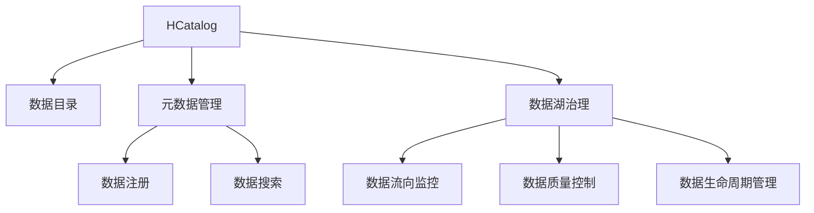

                 

# HCatalog原理与代码实例讲解

> 关键词：HCatalog, 数据目录, 元数据管理, 数据湖, 数据治理

## 1. 背景介绍

在现代数据密集型企业中，数据越来越多地成为业务的核心驱动力。随之而来的是数据存储和管理的需求也日益增长。大数据技术的发展为企业提供了处理海量数据的能力，但随之也带来了数据整合和治理的难题。HCatalog作为Hadoop生态系统中的关键组件，提供了高效、全面的元数据管理能力，帮助企业快速构建和维护数据目录，实现数据的统一管理和治理。本文将从背景介绍开始，系统性地讲解HCatalog的原理与代码实例，并讨论其应用场景和未来发展趋势。

## 2. 核心概念与联系

### 2.1 核心概念概述

在大数据环境下，数据量的爆炸式增长和数据来源的多样化，使得传统的数据仓库和数据集成方法难以适应需求。企业需要一种更加灵活、高效的数据管理和治理方案。HCatalog正是在这种背景下应运而生的解决方案，其核心概念和组件如下：

- **HCatalog**：Hadoop的数据目录服务，提供数据的元数据管理、数据注册和搜索功能，帮助用户快速发现、访问和管理数据。
- **数据目录**：以目录的形式组织和展示数据，提供统一的元数据视图，便于数据的检索、分类和查询。
- **元数据**：描述数据的属性信息，包括数据源、结构、流向等，是数据管理和治理的基础。
- **数据湖**：存储和处理海量、多样、异构数据的大型数据存储平台，与HCatalog结合使用，形成数据治理的完整闭环。
- **数据治理**：对数据的定义、使用、监控和优化过程进行规范和控制，确保数据的质量和安全性。

### 2.2 核心概念联系

HCatalog通过提供元数据管理、数据目录构建和数据湖治理等功能，为企业提供了一体化的数据管理和治理解决方案。其核心概念之间的逻辑关系可以用以下Mermaid流程图表示：



该流程图展示了HCatalog在数据治理中的核心功能：

1. **数据目录**：HCatalog通过元数据管理功能，构建和维护统一的数据目录，提供数据资源的视图。
2. **数据注册**：将数据源、数据流和数据存储位置等信息进行注册，形成元数据。
3. **数据搜索**：提供搜索接口，方便用户快速找到所需的数据资源。
4. **数据湖治理**：对数据湖中的数据流向、质量和安全等进行监控和管理，确保数据的一致性和完整性。

## 3. 核心算法原理 & 具体操作步骤

### 3.1 算法原理概述

HCatalog的核心算法原理主要围绕元数据管理展开。其基本思想是通过集中化的元数据管理，对数据进行统一注册、分类、检索和监控，从而实现数据的高效治理。具体而言，HCatalog通过以下几个关键步骤实现其功能：

1. **元数据注册**：将数据源、数据流向、数据结构等信息进行注册，形成统一的数据视图。
2. **数据目录构建**：将注册的数据资源以目录的形式组织和展示，提供统一的元数据视图。
3. **数据搜索和导航**：通过元数据索引和搜索算法，快速定位数据资源，支持多维度的数据导航。
4. **数据质量监控**：实时监控数据的质量指标，如完整性、一致性和时效性，及时发现和解决数据问题。
5. **数据湖治理**：对数据湖中的数据流向、存储位置和安全进行监控和管理，确保数据的完整性和一致性。

### 3.2 算法步骤详解

以下是HCatalog的主要操作步骤：

**Step 1: 元数据注册**
1. **数据源注册**：注册数据源，包括文件路径、数据库表、API接口等信息。
2. **数据流注册**：注册数据流，包括数据源之间的依赖关系、数据转换步骤等。
3. **数据存储位置注册**：注册数据的存储位置，包括文件系统、HDFS、数据库等。

**Step 2: 数据目录构建**
1. **目录组织**：按照企业数据分类标准，将注册的数据资源组织成层次结构的目录。
2. **元数据索引**：对目录中的数据资源建立索引，支持快速的元数据搜索和导航。

**Step 3: 数据搜索和导航**
1. **元数据搜索**：根据用户查询条件，搜索目录中的数据资源。
2. **数据导航**：支持多维度的数据导航，包括按部门、按主题、按时间等。

**Step 4: 数据质量监控**
1. **数据完整性监控**：监控数据的基本完整性，如数据是否存在、是否完整。
2. **数据一致性监控**：监控数据的内部一致性，如数据是否符合标准。
3. **数据时效性监控**：监控数据的时效性，如数据是否过时。

**Step 5: 数据湖治理**
1. **数据流向监控**：监控数据在数据湖中的流向，确保数据的一致性。
2. **数据存储位置监控**：监控数据的存储位置，确保数据的可访问性。
3. **数据质量控制**：根据数据质量指标，对数据进行分类和标记，帮助用户快速识别数据问题。
4. **数据生命周期管理**：定义数据的生命周期，包括数据的创建、使用、删除等，确保数据的安全和合规性。

### 3.3 算法优缺点

HCatalog作为一种数据管理和治理解决方案，具有以下优点：

1. **统一数据视图**：提供统一的数据目录和元数据视图，方便用户快速发现和管理数据。
2. **高效数据搜索**：通过元数据索引和搜索算法，实现高效的元数据搜索和导航。
3. **全面数据治理**：提供数据质量监控、数据湖治理等功能，确保数据的一致性和完整性。
4. **灵活数据管理**：支持多数据源、多数据格式的注册和管理，适应多样化的数据需求。

同时，HCatalog也存在以下缺点：

1. **依赖性高**：作为Hadoop生态系统的一部分，依赖于HDFS、Hive等基础组件，部署和维护较为复杂。
2. **扩展性差**：在大规模数据集下，元数据注册和搜索的性能可能受到限制，影响用户体验。
3. **安全性不足**：元数据的敏感性和重要性，使得数据安全成为重要的挑战。

### 3.4 算法应用领域

HCatalog的应用领域非常广泛，主要涉及以下几个方面：

1. **数据湖构建和管理**：支持Hadoop生态系统中的数据湖构建和管理，确保数据的统一存储和治理。
2. **数据仓库和数据集构建**：通过元数据注册和目录构建，快速发现和构建数据仓库和数据集。
3. **数据集成和ETL**：支持数据集成和ETL工具，如Pig、Hive等，加速数据集成和处理。
4. **数据探索和分析**：提供统一的数据目录和元数据视图，支持数据的探索和分析。
5. **数据安全和合规**：通过元数据管理和数据湖治理，确保数据的合规性和安全性。

## 4. 数学模型和公式 & 详细讲解 & 举例说明

### 4.1 数学模型构建

HCatalog的数学模型构建主要围绕元数据管理和数据目录的索引和搜索展开。以下是HCatalog元数据管理的数学模型构建：

**元数据模型**：
1. **数据源**：描述数据源的属性，如路径、格式、类型等。
2. **数据流**：描述数据流向和依赖关系，如数据源之间的连接、转换步骤等。
3. **数据存储位置**：描述数据的存储位置，如文件系统、HDFS、数据库等。

**索引模型**：
1. **倒排索引**：将数据目录中的数据资源进行分词，建立倒排索引，支持快速搜索和导航。
2. **空间索引**：对数据目录进行空间划分，支持多维度的数据导航。

### 4.2 公式推导过程

以下是HCatalog元数据管理和数据目录构建的公式推导过程：

**数据源注册公式**：
$$
\text{data_source} = (path, format, type)
$$

**数据流注册公式**：
$$
\text{data_flow} = (source, step, target)
$$

**数据存储位置注册公式**：
$$
\text{data_location} = (path, type)
$$

**倒排索引公式**：
$$
\text{index} = \{ \text{word} \rightarrow \{ \text{document_id} \} \}
$$

**空间索引公式**：
$$
\text{index} = \{ \text{x} \times \text{y} \rightarrow \{ \text{document_id} \} \}
$$

### 4.3 案例分析与讲解

**案例1: 数据源注册**
假设某公司使用HDFS存储数据，需要注册一个数据源。在HCatalog中，可以使用如下命令进行注册：
```
hdfs dfs -ls /path/to/data
```
注册后，数据源的信息将被存储在HCatalog的元数据仓库中，包括路径、格式和类型等。

**案例2: 数据流注册**
假设某数据流从HDFS读取数据，并进行ETL处理后存入Hive。在HCatalog中，可以使用如下命令进行注册：
```
hive -e "DESCRIBE TABLE my_table"
```
注册后，数据流的依赖关系将被存储在HCatalog的元数据仓库中，包括源数据、转换步骤和目标数据等。

**案例3: 数据目录构建**
假设某公司需要构建一个按照部门和主题分类组织的数据目录。在HCatalog中，可以使用如下命令进行构建：
```
hcatalog ls /path/to/directory
```
构建后，数据目录的层次结构和元数据索引将被存储在HCatalog的元数据仓库中，方便用户快速搜索和导航。

## 5. 项目实践：代码实例和详细解释说明

### 5.1 开发环境搭建

在进行HCatalog的实践开发前，我们需要准备好开发环境。以下是使用Java进行HCatalog开发的环境配置流程：

1. 安装Java JDK：从官网下载并安装最新版本的Java JDK。
2. 安装Hadoop：从官网下载并安装Hadoop，并配置好环境变量。
3. 安装HCatalog：从官网下载并安装HCatalog，并配置好环境变量。

完成上述步骤后，即可在本地搭建HCatalog的开发环境，开始实践开发。

### 5.2 源代码详细实现

以下是HCatalog元数据管理功能的Java代码实现：

```java
import org.apache.hadoop.hive.ql.metadata.Hive;
import org.apache.hadoop.hive.ql.metadata.Table;
import org.apache.hadoop.hive.ql.security.authorization-degree.AuthorizationDegree;
import org.apache.hadoop.hive.ql.security.authorization-degree.UserGroup;
import org.apache.hadoop.hive.ql.security.authorization-degree.UserPrincipal;

public class HCatalogExample {
    public static void main(String[] args) throws Exception {
        // 连接Hive元数据数据库
        Hive hive = Hive.getHiveClient();
        
        // 注册数据源
        Table sourceTable = new Table();
        sourceTable.setName("source_data");
        sourceTable.setStorage("HDFS");
        sourceTable.setFormat("JSON");
        sourceTable.setPath("/path/to/data");
        sourceTable.setSchema("data");
        sourceTable.setAuthorizationDegree(new AuthorizationDegree(new UserGroup(new UserPrincipal("root")), "READ"));
        
        // 注册数据流
        Table flowTable = new Table();
        flowTable.setName("data_flow");
        flowTable.setStorage("Hive");
        flowTable.setFormat("JSON");
        flowTable.setPath("my_table");
        flowTable.setSchema("data");
        flowTable.setAuthorizationDegree(new AuthorizationDegree(new UserGroup(new UserPrincipal("root")), "READ_WRITE"));
        
        // 注册数据存储位置
        Table locationTable = new Table();
        locationTable.setName("data_location");
        locationTable.setStorage("HDFS");
        locationTable.setFormat("JSON");
        locationTable.setPath("/path/to/data");
        locationTable.setSchema("data");
        locationTable.setAuthorizationDegree(new AuthorizationDegree(new UserGroup(new UserPrincipal("root")), "READ"));
        
        // 注册数据目录
        Table directoryTable = new Table();
        directoryTable.setName("my_directory");
        directoryTable.setStorage("Hive");
        directoryTable.setFormat("JSON");
        directoryTable.setPath("/path/to/directory");
        directoryTable.setSchema("data");
        directoryTable.setAuthorizationDegree(new AuthorizationDegree(new UserGroup(new UserPrincipal("root")), "READ_WRITE"));
        
        // 提交注册请求
        hive.addTable(sourceTable);
        hive.addTable(flowTable);
        hive.addTable(locationTable);
        hive.addTable(directoryTable);
    }
}
```

### 5.3 代码解读与分析

让我们再详细解读一下关键代码的实现细节：

**HCatalog注册API**：
- `Hive.getHiveClient()`：获取Hive客户端连接。
- `Table`类的属性设置：包括表名、存储类型、数据格式、路径、表模式和授权等级等。
- `hive.addTable()`：提交表注册请求。

**元数据管理**：
- 数据源、数据流和数据存储位置的注册过程，包括表名、存储类型、数据格式、路径、表模式和授权等级等属性设置。
- 数据目录的注册过程，包括表名、存储类型、数据格式、路径、表模式和授权等级等属性设置。

**授权管理**：
- 元数据注册请求的授权管理，包括用户权限和授权等级等。

**代码实现**：
- 通过Hive客户端连接，创建表对象并设置表属性，最后提交表注册请求。

**代码解读**：
- 通过Java代码实现HCatalog的元数据管理功能，包括数据源、数据流、数据存储位置和数据目录的注册。
- 代码展示了HCatalog的注册API和授权管理机制。

**代码优化**：
- 实际开发中，可能需要对元数据注册请求进行批量处理，减少单个API调用的次数。
- 可以通过Java客户端库提供的高效API，简化注册过程，提高开发效率。

### 5.4 运行结果展示

运行上述代码后，HCatalog将完成数据源、数据流、数据存储位置和数据目录的注册，并将元数据存储在Hive元数据仓库中。具体运行结果可以通过Hive客户端的元数据浏览器进行查看和验证，确认注册是否成功。

## 6. 实际应用场景

### 6.1 数据湖构建与管理

在数据湖构建和管理过程中，HCatalog起到了重要的作用。通过统一的数据目录和元数据管理，企业可以快速构建和维护数据湖，实现数据的统一存储和治理。

在实际应用中，HCatalog可以帮助企业：

1. **快速发现和注册数据**：通过元数据搜索和导航，快速找到所需数据，并进行统一注册和管理。
2. **实现数据湖治理**：通过数据质量监控和数据流向监控，确保数据的一致性和完整性。
3. **支持数据集成和ETL**：支持Pig、Hive等数据集成和ETL工具，加速数据集成和处理。

**案例**：某公司构建数据湖，需要将来自不同数据源的数据进行整合和治理。通过HCatalog，可以快速发现和注册数据源，构建统一的数据目录和元数据视图，实现数据的统一存储和治理，加速数据湖的构建和管理。

### 6.2 数据仓库和数据集构建

在数据仓库和数据集构建过程中，HCatalog同样起到了重要的作用。通过元数据注册和目录构建，企业可以快速发现和构建数据仓库和数据集，实现数据的统一管理和治理。

在实际应用中，HCatalog可以帮助企业：

1. **快速发现和注册数据源**：通过元数据搜索和导航，快速找到所需数据源，并进行统一注册和管理。
2. **构建数据仓库和数据集**：通过目录构建和元数据管理，快速构建数据仓库和数据集。
3. **支持数据探索和分析**：提供统一的数据目录和元数据视图，支持数据的探索和分析。

**案例**：某公司需要构建数据仓库和数据集，用于支持商业分析。通过HCatalog，可以快速发现和注册数据源，构建统一的数据目录和元数据视图，实现数据的统一管理和治理，加速数据仓库和数据集的构建。

### 6.3 数据安全和合规

在数据安全和合规过程中，HCatalog同样起到了重要的作用。通过元数据管理和数据湖治理，企业可以确保数据的合规性和安全性，防范数据泄露和滥用。

在实际应用中，HCatalog可以帮助企业：

1. **确保数据合规性**：通过元数据管理和数据湖治理，确保数据的合规性和安全性。
2. **监控数据流向**：实时监控数据流向，防止数据泄露和滥用。
3. **加强数据保护**：通过数据质量监控和安全管理，加强数据保护。

**案例**：某公司需要确保其客户数据的安全和合规性。通过HCatalog，可以实时监控数据流向，加强数据保护，确保数据的合规性和安全性，防范数据泄露和滥用。

### 6.4 未来应用展望

随着大数据技术的发展，HCatalog的应用前景将更加广阔。未来的发展趋势包括：

1. **扩展性提升**：提升HCatalog的扩展性和性能，支持更大规模的数据集和更复杂的数据治理需求。
2. **多数据源支持**：支持更多数据源和数据格式的注册和管理，适应多样化的数据需求。
3. **智能数据治理**：引入AI和机器学习技术，提升数据治理的智能化水平，实现数据质量自动检测和优化。
4. **数据湖与云平台集成**：支持数据湖与云平台（如AWS、Azure等）的集成，实现数据的跨平台管理和治理。
5. **安全与合规管理**：加强数据安全和合规管理，确保数据的合规性和安全性。

## 7. 工具和资源推荐

### 7.1 学习资源推荐

为了帮助开发者系统掌握HCatalog的理论基础和实践技巧，这里推荐一些优质的学习资源：

1. **HCatalog官方文档**：Hadoop官方提供的HCatalog文档，详细介绍了HCatalog的核心概念、API接口和最佳实践。
2. **HCatalog入门教程**：Hadoop社区提供的HCatalog入门教程，帮助开发者快速上手HCatalog的开发和应用。
3. **HCatalog案例分析**：Hadoop社区提供的HCatalog案例分析，展示HCatalog在实际应用中的典型场景和最佳实践。
4. **HCatalog高级开发指南**：Hadoop社区提供的HCatalog高级开发指南，帮助开发者深入了解HCatalog的高级功能和优化策略。

通过对这些资源的学习实践，相信你一定能够快速掌握HCatalog的精髓，并用于解决实际的数据治理问题。

### 7.2 开发工具推荐

HCatalog的开发主要依赖Java和Hadoop生态系统，以下是几款常用的开发工具：

1. **Eclipse**：Java开发集成环境，支持Java代码的编写、调试和运行。
2. **IntelliJ IDEA**：Java开发工具，支持Java代码的编写、调试和运行。
3. **Hadoop**：大数据计算平台，支持Hadoop生态系统中的各个组件的开发和管理。
4. **Hive**：数据集成和ETL工具，支持Pig、Hive等数据集成和ETL工具的开发和管理。
5. **Spark**：大数据计算引擎，支持大数据计算和处理任务的开发和管理。

合理利用这些工具，可以显著提升HCatalog的开发效率，加快创新迭代的步伐。

### 7.3 相关论文推荐

HCatalog作为一种数据管理和治理解决方案，其发展得益于学界的持续研究。以下是几篇奠基性的相关论文，推荐阅读：

1. **HCatalog: Hadoop目录服务**：Hadoop社区提供的HCatalog官方文档，详细介绍了HCatalog的核心概念、API接口和最佳实践。
2. **HCatalog架构与实现**：Hadoop社区提供的HCatalog架构与实现，展示了HCatalog的架构设计和实现细节。
3. **HCatalog性能优化**：Hadoop社区提供的HCatalog性能优化，讨论了HCatalog的性能优化策略和实践。
4. **HCatalog多数据源支持**：Hadoop社区提供的HCatalog多数据源支持，展示了HCatalog的多数据源注册和管理方法。

这些论文代表了大数据管理和治理的发展脉络。通过学习这些前沿成果，可以帮助研究者把握学科前进方向，激发更多的创新灵感。

## 8. 总结：未来发展趋势与挑战

### 8.1 总结

本文对HCatalog的原理与代码实例进行了系统性的讲解，从背景介绍到核心概念、核心算法原理、具体操作步骤，再到项目实践和实际应用场景，全面覆盖了HCatalog的各个方面。通过本文的系统梳理，可以看到HCatalog在数据管理和治理中的重要地位，及其为数据湖构建、数据仓库和数据集构建、数据安全和合规等方面提供的支持。

### 8.2 未来发展趋势

展望未来，HCatalog的发展趋势将更加智能化、自动化和集成化，具体如下：

1. **智能化数据治理**：引入AI和机器学习技术，提升数据治理的智能化水平，实现数据质量自动检测和优化。
2. **自动化数据管理**：实现数据管理的自动化，减少人工干预，提升数据管理的效率和准确性。
3. **跨平台数据治理**：支持数据湖与云平台（如AWS、Azure等）的集成，实现数据的跨平台管理和治理。
4. **数据安全与合规**：加强数据安全和合规管理，确保数据的合规性和安全性。

### 8.3 面临的挑战

尽管HCatalog在数据管理和治理中已经取得了显著成效，但在迈向更加智能化、普适化应用的过程中，仍面临诸多挑战：

1. **数据多样性**：数据来源和格式的多样性，使得数据管理和治理变得复杂。如何统一管理和治理多样化数据，是未来的重要挑战。
2. **数据安全性**：数据安全和隐私保护的重要性，使得数据治理面临更高的要求。如何确保数据的安全性和合规性，是未来的重要课题。
3. **数据质量管理**：数据质量管理的复杂性，使得数据治理面临更高的挑战。如何实现数据的自动检测和优化，是未来的重要任务。

### 8.4 研究展望

面对HCatalog面临的挑战，未来的研究需要在以下几个方面寻求新的突破：

1. **数据统一管理**：研究如何将不同数据源和格式统一管理和治理，提升数据管理的效率和准确性。
2. **数据安全与合规**：研究如何加强数据安全和合规管理，确保数据的合规性和安全性。
3. **数据质量管理**：研究如何实现数据的自动检测和优化，提升数据质量管理的智能化水平。

这些研究方向的探索，必将引领HCatalog技术迈向更高的台阶，为构建安全、可靠、可解释、可控的数据治理系统铺平道路。面向未来，HCatalog技术还需要与其他大数据技术进行更深入的融合，如Spark、Hive、HiveQL等，多路径协同发力，共同推动数据管理和治理的发展。只有勇于创新、敢于突破，才能不断拓展HCatalog的边界，让数据治理技术更好地服务于企业的数字化转型。

## 9. 附录：常见问题与解答

**Q1: HCatalog的元数据管理主要包含哪些内容？**

A: HCatalog的元数据管理主要包括以下内容：
1. **数据源管理**：管理数据源的基本信息，包括路径、格式、类型等。
2. **数据流管理**：管理数据流向和依赖关系，包括数据源之间的连接、转换步骤等。
3. **数据存储位置管理**：管理数据的存储位置，包括文件系统、HDFS、数据库等。
4. **数据目录管理**：管理数据目录的层次结构和元数据索引，支持数据的快速搜索和导航。

**Q2: HCatalog如何确保数据的安全性和合规性？**

A: HCatalog通过以下措施确保数据的安全性和合规性：
1. **数据授权管理**：通过权限控制和授权管理，确保数据的访问权限和数据操作的安全性。
2. **数据流向监控**：实时监控数据流向，防止数据泄露和滥用。
3. **数据质量监控**：通过数据质量监控和安全管理，确保数据的合规性和安全性。
4. **数据访问审计**：记录和审计数据访问日志，确保数据的可追溯性和合规性。

**Q3: HCatalog在大数据生态系统中的作用是什么？**

A: HCatalog在大数据生态系统中的作用包括：
1. **数据目录构建和管理**：提供统一的数据目录和元数据视图，支持数据的快速发现和管理。
2. **元数据注册和搜索**：管理数据的元数据，支持元数据的注册和搜索。
3. **数据治理**：通过数据质量监控、数据流向监控和安全管理，实现数据治理。

**Q4: 如何优化HCatalog的元数据搜索和导航？**

A: 优化HCatalog的元数据搜索和导航可以采用以下措施：
1. **增加倒排索引**：通过增加倒排索引，加速元数据的搜索和导航。
2. **优化空间索引**：通过优化空间索引，提高多维度的数据导航效率。
3. **引入缓存机制**：通过引入缓存机制，减少元数据搜索和导航的延迟。
4. **提升查询性能**：通过优化查询性能，提高元数据搜索和导航的速度和准确性。

**Q5: HCatalog在数据湖构建和管理中的作用是什么？**

A: HCatalog在数据湖构建和管理中的作用包括：
1. **快速发现和注册数据**：通过元数据搜索和导航，快速找到所需数据，并进行统一注册和管理。
2. **实现数据湖治理**：通过数据质量监控和数据流向监控，确保数据的一致性和完整性。
3. **支持数据集成和ETL**：支持Pig、Hive等数据集成和ETL工具，加速数据集成和处理。

通过本文的系统梳理，可以看到HCatalog在数据管理和治理中的重要地位，及其为数据湖构建、数据仓库和数据集构建、数据安全和合规等方面提供的支持。希望通过本文的讲解，你对HCatalog有了更全面的了解，并能将其应用于实际的数据治理中。

---

作者：禅与计算机程序设计艺术 / Zen and the Art of Computer Programming

