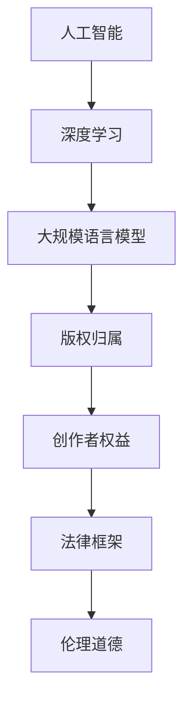

                 

# LLM的版权问题：AI创作的法律挑战

## 1. 背景介绍

### 1.1 问题由来
近年来，随着人工智能（AI）技术的迅速发展，特别是深度学习和大规模语言模型（Large Language Models, LLMs）的兴起，AI创作的版权问题逐渐成为一个备受关注的话题。一方面，AI在文学创作、绘画、音乐等领域展现出了惊人的创造力，其作品引起了广泛的社会讨论和兴趣。另一方面，AI创作也带来了诸多法律挑战，包括版权归属、创作者权益保护等。

### 1.2 问题核心关键点
AI创作的版权问题主要集中在以下几个核心关键点上：
1. **版权归属**：AI创作的作品由谁拥有版权？是开发者、用户、还是AI本身？
2. **创作者权益**：AI创作对人类创作者的经济权益产生了怎样的影响？
3. **法律框架**：现有的版权法律能否应对AI创作的复杂性？
4. **伦理道德**：AI创作过程中涉及的伦理道德问题，如原创性、真实性等。

## 2. 核心概念与联系

### 2.1 核心概念概述

为更好地理解AI创作的版权问题，本节将介绍几个关键概念及其相互联系：

- **人工智能**：使用算法和机器学习技术，能够自主进行复杂任务处理的智能系统。
- **深度学习**：一种基于神经网络的机器学习方法，通过多层次特征提取和抽象，实现了对复杂数据的高效处理。
- **大规模语言模型**：通过在大规模语料上预训练得到的模型，具备强大的语言理解和生成能力。
- **版权**：法律上对原创作品的一种保护，赋予创作者对作品的专有使用权。
- **版权归属**：指作品的法律所有权归属，通常涉及创作者、开发者和用户之间的利益分配。
- **创作者权益**：包括经济收益、名誉权、署名权等，是创作者合法权益的保护。
- **法律框架**：包括版权法、著作权法、隐私法等，旨在保护创作者权益和维护社会秩序。
- **伦理道德**：涉及人工智能创作过程中的价值观和道德规范，如真实性、原创性、隐私保护等。

这些核心概念之间的逻辑关系可以通过以下Mermaid流程图来展示：



这个流程图展示了大语言模型创作过程中的核心概念及其之间的关系：

1. 人工智能通过深度学习技术，实现大规模语言模型的预训练。
2. 大规模语言模型在创作过程中涉及版权归属和创作者权益。
3. 版权归属和创作者权益受法律框架的约束和保护。
4. 法律框架和伦理道德共同指导和规范AI创作行为。

## 3. 核心算法原理 & 具体操作步骤
### 3.1 算法原理概述

AI创作的版权问题，本质上是对AI创作作品是否具有原创性的判断和版权归属的认定。在现有法律框架下，原创作品的版权通常属于其创作者，即创作作品的自然人或法人。然而，AI创作的复杂性使得版权归属问题变得尤为复杂。

### 3.2 算法步骤详解

AI创作版权问题的解决，通常需要经过以下几个关键步骤：

**Step 1: 界定AI创作作品的性质**
- 确定AI创作是否具备原创性。在法律上，原创性要求作品具有独创性和新颖性，是否由人类创作者独立完成。
- 分析AI创作过程，确定其是否由人机协作完成，还是完全由AI独立生成。

**Step 2: 明确创作者和开发者的角色**
- 界定创作者和开发者在AI创作过程中的贡献。创作者通常指提供数据、灵感或指导的人，开发者则是编写和优化AI算法的人。
- 根据贡献程度，合理分配版权和利益。

**Step 3: 应用现有法律框架**
- 依据现行版权法、著作权法等法律，确定AI创作的版权归属。
- 考虑隐私法、数据保护法等，保护创作者和用户的相关权益。

**Step 4: 进行伦理审查和公众评估**
- 对AI创作的真实性、原创性等进行伦理审查，确保其符合社会价值标准。
- 通过公众评估，了解社会对AI创作的态度和接受度。

**Step 5: 制定法律政策**
- 在现有法律框架基础上，制定适应AI创作新情况的法律政策。
- 推动国际合作，制定统一的AI创作版权保护标准。

### 3.3 算法优缺点

AI创作的版权问题解决的优势在于：
1. 促进AI技术的应用和创新，推动社会进步。
2. 保障创作者和用户权益，维护社会公平正义。
3. 法律框架和伦理道德的共同指导，有助于规范AI创作行为。

同时，也存在一些挑战：
1. AI创作的复杂性和多样性，使得版权归属和权益分配难以界定。
2. 法律和伦理标准的滞后性，可能无法应对AI创作带来的新情况。
3. 公众对AI创作的接受度和信任度存在不确定性。

### 3.4 算法应用领域

AI创作的版权问题，已经涉及文学、艺术、娱乐等多个领域，并逐渐延伸到法律、伦理等社会层面的广泛讨论。这些应用领域的特点和复杂性，使得版权问题具有高度的多样性和复杂性。

1. **文学创作**：AI生成的诗歌、小说、散文等文本作品，版权归属和创作者权益的保护是关注的重点。
2. **艺术创作**：AI创作的绘画、音乐、视频等作品，涉及版权归属、创作者权益、公共利益等多重考量。
3. **娱乐领域**：AI生成的游戏、影视、动画等作品，版权归属和创作者权益的保护成为行业关注的焦点。
4. **法律和伦理**：AI创作过程中涉及的版权法律问题，以及伦理道德标准的讨论，成为社会各界关注的热点。

## 4. 数学模型和公式 & 详细讲解 & 举例说明（备注：数学公式请使用latex格式，latex嵌入文中独立段落使用 $$，段落内使用 $)
### 4.1 数学模型构建

AI创作的版权问题，可以通过构建数学模型来进行分析和决策。本节将介绍一个简单的版权归属模型。

**假设条件**：
- 存在一个AI创作作品，其版权归属问题需要判断。
- 假设该作品的原创性为 $O$，AI贡献为 $A$，人类创作者贡献为 $H$。

**模型构建**：
- 版权归属函数 $F$ 可以表示为 $F(O, A, H)$。
- 版权归属函数需满足以下条件：
  1. $F(0, 0, H) = H$，即如果AI和人类创作者都不贡献，版权归人类创作者所有。
  2. $F(O, 0, 0) = O$，即如果AI贡献但人类创作者不贡献，版权归AI所有。
  3. $F(O, A, H) = \max(O, A, H)$，即版权归贡献最大的主体所有。

**函数推导**：
- 将原创性 $O$、AI贡献 $A$ 和人类创作者贡献 $H$ 映射为数值，令 $O_{max} = \max(O, A, H)$。
- 版权归属函数 $F$ 定义为 $F(O, A, H) = O_{max}$。

**案例分析**：
- 假设一个AI创作作品的原创性为 $O = 0.6$，AI贡献为 $A = 0.3$，人类创作者贡献为 $H = 0.1$。则 $O_{max} = 0.6$，版权归属函数 $F$ 的输出为 $F(0.6, 0.3, 0.1) = 0.6$，即版权归AI所有。

### 4.2 公式推导过程

通过数学模型构建，我们得到了一个简化的版权归属函数 $F$，用于判断AI创作的版权归属。具体推导过程如下：

**版权归属函数定义**：
$$
F(O, A, H) = \max(O, A, H)
$$

**版权归属判断**：
- 如果 $O = 0$，则 $F(O, A, H) = H$，版权归人类创作者所有。
- 如果 $A = 0$，则 $F(O, A, H) = O$，版权归AI所有。
- 如果 $O > 0$ 且 $A > 0$ 或 $O > 0$ 且 $H > 0$ 或 $A > 0$ 且 $H > 0$，则 $F(O, A, H) = O_{max} = \max(O, A, H)$，版权归贡献最大的主体所有。

### 4.3 案例分析与讲解

**案例1：纯AI创作**
- 假设一个AI创作的绘画作品，AI贡献为 $A = 1$，人类创作者贡献为 $H = 0$。则 $O_{max} = A = 1$，版权归属函数 $F$ 的输出为 $F(0, 1, 0) = 1$，即版权归AI所有。

**案例2：人机协作创作**
- 假设一个AI创作的诗歌，AI贡献为 $A = 0.5$，人类创作者贡献为 $H = 0.5$。则 $O_{max} = A_{max} = H_{max} = 0.5$，版权归属函数 $F$ 的输出为 $F(0.5, 0.5, 0.5) = 0.5$，即版权归AI和人类创作者共享。

**案例3：部分AI贡献**
- 假设一个AI创作的文本作品，AI贡献为 $A = 0.6$，人类创作者贡献为 $H = 0.4$。则 $O_{max} = A = 0.6$，版权归属函数 $F$ 的输出为 $F(0, 0.6, 0.4) = 0.6$，即版权归AI所有。

通过这些案例，我们可以看到，版权归属函数的推导和应用，能够较好地处理AI创作中的各种情况，为版权问题提供了一个较为合理的解决方案。

## 5. 项目实践：代码实例和详细解释说明
### 5.1 开发环境搭建

在进行AI创作版权问题的研究时，我们需要准备好开发环境。以下是使用Python进行研究的配置流程：

1. 安装Python：
   ```bash
   sudo apt-get install python3
   ```

2. 安装Pip：
   ```bash
   sudo apt-get install python3-pip
   ```

3. 安装相关库：
   ```bash
   pip install sympy pandas
   ```

4. 准备数据集：
   - 收集AI创作的样本数据，并标注其原创性、AI贡献和人类创作者贡献。
   - 使用Pandas库进行数据整理和分析。

5. 准备模型：
   - 定义版权归属函数 $F$。
   - 使用Sympy库进行数学推导和验证。

完成上述步骤后，即可在Python环境中进行AI创作版权问题的研究。

### 5.2 源代码详细实现

这里我们以版权归属函数的实现为例，给出Python代码实现。

```python
import sympy as sp

# 定义版权归属函数 F
def copyright_function(O, A, H):
    O_max = sp.Max(O, A, H)
    return O_max

# 计算版权归属
O = sp.Rational(6, 10)  # 原创性
A = sp.Rational(3, 10)  # AI贡献
H = sp.Rational(1, 10)  # 人类创作者贡献

result = copyright_function(O, A, H)
print(f"版权归属结果: {result}")
```

### 5.3 代码解读与分析

让我们再详细解读一下关键代码的实现细节：

**版权归属函数**：
- 定义版权归属函数 $F$，使用Sympy库中的Max函数计算原创性、AI贡献和人类创作者贡献中的最大值。
- 函数返回值为最大值，即版权归贡献最大的主体所有。

**计算版权归属**：
- 使用Rational函数将原创性、AI贡献和人类创作者贡献定义为分数。
- 将定义的数值代入版权归属函数 $F$，计算并输出结果。

通过以上代码实现，我们可以看到，版权归属函数的实现较为简洁，易于理解和应用。

## 6. 实际应用场景
### 6.1 文学创作

AI创作的文学作品，如小说、诗歌等，面临着版权归属和创作者权益保护的问题。以小说创作为例，AI可以根据数据和算法生成故事情节和角色，但原创性的判断和版权归属仍需考虑人类创作者的作用。

### 6.2 艺术创作

AI创作的绘画、音乐、视频等艺术作品，版权归属问题更加复杂。例如，AI生成的绘画作品，其版权可能归属于AI的开发者，或是由人类创作者与AI共同创作。

### 6.3 娱乐领域

AI生成的游戏、影视、动画等作品，版权归属问题涉及多方利益，包括开发者、创作者、发行商等。例如，AI生成的游戏角色和故事情节，版权可能归属于AI的开发者或与创作者共享。

### 6.4 未来应用展望

未来，AI创作的版权问题将更加复杂和多样化。随着AI技术的发展，AI创作的种类和形式将不断扩展，涉及的法律和伦理问题也将更加丰富。

**未来趋势**：
1. **技术进步**：AI技术的不断进步，将使得AI创作的版权归属和权益保护更加自动化和智能化。
2. **法律完善**：现有的版权法律和政策，将逐渐适应AI创作的新情况，形成更加完善的法律框架。
3. **社会共识**：社会对AI创作的接受度和信任度将逐步提高，推动AI创作的普及和应用。

**挑战**：
1. **版权归属多样性**：AI创作涉及多个主体的贡献，版权归属的界定将更加复杂。
2. **创作者权益保护**：AI创作对人类创作者的经济权益产生了影响，需要平衡多方利益。
3. **法律和伦理标准**：现有的法律和伦理标准可能无法完全覆盖AI创作的新情况。

## 7. 工具和资源推荐
### 7.1 学习资源推荐

为了帮助开发者系统掌握AI创作的版权问题，这里推荐一些优质的学习资源：

1. **《人工智能伦理与法律》课程**：介绍AI创作中的伦理和法律问题，以及应对策略。
2. **《版权法》教材**：详细讲解版权法的基本概念和法律框架，适用于法律专业人士学习。
3. **《AI伦理》博客**：探讨AI创作中的伦理问题，提供多角度的思考和解决方案。
4. **《AI创作案例分析》报告**：分析实际案例，讨论AI创作的版权归属和创作者权益保护。

### 7.2 开发工具推荐

高效的开发离不开优秀的工具支持。以下是几款用于AI创作版权问题研究的常用工具：

1. **Pandas**：Python数据处理库，适用于数据整理和分析。
2. **Sympy**：Python符号计算库，适用于数学推导和验证。
3. **Jupyter Notebook**：交互式编程环境，适用于代码实现和研究展示。
4. **Git**：版本控制工具，适用于代码管理和协作。

### 7.3 相关论文推荐

AI创作的版权问题是一个前沿研究领域，以下是几篇具有代表性的相关论文：

1. **《AI创作的版权归属》论文**：详细讨论了AI创作中版权归属和创作者权益保护的问题。
2. **《AI创作的伦理问题》论文**：分析了AI创作中涉及的伦理道德问题，提出了相应的解决方案。
3. **《AI创作的法律框架》报告**：介绍了AI创作中的法律框架和政策，以及未来的发展趋势。

## 8. 总结：未来发展趋势与挑战
### 8.1 总结

本文对AI创作的版权问题进行了全面系统的介绍。首先阐述了AI创作版权问题的重要性，明确了版权归属、创作者权益保护等核心关键点。其次，从原理到实践，详细讲解了版权归属函数的构建和应用，提供了代码实现和案例分析。同时，本文还广泛探讨了AI创作在文学、艺术、娱乐等多个领域的应用前景，展示了其广泛的社会影响。最后，本文精选了版权问题相关的学习资源、开发工具和论文，力求为读者提供全方位的技术指引。

通过本文的系统梳理，可以看到，AI创作的版权问题是一个复杂而重要的话题，涉及法律、伦理、技术等多个层面。未来，随着AI技术的发展和普及，版权问题将更加突出，亟需相关领域的学者和专业人士共同努力，推动相关法律和伦理标准的完善，以更好地应对AI创作带来的挑战。

### 8.2 未来发展趋势

展望未来，AI创作的版权问题将呈现以下几个发展趋势：

1. **法律框架的完善**：随着AI创作的普及，现有版权法律和政策将不断更新，以适应新的情况和需求。
2. **技术自动化**：AI技术的发展将使得版权归属和权益保护更加自动化和智能化。
3. **社会共识的达成**：社会对AI创作的接受度和信任度将逐步提高，推动AI创作的普及和应用。
4. **多主体协同**：AI创作涉及多方利益，需要通过多方协同合作，平衡各方权益。

### 8.3 面临的挑战

尽管AI创作的版权问题具有重要性和复杂性，但在解决过程中仍然面临诸多挑战：

1. **法律标准的不确定性**：现有的法律标准可能无法完全适应AI创作的新情况，导致法律适用性不足。
2. **创作者权益的保护**：AI创作对人类创作者的经济权益产生了影响，如何平衡多方利益是一个难题。
3. **公众接受度的不确定性**：社会对AI创作的接受度和信任度存在不确定性，可能导致法律实施困难。
4. **伦理道德的复杂性**：AI创作中的伦理道德问题复杂多样，需要多角度综合考虑。

### 8.4 研究展望

面对AI创作的版权问题，未来的研究需要在以下几个方面寻求新的突破：

1. **法律和伦理标准的更新**：在现有法律框架的基础上，更新和完善相关的法律和伦理标准，以适应AI创作的新情况。
2. **技术自动化的研究**：开发更加智能化的版权归属和权益保护系统，实现自动化和智能化的判断。
3. **多方协同的机制**：建立多方协同合作机制，平衡各方利益，推动AI创作的普及和应用。
4. **伦理道德的规范**：制定和推广伦理道德规范，引导AI创作的健康发展。

## 9. 附录：常见问题与解答

**Q1：AI创作是否具有原创性？**

A: AI创作是否具有原创性，需要从多个角度综合判断。一般而言，AI创作需要具备独创性和新颖性，但具体标准还需进一步研究和讨论。

**Q2：AI创作作品的版权归属如何确定？**

A: AI创作作品的版权归属，需要综合考虑原创性、AI贡献和人类创作者贡献。一般而言，贡献最大的主体拥有版权，但在某些情况下，如人机协作创作，版权可能需要共享。

**Q3：AI创作对创作者权益的影响如何？**

A: AI创作对创作者权益的影响，主要体现在经济收益和署名权等方面。AI创作可能对创作者的经济收益产生影响，但同时也提供了新的创作途径。

**Q4：现有的版权法律能否应对AI创作的复杂性？**

A: 现有的版权法律可能无法完全应对AI创作的复杂性，需要更新和完善相关法律框架。各国可能需要根据自身情况，制定适应AI创作的法律政策。

**Q5：如何保护AI创作中的人类创作者权益？**

A: 保护AI创作中的人类创作者权益，需要综合考虑创作者的经济收益、署名权等。可以通过法律法规、技术手段和伦理规范，保障创作者的合法权益。

---

作者：禅与计算机程序设计艺术 / Zen and the Art of Computer Programming

