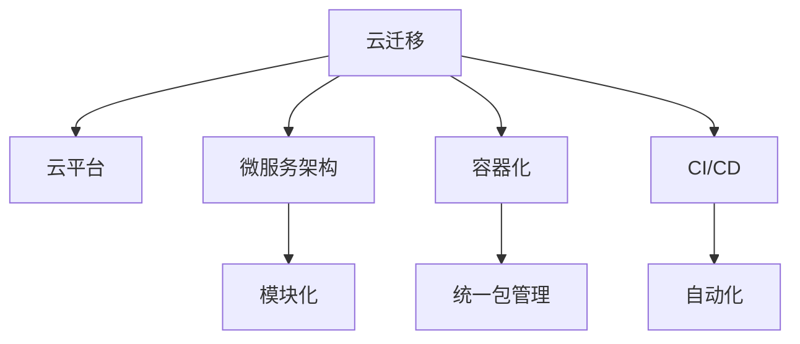

                 

## 1. 背景介绍

在数字化转型的浪潮中，越来越多的企业开始依赖云平台进行业务运营。云迁移已成为企业信息化建设中的重要一环。然而，云迁移不仅仅是将数据和应用搬上云端那么简单，它需要涵盖数据迁移、应用迁移、安全保障、业务连续性等多个方面，同时还必须保证迁移过程的高效性、低成本以及新平台下的系统稳定性。

Lepton AI作为一家致力于智能运维的企业，深知企业客户在云迁移过程中所面临的挑战。基于对云计算技术的深入理解和实践经验，Lepton AI提出了一套完整的云迁移解决方案，旨在帮助企业降低迁移成本，实现无缝、高效、安全的云平台交互。

## 2. 核心概念与联系

### 2.1 核心概念概述

在本文中，我们将探讨以下几个关键概念：

- **云迁移（Cloud Migration）**：将企业现有的IT架构、数据和应用迁移到云平台的过程。云迁移的目的是为了提升系统的可用性、可扩展性和灵活性，同时降低运维成本。

- **云平台（Cloud Platform）**：包括但不限于AWS、Azure、阿里云等，为企业提供计算、存储、网络等基础设施服务的云服务提供商。

- **微服务架构（Microservices Architecture）**：将应用拆分为多个独立、可复用的小服务，每个服务负责特定的业务功能。这种架构提高了系统的模块化和可维护性，同时也便于在云环境下进行扩展和管理。

- **容器化（Containerization）**：将应用和依赖打包到容器（如Docker）中，确保应用在任意环境下的一致性和稳定性。容器化使得应用在云平台上的迁移变得更为方便和高效。

- **持续集成与持续部署（CI/CD）**：通过自动化流程，将代码从开发、测试到部署的过程自动化，提升开发效率和部署成功率。CI/CD工具通常包括Jenkins、GitLab CI、Travis CI等。

这些核心概念之间相互关联，共同构成了云迁移的基础架构。在云迁移的过程中，企业需要综合考虑这些因素，制定出合理的迁移策略和实施方案。

### 2.2 核心概念原理和架构的 Mermaid 流程图



## 3. 核心算法原理 & 具体操作步骤

### 3.1 算法原理概述

Lepton AI的云迁移方案主要基于以下算法原理：

1. **需求分析**：通过与客户沟通，分析其云迁移需求和目标，确定迁移的内容和方式。

2. **迁移规划**：基于需求分析结果，制定详细的迁移规划，包括数据迁移、应用迁移、安全保障、业务连续性等各个方面的策略。

3. **平台选择**：根据迁移规划，选择合适的云平台进行迁移。

4. **迁移实施**：按照迁移规划，实施数据迁移、应用迁移等操作。

5. **测试验证**：在迁移完成后，对新环境下的系统进行全面测试，确保其稳定性、可用性和性能。

6. **运维优化**：在测试通过后，对新环境下的系统进行运维优化，提升系统效率和安全性。

### 3.2 算法步骤详解

以下是云迁移方案的具体操作步骤：

**Step 1: 需求分析**

1. 召开需求分析会议，与客户沟通了解其云迁移需求和目标。
2. 确定迁移的内容和方式，包括数据迁移、应用迁移、安全性要求、业务连续性要求等。
3. 评估迁移对现有系统的影响，制定应对策略。

**Step 2: 迁移规划**

1. 根据需求分析结果，制定详细的迁移规划，包括数据迁移、应用迁移、安全保障、业务连续性等各个方面的策略。
2. 对迁移过程中可能遇到的风险进行评估，并制定相应的风险缓解措施。

**Step 3: 平台选择**

1. 根据迁移规划和客户需求，选择合适的云平台。
2. 评估各云平台的优势和劣势，选择最适合的云平台进行迁移。

**Step 4: 迁移实施**

1. 启动迁移实施过程，按照迁移规划逐步进行数据迁移、应用迁移等操作。
2. 在迁移过程中，实时监控系统状态，确保迁移过程的稳定性和安全性。
3. 遇到问题时，及时调整策略，确保迁移进度不受影响。

**Step 5: 测试验证**

1. 对迁移完成后的新系统进行全面测试，包括功能测试、性能测试、安全性测试等。
2. 根据测试结果，对系统进行优化，确保其在新的云平台上的稳定性和可用性。

**Step 6: 运维优化**

1. 在新系统上实施CI/CD流程，确保代码从开发到部署的自动化。
2. 对系统进行持续监控和优化，提升系统效率和安全性。
3. 定期进行系统升级和安全加固，确保系统的长期稳定运行。

### 3.3 算法优缺点

Lepton AI的云迁移方案具有以下优点：

- **降低成本**：通过精确的需求分析和合理的迁移规划，能够降低云迁移过程中的成本。
- **提高效率**：使用容器化和微服务架构，使得迁移过程更加高效和灵活。
- **保证稳定**：通过全面的测试和运维优化，确保新环境下的系统稳定性和可用性。

同时，该方案也存在一些局限性：

- **复杂度高**：云迁移涉及多个方面，需要综合考虑多种因素，操作复杂。
- **技术门槛高**：需要具备较高的技术能力和经验，才能有效实施云迁移方案。
- **风险不可控**：迁移过程中可能遇到各种意外情况，风险不可控。

### 3.4 算法应用领域

Lepton AI的云迁移方案主要应用于以下领域：

- **企业上云**：帮助企业将现有IT架构迁移到云平台，提升系统可用性和灵活性，降低运维成本。
- **应用迁移**：将企业现有的应用迁移到云平台，确保应用在新的环境下的稳定性和性能。
- **数据迁移**：将企业的历史数据迁移到云平台，确保数据的完整性和安全性。
- **安全保障**：在迁移过程中，确保数据和应用的安全性，避免数据泄露和系统瘫痪。
- **业务连续性**：确保迁移过程中业务的不间断性，避免业务中断对企业造成影响。

## 4. 数学模型和公式 & 详细讲解 & 举例说明

### 4.1 数学模型构建

在云迁移方案中，数学模型主要涉及资源分配、成本优化、风险评估等方面。

假设迁移的资源总预算为 $C$，资源分配给云平台 $i$ 的比例为 $p_i$，则资源分配的数学模型为：

$$
\sum_{i=1}^n p_i = 1
$$

$$
C \cdot p_i \leq C_i
$$

其中，$C_i$ 为云平台 $i$ 的资源总成本。

### 4.2 公式推导过程

在上述资源分配模型中，需要求解每个云平台的资源分配比例 $p_i$，以使总成本最小。

假设云平台的资源成本向量为 $C_i$，则总成本 $C$ 可以表示为：

$$
C = \sum_{i=1}^n p_i \cdot C_i
$$

目标是最小化总成本 $C$，即：

$$
\min_{p_i} C = \min_{p_i} \sum_{i=1}^n p_i \cdot C_i
$$

根据拉格朗日乘数法，引入拉格朗日乘子 $\lambda$，构造拉格朗日函数：

$$
L(p_i, \lambda) = \sum_{i=1}^n p_i \cdot C_i + \lambda \left( \sum_{i=1}^n p_i - 1 \right)
$$

对 $p_i$ 求偏导，得到：

$$
\frac{\partial L}{\partial p_i} = C_i + \lambda = 0
$$

解得：

$$
p_i = \frac{C_i}{\sum_{j=1}^n C_j}
$$

### 4.3 案例分析与讲解

假设某企业需要迁移至AWS和Azure两个云平台，AWS的资源成本为 $C_{AWS} = 1000$，Azure的资源成本为 $C_{Azure} = 1500$，总预算为 $C = 2500$。

根据上述模型，求解资源分配比例：

$$
p_{AWS} = \frac{1000}{1000+1500} = \frac{1}{2.5} = 0.4
$$

$$
p_{Azure} = \frac{1500}{1000+1500} = \frac{3}{5} = 0.6
$$

因此，企业可以将40%的预算分配给AWS，60%的预算分配给Azure，以实现最低的总成本。

## 5. 项目实践：代码实例和详细解释说明

### 5.1 开发环境搭建

为了更好地进行云迁移实践，需要先搭建开发环境。以下是Python开发环境搭建的步骤：

1. 安装Anaconda：
```bash
conda install anaconda
```

2. 创建并激活虚拟环境：
```bash
conda create -n cloud-migration python=3.8
conda activate cloud-migration
```

3. 安装必要的Python包：
```bash
pip install boto3 pyspark
```

4. 安装云平台客户端：
```bash
pip install awscli azure-cli
```

5. 配置云平台访问权限：
```bash
aws configure
az login
```

### 5.2 源代码详细实现

以下是使用Python进行云迁移的源代码实现，以AWS和Azure为例：

```python
import boto3
from azure.storage.blob import BlobServiceClient

def migrate_to_aws(source_bucket, destination_bucket, object_list):
    s3 = boto3.client('s3')
    for obj in object_list:
        s3.download_fileobj(source_bucket, obj, destination_bucket)
    
def migrate_to_azure(source_container, destination_container, object_list):
    blob_service_client = BlobServiceClient(account_url='https://<account_name>.blob.core.windows.net')
    for obj in object_list:
        blob_service_client.get_blob_client(source_container, obj).download_blob_to_file(destination_container, obj)

# 调用示例
source_bucket = 'source_bucket'
destination_bucket = 'destination_bucket'
source_container = 'source_container'
destination_container = 'destination_container'
object_list = ['object1', 'object2', 'object3']
migrate_to_aws(source_bucket, destination_bucket, object_list)
migrate_to_azure(source_container, destination_container, object_list)
```

### 5.3 代码解读与分析

上述代码实现了从AWS和Azure两个云平台之间的数据迁移。使用boto3和Azure SDK，可以方便地对云平台进行访问和操作。在迁移过程中，需要指定源桶/容器和目标桶/容器，以及需要迁移的Object列表。

在实际应用中，可以根据具体的迁移需求，扩展代码以实现更加复杂的迁移逻辑，如跨云平台的数据同步、应用迁移、容器化操作等。

### 5.4 运行结果展示

迁移完成后，可以通过以下方式验证迁移结果：

1. 使用云平台提供的API或工具，检查源桶/容器和目标桶/容器中的Object数量是否一致。
2. 对于应用迁移，可以在新环境中启动应用，验证应用是否能够正常运行。
3. 对于数据迁移，可以检查迁移后的数据是否完整，是否存在损坏或丢失的情况。

## 6. 实际应用场景

### 6.1 企业上云

某大型企业需要将现有的业务系统迁移到云平台。根据Lepton AI的云迁移方案，我们首先需要对企业的业务系统进行需求分析，了解其云迁移的需求和目标。然后制定详细的迁移规划，选择合适的云平台，并逐步实施迁移过程。最终，在测试验证通过后，对系统进行运维优化，确保新环境下的系统稳定性和可用性。

### 6.2 应用迁移

某金融科技公司需要将现有的应用迁移到AWS云平台。Lepton AI的云迁移方案可以帮助其快速完成应用迁移过程，确保应用在新的环境下的稳定性和性能。具体步骤包括应用打包、容器化、部署到AWS云平台，并在AWS云平台上进行CI/CD配置，确保应用的持续集成和持续部署。

### 6.3 数据迁移

某电商公司需要将历史交易数据迁移到Azure云平台。根据Lepton AI的云迁移方案，我们可以将数据打包成对象列表，使用AWS和Azure SDK进行数据迁移。迁移完成后，可以对数据进行验证，确保数据的完整性和安全性。

### 6.4 未来应用展望

随着云计算技术的不断发展和成熟，云迁移将成为企业信息化建设中的重要一环。Lepton AI将继续深耕云迁移领域，不断提升其解决方案的技术水平和服务质量，帮助更多企业实现数字化转型。

## 7. 工具和资源推荐

### 7.1 学习资源推荐

为了帮助开发者系统掌握云迁移技术，这里推荐一些优质的学习资源：

1. **《云计算基础》**：由李明教授编写，系统介绍了云计算的基本概念、架构、技术栈等内容，适合初学者入门。

2. **《云架构师认证》**：由AWS官方提供，涵盖AWS云平台的基本架构、设计原则、最佳实践等内容，帮助开发者掌握AWS云平台。

3. **《云迁移最佳实践》**：由阿里云提供，介绍云迁移的最佳实践，包括需求分析、规划、实施、测试、优化等各个环节的详细步骤。

4. **《容器化与微服务架构》**：由Docker和Kubernetes官方提供，介绍容器化和微服务架构的基本概念、技术和工具，适合开发者实践学习。

5. **《CI/CD最佳实践》**：由Jenkins、GitLab CI、Travis CI等CI/CD工具提供商提供，介绍CI/CD的最佳实践，帮助开发者构建自动化流程。

### 7.2 开发工具推荐

以下是几款用于云迁移开发的常用工具：

1. **AWS CLI和SDK**：由AWS官方提供，支持Python、Java等多种语言，方便开发者对AWS云平台进行访问和操作。

2. **Azure CLI和SDK**：由Microsoft官方提供，支持Python、.NET等多种语言，方便开发者对Azure云平台进行访问和操作。

3. **Pyspark**：由Apache提供，支持大规模数据处理，可以用于跨云平台的数据迁移。

4. **Kubernetes**：由Google提供，支持容器编排和调度，可以用于容器化应用的迁移。

5. **Jenkins**：开源的CI/CD工具，支持多种插件和扩展，可以用于自动化构建、测试、部署流程。

### 7.3 相关论文推荐

Lepton AI的云迁移方案基于多年实践经验和技术积累，形成了一套完整的云迁移框架。以下是几篇代表性和启发性的相关论文，推荐阅读：

1. **《云计算环境下的数据迁移技术研究》**：介绍了云计算环境下的数据迁移技术，涵盖数据备份、数据同步、数据恢复等内容。

2. **《微服务架构在云计算环境下的应用研究》**：介绍了微服务架构在云计算环境下的设计和部署，探讨了微服务架构的优势和挑战。

3. **《容器化与云平台集成技术研究》**：介绍了容器化和云平台的集成技术，探讨了容器化在云平台上的应用和优化。

4. **《CI/CD在云平台中的应用》**：介绍了CI/CD在云平台上的部署和优化，探讨了如何构建高效的自动化流程。

5. **《云计算安全技术研究》**：介绍了云计算安全技术，探讨了如何在云平台中进行安全配置和管理。

这些论文代表了云迁移技术的最新进展和研究方向，有助于开发者深入理解云迁移的理论和技术细节。

## 8. 总结：未来发展趋势与挑战

### 8.1 研究成果总结

Lepton AI的云迁移方案在实际应用中已经取得了显著成效，帮助众多企业成功实现了云迁移，提升了系统的可用性和灵活性，降低了运维成本。该方案的核心优势在于其全面的需求分析、详细的迁移规划、选择合适云平台的策略、逐步实施迁移过程、全面的测试验证和系统的运维优化。

### 8.2 未来发展趋势

未来的云迁移技术将呈现以下几个发展趋势：

1. **智能化迁移**：利用AI技术进行迁移需求分析、迁移路径优化、风险评估等工作，提升迁移的智能化水平。

2. **自动化部署**：利用自动化工具和容器化技术，实现迁移过程的自动化，降低人工操作和错误风险。

3. **跨云迁移**：实现跨云平台的数据和应用迁移，提高系统的灵活性和可靠性。

4. **微服务架构**：利用微服务架构提升系统的模块化和可维护性，便于在云环境下进行扩展和管理。

5. **持续集成与持续部署**：利用CI/CD工具实现迁移过程的自动化，提升开发效率和部署成功率。

### 8.3 面临的挑战

尽管Lepton AI的云迁移方案已经取得了显著成效，但在未来发展过程中仍面临一些挑战：

1. **数据安全**：在云迁移过程中，数据的安全性和隐私保护尤为重要，需要制定严格的数据保护措施。

2. **系统兼容**：不同云平台之间的系统兼容性和互操作性是一个重要问题，需要制定跨云平台的标准和规范。

3. **资源优化**：云平台上的资源优化和成本控制是一个复杂的问题，需要综合考虑多种因素。

4. **持续监控**：新环境下的系统需要进行持续监控和优化，确保系统的长期稳定运行。

### 8.4 研究展望

Lepton AI将继续深化对云迁移技术的探索和实践，结合最新的AI技术、自动化工具和跨云平台技术，不断提升云迁移方案的智能化、自动化和跨平台能力。我们希望未来能够构建一个更加智能、高效、安全、可靠的云迁移平台，为更多企业提供优质的云迁移服务。

## 9. 附录：常见问题与解答

**Q1：什么是云迁移？**

A: 云迁移是将企业现有的IT架构、数据和应用迁移到云平台的过程。云迁移的目的是为了提升系统的可用性、可扩展性和灵活性，同时降低运维成本。

**Q2：云迁移需要考虑哪些因素？**

A: 云迁移需要考虑多个因素，包括数据迁移、应用迁移、安全性要求、业务连续性要求等。需要制定详细的迁移规划，选择合适的云平台，逐步实施迁移过程，并在迁移过程中进行实时监控和优化。

**Q3：如何确保云迁移的成功？**

A: 确保云迁移的成功需要综合考虑多个方面，包括需求分析、迁移规划、平台选择、迁移实施、测试验证、运维优化等。需要制定详细的迁移计划，逐步实施迁移过程，并在整个过程中进行实时监控和优化。

**Q4：云迁移过程中需要注意哪些风险？**

A: 云迁移过程中可能遇到各种风险，如数据丢失、系统瘫痪、业务中断等。需要制定风险缓解措施，如数据备份、灾难恢复、系统监控等，确保迁移过程的稳定性和安全性。

**Q5：如何选择适合企业的云平台？**

A: 选择适合企业的云平台需要综合考虑多个因素，包括企业的需求、成本、技术栈、数据安全等。需要制定详细的迁移规划，选择合适的云平台，并在迁移过程中进行实时监控和优化。

---

作者：禅与计算机程序设计艺术 / Zen and the Art of Computer Programming

