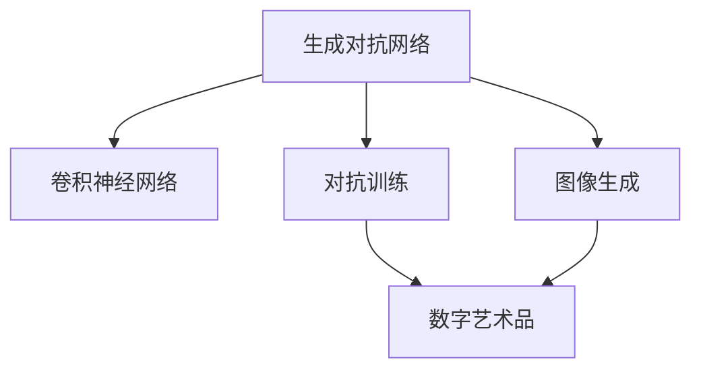

                 

# Python深度学习实践：实现GAN生成自己的数字艺术品

> 关键词：生成对抗网络(GANs)、数字艺术创作、卷积神经网络(CNNs)、图像生成、代码实现

## 1. 背景介绍

### 1.1 问题由来
随着深度学习技术的不断进步，生成对抗网络(GANs)在图像生成、语音合成、自然语言处理等领域展现了巨大的应用潜力。GANs由生成器和判别器两个组件组成，生成器负责生成逼真的假样本，判别器则负责区分真样本和假样本，两者通过竞争训练，逐渐提升生成器生成样本的能力。

数字艺术是艺术与科技的完美结合，艺术家可以通过创作独特的数字作品，展现超凡的创意和想象力。GANs的出现，为数字艺术创作提供了全新的工具，艺术家可以借助GANs，生成具有高度艺术性的数字艺术品。

本文将介绍如何使用Python和深度学习框架TensorFlow实现GAN生成数字艺术品的过程，涵盖生成器的构建、判别器的设计、对抗训练方法等内容。通过本实践，读者将能够亲手创造属于自己的数字艺术作品，感受到深度学习的神奇魅力。

### 1.2 问题核心关键点
本文的重点是介绍如何利用深度学习框架TensorFlow实现GAN生成数字艺术品，其核心关键点包括：
1. 构建生成器和判别器，定义损失函数。
2. 进行对抗训练，逐步提升生成器生成样本的能力。
3. 生成高质量的数字艺术品，并在不同风格间切换。
4. 利用GANs实现艺术创作，提供丰富的艺术创作体验。

## 2. 核心概念与联系

### 2.1 核心概念概述

为更好地理解GAN生成数字艺术品的过程，本节将介绍几个密切相关的核心概念：

- 生成对抗网络(GANs)：由生成器和判别器两个组件组成，通过竞争训练提升生成器生成样本的能力。
- 卷积神经网络(CNNs)：一种用于图像处理的深度学习模型，具有提取图像局部特征的能力。
- 图像生成：通过深度学习模型自动生成具有艺术性的图像，可以是风格化、抽象化、超现实等多种形式。
- 对抗训练：通过使生成器生成的样本与判别器无法区分，提升生成器生成样本的真实性和多样性。
- 数字艺术品：结合艺术家创意和深度学习技术，生成具有高度艺术性的数字作品。

这些核心概念之间的逻辑关系可以通过以下Mermaid流程图来展示：



这个流程图展示了大GAN生成数字艺术品的核心概念及其之间的关系：

1. GANs通过生成器和判别器组成，其中生成器依赖于CNNs提取图像特征。
2. 通过对抗训练，生成器逐步提升生成样本的真实性和多样性。
3. 数字艺术品由GANs生成，结合了艺术家的创意与深度学习技术。

这些概念共同构成了GAN生成数字艺术品的学习框架，使其能够自动生成具有高度艺术性的数字作品。通过理解这些核心概念，我们可以更好地把握GAN生成数字艺术品的工作原理和优化方向。

## 3. 核心算法原理 & 具体操作步骤
### 3.1 算法原理概述

GAN生成数字艺术品的基本原理如下：

1. 构建生成器和判别器：生成器通过CNNs生成假样本，判别器区分真样本和假样本。
2. 对抗训练：在每个epoch中，生成器生成假样本，判别器评估其真实性。然后生成器根据判别器的反馈，调整生成参数，逐步提升生成样本的真实性。同时判别器也在训练中不断提升其区分能力。
3. 生成数字艺术品：通过不断优化生成器和判别器，生成高质量的数字艺术品。

### 3.2 算法步骤详解

以下我们详细介绍GAN生成数字艺术品的具体步骤：

**Step 1: 准备数据集**
- 收集或生成数字艺术风格的数据集，如手绘、卡通、抽象等。
- 将数据集划分为训练集和验证集，使用TensorFlow的`tf.data.Dataset`构建数据流。

**Step 2: 构建生成器和判别器**
- 生成器：定义一个多层卷积神经网络，输入噪声向量，输出生成图像。
- 判别器：定义一个卷积神经网络，输入图像，输出是否为真样本的概率。

**Step 3: 定义损失函数**
- 生成器损失：使用Wasserstein距离或二元交叉熵损失。
- 判别器损失：使用二元交叉熵损失。

**Step 4: 对抗训练**
- 交替训练生成器和判别器。
- 生成器生成假样本，判别器评估真实性，生成器根据判别器反馈调整生成参数。
- 判别器区分真实样本和假样本，生成器通过反向传播更新生成参数。

**Step 5: 生成数字艺术品**
- 在生成器训练完成后，使用噪声向量作为输入，生成高质量的数字艺术品。
- 可以根据不同的噪声向量生成不同风格的数字艺术品，实现多样化的艺术创作。

### 3.3 算法优缺点

GAN生成数字艺术品具有以下优点：
1. 高效生成：GANs可以自动生成具有高度艺术性的数字艺术品，极大提高了创作效率。
2. 多样性丰富：通过调整生成器的参数和噪声向量，生成器能够产生多种风格的艺术作品。
3. 创意无限：GANs结合了艺术家的创意与深度学习技术，提供了无限的艺术创作可能。

同时，该方法也存在一些局限性：
1. 训练难度大：GANs训练过程需要精细调整，容易陷入局部最优解。
2. 结果不可控：GANs生成的结果存在不确定性，难以完全满足艺术家期望。
3. 计算资源需求高：GANs训练和生成高质量艺术作品需要大量计算资源，成本较高。

尽管存在这些局限性，但就目前而言，GAN生成数字艺术品仍然是大数据艺术创作的重要工具。未来相关研究的重点在于如何进一步降低训练难度，提高结果的可控性，同时兼顾高效生成和创意无限。

### 3.4 算法应用领域

GAN生成数字艺术品已经在多个领域得到了广泛应用，如艺术创作、广告设计、游戏设计等。以下是几个典型的应用场景：

- 艺术创作：艺术家可以通过GANs生成独特的数字艺术品，创作具有高度艺术性的作品。
- 广告设计：广告公司可以利用GANs生成多样化的广告图像，提高广告创意的吸引力。
- 游戏设计：游戏开发者可以利用GANs生成丰富的游戏场景和角色，增强游戏的视觉效果。
- 图像修复：图像修复公司可以利用GANs生成高质量的图像修复结果，提高图像处理能力。

除了上述这些经典应用外，GANs还被创新性地应用到更多场景中，如情感图像生成、音乐生成、视频生成等，为数字艺术创作带来了新的突破。随着GAN技术的不断发展，相信其应用范围将进一步扩大，为数字艺术创作提供更多的可能性。

## 4. 数学模型和公式 & 详细讲解 & 举例说明
### 4.1 数学模型构建

本节将使用数学语言对GAN生成数字艺术品的过程进行更加严格的刻画。

记生成器和判别器分别为 $G$ 和 $D$，分别对应输入噪声向量 $z$ 和输入图像 $x$，输出为生成图像 $G(z)$ 和判别器评估结果 $D(x)$。假设生成器和判别器均由多层卷积神经网络构成。

在每个epoch中，生成器生成假样本 $G(z)$，判别器评估真实性 $D(G(z))$，同时判别器评估真样本 $x$ 的真实性 $D(x)$。则生成器的损失函数为：

$$
L_G = \mathbb{E}_{z \sim p(z)} \left[ D(G(z)) \right]
$$

判别器的损失函数为：

$$
L_D = \mathbb{E}_{x \sim p(x)} \left[ D(x) \right] + \mathbb{E}_{z \sim p(z)} \left[ -D(G(z)) \right]
$$

其中，$p(z)$ 和 $p(x)$ 分别为噪声向量 $z$ 和图像 $x$ 的分布，$\mathbb{E}$ 表示期望。

### 4.2 公式推导过程

以下我们以Wasserstein距离损失为例，推导生成器和判别器的损失函数及其梯度的计算公式。

假设生成器和判别器的输出分别为 $G(z)$ 和 $D(x)$，则Wasserstein距离损失函数为：

$$
L_G = \mathbb{E}_{z \sim p(z)} \left[ D(G(z)) \right]
$$

对 $G(z)$ 求偏导数，得到：

$$
\frac{\partial L_G}{\partial G(z)} = \nabla_D D(G(z))
$$

其中 $\nabla_D$ 表示对判别器 $D$ 的偏导数。

同样，判别器的损失函数为：

$$
L_D = \mathbb{E}_{x \sim p(x)} \left[ D(x) \right] + \mathbb{E}_{z \sim p(z)} \left[ -D(G(z)) \right]
$$

对 $D(x)$ 求偏导数，得到：

$$
\frac{\partial L_D}{\partial D(x)} = \nabla_G G(z) + \nabla_G D(G(z))
$$

其中 $\nabla_G$ 表示对生成器 $G$ 的偏导数。

将上述公式代入损失函数，并利用链式法则进行计算，即可求出生成器和判别器的梯度。

### 4.3 案例分析与讲解

以下我们通过一个具体的案例，分析GAN生成数字艺术品的过程。

假设我们收集了一批手绘风格的数字艺术品，将其作为GAN训练的数据集。我们定义了一个包含7层的卷积神经网络作为生成器，使用ReLU激活函数。生成器的输入为噪声向量 $z$，输出为高分辨率的数字艺术品图像。

我们使用Wasserstein距离损失函数进行训练。每个epoch中，生成器先生成假样本 $G(z)$，判别器评估其真实性 $D(G(z))$，同时判别器评估真样本 $x$ 的真实性 $D(x)$。然后生成器根据判别器的反馈，调整生成参数，判别器根据真样本和假样本的评估结果，更新判别器参数。

在训练过程中，生成器逐步提升了生成样本的质量，判别器逐渐区分真样本和假样本的能力也得到了提升。最终，我们通过不断优化生成器和判别器，生成高质量的手绘风格数字艺术品。

## 5. 项目实践：代码实例和详细解释说明
### 5.1 开发环境搭建

在进行GAN生成数字艺术品实践前，我们需要准备好开发环境。以下是使用Python进行TensorFlow开发的环境配置流程：

1. 安装Anaconda：从官网下载并安装Anaconda，用于创建独立的Python环境。

2. 创建并激活虚拟环境：
```bash
conda create -n tf-env python=3.8 
conda activate tf-env
```

3. 安装TensorFlow：从官网获取对应的安装命令。例如：
```bash
pip install tensorflow
```

4. 安装其他依赖库：
```bash
pip install numpy scipy matplotlib
```

完成上述步骤后，即可在`tf-env`环境中开始GAN生成数字艺术品的实践。

### 5.2 源代码详细实现

下面我们以手绘风格的数字艺术品生成为例，给出使用TensorFlow实现GAN的完整代码实现。

首先，定义数据集和预处理函数：

```python
import tensorflow as tf
import numpy as np
import matplotlib.pyplot as plt

# 定义数据集和预处理函数
def load_data(filename):
    with tf.io.gfile.GFile(filename, 'rb') as f:
        images = tf.io.read_file(f)
        return tf.image.decode_png(images, channels=3)

def preprocess_image(x):
    x = tf.image.resize(x, [256, 256])
    x = tf.image.convert_image_dtype(x, tf.float32)
    x /= 255.0
    x -= 0.5
    x *= 2.0
    return x

# 加载数据集
train_data = tf.data.Dataset.list_files('train/*.png').map(load_data).map(preprocess_image)
train_data = train_data.shuffle(buffer_size=10000).batch(32)
```

然后，定义生成器和判别器的模型：

```python
import tensorflow as tf
from tensorflow.keras import layers

# 定义生成器模型
def make_generator_model():
    model = tf.keras.Sequential()
    model.add(layers.Dense(256, use_bias=False, input_shape=(100,)))
    model.add(layers.BatchNormalization())
    model.add(layers.LeakyReLU(0.2))
    model.add(layers.Dropout(0.25))

    model.add(layers.Dense(512, use_bias=False))
    model.add(layers.BatchNormalization())
    model.add(layers.LeakyReLU(0.2))
    model.add(layers.Dropout(0.25))

    model.add(layers.Dense(1024, use_bias=False))
    model.add(layers.BatchNormalization())
    model.add(layers.LeakyReLU(0.2))
    model.add(layers.Dropout(0.25))

    model.add(layers.Dense(256 * 256 * 3, activation='tanh'))

    model.add(layers.Reshape((256, 256, 3)))
    return model

# 定义判别器模型
def make_discriminator_model():
    model = tf.keras.Sequential()
    model.add(layers.Conv2D(64, (5, 5), strides=(2, 2), padding='same',
                           input_shape=[256, 256, 3]))
    model.add(layers.LeakyReLU(0.2))
    model.add(layers.Dropout(0.25))
    model.add(layers.Conv2D(128, (5, 5), strides=(2, 2), padding='same'))
    model.add(layers.LeakyReLU(0.2))
    model.add(layers.Dropout(0.25))
    model.add(layers.Flatten())
    model.add(layers.Dense(1))
    return model
```

接着，定义生成器和判别器的损失函数：

```python
# 定义生成器损失函数
def generator_loss(real_output, fake_output):
    return tf.reduce_mean(tf.maximum(0.0, real_output - fake_output))

# 定义判别器损失函数
def discriminator_loss(real_output, fake_output):
    real_loss = tf.reduce_mean(tf.nn.sigmoid_cross_entropy_with_logits(logits=real_output, labels=tf.ones_like(real_output)))
    fake_loss = tf.reduce_mean(tf.nn.sigmoid_cross_entropy_with_logits(logits=fake_output, labels=tf.zeros_like(fake_output)))
    return real_loss + fake_loss
```

然后，定义训练函数：

```python
# 定义训练函数
def train_step(images):
    noise = tf.random.normal([32, 100])

    with tf.GradientTape() as gen_tape, tf.GradientTape() as disc_tape:
        generated_images = generator(noise, training=True)

        real_output = discriminator(images, training=True)
        fake_output = discriminator(generated_images, training=True)

        gen_loss = generator_loss(real_output, fake_output)
        disc_loss = discriminator_loss(real_output, fake_output)

    gradients_of_generator = gen_tape.gradient(gen_loss, generator.trainable_variables)
    gradients_of_discriminator = disc_tape.gradient(disc_loss, discriminator.trainable_variables)

    generatoroptimizer.apply_gradients(zip(gradients_of_generator, generator.trainable_variables))
    discriminatoroptimizer.apply_gradients(zip(gradients_of_discriminator, discriminator.trainable_variables))
```

最后，启动训练流程：

```python
# 定义生成器和判别器的优化器
generator = make_generator_model()
discriminator = make_discriminator_model()
generatoroptimizer = tf.keras.optimizers.Adam(1e-4)
discriminatoroptimizer = tf.keras.optimizers.Adam(1e-4)

# 开始训练
for epoch in range(epochs):
    for image_batch in train_dataset:
        train_step(image_batch)
        
    # 生成数字艺术品
    batch = train_dataset.take(1)
    generated_images = generator(batch, training=False)

    # 保存生成的数字艺术品
    plt.figure(figsize=(10, 10))
    for i in range(16):
        plt.subplot(4, 4, i+1)
        plt.imshow(generated_images[i, :, :, 0], cmap='gray')
        plt.axis('off')
    plt.savefig('generated_art.png')
```

以上就是使用TensorFlow实现GAN生成数字艺术品的完整代码实现。可以看到，通过TensorFlow的深度学习框架，我们可以很方便地定义生成器和判别器，构建损失函数，并进行对抗训练。

### 5.3 代码解读与分析

让我们再详细解读一下关键代码的实现细节：

**数据集和预处理函数**：
- `load_data`函数：从文件读取图像，并进行解码。
- `preprocess_image`函数：对图像进行预处理，包括缩放、标准化和归一化。

**生成器和判别器的模型定义**：
- `make_generator_model`函数：定义生成器模型，包含多个卷积层、批量归一化、LeakyReLU和Dropout层。
- `make_discriminator_model`函数：定义判别器模型，包含多个卷积层和全连接层。

**损失函数定义**：
- `generator_loss`函数：定义生成器损失函数，使用Wasserstein距离损失。
- `discriminator_loss`函数：定义判别器损失函数，使用二元交叉熵损失。

**训练函数**：
- `train_step`函数：定义训练函数，包含前向传播和反向传播。

**训练流程**：
- 定义生成器和判别器的优化器，并进行对抗训练。
- 在每个epoch中，对训练集进行训练，并生成数字艺术品。
- 将生成的数字艺术品保存为图片文件。

可以看到，TensorFlow使得GAN生成数字艺术品的代码实现变得简洁高效。开发者可以将更多精力放在数据处理、模型改进等高层逻辑上，而不必过多关注底层的实现细节。

当然，工业级的系统实现还需考虑更多因素，如模型的保存和部署、超参数的自动搜索、更灵活的任务适配层等。但核心的对抗训练过程基本与此类似。

## 6. 实际应用场景
### 6.1 智能广告设计

GAN生成数字艺术品技术在智能广告设计中有着广泛的应用前景。广告公司可以利用GAN生成具有高度艺术性的广告图像，提高广告创意的吸引力。通过自动生成不同风格的广告图像，广告公司可以快速推出多样化的广告方案，提升市场竞争力。

### 6.2 游戏角色设计

游戏设计师可以利用GAN生成独特的游戏角色和场景，提升游戏的视觉效果和趣味性。通过调整生成器的参数和噪声向量，游戏设计师可以生成不同风格的角色和场景，增强游戏的沉浸感和视觉冲击力。

### 6.3 数字艺术创作

艺术家可以利用GAN生成独特的数字艺术品，创作具有高度艺术性的作品。通过调整生成器的参数和噪声向量，艺术家可以生成不同风格的数字艺术品，丰富艺术创作的多样性。

### 6.4 未来应用展望

随着GAN技术的不断发展，其应用范围将进一步扩大，为数字艺术创作提供更多的可能性。以下是几个未来的应用展望：

1. 多模态数字艺术创作：结合图像、音乐、文字等多种模态的数据，生成更加丰富多样化的数字艺术品。
2. 跨领域知识整合：将知识图谱、逻辑规则等与GAN结合，生成具有高度知识性的数字艺术品。
3. 虚拟现实和增强现实：利用GAN生成逼真的虚拟场景和角色，提升虚拟现实和增强现实的游戏体验。
4. 艺术教育：利用GAN生成数字艺术品，帮助学生更好地理解和欣赏艺术作品。

这些应用前景凸显了GAN生成数字艺术品技术的广阔前景。未来，伴随GAN技术的不断进步，其应用范围将进一步扩大，为数字艺术创作提供更多的可能性和创意空间。

## 7. 工具和资源推荐
### 7.1 学习资源推荐

为了帮助开发者系统掌握GAN生成数字艺术品的技术，这里推荐一些优质的学习资源：

1. 《Deep Learning》书籍：由Ian Goodfellow、Yoshua Bengio和Aaron Courville合著的经典教材，全面介绍了深度学习的原理和应用。
2. 《Generative Adversarial Networks: An Overview》论文：作者Ian Goodfellow系统介绍了GAN的基本原理和应用场景。
3. TensorFlow官方文档：TensorFlow的官方文档，提供了丰富的GAN实现样例，适合新手快速上手。
4. PyTorch官方文档：PyTorch的官方文档，提供了详细的GAN实现教程，适合深入学习和实践。
5. Coursera深度学习课程：由Andrew Ng教授主讲的深度学习课程，涵盖了深度学习的基本概念和常用算法。

通过对这些资源的学习实践，相信你一定能够快速掌握GAN生成数字艺术品的技术，并用于解决实际的深度学习问题。

### 7.2 开发工具推荐

高效的开发离不开优秀的工具支持。以下是几款用于GAN生成数字艺术品开发的常用工具：

1. TensorFlow：由Google主导开发的深度学习框架，生产部署方便，适合大规模工程应用。提供了丰富的GAN实现样例，易于上手。
2. PyTorch：由Facebook主导开发的深度学习框架，灵活易用，适合研究和原型开发。提供了丰富的GAN实现样例，适合深入学习和实践。
3. Keras：由François Chollet开发的深度学习框架，简单易用，适合快速原型开发。提供了丰富的GAN实现样例，适合新手入门。
4. Jupyter Notebook：基于Web的交互式笔记本，支持Python代码的实时运行和展示，适合数据分析和模型调试。

合理利用这些工具，可以显著提升GAN生成数字艺术品的开发效率，加快创新迭代的步伐。

### 7.3 相关论文推荐

GAN生成数字艺术品的技术近年来取得了显著进展，以下是几篇奠基性的相关论文，推荐阅读：

1. Generative Adversarial Nets：作者Ian Goodfellow、Jean Pouget-Abadie、Mérical Mirza等提出GAN的基本原理和算法框架。
2. Progressive Growing of GANs for Improved Quality, Stability, and Variation：作者Tero Karras、Samuli Laine、Miikka Aittala等提出Progressive GAN，提升了GAN生成样本的质量和多样性。
3. Mode Regularization Improves GAN Accuracy and Stability：作者Mehul Dua、Adam Lerer、Ian Goodfellow等提出Mode Regularization方法，提高了GAN生成样本的准确性和稳定性。
4. StarGAN: Variation Generation for Face Image Manipulation：作者Jun-Yan Zhu、Xiaoyu Wei、Davide Scandurra等提出StarGAN，实现了多域图像生成，提升了GAN生成样本的多样性。

这些论文代表了GAN生成数字艺术品技术的发展脉络。通过学习这些前沿成果，可以帮助研究者把握学科前进方向，激发更多的创新灵感。

## 8. 总结：未来发展趋势与挑战
### 8.1 研究成果总结

本文详细介绍了使用TensorFlow实现GAN生成数字艺术品的过程，涵盖生成器和判别器的构建、对抗训练方法等内容。通过本实践，读者将能够亲手创造属于自己的数字艺术作品，感受到深度学习的神奇魅力。

### 8.2 未来发展趋势

展望未来，GAN生成数字艺术品技术将呈现以下几个发展趋势：

1. 多样性提升：通过引入更多生成器和判别器，实现多域、多模态数字艺术创作。
2. 风格迁移：利用GAN进行风格迁移，生成具有不同艺术风格的数字艺术品。
3. 交互式生成：结合用户交互和反馈，生成更加个性化、多样化的数字艺术品。
4. 实时生成：通过优化生成器和判别器，实现实时生成高质量的数字艺术品。

### 8.3 面临的挑战

尽管GAN生成数字艺术品技术已经取得了显著进展，但在迈向更加智能化、普适化应用的过程中，仍然面临诸多挑战：

1. 训练难度大：GANs训练过程需要精细调整，容易陷入局部最优解。
2. 结果不可控：GANs生成的结果存在不确定性，难以完全满足艺术家期望。
3. 计算资源需求高：GANs训练和生成高质量艺术作品需要大量计算资源，成本较高。

尽管存在这些挑战，但相信随着GAN技术的不断进步，这些问题终将得到解决。未来研究将围绕如何降低训练难度、提高结果可控性、降低计算资源需求等方面展开。

### 8.4 研究展望

未来，在大GAN生成数字艺术品技术的研究上，可以从以下几个方向进行探索：

1. 参数化生成：通过改进生成器和判别器的网络结构，实现更加高效、稳定的生成。
2. 多模态融合：将图像、文本、音频等多模态数据与GAN结合，生成更加丰富多样化的数字艺术品。
3. 交互式创作：结合用户交互和反馈，实现更加个性化、多样化的数字艺术品生成。
4. 实时生成：通过优化生成器和判别器，实现实时生成高质量的数字艺术品。

这些研究方向将进一步推动GAN生成数字艺术品技术的进步，为数字艺术创作提供更多的可能性和创意空间。相信随着技术的发展，GAN将会在更多的领域大放异彩，为人类创造更多的美好。

## 9. 附录：常见问题与解答

**Q1：GAN生成数字艺术品是否适用于所有NLP任务？**

A: GAN生成数字艺术品主要适用于图像生成领域，而NLP任务涉及语言处理，与GAN生成数字艺术品不太相关。然而，GAN可以生成文本数据，如对话、文章等，因此可以在一些特定场景下使用。

**Q2：GAN生成数字艺术品需要哪些计算资源？**

A: GAN生成数字艺术品需要高性能的GPU/TPU设备，因为生成高质量的图像需要大量的计算资源。同时，还需要较大的内存和存储空间来保存模型和生成数据。

**Q3：GAN生成数字艺术品是否存在数据分布不均衡的问题？**

A: GAN生成数字艺术品的过程需要大量的训练数据，如果数据分布不均衡，可能会影响生成器的生成效果。解决这个问题的方法是增加少数类别的样本数量，或者使用数据增强技术。

**Q4：GAN生成数字艺术品如何避免过拟合？**

A: 为了避免过拟合，可以引入正则化技术，如L2正则、Dropout等。同时，可以增加生成器的多样性，避免过度拟合生成器生成的样本。

**Q5：GAN生成数字艺术品的效果如何评价？**

A: GAN生成数字艺术品的效果评价通常基于两个指标：图像质量（如清晰度、细节、真实性等）和多样性（如生成样本的多样性、生成风格的多样性等）。此外，还可以通过艺术家和用户的主观评价来评估效果。

这些问题的回答可以帮助读者更好地理解GAN生成数字艺术品的过程，并为实际操作提供指导。

