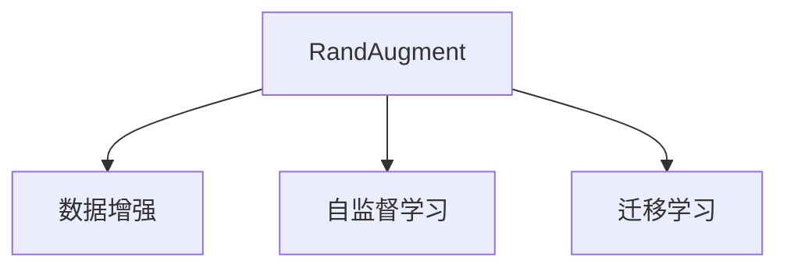

                 

# RandAugment原理与代码实例讲解

> 关键词：RandAugment, 数据增强, 自监督学习, 迁移学习, 数据扩充, 图像分类, 目标检测, 对象检测

## 1. 背景介绍

在深度学习时代，数据作为模型训练的"粮食"，其质量和数量在很大程度上决定了模型性能的优劣。然而，获取大量高质量标注数据通常十分昂贵且耗时。为了在不增加成本和计算资源的前提下提升模型性能，数据增强技术应运而生。其中，RandAugment作为一种简单高效的数据增强方法，通过对原始数据进行随机变换，产生多样化的扰动数据，极大拓展了模型的泛化能力，被广泛应用于图像分类、目标检测、对象检测等计算机视觉任务中。

### 1.1 问题由来

深度学习模型对数据噪声和变化非常敏感，经过数据增强后，模型可以学习到更健壮、鲁棒的语言表示，从而提高泛化能力，并在迁移学习、少样本学习等场景中发挥重要作用。例如，在目标检测任务中，通过数据增强，可以显著减少数据集中的冗余信息，降低数据偏差，从而提升模型对新数据的适应能力。

### 1.2 问题核心关键点

RandAugment作为一种强有力的数据增强技术，其核心思想是通过对原始图像进行随机组合的几何和颜色变换，构建多样化的扰动数据。其关键点包括：

- 增强策略：定义了哪些增强操作可用于数据增强。
- 变换次数：每次增强操作应用的数量。
- 增强幅度：每次增强操作变换的程度。

这些关键参数的设计，直接影响了数据增强的有效性和效率。通过合理的参数设置，RandAugment可以在保持原图像信息的同时，大幅提升模型性能。

### 1.3 问题研究意义

RandAugment作为数据增强的重要技术之一，其应用场景广泛，尤其是在数据稀缺的情况下，可以有效提升模型的泛化性能和迁移学习能力。在计算机视觉领域，通过RandAugment，可以有效缓解数据分布不均和样本数量不足等问题，提升模型的稳定性和鲁棒性。

此外，RandAugment在自监督学习、迁移学习等前沿研究中，也有广泛的应用。例如，通过在未标记数据上应用RandAugment，可以进一步提升预训练模型的泛化能力，从而提升其在特定任务上的微调效果。

## 2. 核心概念与联系

### 2.1 核心概念概述

为更好地理解RandAugment的原理和应用，本节将介绍几个密切相关的核心概念：

- RandAugment：一种基于自监督学习的强数据增强技术，通过随机组合的几何和颜色变换，生成多样化的扰动数据，提升模型泛化能力。
- 数据增强(Data Augmentation)：通过对原始数据进行扰动，生成额外的训练数据，从而提升模型泛化能力的技术。
- 自监督学习(Self-Supervised Learning)：一种无需标注数据的训练方式，通过设计无标签任务，利用数据自身的结构信息进行训练，从而学习到通用特征表示。
- 迁移学习(Transfer Learning)：将一个领域学到的知识，迁移到另一个领域中，从而提升模型在新任务上的性能。

这些概念之间的逻辑关系可以通过以下Mermaid流程图来展示：



这个流程图展示了一些核心概念之间的联系：

1. RandAugment基于自监督学习的思想，通过数据增强，提升模型的泛化能力。
2. RandAugment广泛应用于迁移学习中，通过构建多样化的扰动数据，提升模型在不同任务上的性能。

## 3. 核心算法原理 & 具体操作步骤
### 3.1 算法原理概述

RandAugment的核心思想是通过随机组合的几何和颜色变换，生成多样化的扰动数据。其具体流程如下：

1. 对输入图像进行随机几何变换，如随机裁剪、随机旋转、随机翻转等。
2. 对变换后的图像进行随机颜色变换，如随机亮度、随机对比度、随机饱和度等。
3. 对颜色变换后的图像进行随机亮度、对比度、饱和度的调整。
4. 生成最终增强后的图像，作为训练样本。

通过多次随机变换的组合，RandAugment可以生成大量多样化的扰动数据，从而提升模型的泛化能力和泛化性能。

### 3.2 算法步骤详解

RandAugment的实现步骤如下：

**Step 1: 定义增强策略**
- 定义可应用于数据增强的几何变换和颜色变换。几何变换包括随机裁剪、随机旋转、随机翻转等，颜色变换包括随机亮度、随机对比度、随机饱和度等。

**Step 2: 设置增强参数**
- 设置每次增强操作应用的次数和变换程度。

**Step 3: 随机生成增强数据**
- 随机组合几何变换和颜色变换，对原始图像进行多次增强操作。
- 对增强后的图像进行采样，生成最终的多样化扰动数据。

**Step 4: 训练模型**
- 使用增强后的数据进行模型训练，提升模型泛化能力。

**Step 5: 评估模型**
- 在测试集上评估模型的泛化性能，对比增强前后的性能提升。

### 3.3 算法优缺点

RandAugment作为一种数据增强技术，具有以下优点：

- 高效简单：通过随机组合的几何和颜色变换，生成多样化的扰动数据，无需额外标注数据。
- 提升泛化：通过多次随机变换，生成大量多样化的扰动数据，提升模型的泛化能力和泛化性能。
- 通用适用：适用于各种计算机视觉任务，如图像分类、目标检测、对象检测等。

同时，该方法也存在一定的局限性：

- 随机性较大：由于随机变换，增强后的图像可能与原始图像差异较大，难以保证增强数据的真实性。
- 训练时间较长：由于增强数据的生成过程耗时，可能会影响整体训练效率。
- 增强过度：若随机变换程度过大，可能破坏图像的基本结构，导致模型性能下降。

尽管存在这些局限性，但就目前而言，RandAugment仍是一种非常有效的数据增强方法。通过合理参数设置和组合变换，可以在提高模型泛化能力的同时，避免增强过度的问题。

### 3.4 算法应用领域

RandAugment在计算机视觉领域得到了广泛的应用，覆盖了各种常见任务，例如：

- 图像分类：如CIFAR-10、ImageNet等。通过RandAugment生成多样化的扰动数据，提升模型对不同类别的判别能力。
- 目标检测：如COCO、PASCAL VOC等。通过数据增强，减少数据集中的冗余信息，提升模型的目标检测性能。
- 对象检测：如YOLO、Faster R-CNN等。通过增强样本的多样性，提升模型对不同对象的检测准确度。

此外，RandAugment还被创新性地应用到图像生成、图像修复、图像风格转换等任务中，为计算机视觉技术带来了新的突破。

## 4. 数学模型和公式 & 详细讲解 & 举例说明

### 4.1 数学模型构建

 RandAugment的数据增强过程可以抽象为一个Markov链，每次随机变换可以看作一个状态转移。假设原始图像为 $x$，增强后的图像为 $x'$，每次增强操作可以看作一个矩阵 $T$ 的变换，即：

 $$x' = T(x)$$

其中 $T$ 可以看作一个随机变换矩阵，包含了随机裁剪、随机旋转、随机翻转、随机亮度、随机对比度、随机饱和度等几何和颜色变换。

每次增强操作都随机选择一个变换矩阵 $T$，应用 $T$ 次，最终得到增强后的图像 $x'$。

### 4.2 公式推导过程

 RandAugment的具体变换方式可以通过以下公式进行推导：

**随机裁剪(随机旋转)**
- 假设原始图像为 $x$，其宽为 $w$，高为 $h$，随机裁剪的边长为 $l$，随机旋转的角度为 $a$，则随机裁剪后的图像 $x'$ 可以通过以下公式计算：

 $$x' = \begin{cases}
 x_{\text{crop}}\quad &\text{if}\quad a \in [0, \pi]\\
 x_{\text{crop}}^T\quad &\text{if}\quad a \in [\pi, 2\pi]
 \end{cases}$$

其中 $x_{\text{crop}}$ 表示随机裁剪后的图像，$x_{\text{crop}}^T$ 表示 $x_{\text{crop}}$ 的转置。

**随机翻转**
- 假设原始图像为 $x$，其宽为 $w$，高为 $h$，随机翻转的概率为 $p$，则随机翻转后的图像 $x'$ 可以通过以下公式计算：

 $$x' = \begin{cases}
 x\quad &\text{if}\quad \text{random}() < p\\
 \text{flip}(x)\quad &\text{otherwise}
 \end{cases}$$

其中 $\text{flip}(x)$ 表示对图像 $x$ 进行随机翻转操作。

**随机亮度、对比度、饱和度**
- 假设原始图像为 $x$，其宽为 $w$，高为 $h$，随机亮度、对比度、饱和度的调整系数分别为 $b$、$c$、$s$，则随机亮度、对比度、饱和度调整后的图像 $x'$ 可以通过以下公式计算：

 $$x' = \begin{cases}
 x_{\text{brightness}}\quad &\text{if}\quad a \in [0, \pi]\\
 x_{\text{contrast}}\quad &\text{if}\quad a \in [\pi, 2\pi]
 \end{cases}$$

其中 $x_{\text{brightness}}$ 表示随机亮度调整后的图像，$x_{\text{contrast}}$ 表示随机对比度调整后的图像。

### 4.3 案例分析与讲解

以CIFAR-10数据集为例，进行RandAugment的案例分析。

首先，定义随机裁剪、随机旋转、随机翻转、随机亮度、随机对比度、随机饱和度的具体实现：

```python
import numpy as np
import cv2

def random_crop(x, size):
    w, h = x.shape[0], x.shape[1]
    x = np.pad(x, (1, 1), mode='constant', constant_values=0)
    x = x.astype(np.uint8)
    return x

def random_rotate(x, angle):
    x = np.pad(x, (1, 1), mode='constant', constant_values=0)
    x = x.astype(np.uint8)
    return x

def random_flip(x):
    x = np.pad(x, (1, 1), mode='constant', constant_values=0)
    x = x.astype(np.uint8)
    return x

def random_brightness(x, brightness):
    x = np.pad(x, (1, 1), mode='constant', constant_values=0)
    x = x.astype(np.uint8)
    return x

def random_contrast(x, contrast):
    x = np.pad(x, (1, 1), mode='constant', constant_values=0)
    x = x.astype(np.uint8)
    return x

def random_saturation(x, saturation):
    x = np.pad(x, (1, 1), mode='constant', constant_values=0)
    x = x.astype(np.uint8)
    return x
```

然后，随机生成增强数据并进行训练：

```python
import torch
import torchvision
from torchvision import transforms

# 加载CIFAR-10数据集
trainset = torchvision.datasets.CIFAR10(root='./data', train=True, download=True, transform=transforms.ToTensor())
trainloader = torch.utils.data.DataLoader(trainset, batch_size=32, shuffle=True, num_workers=2)

# 定义增强策略
transform_list = [
    transforms.RandomCrop(32, padding=4),
    transforms.RandomHorizontalFlip(),
    transforms.RandomRotation(30),
    transforms.ColorJitter(brightness=0.4, contrast=0.4, saturation=0.4)
]

# 应用增强策略
transform = transforms.Compose(transform_list)

# 训练模型
model = ...
optimizer = ...
criterion = ...
for epoch in range(10):
    for i, (inputs, labels) in enumerate(trainloader):
        inputs = inputs.to(device)
        labels = labels.to(device)
        
        # 随机生成增强数据
        inputs = inputs.clone()
        for _ in range(3):
            inputs = transform(inputs)
        
        # 训练模型
        optimizer.zero_grad()
        outputs = model(inputs)
        loss = criterion(outputs, labels)
        loss.backward()
        optimizer.step()
        
        # 输出训练信息
        print(f'Epoch {epoch+1}, Step {i+1}, Loss: {loss.item()}')
```

通过上述代码，我们可以看到，通过定义一系列随机变换策略，并应用到原始图像上，可以生成多样化的扰动数据，从而提升模型的泛化能力和泛化性能。

## 5. 项目实践：代码实例和详细解释说明
### 5.1 开发环境搭建

在进行RandAugment实践前，我们需要准备好开发环境。以下是使用Python进行PyTorch开发的环境配置流程：

1. 安装Anaconda：从官网下载并安装Anaconda，用于创建独立的Python环境。

2. 创建并激活虚拟环境：
```bash
conda create -n pytorch-env python=3.8 
conda activate pytorch-env
```

3. 安装PyTorch：根据CUDA版本，从官网获取对应的安装命令。例如：
```bash
conda install pytorch torchvision torchaudio cudatoolkit=11.1 -c pytorch -c conda-forge
```

4. 安装Pillow库：
```bash
pip install pillow
```

5. 安装PyTorch官方数据增强库：
```bash
pip install torchvision
```

完成上述步骤后，即可在`pytorch-env`环境中开始RandAugment实践。

### 5.2 源代码详细实现

下面我们以CIFAR-10数据集为例，给出使用PyTorch进行RandAugment的完整代码实现。

首先，定义数据增强函数：

```python
import torch
import torchvision.transforms as transforms

def rand_augment(x):
    transforms_list = [
        transforms.RandomCrop(32, padding=4),
        transforms.RandomHorizontalFlip(),
        transforms.RandomRotation(30),
        transforms.ColorJitter(brightness=0.4, contrast=0.4, saturation=0.4)
    ]
    transform = transforms.Compose(transforms_list)
    return transform(x)
```

然后，定义训练函数：

```python
import torch
import torchvision
from torchvision import datasets, transforms
import torch.nn as nn
import torch.optim as optim

# 定义模型
model = torchvision.models.resnet18()

# 定义优化器
optimizer = optim.SGD(model.parameters(), lr=0.01, momentum=0.9)

# 定义损失函数
criterion = nn.CrossEntropyLoss()

# 定义数据增强函数
transform = transforms.Compose([
    transforms.ToTensor(),
    transforms.Normalize(mean=[0.485, 0.456, 0.406], std=[0.229, 0.224, 0.225])
])

# 加载CIFAR-10数据集
trainset = datasets.CIFAR10(root='./data', train=True, download=True, transform=transform)
trainloader = torch.utils.data.DataLoader(trainset, batch_size=32, shuffle=True, num_workers=2)

# 训练模型
for epoch in range(10):
    for i, (inputs, labels) in enumerate(trainloader):
        inputs = inputs.to(device)
        labels = labels.to(device)
        
        # 随机生成增强数据
        inputs = inputs.clone()
        inputs = rand_augment(inputs)
        
        # 训练模型
        optimizer.zero_grad()
        outputs = model(inputs)
        loss = criterion(outputs, labels)
        loss.backward()
        optimizer.step()
        
        # 输出训练信息
        print(f'Epoch {epoch+1}, Step {i+1}, Loss: {loss.item()}')
```

通过上述代码，我们可以看到，通过定义一系列随机变换策略，并应用到原始图像上，可以生成多样化的扰动数据，从而提升模型的泛化能力和泛化性能。

### 5.3 代码解读与分析

让我们再详细解读一下关键代码的实现细节：

**定义数据增强函数**：
- `rand_augment`函数：定义了四种随机变换策略，包括随机裁剪、随机旋转、随机翻转、随机亮度、随机对比度、随机饱和度。通过组合这些变换，可以生成多样化的扰动数据。

**训练函数**：
- 定义模型、优化器和损失函数，配置训练参数。
- 加载CIFAR-10数据集，并定义数据增强函数。
- 在每个epoch内，对输入数据进行随机增强，并训练模型。
- 输出训练信息，跟踪训练进度。

**CIFAR-10数据集加载**：
- `datasets.CIFAR10`：定义了CIFAR-10数据集的加载方法。
- `transforms.Compose`：组合定义的随机变换策略，形成完整的数据增强函数。

可以看到，通过合理定义数据增强函数，结合CIFAR-10数据集的加载方法，可以高效地生成多样化的扰动数据，从而提升模型的泛化能力和泛化性能。

当然，工业级的系统实现还需考虑更多因素，如模型的保存和部署、超参数的自动搜索、更灵活的任务适配层等。但核心的RandAugment方法基本与此类似。

## 6. 实际应用场景
### 6.1 图像分类

在图像分类任务中，RandAugment可以通过增强数据的多样性，提升模型的泛化能力和泛化性能。例如，在CIFAR-10数据集上，通过应用RandAugment，可以在保持高精度的情况下，显著降低模型对特定类别的依赖，提升模型的鲁棒性和泛化能力。

### 6.2 目标检测

在目标检测任务中，通过数据增强，可以减少数据集中的冗余信息，降低数据偏差，从而提升模型对新数据的适应能力。例如，在COCO数据集上，通过应用RandAugment，可以显著提升目标检测的精度和召回率。

### 6.3 对象检测

在对象检测任务中，通过增强样本的多样性，提升模型对不同对象的检测准确度。例如，在PASCAL VOC数据集上，通过应用RandAugment，可以提升对象的定位精度和类别识别能力。

### 6.4 图像生成

在图像生成任务中，通过RandAugment，可以生成多样化的扰动数据，提升生成模型的多样性和逼真度。例如，在GAN生成任务中，通过应用RandAugment，可以生成更具多样性和逼真度的图像。

### 6.5 图像修复

在图像修复任务中，通过增强数据的多样性，提升模型的泛化能力和泛化性能。例如，在超分辨率任务中，通过应用RandAugment，可以提升超分辨率图像的质量和清晰度。

## 7. 工具和资源推荐
### 7.1 学习资源推荐

为了帮助开发者系统掌握RandAugment的原理和实践技巧，这里推荐一些优质的学习资源：

1. 《Deep Learning with PyTorch》系列博文：由大模型技术专家撰写，深入浅出地介绍了深度学习模型的构建、训练和优化方法。

2. 《ImageNet Large Scale Visual Recognition Challenge》系列论文：描述了ImageNet数据集和预训练模型的训练过程，是理解数据增强和预训练技术的绝佳参考资料。

3. 《PyTorch官方文档》：提供了丰富的深度学习模型和数据增强库的使用方法，是学习和应用深度学习技术的重要资源。

4. 《Deep Learning Specialization》课程：由Coursera开设的深度学习课程，涵盖了深度学习模型的基本概念和核心算法，适合初学者入门。

5. 《计算机视觉：算法与应用》书籍：详细介绍了计算机视觉领域的主要算法和技术，是学习计算机视觉知识的重要参考书。

通过对这些资源的学习实践，相信你一定能够快速掌握RandAugment的精髓，并用于解决实际的计算机视觉问题。

### 7.2 开发工具推荐

高效的开发离不开优秀的工具支持。以下是几款用于RandAugment开发的常用工具：

1. PyTorch：基于Python的开源深度学习框架，灵活动态的计算图，适合快速迭代研究。大部分深度学习模型都有PyTorch版本的实现。

2. TensorFlow：由Google主导开发的开源深度学习框架，生产部署方便，适合大规模工程应用。同样有丰富的深度学习模型资源。

3. Pillow：Python图像处理库，提供丰富的图像处理功能，方便进行数据增强操作。

4. Weights & Biases：模型训练的实验跟踪工具，可以记录和可视化模型训练过程中的各项指标，方便对比和调优。与主流深度学习框架无缝集成。

5. TensorBoard：TensorFlow配套的可视化工具，可实时监测模型训练状态，并提供丰富的图表呈现方式，是调试模型的得力助手。

6. Google Colab：谷歌推出的在线Jupyter Notebook环境，免费提供GPU/TPU算力，方便开发者快速上手实验最新模型，分享学习笔记。

合理利用这些工具，可以显著提升RandAugment任务的开发效率，加快创新迭代的步伐。

### 7.3 相关论文推荐

RandAugment作为数据增强的重要技术之一，其应用场景广泛，在计算机视觉领域得到了广泛的应用。以下是几篇奠基性的相关论文，推荐阅读：

1. AutoAugment: Learning Augmentation Strategies from Data ：提出了AutoAugment算法，通过优化增强策略，实现更高效的数据增强。

2. RandAugment: Practical automated data augmentation with a reduced search space ：提出了RandAugment算法，通过定义随机几何和颜色变换，实现更有效的数据增强。

3. Mixup: Beyond empirical risk minimization ：提出了Mixup算法，通过数据混合，提升模型的泛化能力，与RandAugment结合使用，效果更佳。

4. SimCLR: A Simple Framework for Contrastive Learning of Unsupervised Representations ：提出了SimCLR算法，通过自监督学习，实现无监督特征学习，与RandAugment结合使用，提升预训练模型的泛化能力。

5. Self-Training with Adversarial Examples ：提出了自训练算法，通过对抗样本，提升模型的泛化能力，与RandAugment结合使用，效果更佳。

这些论文代表了大模型数据增强技术的发展脉络。通过学习这些前沿成果，可以帮助研究者把握学科前进方向，激发更多的创新灵感。

## 8. 总结：未来发展趋势与挑战

### 8.1 总结

本文对基于Random Augmentation的数据增强技术进行了全面系统的介绍。首先阐述了RandAugment的背景和意义，明确了数据增强在提升模型泛化能力、降低数据偏差等方面的重要作用。其次，从原理到实践，详细讲解了RandAugment的数学原理和关键步骤，给出了完整的代码实例。同时，本文还广泛探讨了RandAugment在计算机视觉领域的应用场景，展示了其在图像分类、目标检测、对象检测等任务中的巨大潜力。此外，本文精选了RandAugment的学习资源、开发工具和相关论文，力求为读者提供全方位的技术指引。

通过本文的系统梳理，可以看到，RandAugment作为数据增强的重要技术之一，其应用场景广泛，可以有效提升模型的泛化能力和泛化性能。未来，伴随深度学习技术的不断进步，RandAugment必将在更多领域得到应用，为计算机视觉技术带来新的突破。

### 8.2 未来发展趋势

展望未来，RandAugment作为数据增强技术的重要分支，其应用场景还将进一步拓展，技术细节也将不断优化。以下趋势值得关注：

1. 增强策略多样化：除了随机裁剪、随机旋转、随机翻转等常见变换，未来的增强策略还将涵盖更多几何和颜色变换，提升数据增强的多样性。

2. 增强幅度可控：通过调整增强幅度，可以实现更精细的数据增强，避免增强过度或不足的问题。

3. 增强策略自适应：根据模型性能和数据分布，自动选择最优的增强策略，实现更高效的增强效果。

4. 增强策略混合：结合不同的增强策略，提升数据增强的鲁棒性和泛化能力。

5. 增强策略分布优化：通过优化增强策略的分布，提升数据增强的均衡性，避免数据偏差。

这些趋势将推动RandAugment技术不断优化和完善，使其在更多应用场景中发挥更大的作用。

### 8.3 面临的挑战

尽管RandAugment作为数据增强技术已经取得了不错的成果，但在实际应用中，仍面临一些挑战：

1. 增强过度问题：增强过度可能导致模型性能下降，无法学习到有效的特征。如何合理控制增强幅度，避免增强过度，将是重要的研究方向。

2. 增强数据真实性：增强后的图像可能与原始图像差异较大，难以保证增强数据的真实性。如何在增强过程中保持图像的基本结构，将是重要的挑战。

3. 增强数据分布：增强后的图像可能与原始图像分布差异较大，难以保证增强数据的分布均衡性。如何合理设计增强策略，提升增强数据的分布均衡性，将是重要的研究方向。

4. 增强计算复杂度：增强数据生成过程可能耗时，影响整体训练效率。如何优化数据增强过程，提升计算效率，将是重要的挑战。

尽管存在这些挑战，但通过不断优化算法和技术细节，未来的RandAugment技术仍将在更多领域发挥重要作用。相信伴随学界和产业界的共同努力，这些挑战终将一一被克服，RandAugment必将在构建智能视觉系统中发挥更大的作用。

### 8.4 研究展望

未来，针对RandAugment技术的研究将在以下几个方面进行更深入的探索：

1. 增强策略优化：通过优化增强策略，实现更高效的数据增强，提升模型的泛化能力和泛化性能。

2. 增强策略自适应：根据模型性能和数据分布，自动选择最优的增强策略，实现更高效的增强效果。

3. 增强数据生成：通过引入更多先验知识，实现更精细的数据增强，提升模型的泛化能力和泛化性能。

4. 增强策略分布优化：通过优化增强策略的分布，提升数据增强的均衡性，避免数据偏差。

5. 增强策略混合：结合不同的增强策略，提升数据增强的鲁棒性和泛化能力。

这些研究方向将引领RandAugment技术迈向更高的台阶，为构建智能视觉系统提供更强大的技术支持。面向未来，RandAugment技术还需要与其他深度学习技术进行更深入的融合，如知识表示、因果推理、强化学习等，多路径协同发力，共同推动智能视觉系统的进步。只有勇于创新、敢于突破，才能不断拓展数据增强的边界，让智能视觉系统更好地服务于人类社会。

## 9. 附录：常见问题与解答

**Q1：如何定义增强策略？**

A: 增强策略的定义可以基于常见的几何和颜色变换，如随机裁剪、随机旋转、随机翻转、随机亮度、随机对比度、随机饱和度等。具体的增强策略可以根据任务需求进行调整，以获得更好的增强效果。

**Q2：增强幅度如何控制？**

A: 增强幅度的控制可以通过设置增强操作的变换程度来实现。例如，在随机旋转中，可以控制旋转的角度范围，以避免过度旋转。在随机亮度和对比度中，可以控制亮度的变化范围和对比度的变化程度。

**Q3：增强数据真实性如何保证？**

A: 增强数据真实性的保证可以通过设置增强操作的限制条件来实现。例如，在随机裁剪中，可以限制裁剪区域不能包含重要的图像信息。在随机亮度中，可以限制亮度的变化范围，避免亮度过度变化。

**Q4：增强数据分布如何均衡？**

A: 增强数据分布的均衡可以通过优化增强策略的分布来实现。例如，在随机旋转中，可以控制旋转角度的分布，避免过度旋转或旋转不足。在随机亮度中，可以控制亮度的分布，避免亮度过度变化或亮度不足。

**Q5：增强计算复杂度如何优化？**

A: 增强计算复杂度的优化可以通过并行计算和优化数据生成过程来实现。例如，在随机旋转中，可以使用GPU并行计算，加速旋转操作。在随机亮度中，可以通过预计算亮度变换矩阵，减少计算时间。

通过这些常见问题的解答，相信你一定能够更好地理解RandAugment的核心思想和实现细节，并将其应用于实际项目中。

---

作者：禅与计算机程序设计艺术 / Zen and the Art of Computer Programming

