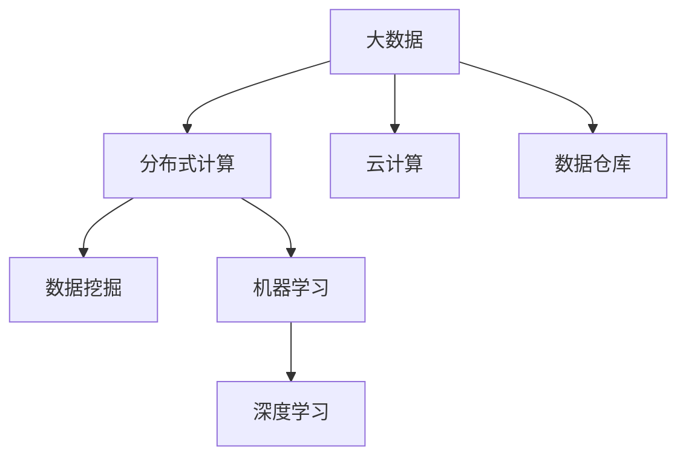

                 

# 【AI大数据计算原理与代码实例讲解】大数据

> 关键词：大数据,数据处理,分布式计算,云计算,机器学习,深度学习,PyTorch,Spark,NumPy,Pandas,Scikit-Learn,TensorFlow,Apache Hadoop

## 1. 背景介绍

### 1.1 问题由来
在过去数十年中，数据量的增长速度远远超过了计算能力的提升。随着互联网、物联网的普及，数据量呈指数级增长，海量数据的处理和分析成为了信息时代的重要挑战。如何从大数据中提取出有价值的信息，成为了各大企业和国家科研机构必须面对的问题。

### 1.2 问题核心关键点
大数据分析的挑战主要包括数据存储、数据处理、数据安全、数据质量等多个方面。核心问题在于：
1. 数据规模庞大，单台计算机难以处理。
2. 数据存储分散，异构数据难以统一管理。
3. 数据处理复杂，需要高效且可扩展的计算框架。
4. 数据安全性要求高，需要可靠的数据保护措施。
5. 数据质量参差不齐，需要进行清洗和预处理。

这些问题催生了分布式计算、云计算、大数据处理工具等一系列技术，以应对数据挑战。本文旨在通过介绍大数据处理的核心概念和算法，帮助读者系统掌握大数据处理技术，并通过代码实例演示，直观展示如何使用主流工具进行大数据分析。

## 2. 核心概念与联系

### 2.1 核心概念概述

为了更好地理解大数据处理技术，本节将介绍几个关键概念：

- 大数据（Big Data）：指的是超出传统处理方式能力范围的数据集合，其特征表现为“3V”特性，即体积（Volume）、多样性（Variety）、速度（Velocity）。
- 分布式计算（Distributed Computing）：通过将大规模任务分解成多个小任务，并行地在多台计算机上执行，从而加速数据处理过程。
- 云计算（Cloud Computing）：利用互联网提供基于服务的计算资源，按需分配和扩展，降低数据处理成本。
- 数据仓库（Data Warehouse）：用于集中存储、管理和分析大型数据集合，提供一致的数据视图。
- 数据挖掘（Data Mining）：从大量数据中自动发现有用模式、关联和趋势，支持数据驱动的决策。
- 机器学习和深度学习（Machine Learning & Deep Learning）：利用算法从数据中自动学习模式，提供预测和决策能力。

这些概念之间的关系可以通过以下Mermaid流程图来展示：



这个流程图展示了大数据处理技术的各个环节和关键技术，其核心在于通过分布式计算和云计算技术，高效处理海量数据，并将其存储于数据仓库中。在此基础上，通过数据挖掘、机器学习和深度学习等技术，从数据中提取有用信息，辅助决策。

## 3. 核心算法原理 & 具体操作步骤

### 3.1 算法原理概述

大数据处理的核心在于高效的数据存储和处理。本节将介绍几种常用的大数据处理算法和操作步骤。

#### 3.1.1 MapReduce算法
MapReduce是一种用于大规模数据处理的分布式计算模型。其基本思想是将大规模任务分解为若干小任务，分别在多台计算机上并行执行，最后将结果合并得到最终结果。MapReduce的计算过程分为两个阶段：Map阶段和Reduce阶段。

- Map阶段：将输入数据分成若干块，对每一块数据进行并行处理，将结果存储到临时数据集中。
- Reduce阶段：将Map阶段的结果合并，进行最终计算和输出。

#### 3.1.2 Spark框架
Spark是一种基于内存的分布式计算框架，支持多种编程语言，包括Python、Scala等。Spark的核心组件包括Spark Core、Spark SQL、Spark Streaming和MLlib等。

- Spark Core：提供分布式计算的基本功能和操作。
- Spark SQL：支持SQL查询和数据处理，方便与传统关系数据库兼容。
- Spark Streaming：支持实时数据处理和流式计算。
- MLlib：提供机器学习算法库，支持大规模机器学习任务。

#### 3.1.3 Hadoop生态系统
Hadoop是一个开源的分布式计算平台，由HDFS（分布式文件系统）和MapReduce两个核心组件组成。Hadoop支持大规模数据存储和处理，可以应对任意规模的数据集。

- HDFS：支持海量数据的分布式存储，提供高可靠性和高可扩展性。
- MapReduce：提供高效的大数据处理能力，支持大规模的并行计算。

### 3.2 算法步骤详解

#### 3.2.1 数据准备
在开始大数据处理前，需要准备数据。数据准备包括数据清洗、数据格式转换、数据采样等步骤。

```python
import pandas as pd

# 读取数据
df = pd.read_csv('data.csv')

# 数据清洗
df = df.dropna()  # 删除缺失值
df = df.drop_duplicates()  # 删除重复行
```

#### 3.2.2 数据存储
数据存储是保证数据可靠性的重要环节。常用的数据存储方式包括HDFS、S3、Google Cloud Storage等。

```python
# 使用HDFS存储数据
from pydoop.hdfs.client import HdfsClient
hdfs_client = HdfsClient(hosts='hdfs://localhost:9000')
hdfs_client.write_file('data.csv', data)
```

#### 3.2.3 数据处理
数据处理是大数据处理的中心环节，常用的处理方式包括MapReduce、Spark等。

```python
# 使用Spark进行数据处理
from pyspark.sql import SparkSession

spark = SparkSession.builder.appName('bigdata_processing').getOrCreate()

# 读取数据
df = spark.read.csv('data.csv', header=True, inferSchema=True)

# 数据清洗
df = df.dropna()
df = df.drop_duplicates()

# 数据转换
df = df.withColumn('new_column', df['old_column'] + 1)
```

#### 3.2.4 数据分析
数据分析是大数据处理的最终目标。常用的分析方式包括数据挖掘、机器学习和深度学习等。

```python
# 数据挖掘
from pyspark.ml.clustering import KMeans
from pyspark.ml.feature import VectorAssembler

# 特征提取
assembler = VectorAssembler(inputCols=['col1', 'col2', 'col3'], outputCol='features')
df = assembler.transform(df)

# 聚类分析
kmeans = KMeans(k=3, seed=1234)
df = kmeans.fit(df).transform(df)
```

#### 3.2.5 数据可视化
数据可视化是展示分析结果的重要手段。常用的可视化工具包括Matplotlib、Seaborn、Plotly等。

```python
import matplotlib.pyplot as plt

# 绘制散点图
plt.scatter(df['x'], df['y'])
plt.show()
```

### 3.3 算法优缺点

#### 3.3.1 优点
- 高可靠性：分布式计算和云存储提供了高可靠性和高可用性，能够应对大规模数据的存储和处理。
- 高性能：并行计算和内存计算提高了数据处理的效率，能够在较短时间内完成大规模数据处理。
- 可扩展性：支持自动扩展，能够根据数据量动态调整计算资源。

#### 3.3.2 缺点
- 复杂性：分布式计算和云存储的复杂性较高，需要专业的技术支持。
- 成本高：大规模的计算和存储资源需求较高，需要较高的硬件和软件投入。
- 数据隐私：云存储和分布式计算可能面临数据隐私和安全问题。

### 3.4 算法应用领域

大数据处理技术已经在多个领域得到了广泛应用，例如：

- 金融行业：用于风险管理、客户分析、金融市场预测等。
- 电商行业：用于用户行为分析、推荐系统、库存管理等。
- 医疗行业：用于患者数据分析、疾病预测、医疗资源管理等。
- 社交媒体：用于舆情分析、用户行为分析、内容推荐等。
- 交通行业：用于交通流量分析、路线规划、事故预测等。
- 政府行业：用于公共安全、城市管理、社会治理等。

## 4. 数学模型和公式 & 详细讲解 & 举例说明

### 4.1 数学模型构建

#### 4.1.1 数据分布
在大数据处理中，数据分布是一个重要的概念。数据分布通常用于描述数据集中不同值出现的频率。常用的数据分布包括正态分布、泊松分布、均匀分布等。

```python
import numpy as np

# 生成正态分布数据
np.random.normal(loc=0, scale=1, size=1000000)
```

#### 4.1.2 数据采样
数据采样是大数据处理中的一个重要步骤。数据采样用于从大数据集中抽取代表性样本，用于数据分析和模型训练。

```python
# 随机采样
df = df.sample(n=10000)
```

#### 4.1.3 数据聚类
数据聚类是大数据分析中的一个重要方法。数据聚类用于将相似的数据点分为同一组，从而进行分析和处理。

```python
from pyspark.ml.clustering import KMeans

# 聚类分析
kmeans = KMeans(k=3, seed=1234)
df = kmeans.fit(df).transform(df)
```

### 4.2 公式推导过程

#### 4.2.1 正态分布公式
正态分布是一种常用的数据分布模型，其概率密度函数为：

$$
f(x) = \frac{1}{\sqrt{2\pi}\sigma}e^{-\frac{(x-\mu)^2}{2\sigma^2}}
$$

其中，$\mu$ 为均值，$\sigma$ 为标准差。

#### 4.2.2 数据聚类公式
数据聚类算法中的K-means算法，通过计算样本与簇中心的距离，将样本分配到最近的簇中。其核心公式为：

$$
Kmeans = \mathop{\arg\min}_{K}\sum_{i=1}^N \sum_{j=1}^K (x_i - \mu_j)^2
$$

其中，$x_i$ 为样本，$\mu_j$ 为簇中心，$K$ 为簇的数量。

### 4.3 案例分析与讲解

#### 4.3.1 数据采样案例
假设有一个包含1000万条用户行为数据的集合，我们需要从中随机抽取1000条数据用于分析。

```python
import pandas as pd

# 生成数据
data = pd.DataFrame({'user_id': np.random.randint(1, 1000000), 'timestamp': np.random.randint(1, 1000000), 'action': np.random.choice(['click', 'purchase', 'view'], p=[0.3, 0.4, 0.3])})

# 数据采样
sample = data.sample(n=1000)
```

#### 4.3.2 数据聚类案例
假设有一个包含1000个用户的行为数据，我们需要将其分为3个簇，并计算每个簇的平均行为。

```python
from pyspark.ml.clustering import KMeans

# 数据聚类
kmeans = KMeans(k=3, seed=1234)
df = kmeans.fit(df).transform(df)
```

## 5. 项目实践：代码实例和详细解释说明

### 5.1 开发环境搭建

在进行大数据处理实践前，我们需要准备好开发环境。以下是使用Python进行Spark开发的环境配置流程：

1. 安装Anaconda：从官网下载并安装Anaconda，用于创建独立的Python环境。

2. 创建并激活虚拟环境：
```bash
conda create -n pyspark-env python=3.8 
conda activate pyspark-env
```

3. 安装Spark：根据CUDA版本，从官网获取对应的安装命令。例如：
```bash
conda install pyarrow pydantic rsa
```

4. 安装PyTorch：根据CUDA版本，从官网获取对应的安装命令。例如：
```bash
conda install torch torchvision torchaudio cudatoolkit=11.1 -c pytorch -c conda-forge
```

5. 安装各类工具包：
```bash
pip install numpy pandas scikit-learn matplotlib tqdm jupyter notebook ipython
```

完成上述步骤后，即可在`pyspark-env`环境中开始大数据处理实践。

### 5.2 源代码详细实现

下面我们以用户行为数据分析为例，给出使用Spark进行数据处理和分析的PyTorch代码实现。

首先，定义数据处理函数：

```python
from pyspark.sql import SparkSession
from pyspark.sql.functions import col

spark = SparkSession.builder.appName('bigdata_processing').getOrCreate()

def data_processing(df):
    # 数据清洗
    df = df.dropna()
    df = df.drop_duplicates()
    
    # 数据转换
    df = df.withColumn('new_column', df['old_column'] + 1)
    
    # 数据采样
    df = df.sample(n=10000)
    
    # 数据聚类
    kmeans = KMeans(k=3, seed=1234)
    df = kmeans.fit(df).transform(df)
    
    return df
```

然后，定义数据分析函数：

```python
def data_analysis(df):
    # 数据可视化
    import matplotlib.pyplot as plt
    plt.scatter(df['x'], df['y'])
    plt.show()
```

最后，启动数据处理和分析流程：

```python
# 数据读取
data = spark.read.csv('data.csv', header=True, inferSchema=True)

# 数据处理
df = data_processing(data)

# 数据可视化
data_analysis(df)
```

以上就是使用Spark进行用户行为数据分析的完整代码实现。可以看到，得益于Spark的强大计算能力，代码实现简洁高效。

### 5.3 代码解读与分析

让我们再详细解读一下关键代码的实现细节：

**data_processing函数**：
- 数据清洗：通过`dropna`和`drop_duplicates`函数删除缺失值和重复行。
- 数据转换：通过`withColumn`函数增加新列。
- 数据采样：通过`sample`函数随机抽取样本。
- 数据聚类：通过`KMeans`函数对数据进行聚类。

**data_analysis函数**：
- 数据可视化：通过Matplotlib库绘制散点图。

**启动流程**：
- 数据读取：通过`read.csv`函数读取数据。
- 数据处理：调用`data_processing`函数对数据进行预处理。
- 数据可视化：调用`data_analysis`函数对处理后的数据进行可视化。

这些函数和代码块构成了一个完整的大数据处理流程，从数据读取、预处理、分析到可视化，涵盖了大数据处理的各个环节。

## 6. 实际应用场景

### 6.1 智能推荐系统

智能推荐系统是大数据处理的重要应用场景之一。通过分析用户行为数据，推荐系统可以为用户推荐个性化的商品、内容等，提升用户体验和满意度。

在技术实现上，推荐系统通常使用协同过滤、基于内容的推荐等方法。通过收集用户的浏览、点击、购买等行为数据，构建用户-物品关联矩阵，使用矩阵分解算法（如ALS）或基于深度学习的方法（如CTR）进行预测和推荐。

### 6.2 金融风险管理

金融行业中的风险管理需要实时处理大量的交易数据，以快速发现异常行为和风险。通过大数据处理技术，可以实时监测交易数据，及时发现和预警潜在风险。

在技术实现上，可以使用流式计算框架（如Spark Streaming）对交易数据进行实时处理。通过统计交易金额、频率等指标，检测异常行为，进行风险预警。

### 6.3 医疗数据分析

医疗行业需要处理大量的患者数据，进行疾病预测、治疗方案优化等分析。通过大数据处理技术，可以高效处理和分析医疗数据，提升医疗服务的质量。

在技术实现上，可以使用Hadoop等分布式计算平台，对医疗数据进行存储和处理。通过机器学习算法（如随机森林、支持向量机）进行疾病预测和治疗方案优化。

### 6.4 智能交通管理

智能交通管理需要处理大量的交通数据，进行交通流量分析、事故预测等分析。通过大数据处理技术，可以实时监测交通数据，提升交通管理的效率和安全性。

在技术实现上，可以使用流式计算框架（如Apache Kafka）对交通数据进行实时处理。通过分析交通流量、车速等指标，进行交通流量预测和事故预警。

## 7. 工具和资源推荐

### 7.1 学习资源推荐

为了帮助开发者系统掌握大数据处理技术，这里推荐一些优质的学习资源：

1. 《大数据之路：用Hadoop和Spark构建高可扩展的数据分析平台》书籍：系统介绍了Hadoop和Spark的原理和应用，适合初学者和进阶开发者。

2. CS114《分布式计算》课程：斯坦福大学开设的分布式计算课程，讲解了MapReduce、Spark等核心算法和工具，适合学习大数据处理技术。

3. Kaggle平台：世界领先的机器学习竞赛平台，提供海量数据集和机器学习竞赛，适合学习和实践大数据处理技术。

4. Coursera平台：提供大数据、机器学习等在线课程，包括大数据处理技术的系统讲解和实战案例。

5. GitHub：全球最大的开源代码托管平台，提供大量大数据处理项目的源代码，适合学习和大数据处理实践。

通过对这些资源的学习实践，相信你一定能够快速掌握大数据处理技术，并用于解决实际的业务问题。

### 7.2 开发工具推荐

高效的开发离不开优秀的工具支持。以下是几款用于大数据处理开发的常用工具：

1. PySpark：Python语言版的Spark，提供了更便捷的API和语法糖，适合Python开发者使用。

2. Jupyter Notebook：一个强大的交互式计算环境，支持Python、R、Scala等多种语言，适合进行大数据处理和数据分析。

3. Apache Kafka：一个分布式流处理平台，支持高吞吐量的数据流处理，适合处理大规模的实时数据。

4. Apache Flink：一个开源的流处理框架，支持高可靠性和高吞吐量的流处理，适合处理大规模的实时数据。

5. Apache Hadoop：一个分布式计算平台，支持海量数据的存储和处理，适合处理大规模的批处理数据。

合理利用这些工具，可以显著提升大数据处理任务的开发效率，加快创新迭代的步伐。

### 7.3 相关论文推荐

大数据处理技术的发展源于学界的持续研究。以下是几篇奠基性的相关论文，推荐阅读：

1. MapReduce: Simplified Data Processing on Large Clusters：介绍MapReduce算法的原理和实现，开创了大规模数据处理的分布式计算范式。

2. Pregel: A Commodity-Parallel Graph-Processing System：介绍Pregel框架，用于大规模图数据处理。

3. Storm: A Distributed Real-Time Computation System：介绍Storm框架，用于实时数据处理和流计算。

4. Big Data: Representing and Reasoning About Data —— A Survey：综述大数据处理技术的现状和未来发展方向。

这些论文代表了大数据处理技术的发展脉络。通过学习这些前沿成果，可以帮助研究者把握学科前进方向，激发更多的创新灵感。

## 8. 总结：未来发展趋势与挑战

### 8.1 总结

本文对大数据处理的核心概念和算法进行了全面系统的介绍。首先阐述了大数据处理的背景和重要性，明确了大数据处理技术在数据存储、数据处理、数据安全、数据质量等方面的挑战。其次，从原理到实践，详细讲解了MapReduce、Spark等核心算法，并通过代码实例演示，直观展示如何使用主流工具进行大数据分析。

通过本文的系统梳理，可以看到，大数据处理技术已经成为信息时代的重要基石，其核心在于通过分布式计算和云存储技术，高效处理海量数据，并利用数据挖掘、机器学习和深度学习等技术，从数据中提取有用信息，辅助决策。未来，伴随大数据处理技术的不断发展，其在各个领域的应用将更加广泛和深入，为社会和经济带来深远影响。

### 8.2 未来发展趋势

展望未来，大数据处理技术将呈现以下几个发展趋势：

1. 云原生化：云计算和大数据处理技术的结合将更加紧密，云原生架构将支持更高效的数据处理和分析。

2. 实时化：实时数据处理和流计算将成为大数据处理的重要方向，支持实时决策和实时监控。

3. 自动化：自动化数据处理和自动化机器学习将成为大数据处理的重要技术，支持数据处理的自动化和智能化。

4. 边缘化：边缘计算技术的发展将使大数据处理更加贴近数据源，提高数据处理的效率和可靠性。

5. 可视化：数据可视化的技术将更加成熟和多样化，支持更直观和便捷的数据分析。

6. 安全和隐私：数据安全和隐私保护将成为大数据处理的重要保障，支持合规性和可靠性。

以上趋势凸显了大数据处理技术的广阔前景。这些方向的探索发展，必将进一步提升大数据处理的效率和能力，为各行各业带来新的价值。

### 8.3 面临的挑战

尽管大数据处理技术已经取得了瞩目成就，但在迈向更加智能化、普适化应用的过程中，它仍面临着诸多挑战：

1. 数据质量：大数据处理过程中，数据质量问题始终是一个难以回避的挑战。如何清洗和预处理数据，以确保数据质量，是一个重要的研究方向。

2. 计算资源：大数据处理需要大量的计算资源，如何优化计算资源的使用，提高计算效率，是一个重要的研究方向。

3. 数据存储：海量数据的存储和处理需要高效的数据存储技术，如何优化数据存储和访问，提高存储效率，是一个重要的研究方向。

4. 数据隐私：大数据处理过程中，数据隐私和安全问题始终是一个难以回避的挑战。如何保护数据隐私，确保数据安全，是一个重要的研究方向。

5. 算法复杂性：大数据处理算法通常较为复杂，如何优化算法设计，提高算法效率，是一个重要的研究方向。

6. 系统可扩展性：大数据处理系统需要具备良好的可扩展性，如何设计可扩展的系统架构，支持系统的快速扩展，是一个重要的研究方向。

这些挑战需要跨学科的合作和研究，共同攻克大数据处理技术的难题，推动大数据处理技术不断进步。

### 8.4 研究展望

面对大数据处理技术所面临的挑战，未来的研究需要在以下几个方面寻求新的突破：

1. 数据质量控制：研究更加高效和智能的数据质量控制算法，确保数据处理的可靠性。

2. 计算资源优化：研究更加高效和智能的计算资源管理技术，支持高效的数据处理。

3. 数据存储优化：研究更加高效和智能的数据存储技术，支持大规模数据的存储和访问。

4. 数据隐私保护：研究更加高效和智能的数据隐私保护技术，确保数据的安全和隐私。

5. 算法优化：研究更加高效和智能的大数据处理算法，支持高效的数据处理和分析。

6. 系统可扩展性：研究更加高效和智能的系统架构设计，支持系统的快速扩展和升级。

这些研究方向的探索，必将引领大数据处理技术迈向更高的台阶，为各行各业带来新的价值和机遇。

## 9. 附录：常见问题与解答

**Q1：大数据处理和传统数据处理有什么不同？**

A: 大数据处理和传统数据处理的主要区别在于数据规模和处理方式。大数据处理需要处理的数据规模更大，通常需要分布式计算和云存储技术。而传统数据处理通常使用单机处理，数据规模较小。

**Q2：大数据处理过程中如何进行数据清洗和预处理？**

A: 数据清洗和预处理是大数据处理的重要环节。常用的数据清洗和预处理方法包括数据去重、数据转换、数据采样等。可以使用Python的Pandas库进行数据清洗和预处理，也可以使用Spark的DataFrame API进行数据清洗和预处理。

**Q3：大数据处理中的机器学习算法有哪些？**

A: 大数据处理中的机器学习算法包括线性回归、决策树、随机森林、支持向量机、神经网络等。在大数据处理中，通常使用分布式机器学习算法，如Spark MLlib库中的算法。

**Q4：如何在大数据处理中应用深度学习技术？**

A: 深度学习技术在大数据处理中的应用非常广泛，可以用于图像识别、自然语言处理、推荐系统等。可以使用TensorFlow、PyTorch等深度学习框架进行深度学习模型的构建和训练，也可以使用Spark MLlib库中的深度学习算法进行深度学习模型的构建和训练。

**Q5：如何优化大数据处理中的计算资源使用？**

A: 优化大数据处理中的计算资源使用可以通过以下几个方面实现：
1. 使用高效的计算模型，如MapReduce、Spark等。
2. 使用内存计算，减少磁盘I/O操作。
3. 使用自动化的资源管理工具，如YARN、Kubernetes等。
4. 使用数据压缩技术，减少数据传输和存储的开销。

这些优化措施可以显著提高大数据处理的效率，减少计算资源的消耗。

---

作者：禅与计算机程序设计艺术 / Zen and the Art of Computer Programming

