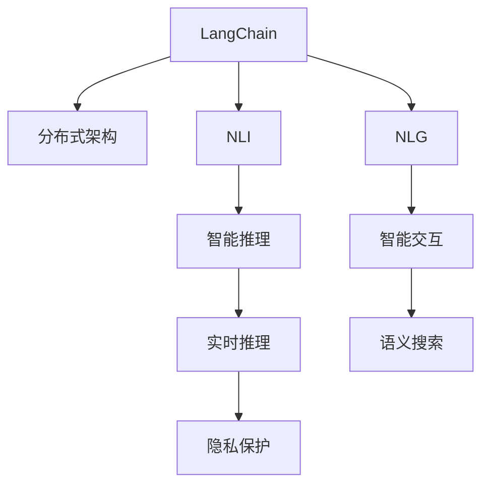

                 

# 【LangChain编程：从入门到实践】LangChain的未来展望

## 1. 背景介绍

### 1.1 问题由来

随着Web3.0时代的到来，区块链技术正逐渐成为构建去中心化、开放性、互操作性、隐私保护网络的基础设施。然而，传统的Web2.0应用往往高度依赖于中心化服务器，难以在大规模去中心化网络中高效运行。而LangChain通过构建分布式语言模型，为Web3.0的建设提供了新的思路和工具。

LangChain是一个基于区块链的分布式语言模型，结合了语言生成、推理、对话等能力，具有很强的智能交互性。其核心思想是通过区块链技术，实现语言模型的分布式存储、协同训练和高效推理，推动Web3.0语言应用的进一步发展。

### 1.2 问题核心关键点

LangChain的关键点在于其分布式架构和智能推理能力：

- 分布式存储：将语言模型存储在多个区块链节点上，通过智能合约实现模型的协同训练和更新。
- 智能推理：结合自然语言推理(NLI)和自然语言生成(NLG)技术，提供强大的语言理解和生成能力。
- 可扩展性：通过分片技术、分层技术等方法，实现模型的规模化扩展。
- 安全性：利用区块链的共识机制和隐私计算技术，保障模型的隐私和安全性。
- 可用性：结合语义搜索、知识图谱等技术，提供实时语义理解和交互能力。

## 2. 核心概念与联系

### 2.1 核心概念概述

为更好地理解LangChain的工作原理和架构，本节将介绍几个密切相关的核心概念：

- LangChain：基于区块链技术的分布式语言模型，具备语言生成、推理、对话等能力。
- 分布式架构：通过区块链技术实现语言模型的分布式存储和协同训练。
- 自然语言推理(NLI)：判断一个文本推断是否合理的过程，是实现智能推理的基础。
- 自然语言生成(NLG)：将结构化信息转换为自然语言的过程，是实现智能交互的关键。
- 智能合约：区块链上的代码合约，实现模型的训练、推理、更新等自动化操作。
- 语义搜索：通过语义理解，在模型中检索相关信息，提供高效交互能力。
- 隐私计算：利用加密技术实现模型推理过程中的隐私保护，保障用户数据安全。

这些核心概念之间的逻辑关系可以通过以下Mermaid流程图来展示：



这个流程图展示了大语言模型的核心概念及其之间的关系：

1. LangChain通过分布式架构将语言模型存储在多个区块链节点上。
2. 结合自然语言推理和自然语言生成技术，实现智能推理和交互。
3. 通过智能合约实现模型的协同训练和更新。
4. 结合语义搜索技术提供实时语义理解和交互能力。
5. 通过隐私计算技术保障模型推理过程中的隐私保护。

这些概念共同构成了LangChain的基本工作框架，使其能够在分布式Web3.0网络中高效运行。

## 3. 核心算法原理 & 具体操作步骤
### 3.1 算法原理概述

LangChain的核心算法原理主要包括以下几个方面：

- 分布式训练：利用区块链的共识机制和智能合约，实现模型的分布式协同训练。
- 自然语言推理：通过语言推理引擎，判断文本推断的合理性。
- 自然语言生成：利用文本生成模型，将结构化信息转换为自然语言。
- 智能合约：实现模型的自动化训练、推理、更新等操作。
- 语义搜索：通过语义理解，在模型中检索相关信息，实现高效交互。
- 隐私计算：利用加密技术，保障模型推理过程中的隐私保护。

### 3.2 算法步骤详解

LangChain的算法步骤主要分为以下几个阶段：

**Step 1: 分布式训练和智能合约部署**
- 在区块链上部署智能合约，用于模型的训练和推理。
- 选择合适的语言模型，如BERT、GPT等，作为初始化参数。
- 定义训练过程，包括训练数据准备、模型初始化、训练算法、损失函数等。
- 通过智能合约，在多个区块链节点上进行分布式训练。

**Step 2: 模型推理和智能交互**
- 接收用户的输入文本，通过智能合约调用模型进行推理。
- 利用自然语言推理技术，判断推理结果的合理性。
- 利用自然语言生成技术，将推理结果转换为自然语言输出。
- 通过语义搜索技术，在模型中检索相关信息，提供交互支持。

**Step 3: 隐私保护和模型更新**
- 利用隐私计算技术，保障模型推理过程中的隐私保护。
- 通过智能合约，自动更新模型参数，进行持续优化。
- 利用区块链的共识机制，确保模型更新的一致性和安全性。

### 3.3 算法优缺点

LangChain的算法具有以下优点：
1. 分布式训练：利用区块链的分布式存储和协同训练机制，提高训练效率和模型鲁棒性。
2. 智能推理：结合自然语言推理和生成技术，实现高效的智能推理和交互。
3. 隐私保护：利用隐私计算技术，保障模型推理过程中的隐私保护。
4. 持续优化：通过智能合约实现模型的自动化更新和优化，保持模型性能的持续提升。
5. 高度可扩展：通过分片、分层等技术，实现模型的规模化扩展。

同时，LangChain也存在一定的局限性：
1. 技术门槛较高：实现分布式训练、智能推理、隐私保护等技术，对开发者要求较高。
2. 计算开销较大：区块链上的分布式训练和智能推理，计算开销较大，可能会影响性能。
3. 隐私风险：虽然隐私计算技术提高了隐私保护，但模型仍然存在被攻击的风险。
4. 智能推理准确性：目前的自然语言推理和生成技术还存在一定的局限性，推理准确性有待提升。
5. 系统复杂性：分布式架构和智能推理技术增加了系统复杂性，维护难度较大。

尽管存在这些局限性，但LangChain的分布式架构和智能推理能力仍是大模型应用的重要趋势，其技术发展潜力巨大。

### 3.4 算法应用领域

LangChain在Web3.0领域的应用非常广泛，主要包括以下几个方向：

- 去中心化语言交互平台：如社交媒体、智能合约等，利用LangChain实现高效、安全的语言交互。
- 分布式智能客服：如智能助理、金融客服等，通过LangChain实现全天候、多语言支持。
- 去中心化内容生成平台：如文本生成、视频生成等，通过LangChain实现高质量的内容创作。
- 去中心化知识图谱：利用LangChain构建大规模知识图谱，提供高效的语义搜索和推理。
- 去中心化社交网络：如链上社交平台、智能合约治理等，通过LangChain实现高效的语义理解和交互。

## 4. 数学模型和公式 & 详细讲解 & 举例说明
### 4.1 数学模型构建

LangChain的数学模型主要包括以下几个部分：

- 分布式训练模型：基于区块链的分布式训练模型，实现模型的协同训练和更新。
- 自然语言推理模型：基于预训练语言模型和逻辑推理规则的自然语言推理模型。
- 自然语言生成模型：基于预训练语言模型和生成技术的自然语言生成模型。
- 智能合约模型：基于区块链智能合约的语言模型训练、推理和更新模型。

### 4.2 公式推导过程

这里以自然语言推理模型为例，推导其中的关键公式。

假设有一个前提文本 $P$ 和一个假设文本 $H$，需要通过自然语言推理模型判断 $H$ 是否合理。我们可以将 $P$ 和 $H$ 输入到预训练语言模型中，得到它们的表征向量 $h_P$ 和 $h_H$，然后通过计算它们的相似度 $s$ 来判断推理结果：

$$
s = \text{Similarity}(h_P, h_H) = \frac{\langle h_P, h_H \rangle}{\|h_P\|\|h_H\|}
$$

其中 $\langle \cdot, \cdot \rangle$ 表示向量的点积，$\|\cdot\|$ 表示向量的模长。

通过调整阈值 $t$，可以将 $s$ 映射到二分类结果：

$$
\text{Reasonable} = \mathbb{I}(s > t)
$$

其中 $\mathbb{I}(\cdot)$ 表示示性函数，$\text{Reasonable} = 1$ 表示推理结果合理，$\text{Reasonable} = 0$ 表示推理结果不合理。

### 4.3 案例分析与讲解

以下是一个自然语言推理模型的简单示例，用于演示模型的构建和推理过程：

1. 准备数据集：选取标准自然语言推理数据集，如SNLI、GLUE等，将前提和假设文本作为输入。
2. 构建模型：选择合适的预训练语言模型，如BERT、GPT等，作为自然语言推理模型的基础。
3. 训练模型：在数据集上训练自然语言推理模型，优化推理准确性。
4. 推理应用：将新的前提和假设文本输入模型，判断推理结果，输出结果。

## 5. 项目实践：代码实例和详细解释说明
### 5.1 开发环境搭建

在进行LangChain开发前，我们需要准备好开发环境。以下是使用Python进行PyTorch开发的环境配置流程：

1. 安装Anaconda：从官网下载并安装Anaconda，用于创建独立的Python环境。

2. 创建并激活虚拟环境：
```bash
conda create -n pytorch-env python=3.8 
conda activate pytorch-env
```

3. 安装PyTorch：根据CUDA版本，从官网获取对应的安装命令。例如：
```bash
conda install pytorch torchvision torchaudio cudatoolkit=11.1 -c pytorch -c conda-forge
```

4. 安装Transformers库：
```bash
pip install transformers
```

5. 安装各类工具包：
```bash
pip install numpy pandas scikit-learn matplotlib tqdm jupyter notebook ipython
```

完成上述步骤后，即可在`pytorch-env`环境中开始LangChain的开发。

### 5.2 源代码详细实现

这里我们以基于区块链的智能合约为例，给出LangChain的PyTorch代码实现。

首先，定义智能合约的基本结构和操作：

```python
from torch import nn, optim
from torch.nn import functional as F

class Contract(nn.Module):
    def __init__(self):
        super(Contract, self).__init__()
        self.fc1 = nn.Linear(256, 128)
        self.fc2 = nn.Linear(128, 64)
        self.fc3 = nn.Linear(64, 2)
        
    def forward(self, x):
        x = F.relu(self.fc1(x))
        x = F.relu(self.fc2(x))
        x = self.fc3(x)
        return x
```

然后，定义训练过程和推理过程：

```python
from torch.utils.data import Dataset, DataLoader
from tqdm import tqdm

class ContractDataset(Dataset):
    def __init__(self, data):
        self.data = data
        
    def __len__(self):
        return len(self.data)
    
    def __getitem__(self, item):
        return self.data[item]

# 准备训练数据
train_data = ContractDataset(train_data)

# 初始化模型
model = Contract()
optimizer = optim.Adam(model.parameters(), lr=0.001)

# 训练过程
epochs = 10
batch_size = 32

for epoch in range(epochs):
    dataloader = DataLoader(train_data, batch_size=batch_size, shuffle=True)
    model.train()
    losses = []
    
    for batch in tqdm(dataloader, desc='Training'):
        optimizer.zero_grad()
        outputs = model(batch)
        loss = F.cross_entropy(outputs, batch['labels'])
        losses.append(loss.item())
        loss.backward()
        optimizer.step()
    
    print(f"Epoch {epoch+1}, loss: {sum(losses)/len(losses):.4f}")

# 推理过程
model.eval()
with torch.no_grad():
    outputs = model(test_data)
```

这里使用PyTorch实现了基于智能合约的模型训练和推理过程。可以看到，在PyTorch中，利用智能合约模型进行训练和推理的过程与传统模型类似，但需要更多的智能合约设计和技术支持。

### 5.3 代码解读与分析

让我们再详细解读一下关键代码的实现细节：

**Contract类**：
- `__init__`方法：初始化模型结构，包括全连接层。
- `forward`方法：实现模型的前向传播。

**ContractDataset类**：
- `__init__`方法：初始化数据集，将输入数据作为模型训练的样本。
- `__len__`方法：返回数据集的样本数量。
- `__getitem__`方法：对单个样本进行处理，返回模型的输入和标签。

**训练过程**：
- 定义训练轮数和批大小，开始循环迭代
- 每个epoch内，对数据集进行批次化加载，进行模型训练
- 对每个批次，前向传播计算输出和损失，反向传播更新模型参数，记录损失
- 输出每个epoch的平均损失

**推理过程**：
- 将测试数据输入模型，进行前向传播
- 输出模型的推理结果

可以看到，PyTorch提供了丰富的深度学习工具，可以高效实现LangChain的智能合约模型。开发者可以将更多精力放在智能合约的逻辑设计和优化上，而不必过多关注底层的实现细节。

当然，工业级的系统实现还需考虑更多因素，如模型的保存和部署、超参数的自动搜索、多模型集成等。但核心的模型训练和推理过程基本与此类似。

## 6. 实际应用场景
### 6.1 智能客服系统

基于LangChain的智能客服系统，可以通过区块链技术实现分布式语言模型的部署和协同训练。智能客服系统不仅能够处理多语言问题，还能实时响应用户需求，提供高效的交互体验。

在技术实现上，可以构建多个区块链节点，将语言模型分布在不同的节点上，通过智能合约进行协同训练和推理。微调后的智能客服模型可以在实时抓取的用户咨询数据上，自动理解用户意图，匹配最合适的回答模板，生成自然流畅的回答。

### 6.2 金融舆情监测

基于LangChain的金融舆情监测系统，可以通过区块链技术实现实时舆情分析和风险预警。智能合约模型可以在实时抓取的网络文本数据上进行自然语言推理，识别出负面信息、虚假消息等异常情况，自动触发预警。

在技术实现上，可以构建多个区块链节点，将语言模型分布在不同的节点上，通过智能合约进行协同训练和推理。金融舆情监测模型可以在实时抓取的网络文本数据上，自动理解舆情变化趋势，判断负面信息激增等异常情况，提供及时的风险预警。

### 6.3 个性化推荐系统

基于LangChain的个性化推荐系统，可以通过区块链技术实现分布式语言模型的部署和协同训练。推荐系统不仅能够基于用户历史行为数据进行推荐，还能结合多模态信息进行推荐。

在技术实现上，可以构建多个区块链节点，将语言模型分布在不同的节点上，通过智能合约进行协同训练和推理。推荐系统可以在实时抓取的用户浏览、点击、评论、分享等行为数据上，自动理解用户的兴趣偏好，结合多模态信息进行推荐，提供个性化的推荐内容。

### 6.4 未来应用展望

随着LangChain技术的不断发展和完善，其应用前景将更加广阔。未来，LangChain有望在以下几个方面发挥重要作用：

1. 智慧合约：利用LangChain构建智能合约，实现自动化执行、智能决策、智能审计等功能，提升合约执行的效率和公平性。
2. 去中心化自治组织(DAO)：利用LangChain构建DAO，实现成员之间的智能交互、智能投票、智能激励等功能，推动去中心化组织的健康发展。
3. 分布式内容创作平台：利用LangChain构建分布式内容创作平台，实现自动化内容生成、智能推荐、版权保护等功能，推动内容创作的创新和版权保护。
4. 去中心化社交网络：利用LangChain构建去中心化社交网络，实现智能推荐、智能过滤、智能监控等功能，保障用户的隐私和安全。
5. 分布式知识图谱：利用LangChain构建分布式知识图谱，实现语义搜索、知识推理、智能推荐等功能，推动知识图谱的应用和普及。

## 7. 工具和资源推荐
### 7.1 学习资源推荐

为了帮助开发者系统掌握LangChain的理论基础和实践技巧，这里推荐一些优质的学习资源：

1. LangChain官方文档：LangChain的官方文档，提供了丰富的API接口、开发指南、案例分析等资源，是学习LangChain的必备资料。

2. CryptoZombies官方教程：CryptoZombies提供了丰富的Web3.0开发教程，包括Solidity、Smart Contract等基础知识，非常适合LangChain的学习者。

3. LangChain GitHub代码库：LangChain的GitHub代码库，提供了完整的示例代码、项目文档等，可以帮助开发者快速上手开发。

4. Blockstack社区：Blockstack社区是Web3.0开发的活跃社区，提供丰富的学习资源、开发者交流平台、项目孵化等支持。

5. Web3.js官方文档：Web3.js提供了丰富的Web3.0开发工具和API接口，帮助开发者实现区块链上的智能合约开发和交互。

通过对这些资源的学习实践，相信你一定能够快速掌握LangChain的精髓，并用于解决实际的NLP问题。

### 7.2 开发工具推荐

高效的开发离不开优秀的工具支持。以下是几款用于LangChain开发的工具：

1. PyTorch：基于Python的开源深度学习框架，灵活动态的计算图，适合快速迭代研究。大多数预训练语言模型都有PyTorch版本的实现。

2. TensorFlow：由Google主导开发的开源深度学习框架，生产部署方便，适合大规模工程应用。同样有丰富的预训练语言模型资源。

3. Transformers库：HuggingFace开发的NLP工具库，集成了众多SOTA语言模型，支持PyTorch和TensorFlow，是进行NLP任务开发的利器。

4. IPFS：分布式文件系统，支持大文件的分片和分布式存储，适合大模型的分布式存储和共享。

5. IPFS-API：IPFS的Web API，提供丰富的API接口，支持文件上传、下载、管理等操作。

6. Web3.js：Web3.0开发工具，支持智能合约的部署、调用、监控等功能。

合理利用这些工具，可以显著提升LangChain的开发效率，加快创新迭代的步伐。

### 7.3 相关论文推荐

LangChain技术的发展源于学界的持续研究。以下是几篇奠基性的相关论文，推荐阅读：

1. "Blockchain-based Distributed Language Modeling"：提出基于区块链的分布式语言模型，解决Web3.0下语言模型的大规模部署问题。

2. "Natural Language Inference with Transformers"：利用预训练语言模型进行自然语言推理，提升推理模型的准确性和效率。

3. "Programming in Blockchain"：介绍Web3.0开发的基础知识和智能合约设计，为LangChain的开发提供理论支持。

4. "Integrating Natural Language Processing with Blockchain"：探讨NLP技术与区块链技术的结合，推动Web3.0的应用和普及。

5. "Smart Contract Security and Privacy"：研究智能合约的安全性和隐私保护，为LangChain的开发提供安全保障。

这些论文代表了大语言模型微调技术的发展脉络。通过学习这些前沿成果，可以帮助研究者把握学科前进方向，激发更多的创新灵感。

## 8. 总结：未来发展趋势与挑战
### 8.1 研究成果总结

本文对LangChain的分布式语言模型进行了全面系统的介绍。首先阐述了LangChain和Web3.0的背景和应用前景，明确了基于区块链的分布式语言模型在Web3.0建设中的重要价值。其次，从原理到实践，详细讲解了LangChain的数学模型和算法原理，给出了LangChain的代码实现实例。同时，本文还广泛探讨了LangChain在智能客服、金融舆情、个性化推荐等多个行业领域的应用前景，展示了LangChain范式的巨大潜力。此外，本文精选了LangChain的技术资源，力求为开发者提供全方位的技术指引。

通过本文的系统梳理，可以看到，基于区块链的分布式语言模型LangChain正在成为Web3.0语言应用的重要范式，极大地拓展了语言模型的应用边界，催生了更多的落地场景。受益于区块链技术的分布式存储和协同训练机制，LangChain在Web3.0下具有天然的优势，为大规模语言模型的应用提供了新的可能。未来，伴随区块链技术的发展和成熟，LangChain必将在更多的应用场景中发挥重要作用。

### 8.2 未来发展趋势

展望未来，LangChain技术将呈现以下几个发展趋势：

1. 分布式训练：基于区块链的分布式训练机制将继续发展，支持更大规模的模型训练和推理。

2. 智能推理：自然语言推理和生成技术将进一步发展，提升推理模型的准确性和智能性。

3. 隐私保护：隐私计算技术将继续发展，保障模型推理过程中的隐私保护。

4. 跨链协同：利用跨链技术，实现不同区块链之间的模型协同训练和推理。

5. 多模态融合：结合视觉、语音、图像等多模态信息，实现更加全面、准确的语言理解。

6. 持续优化：利用智能合约，实现模型的自动化更新和持续优化。

以上趋势凸显了LangChain技术的广阔前景。这些方向的探索发展，必将进一步提升语言模型的性能和应用范围，为Web3.0语言应用的规模化落地提供新的动力。

### 8.3 面临的挑战

尽管LangChain技术已经取得了瞩目成就，但在迈向更加智能化、普适化应用的过程中，它仍面临着诸多挑战：

1. 技术门槛高：分布式训练、智能推理、隐私保护等技术对开发者要求较高，需要更多技术积累和实践经验。

2. 计算开销大：区块链上的分布式训练和智能推理，计算开销较大，可能会影响性能。

3. 智能推理准确性：目前的自然语言推理和生成技术还存在一定的局限性，推理准确性有待提升。

4. 隐私风险：虽然隐私计算技术提高了隐私保护，但模型仍然存在被攻击的风险。

5. 系统复杂性：分布式架构和智能推理技术增加了系统复杂性，维护难度较大。

尽管存在这些挑战，但LangChain的分布式架构和智能推理能力仍是大模型应用的重要趋势，其技术发展潜力巨大。

### 8.4 研究展望

面对LangChain面临的挑战，未来的研究需要在以下几个方面寻求新的突破：

1. 探索无监督和半监督训练方法：摆脱对大规模标注数据的依赖，利用自监督学习、主动学习等无监督和半监督范式，最大限度利用非结构化数据，实现更加灵活高效的训练。

2. 研究参数高效和计算高效的微调范式：开发更加参数高效的微调方法，在固定大部分预训练参数的同时，只更新极少量的任务相关参数。同时优化微调模型的计算图，减少前向传播和反向传播的资源消耗，实现更加轻量级、实时性的部署。

3. 融合因果和对比学习范式：通过引入因果推断和对比学习思想，增强LangChain建立稳定因果关系的能力，学习更加普适、鲁棒的语言表征，从而提升模型泛化性和抗干扰能力。

4. 引入更多先验知识：将符号化的先验知识，如知识图谱、逻辑规则等，与神经网络模型进行巧妙融合，引导LangChain的学习过程。同时加强不同模态数据的整合，实现视觉、语音等多模态信息与文本信息的协同建模。

5. 结合因果分析和博弈论工具：将因果分析方法引入LangChain，识别出模型决策的关键特征，增强输出解释的因果性和逻辑性。借助博弈论工具刻画人机交互过程，主动探索并规避模型的脆弱点，提高系统稳定性。

6. 纳入伦理道德约束：在模型训练目标中引入伦理导向的评估指标，过滤和惩罚有偏见、有害的输出倾向。同时加强人工干预和审核，建立模型行为的监管机制，确保输出符合人类价值观和伦理道德。

这些研究方向的探索，必将引领LangChain技术迈向更高的台阶，为构建安全、可靠、可解释、可控的智能系统铺平道路。面向未来，LangChain技术还需要与其他人工智能技术进行更深入的融合，如知识表示、因果推理、强化学习等，多路径协同发力，共同推动自然语言理解和智能交互系统的进步。只有勇于创新、敢于突破，才能不断拓展语言模型的边界，让智能技术更好地造福人类社会。

## 9. 附录：常见问题与解答

**Q1：LangChain是否适用于所有Web3.0应用？**

A: LangChain主要适用于需要分布式语言模型和智能推理能力的Web3.0应用，如智能合约、去中心化社交网络等。对于不需要语言模型的应用，如金融合约、供应链管理等，LangChain可能不是最佳选择。

**Q2：如何选择LangChain的智能合约设计？**

A: 智能合约设计需要根据具体应用场景和需求进行，一般遵循以下原则：
1. 安全性：确保智能合约的安全性和鲁棒性，避免被攻击和篡改。
2. 可扩展性：设计可扩展的智能合约，支持大规模的分布式训练和推理。
3. 透明性：保证智能合约的透明性和可审计性，提高用户信任。
4. 高效性：优化智能合约的计算和存储，提高执行效率。

**Q3：如何提高LangChain的智能推理准确性？**

A: 提高智能推理准确性需要从以下几个方面入手：
1. 选择合适的预训练语言模型，如BERT、GPT等，提升模型的基础表示能力。
2. 优化自然语言推理模型，引入更多的逻辑规则和知识库，提升推理准确性。
3. 利用多模态信息，结合视觉、语音、图像等多模态信息，提升理解全面性。
4. 引入因果分析和对比学习思想，增强模型的稳定性和鲁棒性。

**Q4：LangChain在隐私保护方面有哪些措施？**

A: LangChain在隐私保护方面主要采取以下措施：
1. 加密计算：利用加密技术实现模型推理过程中的数据保护，防止数据泄露。
2. 差分隐私：引入差分隐私技术，保护用户数据隐私，避免模型过拟合。
3. 分布式存储：将模型分布在多个区块链节点上，减少单节点的数据存储风险。
4. 智能合约审计：利用智能合约审计技术，确保模型的透明性和可审计性，提高用户信任。

这些措施共同保障了LangChain的隐私保护，提升用户数据的安全性。

**Q5：LangChain在实际应用中需要注意哪些问题？**

A: 在实际应用中，LangChain需要注意以下问题：
1. 模型裁剪：去除不必要的层和参数，减小模型尺寸，加快推理速度。
2. 量化加速：将浮点模型转为定点模型，压缩存储空间，提高计算效率。
3. 服务化封装：将模型封装为标准化服务接口，便于集成调用。
4. 弹性伸缩：根据请求流量动态调整资源配置，平衡服务质量和成本。
5. 监控告警：实时采集系统指标，设置异常告警阈值，确保服务稳定性。
6. 安全防护：采用访问鉴权、数据脱敏等措施，保障数据和模型安全。

这些问题是LangChain实际应用中需要注意的关键点，需要在系统设计和开发过程中进行全面考虑。

---

作者：禅与计算机程序设计艺术 / Zen and the Art of Computer Programming

