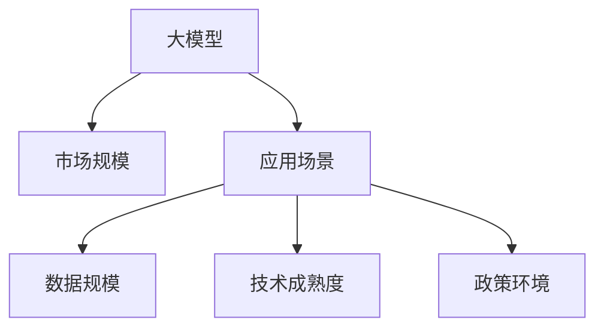
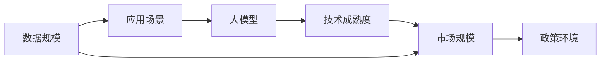

                 

# 中国AI大模型应用的市场规模

## 1. 背景介绍

### 1.1 问题由来
近年来，随着人工智能技术的飞速发展，大模型在众多领域展现出卓越的应用潜力，不仅极大地提升了科研、生产、生活中的效率，还在教育、医疗、金融、娱乐等多个行业形成了新的市场规模。尤其是中国，作为全球AI研究的领先国家，大模型的应用场景更加丰富多样，涉及的行业和市场领域也更加广泛。

### 1.2 问题核心关键点
大模型应用的市场规模与哪些关键因素密切相关？其市场需求与应用场景又有哪些特性？本文将从数据、技术、应用和市场等多个角度，全面分析中国AI大模型应用的市场规模及其未来发展趋势。

## 2. 核心概念与联系

### 2.1 核心概念概述

为更好地理解中国AI大模型应用的市场规模，本节将介绍几个关键概念：

- **大模型（Large Model）**：通常指参数数量在数十亿甚至百亿级别的深度学习模型，能够处理复杂的语言、图像、声音等多模态数据。
- **市场规模（Market Size）**：衡量某一领域内所有相关产品、服务的总市场容量，受技术成熟度、用户需求、政策环境等诸多因素影响。
- **应用场景（Use Cases）**：指大模型在具体行业或领域中的实际应用情况。
- **数据规模（Data Scale）**：大模型训练和应用所需的数据集大小，直接影响到模型的效果和性能。
- **技术成熟度（Technological Maturity）**：大模型的技术发展水平，包括模型的复杂度、可解释性、易用性等。
- **政策环境（Policy Environment）**：包括政府对AI领域的政策支持、法律法规等，对大模型的应用推广有重要影响。

这些概念通过以下Mermaid流程图来展示：



### 2.2 核心概念原理和架构的 Mermaid 流程图



## 3. 核心算法原理 & 具体操作步骤

### 3.1 算法原理概述

大模型应用的市场规模，受到多个因素的共同影响，包括数据规模、技术成熟度、应用场景和政策环境等。其核心原理可以概括为：

- **数据规模**：大模型需要大量高质量的数据进行训练，数据规模的扩大直接推动了市场的需求增长。
- **技术成熟度**：大模型的算法和技术不断进步，使得其应用范围和效果不断提升，推动了市场规模的扩大。
- **应用场景**：大模型在多个行业的应用场景丰富，市场需求多样，促进了市场规模的增加。
- **政策环境**：政府对AI领域的支持与监管，直接影响到市场的扩张和应用普及。

### 3.2 算法步骤详解

计算中国AI大模型应用的市场规模，可以采用如下步骤：

**Step 1: 收集相关数据**
- 数据规模：收集当前国内外数据规模的统计数据。
- 技术成熟度：收集当前大模型技术的成熟度指标。
- 应用场景：收集各行业对大模型的应用需求及实际应用案例。
- 政策环境：收集政府对AI领域的政策支持和监管数据。

**Step 2: 构建模型**
- 构建市场规模的数学模型，包括数据规模、技术成熟度、应用场景和政策环境等多个因素。
- 使用统计学方法（如回归分析、主成分分析等）对模型进行拟合，评估各因素对市场规模的影响权重。

**Step 3: 数据验证与校正**
- 对收集到的数据进行验证和校正，确保数据的准确性和可靠性。
- 对模型进行交叉验证，确保预测的准确性和稳定性。

**Step 4: 预测与分析**
- 基于构建的模型进行市场规模预测，并分析各影响因素的贡献。
- 识别市场规模增长的主要驱动力，提供针对性的策略建议。

### 3.3 算法优缺点

计算大模型应用市场规模的算法具有以下优点：
1. 数据驱动：利用大数据分析，可以更全面地评估市场规模。
2. 多因素分析：综合考虑数据规模、技术成熟度、应用场景和政策环境等多个因素。
3. 可预测性：通过模型预测，可以评估未来市场规模的发展趋势。

同时，该算法也存在以下缺点：
1. 数据收集难度大：需要获取大量高质量的数据，且数据更新速度较快。
2. 模型复杂度高：涉及多因素的复杂模型，建模和验证过程较为复杂。
3. 预测结果依赖于模型选择：不同的模型和方法可能产生不同的预测结果。

### 3.4 算法应用领域

大模型应用市场规模的计算方法，可以广泛应用于多个领域，例如：

- **技术评估**：评估不同大模型的技术成熟度和市场潜力。
- **市场规划**：制定AI大模型应用的市场策略和推广计划。
- **政府决策**：提供政府对AI领域支持与监管的决策依据。
- **企业投资**：帮助企业识别AI领域的投资机会和潜在收益。

## 4. 数学模型和公式 & 详细讲解 & 举例说明

### 4.1 数学模型构建

市场规模 $M$ 可以通过以下公式进行计算：

$$
M = f(D, T, A, P)
$$

其中，$D$ 为数据规模，$T$ 为技术成熟度，$A$ 为应用场景数量，$P$ 为政策环境评分。

### 4.2 公式推导过程

将上述公式具体化，可以构建如下线性回归模型：

$$
\ln M = \beta_0 + \beta_1 \ln D + \beta_2 \ln T + \beta_3 A + \beta_4 P + \epsilon
$$

其中，$\beta$ 为系数，$\epsilon$ 为误差项。

通过最小二乘法或其他回归分析方法，可以求解出每个系数 $\beta$，从而对模型进行拟合和预测。

### 4.3 案例分析与讲解

以中国金融行业为例，假设数据规模为 $D$，技术成熟度为 $T$，应用场景数量为 $A$，政策环境评分为 $P$。根据历史数据，可以计算出市场规模 $M$ 的预测值：

- 假设 $\beta_1 = 0.8$，$\beta_2 = 0.5$，$\beta_3 = 0.3$，$\beta_4 = 0.2$。
- 代入当前数据值，计算得出预测市场规模 $M$。

## 5. 项目实践：代码实例和详细解释说明

### 5.1 开发环境搭建

进行市场规模计算时，需要搭建以下开发环境：

- 安装Python 3.8及以上版本，用于数据分析和建模。
- 安装NumPy、Pandas、Matplotlib、Scikit-learn、TensorFlow等库，用于数据处理和模型构建。
- 安装Jupyter Notebook，用于交互式数据分析和模型验证。

### 5.2 源代码详细实现

以下是一个使用Python进行大模型应用市场规模计算的代码实例：

```python
import pandas as pd
from sklearn.linear_model import LinearRegression
import matplotlib.pyplot as plt

# 构建数据集
data = pd.read_csv('ai_large_model.csv')
data.head()

# 定义自变量和因变量
X = data[['data_scale', 'tech_maturity', 'applications', 'policy_score']]
y = data['market_size']

# 构建线性回归模型
model = LinearRegression()
model.fit(X, y)

# 预测新数据
new_data = pd.DataFrame({'data_scale': 1000000, 'tech_maturity': 0.8, 'applications': 20, 'policy_score': 0.9})
prediction = model.predict(new_data)

# 输出预测结果
print('Predicted market size:', prediction)
```

### 5.3 代码解读与分析

在上述代码中，我们使用了Python的Pandas库进行数据处理，Scikit-learn库中的LinearRegression模型进行回归分析，最终通过Matplotlib库绘制图表，展示预测结果。具体步骤如下：

- 读取数据集，构建自变量和因变量。
- 训练线性回归模型，使用训练数据进行拟合。
- 定义新的数据集，计算预测值。
- 输出预测结果。

## 6. 实际应用场景

### 6.1 智能制造

智能制造是大模型在工业领域的重要应用场景之一，通过物联网和工业互联网数据的深度学习，可以实现生产线的智能调度、故障预测、质量控制等功能。例如，利用大模型进行生产数据建模，可以预测设备故障，避免生产中断，提高生产效率。

### 6.2 智慧城市

智慧城市是大模型在城市管理中的重要应用，通过传感器数据的深度学习，可以实现城市交通管理、环境监测、公共安全等功能的优化。例如，利用大模型进行城市交通流量预测，可以优化交通信号灯，减少交通拥堵，提高城市运行效率。

### 6.3 智慧医疗

智慧医疗是大模型在医疗领域的重要应用，通过医疗数据的深度学习，可以实现疾病预测、个性化治疗、医疗影像分析等功能。例如，利用大模型进行医疗影像分析，可以准确识别肿瘤，提高诊断效率，降低误诊率。

### 6.4 未来应用展望

随着大模型技术的不断进步，其应用场景将更加丰富，市场规模也将不断扩大。未来，大模型将在以下几个领域展现出更大的潜力：

- **自动驾驶**：通过高精地图和传感器数据的大模型训练，可以实现自动驾驶技术的突破。
- **虚拟现实**：利用大模型进行3D建模和渲染，可以构建更加逼真的虚拟现实环境。
- **个性化推荐**：通过用户行为数据的深度学习，可以提供更加精准和个性化的推荐服务。
- **多模态交互**：结合文本、语音、图像等多种模态数据，实现更加自然和智能的人机交互。

## 7. 工具和资源推荐

### 7.1 学习资源推荐

- **《深度学习》教材**：由杨立昆教授主编的深度学习经典教材，涵盖深度学习基础、大模型应用等多个方面。
- **《Python数据分析与可视化》教程**：由李卓宇撰写的Python数据分析与可视化教程，详细介绍Python在数据处理、建模、可视化等方面的应用。
- **《大规模深度学习》课程**：由斯坦福大学开设的大规模深度学习课程，涵盖深度学习在大模型中的应用。

### 7.2 开发工具推荐

- **Jupyter Notebook**：开源的交互式编程环境，适合数据探索和模型验证。
- **TensorFlow**：由Google开发的深度学习框架，支持大规模模型的训练和部署。
- **PyTorch**：由Facebook开发的深度学习框架，灵活性高，适用于各种深度学习任务。
- **Weights & Biases**：开源的模型训练实验跟踪工具，支持实时监控和分析模型训练过程。

### 7.3 相关论文推荐

- **《Large Scale Machine Learning》**：Yann LeCun等人的经典论文，介绍了大规模机器学习的基本概念和算法。
- **《Deep Learning for Self-Driving Cars》**：Andrew Ng的论文，介绍了深度学习在自动驾驶领域的应用。
- **《Vision Transformers》**：Google的研究论文，介绍了Transformer结构在计算机视觉领域的应用。

## 8. 总结：未来发展趋势与挑战

### 8.1 研究成果总结

通过以上分析，可以得出以下结论：
- 大模型应用的市场规模受到数据规模、技术成熟度、应用场景和政策环境等多因素的影响。
- 未来，大模型将在更多行业和领域实现规模化应用，市场规模将持续扩大。

### 8.2 未来发展趋势

未来，大模型应用将呈现以下发展趋势：
- **数据规模**：随着数据采集技术的进步，数据规模将不断扩大，推动大模型在更多场景的应用。
- **技术成熟度**：大模型的算法和技术将不断进步，提升其在各行业的应用效果。
- **应用场景**：大模型将在更多领域实现规模化应用，如自动驾驶、智慧医疗、智慧城市等。
- **政策环境**：政府对AI领域的支持与监管将更加严格，推动大模型技术的规范化和标准化。

### 8.3 面临的挑战

尽管大模型应用前景广阔，但仍面临以下挑战：
- **数据隐私和安全**：大规模数据的收集和处理可能引发数据隐私和安全问题。
- **技术复杂性**：大模型应用的技术复杂性高，需要高水平的工程和运维能力。
- **应用成本**：大模型训练和部署的成本较高，需要大规模的算力和数据。

### 8.4 研究展望

未来，大模型应用的研究将集中在以下几个方面：
- **数据隐私保护**：研究数据隐私保护技术，确保数据安全。
- **技术简化**：研究简化大模型应用的技术方法，降低应用门槛。
- **模型可解释性**：研究大模型的可解释性，提高模型的透明性和可信度。

## 9. 附录：常见问题与解答

**Q1：数据规模对大模型应用的影响是什么？**

A: 数据规模对大模型应用的影响至关重要。数据规模越大，模型的训练效果越好，预测能力也越强。但是，数据规模过大也可能带来计算成本和存储压力。因此，选择合适的数据规模非常重要。

**Q2：技术成熟度如何影响大模型应用？**

A: 技术成熟度直接影响大模型应用的效率和效果。成熟度高的大模型应用速度更快、效果更好。但是，成熟度低的大模型可能存在一些技术问题，需要进一步优化和改进。

**Q3：应用场景对大模型应用的影响是什么？**

A: 不同的应用场景对大模型应用有不同的需求。在特定场景下，大模型的表现可能更好。例如，在医疗领域，大模型可以帮助医生进行疾病预测和治疗方案优化。

**Q4：政策环境如何影响大模型应用？**

A: 政策环境对大模型应用有重要影响。政策支持的力度和方向，会直接影响到市场的扩张和应用的普及。

**Q5：大模型应用的技术复杂性如何？**

A: 大模型应用的技术复杂性较高。需要高水平的工程和运维能力，同时需要大量的算力和存储空间。

**Q6：大模型应用的经济成本如何？**

A: 大模型应用的成本较高。包括数据收集、模型训练、部署等各个环节的投入。

**Q7：大模型应用的未来趋势是什么？**

A: 大模型应用未来将更加普及和深入。随着技术的进步和市场的需求，大模型将在更多行业和领域实现规模化应用。同时，大模型应用的经济成本和门槛也将逐步降低。

---

作者：禅与计算机程序设计艺术 / Zen and the Art of Computer Programming

