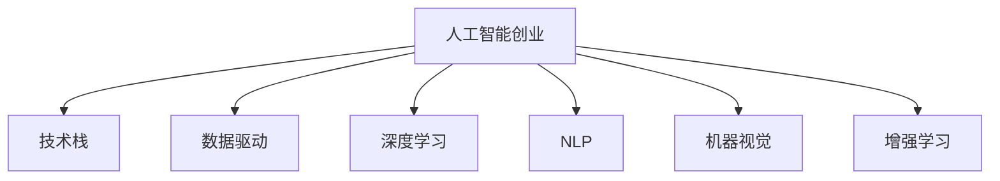

                 

# 人工智能创业：成功的秘诀

在当今这个数字化、信息化的时代，人工智能(AI)已经成为了科技创新的重要驱动力。从商业化应用到创业项目，AI正在渗透到各行各业，带来颠覆性的变革。然而，AI创业并不简单，它需要创业者在技术、市场、管理、资源等多个维度进行综合平衡。本文将从技术、市场、管理和资源四个角度，深入探讨AI创业成功的秘诀。

## 1. 背景介绍

### 1.1 人工智能的定义和应用
人工智能是指利用计算机技术，使机器能够模拟人类智能行为。其应用范围非常广泛，从简单的语音识别、图像处理，到复杂的自然语言处理、机器人控制，甚至自动驾驶、金融风险预测等领域。AI技术的不断进步，使得越来越多的企业和创业公司能够利用其解决现实问题，推动业务创新。

### 1.2 人工智能创业的兴起
随着AI技术的成熟和普及，越来越多的创业者和投资者开始关注AI领域。从Google DeepMind、OpenAI等顶级AI公司，到国内外众多创业企业，AI创业正在成为科技创业的重要方向。AI技术不仅可以带来全新的产品和服务，还可以提升企业运营效率，降低成本，具有广阔的市场前景。

## 2. 核心概念与联系

### 2.1 核心概念概述

为了更好地理解AI创业的成功秘诀，本节将介绍几个关键的概念：

- 人工智能创业：利用AI技术开发新产品、新服务的创业活动。
- 技术栈：构建AI项目所需的技术框架和工具链。
- 数据驱动：基于大数据分析、机器学习模型等，实现业务决策和优化。
- 深度学习：一种基于神经网络模型的机器学习方法，广泛应用于AI领域。
- 自然语言处理(NLP)：使机器能够理解和处理人类语言的技术。
- 机器视觉：使机器能够识别和分析图像、视频等视觉信息的技术。
- 增强学习：一种通过与环境互动来优化决策策略的学习方法。

这些核心概念之间存在紧密的联系，共同构成了AI创业的基础框架。理解这些概念，有助于我们把握AI创业的核心要素，从而在实际操作中取得成功。

### 2.2 核心概念原理和架构的 Mermaid 流程图



这个流程图展示了人工智能创业中的关键概念及其相互关系。创业公司通过构建技术栈，利用数据驱动和深度学习等技术，开发NLP、机器视觉等AI应用，并引入增强学习等前沿方法，实现智能化决策。

## 3. 核心算法原理 & 具体操作步骤

### 3.1 算法原理概述

人工智能创业成功的核心在于算法和技术的创新应用。本节将介绍几种常见的AI算法和操作步骤。

### 3.2 算法步骤详解

AI创业的算法步骤可以分为数据准备、模型训练、模型优化、部署和维护五个阶段：

1. **数据准备**：收集、清洗和标注数据，建立数据集。数据质量直接影响模型的准确性，因此需要投入大量时间和资源进行数据预处理。

2. **模型训练**：选择适当的模型架构，使用训练数据进行模型训练。常见的方法包括卷积神经网络(CNN)、循环神经网络(RNN)、深度神经网络(DNN)等。

3. **模型优化**：在训练过程中，通过调整超参数、使用正则化技术等方法，优化模型性能。常见的优化算法包括梯度下降、Adam等。

4. **部署和维护**：将训练好的模型部署到实际应用中，并持续监控和优化模型性能。

### 3.3 算法优缺点

- **优点**：
  - 快速迭代：通过快速原型开发和模型训练，可以迅速验证创业构想。
  - 高准确性：深度学习和强化学习等技术，可以提升模型的准确性和鲁棒性。
  - 广泛应用：AI技术可以应用于多个领域，推动业务创新。

- **缺点**：
  - 高成本：构建高质量数据集和训练大规模模型需要大量资金投入。
  - 技术复杂：AI算法和模型复杂度较高，需要专业人才进行开发和维护。
  - 数据隐私：使用数据驱动技术，需考虑数据隐私和安全问题。

### 3.4 算法应用领域

AI创业技术的应用领域非常广泛，以下是几个典型的应用场景：

- **医疗健康**：AI可以通过图像分析、自然语言处理等技术，辅助诊断疾病、提供个性化治疗方案。
- **金融服务**：AI可以用于风险预测、客户服务、交易策略等，提升金融服务的效率和准确性。
- **智能制造**：AI可以通过机器视觉、自然语言处理等技术，优化生产流程、提高产品质量。
- **自动驾驶**：AI可以用于感知环境、决策规划等，实现自动驾驶汽车。
- **教育培训**：AI可以用于智能推荐、个性化学习、自动化评估等，提升教育培训效果。

## 4. 数学模型和公式 & 详细讲解

### 4.1 数学模型构建

本节将介绍几个常见的数学模型和公式，以便更好地理解和应用AI技术。

### 4.2 公式推导过程

以卷积神经网络(CNN)为例，介绍其基本结构和训练过程。

#### 4.2.1 CNN基本结构

卷积神经网络由卷积层、池化层、全连接层组成。其基本结构如下图所示：

```
             +-------------------+
             |                   |
             |    卷积层         |
             |                   |
             +-------------------+
             |                   |
             |   池化层         |
             |                   |
             +-------------------+
             |                   |
             | 全连接层         |
             |                   |
             +-------------------+
```

卷积层通过卷积操作提取特征，池化层通过降采样操作减小特征图大小，全连接层通过分类器输出最终结果。

#### 4.2.2 CNN训练过程

CNN的训练过程包括前向传播和反向传播两个阶段。以二分类任务为例，CNN的训练过程如下：

1. 前向传播：
   $$
   y = h(Wx + b)
   $$
   其中，$y$为输出，$h$为激活函数，$W$和$b$为可训练参数。

2. 反向传播：
   $$
   \frac{\partial L}{\partial W} = \frac{\partial L}{\partial y} \frac{\partial y}{\partial h} \frac{\partial h}{\partial W}
   $$
   其中，$L$为损失函数，$\frac{\partial L}{\partial y}$为输出对损失函数的导数，$\frac{\partial y}{\partial h}$为激活函数对输出的导数，$\frac{\partial h}{\partial W}$为激活函数对权重$W$的导数。

### 4.3 案例分析与讲解

以图像分类任务为例，介绍如何使用CNN进行模型训练和优化。

1. 数据准备：收集大量带有标注的图像数据，进行数据清洗和预处理。
2. 模型训练：选择合适的CNN架构，使用训练数据进行模型训练。
3. 模型优化：调整学习率、批大小、正则化等超参数，优化模型性能。
4. 部署和维护：将训练好的模型部署到实际应用中，并持续监控和优化模型性能。

## 5. 项目实践：代码实例和详细解释说明

### 5.1 开发环境搭建

在进行AI项目开发前，需要搭建一个适合开发的环境。以下是几个常用的开发工具：

- **Python**：Python是AI开发的主流语言，拥有丰富的科学计算库和工具。
- **Jupyter Notebook**：交互式笔记本，便于进行数据可视化、代码调试等。
- **TensorFlow**：由Google开发的深度学习框架，支持多种硬件加速。
- **PyTorch**：由Facebook开发的深度学习框架，易于使用，支持动态计算图。

### 5.2 源代码详细实现

以下是一个简单的图像分类项目的Python代码实现。

```python
import tensorflow as tf
from tensorflow import keras

# 加载数据集
(x_train, y_train), (x_test, y_test) = keras.datasets.mnist.load_data()

# 数据预处理
x_train = x_train.reshape(-1, 28*28).astype('float32') / 255.0
x_test = x_test.reshape(-1, 28*28).astype('float32') / 255.0

# 构建模型
model = keras.Sequential([
    keras.layers.Dense(256, activation='relu'),
    keras.layers.Dense(10, activation='softmax')
])

# 编译模型
model.compile(optimizer='adam',
              loss='sparse_categorical_crossentropy',
              metrics=['accuracy'])

# 训练模型
model.fit(x_train, y_train, epochs=10, batch_size=64)

# 评估模型
model.evaluate(x_test, y_test)
```

### 5.3 代码解读与分析

以上代码实现了一个简单的图像分类项目，包括以下几个关键步骤：

1. 加载数据集：使用Keras的`load_data`方法加载MNIST数据集。
2. 数据预处理：将图像数据进行归一化处理，转换为模型输入格式。
3. 构建模型：使用Keras的Sequential模型构建神经网络，包括两个全连接层。
4. 编译模型：使用Adam优化器、交叉熵损失函数和准确率评估指标。
5. 训练模型：使用训练数据进行模型训练，设置10个epoch和64个batch。
6. 评估模型：使用测试数据评估模型性能。

## 6. 实际应用场景

### 6.1 医疗健康

AI在医疗健康领域的应用非常广泛，可以用于疾病诊断、个性化治疗、医疗影像分析等。例如，谷歌的DeepMind开发的AlphaGo，可以通过深度学习和增强学习技术，提升围棋水平，甚至在围棋比赛中战胜人类顶尖选手。

### 6.2 金融服务

AI可以用于金融风险预测、客户服务、交易策略等。例如，JP摩根开发的量子计算引擎，通过深度学习和强化学习技术，提升了金融市场的预测精度。

### 6.3 智能制造

AI可以通过机器视觉、自然语言处理等技术，优化生产流程、提高产品质量。例如，西门子通过AI技术，实现了自动化生产线的优化，提高了生产效率。

### 6.4 自动驾驶

AI可以用于感知环境、决策规划等，实现自动驾驶汽车。例如，特斯拉的自动驾驶技术，通过深度学习和计算机视觉技术，提升了驾驶安全性和舒适性。

### 6.5 教育培训

AI可以用于智能推荐、个性化学习、自动化评估等，提升教育培训效果。例如，Coursera通过AI技术，实现了智能推荐系统，提升了用户的学习体验。

## 7. 工具和资源推荐

### 7.1 学习资源推荐

为了帮助开发者系统掌握AI创业的理论基础和实践技巧，以下是几个优质的学习资源：

1. **《深度学习》（Ian Goodfellow）**：深度学习领域的经典教材，涵盖深度学习的基本概念和原理。
2. **Kaggle竞赛平台**：Kaggle提供了大量的数据集和竞赛项目，可以帮助开发者练习数据处理和模型训练技能。
3. **Google AI博客**：Google AI官方博客，涵盖了最新的AI技术和应用案例，是了解AI前沿的重要途径。
4. **ArXiv论文库**：全球最大的学术论文库，包含大量深度学习和AI研究的最新论文。
5. **Coursera课程**：Coursera提供了多个AI相关课程，涵盖从入门到高级的深度学习知识。

### 7.2 开发工具推荐

- **TensorFlow**：由Google开发的深度学习框架，支持多种硬件加速，易于使用。
- **PyTorch**：由Facebook开发的深度学习框架，易于使用，支持动态计算图。
- **Jupyter Notebook**：交互式笔记本，便于进行数据可视化、代码调试等。
- **Scikit-learn**：Python的机器学习库，提供了多种常用的机器学习算法和工具。

### 7.3 相关论文推荐

以下是几篇奠基性的AI相关论文，推荐阅读：

1. **ImageNet Classification with Deep Convolutional Neural Networks**（AlexNet论文）：提出AlexNet模型，开启了深度学习在图像分类领域的革命。
2. **Deep Residual Learning for Image Recognition**（ResNet论文）：提出ResNet模型，解决了深度神经网络中的梯度消失问题。
3. **Attention is All You Need**（Transformer论文）：提出Transformer模型，开启了预训练大模型的时代。
4. **A Survey of Recent Advances in Generative Adversarial Networks**（GANs论文）：介绍生成对抗网络(GANs)技术，在图像生成和风格转换等领域有重要应用。
5. **AlphaGo Zero**：介绍AlphaGo Zero，通过深度学习和增强学习技术，实现了自监督学习和零样本学习的突破。

## 8. 总结：未来发展趋势与挑战

### 8.1 研究成果总结

本节将对AI创业的核心技术和方法进行总结，以便更好地理解未来的发展趋势和挑战。

### 8.2 未来发展趋势

未来，AI技术将在更多的领域得到应用，成为推动科技进步和产业升级的重要驱动力。以下是几个主要的发展趋势：

1. **多模态学习**：未来的AI系统将不仅仅处理单一模态数据，而是能够同时处理图像、语音、文本等多种模态数据，实现跨模态学习和融合。
2. **联邦学习**：联邦学习技术通过在本地设备上进行模型训练，保护用户隐私，提高模型泛化性。
3. **自监督学习**：自监督学习技术可以在无需标注数据的情况下，进行模型训练，解决数据标注成本高的问题。
4. **强化学习**：强化学习技术可以实现智能决策和优化，广泛应用于机器人控制、自动驾驶等领域。
5. **知识图谱**：知识图谱技术可以构建领域知识库，提升AI系统的推理能力和知识整合能力。

### 8.3 面临的挑战

尽管AI技术在许多领域取得了显著进展，但仍然面临一些挑战：

1. **数据隐私和安全**：使用数据驱动技术，需考虑数据隐私和安全问题。
2. **算法透明性和可解释性**：AI算法的决策过程通常缺乏可解释性，难以对其推理逻辑进行分析和调试。
3. **模型偏见和公平性**：AI模型可能会学习到有偏见的数据，导致决策不公平。
4. **计算资源限制**：大规模深度学习模型需要大量计算资源，提高计算效率是一个重要研究方向。
5. **跨领域知识整合**：将知识图谱、逻辑规则等专家知识与AI模型进行融合，实现更加全面、准确的信息整合能力。

### 8.4 研究展望

未来，AI创业需要进一步解决这些挑战，才能实现更广泛的应用。以下是几个重要的研究方向：

1. **隐私保护技术**：开发隐私保护算法和机制，保护用户隐私。
2. **可解释性算法**：开发可解释性算法，增强AI模型的透明性和可解释性。
3. **公平性算法**：开发公平性算法，消除模型偏见，提升决策的公平性。
4. **资源优化技术**：开发高效的计算资源优化技术，降低模型训练和推理成本。
5. **跨领域知识整合**：将知识图谱、逻辑规则等专家知识与AI模型进行融合，提升系统的综合能力。

## 9. 附录：常见问题与解答

### Q1: AI创业需要哪些核心技术？

A: AI创业需要以下核心技术：

1. 数据处理和标注技术：数据清洗、预处理和标注是构建高质量数据集的基础。
2. 深度学习和神经网络技术：构建复杂的神经网络模型，进行特征提取和分类。
3. 强化学习和增强学习技术：优化决策策略，提升模型性能。
4. 自然语言处理技术：使机器能够理解和处理人类语言，提升系统的自然交互能力。

### Q2: 如何选择合适的AI模型？

A: 选择AI模型需要考虑以下因素：

1. 任务类型：不同的任务类型需要不同的模型。例如，图像分类适合卷积神经网络，文本分类适合循环神经网络。
2. 数据规模：数据规模较大的任务适合使用深度学习模型，数据规模较小的任务适合使用浅层模型。
3. 计算资源：计算资源丰富的环境适合使用大规模深度学习模型，计算资源受限的环境适合使用轻量级模型。
4. 性能要求：对于高性能要求的任务，需要使用复杂的模型和优化算法，对于实时性要求较高的任务，需要选择轻量级模型和优化技术。

### Q3: 如何评估AI模型的性能？

A: 评估AI模型性能可以从以下几个方面进行：

1. 准确率：计算模型在测试集上的分类准确率，评估模型分类能力。
2. 召回率：计算模型在测试集上的召回率，评估模型检测能力。
3. F1分数：综合考虑准确率和召回率，评估模型整体性能。
4. 混淆矩阵：通过混淆矩阵分析模型的分类错误类型，评估模型决策能力。
5. ROC曲线：通过绘制ROC曲线，评估模型在不同阈值下的分类性能。

### Q4: 如何优化AI模型的性能？

A: 优化AI模型性能可以从以下几个方面进行：

1. 数据预处理：对数据进行归一化、标准化、数据增强等预处理，提升数据质量。
2. 模型调参：调整模型的超参数，如学习率、批大小、正则化等，优化模型性能。
3. 模型结构优化：使用模型压缩、稀疏化等技术，减小模型尺寸，提高计算效率。
4. 模型融合：通过集成多个模型的预测结果，提升模型性能。
5. 迁移学习：利用预训练模型，在小规模数据集上进行微调，提升模型泛化能力。

### Q5: AI创业有哪些成功案例？

A: 以下是几个成功的AI创业案例：

1. OpenAI：OpenAI开发了GPT、DALL-E等先进的AI模型，广泛应用于自然语言处理、图像生成等领域。
2. Google DeepMind：DeepMind开发了AlphaGo、AlphaZero等AI模型，在围棋、星际争霸等游戏中取得了突破性成果。
3. Tesla：Tesla通过AI技术，实现了自动驾驶汽车，提升了驾驶安全性和舒适性。
4. Amazon Rekognition：Amazon开发了图像识别服务Rekognition，广泛应用于人脸识别、物体检测等领域。
5. TensorFlow：Google开发了深度学习框架TensorFlow，广泛应用于学术研究、商业应用等领域。

---

作者：禅与计算机程序设计艺术 / Zen and the Art of Computer Programming

