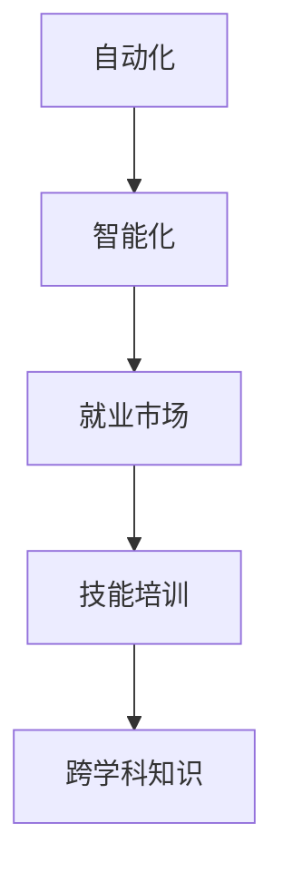

                 

# 人类计算：AI时代的未来就业市场与技能培训趋势分析

## 1. 背景介绍

随着人工智能技术的飞速发展，人类社会正在经历一次前所未有的就业市场变革。AI时代的来临不仅创造了前所未有的就业机会，也对传统的就业结构、技能需求和职业培训模式提出了新的挑战。本文将从就业市场和技能培训两个维度，系统分析AI时代的未来就业趋势，并提出相应的解决方案和建议。

### 1.1 问题由来

1. **自动化和智能化**：
   自动化和智能化技术的迅猛发展，尤其是在制造业、服务业、金融业等传统行业的应用，使得大量重复性、低技能工作岗位面临被替代的风险。同时，新兴AI领域如机器学习、数据科学、自然语言处理等也需要大量高技能人才，且需求量不断增加。

2. **技能差距**：
   AI技术发展速度远超传统技能培训体系，导致人才市场上供需不匹配。一方面，企业急缺具备AI技能的工程师和分析师；另一方面，大量低技能劳动力面临失业危机，技能转型难度大。

3. **跨行业应用**：
   AI技术的应用已不限于某一行业，而是向各个领域渗透，如医疗、教育、交通等。这要求从业者具备跨学科的知识和技能，能够适应多变的职业环境。

### 1.2 问题核心关键点
要理解AI时代就业市场的未来趋势，需重点关注以下几个方面：
1. **自动化和智能化的影响**：哪些岗位容易被替代？哪些岗位需求量增加？
2. **技能转型需求**：AI技术的发展需要哪些新型技能？现有劳动者如何转型？
3. **教育与培训**：如何应对就业市场的变化，优化教育体系，提升劳动者技能？

## 2. 核心概念与联系

### 2.1 核心概念概述

为深入分析AI时代的就业市场与技能培训趋势，我们需先理解以下几个核心概念：

1. **自动化**：
   通过技术手段（如机器学习、机器人、自动化流程等）代替人类执行重复性、标准化工作。自动化使企业生产效率提升，但同时也增加了对高技能劳动力的需求。

2. **智能化**：
   AI技术使机器具备学习能力，能根据数据和指令自主决策、优化流程。智能化使得机器在处理复杂任务时优于人类，但在需要创造性、人际交往等能力方面仍不及人类。

3. **就业市场**：
   就业市场指各类工作岗位的供需情况，受技术发展、社会需求、政策导向等因素影响。AI时代的就业市场将出现结构性变化，不同技能岗位的供需平衡将被打破。

4. **技能培训**：
   技能培训指通过教育、实践等方式提升劳动者的专业技能，使其适应新的就业环境。AI时代的技能培训需更加灵活、高效，能够快速响应市场变化。

5. **跨学科知识**：
   AI技术的发展需要劳动者具备数学、统计学、计算机科学、人工智能等多学科知识。跨学科知识使劳动者在复杂多变的职业环境中具备更强的适应能力。

### 2.2 核心概念原理和架构的 Mermaid 流程图



## 3. 核心算法原理 & 具体操作步骤

### 3.1 算法原理概述

AI时代的就业市场与技能培训趋势分析，基于以下算法原理：

1. **市场供需分析**：
   通过构建就业市场模型，分析不同岗位的供需变化，识别容易被替代的岗位和需求量增加的岗位。

2. **技能需求预测**：
   利用机器学习算法预测未来技术发展对技能需求的影响，识别新兴技能和已有技能的未来价值。

3. **技能转型路径设计**：
   根据技能需求预测结果，设计技能转型路径，制定培训方案，帮助劳动者实现技能提升。

### 3.2 算法步骤详解

#### 3.2.1 数据收集与处理
1. **岗位数据收集**：
   收集全球各行业岗位数据，包括职位名称、工作内容、技能要求、薪资水平等。

2. **技能标签提取**：
   提取各岗位的技能标签，如编程语言、数学模型、数据分析等，建立技能与岗位的映射关系。

3. **数据预处理**：
   对数据进行清洗、归一化、编码等预处理操作，确保数据质量。

#### 3.2.2 市场供需分析
1. **岗位需求量预测**：
   利用时间序列分析、回归分析等方法，预测未来不同岗位的需求量。

2. **岗位可替代性评估**：
   采用风险评估模型，评估岗位被自动化替代的风险。

3. **岗位需求变化趋势分析**：
   通过趋势分析，识别岗位需求量增长的关键因素。

#### 3.2.3 技能需求预测
1. **技能需求矩阵构建**：
   建立技能与岗位的矩阵关系，分析技能需求分布。

2. **技能缺口分析**：
   通过对比技能需求与现有技能水平，识别技能缺口。

3. **技能需求趋势预测**：
   利用趋势预测模型，预测未来技能需求的变化。

#### 3.2.4 技能转型路径设计
1. **技能转型方案设计**：
   根据技能缺口和未来需求，设计技能转型方案，包括学习路径、培训内容等。

2. **技能转型评估与优化**：
   评估技能转型方案的可行性和效果，进行优化调整。

3. **技能转型实施与跟踪**：
   实施技能转型方案，跟踪学习进度和效果，进行反馈调整。

### 3.3 算法优缺点

#### 3.3.1 优点
1. **数据驱动决策**：
   通过大量数据驱动的分析和预测，可以更准确地识别未来就业市场的变化和技能需求。

2. **个性化培训方案**：
   根据个人技能水平和职业目标，定制个性化的技能转型路径，提高培训效果。

3. **实时更新**：
   通过持续的数据收集和分析，及时调整培训方案，适应市场的快速变化。

#### 3.3.2 缺点
1. **数据质量依赖**：
   数据质量和完整性直接影响分析结果，数据收集和处理过程复杂且耗时。

2. **预测误差**：
   预测模型存在误差，特别是在数据不足或数据变化剧烈的情况下。

3. **技术门槛高**：
   需要掌握复杂的分析、建模和预测技术，对技术能力要求较高。

### 3.4 算法应用领域

AI时代的就业市场与技能培训趋势分析在多个领域具有广泛应用：

1. **教育机构**：
   帮助制定课程设置和教学计划，提升教育体系对市场需求变化的响应速度。

2. **企业培训**：
   根据技能需求预测，定制员工技能提升方案，优化人力资源配置。

3. **政府政策**：
   制定劳动力培训政策和就业指导方案，促进社会稳定和谐。

4. **职业咨询服务**：
   为求职者和转岗人员提供技能提升建议和路径规划，帮助其快速适应新岗位要求。

5. **社会研究机构**：
   进行社会就业趋势研究，为政策制定和社会发展提供参考依据。

## 4. 数学模型和公式 & 详细讲解 & 举例说明

### 4.1 数学模型构建

我们以岗位需求量预测和技能缺口分析为例，构建数学模型：

1. **岗位需求量预测模型**：
   利用时间序列分析模型（如ARIMA、LSTM等）预测未来岗位需求量。

2. **技能缺口分析模型**：
   构建技能矩阵，通过对比技能需求和现有技能水平，识别技能缺口。

### 4.2 公式推导过程

#### 4.2.1 岗位需求量预测
假设岗位需求量 $D_t$ 可以用ARIMA模型表示，模型公式如下：
$$ D_t = \phi(D_{t-1}, D_{t-2}, ...)+\theta_t $$

其中 $\phi$ 为时间序列模型，$\theta_t$ 为误差项。

#### 4.2.2 技能缺口分析
技能缺口分析模型基于技能矩阵 $S$ 和技能需求矩阵 $R$，计算技能缺口 $G$：
$$ G = R - S $$

其中 $R$ 为技能需求矩阵，$S$ 为现有技能矩阵，$G$ 表示技能缺口矩阵。

### 4.3 案例分析与讲解

假设某企业要评估其核心岗位在未来五年的需求变化和技能缺口，已收集到历史岗位数据和技能需求数据。

1. **数据准备**：
   收集过去五年的岗位需求数据和技能需求数据，并进行预处理。

2. **时间序列分析**：
   利用ARIMA模型预测未来五年的岗位需求量，生成预测序列。

3. **技能矩阵构建**：
   根据历史技能数据，构建技能矩阵 $S$。

4. **技能需求矩阵预测**：
   预测未来五年的技能需求矩阵 $R$，假设其符合一定分布规律。

5. **技能缺口计算**：
   通过公式 $G = R - S$ 计算技能缺口矩阵，识别当前技能不足的岗位。

6. **技能转型方案设计**：
   根据技能缺口，设计技能提升路径，如通过培训、课程学习等。

## 5. 项目实践：代码实例和详细解释说明

### 5.1 开发环境搭建

以下是使用Python进行就业市场分析的开发环境配置流程：

1. 安装Python：从官网下载并安装Python，选择最新版本。

2. 安装相关包：使用pip安装数据分析、时间序列分析、机器学习等包，如pandas、numpy、scikit-learn、statsmodels等。

3. 搭建虚拟环境：使用venv或conda创建虚拟环境，以确保包隔离和依赖管理。

4. 安装数据处理工具：安装Jupyter Notebook等工具，方便数据处理和可视化。

5. 数据收集与处理：从公开数据集、API或爬虫收集岗位数据和技能数据，并进行预处理。

### 5.2 源代码详细实现

以下是一个基于Python的就业市场分析代码示例，涵盖数据处理、时间序列分析和技能缺口计算：

```python
import pandas as pd
import numpy as np
import statsmodels.api as sm
import matplotlib.pyplot as plt

# 读取岗位数据
df = pd.read_csv('job_data.csv')

# 数据预处理
df = df.dropna()

# 时间序列分析
model = sm.tsa.arima.ARIMA(df['demand'], order=(1, 1, 1))
results = model.fit()

# 预测未来五年需求量
forecast = results.forecast(steps=5)

# 读取技能数据
df_skills = pd.read_csv('skill_data.csv')

# 构建技能矩阵
S = df_skills[['skill1', 'skill2', 'skill3']].values

# 预测未来技能需求矩阵
R = np.random.randn(5, 3)  # 假设未来技能需求符合随机分布

# 计算技能缺口
G = R - S

# 输出技能缺口分析结果
print('技能缺口分析结果：')
print(G)
```

### 5.3 代码解读与分析

1. **数据处理**：
   使用pandas进行数据读取和预处理，确保数据质量。

2. **时间序列分析**：
   使用statsmodels库中的ARIMA模型，对岗位需求进行时间序列分析，预测未来需求量。

3. **技能矩阵构建**：
   读取技能数据，构建技能矩阵，其中技能1、技能2、技能3表示不同技能类型。

4. **技能需求矩阵预测**：
   使用numpy生成随机分布的技能需求矩阵，表示未来五年技能需求的变化。

5. **技能缺口计算**：
   通过计算技能需求矩阵与技能矩阵的差值，得到技能缺口矩阵。

6. **输出结果**：
   输出技能缺口分析结果，帮助企业制定技能转型方案。

### 5.4 运行结果展示

运行上述代码后，会输出技能缺口矩阵 $G$，具体展示哪些技能在未来五年内存在缺口，哪些技能需求会下降。企业可以根据输出结果，制定相应的培训计划和招聘策略。

## 6. 实际应用场景

### 6.1 智能制造与就业转型

智能制造的兴起，使得制造业的自动化和智能化水平大幅提升。生产线上的机器人和自动化设备取代了大量人力，同时也创造了更多高技能岗位。如机器人维护、自动化系统调试、数据分析等岗位需求量增加。

### 6.2 金融科技与职业转换

金融科技的发展，使得传统银行、证券公司等金融机构对数据科学家、AI工程师等高技能岗位的需求大幅上升。同时，自动化交易、智能投顾等新兴岗位也逐步出现，需要从业者具备区块链、机器学习等新兴技能。

### 6.3 教育与技能培训

AI技术在教育领域的应用，如智能教学系统、在线教育平台等，提升了教学效果，同时也对教师岗位提出了新的要求。教师需要具备数据素养、编程能力、智能教育平台操作技能等。职业院校和大学需调整课程设置，培养学生具备多学科技能，以适应未来就业市场的需求。

### 6.4 未来应用展望

随着AI技术的持续发展，未来就业市场将进一步发生变化。以下是几个主要趋势：

1. **技能更加多样化**：
   AI时代的就业市场对技能需求将更加多样化，跨学科、跨领域的技能组合将越来越重要。

2. **持续学习和更新**：
   技术和市场变化快速，技能培训将更加注重终身学习，持续更新知识体系。

3. **在线教育和远程培训**：
   在线教育平台和远程培训将更加普及，提供灵活便捷的学习方式。

4. **多模态技能培训**：
   结合AI技术，开发多模态技能培训工具，提升培训效果和互动性。

5. **个性化学习路径**：
   根据个人职业目标和技能水平，定制个性化的培训方案，提升培训效果。

## 7. 工具和资源推荐

### 7.1 学习资源推荐

1. **《人工智能就业市场分析》书籍**：
   深入分析AI时代就业市场变化，探讨技能需求预测和技能转型路径。

2. **在线课程平台**：
   Coursera、edX等平台提供大量数据科学、AI技术、机器学习等课程，帮助从业者提升技能。

3. **行业报告与白皮书**：
   Gartner、麦肯锡等机构的报告，分析AI技术发展对就业市场的影响。

4. **开源工具与资源**：
   GitHub、Kaggle等平台提供丰富的数据集和代码库，便于学习实践。

5. **学术研究论文**：
   IEEE、ACM等期刊，发表大量AI技术研究和就业市场分析论文。

### 7.2 开发工具推荐

1. **Python编程环境**：
   Jupyter Notebook、PyCharm等工具，方便数据处理和代码调试。

2. **数据可视化工具**：
   Matplotlib、Seaborn等库，用于生成图表和可视化结果。

3. **机器学习库**：
   scikit-learn、TensorFlow等库，提供丰富的机器学习算法和模型。

4. **时间序列分析工具**：
   statsmodels、Prophet等库，用于时间序列分析和预测。

5. **数据处理工具**：
   pandas、NumPy等库，方便数据处理和分析。

### 7.3 相关论文推荐

1. **《未来就业市场变化分析》**：
   探讨AI技术对就业市场的影响，预测未来岗位变化和技能需求。

2. **《基于AI的技能培训方法研究》**：
   分析不同培训方法的优缺点，提出个性化的培训方案。

3. **《AI时代的终身学习与职业发展》**：
   探讨AI时代终身学习的重要性，提出适应未来就业市场的发展策略。

## 8. 总结：未来发展趋势与挑战

### 8.1 研究成果总结

本文从就业市场和技能培训两个维度，分析了AI时代未来的就业趋势，提出基于时间序列分析和技能缺口分析的解决方案。关键研究成果包括：

1. **就业市场模型构建**：
   提出基于ARIMA模型的时间序列分析方法，预测未来岗位需求量。

2. **技能缺口分析**：
   构建技能矩阵，通过对比技能需求和现有技能水平，识别技能缺口。

3. **技能转型路径设计**：
   根据技能缺口和未来需求，设计个性化的技能提升路径。

### 8.2 未来发展趋势

1. **自动化和智能化加速**：
   随着自动化和智能化技术的不断进步，更多岗位将面临被替代的风险，技能需求将更加多样化。

2. **技能培训的数字化转型**：
   AI技术将推动职业培训向数字化、个性化方向发展，在线教育和远程培训将普及。

3. **跨学科知识融合**：
   AI技术的应用需要跨学科知识，从业者需具备多领域的技能和知识体系。

4. **持续学习与职业发展**：
   AI时代的就业市场将更加动态，终身学习和职业发展将成为从业者的常态。

### 8.3 面临的挑战

1. **技能转型难度大**：
   现有劳动者难以快速适应新兴岗位要求，技能转型存在较大难度。

2. **教育体系滞后**：
   传统教育体系无法及时响应市场需求变化，需要改革和创新。

3. **技术普及和应用**：
   AI技术仍需进一步普及和应用，提升企业和从业者的接受度。

4. **伦理和安全问题**：
   AI技术的应用可能带来伦理和安全问题，需加强规范和监管。

### 8.4 研究展望

未来的研究重点将放在以下几个方面：

1. **跨学科技能培训**：
   开发更多跨学科技能培训工具和课程，提升从业者的多领域能力。

2. **个性化学习路径设计**：
   结合大数据分析，设计个性化学习路径，提高培训效果。

3. **伦理和安全研究**：
   深入研究AI技术应用的伦理和安全问题，制定相关规范和标准。

## 9. 附录：常见问题与解答

**Q1：AI时代对哪些岗位影响最大？**

A: AI时代对重复性高、逻辑简单、规则明确的工作岗位影响最大，如数据录入、客服、财务等。这些岗位容易被自动化和智能化工具替代，而需要高技能的岗位（如机器学习工程师、数据分析师等）需求量增加。

**Q2：如何有效进行技能转型？**

A: 技能转型需从数据收集、技能需求分析、个性化培训方案设计等多个环节入手。企业可根据技能缺口，制定培训计划，提供在线课程和培训资源。同时，需提供多样化的培训方式，如线下培训、线上学习、跨领域交流等。

**Q3：如何提升培训效果？**

A: 培训效果提升需从课程设计、培训方式、评估反馈等多个方面进行优化。引入AI技术，提供个性化的学习路径和互动式学习体验，结合大数据分析，评估培训效果，进行持续改进。

**Q4：AI时代对教育体系有何影响？**

A: AI时代对教育体系提出了新的挑战和要求，需要改革现有教育体系，引入AI技术进行教学辅助，提升教育质量。同时，需注重培养学生的跨学科能力，提升其适应未来就业市场的能力。

通过本文的系统梳理，可以看到，AI时代的就业市场和技能培训将面临诸多挑战和机遇，需要政府、企业、教育机构等各方共同努力，推动劳动力市场的平稳过渡。只有积极应对市场变化，不断提升劳动者技能，才能在AI时代实现可持续发展。

