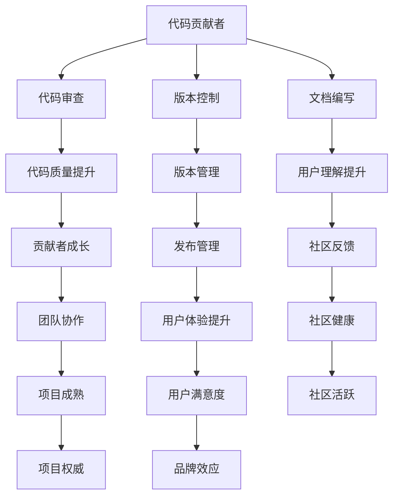

                 

## 1. 背景介绍

### 1.1 问题由来
随着开源社区的兴起，越来越多的开发者不再局限于个人的代码实现，转而投身于开源项目的建设和维护。开源项目作为技术创新的主要驱动力之一，吸引了大量有志之士贡献代码、文档和设计，共同推动技术演进和产业应用。然而，将代码贡献者转变为开源项目的维护者，需要跨越多种角色和技能边界。本文将从代码贡献者的视角出发，探讨成为开源项目维护者的转变过程，以及在这一转变中所需具备的核心能力。

### 1.2 问题核心关键点
开源项目维护者与代码贡献者之间最大的区别在于对代码库和社区的贡献深度。维护者不仅需要撰写代码，还需负责代码质量控制、社区管理、版本发布等多个环节。本文将围绕以下几个核心关键点展开讨论：

- 代码质量与审查：如何确保代码质量和规范符合项目标准。
- 社区建设与沟通：如何建立和维护一个健康、积极的社区氛围。
- 版本管理与发布：如何高效、有序地管理项目版本，发布新版本。
- 文档编写与维护：如何撰写和维护清晰、易懂的文档，助力社区成员理解和协作。

## 2. 核心概念与联系

### 2.1 核心概念概述

为更好地理解从代码贡献者到开源项目维护者的转变过程，本节将介绍几个关键概念：

- 代码贡献者(Contributor)：在开源项目中编写代码、修复bug或优化性能的个人或团队。
- 开源项目(Maintainer)：负责开源项目日常维护、管理及推广的个人或团队。
- 代码审查(Code Review)：维护者对代码贡献者的代码进行检查和评审，以确保代码质量符合项目标准。
- 版本控制(Version Control)：如Git等工具，用于管理和跟踪项目版本变化。
- 文档编写(Documentation)：包括代码文档、用户指南、设计文档等，用于帮助开发者和用户理解和使用项目。

这些概念之间的逻辑关系可以通过以下Mermaid流程图来展示：



这个流程图展示了代码贡献者到开源项目维护者转变的关键步骤和目标：

1. 贡献者通过代码审查提高自身代码质量。
2. 贡献者通过版本控制学习项目管理和版本发布。
3. 贡献者通过文档编写提升项目可读性和用户体验。
4. 贡献者通过与维护者的互动提升社区健康和用户满意度。
5. 贡献者通过团队协作推动项目成熟和权威性建设。

## 3. 核心算法原理 & 具体操作步骤
### 3.1 算法原理概述

开源项目的维护涉及多方面的技术和管理任务，其中关键算法包括代码审查和版本控制。

### 3.2 算法步骤详解

#### 3.2.1 代码审查

代码审查是开源项目维护的重要环节，其核心算法如下：

1. 准备阶段：熟悉项目规范和代码库结构，查阅相关代码文档。
2. 审查阶段：逐行审阅代码，关注代码质量、风格和效率。
3. 反馈阶段：与贡献者沟通，提供改进建议，帮助其提升代码质量。
4. 合并阶段：根据审查结果，决定是否合并代码，并提交合并请求。

#### 3.2.2 版本控制

版本控制是管理项目版本的重要工具，其核心算法如下：

1. 分支管理：创建和管理项目分支，便于不同任务或功能的开发和测试。
2. 合并策略：定义代码合并策略，确保合并后的代码稳定可靠。
3. 标签和发布：管理项目标签和发布版本，记录重要里程碑和变更历史。
4. 版本回滚：在发现严重问题时，快速回滚到之前稳定的版本。

### 3.3 算法优缺点

开源项目维护涉及的技术和管理任务繁多，其算法也有对应的优缺点：

#### 优点：

- 标准化代码质量：通过代码审查，确保代码符合项目标准。
- 系统化版本管理：借助版本控制工具，可轻松管理项目变更和发布。
- 透明化开发过程：通过Git等版本控制工具，代码审查和版本发布过程透明化，便于追踪和协作。
- 提高用户满意度：清晰、易懂的文档提升用户和社区成员对项目的理解和使用体验。

#### 缺点：

- 工作量较大：代码审查和版本管理需要投入大量时间和精力。
- 冲突管理复杂：多贡献者协作时，版本冲突和代码冲突难以避免。
- 知识水平要求高：需要具备代码质量控制、版本管理、文档编写等多方面的技能。

### 3.4 算法应用领域

开源项目维护的算法和技术在各种开发环境中都有广泛应用，例如：

- 企业软件系统：通过版本控制和代码审查，确保系统稳定性和代码质量。
- 游戏开发：通过分支管理和版本发布，协调多个开发团队的协作。
- 数据科学项目：通过版本控制和文档编写，促进数据集和模型的共享和复用。
- 教育平台：通过代码审查和文档编写，提高学习资源的可读性和可维护性。
- 开源社区：通过版本控制和文档编写，建立和维护社区生态，推动项目发展。

## 4. 数学模型和公式 & 详细讲解 & 举例说明（备注：数学公式请使用latex格式，latex嵌入文中独立段落使用 $$，段落内使用 $)
### 4.1 数学模型构建

为了更好地理解代码审查和版本控制的核心算法，我们引入几个数学模型和公式进行详细讲解。

#### 4.1.1 代码审查模型

设代码库中某模块共有 $n$ 行代码，第 $i$ 行的代码质量为 $q_i$，第 $i$ 行的审查难度为 $r_i$。代码审查模型的目标是最大化总代码质量 $Q$ 和总审查难度 $R$ 的平衡。其数学模型如下：

$$
\max Q - R
$$

其中 $Q = \sum_{i=1}^{n} q_i$，$R = \sum_{i=1}^{n} r_i$。

#### 4.1.2 版本控制模型

设项目版本 $v_t$ 有 $m$ 个分支，每个分支的代码贡献为 $c_i$。版本控制模型的目标是最大化项目的稳定性和更新频率，最小化分支冲突。其数学模型如下：

$$
\max \sum_{i=1}^{m} c_i - \sum_{i=1}^{m} \text{conflict}_i
$$

其中 $\text{conflict}_i$ 表示第 $i$ 个分支与主分支冲突的次数。

### 4.2 公式推导过程

#### 4.2.1 代码审查模型推导

根据上述模型，我们需要最大化 $Q - R$。考虑单行代码的优化，设 $q_i$ 和 $r_i$ 均为正数，且满足 $q_i \leq 1$ 和 $r_i \leq 1$。为了简化计算，我们引入拉格朗日乘子 $\lambda$ 和 $\mu$，构造拉格朗日函数：

$$
\mathcal{L}(Q, R, \lambda, \mu) = Q - R - \lambda(Q - 1) - \mu(R - 1)
$$

对 $Q$ 和 $R$ 求偏导，并令其为0，得：

$$
\frac{\partial \mathcal{L}}{\partial Q} = 1 - \lambda = 0, \quad \frac{\partial \mathcal{L}}{\partial R} = -1 - \mu = 0
$$

解得 $\lambda = 1$ 和 $\mu = -1$，代入拉格朗日函数，得：

$$
Q - R = 1 - (-1) = 2
$$

因此，为了最大化总代码质量 $Q$ 和总审查难度 $R$ 的平衡，每行代码的代码质量 $q_i$ 应尽量接近1，审查难度 $r_i$ 应尽量接近0。

#### 4.2.2 版本控制模型推导

考虑版本控制的优化，设 $c_i$ 和 $\text{conflict}_i$ 均为正数，且满足 $c_i \geq 0$ 和 $\text{conflict}_i \geq 0$。为了简化计算，我们引入拉格朗日乘子 $\alpha$ 和 $\beta$，构造拉格朗日函数：

$$
\mathcal{L}(c_i, \text{conflict}_i, \alpha, \beta) = \sum_{i=1}^{m} c_i - \sum_{i=1}^{m} \text{conflict}_i - \alpha \left(\sum_{i=1}^{m} c_i - \text{total} \right) - \beta \left(\sum_{i=1}^{m} \text{conflict}_i - \text{total} \right)
$$

其中 $\text{total}$ 表示项目总代码贡献，$\text{conflict}$ 表示项目总分支冲突次数。

对 $c_i$ 和 $\text{conflict}_i$ 求偏导，并令其为0，得：

$$
\frac{\partial \mathcal{L}}{\partial c_i} = 1 - \alpha = 0, \quad \frac{\partial \mathcal{L}}{\partial \text{conflict}_i} = -1 - \beta = 0
$$

解得 $\alpha = 1$ 和 $\beta = -1$，代入拉格朗日函数，得：

$$
\sum_{i=1}^{m} c_i - \sum_{i=1}^{m} \text{conflict}_i = \text{total} - \text{total} = 0
$$

因此，为了最大化项目的稳定性和更新频率，最小化分支冲突，每个分支的代码贡献 $c_i$ 应尽量接近项目总代码贡献，分支冲突 $\text{conflict}_i$ 应尽量接近0。

### 4.3 案例分析与讲解

#### 案例1：Google的Open Source项目

Google作为开源社区的积极贡献者和维护者，其Open Source项目管理实践值得借鉴。例如，GitHub上活跃的TensorFlow项目，通过版本控制工具Git管理项目版本，使用Git Flow分支管理模型，确保了代码审查和版本发布的规范性和一致性。同时，TensorFlow项目拥有完善的文档系统，包括代码注释、用户指南和开发文档，助力社区成员高效协作。

#### 案例2：Apache基金会

Apache基金会是开源社区的另一个典型代表，其管理实践涵盖了代码贡献、版本控制、文档编写等多个方面。Apache基金会通过Airflow等项目，展示了如何利用开源社区的力量，推动技术创新和产业应用。Airflow通过清晰的项目文档和代码审查，吸引了大量开发者贡献代码和改进项目。

## 5. 项目实践：代码实例和详细解释说明
### 5.1 开发环境搭建

为了更好地进行开源项目维护实践，首先需要搭建开发环境。以下是使用Git和Jenkins实现版本控制和持续集成(CI)的环境配置流程：

1. 安装Git：从官网下载并安装Git，并设置用户信息。
```bash
git --version
git init
git config --global user.name "Your Name"
git config --global user.email "your.email@example.com"
```

2. 安装Jenkins：从官网下载并安装Jenkins，并配置系统环境。
```bash
sudo apt-get update
sudo apt-get install jenkins
sudo service jenkins restart
```

3. 配置Jenkins：完成Jenkins的初次安装后，需要通过Web界面进行配置，包括安装必要的插件，配置Maven或Gradle等构建工具，以及设置项目管理权限等。

4. 添加项目：在Jenkins界面，创建新的项目，并选择构建工具和构建步骤。例如，配置Jenkins Pipeline，实现自动化构建、测试和部署。

### 5.2 源代码详细实现

接下来，以TensorFlow项目为例，展示如何在Git和Jenkins上实现代码审查和版本控制。

1. 创建Git仓库：在GitHub上创建新的项目仓库，并在本地克隆。
```bash
git clone https://github.com/tensorflow/tensorflow.git
cd tensorflow
```

2. 设置Git分支：定义项目的分支策略，如`main`分支用于长期维护，`development`分支用于新功能开发。
```bash
git checkout -b main
git checkout -b development
```

3. 代码贡献与审查：在`development`分支上进行新功能的开发，通过Git提交代码。
```bash
git add .
git commit -m "Add new feature"
git push origin development
```

4. 合并分支：在`main`分支上进行代码合并，进行必要的测试和审查。
```bash
git checkout main
git merge development
git push origin main
```

5. 版本控制与发布：利用Jenkins自动构建和部署项目，并发布新版本。
```bash
# Jenkins Pipeline配置
pipeline {
    agent { label 'ubuntu1404' }

    stages {
        stage('Build') {
            steps {
                withGit('https://github.com/tensorflow/tensorflow.git', 'master') {
                    sh 'git pull'
                    sh 'make -j8'
                }
            }
        }
        stage('Test') {
            steps {
                sh 'python2 test.py'
            }
        }
        stage('Deploy') {
            steps {
                sh 'echo "Deploying latest version"'
                sh 'git tag -a v1.0.0 -m "First version"'
                sh 'git push origin v1.0.0'
            }
        }
    }
}
```

### 5.3 代码解读与分析

在上述代码实例中，Git和Jenkins共同构成了开源项目版本控制和持续集成的基础框架。Git负责版本管理和代码审查，Jenkins负责自动化构建、测试和部署。两者紧密结合，确保了项目的高效管理和持续迭代。

**Git的代码管理**：
- `git add .` 添加所有修改到暂存区。
- `git commit -m "Add new feature"` 提交修改到本地仓库。
- `git push origin development` 推送修改到远程仓库。

**Jenkins的持续集成**：
- 通过Jenkins Pipeline定义构建步骤，包括Git拉取、构建测试、部署发布等环节。
- 利用`withGit`和`sh`命令实现构建和部署的自动化。
- 在`test.py`文件中编写测试用例，确保代码质量。

通过这些步骤，代码贡献者可以高效地进行代码审查和版本管理，而维护者则可以通过Jenkins实现自动化的持续集成和部署，确保项目稳定性和可靠性。

## 6. 实际应用场景

### 6.1 企业软件系统

企业软件系统在开源项目维护中也有广泛应用。以Red Hat的企业级开源项目为例，其版本控制和代码审查实践值得借鉴。Red Hat通过OpenShift和RHEL等项目，展示了如何利用开源社区的力量，推动软件系统的持续演进和产业应用。

### 6.2 数据科学项目

数据科学项目中，开源项目维护也非常重要。以Scikit-learn项目为例，通过Git和Jenkins，实现了数据集和算法的持续集成和自动化测试，确保了项目的高质量和稳定发布。

### 6.3 游戏开发

游戏开发中，开源项目维护同样不可或缺。以Unity项目为例，通过Git和Jenkins，实现了多人协作开发和版本控制，保证了游戏的持续更新和稳定发布。

## 7. 工具和资源推荐
### 7.1 学习资源推荐

为了帮助开发者系统掌握开源项目维护的技术基础和实践技巧，这里推荐一些优质的学习资源：

1. "Version Control with Git"（官网：https://git-scm.com/book/en/v2）：Git官方文档，提供全面的Git使用教程。
2. "Jenkins: The Definitive Guide"（官网：https://www.jenkins.io/doc/）：Jenkins官方文档，提供Jenkins的详细配置和使用指南。
3. "The Zen of GitHub"（官网：https://medium.com/github-education/the-zen-of-github-30b225c405f0）：GitHub官方博客，分享Git和GitHub的最佳实践。
4. "Continuous Integration and Deployment: Tools and Best Practices"（官网：https://www.atlassian.com/blog/continuous-integration-and-deployment）：Atlassian博客，介绍CI/CD工具和最佳实践。
5. "GitHub Handbook"（官网：https://docs.github.com/en/github）：GitHub官方手册，提供Git和GitHub的详细文档和使用指南。

通过对这些资源的学习实践，相信你一定能够快速掌握开源项目维护的精髓，并用于解决实际的开发问题。

### 7.2 开发工具推荐

高效的开发离不开优秀的工具支持。以下是几款用于开源项目维护的常用工具：

1. Git：分布式版本控制系统，广泛用于代码管理。
2. Jenkins：开源的持续集成和持续部署工具，支持多种构建工具和插件。
3. GitHub：全球最大的代码托管平台，支持开源项目管理和协作。
4. Docker：容器化技术，简化部署和管理。
5. Kubernetes：容器编排工具，实现多服务的高效管理和扩展。

合理利用这些工具，可以显著提升开源项目维护的开发效率，加快创新迭代的步伐。

### 7.3 相关论文推荐

开源项目维护涉及多方面的技术和管理任务，其研究也吸引了大量学者的关注。以下是几篇奠基性的相关论文，推荐阅读：

1. "A Survey of Code Review in Open Source"（DOI：10.1145/3233861.3233910）：综述了开源项目中的代码审查实践，探讨了代码审查的效果和改进建议。
2. "Automated Software Testing"（DOI：10.1145/343351.344167）：介绍了自动化测试工具和最佳实践，强调了代码质量控制的重要性。
3. "Practical Jenkins: The Book"（DOI：978-1-492-01305-1）：介绍Jenkins的详细配置和使用，提供了丰富的实践案例和代码示例。
4. "Version Control for Large Software Development Teams"（DOI：10.1145/2095771.2095780）：探讨了版本控制工具在大型软件开发中的应用，提供了多案例分析。
5. "The State of Open Source Cloud"（DOI：10.1016/j.jcs.2018.10.002）：介绍了开源云平台的最新进展，提供了多技术栈的最佳实践。

这些论文代表了开源项目维护技术的发展脉络。通过学习这些前沿成果，可以帮助研究者把握学科前进方向，激发更多的创新灵感。

## 8. 总结：未来发展趋势与挑战

### 8.1 总结

本文从代码贡献者的视角出发，探讨了成为开源项目维护者的转变过程，介绍了代码审查和版本控制的核心算法，并给出了实践案例和代码实例。通过对开源项目维护的深入分析和系统梳理，展示了这一转变的关键步骤和目标。

通过本文的系统梳理，可以看到，从代码贡献者到开源项目维护者的转变，不仅需要技术和工具的支撑，更需要管理和沟通能力的提升。这一转变过程既是对个人能力的全面挑战，也是对团队协作和社区建设的深刻思考。

### 8.2 未来发展趋势

展望未来，开源项目维护将呈现以下几个发展趋势：

1. 自动化工具普及：随着工具的成熟，更多任务将通过自动化工具完成，提高开发效率和代码质量。
2. 持续集成和持续部署(CI/CD)成为标配：通过自动化构建和部署，确保项目稳定性和更新频率。
3. 社区管理和参与度提升：通过更好的沟通和管理，提升社区参与度，促进项目健康发展。
4. 开源与商业结合：开源项目将更多地与商业应用结合，推动产业应用和技术创新。
5. 多语言支持与跨平台协作：支持多种编程语言和平台，实现跨团队、跨地域的协作。

这些趋势凸显了开源项目维护技术的广阔前景。这些方向的探索发展，必将进一步提升开源项目的质量、效率和影响力，为技术社区和产业应用带来更多价值。

### 8.3 面临的挑战

尽管开源项目维护技术已经取得了显著成就，但在迈向更加智能化、普适化应用的过程中，仍面临诸多挑战：

1. 协作复杂度：开源项目中多贡献者协作时，版本冲突和代码冲突难以避免。
2. 项目管理困难：随着项目规模的扩大，版本管理和代码审查的工作量急剧增加。
3. 社区维护难度：维持一个健康、积极的社区氛围需要大量时间和精力。
4. 技术更新快速：开源项目需要持续更新以跟进技术进展，这对维护者提出了更高的要求。
5. 知识水平差距：贡献者和维护者之间的知识水平差异，影响项目的整体质量。

### 8.4 研究展望

面对开源项目维护所面临的挑战，未来的研究需要在以下几个方面寻求新的突破：

1. 自动化技术优化：开发更加高效、精确的自动化工具，如静态代码分析、自动化测试等。
2. 社区治理改进：建立更加透明、有效的社区治理机制，提升社区成员的参与度和贡献度。
3. 持续集成和持续部署(CI/CD)优化：提升CI/CD工具的性能和可定制性，实现更加灵活和高效的自动化构建和部署。
4. 知识共享平台：建立知识共享和协作平台，促进开源项目中知识和技术的传播和交流。
5. 跨平台和跨语言协作：推动开源项目支持多种编程语言和平台，实现跨团队、跨地域的协作。

这些研究方向的探索，必将引领开源项目维护技术迈向更高的台阶，为开源社区和产业应用带来更多价值。面向未来，开源项目维护需要开发者、贡献者、维护者和社区成员共同努力，携手推动技术进步和社会应用。

## 9. 附录：常见问题与解答

**Q1：开源项目维护需要哪些基本技能？**

A: 开源项目维护需要具备以下基本技能：
- 版本控制：熟悉Git等版本控制工具的使用。
- 代码审查：掌握代码质量控制和审查技巧。
- 项目管理：了解项目管理和版本发布的基本流程。
- 文档编写：能够撰写清晰、易懂的代码和用户文档。
- 社区沟通：具备良好的沟通技巧，能够维护社区健康氛围。

**Q2：开源项目维护中代码审查的目的是什么？**

A: 代码审查的目的是：
- 提高代码质量：确保代码符合项目标准，减少错误和缺陷。
- 增强团队协作：通过审查反馈，促进团队协作和知识共享。
- 保障代码稳定性：通过持续审查，确保代码稳定性和可维护性。

**Q3：开源项目维护中版本控制的重要性是什么？**

A: 版本控制的重要性在于：
- 历史追踪：记录代码的变更历史，便于版本回滚和问题定位。
- 协作管理：多贡献者协作时，通过版本控制确保代码同步和版本一致。
- 发布管理：版本控制是版本发布的基础，确保发布过程规范化和透明化。

**Q4：如何进行有效的代码审查？**

A: 有效的代码审查包括以下步骤：
- 熟悉项目规范：了解项目代码风格和质量要求。
- 逐行审查代码：关注代码质量、风格和效率，发现潜在问题。
- 提供改进建议：与贡献者沟通，提出具体的改进建议。
- 合并代码：根据审查结果，决定是否合并代码，并提交合并请求。

**Q5：如何在开源项目中实现持续集成和持续部署？**

A: 实现持续集成和持续部署的主要步骤包括：
- 配置Jenkins：安装并配置Jenkins，选择构建工具和构建步骤。
- 自动化构建：通过Pipeline定义构建步骤，包括代码拉取、构建测试等。
- 自动化部署：在构建完成后，自动部署新版本，确保稳定发布。
- 监控反馈：实时监控构建和部署过程，收集反馈，优化流程。

通过这些步骤，开源项目可以实现高效的持续集成和持续部署，确保项目的高质量和稳定发布。

