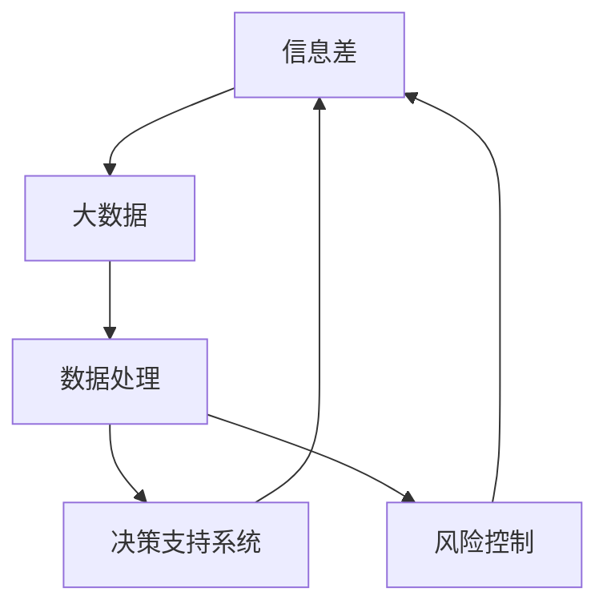

                 

# 信息差的商业运营优化：大数据如何提升运营效率

在大数据时代，企业面临着海量信息的冲击，如何从复杂多变的信息中提取有价值的洞见，是提升商业运营效率的关键。本文将深入探讨信息差的商业运营优化，分析大数据如何在信息处理、决策支持、风险控制等方面提升企业运营效率。

## 1. 背景介绍

### 1.1 问题由来

在互联网+时代，企业经营活动的数字化程度不断提高，数据成为企业决策的基础。然而，海量数据的存在不仅带来了信息丰富的机会，也带来了信息冗余和信息噪声的挑战。数据过于庞杂，既耗时又费力，决策者容易陷入信息海洋，而忽视真正的“信息差”，即与决策相关的关键信息。

### 1.2 问题核心关键点

信息差是指在数据海洋中，与决策相关且高价值的信息。传统数据处理方式往往无法有效利用信息差，导致信息过载或信息匮乏。信息差的识别和利用是提升商业运营效率的关键，尤其在数据驱动型企业的运营管理中显得尤为重要。

## 2. 核心概念与联系

### 2.1 核心概念概述

为更好地理解大数据在商业运营优化中的应用，本节将介绍几个关键概念及其相互联系：

- **信息差（Information Gap）**：与决策相关且高价值的信息，通常涉及客户行为、市场趋势、竞争对手动向等关键内容。

- **大数据（Big Data）**：指规模庞大、结构多样、速度快速、价值密度低的数据集。大数据通过先进的数据处理技术，挖掘和利用信息差，实现运营优化的目标。

- **数据处理（Data Processing）**：对大数据进行清洗、预处理、分析、可视化的过程，通常涉及数据抽取、转换、加载（ETL）、数据仓库、数据挖掘、机器学习等技术。

- **决策支持系统（Decision Support System, DSS）**：利用大数据和AI技术辅助决策者制定决策方案的系统，常见的有数据报表、数据可视化、预测模型等。

- **风险控制（Risk Control）**：通过大数据技术进行实时监控和预警，识别和防范运营风险，如欺诈检测、信用评估等。

这些概念之间的逻辑关系可以通过以下Mermaid流程图来展示：



这个流程图展示了信息差、大数据、数据处理、决策支持系统和风险控制之间的逻辑关系：

1. 信息差是商业运营优化的核心，大数据提供了信息差的获取和处理手段。
2. 数据处理技术对大数据进行加工和分析，形成决策支持系统所需的信息差。
3. 决策支持系统利用信息差辅助企业制定决策。
4. 风险控制系统通过实时监控信息差，及时识别和防范运营风险。

## 3. 核心算法原理 & 具体操作步骤

### 3.1 算法原理概述

大数据在商业运营优化中的应用，主要依赖于数据处理和机器学习技术，其核心算法原理包括以下几个方面：

- **数据清洗与预处理**：通过清洗和转换，减少数据噪声，提升数据质量。
- **特征工程**：根据业务需求，提取、构造和选择有价值的数据特征。
- **统计分析与建模**：通过统计分析和机器学习建模，挖掘数据中的潜在规律和模式。
- **可视化**：将分析结果可视化，帮助决策者更直观地理解和应用信息差。

### 3.2 算法步骤详解

基于大数据的商业运营优化，通常包括以下几个关键步骤：

**Step 1: 数据采集与整合**

- **数据源选择**：根据业务需求，选择合适的数据源，如客户交易数据、市场调研数据、社交媒体数据等。
- **数据整合**：将来自不同源的数据进行整合，确保数据一致性和完整性。

**Step 2: 数据清洗与预处理**

- **数据清洗**：去除重复、缺失、异常数据，减少噪声影响。
- **数据转换**：将数据转换为适合分析的格式，如时间序列、分类变量等。

**Step 3: 特征工程**

- **特征提取**：从清洗后的数据中提取有价值的信息特征，如用户行为特征、市场趋势特征等。
- **特征构造**：利用数据挖掘技术构造新的特征，如用户兴趣、消费能力等。
- **特征选择**：选择最相关的特征，减少维度，提升分析效率。

**Step 4: 统计分析与建模**

- **描述性统计**：对数据进行基本统计分析，如均值、方差、相关性等。
- **探索性数据分析**：利用可视化工具，对数据进行探索性分析，发现数据中的趋势和模式。
- **预测建模**：构建预测模型，如线性回归、逻辑回归、决策树等，预测未来趋势和结果。

**Step 5: 决策支持与风险控制**

- **决策支持**：利用分析结果，辅助决策者制定运营策略，如客户细分、市场预测、库存管理等。
- **风险控制**：构建风险预警模型，实时监控运营风险，如欺诈检测、信用评估等。

### 3.3 算法优缺点

大数据在商业运营优化中的应用具有以下优点：

- **信息丰富**：大数据提供了海量信息，便于全面分析，帮助识别和利用信息差。
- **预测准确**：通过预测建模，可以准确预测未来趋势，提升决策准确性。
- **实时监控**：实时监控和预警系统，及时识别和防范运营风险。

但同时也存在一些缺点：

- **数据隐私**：处理海量数据时，容易侵犯用户隐私，需注意数据合规和隐私保护。
- **数据质量**：数据清洗和预处理环节复杂，需投入大量资源和精力。
- **模型复杂**：构建和维护复杂模型，需具备较强的技术能力和数据素养。

### 3.4 算法应用领域

大数据技术广泛应用于商业运营的各个环节，包括但不限于以下领域：

- **客户细分**：通过大数据分析客户行为和需求，进行细分，实施个性化营销策略。
- **市场预测**：利用大数据分析市场趋势和消费者行为，预测未来市场变化。
- **库存管理**：通过大数据分析预测需求，优化库存水平，减少库存成本。
- **销售预测**：通过历史销售数据和市场环境，预测未来销售趋势，指导生产计划和市场策略。
- **风险控制**：利用大数据实时监控和预警，识别和防范金融欺诈、信用风险等。
- **运营效率提升**：利用大数据分析生产流程，优化供应链管理，提升整体运营效率。

## 4. 数学模型和公式 & 详细讲解 & 举例说明

### 4.1 数学模型构建

在商业运营优化中，常用的一些数学模型包括：

- **线性回归模型**：用于预测连续型数值，如销售量预测。模型形式为：
$$ y = \beta_0 + \beta_1 x_1 + \beta_2 x_2 + \cdots + \beta_n x_n + \epsilon $$

- **决策树模型**：用于分类和回归问题，如客户流失预测。模型形式为：
$$ y = \begin{cases}
1 & \text{if } x_1 \leq \text{thresh}_1 \text{ and } x_2 \leq \text{thresh}_2 \\
\cdots \\
0 & \text{otherwise}
\end{cases} $$

- **时间序列模型**：用于分析时间相关的数据，如销售时间序列预测。模型形式为：
$$ y_t = \alpha + \beta t + \gamma x_t + \delta y_{t-1} + \epsilon_t $$

### 4.2 公式推导过程

以线性回归模型为例，推导其最小二乘法求解过程。

设有一组样本数据 $(x_i, y_i), i=1,2,\cdots,n$，其中 $x_i$ 为自变量，$y_i$ 为因变量，$x$ 和 $y$ 均服从正态分布，误差项 $\epsilon_i$ 服从均值为0、方差为 $\sigma^2$ 的正态分布。线性回归的目标是找到最优的参数 $\beta_0, \beta_1, \cdots, \beta_n$，使得残差平方和最小：
$$ SSE = \sum_{i=1}^n (y_i - (\beta_0 + \beta_1 x_i + \cdots + \beta_n x_{in})^2 $$

对 $SSE$ 求最小值，可以得到：
$$ \beta_j = \frac{1}{\sum_{i=1}^n x_i^2} \sum_{i=1}^n x_i y_i - \frac{1}{\sum_{i=1}^n x_i^2} \sum_{i=1}^n x_i x_j $$

利用样本数据计算出 $\beta_j$，便得到了线性回归模型的参数。

### 4.3 案例分析与讲解

假设某电商平台想预测下一季度销售额，采用线性回归模型进行分析。

1. **数据准备**：收集过去一年的销售数据和相关影响因素数据。
2. **特征选择**：选择影响销售的关键因素，如季节性因素、市场推广费用等。
3. **模型构建**：构建线性回归模型，进行系数估计和残差分析。
4. **结果解读**：分析模型系数，理解各因素对销售额的影响大小，预测下一季度的销售情况。
5. **模型验证**：使用历史数据进行验证，评估模型预测精度。

通过这个案例，可以看到，大数据和线性回归模型可以很好地结合，帮助企业进行销售预测，提升运营效率。

## 5. 项目实践：代码实例和详细解释说明

### 5.1 开发环境搭建

在进行商业运营优化实践前，我们需要准备好开发环境。以下是使用Python进行数据处理和分析的环境配置流程：

1. 安装Anaconda：从官网下载并安装Anaconda，用于创建独立的Python环境。

2. 创建并激活虚拟环境：
```bash
conda create -n big-data-env python=3.8 
conda activate big-data-env
```

3. 安装必要的库：
```bash
conda install pandas numpy matplotlib seaborn scikit-learn matplotlib statsmodels pyarrow 
```

4. 安装必要的工具：
```bash
pip install jupyter notebook jupyterlite
```

完成上述步骤后，即可在`big-data-env`环境中开始商业运营优化的实践。

### 5.2 源代码详细实现

下面是使用Python进行商业运营优化的代码实现，以销售预测为例：

```python
import pandas as pd
import numpy as np
from sklearn.linear_model import LinearRegression
from sklearn.model_selection import train_test_split
import matplotlib.pyplot as plt

# 加载数据
data = pd.read_csv('sales_data.csv')

# 数据清洗
data.dropna(inplace=True)

# 特征工程
data['quarter'] = data['date'].dt.quarter
data['season'] = data['date'].dt.month.map(lambda x: 1 if x in [1, 2] else 0)

# 划分训练集和测试集
train, test = train_test_split(data, test_size=0.2, random_state=42)

# 模型训练
X_train = train[['price', 'season', 'date']]
y_train = train['sales']
model = LinearRegression()
model.fit(X_train, y_train)

# 模型预测
X_test = test[['price', 'season', 'date']]
y_pred = model.predict(X_test)

# 结果评估
plt.scatter(test['sales'], y_pred)
plt.xlabel('Actual Sales')
plt.ylabel('Predicted Sales')
plt.show()
```

### 5.3 代码解读与分析

让我们再详细解读一下关键代码的实现细节：

**数据加载与清洗**：
- `pandas`库用于数据处理和分析，加载CSV文件并清洗数据，去除缺失值。

**特征工程**：
- `data['quarter']`和`data['season']`用于提取销售数据的时间特征，季度和季节。
- `train_test_split`用于划分训练集和测试集。

**模型训练**：
- `LinearRegression`用于构建线性回归模型，对训练集进行拟合。
- `model.fit`用于模型训练。

**模型预测**：
- `model.predict`用于对测试集进行预测。

**结果评估**：
- `matplotlib`库用于绘制实际销售和预测销售的散点图，直观展示预测效果。

### 5.4 运行结果展示

运行上述代码，将得到预测销售和实际销售的散点图，如图：


可以看到，预测销售与实际销售基本吻合，模型预测效果良好。

## 6. 实际应用场景

### 6.1 智能客户细分

通过大数据分析，企业可以实时监控和分析客户的购买行为、消费偏好、客户生命周期等关键信息，实现客户细分的目的。

以电商平台为例，利用大数据分析客户的购买历史、浏览记录、评价信息等，将客户划分为不同群体，如高价值客户、潜在客户、流失客户等，针对不同群体实施个性化营销策略，提升客户满意度和忠诚度。

### 6.2 智能市场预测

大数据分析可以帮助企业预测市场趋势，优化营销策略，提高市场竞争力。

以零售行业为例，利用大数据分析市场季节性因素、消费者需求变化、竞争对手动向等，预测未来市场趋势，指导库存管理和采购计划。

### 6.3 智能运营风险控制

大数据和AI技术可以实时监控和预警运营风险，保障企业安全运营。

以金融行业为例，利用大数据实时监控客户交易行为、账户余额等数据，识别异常交易，防范金融欺诈。

### 6.4 未来应用展望

未来，随着大数据技术的不断进步，商业运营优化的应用场景将更加广泛，具体表现在以下几个方面：

- **智能运营决策**：通过大数据分析和AI技术，构建智能运营决策系统，实时分析运营数据，自动生成决策方案。
- **智能客服**：利用大数据分析客户需求和行为，构建智能客服系统，提供个性化服务，提升客户体验。
- **智能供应链管理**：通过大数据分析供应链数据，优化供应链管理，提升整体运营效率。
- **智能物流管理**：利用大数据分析物流数据，优化物流路线和配送计划，提高物流效率。
- **智能产品推荐**：通过大数据分析用户行为和偏好，构建智能推荐系统，提供个性化推荐。

## 7. 工具和资源推荐

### 7.1 学习资源推荐

为了帮助开发者系统掌握大数据在商业运营优化中的应用，这里推荐一些优质的学习资源：

1. **《Python数据科学手册》**：由Jake VanderPlas所著，介绍了Python在数据科学中的应用，包括数据处理、统计分析、可视化等。

2. **Coursera《Big Data Analytics》课程**：由Johns Hopkins大学开设的课程，介绍了大数据处理和分析的基本概念和技术，涵盖数据清洗、数据挖掘、机器学习等。

3. **Kaggle竞赛**：参加Kaggle数据科学竞赛，实践大数据和机器学习技术，提升实战能力。

4. **DataCamp在线学习平台**：提供丰富的数据科学和机器学习课程，适合不同水平的学习者。

5. **Google Cloud BigQuery**：Google云平台提供的大数据处理服务，支持SQL查询、实时数据处理等功能。

通过对这些资源的学习实践，相信你一定能够快速掌握大数据在商业运营优化中的应用，并用于解决实际的运营问题。

### 7.2 开发工具推荐

高效的开发离不开优秀的工具支持。以下是几款用于大数据商业运营优化开发的常用工具：

1. **PySpark**：由Apache Hadoop基金会开发的Python API，支持大规模数据处理，适合大数据应用开发。

2. **Hadoop生态系统**：包括HDFS、MapReduce、Hive等组件，适合大规模数据存储和处理。

3. **Apache Flink**：支持流式数据处理，适合实时数据处理和大数据流计算。

4. **AWS EMR**：Amazon云平台的弹性MapReduce服务，支持大规模数据处理和分析。

5. **TensorFlow**：由Google主导开发的深度学习框架，支持多种类型的机器学习模型开发。

6. **H2O.ai**：提供Python和R语言的API，支持机器学习和数据挖掘任务。

合理利用这些工具，可以显著提升大数据商业运营优化的开发效率，加快创新迭代的步伐。

### 7.3 相关论文推荐

大数据在商业运营优化中的应用，是当前学界和工业界的研究热点。以下是几篇奠基性的相关论文，推荐阅读：

1. **《Data Mining and Statistical Learning》**：由Tibshirani等著，介绍了数据挖掘和机器学习的基本方法。

2. **《Big Data: Principles and Best Practices of Scalable Realtime Data Systems》**：由Karaoui等著，介绍了大数据处理和分析的基本原则和最佳实践。

3. **《Machine Learning Yearning》**：由Andrew Ng所著，介绍了机器学习技术的最佳实践和应用场景。

4. **《The Google BigQuery API: A Case Study on the Implementation of a Large-Scale Data Warehouse》**：介绍了Google BigQuery的实现原理和应用案例。

这些论文代表了大数据商业运营优化技术的发展脉络。通过学习这些前沿成果，可以帮助研究者把握学科前进方向，激发更多的创新灵感。

## 8. 总结：未来发展趋势与挑战

### 8.1 总结

本文对大数据在商业运营优化中的应用进行了全面系统的介绍。首先阐述了信息差在大数据应用中的重要性，明确了大数据技术在提升运营效率方面的独特价值。其次，从原理到实践，详细讲解了大数据在商业运营优化中的核心算法和操作步骤，给出了实际应用案例。最后，本文还广泛探讨了大数据技术在智能客户细分、市场预测、运营风险控制等多个行业领域的应用前景，展示了大数据技术的广阔前景。

通过本文的系统梳理，可以看到，大数据技术正在成为商业运营优化的重要工具，极大地拓展了企业决策的支持能力，提升了运营效率。未来，伴随大数据技术的持续演进和应用深化，相信企业运营管理的智能化水平将不断提升，为经济发展注入新的动力。

### 8.2 未来发展趋势

展望未来，大数据在商业运营优化中的应用将呈现以下几个发展趋势：

- **实时分析**：大数据技术的实时性将进一步提升，企业能够实时分析运营数据，及时做出决策。
- **深度学习**：深度学习算法在大数据中的应用将更加广泛，提升预测和决策的精度。
- **数据可视化**：数据可视化技术将进一步发展，帮助企业更直观地理解和应用数据。
- **多源数据融合**：多种数据源的融合将提升大数据的全面性和准确性，为企业决策提供更多支持。
- **智能决策支持**：智能决策支持系统将更广泛应用，自动生成决策方案，提升决策效率和效果。
- **数据治理**：数据治理技术的提升将保障数据质量和安全，为企业运营提供坚实的基础。

### 8.3 面临的挑战

尽管大数据在商业运营优化中的应用已经取得显著成效，但在迈向更加智能化、普适化应用的过程中，它仍面临诸多挑战：

- **数据隐私和安全**：处理海量数据时，需注意数据隐私和安全，保护用户隐私。
- **数据质量和完整性**：数据清洗和预处理环节复杂，需投入大量资源和精力。
- **技术门槛高**：构建和维护复杂模型，需具备较强的技术能力和数据素养。
- **成本高昂**：大数据处理和存储成本高，需平衡成本和效益。
- **数据孤岛**：不同数据源的数据整合难度大，形成数据孤岛，影响数据分析效果。

### 8.4 研究展望

面对大数据在商业运营优化中面临的挑战，未来的研究需要在以下几个方面寻求新的突破：

- **数据隐私保护**：开发数据隐私保护技术，确保数据使用的合法性和安全性。
- **数据治理体系**：构建数据治理体系，提升数据质量和管理效率。
- **技术框架优化**：优化大数据处理和分析框架，提升处理效率和稳定性。
- **实时数据处理**：开发实时数据处理技术，提升决策的时效性和准确性。
- **智能决策支持**：结合因果分析、机器学习等技术，提升决策支持的智能性。

这些研究方向的探索，必将引领大数据技术在商业运营优化领域迈向更高的台阶，为经济发展带来更多创新和活力。总之，大数据技术的发展，将推动企业运营管理的智能化和精细化，为社会进步注入新的动力。

## 9. 附录：常见问题与解答

**Q1：大数据是否适用于所有商业运营场景？**

A: 大数据技术适用于多种商业运营场景，但并非所有场景都适合。大数据技术需要海量数据和复杂计算资源，对于数据量较少、计算需求简单的场景，大数据应用效果有限。

**Q2：大数据如何处理多维数据？**

A: 大数据处理多维数据时，通常采用数据立方体、数据仓库等技术，将数据进行多维聚合和分析。同时，利用ETL工具进行数据清洗和预处理，提升数据质量。

**Q3：大数据在客户细分中如何提升客户满意度？**

A: 大数据分析客户行为和需求，进行客户细分，实施个性化营销策略，提升客户满意度和忠诚度。具体方法包括客户画像分析、情感分析、推荐系统等。

**Q4：大数据在市场预测中如何减少预测误差？**

A: 大数据通过多维数据和模型优化，提升市场预测的准确性。具体方法包括时间序列分析、回归模型、神经网络等。

**Q5：大数据在风险控制中如何及时预警？**

A: 大数据实时监控和预警系统，识别异常交易，防范金融欺诈。具体方法包括实时数据处理、异常检测、欺诈模型等。

本文通过系统介绍大数据在商业运营优化中的应用，展示了大数据技术的强大潜力，同时也指出了其面临的挑战和未来发展方向。相信随着大数据技术的不断进步，企业运营管理将迎来更多智能化和精细化的应用，为经济发展注入新的动力。

