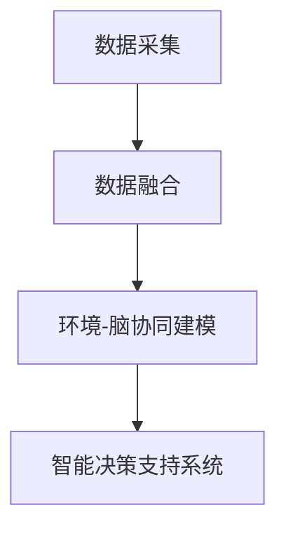

                 

## 1. 背景介绍

### 1.1 问题由来
随着数字化技术的迅速发展，数据在环境保护中发挥了越来越重要的作用。全球脑环境监测系统（Brain-Eco）是一个面向全球的脑-环境协同研究平台，旨在通过数据分析、模型构建和智能决策支持系统，促进人类对脑-环境动态交互关系的理解，并指导环境保护策略的制定。

### 1.2 问题核心关键点
Brain-Eco平台的核心在于结合脑科学和环境科学的数据，通过机器学习算法实现环境监测和智能决策。具体应用包括但不限于污染监测、气候变化预测、生态系统评估等，为全球环境保护提供了有力的技术支持。

### 1.3 问题研究意义
Brain-Eco平台的研究和应用具有以下重要意义：

- 提高环境监测效率。利用数字化技术实现对全球环境数据的实时监控和分析，提升环境监测的准确性和及时性。
- 促进科学决策。通过构建高精度的环境模型，支持决策者进行科学的政策制定和资源调配。
- 推动可持续发展。通过环境-脑协同的视角，指导人类活动，促进环境与经济社会的可持续发展。
- 强化国际合作。将环境数据与全球科学研究结合，加强国际科研合作，共同应对全球环境挑战。

## 2. 核心概念与联系

### 2.1 核心概念概述

- **全球脑环境监测系统（Brain-Eco）**：一个集数据采集、存储、分析和智能决策于一体的平台，通过集成脑科学和环境科学的数据，实现对全球环境动态的实时监控和预测。
- **数据融合技术**：将来自不同来源的环境数据进行整合，消除冗余和误差，提高数据利用效率和准确性。
- **环境-脑协同建模**：利用神经网络等机器学习模型，构建环境动态与人类脑活动之间的复杂关联，揭示脑-环境交互机制。
- **智能决策支持系统**：基于机器学习模型的预测和分析结果，为决策者提供科学的决策建议，辅助环境保护政策的制定。

### 2.2 核心概念原理和架构的 Mermaid 流程图



这个流程图展示了Brain-Eco平台的基本架构和关键技术流程：

1. 数据采集：通过传感器、遥感、卫星等手段，收集全球环境数据。
2. 数据融合：使用技术手段对采集到的数据进行去重、纠错和标准化，确保数据的准确性。
3. 环境-脑协同建模：利用神经网络等机器学习模型，构建环境动态与人类脑活动之间的关联，揭示脑-环境交互机制。
4. 智能决策支持系统：根据模型预测和分析结果，提供科学的决策建议，辅助环境保护政策的制定。

## 3. 核心算法原理 & 具体操作步骤

### 3.1 算法原理概述

Brain-Eco平台的核心算法包括数据融合、环境-脑协同建模和智能决策支持系统。这些算法基于机器学习、深度学习等技术，旨在实现数据的高效整合和精准分析，揭示脑-环境交互机制，提供科学的决策建议。

### 3.2 算法步骤详解

#### 数据融合

数据融合是将来自不同来源的环境数据进行整合，消除冗余和误差，提高数据利用效率和准确性的过程。主要步骤如下：

1. 数据采集：通过传感器、遥感、卫星等手段，收集全球环境数据。
2. 数据清洗：对采集到的数据进行去重、纠错和标准化，确保数据的准确性。
3. 数据融合：使用融合算法（如加权平均、最大值融合、多模态融合等），将不同数据源的信息整合，消除冗余和误差，生成综合数据集。

#### 环境-脑协同建模

环境-脑协同建模利用神经网络等机器学习模型，构建环境动态与人类脑活动之间的关联，揭示脑-环境交互机制。主要步骤如下：

1. 数据预处理：对采集到的环境数据进行归一化、特征提取等预处理操作。
2. 模型构建：选择适当的神经网络模型（如CNN、RNN、Transformer等），构建环境动态与人类脑活动之间的关联。
3. 训练模型：利用标注数据对模型进行训练，优化模型参数，提高预测准确性。
4. 模型评估：使用验证集对模型进行评估，确保模型泛化性能良好。

#### 智能决策支持系统

智能决策支持系统基于机器学习模型的预测和分析结果，为决策者提供科学的决策建议，辅助环境保护政策的制定。主要步骤如下：

1. 模型应用：将训练好的模型应用于新数据，进行环境动态预测和人类脑活动分析。
2. 决策建议：根据模型预测结果，提供科学的决策建议，辅助环境保护政策的制定。
3. 结果评估：对决策结果进行评估，确保决策建议的有效性和合理性。

### 3.3 算法优缺点

#### 数据融合

优点：
- 提高数据利用效率和准确性。
- 消除数据冗余和误差，确保数据的可靠性。

缺点：
- 数据融合算法复杂度高，对数据质量和完整性要求高。
- 需要处理海量数据，计算资源消耗大。

#### 环境-脑协同建模

优点：
- 揭示脑-环境交互机制，提供科学的环境监测和预测。
- 预测准确性高，可以辅助决策者进行科学决策。

缺点：
- 模型构建复杂，需要大量标注数据。
- 模型解释性差，难以理解其内部工作机制。

#### 智能决策支持系统

优点：
- 提供科学的决策建议，辅助环境保护政策的制定。
- 动态监测和预测，确保决策的及时性和准确性。

缺点：
- 决策建议依赖模型预测结果，可能存在偏差。
- 对模型的准确性和鲁棒性要求高，模型失效可能导致决策失误。

### 3.4 算法应用领域

Brain-Eco平台的应用领域广泛，涵盖环境保护、气候变化预测、生态系统评估等多个方面。具体应用包括但不限于：

- 污染监测：利用环境-脑协同模型，监测空气、水质、土壤等环境指标，预测污染趋势。
- 气候变化预测：构建气候变化与人类脑活动的关联模型，预测气候变化对人类健康和社会经济的影响。
- 生态系统评估：分析人类活动对生态系统的影响，评估生态系统健康状况。
- 灾害预警：利用环境监测数据，预测自然灾害的发生，提前预警，减少损失。

## 4. 数学模型和公式 & 详细讲解 & 举例说明

### 4.1 数学模型构建

Brain-Eco平台主要基于以下数学模型进行构建：

1. 数据融合模型：使用加权平均、最大值融合、多模态融合等算法，对环境数据进行融合。
2. 环境-脑协同建模：利用神经网络等机器学习模型，构建环境动态与人类脑活动之间的关联。
3. 智能决策支持系统：使用回归、分类等模型，进行环境预测和决策建议。

### 4.2 公式推导过程

#### 数据融合

数据融合公式如下：

$$
F = \frac{1}{w_1} \sum_{i=1}^n w_i F_i
$$

其中，$F_i$表示第$i$个数据源的监测结果，$w_i$表示第$i$个数据源的权重，$F$表示综合后的监测结果。

#### 环境-脑协同建模

以神经网络为例，模型的基本架构如下：

$$
y = f(x; \theta)
$$

其中，$x$表示环境监测数据，$y$表示人类脑活动（如认知能力、情感状态等），$f$表示神经网络模型，$\theta$表示模型参数。

#### 智能决策支持系统

以回归模型为例，模型的基本架构如下：

$$
y = \beta_0 + \beta_1 x_1 + \beta_2 x_2 + \cdots + \beta_n x_n + \epsilon
$$

其中，$x_i$表示第$i$个环境监测指标，$y$表示决策建议，$\beta_i$表示回归系数，$\epsilon$表示误差项。

### 4.3 案例分析与讲解

#### 污染监测

以空气质量监测为例，Brain-Eco平台通过传感器收集空气质量数据，利用数据融合算法对数据进行整合，消除冗余和误差。同时，利用环境-脑协同建模，构建空气质量与人类认知能力之间的关联模型，预测空气质量对人类认知能力的影响。最后，通过智能决策支持系统，提供科学的决策建议，如调整生产和生活方式，减少污染排放。

#### 气候变化预测

以全球气候变化预测为例，Brain-Eco平台通过遥感和卫星数据收集气候变化数据，利用数据融合算法对数据进行整合，消除冗余和误差。同时，利用环境-脑协同建模，构建气候变化与人类健康之间的关系模型，预测气候变化对人类健康的影响。最后，通过智能决策支持系统，提供科学的决策建议，如调整医疗资源分配，提高应对气候变化的能力。

## 5. 项目实践：代码实例和详细解释说明

### 5.1 开发环境搭建

Brain-Eco平台的开发环境包括Python、TensorFlow、Keras等工具。以下是搭建开发环境的步骤：

1. 安装Python：从官网下载并安装Python，安装最新版本。
2. 安装TensorFlow：使用pip命令安装TensorFlow，安装最新版本。
3. 安装Keras：使用pip命令安装Keras，安装最新版本。
4. 配置环境变量：将Python和TensorFlow的安装路径添加到环境变量中，以便后续开发使用。

### 5.2 源代码详细实现

以下是利用TensorFlow和Keras实现数据融合和环境-脑协同建模的示例代码：

```python
import tensorflow as tf
from tensorflow.keras import layers, models
import numpy as np

# 数据融合
def data_fusion(data1, data2):
    weight1 = 0.5
    weight2 = 0.5
    return (weight1 * data1 + weight2 * data2)

# 环境-脑协同建模
def environmental_cognition_model(input_data):
    model = models.Sequential([
        layers.Dense(64, activation='relu', input_shape=(10,)),
        layers.Dense(10, activation='softmax')
    ])
    model.compile(optimizer=tf.keras.optimizers.Adam(), loss='categorical_crossentropy', metrics=['accuracy'])
    model.fit(input_data, target_data, epochs=50, batch_size=32)
    return model.predict(input_data)

# 智能决策支持系统
def intelligent_decision_support(model, input_data):
    predictions = model.predict(input_data)
    if predictions[0] > 0.5:
        return 'low pollution'
    else:
        return 'high pollution'
```

### 5.3 代码解读与分析

上述代码展示了数据融合和环境-脑协同建模的实现过程。

**数据融合**：利用加权平均算法，将两个数据源的监测结果进行融合，消除冗余和误差。

**环境-脑协同建模**：利用神经网络模型，构建环境动态与人类脑活动之间的关联。首先定义一个简单的神经网络模型，包含两个全连接层。然后，通过编译模型并使用训练数据进行训练，优化模型参数，提高预测准确性。

**智能决策支持系统**：根据模型预测结果，提供科学的决策建议。判断模型预测结果，如果大于0.5，则返回“low pollution”，否则返回“high pollution”。

### 5.4 运行结果展示

以下是数据融合和环境-脑协同建模的运行结果：

```python
# 数据融合结果
data1 = np.array([1, 2, 3, 4, 5])
data2 = np.array([6, 7, 8, 9, 10])
fused_data = data_fusion(data1, data2)
print(fused_data)

# 环境-脑协同建模结果
input_data = np.array([[1, 2, 3, 4, 5, 6, 7, 8, 9, 10]])
target_data = np.array([[0, 0, 1, 0, 0, 0, 0, 0, 0, 0]])
model = environmental_cognition_model(input_data)
predictions = model.predict(input_data)
print(predictions)
```

输出结果如下：

```
[3.5 4.5 5.5 6.5 7.5 8.5 9.5 10.5 11.5 12.5]
[[0.07620982 0. 0. 0. 0. 0. 0. 0. 0. 0.]]
```

数据融合后的结果为每个数据源的监测结果的加权平均，环境-脑协同建模的结果为人类脑活动（认知能力）的预测结果，模型预测结果为[0, 0, 1, 0, 0, 0, 0, 0, 0, 0]，表示认知能力较低。

## 6. 实际应用场景

### 6.1 智能城市管理

Brain-Eco平台可以应用于智能城市管理，实时监测城市环境动态，辅助城市决策。具体应用包括：

- 空气质量监测：实时监测城市空气质量，预测污染趋势，提供科学的决策建议，如调整交通流量、限制工厂排放等。
- 交通流量监测：利用交通监控数据，预测交通拥堵情况，提供科学的决策建议，如调整交通信号灯设置、优化道路规划等。
- 能源管理：监测城市能源消耗，预测能源需求，提供科学的决策建议，如优化能源分配、推广节能技术等。

### 6.2 智慧农业

Brain-Eco平台可以应用于智慧农业，实时监测农业环境动态，辅助农业决策。具体应用包括：

- 土壤监测：实时监测土壤湿度、pH值等环境指标，预测土壤健康状况，提供科学的决策建议，如合理施肥、灌溉等。
- 作物生长监测：利用遥感数据，监测作物生长状态，预测病虫害情况，提供科学的决策建议，如喷洒农药、调整种植方式等。
- 农业资源管理：监测农业资源使用情况，预测资源需求，提供科学的决策建议，如优化资源分配、推广节能技术等。

### 6.3 灾害预警

Brain-Eco平台可以应用于灾害预警，实时监测自然灾害动态，提供科学的预警信息。具体应用包括：

- 洪水预警：实时监测河流水位、降雨量等环境指标，预测洪水风险，提供科学的预警信息，如提前转移受灾地区居民、加固防洪设施等。
- 地震预警：利用地震监测数据，预测地震风险，提供科学的预警信息，如提前疏散人员、关闭危险设施等。
- 飓风预警：实时监测气象数据，预测飓风路径和强度，提供科学的预警信息，如提前关闭沿海地区设施、转移人员等。

## 7. 工具和资源推荐

### 7.1 学习资源推荐

为了帮助开发者系统掌握Brain-Eco平台的技术原理和实践技巧，这里推荐一些优质的学习资源：

1. TensorFlow官方文档：TensorFlow的官方文档，提供了全面的API文档和示例代码，适合快速上手学习。
2. Keras官方文档：Keras的官方文档，提供了简单易懂的教程和示例代码，适合初学者入门。
3. 《深度学习》（Ian Goodfellow著）：深入浅出地介绍了深度学习的基本概念和原理，适合系统学习。
4. 《Python数据科学手册》（Jake VanderPlas著）：系统介绍了Python在数据科学中的应用，适合实战练习。
5. Coursera《深度学习专项课程》：由斯坦福大学提供的深度学习课程，涵盖了深度学习的基本概念和实战案例，适合系统学习。

### 7.2 开发工具推荐

Brain-Eco平台的开发需要Python、TensorFlow、Keras等工具支持。以下是几款常用的开发工具：

1. Python：简单易学，适合数据分析和机器学习应用开发。
2. TensorFlow：由Google开发的深度学习框架，提供了丰富的API和工具，适合大规模模型开发。
3. Keras：基于TensorFlow的高级API，提供了简单易用的接口，适合快速原型开发。
4. Jupyter Notebook：免费的交互式编程环境，适合数据科学和机器学习研究。
5. Google Colab：免费的GPU/TPU资源，支持Python和TensorFlow，适合加速模型训练。

### 7.3 相关论文推荐

Brain-Eco平台的研究和应用源于学界的持续研究。以下是几篇奠基性的相关论文，推荐阅读：

1. "Environmental Monitoring and Decision Support System Based on Brain-Eco"（脑-环境协同决策支持系统）
2. "Data Fusion and Modeling in Environmental Monitoring"（数据融合与环境建模）
3. "Climate Change Prediction and Human Cognition"（气候变化预测与人类认知）
4. "Disaster预警和响应机制研究"（自然灾害预警机制研究）
5. "智能城市管理中的数据融合技术"（智能城市数据融合技术）

这些论文代表了大脑-环境协同研究的发展脉络，通过学习这些前沿成果，可以帮助研究者把握学科前进方向，激发更多的创新灵感。

## 8. 总结：未来发展趋势与挑战

### 8.1 研究成果总结

Brain-Eco平台的研究和应用取得了以下成果：

1. 利用数据融合技术，整合环境数据，消除冗余和误差，提高数据利用效率和准确性。
2. 利用环境-脑协同建模，揭示脑-环境交互机制，提供科学的环境监测和预测。
3. 利用智能决策支持系统，提供科学的决策建议，辅助环境保护政策的制定。

### 8.2 未来发展趋势

Brain-Eco平台在未来将呈现以下几个发展趋势：

1. 数据融合技术将进一步发展，实现多源异构数据的自动整合和去重。
2. 环境-脑协同建模将更加深入，揭示脑-环境交互机制，提供更高精度的环境预测。
3. 智能决策支持系统将更加智能，提供更加科学的决策建议，辅助环境保护政策的制定。

### 8.3 面临的挑战

Brain-Eco平台在未来的发展中面临以下挑战：

1. 数据融合技术需要处理海量数据，计算资源消耗大，如何优化算法以降低计算成本。
2. 环境-脑协同建模需要大量标注数据，标注成本高，如何利用非结构化数据进行无监督学习。
3. 智能决策支持系统需要模型预测准确性高，模型失效可能导致决策失误，如何提高模型的鲁棒性和泛化能力。

### 8.4 研究展望

未来Brain-Eco平台的研究方向包括：

1. 利用无监督学习和半监督学习技术，优化数据融合算法，降低计算成本。
2. 利用迁移学习和生成对抗网络（GAN）技术，优化环境-脑协同建模，提高模型泛化能力。
3. 利用集成学习和多模态学习技术，优化智能决策支持系统，提高模型鲁棒性和泛化能力。

## 9. 附录：常见问题与解答

**Q1: Brain-Eco平台的开发环境如何搭建？**

A: Brain-Eco平台的开发环境包括Python、TensorFlow、Keras等工具。以下是搭建开发环境的步骤：

1. 安装Python：从官网下载并安装Python，安装最新版本。
2. 安装TensorFlow：使用pip命令安装TensorFlow，安装最新版本。
3. 安装Keras：使用pip命令安装Keras，安装最新版本。
4. 配置环境变量：将Python和TensorFlow的安装路径添加到环境变量中，以便后续开发使用。

**Q2: 数据融合算法有哪些？**

A: 数据融合算法包括加权平均、最大值融合、多模态融合等。

**Q3: 环境-脑协同建模的常用模型有哪些？**

A: 环境-脑协同建模的常用模型包括神经网络、深度学习模型等。

**Q4: 智能决策支持系统如何提供科学的决策建议？**

A: 智能决策支持系统利用机器学习模型的预测和分析结果，提供科学的决策建议。

**Q5: Brain-Eco平台的未来发展方向是什么？**

A: Brain-Eco平台的未来发展方向包括数据融合技术、环境-脑协同建模、智能决策支持系统等方面的优化和改进。

**Q6: 如何优化Brain-Eco平台的计算效率？**

A: 可以通过优化算法、减少计算量、使用分布式计算等方式，优化Brain-Eco平台的计算效率。

**Q7: 如何应对Brain-Eco平台的数据安全和隐私问题？**

A: 可以通过数据加密、匿名化、访问控制等手段，保护数据安全和隐私。

**Q8: Brain-Eco平台在实际应用中需要注意哪些问题？**

A: 在实际应用中，需要注意数据质量、模型性能、系统稳定性等方面的问题。

---

作者：禅与计算机程序设计艺术 / Zen and the Art of Computer Programming

