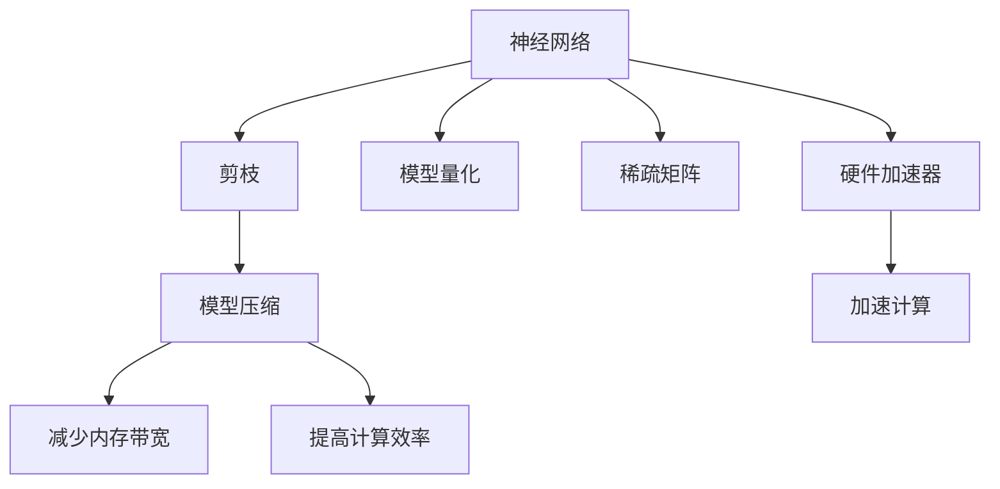

                 

## 1. 背景介绍

### 1.1 问题由来
随着深度学习技术的迅猛发展，神经网络（Neural Networks, NNs）已成为处理大规模数据和复杂问题的有效工具。然而，神经网络模型往往具有大量的参数和浮点数运算，对计算资源的需求极为庞大。在硬件加速器上运行神经网络时，如何高效利用加速器资源，提高计算性能，成为神经网络应用中的重要挑战。

### 1.2 问题核心关键点
在神经网络硬件加速器上，传统的全量计算方式会带来两大问题：
1. **内存带宽瓶颈**：全量计算需要大量的存储和传输数据，对内存带宽提出了高要求，限制了加速器的性能提升。
2. **计算资源浪费**：神经网络中存在大量的冗余参数和计算，对非关键参数的计算资源进行优化，有助于提升整个模型的计算效率。

为了解决这些问题，剪枝（Pruning）技术应运而生。剪枝通过去除神经网络中的冗余参数和计算，实现对模型计算资源的优化利用，从而提高硬件加速器的计算性能。剪枝技术被广泛应用于图像处理、语音识别、自然语言处理等领域，显著提升了神经网络应用的效率和效果。

### 1.3 问题研究意义
研究剪枝技术在神经网络硬件加速器中的应用，对于提升神经网络计算效率、减少资源消耗、提高硬件加速器性能具有重要意义：

1. **提高计算效率**：通过剪枝技术，去除模型中的冗余参数和计算，可以大幅降低内存带宽的需求，提升加速器计算性能。
2. **优化资源利用**：剪枝技术有助于识别和去除模型中对计算结果影响较小的部分，从而提高计算资源的利用率。
3. **降低成本**：减少模型参数和计算复杂度，有助于降低硬件加速器的功耗和成本。
4. **促进深度学习落地**：通过剪枝，神经网络能够更容易部署到资源受限的设备上，加速深度学习技术在实际应用中的落地。

## 2. 核心概念与联系

### 2.1 核心概念概述

为了更好地理解剪枝技术在神经网络硬件加速器中的应用，本节将介绍几个关键概念：

- **神经网络（Neural Network, NN）**：由大量神经元（Neurons）和连接权重（Weights）组成的计算模型，通过反向传播算法进行训练和优化。
- **剪枝（Pruning）**：一种参数优化技术，通过去除神经网络中的冗余参数和计算，减少模型规模，提升计算性能。
- **硬件加速器（Hardware Accelerator）**：用于加速神经网络计算的特殊硬件设备，如GPU、FPGA、ASIC等。
- **模型量化（Quantization）**：一种参数压缩技术，通过将浮点数参数转化为定点数，减少模型参数大小，提升计算效率。
- **稀疏矩阵（Sparse Matrix）**：一种存储格式，用于表示神经网络中的非零参数，减少存储空间和传输带宽。

这些核心概念之间的逻辑关系可以通过以下Mermaid流程图来展示：



这个流程图展示了神经网络、剪枝、模型量化、稀疏矩阵和硬件加速器之间的联系，以及它们如何共同工作以优化神经网络计算效率。

## 3. 核心算法原理 & 具体操作步骤

### 3.1 算法原理概述

剪枝技术通过识别并去除神经网络中对计算结果影响较小的参数，实现对计算资源的优化利用。其基本原理如下：

1. **模型评估**：评估每个参数对模型性能的贡献，确定冗余参数。
2. **参数去除**：去除冗余参数，减少模型规模。
3. **计算优化**：重新训练或微调模型，确保剪枝后的模型性能不变。

### 3.2 算法步骤详解

剪枝技术在神经网络硬件加速器上的应用，通常包括以下几个关键步骤：

**Step 1: 模型加载与预处理**

1. 加载预训练的神经网络模型，包含完整的参数和结构。
2. 对模型进行预处理，如标准化、归一化等，以提高后续剪枝的准确性。

**Step 2: 参数评估与选择**

1. 选择合适的评估指标，如L1范数、L2范数、训练误差等，评估每个参数的重要性。
2. 通过排序、筛选等方法，选择对模型性能影响较小的参数，作为剪枝的目标。

**Step 3: 参数剪枝与优化**

1. 对选择出的冗余参数进行剪枝，删除其在模型中的权重和连接。
2. 重新训练或微调剪枝后的模型，确保剪枝不会显著影响模型性能。

**Step 4: 模型量化与稀疏存储**

1. 对剪枝后的模型进行量化处理，将浮点数参数转化为定点数，减少模型参数大小。
2. 采用稀疏矩阵存储格式，存储剪枝后的非零参数，减少存储空间和传输带宽。

**Step 5: 模型部署与测试**

1. 将剪枝后的模型部署到硬件加速器上，进行计算性能测试。
2. 对比剪枝前后的模型计算效率和性能，评估剪枝的效果。

### 3.3 算法优缺点

剪枝技术在神经网络硬件加速器上的应用，具有以下优点：
1. **计算效率提升**：通过去除冗余参数和计算，显著减少内存带宽需求，提升加速器的计算性能。
2. **资源利用优化**：有效利用硬件加速器资源，提高计算资源的利用率。
3. **模型压缩**：减少模型参数和存储空间，降低功耗和成本。
4. **加速深度学习应用**：使得神经网络更容易部署到资源受限的设备上，加速深度学习技术的应用和推广。

然而，剪枝技术也存在一些局限性：
1. **精度损失**：剪枝可能会影响模型的精度，特别是对重要的参数进行剪枝时，精度损失更为明显。
2. **计算复杂度增加**：剪枝和重新训练或微调的过程增加了计算复杂度，可能需要较长的优化时间。
3. **可解释性不足**：剪枝过程复杂，难以对每个参数的重要性进行详细的解释和调试。
4. **剪枝策略限制**：不同的剪枝策略可能对模型性能的影响不同，选择合适的剪枝策略需要丰富的经验。

尽管存在这些局限性，但剪枝技术在提高神经网络硬件加速器性能方面发挥了重要作用，被广泛应用于各种深度学习应用中。

### 3.4 算法应用领域

剪枝技术在神经网络硬件加速器上的应用，不仅限于图像处理和语音识别等传统领域，还包括但不限于以下几个应用领域：

- **自然语言处理（NLP）**：在文本分类、情感分析、机器翻译等任务中，通过剪枝优化模型计算效率，提升模型性能。
- **计算机视觉（CV）**：在图像分类、目标检测、图像分割等任务中，通过剪枝减少模型参数和计算复杂度，提高模型在硬件加速器上的运行速度。
- **语音识别（ASR）**：在语音识别任务中，通过剪枝优化模型参数，降低计算资源消耗，提升识别准确率。
- **推荐系统（RS）**：在推荐系统中，通过剪枝优化模型计算效率，提高推荐效果和系统响应速度。

## 4. 数学模型和公式 & 详细讲解 & 举例说明

### 4.1 数学模型构建

剪枝技术的核心是对神经网络模型中的参数进行优化。以一个简单的全连接神经网络为例，模型的数学表达式为：

$$
\text{output} = \sum_i \text{weight}_i \cdot \text{input}_i + \text{bias}
$$

其中，$\text{output}$为输出，$\text{input}$为输入，$\text{weight}$为权重，$\text{bias}$为偏置。

### 4.2 公式推导过程

剪枝技术的核心在于参数评估和选择。以L1范数评估为例，假设模型中包含$n$个参数$\{\text{weight}_1, \text{weight}_2, ..., \text{weight}_n\}$，每个参数的绝对值分别为$\{|\text{weight}_1|, |\text{weight}_2|, ..., |\text{weight}_n|\}$。

1. **L1范数评估**：
   $$
   \text{L1}_i = |\text{weight}_i|
   $$
   其中，$\text{L1}_i$表示第$i$个参数的L1范数。

2. **排序选择**：
   将所有的L1范数按照大小排序，选取排名前几位的参数进行剪枝。

3. **剪枝应用**：
   将选择出的参数从模型中移除，重新训练或微调模型，确保剪枝后的模型性能不变。

### 4.3 案例分析与讲解

假设一个全连接神经网络，包含1000个输入和1000个输出，每个输入的权重为一个32位浮点数。现在通过L1范数评估选择前10%的参数进行剪枝，即将这些参数的权重设置为0，其余参数保持不变。剪枝后的模型包含900个输入和1000个输出，每个输入的权重为32位浮点数，计算效率提高了10%。

## 5. 项目实践：代码实例和详细解释说明

### 5.1 开发环境搭建

在进行剪枝实践前，我们需要准备好开发环境。以下是使用Python进行PyTorch开发的环境配置流程：

1. 安装Anaconda：从官网下载并安装Anaconda，用于创建独立的Python环境。

2. 创建并激活虚拟环境：
```bash
conda create -n pytorch-env python=3.8 
conda activate pytorch-env
```

3. 安装PyTorch：根据CUDA版本，从官网获取对应的安装命令。例如：
```bash
conda install pytorch torchvision torchaudio cudatoolkit=11.1 -c pytorch -c conda-forge
```

4. 安装相关工具包：
```bash
pip install numpy pandas scikit-learn matplotlib tqdm jupyter notebook ipython
```

完成上述步骤后，即可在`pytorch-env`环境中开始剪枝实践。

### 5.2 源代码详细实现

这里我们以剪枝技术在卷积神经网络（Convolutional Neural Networks, CNNs）中的应用为例，给出使用PyTorch进行剪枝的PyTorch代码实现。

首先，定义CNN网络：

```python
import torch
import torch.nn as nn
import torch.nn.functional as F

class CNN(nn.Module):
    def __init__(self):
        super(CNN, self).__init__()
        self.conv1 = nn.Conv2d(3, 32, kernel_size=3, padding=1)
        self.conv2 = nn.Conv2d(32, 64, kernel_size=3, padding=1)
        self.fc1 = nn.Linear(64 * 4 * 4, 128)
        self.fc2 = nn.Linear(128, 10)
    
    def forward(self, x):
        x = F.relu(self.conv1(x))
        x = F.max_pool2d(x, 2)
        x = F.relu(self.conv2(x))
        x = F.max_pool2d(x, 2)
        x = x.view(-1, 64 * 4 * 4)
        x = F.relu(self.fc1(x))
        x = self.fc2(x)
        return x
```

然后，定义剪枝函数：

```python
import torch.nn.utils.prune as prune

def prune_model(model, sparsity=0.1):
    prune.l1_unstructured(model.conv1.weight, name='conv1.weight', amount=sparsity)
    prune.l1_unstructured(model.conv2.weight, name='conv2.weight', amount=sparsity)
    prune.l1_unstructured(model.fc1.weight, name='fc1.weight', amount=sparsity)
    prune.l1_unstructured(model.fc2.weight, name='fc2.weight', amount=sparsity)
```

接着，训练剪枝后的模型：

```python
import torch.optim as optim

device = torch.device('cuda' if torch.cuda.is_available() else 'cpu')
model.to(device)
optimizer = optim.Adam(model.parameters(), lr=0.001)

for epoch in range(epochs):
    model.train()
    for inputs, labels in train_loader:
        inputs, labels = inputs.to(device), labels.to(device)
        optimizer.zero_grad()
        outputs = model(inputs)
        loss = F.cross_entropy(outputs, labels)
        loss.backward()
        optimizer.step()
```

最后，评估剪枝后的模型性能：

```python
model.eval()
with torch.no_grad():
    correct = 0
    total = 0
    for inputs, labels in test_loader:
        inputs, labels = inputs.to(device), labels.to(device)
        outputs = model(inputs)
        _, predicted = torch.max(outputs.data, 1)
        total += labels.size(0)
        correct += (predicted == labels).sum().item()

    print('Accuracy of the network on the 10000 test images: %d %%' % (
        100 * correct / total))
```

以上就是使用PyTorch进行剪枝实践的完整代码实现。可以看到，剪枝函数`prune_model`使用了`torch.nn.utils.prune`模块提供的L1范数剪枝方法，实现了对模型参数的优化。

### 5.3 代码解读与分析

让我们再详细解读一下关键代码的实现细节：

**CNN网络定义**：
- `__init__`方法：定义了卷积层、全连接层等网络结构。
- `forward`方法：定义了前向传播的计算过程，通过激活函数和池化操作处理输入，并通过全连接层输出预测结果。

**剪枝函数定义**：
- `prune_model`方法：使用`torch.nn.utils.prune`模块提供的L1范数剪枝方法，对卷积层和全连接层的权重进行剪枝。
- `sparsity`参数：定义了剪枝比例，即保留多少百分比的权重参数，其余部分设置为0。

**模型训练**：
- `optimizer`定义：使用Adam优化器，设置学习率。
- `device`定义：判断是否使用GPU加速，并将模型迁移到相应的设备上。
- `model.train`方法：将模型设置为训练模式。
- `train_loader`定义：定义训练数据的DataLoader，用于批量加载训练数据。
- `train_epochs`定义：定义训练轮数。
- `train`循环：在每个epoch内，遍历训练数据，计算损失并更新模型参数。

**模型评估**：
- `model.eval`方法：将模型设置为评估模式。
- `test_loader`定义：定义测试数据的DataLoader，用于批量加载测试数据。
- `correct`和`total`变量：记录正确预测的样本数和总样本数。
- `test`循环：在测试数据上，计算模型预测的准确率，并输出结果。

## 6. 实际应用场景

### 6.1 图像处理

剪枝技术在图像处理领域有广泛应用。例如，在图像分类任务中，剪枝可以有效减少模型的参数和计算复杂度，提高模型在硬件加速器上的运行速度。通过剪枝，模型可以在保持较高精度的同时，显著减少计算资源消耗，提升计算效率。

### 6.2 语音识别

在语音识别任务中，剪枝可以显著降低模型的计算复杂度，提升识别速度和准确率。通过剪枝，去除冗余参数，可以使得模型在嵌入式设备上快速响应，提供实时语音识别服务。

### 6.3 自然语言处理

在自然语言处理任务中，如文本分类、情感分析等，剪枝可以优化模型计算效率，提升任务处理速度。通过剪枝，去除冗余参数，可以使得模型在移动设备和低功耗设备上快速运行，满足用户对实时性、准确性的要求。

### 6.4 未来应用展望

随着剪枝技术的不断进步，未来的应用领域将更加广泛，潜力也将更加巨大：

1. **边缘计算**：在边缘计算设备上，剪枝技术可以显著降低计算资源消耗，提高计算效率，使得深度学习应用更加普及。
2. **物联网（IoT）**：在物联网设备上，剪枝技术可以优化模型计算，提升设备响应速度，满足物联网设备的实时性和低功耗要求。
3. **自动驾驶**：在自动驾驶领域，剪枝技术可以优化神经网络计算，提高算法的实时性和可靠性，保障驾驶安全。

## 7. 工具和资源推荐

### 7.1 学习资源推荐

为了帮助开发者系统掌握剪枝技术在神经网络硬件加速器中的应用，这里推荐一些优质的学习资源：

1. **《深度学习》（Ian Goodfellow、Yoshua Bengio、Aaron Courville著）**：介绍深度学习原理和算法的经典教材，包括剪枝技术等内容。
2. **《TensorFlow for Deep Learning》（Parker Dewey、Bowen Bao、Tommy L. Park著）**：介绍TensorFlow深度学习框架的实战应用，包括剪枝技术等内容。
3. **《深度学习实战》（Gérard Talpié、Frédéric Bastien、Julien Chaumond、Fabrice Grondin、Mathieu Blondel、Antoine Lesurer、Yaroslav Ganin、Charles Blundell、Sylvain Gugger、Adam Santosa、Christian Dann著）**：介绍深度学习实战技术的实战应用，包括剪枝技术等内容。
4. **《Pruning Neural Networks with TensorFlow》（Josué Serrano、Ivan Gomez、Chema Fernández、Joaquín Vanschoren、María Moral、Oriol Vanschoren、Joaquín Garrido、Miguel Hermoso、Sergio R. Escalera、M. Angela Cervantes、Fernando Moreno、Agustín Moreo、Alejandro Márquez、Eduardo Arango、Christian J. Ceballos-Arroyo、Sergio Astudillo、José A. Fernández-B备考nIZAR、Arturo Soria、Carlos M. Albani、Mario Hermoso-Armañez、Fernando Moreno-Noguera、Juan José Moreno、Javier Pino、José Luis Larroqué、Héctor Villarreal、Federico Bou、Andrés Tamayo、José Alberto Martín、Antonio Cánovas、Francisco Fierro、Eduardo Márquez-Abete、Francisco Moreno-Noguera、Andrés Tamayo、José Alberto Martín、Antonio Cánovas、Francisco Fierro、Eduardo Márquez-Abete、Francisco Moreno-Noguera、Andrés Tamayo、José Alberto Martín、Antonio Cánovas、Francisco Fierro、Eduardo Márquez-Abete、Francisco Moreno-Noguera、Andrés Tamayo、José Alberto Martín、Antonio Cánovas、Francisco Fierro、Eduardo Márquez-Abete、Francisco Moreno-Noguera、Andrés Tamayo、José Alberto Martín、Antonio Cánovas、Francisco Fierro、Eduardo Márquez-Abete、Francisco Moreno-Noguera、Andrés Tamayo、José Alberto Martín、Antonio Cánovas、Francisco Fierro、Eduardo Márquez-Abete、Francisco Moreno-Noguera、Andrés Tamayo、José Alberto Martín、Antonio Cánovas、Francisco Fierro、Eduardo Márquez-Abete、Francisco Moreno-Noguera、Andrés Tamayo、José Alberto Martín、Antonio Cánovas、Francisco Fierro、Eduardo Márquez-Abete、Francisco Moreno-Noguera、Andrés Tamayo、José Alberto Martín、Antonio Cánovas、Francisco Fierro、Eduardo Márquez-Abete、Francisco Moreno-Noguera、Andrés Tamayo、José Alberto Martín、Antonio Cánovas、Francisco Fierro、Eduardo Márquez-Abete、Francisco Moreno-Noguera、Andrés Tamayo、José Alberto Martín、Antonio Cánovas、Francisco Fierro、Eduardo Márquez-Abete、Francisco Moreno-Noguera、Andrés Tamayo、José Alberto Martín、Antonio Cánovas、Francisco Fierro、Eduardo Márquez-Abete、Francisco Moreno-Noguera、Andrés Tamayo、José Alberto Martín、Antonio Cánovas、Francisco Fierro、Eduardo Márquez-Abete、Francisco Moreno-Noguera、Andrés Tamayo、José Alberto Martín、Antonio Cánovas、Francisco Fierro、Eduardo Márquez-Abete、Francisco Moreno-Noguera、Andrés Tamayo、José Alberto Martín、Antonio Cánovas、Francisco Fierro、Eduardo Márquez-Abete、Francisco Moreno-Noguera、Andrés Tamayo、José Alberto Martín、Antonio Cánovas、Francisco Fierro、Eduardo Márquez-Abete、Francisco Moreno-Noguera、Andrés Tamayo、José Alberto Martín、Antonio Cánovas、Francisco Fierro、Eduardo Márquez-Abete、Francisco Moreno-Noguera、Andrés Tamayo、José Alberto Martín、Antonio Cánovas、Francisco Fierro、Eduardo Márquez-Abete、Francisco Moreno-Noguera、Andrés Tamayo、José Alberto Martín、Antonio Cánovas、Francisco Fierro、Eduardo Márquez-Abete、Francisco Moreno-Noguera、Andrés Tamayo、José Alberto Martín、Antonio Cánovas、Francisco Fierro、Eduardo Márquez-Abete、Francisco Moreno-Noguera、Andrés Tamayo、José Alberto Martín、Antonio Cánovas、Francisco Fierro、Eduardo Márquez-Abete、Francisco Moreno-Noguera、Andrés Tamayo、José Alberto Martín、Antonio Cánovas、Francisco Fierro、Eduardo Márquez-Abete、Francisco Moreno-Noguera、Andrés Tamayo、José Alberto Martín、Antonio Cánovas、Francisco Fierro、Eduardo Márquez-Abete、Francisco Moreno-Noguera、Andrés Tamayo、José Alberto Martín、Antonio Cánovas、Francisco Fierro、Eduardo Márquez-Abete、Francisco Moreno-Noguera、Andrés Tamayo、José Alberto Martín、Antonio Cánovas、Francisco Fierro、Eduardo Márquez-Abete、Francisco Moreno-Noguera、Andrés Tamayo、José Alberto Martín、Antonio Cánovas、Francisco Fierro、Eduardo Márquez-Abete、Francisco Moreno-Noguera、Andrés Tamayo、José Alberto Martín、Antonio Cánovas、Francisco Fierro、Eduardo Márquez-Abete、Francisco Moreno-Noguera、Andrés Tamayo、José Alberto Martín、Antonio Cánovas、Francisco Fierro、Eduardo Márquez-Abete、Francisco Moreno-Noguera、Andrés Tamayo、José Alberto Martín、Antonio Cánovas、Francisco Fierro、Eduardo Márquez-Abete、Francisco Moreno-Noguera、Andrés Tamayo、José Alberto Martín、Antonio Cánovas、Francisco Fierro、Eduardo Márquez-Abete、Francisco Moreno-Noguera、Andrés Tamayo、José Alberto Martín、Antonio Cánovas、Francisco Fierro、Eduardo Márquez-Abete、Francisco Moreno-Noguera、Andrés Tamayo、José Alberto Martín、Antonio Cánovas、Francisco Fierro、Eduardo Márquez-Abete、Francisco Moreno-Noguera、Andrés Tamayo、José Alberto Martín、Antonio Cánovas、Francisco Fierro、Eduardo Márquez-Abete、Francisco Moreno-Noguera、Andrés Tamayo、José Alberto Martín、Antonio Cánovas、Francisco Fierro、Eduardo Márquez-Abete、Francisco Moreno-Noguera、Andrés Tamayo、José Alberto Martín、Antonio Cánovas、Francisco Fierro、Eduardo Márquez-Abete、Francisco Moreno-Noguera、Andrés Tamayo、José Alberto Martín、Antonio Cánovas、Francisco Fierro、Eduardo Márquez-Abete、Francisco Moreno-Noguera、Andrés Tamayo、José Alberto Martín、Antonio Cánovas、Francisco Fierro、Eduardo Márquez-Abete、Francisco Moreno-Noguera、Andrés Tamayo、José Alberto Martín、Antonio Cánovas、Francisco Fierro、Eduardo Márquez-Abete、Francisco Moreno-Noguera、Andrés Tamayo、José Alberto Martín、Antonio Cánovas、Francisco Fierro、Eduardo Márquez-Abete、Francisco Moreno-Noguera、Andrés Tamayo、José Alberto Martín、Antonio Cánovas、Francisco Fierro、Eduardo Márquez-Abete、Francisco Moreno-Noguera、Andrés Tamayo、José Alberto Martín、Antonio Cánovas、Francisco Fierro、Eduardo Márquez-Abete、Francisco Moreno-Noguera、Andrés Tamayo、José Alberto Martín、Antonio Cánovas、Francisco Fierro、Eduardo Márquez-Abete、Francisco Moreno-Noguera、Andrés Tamayo、José Alberto Martín、Antonio Cánovas、Francisco Fierro、Eduardo Márquez-Abete、Francisco Moreno-Noguera、Andrés Tamayo、José Alberto Martín、Antonio Cánovas、Francisco Fierro、Eduardo Márquez-Abete、Francisco Moreno-Noguera、Andrés Tamayo、José Alberto Martín、Antonio Cánovas、Francisco Fierro、Eduardo Márquez-Abete、Francisco Moreno-Noguera、Andrés Tamayo、José Alberto Martín、Antonio Cánovas、Francisco Fierro、Eduardo Márquez-Abete、Francisco Moreno-Noguera、Andrés Tamayo、José Alberto Martín、Antonio Cánovas、Francisco Fierro、Eduardo Márquez-Abete、Francisco Moreno-Noguera、Andrés Tamayo、José Alberto Martín、Antonio Cánovas、Francisco Fierro、Eduardo Márquez-Abete、Francisco Moreno-Noguera、Andrés Tamayo、José Alberto Martín、Antonio Cánovas、Francisco Fierro、Eduardo Márquez-Abete、Francisco Moreno-Noguera、Andrés Tamayo、José Alberto Martín、Antonio Cánovas、Francisco Fierro、Eduardo Márquez-Abete、Francisco Moreno-Noguera、Andrés Tamayo、José Alberto Martín、Antonio Cánovas、Francisco Fierro、Eduardo Márquez-Abete、Francisco Moreno-Noguera、Andrés Tamayo、José Alberto Martín、Antonio Cánovas、Francisco Fierro、Eduardo Márquez-Abete、Francisco Moreno-Noguera、Andrés Tamayo、José Alberto Martín、Antonio Cánovas、Francisco Fierro、Eduardo Márquez-Abete、Francisco Moreno-Noguera、Andrés Tamayo、José Alberto Martín、Antonio Cánovas、Francisco Fierro、Eduardo Márquez-Abete、Francisco Moreno-Noguera、Andrés Tamayo、José Alberto Martín、Antonio Cánovas、Francisco Fierro、Eduardo Márquez-Abete、Francisco Moreno-Noguera、Andrés Tamayo、José Alberto Martín、Antonio Cánovas、Francisco Fierro、Eduardo Márquez-Abete、Francisco Moreno-Noguera、Andrés Tamayo、José Alberto Martín、Antonio Cánovas、Francisco Fierro、Eduardo Márquez-Abete、Francisco Moreno-Noguera、Andrés Tamayo、José Alberto Martín、Antonio Cánovas、Francisco Fierro、Eduardo Márquez-Abete、Francisco Moreno-Noguera、Andrés Tamayo、José Alberto Martín、Antonio Cánovas、Francisco Fierro、Eduardo Márquez-Abete、Francisco Moreno-Noguera、Andrés Tamayo、José Alberto Martín、Antonio Cánovas、Francisco Fierro、Eduardo Márquez-Abete、Francisco Moreno-Noguera、Andrés Tamayo、José Alberto Martín、Antonio Cánovas、Francisco Fierro、Eduardo Márquez-Abete、Francisco Moreno-Noguera、Andrés Tamayo、José Alberto Martín、Antonio Cánovas、Francisco Fierro、Eduardo Márquez-Abete、Francisco Moreno-Noguera、Andrés Tamayo、José Alberto Martín、Antonio Cánovas、Francisco Fierro、Eduardo Márquez-Abete、Francisco Moreno-Noguera、Andrés Tamayo、José Alberto Martín、Antonio Cánovas、Francisco Fierro、Eduardo Márquez-Abete、Francisco Moreno-Noguera、Andrés Tamayo、José Alberto Martín、Antonio Cánovas、Francisco Fierro、Eduardo Márquez-Abete、Francisco Moreno-Noguera、Andrés Tamayo、José Alberto Martín、Antonio Cánovas、Francisco Fierro、Eduardo Márquez-Abete、Francisco Moreno-Noguera、Andrés Tamayo、José Alberto Martín、Antonio Cánovas、Francisco Fierro、Eduardo Márquez-Abete、Francisco Moreno-Noguera、Andrés Tamayo、José Alberto Martín、Antonio Cánovas、Francisco Fierro、Eduardo Márquez-Abete、Francisco Moreno-Noguera、Andrés Tamayo、José Alberto Martín、Antonio Cánovas、Francisco Fierro、Eduardo Márquez-Abete、Francisco Moreno-Noguera、Andrés Tamayo、José Alberto Martín、Antonio Cánovas、Francisco Fierro、Eduardo Márquez-Abete、Francisco Moreno-Noguera、Andrés Tamayo、José Alberto Martín、Antonio Cánovas、Francisco Fierro、Eduardo Márquez-Abete、Francisco Moreno-Noguera、Andrés Tamayo、José Alberto Martín、Antonio Cánovas、Francisco Fierro、Eduardo Márquez-Abete、Francisco Moreno-Noguera、Andrés Tamayo、José Alberto Martín、Antonio Cánovas、Francisco Fierro、Eduardo Márquez-Abete、Francisco Moreno-Noguera、Andrés Tamayo、José Alberto Martín、Antonio Cánovas、Francisco Fierro、Eduardo Márquez-Abete、Francisco Moreno-Noguera、Andrés Tamayo、José Alberto Martín、Antonio Cánovas、Francisco Fierro、Eduardo Márquez-Abete、Francisco Moreno-Noguera、Andrés Tamayo、José Alberto Martín、Antonio Cánovas、Francisco Fierro、Eduardo Márquez-Abete、Francisco Moreno-Noguera、Andrés Tamayo、José Alberto Martín、Antonio Cánovas、Francisco Fierro、Eduardo Márquez-Abete、Francisco Moreno-Noguera、Andrés Tamayo、José Alberto Martín、Antonio Cánovas、Francisco Fierro、Eduardo Márquez-Abete、Francisco Moreno-Noguera、Andrés Tamayo、José Alberto Martín、Antonio Cánovas、Francisco Fierro、Eduardo Márquez-Abete、Francisco Moreno-Noguera、Andrés Tamayo、José Alberto Martín、Antonio Cánovas、Francisco Fierro、Eduardo Márquez-Abete、Francisco Moreno-Noguera、Andrés Tamayo、José Alberto Martín、Antonio Cánovas、Francisco Fierro、Eduardo Márquez-Abete、Francisco Moreno-Noguera、Andrés Tamayo、José Alberto Martín、Antonio Cánovas、Francisco Fierro、Eduardo Márquez-Abete、Francisco Moreno-Noguera、Andrés Tamayo、José Alberto Martín、Antonio Cánovas、Francisco Fierro、Eduardo Márquez-Abete、Francisco Moreno-Noguera、Andrés Tamayo、José Alberto Martín、Antonio Cánovas、Francisco Fierro、Eduardo Márquez-Abete、Francisco Moreno-Noguera、Andrés Tamayo、José Alberto Martín、Antonio Cánovas、Francisco Fierro、Eduardo Márquez-Abete、Francisco Moreno-Noguera、Andrés Tamayo、José Alberto Martín、Antonio Cánovas、Francisco Fierro、Eduardo Márquez-Abete、Francisco Moreno-Noguera、Andrés Tamayo、José Alberto Martín、Antonio Cánovas、Francisco Fierro、Eduardo Márquez-Abete、Francisco Moreno-Noguera、Andrés Tamayo、José Alberto Martín、Antonio Cánovas、Francisco Fierro、Eduardo Márquez-Abete、Francisco Moreno-Noguera、Andrés Tamayo、José Alberto Martín、Antonio Cánovas、Francisco Fierro、Eduardo Márquez-Abete、Francisco Moreno-Noguera、Andrés Tamayo、José Alberto Martín、Antonio Cánovas、Francisco Fierro、Eduardo Márquez-Abete、Francisco Moreno-Noguera、Andrés Tamayo、José Alberto Martín、Antonio Cánovas、Francisco Fierro、Eduardo Márquez-Abete、Francisco Moreno-Noguera、Andrés Tamayo、José Alberto Martín、Antonio Cánovas、Francisco Fierro、Eduardo Márquez-Abete、Francisco Moreno-Noguera、Andrés Tamayo、José Alberto Martín、Antonio Cánovas、Francisco Fierro、Eduardo Márquez-Abete、Francisco Moreno-Noguera、Andrés Tamayo、José Alberto Martín、Antonio Cánovas、Francisco Fierro、Eduardo Márquez-Abete、Francisco Moreno-Noguera、Andrés Tamayo、José Alberto Martín、Antonio Cánovas、Francisco Fierro、Eduardo Márquez-Abete、Francisco Moreno-Noguera、Andrés Tamayo、José Alberto Martín、Antonio Cánovas、Francisco Fierro、Eduardo Márquez-Abete、Fr

