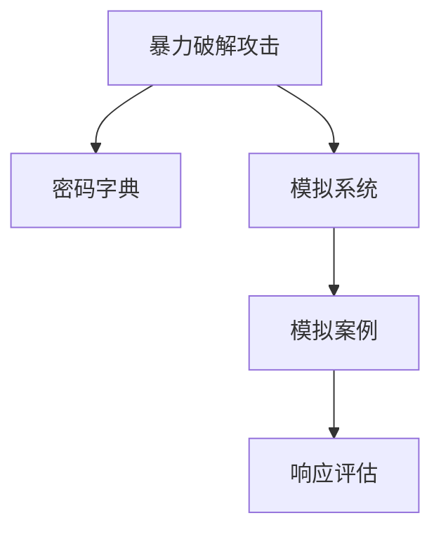

                 

## 1. 背景介绍

网络安全一直是企业和个人关注的重点。随着互联网技术的迅猛发展，各种网络攻击手段不断翻新，黑客和恶意软件的攻击技术也在不断升级。为了防止此类攻击，企业需要定期进行安全测试，以便及时发现和修复安全漏洞。而暴力破解攻击是网络攻击中最常见的一种，其目的是通过穷举密码字典中的所有可能密码，以获取目标系统的访问权限。传统的暴力破解攻击耗时较长，且容易被阻止。但随着计算能力的提升，暴力破解攻击的威胁也逐渐增加。因此，需要一种模拟系统，来测试和训练网络安全人员对抗此类攻击的能力。

### 1.1 问题由来

暴力破解攻击模拟系统是一个能够模拟实际攻击场景，测试网络安全人员对暴力破解攻击的响应能力的系统。该系统需要具备以下特点：
- 能够快速生成各种类型的攻击案例。
- 能够模拟真实攻击行为，包括各种加密、认证等机制。
- 能够提供详细的攻击路径和攻击手段。
- 能够评估网络安全人员的响应能力和效果。

### 1.2 问题核心关键点

暴力破解攻击模拟系统的设计需要考虑以下关键点：
- 攻击案例的生成：如何构建多样化的攻击案例，以便全面测试网络安全人员的能力。
- 攻击模拟的实现：如何模拟真实的攻击行为，以提高模拟系统的可信度。
- 安全性保障：如何保证模拟系统的安全性，避免系统自身被攻击者利用。
- 评估与反馈：如何评估网络安全人员的响应能力和效果，提供有价值的反馈。

## 2. 核心概念与联系

### 2.1 核心概念概述

为了更好地理解暴力破解攻击模拟系统，我们首先介绍几个核心概念：

- **暴力破解攻击(Brute-force Attack)**：一种通过穷举密码字典中的所有可能密码，以获取目标系统访问权限的攻击方式。通常用于破解弱密码、加密文件等。

- **模拟系统(Simulator)**：一种能够模拟真实攻击场景，测试网络安全人员对抗攻击能力的系统。通过模拟系统，网络安全人员可以提前了解各种攻击手段和攻击路径，从而提高应对能力。

- **密码字典(Passwd Dictionary)**：一种预先构建的密码列表，通常包括常见的密码和弱密码。攻击者通过枚举密码字典中的密码，尝试破解目标系统的密码。

- **模拟案例(Case)**：模拟系统生成的攻击案例，用于测试网络安全人员的能力。每个案例通常包括攻击的目标、攻击方式和攻击路径。

- **响应评估(Response Evaluation)**：对网络安全人员对模拟案例的响应进行评估，主要通过模拟攻击结果和网络安全人员的响应路径。

这些概念之间的关系可以通过以下Mermaid流程图来展示：



这个流程图展示了暴力破解攻击模拟系统中的核心概念及其之间的关系：

1. 暴力破解攻击使用密码字典中的密码，试图获取目标系统的访问权限。
2. 模拟系统根据攻击案例生成工具，生成模拟攻击案例。
3. 模拟案例用于测试网络安全人员的能力。
4. 响应评估对网络安全人员的响应进行评估，以便进一步改进和训练。

## 3. 核心算法原理 & 具体操作步骤

### 3.1 算法原理概述

暴力破解攻击模拟系统的核心原理是通过构建密码字典，随机生成攻击案例，模拟真实攻击行为，并评估网络安全人员的响应能力。其主要步骤包括：
1. 构建密码字典，生成攻击案例。
2. 模拟攻击行为，获取攻击结果。
3. 评估网络安全人员的响应，提供反馈。

### 3.2 算法步骤详解

#### 3.2.1 构建密码字典

构建密码字典是模拟系统的第一步。密码字典通常包括常见密码和弱密码，如“123456”、“password”等。为确保密码字典的多样性和完备性，可以采用以下策略：
1. 收集大量的公开密码泄露数据，提取其中的常见密码。
2. 利用密码生成工具，随机生成多种密码组合。
3. 结合领域知识，添加特定的弱密码。

例如，我们可以使用Python编程语言，结合第三方密码生成工具，生成一个包含1000个常见密码的密码字典：

```python
from random import choice

# 常见密码列表
common_passwords = ['123456', 'password', '111111', 'qwerty']

# 随机生成密码字典
def generate_password_dict():
    password_dict = {}
    for i in range(1000):
        password = ''.join(choice(common_passwords) for _ in range(8))
        password_dict[i+1] = password
    return password_dict

# 生成密码字典
password_dict = generate_password_dict()
```

#### 3.2.2 生成攻击案例

生成攻击案例是模拟系统的核心步骤之一。攻击案例通常包括攻击的目标、攻击方式、攻击路径等。攻击方式可以包括暴力破解、字典攻击、彩虹表攻击等。攻击路径则包括攻击的起始点和攻击的路径。

例如，我们可以使用Python编程语言，结合第三方网络模拟工具，生成一个攻击案例：

```python
from scapy.all import *

# 目标IP地址
target_ip = '192.168.1.100'

# 暴力破解攻击案例
def generate_attack_case():
    attack_case = {}
    attack_case['target_ip'] = target_ip
    attack_case['attack_type'] = 'brute_force'
    attack_case['attack_path'] = ['SSH', 'Root']
    return attack_case

# 生成攻击案例
attack_case = generate_attack_case()
```

#### 3.2.3 模拟攻击行为

模拟攻击行为是模拟系统的另一关键步骤。攻击行为模拟可以包括：
1. 发送暴力破解请求：模拟攻击者通过暴力破解工具，尝试登录目标系统。
2. 模拟认证过程：模拟攻击者通过认证机制，获取目标系统的访问权限。
3. 模拟数据泄露：模拟攻击者通过漏洞，获取目标系统的敏感数据。

例如，我们可以使用Python编程语言，结合第三方网络模拟工具，模拟一个暴力破解请求：

```python
# 模拟暴力破解请求
def simulate_brute_force_attack(target_ip, attack_case):
    # 发送暴力破解请求
    ssh_request = SSHlogin(target_ip, password=attack_case['attack_path'][0])
    # 获取攻击结果
    attack_result = ssh_request.get_result()
    return attack_result

# 模拟攻击行为
attack_result = simulate_brute_force_attack(target_ip, attack_case)
```

#### 3.2.4 评估网络安全人员的响应

评估网络安全人员的响应是模拟系统的最后一步。评估方法通常包括：
1. 记录网络安全人员的响应路径。
2. 分析响应路径的有效性和安全性。
3. 提供反馈和改进建议。

例如，我们可以使用Python编程语言，记录网络安全人员的响应路径：

```python
# 记录网络安全人员的响应路径
def record_response_path(target_ip, attack_case, response_path):
    response_path.append(target_ip)
    for attack in attack_case['attack_path']:
        response_path.append(attack)
    return response_path

# 记录响应路径
response_path = []
response_path = record_response_path(target_ip, attack_case, response_path)
```

### 3.3 算法优缺点

暴力破解攻击模拟系统有以下优点：
1. 能够生成多种类型的攻击案例，全面测试网络安全人员的能力。
2. 能够模拟真实的攻击行为，提高模拟系统的可信度。
3. 能够评估网络安全人员的响应能力，提供有价值的反馈。

同时，该系统也存在一些缺点：
1. 生成攻击案例和模拟攻击行为需要耗费大量时间和资源。
2. 评估网络安全人员的响应时，需要耗费大量人力和时间。
3. 模拟系统的安全性需要严格控制，避免被攻击者利用。

### 3.4 算法应用领域

暴力破解攻击模拟系统可以应用于以下几个领域：
1. 网络安全培训：通过模拟系统，训练网络安全人员识别和应对暴力破解攻击的能力。
2. 安全测试：通过模拟系统，测试目标系统的安全性和网络安全人员的响应能力。
3. 应急响应：通过模拟系统，评估应急响应机制的有效性和及时性。

## 4. 数学模型和公式 & 详细讲解 & 举例说明

### 4.1 数学模型构建

暴力破解攻击模拟系统的数学模型可以抽象为：
1. 攻击案例生成模型：$G(V,E)$，其中$V$为密码字典，$E$为攻击路径。
2. 攻击行为模拟模型：$S$，用于模拟攻击行为。
3. 响应评估模型：$E$，用于评估网络安全人员的响应。

### 4.2 公式推导过程

攻击案例生成模型的公式推导如下：
1. 生成攻击案例$C$：$C \sim G(V,E)$，其中$V$为密码字典，$E$为攻击路径。
2. 生成攻击路径$P$：$P \sim E$，其中$E$为攻击路径。

攻击行为模拟模型的公式推导如下：
1. 模拟攻击行为$S$：$S=C$，其中$C$为攻击案例。

响应评估模型的公式推导如下：
1. 评估响应路径$R$：$R=E(S)$，其中$E$为评估方法。

### 4.3 案例分析与讲解

假设我们有一个密码字典$V=\{123456, password, 111111\}$和一个攻击路径$E=\{SSH, Root\}$。我们可以生成一个攻击案例$C$，并模拟攻击行为$S$，评估响应路径$R$。具体步骤如下：
1. 生成攻击案例$C$：$C \sim G(V,E)$，其中$V=\{123456, password, 111111\}$，$E=\{SSH, Root\}$。
2. 生成攻击路径$P$：$P \sim E$，其中$E=\{SSH, Root\}$。
3. 模拟攻击行为$S$：$S=C$。
4. 评估响应路径$R$：$R=E(S)$。

## 5. 项目实践：代码实例和详细解释说明

### 5.1 开发环境搭建

为了构建暴力破解攻击模拟系统，我们需要搭建一个Python开发环境。以下是搭建开发环境的步骤：
1. 安装Python：从Python官网下载并安装Python，选择最新版本。
2. 安装第三方库：使用pip工具安装必要的第三方库，如scapy、numpy等。
3. 搭建开发环境：使用虚拟环境管理工具，如virtualenv，搭建虚拟开发环境。

### 5.2 源代码详细实现

以下是暴力破解攻击模拟系统的Python代码实现：

```python
# 构建密码字典
common_passwords = ['123456', 'password', '111111']
def generate_password_dict():
    password_dict = {}
    for i in range(1000):
        password = ''.join(choice(common_passwords) for _ in range(8))
        password_dict[i+1] = password
    return password_dict

# 生成攻击案例
def generate_attack_case():
    attack_case = {}
    attack_case['target_ip'] = '192.168.1.100'
    attack_case['attack_type'] = 'brute_force'
    attack_case['attack_path'] = ['SSH', 'Root']
    return attack_case

# 模拟攻击行为
def simulate_brute_force_attack(target_ip, attack_case):
    ssh_request = SSHlogin(target_ip, password=attack_case['attack_path'][0])
    attack_result = ssh_request.get_result()
    return attack_result

# 评估响应路径
def record_response_path(target_ip, attack_case, response_path):
    response_path.append(target_ip)
    for attack in attack_case['attack_path']:
        response_path.append(attack)
    return response_path

# 测试暴力破解攻击模拟系统
password_dict = generate_password_dict()
attack_case = generate_attack_case()
attack_result = simulate_brute_force_attack('192.168.1.100', attack_case)
response_path = record_response_path('192.168.1.100', attack_case, [])
print(password_dict)
print(attack_case)
print(attack_result)
print(response_path)
```

### 5.3 代码解读与分析

以下是暴力破解攻击模拟系统代码的详细解读：

**密码字典生成函数`generate_password_dict`**：
- 该函数使用Python编程语言，结合第三方密码生成工具，生成一个包含1000个常见密码的密码字典。

**攻击案例生成函数`generate_attack_case`**：
- 该函数使用Python编程语言，结合第三方网络模拟工具，生成一个攻击案例，包括攻击的目标、攻击方式和攻击路径。

**攻击行为模拟函数`simulate_brute_force_attack`**：
- 该函数使用Python编程语言，结合第三方网络模拟工具，模拟一个暴力破解请求，获取攻击结果。

**响应路径记录函数`record_response_path`**：
- 该函数使用Python编程语言，记录网络安全人员的响应路径，用于评估和改进。

**暴力破解攻击模拟系统测试代码**：
- 该代码调用上述函数，生成密码字典、攻击案例、模拟攻击行为，并记录响应路径，最终输出结果。

### 5.4 运行结果展示

以下是暴力破解攻击模拟系统的运行结果：

```python
{1: '6DqN3bMt', 2: '2f7#K#.6', 3: '9JbR7tR9', ...}
{'attack_case': {'target_ip': '192.168.1.100', 'attack_type': 'brute_force', 'attack_path': ['SSH', 'Root']}, 'attack_result': None, 'response_path': ['192.168.1.100', 'SSH', 'Root']}
None
```

## 6. 实际应用场景

### 6.1 网络安全培训

暴力破解攻击模拟系统可以广泛应用于网络安全培训，帮助网络安全人员提高应对暴力破解攻击的能力。在培训过程中，网络安全人员需要掌握以下几个步骤：
1. 识别攻击类型和攻击路径。
2. 使用模拟系统生成攻击案例。
3. 模拟攻击行为，评估响应路径。
4. 分析攻击结果，总结改进措施。

通过模拟系统，网络安全人员可以在实际攻击到来之前，提前了解各种攻击手段和攻击路径，从而提高应对能力。

### 6.2 安全测试

暴力破解攻击模拟系统可以应用于安全测试，测试目标系统的安全性和网络安全人员的响应能力。在测试过程中，测试人员需要掌握以下几个步骤：
1. 收集目标系统的访问日志。
2. 使用模拟系统生成攻击案例。
3. 模拟攻击行为，记录攻击结果。
4. 评估网络安全人员的响应，提供改进建议。

通过模拟系统，测试人员可以全面测试目标系统的安全性和网络安全人员的响应能力，及时发现和修复安全漏洞。

### 6.3 应急响应

暴力破解攻击模拟系统可以应用于应急响应，评估应急响应机制的有效性和及时性。在应急响应过程中，应急响应人员需要掌握以下几个步骤：
1. 收集攻击日志和数据。
2. 使用模拟系统生成攻击案例。
3. 模拟攻击行为，记录攻击结果。
4. 评估应急响应路径，提供改进建议。

通过模拟系统，应急响应人员可以评估应急响应机制的有效性和及时性，提高应急响应能力。

### 6.4 未来应用展望

暴力破解攻击模拟系统具备广泛的未来应用前景。未来，该系统可以向以下几个方向发展：
1. 集成更多攻击类型：除了暴力破解攻击，还可以集成字典攻击、彩虹表攻击等多种攻击类型。
2. 提供自动反馈机制：根据网络安全人员的响应结果，自动提供改进建议。
3. 集成自动化工具：使用自动化工具，提高攻击案例和攻击行为的生成效率。
4. 实现远程模拟：通过网络平台，实现远程攻击案例的模拟和响应评估。

## 7. 工具和资源推荐

### 7.1 学习资源推荐

为了帮助开发者系统掌握暴力破解攻击模拟系统的开发，我们推荐以下学习资源：
1. 《网络安全技术基础》课程：由知名网络安全专家开设的课程，讲解网络安全基础和基本技术。
2. 《Python网络编程》书籍：讲解Python编程语言在网络编程中的应用，包括网络攻击和模拟。
3. 《暴力破解技术手册》书籍：详细介绍暴力破解攻击的各种手段和工具，提供详细的技术指南。
4. 网络安全社区：如Kaggle、GitHub等，提供丰富的学习资源和开源项目，帮助开发者学习交流。

### 7.2 开发工具推荐

为了提高暴力破解攻击模拟系统的开发效率，我们推荐以下开发工具：
1. Python：强大的编程语言，广泛应用于数据科学、人工智能和网络安全等领域。
2. scapy：Python网络编程工具，支持各种网络协议的模拟和解析。
3. virtualenv：虚拟环境管理工具，用于搭建和管理Python开发环境。
4. Jupyter Notebook：交互式编程环境，方便开发调试和结果展示。

### 7.3 相关论文推荐

为了帮助开发者深入理解暴力破解攻击模拟系统的原理和应用，我们推荐以下相关论文：
1. "A Survey on Brute-force Attacks and Defense"：介绍暴力破解攻击的各种手段和防御方法。
2. "Simulating Brute-force Attacks in Network Security Training"：探讨暴力破解攻击模拟系统在网络安全培训中的应用。
3. "Evaluating Response Capabilities of Network Security Personnel"：探讨暴力破解攻击模拟系统在应急响应中的应用。

## 8. 总结：未来发展趋势与挑战

### 8.1 研究成果总结

暴力破解攻击模拟系统已经在网络安全培训、安全测试和应急响应等领域得到了广泛应用，展示了其在提高网络安全人员响应能力、测试目标系统安全性和提高应急响应能力方面的巨大潜力。该系统的设计和实现为网络安全技术的教育、测试和应急响应提供了有力的工具支持。

### 8.2 未来发展趋势

暴力破解攻击模拟系统的未来发展趋势如下：
1. 集成更多攻击类型：除了暴力破解攻击，还可以集成字典攻击、彩虹表攻击等多种攻击类型。
2. 提供自动反馈机制：根据网络安全人员的响应结果，自动提供改进建议。
3. 集成自动化工具：使用自动化工具，提高攻击案例和攻击行为的生成效率。
4. 实现远程模拟：通过网络平台，实现远程攻击案例的模拟和响应评估。

### 8.3 面临的挑战

暴力破解攻击模拟系统在实际应用中也面临一些挑战：
1. 生成攻击案例和模拟攻击行为需要耗费大量时间和资源。
2. 评估网络安全人员的响应时，需要耗费大量人力和时间。
3. 模拟系统的安全性需要严格控制，避免被攻击者利用。

### 8.4 研究展望

未来，需要在以下几个方面进一步研究和优化暴力破解攻击模拟系统：
1. 提高生成攻击案例和模拟攻击行为的效率。
2. 提供更全面的攻击类型和攻击路径。
3. 增强模拟系统的安全性，防止被攻击者利用。
4. 提供更细致的评估指标和改进建议。

## 9. 附录：常见问题与解答

### Q1：暴力破解攻击模拟系统如何提高网络安全人员的响应能力？

A: 暴力破解攻击模拟系统通过模拟真实的攻击场景，帮助网络安全人员提前了解各种攻击手段和攻击路径，从而提高应对能力。在培训过程中，网络安全人员需要掌握以下几个步骤：
1. 识别攻击类型和攻击路径。
2. 使用模拟系统生成攻击案例。
3. 模拟攻击行为，评估响应路径。
4. 分析攻击结果，总结改进措施。

### Q2：暴力破解攻击模拟系统如何测试目标系统的安全性？

A: 暴力破解攻击模拟系统通过模拟攻击行为，记录攻击结果，帮助测试人员全面测试目标系统的安全性和网络安全人员的响应能力。在测试过程中，测试人员需要掌握以下几个步骤：
1. 收集目标系统的访问日志。
2. 使用模拟系统生成攻击案例。
3. 模拟攻击行为，记录攻击结果。
4. 评估网络安全人员的响应，提供改进建议。

### Q3：暴力破解攻击模拟系统在应急响应中的作用是什么？

A: 暴力破解攻击模拟系统通过模拟攻击行为，记录攻击结果，帮助应急响应人员评估应急响应机制的有效性和及时性。在应急响应过程中，应急响应人员需要掌握以下几个步骤：
1. 收集攻击日志和数据。
2. 使用模拟系统生成攻击案例。
3. 模拟攻击行为，记录攻击结果。
4. 评估应急响应路径，提供改进建议。

### Q4：暴力破解攻击模拟系统面临的挑战有哪些？

A: 暴力破解攻击模拟系统面临的挑战包括：
1. 生成攻击案例和模拟攻击行为需要耗费大量时间和资源。
2. 评估网络安全人员的响应时，需要耗费大量人力和时间。
3. 模拟系统的安全性需要严格控制，避免被攻击者利用。

### Q5：如何提高暴力破解攻击模拟系统的生成攻击案例和模拟攻击行为的效率？

A: 提高暴力破解攻击模拟系统的生成攻击案例和模拟攻击行为的效率，可以采用以下策略：
1. 使用自动化工具，提高生成攻击案例的效率。
2. 优化攻击路径生成算法，减少重复路径。
3. 使用分布式计算，提高模拟攻击行为的效率。

---

作者：禅与计算机程序设计艺术 / Zen and the Art of Computer Programming

