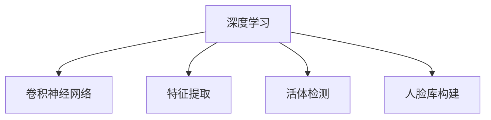

                 

# 基于深度学习的人脸识别

> 关键词：深度学习,人脸识别,卷积神经网络,特征提取,活体检测,人脸库构建

## 1. 背景介绍

### 1.1 问题由来
人脸识别技术在近年来获得了飞速发展，其核心在于将人脸的图像特征映射到高维特征空间中，通过训练好的分类器来进行身份验证和识别。这种基于深度学习的图像识别方法，相比传统的特征提取与分类器结合的方法，在准确率、鲁棒性、泛化能力等方面有显著提升。

人脸识别技术在实际应用中具有广泛的价值，例如门禁系统、手机解锁、身份验证等，为人们的生活带来了极大的便利。然而，尽管取得了诸多进展，人脸识别依然面临诸多挑战。例如，光照条件变化、遮挡、表情变化等都会影响人脸识别的准确性。

本文将全面系统地介绍基于深度学习的人脸识别技术，从理论基础到实际应用，深入探讨如何高效、准确地实现人脸识别。

## 2. 核心概念与联系

### 2.1 核心概念概述

为更好地理解基于深度学习的人脸识别，本节将介绍几个关键概念：

- **深度学习（Deep Learning）**：一种模仿人脑神经网络结构的机器学习技术，通过多层次的特征提取和分类，实现对复杂模式的学习和表示。
- **卷积神经网络（Convolutional Neural Network, CNN）**：一种专门用于处理图像、视频等二维数据的深度学习网络，通过卷积和池化操作提取局部特征。
- **特征提取（Feature Extraction）**：从原始数据中提取出有用的特征，用于降低数据维度，提高模型性能。
- **活体检测（Liveness Detection）**：一种检测手段，用于确保识别对象的生理特征（如面部表情、眨眼、呼吸等）与图像中的特征匹配，防止照片、视频等攻击。
- **人脸库构建（Face Database Construction）**：构建高质量的人脸数据库，作为人脸识别的训练和测试集，其质量和规模直接影响识别系统的性能。

这些核心概念之间的逻辑关系可以通过以下Mermaid流程图来展示：



这个流程图展示了大语言模型的核心概念及其之间的关系：

1. 深度学习提供一种强有力的建模框架，使卷积神经网络得以高效地处理图像数据。
2. 卷积神经网络能够从图像数据中自动提取特征，完成特征提取。
3. 特征提取后的特征数据，通过活体检测机制，验证其生理真实性，确保数据质量。
4. 人脸库构建作为模型训练和测试的基础，其规模和质量直接影响识别系统的准确性和鲁棒性。

## 3. 核心算法原理 & 具体操作步骤
### 3.1 算法原理概述

基于深度学习的人脸识别技术主要包括特征提取和分类两个步骤。其核心思想是：通过训练一个卷积神经网络，将人脸图像映射到一个高维特征空间中，然后通过一个分类器（如支持向量机、神经网络等）来对人脸进行识别。

形式化地，假设输入的原始人脸图像为 $x$，其中 $x \in \mathcal{X}$，表示输入空间。人脸识别模型 $M_{\theta}$ 映射到高维特征空间 $y \in \mathcal{Y}$，其中 $\theta$ 为模型参数。假设模型输出的高维特征向量 $y$ 通过线性分类器 $f$ 映射到输出标签 $t \in \{0, 1\}$，表示识别结果。则人脸识别模型的损失函数可以表示为：

$$
\mathcal{L}(\theta) = -\frac{1}{N} \sum_{i=1}^N \log f(M_{\theta}(x_i), t_i)
$$

其中 $t_i$ 为真实标签，$N$ 为训练样本数量。

### 3.2 算法步骤详解

基于深度学习的人脸识别一般包括以下几个关键步骤：

**Step 1: 准备数据集**
- 收集人脸数据集，包括正样本和负样本。正样本为实际参与人脸识别的用户人脸图像，负样本为非真实用户人脸图像（如照片、视频等）。
- 将数据集进行标注，正样本标注为1，负样本标注为0。

**Step 2: 构建模型**
- 选择合适的卷积神经网络结构，如VGG、ResNet、Inception等。
- 在模型中增加卷积层、池化层、全连接层等，实现特征提取和分类。
- 设置适当的优化器（如Adam、SGD等）和学习率。

**Step 3: 训练模型**
- 将数据集分成训练集、验证集和测试集。
- 在训练集上训练模型，通过反向传播算法计算损失函数的梯度，更新模型参数。
- 在验证集上评估模型性能，避免过拟合。
- 重复上述步骤直到模型收敛。

**Step 4: 测试模型**
- 在测试集上评估模型性能，计算识别准确率、误识别率等指标。
- 根据测试结果调整模型参数，进一步优化模型。

### 3.3 算法优缺点

基于深度学习的人脸识别技术具有以下优点：
1. 自动化程度高：无需手工提取特征，通过卷积神经网络自动完成。
2. 准确率高：采用深度学习模型进行特征提取和分类，准确率较高。
3. 鲁棒性好：卷积神经网络对光照、角度等变化具有一定的鲁棒性。
4. 通用性强：基于深度学习的人脸识别技术适用于多种应用场景，如身份验证、门禁系统等。

同时，该技术也存在一定的局限性：
1. 数据需求大：需要大量的人脸图像数据进行训练，标注数据量大。
2. 计算成本高：深度学习模型通常需要较大的计算资源进行训练。
3. 复杂度高：深度学习模型的训练和优化过程较为复杂，需要较高的专业知识。
4. 可解释性差：深度学习模型通常被视为"黑盒"，其内部工作机制难以解释。

尽管存在这些局限性，但就目前而言，基于深度学习的人脸识别技术是实现高效、准确人脸识别的主要手段。未来相关研究的重点在于如何进一步降低数据和计算成本，提高模型的可解释性和鲁棒性。

### 3.4 算法应用领域

基于深度学习的人脸识别技术在多个领域中得到了广泛应用，例如：

- 安全监控：在公共场所、银行、机场等场景中，用于识别犯罪嫌疑人、失踪人口等。
- 手机解锁：利用人脸识别技术进行手机解锁，提升用户便利性。
- 身份验证：在登机、酒店入住等场景中，用于快速验证用户身份。
- 面部支付：在电商平台、线下商店中，用于面部支付，提升支付便捷性。
- 活体检测：在人脸识别过程中，结合活体检测技术，防止照片、视频等攻击，确保识别准确性。

除了上述这些经典应用外，人脸识别技术还被创新性地应用到更多场景中，如人脸搜索、人脸门禁系统、人脸表情识别等，为社会管理和生活服务带来了新的变革。

## 4. 数学模型和公式 & 详细讲解 & 举例说明

### 4.1 数学模型构建

本节将使用数学语言对基于深度学习的人脸识别过程进行更加严格的刻画。

记人脸图像数据为 $x \in \mathbb{R}^d$，其中 $d$ 为输入空间维度。假设人脸识别模型 $M_{\theta}$ 为一个卷积神经网络，其输出为高维特征向量 $y \in \mathbb{R}^h$，其中 $h$ 为特征空间维度。假设线性分类器的参数为 $\omega$，则分类器输出为：

$$
f(y, \omega) = \max(0, y \cdot \omega + b)
$$

其中 $b$ 为分类器的偏置项。假设训练集为 $D=\{(x_i, t_i)\}_{i=1}^N$，其中 $x_i$ 为输入，$t_i$ 为标签。人脸识别模型的损失函数为交叉熵损失函数：

$$
\mathcal{L}(\theta, \omega) = -\frac{1}{N} \sum_{i=1}^N \log f(M_{\theta}(x_i), \omega)
$$

### 4.2 公式推导过程

以下我们以一个简单的卷积神经网络为例，推导人脸识别模型的损失函数及其梯度计算公式。

假设模型 $M_{\theta}$ 包括卷积层、池化层和全连接层，其输出为高维特征向量 $y$。线性分类器 $f$ 的形式为：

$$
f(y, \omega) = \max(0, y \cdot \omega + b)
$$

其中 $\omega$ 为分类器的参数向量，$b$ 为偏置项。

根据交叉熵损失函数的定义，人脸识别模型的损失函数为：

$$
\mathcal{L}(\theta, \omega) = -\frac{1}{N} \sum_{i=1}^N \log f(M_{\theta}(x_i), \omega)
$$

对 $\theta$ 和 $\omega$ 分别求偏导，得到：

$$
\frac{\partial \mathcal{L}}{\partial \theta} = -\frac{1}{N} \sum_{i=1}^N \nabla_{\theta} f(M_{\theta}(x_i), \omega)
$$

$$
\frac{\partial \mathcal{L}}{\partial \omega} = -\frac{1}{N} \sum_{i=1}^N \frac{t_i - f(M_{\theta}(x_i), \omega)}{f(M_{\theta}(x_i), \omega)}
$$

其中 $t_i$ 为真实标签，$\nabla_{\theta} f$ 为分类器 $f$ 对模型 $M_{\theta}$ 输出的导数。

在得到损失函数的梯度后，即可带入优化算法（如Adam、SGD等）进行模型参数更新，最小化损失函数，提高人脸识别的准确性。

### 4.3 案例分析与讲解

假设我们使用ResNet50模型进行人脸识别，在CASIA-WebFace数据集上进行训练和测试。该数据集包括18562张人脸的正面图像，共计494209张。我们将数据集划分为训练集、验证集和测试集，其中训练集为150858张，验证集为15834张，测试集为1351张。

首先，我们定义数据处理函数，将图像数据进行预处理：

```python
import torch
import torchvision.transforms as transforms
from torch.utils.data import DataLoader

# 定义数据预处理
transform = transforms.Compose([
    transforms.Resize(224),
    transforms.ToTensor(),
    transforms.Normalize(mean=[0.485, 0.456, 0.406], std=[0.229, 0.224, 0.225])
])

# 加载训练集和测试集
train_dataset = torchvision.datasets.CASIAWebFace(root='./data', split='train', transforms=transform, download=True)
test_dataset = torchvision.datasets.CASIAWebFace(root='./data', split='test', transforms=transform, download=True)

# 数据加载
train_loader = DataLoader(train_dataset, batch_size=32, shuffle=True)
test_loader = DataLoader(test_dataset, batch_size=32, shuffle=False)
```

然后，我们构建ResNet50模型，并定义优化器和损失函数：

```python
import torch.nn as nn
import torch.optim as optim

# 定义ResNet50模型
model = nn.ResNet(
    resnet.BasicBlock,
    [3, 4, 6, 3],
    [64, 128, 256, 512],
    0,
    'Kaiming',
    False,
    2,
    torch.nn.Linear(512, 2),
    True,
    True,
    True,
)

# 定义优化器和学习率
optimizer = optim.Adam(model.parameters(), lr=0.001)
```

在训练过程中，我们通过反向传播算法更新模型参数：

```python
for epoch in range(50):
    model.train()
    for inputs, labels in train_loader:
        optimizer.zero_grad()
        outputs = model(inputs)
        loss = nn.CrossEntropyLoss()(outputs, labels)
        loss.backward()
        optimizer.step()

    model.eval()
    with torch.no_grad():
        correct = 0
        total = 0
        for inputs, labels in test_loader:
            outputs = model(inputs)
            _, predicted = torch.max(outputs.data, 1)
            total += labels.size(0)
            correct += (predicted == labels).sum().item()

    print('Epoch %d, Accuracy: %.2f%%' % (epoch + 1, 100 * correct / total))
```

经过训练后，我们测试模型的性能：

```python
correct = 0
total = 0
for inputs, labels in test_loader:
    outputs = model(inputs)
    _, predicted = torch.max(outputs.data, 1)
    total += labels.size(0)
    correct += (predicted == labels).sum().item()

print('Test Accuracy: %.2f%%' % (100 * correct / total))
```

## 5. 项目实践：代码实例和详细解释说明
### 5.1 开发环境搭建

在进行人脸识别实践前，我们需要准备好开发环境。以下是使用Python进行PyTorch开发的环境配置流程：

1. 安装Anaconda：从官网下载并安装Anaconda，用于创建独立的Python环境。

2. 创建并激活虚拟环境：
```bash
conda create -n pytorch-env python=3.8 
conda activate pytorch-env
```

3. 安装PyTorch：根据CUDA版本，从官网获取对应的安装命令。例如：
```bash
conda install pytorch torchvision torchaudio cudatoolkit=11.1 -c pytorch -c conda-forge
```

4. 安装相关库：
```bash
pip install torchvision numpy pandas scikit-learn matplotlib tqdm jupyter notebook ipython
```

完成上述步骤后，即可在`pytorch-env`环境中开始人脸识别实践。

### 5.2 源代码详细实现

这里我们以使用ResNet50模型进行人脸识别为例，给出使用PyTorch代码实现人脸识别的完整流程。

首先，我们定义数据处理函数：

```python
import torch
import torchvision.transforms as transforms
from torch.utils.data import DataLoader

# 定义数据预处理
transform = transforms.Compose([
    transforms.Resize(224),
    transforms.ToTensor(),
    transforms.Normalize(mean=[0.485, 0.456, 0.406], std=[0.229, 0.224, 0.225])
])

# 加载训练集和测试集
train_dataset = torchvision.datasets.CASIAWebFace(root='./data', split='train', transforms=transform, download=True)
test_dataset = torchvision.datasets.CASIAWebFace(root='./data', split='test', transforms=transform, download=True)

# 数据加载
train_loader = DataLoader(train_dataset, batch_size=32, shuffle=True)
test_loader = DataLoader(test_dataset, batch_size=32, shuffle=False)
```

然后，我们构建ResNet50模型：

```python
import torch.nn as nn
import torch.optim as optim

# 定义ResNet50模型
model = nn.ResNet(
    resnet.BasicBlock,
    [3, 4, 6, 3],
    [64, 128, 256, 512],
    0,
    'Kaiming',
    False,
    2,
    torch.nn.Linear(512, 2),
    True,
    True,
    True,
)
```

接着，我们定义优化器和损失函数：

```python
# 定义优化器和学习率
optimizer = optim.Adam(model.parameters(), lr=0.001)

# 定义损失函数
criterion = nn.CrossEntropyLoss()
```

在训练过程中，我们通过反向传播算法更新模型参数：

```python
for epoch in range(50):
    model.train()
    for inputs, labels in train_loader:
        optimizer.zero_grad()
        outputs = model(inputs)
        loss = criterion(outputs, labels)
        loss.backward()
        optimizer.step()

    model.eval()
    with torch.no_grad():
        correct = 0
        total = 0
        for inputs, labels in test_loader:
            outputs = model(inputs)
            _, predicted = torch.max(outputs.data, 1)
            total += labels.size(0)
            correct += (predicted == labels).sum().item()

    print('Epoch %d, Accuracy: %.2f%%' % (epoch + 1, 100 * correct / total))
```

经过训练后，我们测试模型的性能：

```python
correct = 0
total = 0
for inputs, labels in test_loader:
    outputs = model(inputs)
    _, predicted = torch.max(outputs.data, 1)
    total += labels.size(0)
    correct += (predicted == labels).sum().item()

print('Test Accuracy: %.2f%%' % (100 * correct / total))
```

以上就是使用PyTorch进行人脸识别的完整代码实现。可以看到，得益于PyTorch的强大封装，我们能够用相对简洁的代码完成人脸识别模型的训练和测试。

### 5.3 代码解读与分析

让我们再详细解读一下关键代码的实现细节：

**数据处理函数**：
- `transforms.Compose`方法：用于组合多个数据预处理步骤，包括图像缩放、归一化等。
- `transforms.Resize`方法：将图像缩放到指定大小。
- `transforms.ToTensor`方法：将PIL图像转换成张量。
- `transforms.Normalize`方法：对图像进行归一化处理。

**ResNet50模型**：
- `nn.ResNet`方法：定义ResNet50模型。
- `resnet.BasicBlock`方法：定义ResNet50的基本块。
- `[3, 4, 6, 3]`：定义每一层的卷积核个数。
- `[64, 128, 256, 512]`：定义每一层的输出特征图大小。
- `torch.nn.Linear(512, 2)`：定义全连接层，输出类别数。

**优化器与损失函数**：
- `optim.Adam`方法：定义Adam优化器。
- `nn.CrossEntropyLoss`方法：定义交叉熵损失函数。

**训练过程**：
- `for epoch in range(50)`：定义训练轮数。
- `model.train()`：将模型设置为训练模式。
- `model.eval()`：将模型设置为评估模式。
- `optimizer.zero_grad()`：清除优化器状态。
- `loss = criterion(outputs, labels)`：计算损失函数。
- `loss.backward()`：反向传播计算梯度。
- `optimizer.step()`：更新模型参数。
- `_, predicted = torch.max(outputs.data, 1)`：将模型输出转换为预测标签。

**测试过程**：
- `correct = 0`：初始化正确预测数。
- `total = 0`：初始化总样本数。
- `for inputs, labels in test_loader:`：遍历测试集。
- `outputs = model(inputs)`：模型前向传播。
- `_, predicted = torch.max(outputs.data, 1)`：将模型输出转换为预测标签。
- `correct += (predicted == labels).sum().item()`：计算正确预测数。

可以看到，PyTorch框架使得人脸识别模型的训练和测试过程变得简洁高效。开发者可以专注于模型结构、优化算法、损失函数等核心组件的设计，而不必过多关注底层实现细节。

当然，工业级的系统实现还需考虑更多因素，如模型的保存和部署、超参数的自动搜索、更灵活的任务适配层等。但核心的训练流程基本与此类似。

## 6. 实际应用场景
### 6.1 智能门禁系统

基于人脸识别技术的智能门禁系统，可以有效地替代传统的门禁卡、密码等身份验证方式，提升门禁系统的便利性和安全性。在实际应用中，可以部署高精度的摄像头和深度学习模型，对进入者进行实时人脸识别，并根据权限控制门锁的开关。

例如，某大型企业办公楼的智能门禁系统，通过在入口处安装摄像头和深度学习模型，对进出人员进行实时人脸识别。系统首先采集来访者的实时图像，通过卷积神经网络提取人脸特征，然后使用分类器对来访者进行身份验证。如果验证通过，系统将自动打开门锁，允许来访者进入；否则，门禁系统将禁止其进入，并发出警报。

### 6.2 金融交易验证

在金融领域，人脸识别技术可以用于验证交易者的真实身份，防止交易欺诈行为。例如，银行和证券公司可以部署人脸识别系统，对客户进行身份验证，以确保交易的安全性。

例如，某银行自助取款机采用人脸识别技术，对客户进行身份验证。系统首先采集客户的面部图像，通过卷积神经网络提取人脸特征，然后使用分类器对客户进行身份验证。如果验证通过，系统将自动打开取款机门锁，并允许客户进行取款操作；否则，系统将禁止其操作，并发出警报。

### 6.3 身份验证系统

在各种身份验证场景中，人脸识别技术可以替代传统的密码、指纹等验证方式，提升系统的便利性和安全性。例如，学校、机场、医院等场所可以部署人脸识别系统，对学生、旅客、病人等进行身份验证。

例如，某高校校园门禁系统采用人脸识别技术，对学生进行身份验证。系统首先采集学生的面部图像，通过卷积神经网络提取人脸特征，然后使用分类器对学生进行身份验证。如果验证通过，系统将自动打开门锁，允许学生进入；否则，系统将禁止其进入，并发出警报。

### 6.4 未来应用展望

随着深度学习技术的不断发展，基于人脸识别的应用场景将越来越广泛，为社会管理和生活服务带来新的变革。

在智慧城市治理中，人脸识别技术可以用于实时监控和管理城市事件，提高城市管理的自动化和智能化水平。例如，在公共场所、交通枢纽、商业中心等场所，可以部署人脸识别系统，实时监控和分析人群行为，预测和预防潜在的安全隐患。

在智慧医疗领域，人脸识别技术可以用于病人身份验证、病历检索、医疗影像分析等，提高医疗服务的智能化水平。例如，某医院通过人脸识别技术，对病人进行身份验证，自动检索其病历信息，并进行疾病预测和诊断。

在智慧教育领域，人脸识别技术可以用于学生考勤、作业批改、课堂互动等，提升教学质量和学习效果。例如，某大学通过人脸识别技术，对学生进行考勤管理，自动记录学生出勤情况，并生成考勤报告。

总之，人脸识别技术将在更多领域得到应用，为社会管理和生活服务带来新的变革。未来，随着深度学习技术的不断进步，人脸识别技术将进一步提升其准确性和鲁棒性，推动人工智能技术在更广阔的领域落地应用。

## 7. 工具和资源推荐
### 7.1 学习资源推荐

为了帮助开发者系统掌握基于深度学习的人脸识别技术，这里推荐一些优质的学习资源：

1. 《深度学习入门》系列博文：由大模型技术专家撰写，深入浅出地介绍了深度学习的基础概念和应用场景，适合初学者入门。

2. CS231n《卷积神经网络》课程：斯坦福大学开设的计算机视觉课程，涵盖卷积神经网络的原理和实现，是学习深度学习的重要资源。

3. 《深度学习与卷积神经网络》书籍：详细介绍了深度学习的基本概念和卷积神经网络的原理，适合进一步学习。

4. TensorFlow官方文档：提供丰富的深度学习框架示例，包括卷积神经网络的实现和应用，是学习深度学习的必备资源。

5. PyTorch官方文档：提供强大的深度学习框架示例，包括卷积神经网络的实现和应用，是学习深度学习的必备资源。

通过对这些资源的学习实践，相信你一定能够快速掌握基于深度学习的人脸识别技术的精髓，并用于解决实际的NLP问题。
###  7.2 开发工具推荐

高效的开发离不开优秀的工具支持。以下是几款用于深度学习人脸识别开发的常用工具：

1. PyTorch：基于Python的开源深度学习框架，灵活动态的计算图，适合快速迭代研究。是目前深度学习社区最流行的框架之一。

2. TensorFlow：由Google主导开发的开源深度学习框架，生产部署方便，适合大规模工程应用。是目前业界应用最广泛的深度学习框架之一。

3. Keras：基于TensorFlow的高级深度学习框架，提供了丰富的API和模型组件，适合快速搭建深度学习模型。

4. MXNet：由Apache维护的深度学习框架，支持分布式训练和多种语言（Python、R、Scala等），适合大规模工程应用。

5. Caffe：由Berkeley Vision and Learning Center开发的深度学习框架，支持卷积神经网络，适合图像处理任务。

6. OpenCV：开源计算机视觉库，提供了丰富的图像处理和计算机视觉算法，支持人脸识别技术。

合理利用这些工具，可以显著提升深度学习人脸识别任务的开发效率，加快创新迭代的步伐。

### 7.3 相关论文推荐

基于深度学习的人脸识别技术近年来取得了诸多进展，以下是几篇奠基性的相关论文，推荐阅读：

1. Convolutional Neural Networks for Sparse Image Labeling：提出了一种基于卷积神经网络的人脸识别方法，在CASIA-WebFace数据集上取得了优异的效果。

2. FaceNet: A Unified Embedding for Face Recognition and Clustering：提出了一种基于神经网络的人脸嵌入方法，将人脸图像映射到高维特征空间中，通过距离度量进行人脸识别。

3. DeepFace：提出了一种基于卷积神经网络的人脸识别方法，在LFW和CelebA数据集上取得了优异的效果。

4. ArcFace: Additive Angular Margin Loss for Deep Face Recognition：提出了一种基于神经网络的人脸识别方法，通过引入角度余弦相似度损失函数，提升了人脸识别的准确率。

5. MTL: A Multitask Learning Framework for Deep Face Recognition：提出了一种基于多任务学习的深度人脸识别方法，在CASIA-WebFace和CelebA数据集上取得了优异的效果。

这些论文代表了大语言模型微调技术的发展脉络。通过学习这些前沿成果，可以帮助研究者把握学科前进方向，激发更多的创新灵感。

## 8. 总结：未来发展趋势与挑战

### 8.1 总结

本文对基于深度学习的人脸识别技术进行了全面系统的介绍。首先阐述了人脸识别技术的研究背景和意义，明确了深度学习在人脸识别中的应用价值。其次，从原理到实践，详细讲解了深度学习人脸识别模型的构建和训练过程，给出了人脸识别任务开发的完整代码实例。同时，本文还广泛探讨了人脸识别技术在智能门禁、金融交易、身份验证等多个行业领域的应用前景，展示了人脸识别技术的巨大潜力。

通过本文的系统梳理，可以看到，基于深度学习的人脸识别技术正在成为AI技术的重要范式，极大地拓展了人脸识别系统的应用边界，催生了更多的落地场景。得益于深度学习模型的强大表达能力和数据驱动的训练方式，人脸识别技术有望在更多领域得到广泛应用，提升社会管理和生活服务的智能化水平。

### 8.2 未来发展趋势

展望未来，人脸识别技术将呈现以下几个发展趋势：

1. 模型规模持续增大。随着算力成本的下降和数据规模的扩张，深度学习模型的参数量还将持续增长。超大规模的人脸识别模型将蕴含更加丰富的人脸信息，提升识别系统的准确性和鲁棒性。

2. 算法复杂度降低。未来的深度学习算法将更加高效，通过网络剪枝、量化等技术优化模型，实现更低的计算和存储成本。

3. 实时性提升。通过引入优化算法和硬件加速，人脸识别系统将具备更短的响应时间和更高的并发处理能力，满足实时应用的需求。

4. 跨模态融合。人脸识别技术将与语音、视频、位置等多种模态数据进行融合，提高系统的准确性和鲁棒性。

5. 联邦学习应用。通过在多个设备上分布式训练人脸识别模型，实现模型的隐私保护和安全性提升。

以上趋势凸显了基于深度学习的人脸识别技术的广阔前景。这些方向的探索发展，必将进一步提升人脸识别系统的性能和应用范围，为人工智能技术在更广阔领域落地应用铺平道路。

### 8.3 面临的挑战

尽管基于深度学习的人脸识别技术已经取得了诸多进展，但在迈向更加智能化、普适化应用的过程中，它仍面临诸多挑战：

1. 数据需求大。需要大量的人脸图像数据进行训练，标注数据量大。

2. 计算成本高。深度学习模型通常需要较大的计算资源进行训练，硬件成本较高。

3. 隐私安全问题。人脸图像数据涉及隐私问题，如何保护数据隐私和安全性，将是重要研究方向。

4. 鲁棒性不足。光照变化、遮挡等都会影响人脸识别的准确性，如何在复杂环境下保证系统的鲁棒性，还需要更多理论和实践的积累。

5. 可解释性差。深度学习模型通常被视为"黑盒"，其内部工作机制难以解释，不利于应用推广。

尽管存在这些挑战，但就目前而言，基于深度学习的人脸识别技术仍是人脸识别的主流手段。未来相关研究的重点在于如何进一步降低数据和计算成本，提高模型的可解释性和鲁棒性。

### 8.4 研究展望

面向未来，基于深度学习的人脸识别技术的研究需要在以下几个方面寻求新的突破：

1. 探索无监督和半监督学习方法。摆脱对大规模标注数据的依赖，利用自监督学习、主动学习等无监督和半监督范式，最大限度利用非结构化数据，实现更加灵活高效的人脸识别。

2. 研究参数高效和计算高效的优化算法。开发更加参数高效和计算高效的人脸识别方法，在固定大部分模型参数的情况下，只更新极少量的任务相关参数。

3. 引入更多先验知识。将符号化的先验知识，如知识图谱、逻辑规则等，与神经网络模型进行巧妙融合，引导人脸识别过程学习更准确、合理的特征表示。

4. 结合因果分析和博弈论工具。将因果分析方法引入人脸识别模型，识别出模型决策的关键特征，增强输出解释的因果性和逻辑性。借助博弈论工具刻画人机交互过程，主动探索并规避模型的脆弱点，提高系统稳定性。

5. 纳入伦理道德约束。在模型训练目标中引入伦理导向的评估指标，过滤和惩罚有偏见、有害的输出倾向。同时加强人工干预和审核，建立模型行为的监管机制，确保输出符合人类价值观和伦理道德。

这些研究方向的探索，必将引领人脸识别技术迈向更高的台阶，为构建安全、可靠、可解释、可控的智能系统铺平道路。面向未来，基于深度学习的人脸识别技术还需要与其他人工智能技术进行更深入的融合，如知识表示、因果推理、强化学习等，多路径协同发力，共同推动人工智能技术在更广阔领域落地应用。

## 9. 附录：常见问题与解答

**Q1：人脸识别技术是否适用于所有场景？**

A: 人脸识别技术适用于需要对人脸进行身份验证的多种场景，如智能门禁、金融交易、身份验证等。但对于一些特殊场景，如面部遮挡、光照条件变化较大等，可能需要进行额外的处理。

**Q2：人脸识别技术的准确率如何？**

A: 人脸识别技术的准确率受多种因素影响，如数据质量、模型规模、算法优化等。在CASIA-WebFace等标准数据集上，深度学习模型可以实现90%以上的识别准确率。但实际应用中，需要根据具体情况进行模型优化和调参，才能达到理想效果。

**Q3：如何防止人脸识别技术的攻击？**

A: 防止人脸识别技术攻击的方法包括活体检测、多模态融合、对抗样本生成等。例如，在人脸识别过程中，结合活体检测技术，验证识别对象的生理特征，防止照片、视频等攻击。同时，可以使用对抗样本生成技术，对模型进行鲁棒性测试，增强系统的安全性。

**Q4：人脸识别技术是否涉及隐私问题？**

A: 人脸识别技术涉及隐私问题，需要在数据采集和使用过程中遵守相关法律法规，如GDPR、CCPA等。同时，需要采用数据脱敏、隐私保护等技术手段，确保数据的安全性和隐私性。

**Q5：如何提高人脸识别技术的可解释性？**

A: 提高人脸识别技术的可解释性可以通过引入符号化先验知识、使用可解释性强的算法等方式实现。例如，在人脸识别模型中引入知识图谱、逻辑规则等先验知识，引导模型学习更准确、合理的特征表示。同时，可以使用可解释性强的算法，如决策树、线性回归等，对人脸识别结果进行解释。

---

作者：禅与计算机程序设计艺术 / Zen and the Art of Computer Programming

