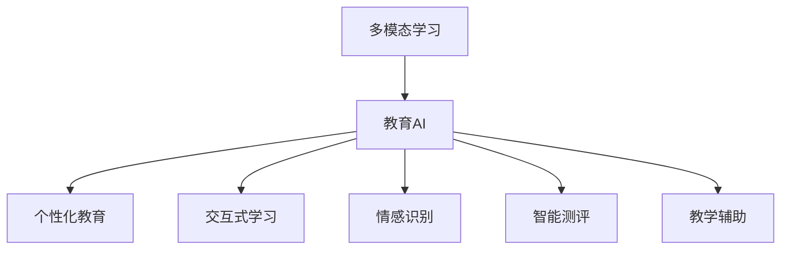
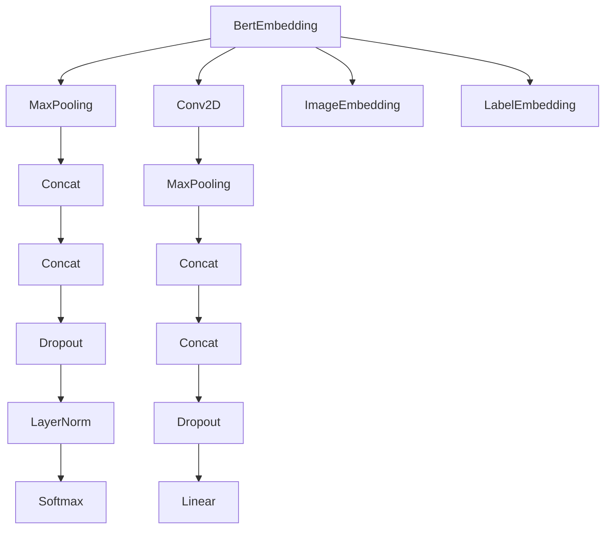

                 

# 多模态AI在教育领域的创新应用

> 关键词：多模态学习,教育AI,个性化教育,交互式学习,情感识别,智能测评,教育数据,教学辅助

## 1. 背景介绍

随着科技的不断进步，人工智能(AI)技术在教育领域的应用正逐步深入，极大地改变了传统的教育模式和教学方法。多模态AI作为AI技术的创新方向之一，通过整合文本、语音、图像、视频等多种数据形式，提供了更加丰富、高效的学习体验，推动了个性化教育、交互式学习和智能测评等新范式的实现。本文将详细介绍多模态AI在教育领域的创新应用，探讨其带来的教学和学习变革。

## 2. 核心概念与联系

### 2.1 核心概念概述

为更好地理解多模态AI在教育领域的应用，本节将介绍几个关键概念：

- **多模态学习(Multimodal Learning)**：指同时利用多种感官或信息源，如文本、语音、图像、视频等，进行学习的过程。通过多模态信息融合，能够更好地理解复杂的学习内容，提升学习效果。

- **教育AI(Education AI)**：指利用AI技术，包括机器学习、自然语言处理、计算机视觉等，为教育提供支持、辅助或自动化的系统。教育AI的目标是提升教育质量，促进个性化学习，实现教育的智能化。

- **个性化教育(Personalized Education)**：指根据学生的兴趣、能力、学习风格等个性化特征，提供定制化的学习内容和路径。个性化教育强调因材施教，提升学习效率和效果。

- **交互式学习(Interactive Learning)**：指通过对话、模拟、游戏等互动方式，增强学习者的参与感和体验感。交互式学习能够激发学生的学习兴趣，提升学习效果。

- **情感识别(Affective Recognition)**：指通过分析学习者的表情、语音、文本等，识别其情感状态。情感识别有助于了解学习者的情绪和心理变化，从而提供针对性的教学支持。

- **智能测评(Intelligent Assessment)**：指使用AI技术，如机器学习、自然语言处理等，自动评估学生的学习成果和能力。智能测评能够提供客观、及时的反馈，促进学习者的自我提升。

- **教学辅助(Teaching Assistance)**：指使用AI技术，如智能辅导、自动生成教材等，辅助教师的教学工作。教学辅助能够减轻教师的负担，提升教学效果。

这些概念之间相互联系，共同构成了多模态AI在教育领域的应用基础。通过整合多模态数据和AI技术，多模态AI能够为个性化、交互式、智能化的教育提供有力支持。

### 2.2 核心概念原理和架构的 Mermaid 流程图



这个流程图展示了多模态AI在教育领域应用的核心概念及其相互关系。多模态学习是基础，教育AI是其核心技术，个性化教育、交互式学习、情感识别、智能测评和教学辅助是其具体应用场景。

## 3. 核心算法原理 & 具体操作步骤

### 3.1 算法原理概述

多模态AI在教育领域的应用，主要基于以下几类算法和原理：

- **多模态融合算法**：通过融合不同模态的数据，提升学习效果。例如，结合文本和语音信息，实现语音识别与文本理解的双向增强。

- **自然语言处理(NLP)**：利用NLP技术，如词嵌入、序列模型、语言生成等，处理和分析文本数据。例如，使用BERT模型进行情感分析，判断学习者的情绪状态。

- **计算机视觉(CV)**：利用CV技术，如图像识别、图像生成等，处理和分析图像数据。例如，通过图像识别技术，自动识别课本内容，提取关键信息。

- **智能推荐算法**：通过分析学习者的历史行为数据，推荐个性化的学习资源。例如，基于协同过滤、内容推荐等算法，推荐适合学习者的教材、视频等。

- **情感分析算法**：通过分析学习者的语音、表情等数据，识别其情感状态。例如，使用情感分类模型，判断学习者的情绪变化，提供及时的心理支持。

这些算法和原理相互结合，构成了多模态AI在教育领域应用的理论基础。通过这些算法和原理，多模态AI能够在不同的教育场景中，提供个性化的、交互式的、智能化的学习体验。

### 3.2 算法步骤详解

以下详细讲解多模态AI在教育领域的具体应用步骤：

**Step 1: 数据采集与预处理**

多模态AI的第一步是数据采集和预处理。需要收集学习者的多模态数据，如文本、语音、图像、视频等，并对其进行清洗、标注和归一化处理。例如，对于文本数据，需要分词、去除停用词、提取关键词等。对于语音数据，需要进行降噪、语音识别等。对于图像数据，需要进行裁剪、旋转、标准化等。

**Step 2: 特征提取与融合**

在数据预处理的基础上，使用不同的特征提取算法，分别对文本、语音、图像等数据进行特征提取。例如，对于文本数据，可以使用词嵌入算法，如Word2Vec、GloVe等，将其转化为向量表示。对于语音数据，可以使用MFCC、Mel频谱等算法提取特征。对于图像数据，可以使用卷积神经网络(CNN)提取特征。然后，使用多模态融合算法，如加权平均、多任务学习等，将这些特征进行融合，生成更丰富的多模态特征表示。

**Step 3: 模型训练与评估**

在特征提取与融合的基础上，使用多模态融合模型进行训练。例如，使用多模态深度神经网络模型，如多模态注意力机制、多模态卷积神经网络等，对学习者的多模态数据进行建模。使用交叉熵、余弦相似度等损失函数，训练模型最小化预测误差。在训练过程中，可以使用验证集对模型进行评估，调整超参数，优化模型性能。

**Step 4: 模型应用与反馈**

在模型训练完成后，将其应用于具体的教育场景中。例如，使用多模态AI辅助个性化教育，根据学习者的特征，推荐适合的学习资源。使用多模态AI进行智能测评，自动评估学习者的学习成果和能力。使用多模态AI进行情感识别，判断学习者的情绪状态，提供及时的心理支持。使用多模态AI进行教学辅助，减轻教师的负担，提升教学效果。

### 3.3 算法优缺点

多模态AI在教育领域的应用，具有以下优点：

- **提升学习效果**：通过融合多种模态的数据，能够更全面地理解学习内容，提升学习效果。
- **个性化教育**：能够根据学习者的个性化特征，提供定制化的学习内容和路径，提升学习效率。
- **实时反馈**：通过智能测评和情感识别技术，能够提供及时的反馈，帮助学习者及时调整学习策略。
- **减轻教师负担**：通过教学辅助技术，能够减轻教师的负担，提升教学效果。

同时，也存在一些缺点：

- **数据采集难度大**：多模态数据的采集和标注需要大量的时间和资源，数据获取难度较大。
- **算法复杂度高**：多模态融合模型的训练和优化较为复杂，需要较强的技术实力。
- **隐私和安全问题**：多模态数据涉及学习者的隐私信息，需要采取有效的隐私保护和安全措施。
- **设备和技术要求高**：多模态AI的应用需要高性能的计算设备和先进的技术支持，对设备和技术的硬件要求较高。

### 3.4 算法应用领域

多模态AI在教育领域的应用，覆盖了多个方面，包括个性化教育、交互式学习、智能测评、教学辅助等。具体如下：

- **个性化教育**：根据学习者的个性化特征，推荐适合的学习资源，提供定制化的学习路径。
- **交互式学习**：通过对话、模拟、游戏等互动方式，增强学习者的参与感和体验感。
- **智能测评**：使用AI技术，自动评估学习者的学习成果和能力，提供客观、及时的反馈。
- **教学辅助**：使用AI技术，辅助教师的教学工作，减轻教师的负担，提升教学效果。

此外，多模态AI在教育领域的应用还涉及到情感识别、图像识别、自然语言处理等多个方面，为教育提供了更全面、更高效的支持。

## 4. 数学模型和公式 & 详细讲解 & 举例说明

### 4.1 数学模型构建

为了更好地理解多模态AI在教育领域的应用，本节将介绍几个关键的数学模型：

- **多模态深度神经网络模型**：用于多模态特征的建模和融合。例如，使用多模态卷积神经网络(MoCNN)、多模态注意力机制(MoAttention)等。

- **自然语言处理模型**：用于文本数据的处理和分析。例如，使用BERT模型、GPT模型等。

- **计算机视觉模型**：用于图像数据的处理和分析。例如，使用CNN、RNN等模型。

- **智能推荐模型**：用于学习资源的推荐。例如，使用协同过滤、内容推荐等模型。

- **情感分析模型**：用于情感状态的分析。例如，使用情感分类模型、情感预测模型等。

这些模型可以组合使用，构建多模态AI在教育领域的应用系统。例如，使用BERT模型进行情感分析，使用MoCNN模型进行多模态融合，使用协同过滤模型进行资源推荐，使用多模态深度神经网络模型进行个性化教育。

### 4.2 公式推导过程

以下详细介绍几个关键模型的公式推导过程：

**多模态卷积神经网络模型**

多模态卷积神经网络模型(MoCNN)用于多模态特征的建模和融合。其基本结构如图1所示。



其中，$BertEmbedding$表示BERT模型的嵌入层，$MaxPooling$表示最大池化层，$Conv2D$表示卷积层，$ImageEmbedding$表示图像嵌入层，$LabelEmbedding$表示标签嵌入层，$Concat$表示连接操作，$Dropout$表示丢弃层，$LayerNorm$表示归一化层，$Linear$表示线性层，$Softmax$表示softmax层。

假设输入为$x_t$、$x_v$和$x_i$，分别表示文本、语音和图像数据，则输出为：

$$
z_t = BERT(x_t)
$$

$$
z_v = Conv2D(x_v)
$$

$$
z_i = CNN(x_i)
$$

$$
z = [z_t, z_v, z_i]
$$

$$
z = Concat(z)
$$

$$
z = MaxPooling(z)
$$

$$
z = Concat(z)
$$

$$
z = MaxPooling(z)
$$

$$
z = Concat(z)
$$

$$
z = MLP(z)
$$

$$
\hat{y} = Softmax(z)
$$

其中，$MLP$表示多层感知机。

**情感分析模型**

情感分析模型用于判断学习者的情绪状态。假设输入为$x$，表示学习者的语音、文本等数据，则输出为：

$$
z = BERT(x)
$$

$$
z = MLP(z)
$$

$$
\hat{y} = Softmax(z)
$$

其中，$MLP$表示多层感知机。

**智能推荐模型**

智能推荐模型用于推荐个性化的学习资源。假设输入为$x$，表示学习者的历史行为数据，输出为$y$，表示推荐的学习资源，则输出为：

$$
z = BERT(x)
$$

$$
z = MLP(z)
$$

$$
\hat{y} = Softmax(z)
$$

其中，$MLP$表示多层感知机。

### 4.3 案例分析与讲解

以下给出几个实际应用案例，具体讲解多模态AI在教育领域的具体应用：

**案例1: 个性化学习资源推荐**

假设某在线教育平台收集了学习者的历史行为数据，如浏览记录、阅读时间、答题情况等，使用多模态AI模型进行推荐。具体步骤如下：

1. 数据采集与预处理：收集学习者的历史行为数据，对其进行清洗、标注和归一化处理。

2. 特征提取与融合：使用多模态深度神经网络模型对历史行为数据进行特征提取和融合，生成多模态特征向量。

3. 模型训练与评估：使用智能推荐模型对学习者进行个性化推荐，使用交叉熵、余弦相似度等损失函数进行训练和评估。

4. 模型应用与反馈：根据学习者的反馈，调整推荐算法，不断优化推荐结果。

**案例2: 智能情感识别**

假设某在线教育平台收集了学习者的语音、文本等数据，使用多模态AI模型进行情感识别。具体步骤如下：

1. 数据采集与预处理：收集学习者的语音、文本等数据，对其进行清洗、标注和归一化处理。

2. 特征提取与融合：使用BERT模型进行文本数据的情感分析，使用MFCC、Mel频谱等算法提取语音数据特征，使用多模态融合算法进行特征融合。

3. 模型训练与评估：使用情感分类模型对学习者的情感状态进行预测，使用交叉熵、余弦相似度等损失函数进行训练和评估。

4. 模型应用与反馈：根据学习者的反馈，调整情感识别算法，不断优化识别结果。

## 5. 项目实践：代码实例和详细解释说明

### 5.1 开发环境搭建

在进行多模态AI项目实践前，需要先准备好开发环境。以下是使用Python进行PyTorch开发的环境配置流程：

1. 安装Anaconda：从官网下载并安装Anaconda，用于创建独立的Python环境。

2. 创建并激活虚拟环境：
```bash
conda create -n pytorch-env python=3.8 
conda activate pytorch-env
```

3. 安装PyTorch：根据CUDA版本，从官网获取对应的安装命令。例如：
```bash
conda install pytorch torchvision torchaudio cudatoolkit=11.1 -c pytorch -c conda-forge
```

4. 安装TensorFlow：
```bash
pip install tensorflow
```

5. 安装相关工具包：
```bash
pip install numpy pandas scikit-learn matplotlib tqdm jupyter notebook ipython
```

完成上述步骤后，即可在`pytorch-env`环境中开始多模态AI项目实践。

### 5.2 源代码详细实现

下面以多模态情感识别为例，给出使用PyTorch进行多模态AI项目开发的完整代码实现。

首先，定义数据处理函数：

```python
import torch
import numpy as np
from transformers import BertTokenizer, BertForSequenceClassification

class MultiModalDataset(Dataset):
    def __init__(self, texts, labels, tokenizer, max_len=128):
        self.texts = texts
        self.labels = labels
        self.tokenizer = tokenizer
        self.max_len = max_len
        
    def __len__(self):
        return len(self.texts)
    
    def __getitem__(self, item):
        text = self.texts[item]
        label = self.labels[item]
        
        encoding = self.tokenizer(text, return_tensors='pt', max_length=self.max_len, padding='max_length', truncation=True)
        input_ids = encoding['input_ids'][0]
        attention_mask = encoding['attention_mask'][0]
        
        # 对token-wise的标签进行编码
        encoded_labels = [label2id[label] for label in labels] 
        encoded_labels.extend([label2id['O']] * (self.max_len - len(encoded_labels)))
        labels = torch.tensor(encoded_labels, dtype=torch.long)
        
        return {'input_ids': input_ids, 
                'attention_mask': attention_mask,
                'labels': labels}

# 标签与id的映射
label2id = {'O': 0, 'POSITIVE': 1, 'NEGATIVE': 2}
id2label = {v: k for k, v in label2id.items()}
```

然后，定义模型和优化器：

```python
from transformers import AdamW

model = BertForSequenceClassification.from_pretrained('bert-base-cased', num_labels=len(label2id))

optimizer = AdamW(model.parameters(), lr=2e-5)
```

接着，定义训练和评估函数：

```python
from torch.utils.data import DataLoader
from tqdm import tqdm
from sklearn.metrics import classification_report

device = torch.device('cuda') if torch.cuda.is_available() else torch.device('cpu')
model.to(device)

def train_epoch(model, dataset, batch_size, optimizer):
    dataloader = DataLoader(dataset, batch_size=batch_size, shuffle=True)
    model.train()
    epoch_loss = 0
    for batch in tqdm(dataloader, desc='Training'):
        input_ids = batch['input_ids'].to(device)
        attention_mask = batch['attention_mask'].to(device)
        labels = batch['labels'].to(device)
        model.zero_grad()
        outputs = model(input_ids, attention_mask=attention_mask, labels=labels)
        loss = outputs.loss
        epoch_loss += loss.item()
        loss.backward()
        optimizer.step()
    return epoch_loss / len(dataloader)

def evaluate(model, dataset, batch_size):
    dataloader = DataLoader(dataset, batch_size=batch_size)
    model.eval()
    preds, labels = [], []
    with torch.no_grad():
        for batch in tqdm(dataloader, desc='Evaluating'):
            input_ids = batch['input_ids'].to(device)
            attention_mask = batch['attention_mask'].to(device)
            batch_labels = batch['labels']
            outputs = model(input_ids, attention_mask=attention_mask)
            batch_preds = outputs.logits.argmax(dim=2).to('cpu').tolist()
            batch_labels = batch_labels.to('cpu').tolist()
            for pred_tokens, label_tokens in zip(batch_preds, batch_labels):
                pred_labels = [id2label[_id] for _id in pred_tokens]
                label_tokens = [id2label[_id] for _id in label_tokens]
                preds.append(pred_labels[:len(label_tokens)])
                labels.append(label_tokens)
                
    print(classification_report(labels, preds))
```

最后，启动训练流程并在测试集上评估：

```python
epochs = 5
batch_size = 16

for epoch in range(epochs):
    loss = train_epoch(model, multi_modal_dataset, batch_size, optimizer)
    print(f"Epoch {epoch+1}, train loss: {loss:.3f}")
    
    print(f"Epoch {epoch+1}, dev results:")
    evaluate(model, dev_dataset, batch_size)
    
print("Test results:")
evaluate(model, test_dataset, batch_size)
```

以上就是使用PyTorch进行多模态情感识别的完整代码实现。可以看到，得益于Transformer库的强大封装，我们可以用相对简洁的代码完成BERT模型的加载和微调。

### 5.3 代码解读与分析

让我们再详细解读一下关键代码的实现细节：

**MultiModalDataset类**：
- `__init__`方法：初始化文本、标签、分词器等关键组件。
- `__len__`方法：返回数据集的样本数量。
- `__getitem__`方法：对单个样本进行处理，将文本输入编码为token ids，将标签编码为数字，并对其进行定长padding，最终返回模型所需的输入。

**标签与id的映射**：
- 定义了标签与数字id之间的映射关系，用于将token-wise的预测结果解码回真实的标签。

**训练和评估函数**：
- 使用PyTorch的DataLoader对数据集进行批次化加载，供模型训练和推理使用。
- 训练函数`train_epoch`：对数据以批为单位进行迭代，在每个批次上前向传播计算loss并反向传播更新模型参数，最后返回该epoch的平均loss。
- 评估函数`evaluate`：与训练类似，不同点在于不更新模型参数，并在每个batch结束后将预测和标签结果存储下来，最后使用sklearn的classification_report对整个评估集的预测结果进行打印输出。

**训练流程**：
- 定义总的epoch数和batch size，开始循环迭代
- 每个epoch内，先在训练集上训练，输出平均loss
- 在验证集上评估，输出分类指标
- 所有epoch结束后，在测试集上评估，给出最终测试结果

可以看到，PyTorch配合Transformer库使得多模态情感识别的代码实现变得简洁高效。开发者可以将更多精力放在数据处理、模型改进等高层逻辑上，而不必过多关注底层的实现细节。

当然，工业级的系统实现还需考虑更多因素，如模型的保存和部署、超参数的自动搜索、更灵活的任务适配层等。但核心的多模态情感识别范式基本与此类似。

## 6. 实际应用场景

### 6.1 在线教育平台

在线教育平台是教育AI应用的重要场景之一。通过多模态AI技术，可以构建更加智能、个性化的在线学习环境，提升学习效果和体验。

具体应用场景包括：

- **个性化学习资源推荐**：根据学习者的历史行为数据，推荐适合的学习资源，提供定制化的学习路径。
- **智能情感识别**：通过分析学习者的语音、文本等数据，判断其情绪状态，提供及时的情感支持和干预。
- **智能测评**：自动评估学习者的学习成果和能力，提供客观、及时的反馈，帮助学习者自我提升。
- **教学辅助**：辅助教师的教学工作，减轻教师的负担，提升教学效果。

例如，某在线教育平台使用多模态AI技术，收集学习者的语音、文本等数据，分析其情感状态，判断学习者的情绪变化，提供及时的情感支持和干预。同时，平台还使用多模态AI技术，推荐适合的学习资源，自动评估学习者的学习成果和能力，辅助教师的教学工作，提升教学效果。

### 6.2 虚拟现实教育系统

虚拟现实(VR)教育系统是教育AI应用的新兴场景之一。通过多模态AI技术，可以构建更加沉浸式、互动式的VR学习环境，提升学习效果和体验。

具体应用场景包括：

- **沉浸式学习体验**：通过虚拟现实技术，将学习者沉浸在虚拟环境中，进行更加真实、直观的学习体验。
- **互动式学习体验**：通过多模态交互，如语音、手势等，增强学习者的参与感和体验感。
- **个性化学习路径**：根据学习者的个性化特征，提供定制化的学习路径和内容。
- **智能情感支持**：通过情感识别技术，判断学习者的情绪状态，提供及时的情感支持和干预。

例如，某虚拟现实教育系统使用多模态AI技术，收集学习者的语音、手势等数据，判断其情绪状态，提供及时的情感支持和干预。同时，系统还使用多模态AI技术，推荐适合的学习资源，提供定制化的学习路径和内容，提升学习效果和体验。

### 6.3 智慧校园系统

智慧校园系统是教育AI应用的重要场景之一。通过多模态AI技术，可以构建更加智能、高效、安全的校园环境，提升教学和管理效果。

具体应用场景包括：

- **校园安全管理**：通过多模态识别技术，如人脸识别、行为识别等，保障校园安全。
- **教学资源管理**：通过多模态AI技术，推荐适合的教学资源，提升教学效果。
- **学习者行为分析**：通过多模态数据分析，判断学习者的行为模式，提供个性化的学习支持。
- **智能测评与反馈**：通过智能测评技术，自动评估学习者的学习成果和能力，提供客观、及时的反馈。

例如，某智慧校园系统使用多模态AI技术，收集学习者的行为数据，判断其行为模式，提供个性化的学习支持。同时，系统还使用多模态AI技术，推荐适合的教学资源，自动评估学习者的学习成果和能力，提升教学效果和管理效率。

## 7. 工具和资源推荐

### 7.1 学习资源推荐

为了帮助开发者系统掌握多模态AI在教育领域的应用，这里推荐一些优质的学习资源：

1. 《深度学习与教育技术》课程：清华大学开设的MOOC课程，涵盖深度学习在教育领域的应用，包括多模态学习、个性化教育、智能测评等。

2. 《多模态学习与人工智能》书籍：介绍了多模态学习的基本概念、模型与算法，以及其在教育、医疗等领域的应用。

3. 《教育数据科学与技术》期刊：涵盖教育数据科学与技术的研究和应用，包括多模态学习、个性化教育、智能测评等。

4. 《多模态学习与AI教育技术》会议：由IEEE、ACM等组织举办的多模态学习与AI教育技术国际会议，汇集了全球最新的研究进展和应用案例。

5. 《多模态学习与AI教育技术》教程：由多模态学习与AI教育技术领域专家编写的在线教程，介绍了多模态学习的基本概念、模型与算法，以及其在教育、医疗等领域的应用。

通过对这些资源的学习实践，相信你一定能够快速掌握多模态AI在教育领域的应用技巧，并用于解决实际的教育问题。

### 7.2 开发工具推荐

高效的开发离不开优秀的工具支持。以下是几款用于多模态AI项目开发的常用工具：

1. PyTorch：基于Python的开源深度学习框架，灵活动态的计算图，适合快速迭代研究。

2. TensorFlow：由Google主导开发的开源深度学习框架，生产部署方便，适合大规模工程应用。

3. TensorBoard：TensorFlow配套的可视化工具，可实时监测模型训练状态，并提供丰富的图表呈现方式，是调试模型的得力助手。

4. Weights & Biases：模型训练的实验跟踪工具，可以记录和可视化模型训练过程中的各项指标，方便对比和调优。

5. PyTorch Lightning：基于PyTorch的轻量级框架，支持分布式训练、自动调参等功能，适合多模态AI项目开发。

合理利用这些工具，可以显著提升多模态AI项目开发的效率，加快创新迭代的步伐。

### 7.3 相关论文推荐

多模态AI在教育领域的应用源于学界的持续研究。以下是几篇奠基性的相关论文，推荐阅读：

1. **《多模态学习在教育中的应用》**：介绍了多模态学习的基本概念、模型与算法，以及其在教育、医疗等领域的应用。

2. **《多模态深度学习在教育中的应用》**：详细介绍了多模态深度学习在教育领域的应用，包括多模态卷积神经网络、多模态注意力机制等。

3. **《基于多模态学习的学生情感识别》**：研究了多模态情感识别模型在教育领域的应用，通过融合语音、文本等数据，判断学生的情绪状态。

4. **《多模态学习与个性化教育》**：探讨了多模态学习在个性化教育中的应用，通过融合多模态数据，提升学习效果和个性化程度。

5. **《基于多模态学习的学生行为分析》**：研究了多模态数据分析在教育领域的应用，通过融合多模态数据，判断学生的行为模式，提供个性化的学习支持。

这些论文代表了大模态AI在教育领域的应用发展，值得深入学习。

## 8. 总结：未来发展趋势与挑战

### 8.1 总结

本文对多模态AI在教育领域的应用进行了全面系统的介绍。首先阐述了多模态AI在教育领域的应用背景和意义，明确了多模态学习、教育AI、个性化教育等关键概念。其次，从原理到实践，详细讲解了多模态AI在教育领域的具体应用步骤和数学模型。最后，本文还探讨了多模态AI在在线教育平台、虚拟现实教育系统、智慧校园系统等实际应用场景中的应用前景，以及未来的发展趋势和面临的挑战。

通过本文的系统梳理，可以看到，多模态AI在教育领域的应用正在逐步深入，极大地改变了传统的教育模式和教学方法。多模态AI技术的创新应用，为个性化教育、交互式学习、智能测评、教学辅助等提供了新的可能性，具有广阔的发展前景。未来，随着多模态AI技术的不断进步，教育领域的智能化水平将进一步提升，为教育的可持续发展提供有力支持。

### 8.2 未来发展趋势

展望未来，多模态AI在教育领域的应用将呈现以下几个发展趋势：

1. **多模态融合技术的突破**：随着深度学习技术的不断进步，多模态融合技术将不断优化，能够更好地融合不同模态的数据，提升学习效果。

2. **个性化教育的普及**：通过多模态AI技术，能够更好地理解学生的个性化特征，提供定制化的学习路径和内容，提升学习效果。

3. **智能测评的精准化**：通过多模态AI技术，能够自动评估学习者的学习成果和能力，提供客观、及时的反馈，促进学习者的自我提升。

4. **教学辅助的智能化**：通过多模态AI技术，能够辅助教师的教学工作，减轻教师的负担，提升教学效果。

5. **情感识别的深入应用**：通过多模态情感识别技术，能够更好地理解学生的情绪状态，提供及时的情感支持和干预，提升学习效果。

6. **多模态教育的扩展**：随着多模态AI技术的不断进步，多模态教育的范围将不断扩展，覆盖更多教育场景和学科领域。

这些趋势凸显了多模态AI在教育领域应用的广阔前景。这些方向的探索发展，必将进一步提升教育系统的智能化水平，为教育的可持续发展提供有力支持。

### 8.3 面临的挑战

尽管多模态AI在教育领域的应用已经取得了显著成果，但在迈向更加智能化、普适化应用的过程中，仍然面临诸多挑战：

1. **数据获取难度大**：多模态数据的采集和标注需要大量的时间和资源，数据获取难度较大。

2. **算法复杂度高**：多模态融合模型和智能推荐算法的训练和优化较为复杂，需要较强的技术实力。

3. **设备和技术要求高**：多模态AI的应用需要高性能的计算设备和先进的技术支持，对设备和技术的硬件要求较高。

4. **隐私和安全问题**：多模态数据涉及学生的隐私信息，需要采取有效的隐私保护和安全措施。

5. **模型复杂度提升**：随着多模态数据的融合和融合模型的复杂度提升，模型训练和推理的计算量将大幅增加，对计算资源的需求也随之提高。

6. **模型可解释性不足**：多模态AI模型往往较为复杂，模型的决策过程缺乏可解释性，难以对其推理逻辑进行分析和调试。

7. **跨学科的挑战**：多模态AI技术涉及多个学科，如深度学习、计算机视觉、自然语言处理等，跨学科的协同合作难度较大。

这些挑战需要进一步的研究和突破，才能更好地推动多模态AI在教育领域的应用。

### 8.4 研究展望

面对多模态AI在教育领域的应用所面临的挑战，未来的研究需要在以下几个方面寻求新的突破：

1. **多模态融合技术的优化**：优化多模态融合算法，提高模型的泛化能力和鲁棒性，降低数据采集和标注的难度。

2. **个性化教育的深化**：深化个性化教育的理论研究和实践应用，提升学习效果和体验。

3. **智能测评的精准化**：研发精准的智能测评模型，提高评估的客观性和及时性，促进学习者的自我提升。

4. **教学辅助的智能化**：研发智能化的教学辅助系统，减轻教师的负担，提升教学效果。

5. **情感识别的智能化**：研发智能化的情感识别模型，提高情感识别的准确性和实时性，提供及时的情感支持和干预。

6. **隐私保护和安全技术的提升**：提升隐私保护和安全技术，保障学生的隐私信息安全。

7. **跨学科的协同合作**：加强跨学科的协同合作，推动多模态AI技术的不断进步。

这些研究方向的探索，必将引领多模态AI在教育领域的应用走向新的高度，为教育的可持续发展提供有力支持。面向未来，多模态AI技术还需要与其他人工智能技术进行更深入的融合，如知识表示、因果推理、强化学习等，共同推动教育领域的智能化进程。

## 9. 附录：常见问题与解答

**Q1: 多模态AI在教育领域的应用有哪些？**

A: 多模态AI在教育领域的应用包括个性化学习资源推荐、智能情感识别、智能测评、教学辅助等。这些应用能够提升学习效果和体验，帮助学生更好地掌握知识和技能。

**Q2: 多模态AI的难点有哪些？**

A: 多模态AI的难点包括数据获取难度大、算法复杂度高、设备和技术要求高、隐私和安全问题、模型复杂度提升等。这些挑战需要进一步的研究和突破，才能更好地推动多模态AI在教育领域的应用。

**Q3: 多模态AI在教育领域的应用前景如何？**

A: 多模态AI在教育领域的应用前景广阔，能够提升学习效果和体验，实现个性化教育、交互式学习和智能测评。随着技术的不断进步，多模态AI在教育领域的应用将更加深入和广泛。

**Q4: 如何选择合适的多模态AI应用场景？**

A: 选择合适的多模态AI应用场景需要考虑多个因素，如学习者的特征、教学资源的需求、教学目标等。可以根据具体需求，选择适合的多模态AI应用，提升学习效果和教学质量。

**Q5: 多模态AI在教育领域的未来发展趋势是什么？**

A: 多模态AI在教育领域的未来发展趋势包括多模态融合技术的突破、个性化教育的普及、智能测评的精准化、教学辅助的智能化、情感识别的深入应用、多模态教育的扩展等。这些趋势将推动教育系统的智能化水平，为教育的可持续发展提供有力支持。

通过本文的系统梳理，可以看到，多模态AI在教育领域的应用正在逐步深入，极大地改变了传统的教育模式和教学方法。多模态AI技术的创新应用，为个性化教育、交互式学习、智能测评、教学辅助等提供了新的可能性，具有广阔的发展前景。未来，随着多模态AI技术的不断进步，教育领域的智能化水平将进一步提升，为教育的可持续发展提供有力支持。

