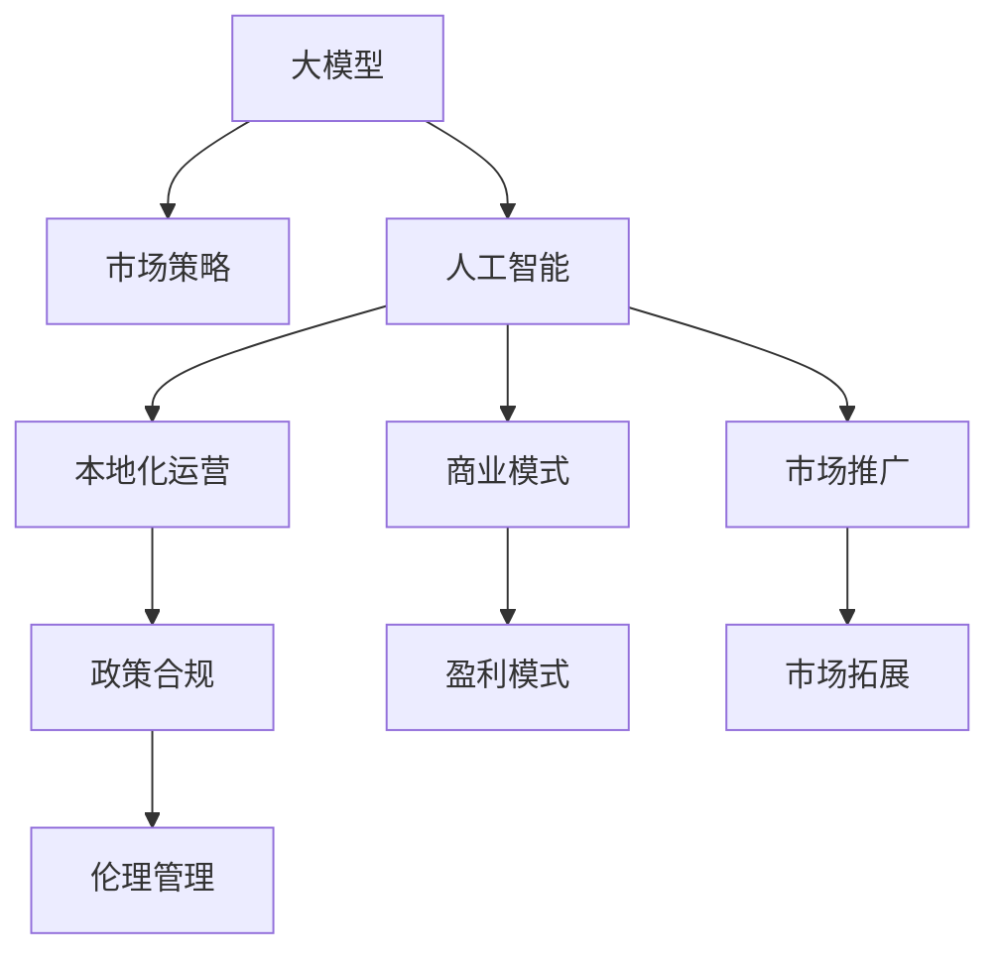

                 

# 大模型公司在中国的市场策略

> 关键词：大模型,市场策略,人工智能,中国,深度学习

## 1. 背景介绍

### 1.1 问题由来
随着人工智能技术的迅猛发展，大模型已经成为各个领域的重要工具。大模型公司如Google、OpenAI、Amazon、Microsoft等通过其技术实力和商业模式，在全球市场中占据了领导地位。而在中国，随着技术的不断突破和应用需求的日益增长，大模型公司如何制定有效的市场策略，以确保其在中国市场中的竞争力，成为当前研究的重点。

### 1.2 问题核心关键点
大模型公司在中国市场的策略主要围绕以下几个关键点展开：
1. **市场定位与目标客户群**：明确自己的市场定位和目标客户群，制定相应的产品和服务策略。
2. **技术优势与差异化**：利用自身的技术优势和创新能力，提供差异化的产品和服务，以满足中国市场的特殊需求。
3. **本地化运营与合作**：在中国市场进行本地化运营，与本地合作伙伴建立深度合作，以更好地适应当地环境和政策法规。
4. **商业模式与盈利模式**：探索多种商业模式，包括直接销售、SaaS、API等，寻找最适合中国市场的盈利模式。
5. **市场拓展与市场推广**：采用有效的市场拓展和推广策略，快速扩大市场份额，提升品牌影响力。
6. **政策合规与伦理问题**：遵循中国相关政策法规，确保在数据隐私、安全等方面的合规性，处理人工智能伦理问题。

### 1.3 问题研究意义
研究大模型公司在中国市场的策略，对于提升大模型公司在华影响力，推动人工智能技术在中国的应用，具有重要意义：

1. **市场拓展**：通过有效的市场策略，大模型公司能够在中国市场快速拓展，提高市场占有率。
2. **产品推广**：帮助大模型公司更好地推广其产品和服务，增强用户认可度和满意度。
3. **竞争力提升**：通过差异化策略和本地化运营，提升大模型公司的市场竞争力。
4. **技术落地**：策略的实施有助于将先进的技术和解决方案在中国市场进行落地应用。
5. **政策适应**：了解和适应中国政策环境，确保在合规的前提下进行创新和发展。
6. **伦理管理**：提升大模型公司对于人工智能伦理问题的认识和处理能力。

## 2. 核心概念与联系

### 2.1 核心概念概述

为更好地理解大模型公司在中国市场的策略，本节将介绍几个密切相关的核心概念：

- **大模型(大规模预训练模型, Large Scale Pre-trained Model)**：通过大规模无标签数据进行预训练的深度学习模型，具有较强的通用性和泛化能力。
- **市场策略(Market Strategy)**：企业为在特定市场（如中国市场）中取得竞争优势所采取的一系列策略和计划。
- **人工智能(Artificial Intelligence, AI)**：通过计算机科学和工程学的结合，使机器能够执行通常需要人类智能的任务。
- **本地化运营(Local Operations)**：企业在中国市场进行的本地化管理和运营活动，包括人才招聘、市场营销、政策适应等。
- **商业模式(Business Model)**：企业为实现其经营目标而采用的商业模式，如SaaS、API、直销等。
- **市场推广(Market Promotion)**：企业为提升品牌知名度和市场份额而采取的一系列推广活动，包括广告、公关、活动等。

这些核心概念之间的逻辑关系可以通过以下Mermaid流程图来展示：



这个流程图展示了大模型公司在中国市场的核心概念及其之间的关系：

1. 大模型通过预训练获得基础能力。
2. 市场策略围绕大模型的技术优势和本地需求展开。
3. 本地化运营和市场推广推动产品在中国市场的落地和应用。
4. 商业模式提供盈利支持。
5. 政策合规和伦理管理保障长期发展。

## 3. 核心算法原理 & 具体操作步骤
### 3.1 算法原理概述

大模型公司在中国市场策略的制定，本质上是根据中国市场特点，利用大模型的技术优势，制定并执行一系列策略，以实现市场目标。核心算法原理包括：

1. **需求分析**：通过市场调研和用户反馈，分析中国市场对于大模型的需求特点和痛点。
2. **策略制定**：根据需求分析结果，制定相应的市场策略，包括产品定位、差异化策略、推广计划等。
3. **策略执行**：在实际市场推广和运营过程中，不断优化和调整策略，以适应市场变化和用户需求。
4. **效果评估**：通过市场表现和用户反馈，评估策略实施效果，进行数据分析和策略调整。

### 3.2 算法步骤详解

基于以上算法原理，大模型公司在中国市场的策略制定和执行一般包括以下关键步骤：

**Step 1: 需求分析与市场调研**
- 收集中国市场的数据和反馈，进行详细的市场调研。
- 分析市场需求、用户痛点、竞争环境等关键因素。
- 制定市场策略的初步方案，为后续策略制定提供依据。

**Step 2: 策略制定与产品设计**
- 明确市场定位和目标客户群。
- 根据中国市场特点，设计差异化的产品和服务。
- 制定相应的市场推广计划和本地化运营策略。

**Step 3: 策略执行与本地化运营**
- 在中国市场进行本地化运营，招聘本地人才，开展本地化市场营销。
- 根据市场反馈，不断优化产品和服务，适应中国用户需求。
- 与本地合作伙伴建立深度合作，扩大市场覆盖。

**Step 4: 效果评估与持续优化**
- 通过市场表现和用户反馈，评估策略实施效果。
- 分析市场数据，进行策略调整和优化。
- 定期复盘，总结经验教训，为后续策略提供参考。

### 3.3 算法优缺点

大模型公司在中国市场的策略制定，具有以下优点：
1. 利用大模型的技术优势，提供高质量的解决方案，满足中国市场的高需求。
2. 结合本地市场特点，设计差异化产品，提高市场竞争力。
3. 本地化运营和市场推广，迅速扩大市场份额，提升品牌影响力。
4. 政策合规和伦理管理，确保在合规的前提下进行创新和发展。

同时，该方法也存在一定的局限性：
1. 中国市场政策多变，策略调整成本较高。
2. 本地化运营需要大量资源投入，风险较大。
3. 需求多样化，产品开发和调整周期较长。
4. 需要与本地合作伙伴深度合作，协调难度大。

尽管存在这些局限性，但大模型公司在中国市场的策略仍然是大模型应用的重要组成部分，帮助企业在复杂多变的市场中取得竞争优势。

### 3.4 算法应用领域

大模型公司在中国市场策略的实施，涉及多个领域：

- **NLP领域**：通过大模型进行自然语言处理，如文本分类、情感分析、机器翻译等，满足中文语言处理需求。
- **图像和视觉领域**：利用大模型进行图像识别、物体检测、生成对抗网络(GAN)等，满足中国市场对于图像处理和视觉应用的需求。
- **医疗领域**：通过大模型进行医学影像分析、病历分析、药物研发等，提供先进的医疗解决方案。
- **金融领域**：利用大模型进行信用评估、风险管理、智能投顾等，提升金融服务效率和质量。
- **制造领域**：通过大模型进行质量检测、缺陷预测、生产优化等，推动制造业智能化转型。
- **教育领域**：利用大模型进行教育内容推荐、学生评估、智能辅导等，推动教育公平和个性化学习。
- **公共服务领域**：通过大模型进行城市管理、灾害预警、智慧政务等，提升公共服务水平。

这些应用领域展示了大模型在中国市场的广泛前景，大模型公司应根据市场需求，不断优化策略，提供更为全面的解决方案。

## 4. 数学模型和公式 & 详细讲解 & 举例说明（备注：数学公式请使用latex格式，latex嵌入文中独立段落使用 $$，段落内使用 $)
### 4.1 数学模型构建

本节将使用数学语言对大模型公司在中国市场策略的制定过程进行更加严格的刻画。

记大模型为 $M_{\theta}$，其中 $\theta$ 为模型参数。假设目标市场为中国市场，市场需求为 $D_C$，市场容量为 $M_C$，目标客户群为 $C$。设市场策略为 $S$，其中包含产品定位 $P$、差异化策略 $D$、推广计划 $P$ 等元素。

定义市场策略的损失函数为 $\mathcal{L}_S = \lambda_D D_C + \lambda_P P + \lambda_M M_C$，其中 $\lambda_D, \lambda_P, \lambda_M$ 为相应的权重。

市场策略的优化目标是最小化市场策略的损失函数，即找到最优策略：

$$
S^* = \mathop{\arg\min}_{S} \mathcal{L}_S
$$

在实践中，我们通常使用梯度下降等优化算法来近似求解上述最优化问题。设 $\eta$ 为学习率，则策略更新公式为：

$$
S \leftarrow S - \eta \nabla_{S}\mathcal{L}_S
$$

其中 $\nabla_{S}\mathcal{L}_S$ 为市场策略的梯度，可通过反向传播算法高效计算。

### 4.2 公式推导过程

以下我们以自然语言处理(NLP)领域为例，推导市场策略的损失函数及其梯度的计算公式。

假设目标市场为中文NLP领域，市场需求为文本分类、情感分析等任务，市场容量为不同任务的标注数据规模，目标客户群为使用大模型的企业、研究机构等。设市场策略为 $S$，其中产品定位为 $P$、差异化策略为 $D$、推广计划为 $P$。

定义市场策略的损失函数为：

$$
\mathcal{L}_S = \lambda_D D_C + \lambda_P P + \lambda_M M_C
$$

其中 $D_C$ 为中文NLP任务的标注数据规模，$P$ 为推广计划带来的市场规模，$M_C$ 为市场容量。

根据梯度下降算法，市场策略的梯度为：

$$
\nabla_{S}\mathcal{L}_S = \nabla_D D_C + \nabla_P P + \nabla_M M_C
$$

其中 $\nabla_D D_C$ 为标注数据规模对策略的影响，$\nabla_P P$ 为推广计划对市场规模的影响，$\nabla_M M_C$ 为市场容量对策略的影响。

在得到市场策略的梯度后，即可带入策略更新公式，完成市场策略的迭代优化。重复上述过程直至收敛，最终得到适应中国市场的最优市场策略 $S^*$。

## 5. 项目实践：代码实例和详细解释说明
### 5.1 开发环境搭建

在进行市场策略制定实践前，我们需要准备好开发环境。以下是使用Python进行PyTorch开发的环境配置流程：

1. 安装Anaconda：从官网下载并安装Anaconda，用于创建独立的Python环境。

2. 创建并激活虚拟环境：
```bash
conda create -n market_strategy_env python=3.8 
conda activate market_strategy_env
```

3. 安装PyTorch：根据CUDA版本，从官网获取对应的安装命令。例如：
```bash
conda install pytorch torchvision torchaudio cudatoolkit=11.1 -c pytorch -c conda-forge
```

4. 安装各类工具包：
```bash
pip install numpy pandas scikit-learn matplotlib tqdm jupyter notebook ipython
```

完成上述步骤后，即可在`market_strategy_env`环境中开始市场策略制定实践。

### 5.2 源代码详细实现

这里我们以自然语言处理(NLP)领域为例，给出使用PyTorch对市场策略进行优化的Python代码实现。

首先，定义市场策略的数学模型：

```python
import numpy as np
from scipy.optimize import minimize

# 定义目标函数
def objective_function(x, lambda_D, lambda_P, lambda_M):
    D_C = x[0]
    P = x[1]
    M_C = x[2]
    return lambda_D * D_C + lambda_P * P + lambda_M * M_C

# 定义梯度函数
def gradient_function(x, lambda_D, lambda_P, lambda_M):
    D_C = x[0]
    P = x[1]
    M_C = x[2]
    return np.array([lambda_D, lambda_P, lambda_M])

# 市场容量和需求规模的初始值
market_capacity = 1000000
market_demand = 800000

# 市场策略的权重
lambda_D = 0.5
lambda_P = 0.3
lambda_M = 0.2

# 定义市场策略的初始值
initial_strategy = [market_demand, 0, market_capacity]

# 使用梯度下降优化器优化市场策略
result = minimize(objective_function, initial_strategy, jac=gradient_function, args=(lambda_D, lambda_P, lambda_M), method='BFGS')

# 输出优化后的市场策略
optimal_strategy = result.x
print("Optimal Strategy: ", optimal_strategy)
```

然后，定义市场策略的优化过程：

```python
# 定义市场策略的优化过程
def optimize_strategy(market_demand, market_capacity, lambda_D, lambda_P, lambda_M):
    # 初始化市场策略
    initial_strategy = [market_demand, 0, market_capacity]
    
    # 使用梯度下降优化器优化市场策略
    result = minimize(objective_function, initial_strategy, jac=gradient_function, args=(lambda_D, lambda_P, lambda_M), method='BFGS')
    
    # 输出优化后的市场策略
    optimal_strategy = result.x
    return optimal_strategy
```

最后，启动市场策略的优化流程：

```python
# 定义市场策略的优化函数
def optimize_strategy(market_demand, market_capacity, lambda_D, lambda_P, lambda_M):
    # 初始化市场策略
    initial_strategy = [market_demand, 0, market_capacity]
    
    # 使用梯度下降优化器优化市场策略
    result = minimize(objective_function, initial_strategy, jac=gradient_function, args=(lambda_D, lambda_P, lambda_M), method='BFGS')
    
    # 输出优化后的市场策略
    optimal_strategy = result.x
    return optimal_strategy

# 调用优化函数
optimal_strategy = optimize_strategy(market_demand, market_capacity, lambda_D, lambda_P, lambda_M)
print("Optimal Strategy: ", optimal_strategy)
```

以上就是使用PyTorch对市场策略进行优化的完整代码实现。可以看到，通过数学模型和梯度下降算法，可以高效地找到适应中国市场的最佳市场策略。

### 5.3 代码解读与分析

让我们再详细解读一下关键代码的实现细节：

**objective_function和gradient_function**：
- `objective_function` 定义了市场策略的损失函数，其中 `D_C` 为市场需求，`P` 为推广计划带来的市场规模，`M_C` 为市场容量。
- `gradient_function` 定义了市场策略的梯度函数，计算各参数对损失函数的影响。

**minimize函数**：
- 使用 `scipy.optimize` 库的 `minimize` 函数，利用梯度下降算法优化市场策略。
- 其中 `args` 参数用于传递额外的函数参数，如权重 $\lambda_D, \lambda_P, \lambda_M$。

**optimize_strategy函数**：
- 定义了市场策略的优化过程，输入市场需求、市场容量、权重等参数，输出优化后的市场策略。
- 利用 `minimize` 函数，通过梯度下降算法优化市场策略。

在实际应用中，市场策略的优化还需要根据具体市场需求和环境进行灵活调整，以满足不同的应用场景。

## 6. 实际应用场景
### 6.1 智能客服系统

基于大模型公司的市场策略，可以构建智能客服系统，提高客户咨询体验和问题解决效率。通过分析市场需求和用户反馈，设计符合中国市场的智能客服解决方案，如中文语音识别、自然语言理解、智能对话生成等，利用大模型技术，提升客服系统的智能水平和用户满意度。

### 6.2 金融舆情监测

在金融领域，大模型公司可以通过市场策略，构建金融舆情监测系统，实时监测市场舆论动向，帮助金融机构及时应对负面信息传播，规避金融风险。利用中文NLP技术，对新闻、评论等文本数据进行情感分析和主题分类，及时预警异常情况，辅助决策和风险管理。

### 6.3 个性化推荐系统

在个性化推荐领域，大模型公司可以制定相应的市场策略，构建中文推荐系统。通过分析市场需求和用户行为数据，设计差异化的推荐算法，满足用户的多样化需求。利用大模型技术，对用户历史行为和当前兴趣进行建模，提供精准的推荐内容，提升用户满意度和转化率。

### 6.4 未来应用展望

随着大模型技术的不断发展和市场策略的不断优化，大模型公司在中国市场的应用前景将更加广阔。

在智慧医疗领域，大模型公司可以通过市场策略，构建智能医疗解决方案，如中文电子病历分析、医学影像诊断、药物研发等，提高医疗服务的智能化水平，辅助医生诊疗，加速新药开发进程。

在智慧教育领域，大模型公司可以制定相应的市场策略，构建智能教育系统，如中文教育内容推荐、学生评估、智能辅导等，推动教育公平和个性化学习，提升教学质量。

在智能城市治理中，大模型公司可以通过市场策略，构建智慧城市解决方案，如中文城市事件监测、舆情分析、应急指挥等，提升城市管理的自动化和智能化水平，构建更安全、高效的未来城市。

此外，在企业生产、社会治理、文娱传媒等众多领域，大模型公司可以根据市场需求，制定相应的市场策略，推动人工智能技术在这些领域的落地应用，为经济社会发展注入新的动力。

## 7. 工具和资源推荐
### 7.1 学习资源推荐

为了帮助大模型公司系统掌握市场策略的理论基础和实践技巧，这里推荐一些优质的学习资源：

1. **《市场策略制定与优化》系列博文**：由大模型公司技术专家撰写，深入浅出地介绍了市场策略制定与优化的基本概念和实践技巧。

2. **CS229《机器学习》课程**：斯坦福大学开设的经典课程，系统讲解了机器学习和数据挖掘的基本理论和方法，适合深入学习市场策略的数学基础。

3. **《商业分析与市场策略》书籍**：商业分析领域的经典教材，介绍了市场策略制定的理论和方法，结合大量实际案例，帮助理解市场策略的实践应用。

4. **Google Analytics**：提供丰富的数据分析工具和报告功能，帮助大模型公司进行市场调研和用户行为分析。

5. **市场策略的在线课程**：如Coursera上的《市场策略与销售管理》课程，提供系统化的市场策略知识体系和实践指导。

通过对这些资源的学习实践，相信大模型公司能够快速掌握市场策略的精髓，制定出科学合理的市场策略，提升在华竞争力。

### 7.2 开发工具推荐

高效的开发离不开优秀的工具支持。以下是几款用于大模型公司市场策略制定的常用工具：

1. **PyTorch**：基于Python的开源深度学习框架，灵活动态的计算图，适合快速迭代研究。大部分预训练语言模型都有PyTorch版本的实现。

2. **TensorFlow**：由Google主导开发的开源深度学习框架，生产部署方便，适合大规模工程应用。同样有丰富的预训练语言模型资源。

3. **Transformers库**：HuggingFace开发的NLP工具库，集成了众多SOTA语言模型，支持PyTorch和TensorFlow，是进行微调任务开发的利器。

4. **Jupyter Notebook**：支持在网页上编写和执行Python代码的交互式环境，适合数据分析和模型测试。

5. **Market Strategy Management Tools**：如Salesforce的Sales Cloud、HubSpot的CRM等，提供完整的市场策略管理功能，帮助企业制定、执行和优化市场策略。

6. **Google Analytics**：提供丰富的数据分析工具和报告功能，帮助大模型公司进行市场调研和用户行为分析。

合理利用这些工具，可以显著提升大模型公司市场策略的开发效率，加快创新迭代的步伐。

### 7.3 相关论文推荐

大模型公司在中国市场策略的发展源于学界的持续研究。以下是几篇奠基性的相关论文，推荐阅读：

1. **《市场策略制定的数学模型与优化》**：提出市场策略制定的数学模型，并利用梯度下降算法进行优化，为市场策略制定提供理论支持。

2. **《中国市场策略制定的挑战与对策》**：分析中国市场的多样性和复杂性，提出针对中国市场的市场策略制定方法和策略调整建议。

3. **《大模型公司在中国市场的策略研究》**：深入研究大模型公司在中国市场的市场策略制定过程，提出策略制定和执行的实践指南。

4. **《大数据与市场策略优化》**：讨论大数据在市场策略制定中的应用，提出基于大数据的市场策略优化方法。

5. **《人工智能伦理与市场策略》**：探讨人工智能伦理问题在市场策略制定中的重要性，提出相应的伦理框架和指导原则。

这些论文代表了大模型公司市场策略制定的发展脉络。通过学习这些前沿成果，可以帮助大模型公司更好地把握市场策略的先进技术，提高在华竞争力。

## 8. 总结：未来发展趋势与挑战

### 8.1 总结

本文对大模型公司在中国市场的策略进行了全面系统的介绍。首先阐述了市场策略的制定背景和意义，明确了市场策略在提升大模型公司竞争力和市场份额方面的独特价值。其次，从原理到实践，详细讲解了市场策略的数学原理和关键步骤，给出了市场策略制定和优化的完整代码实例。同时，本文还广泛探讨了市场策略在智能客服、金融舆情、个性化推荐等多个行业领域的应用前景，展示了市场策略的巨大潜力。此外，本文精选了市场策略制定的各类学习资源，力求为读者提供全方位的技术指引。

通过本文的系统梳理，可以看到，大模型公司在中国市场的策略制定，是市场拓展、产品推广、本地化运营、政策合规等各个环节的有机结合，涉及技术、市场、政策、伦理等多个维度。合理地制定和执行市场策略，能够有效提升大模型公司在中国市场的竞争力和市场份额。

### 8.2 未来发展趋势

展望未来，大模型公司在中国市场的策略制定将呈现以下几个发展趋势：

1. **市场定位更加精准**：随着市场调研和用户反馈的深入，大模型公司将能够更精准地定位目标市场和客户群，制定更具针对性的市场策略。

2. **产品差异化更加明显**：大模型公司将根据中国市场特点，设计差异化产品，满足多样化的市场需求，提升产品竞争力。

3. **本地化运营更加深入**：在中国市场进行更加深入的本地化运营，与本地合作伙伴建立深度合作，提升市场拓展效率。

4. **商业模式更加多样**：大模型公司将探索更多商业模式，如SaaS、API等，寻找最适合中国市场的盈利模式。

5. **市场推广更加灵活**：利用先进的市场推广工具和技术，如大数据分析、社交媒体营销等，提高市场推广效果和用户覆盖率。

6. **政策合规更加重视**：随着法律法规的不断完善，大模型公司将更加重视政策合规，确保在合规的前提下进行创新和发展。

7. **伦理管理更加严格**：大模型公司将加强人工智能伦理问题的处理，提升用户信任和满意度。

这些趋势凸显了大模型公司在中国市场策略制定的广阔前景。这些方向的探索发展，必将进一步提升大模型公司在中国市场的竞争力和市场份额。

### 8.3 面临的挑战

尽管大模型公司在中国市场的策略制定已经取得了一定成果，但在迈向更加智能化、普适化应用的过程中，仍然面临诸多挑战：

1. **市场竞争激烈**：中国市场竞争激烈，大模型公司需要不断创新，保持竞争力。

2. **政策环境复杂**：中国市场政策多变，大模型公司需要灵活应对，规避政策风险。

3. **用户需求多样**：中国市场用户需求多样，大模型公司需要设计差异化产品，满足多样化的市场需求。

4. **本地化运营难度大**：本地化运营需要大量资源投入，大模型公司需要灵活调整策略，优化本地化运营。

5. **技术迭代快**：大模型公司需要不断更新技术，保持技术领先，以应对快速变化的市场需求。

6. **数据隐私保护**：大模型公司需要严格遵守数据隐私法规，保护用户数据安全。

7. **伦理问题复杂**：大模型公司需要处理复杂的伦理问题，确保技术的可持续发展。

这些挑战需要大模型公司在技术、市场、政策、伦理等多个方面进行深入研究和持续优化，才能保持长期发展。

### 8.4 研究展望

面对大模型公司在中国市场的策略制定的种种挑战，未来的研究需要在以下几个方面寻求新的突破：

1. **大数据与市场策略的结合**：利用大数据进行市场分析和用户行为预测，制定更加科学合理的市场策略。

2. **人工智能伦理与市场策略**：结合人工智能伦理框架，制定符合伦理道德的市场策略，提升用户信任。

3. **本地化运营与国际合作**：在中国市场进行深入的本地化运营，同时与国际市场建立深度合作，实现全球化发展。

4. **政策环境与市场策略**：研究中国市场政策环境，制定符合政策法规的市场策略，规避政策风险。

5. **技术创新与市场策略**：不断进行技术创新，探索新的市场策略，提升产品竞争力和市场份额。

6. **用户需求与市场策略**：深入理解用户需求，设计差异化产品，满足多样化市场需求。

7. **数据隐私保护与市场策略**：研究数据隐私保护技术，制定符合隐私法规的市场策略，保护用户数据安全。

这些研究方向的探索，必将引领大模型公司在中国市场策略制定的技术突破，推动大模型公司更好地适应中国市场环境，实现长期稳定发展。

## 9. 附录：常见问题与解答

**Q1：大模型公司在中国市场如何制定有效的市场策略？**

A: 大模型公司在中国市场制定有效的市场策略，需遵循以下几个步骤：
1. **需求分析与市场调研**：收集市场需求和用户反馈，进行详细的市场调研。
2. **策略制定与产品设计**：明确市场定位和目标客户群，设计差异化的产品和服务。
3. **本地化运营与市场推广**：在中国市场进行本地化运营，与本地合作伙伴建立深度合作，进行市场推广。
4. **效果评估与持续优化**：通过市场表现和用户反馈，评估策略实施效果，进行策略调整和优化。

**Q2：大模型公司在中国市场进行本地化运营面临哪些挑战？**

A: 大模型公司在中国市场进行本地化运营面临以下挑战：
1. **语言和文化差异**：中文语言和文化的独特性，需要专门针对中文市场进行本地化处理。
2. **政策法规差异**：中国市场政策法规的复杂性和多样性，需要严格遵守相关规定。
3. **市场环境变化快**：中国市场变化快，需要进行快速响应和调整。
4. **本地人才短缺**：中国市场对于本地化人才的需求，大模型公司需要积极招聘和培养本地人才。
5. **本地化成本高**：本地化运营需要大量资源投入，包括市场推广、基础设施建设等。
6. **本地化用户体验**：本地化运营需要关注用户体验，提供符合本地需求的产品和服务。

**Q3：大模型公司在中国市场进行市场推广需要考虑哪些因素？**

A: 大模型公司在中国市场进行市场推广需要考虑以下因素：
1. **市场需求**：分析市场需求和用户痛点，设计符合市场需求的推广方案。
2. **渠道选择**：选择合适的市场推广渠道，如社交媒体、线上线下活动、合作伙伴等。
3. **内容营销**：利用高质量的内容营销，提升品牌知名度和用户信任度。
4. **用户互动**：加强与用户的互动，收集用户反馈，优化产品和服务。
5. **数据驱动**：利用大数据分析，进行精准市场推广，提高投资回报率。
6. **竞争分析**：分析竞争对手的市场策略，制定差异化推广方案，避免同质化竞争。

**Q4：大模型公司在中国市场进行本地化运营和市场推广需要哪些资源支持？**

A: 大模型公司在中国市场进行本地化运营和市场推广需要以下资源支持：
1. **本地化团队**：招聘本地化人才，组建本地运营团队，确保本地化运营顺利进行。
2. **市场推广预算**：设定合理的市场推广预算，进行有效的市场推广活动。
3. **合作伙伴**：与本地合作伙伴建立深度合作，扩大市场覆盖和推广效果。
4. **技术支持**：提供技术支持，解决本地市场面临的技术难题。
5. **本地化设施**：建立本地化设施，如数据中心、研发中心等，确保本地化运营的高效性。
6. **市场调研工具**：利用市场调研工具，进行深入的市场分析和用户需求挖掘。

**Q5：大模型公司在中国市场进行政策合规需要注意哪些方面？**

A: 大模型公司在中国市场进行政策合规需要注意以下方面：
1. **数据隐私保护**：严格遵守数据隐私保护法规，保护用户数据安全。
2. **人工智能伦理**：关注人工智能伦理问题，确保技术应用的合法合规。
3. **行业标准**：遵循行业标准和规范，确保技术应用的公平公正。
4. **法律合规**：了解和遵守相关法律法规，避免法律风险。
5. **内部管理**：建立内部管理机制，确保政策合规的持续性和有效性。
6. **外部监督**：接受外部监督和审核，确保政策合规的透明性和可信度。

通过合理利用这些资源和工具，大模型公司可以在中国市场进行更加科学合理的市场策略制定和执行，提升市场竞争力，实现长期稳定发展。

---

作者：禅与计算机程序设计艺术 / Zen and the Art of Computer Programming

