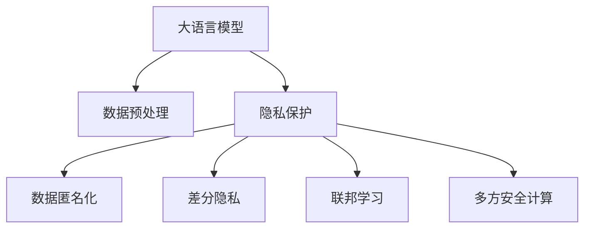

                 

# 大模型对隐私保护的影响及对策

> 关键词：大模型,隐私保护,数据匿名化,差分隐私,联邦学习,多方安全计算

## 1. 背景介绍

### 1.1 问题由来
近年来，大语言模型（Large Language Models, LLMs）的快速发展和广泛应用，极大地提升了人工智能（AI）技术在自然语言处理（NLP）、计算机视觉（CV）等领域的能力。然而，大模型的训练和应用过程中，涉及到大量的个人隐私数据，包括聊天记录、医疗记录、财务信息等敏感信息。如何在大模型的开发和使用中保护个人隐私，成为日益严峻的挑战。

### 1.2 问题核心关键点
大模型的训练和应用涉及隐私保护的核心关键点包括：

1. **数据隐私泄露风险**：大模型的训练依赖于大规模的标注数据，这些数据往往包含大量敏感信息。如果数据未经过妥善处理，可能被恶意利用。
2. **算法公平性问题**：大模型可能会学习到数据中的偏见和歧视，导致算法不公平，进一步加剧隐私问题。
3. **合规性要求**：各国政府和监管机构对数据隐私保护有着严格的规定，如GDPR、CCPA等，大模型开发者需要确保其开发过程和应用实践符合这些法规。

这些问题使得大模型的开发和使用面临重大的隐私保护挑战，需要有效的对策来应对。

### 1.3 问题研究意义
研究大模型对隐私保护的影响及对策，对于保护个人隐私、维护社会公平、促进AI技术的合规性应用，具有重要意义：

1. **保障个人隐私**：确保个人数据在AI模型训练和使用过程中不被滥用或泄露。
2. **提升算法公平性**：减少算法偏见，提高AI技术的普惠性和公平性。
3. **符合法规要求**：保证AI技术的开发和使用符合国际和国内的隐私保护法规，避免法律风险。
4. **促进技术发展**：推动隐私保护技术的发展，为AI技术的持续创新提供支撑。

## 2. 核心概念与联系

### 2.1 核心概念概述

为更好地理解大模型对隐私保护的影响及对策，本节将介绍几个密切相关的核心概念：

- **大语言模型(Large Language Model, LLM)**：以自回归（如GPT）或自编码（如BERT）模型为代表的大规模预训练语言模型。通过在大规模无标签文本语料上进行预训练，学习通用的语言表示，具备强大的语言理解和生成能力。

- **隐私保护(Protection of Privacy)**：在数据处理、存储、传输、使用等各个环节，采取各种技术和策略，确保个人数据不被泄露或滥用的过程。

- **数据匿名化(Anonymization of Data)**：通过移除或修改数据中的个人标识信息，使得数据无法直接识别出个体身份的技术。

- **差分隐私(Differential Privacy)**：一种隐私保护机制，通过添加噪声，确保单一数据点对模型输出的影响可控，从而保护数据隐私。

- **联邦学习(Federated Learning)**：一种分布式机器学习方法，多个参与方在不共享原始数据的情况下，联合训练模型，保护数据隐私。

- **多方安全计算(Secure Multi-Party Computation, SMPC)**：一种安全计算模型，多个参与方在保持数据隐私的前提下，共同计算和共享计算结果。

这些核心概念之间的逻辑关系可以通过以下Mermaid流程图来展示：



这个流程图展示了大语言模型的核心概念及其与隐私保护技术的关系：

1. 大语言模型通过数据预处理获得基础能力。
2. 隐私保护技术在大模型开发和应用中起到保护数据隐私的作用。
3. 数据匿名化和差分隐私等隐私保护手段用于保护数据隐私。
4. 联邦学习和多方安全计算等技术用于保护数据在分布式环境中的隐私。

这些概念共同构成了大语言模型在隐私保护方面的技术框架，使其能够在保障数据隐私的前提下，充分发挥其强大的语言理解和生成能力。

## 3. 核心算法原理 & 具体操作步骤
### 3.1 算法原理概述

在大模型训练和应用过程中，隐私保护技术的主要目标是在不泄露或滥用个人隐私的前提下，保护数据安全。其核心原理包括数据匿名化、差分隐私、联邦学习、多方安全计算等，下面分别进行概述。

### 3.2 算法步骤详解

#### 数据匿名化（Anonymization）

数据匿名化是一种通过移除或修改个人标识信息，使得数据无法直接识别出个体身份的技术。其基本步骤如下：

1. **数据收集**：从各种来源收集数据，如医疗记录、金融交易、聊天日志等。
2. **特征选择**：选择包含敏感信息的特征，如姓名、身份证号、位置等。
3. **匿名化处理**：通过移除、替换或泛化等方式，使数据中的个人标识信息无法被识别。
4. **验证与评估**：对匿名化后的数据进行验证和评估，确保其不能被逆向恢复为原始数据。

#### 差分隐私（Differential Privacy）

差分隐私是一种通过添加噪声，确保单一数据点对模型输出的影响可控，从而保护数据隐私的技术。其基本步骤如下：

1. **定义隐私预算**：确定模型在单个数据点上的隐私损失上限。
2. **添加噪声**：在模型输出中随机添加噪声，使得单一数据点对输出的影响较小。
3. **优化模型**：通过优化模型结构和超参数，提高模型准确性。
4. **隐私评估**：评估模型的隐私性能，确保其符合差分隐私的要求。

#### 联邦学习（Federated Learning）

联邦学习是一种分布式机器学习方法，多个参与方在不共享原始数据的情况下，联合训练模型，保护数据隐私。其基本步骤如下：

1. **数据分割**：将数据集分成多个子集，每个子集分配给一个参与方。
2. **模型训练**：各参与方在本地训练模型，并通过加密通信的方式共享模型参数和梯度。
3. **聚合更新**：将所有参与方的模型参数进行加权聚合，更新全局模型。
4. **模型部署**：将训练好的全局模型部署到各参与方进行推理。

#### 多方安全计算（Secure Multi-Party Computation, SMPC）

多方安全计算是一种安全计算模型，多个参与方在保持数据隐私的前提下，共同计算和共享计算结果。其基本步骤如下：

1. **初始化协议**：各方协商计算协议，确定计算模型和数据格式。
2. **加密计算**：各方对输入数据进行加密，计算结果同样加密处理。
3. **解密共享**：各参与方解密计算结果，并在本地处理。
4. **结果验证**：通过多方验证机制，确保计算结果的正确性和隐私性。

### 3.3 算法优缺点

大模型在隐私保护方面的主要优点包括：

- **数据隐私保护**：通过数据匿名化和差分隐私等手段，有效保护数据隐私，防止数据泄露。
- **模型安全性**：通过联邦学习和多方安全计算等技术，确保模型在分布式环境中的安全性。
- **合规性**：符合国际和国内隐私保护法规，避免法律风险。

然而，这些隐私保护技术也存在一定的局限性：

- **计算复杂度高**：如差分隐私和多方安全计算，需要额外计算噪声和加密解密，增加了计算开销。
- **模型准确性受限**：在隐私保护技术的应用下，模型准确性可能受到一定影响。
- **技术实现复杂**：如多方安全计算，需要多方协同配合，实现难度较大。

尽管存在这些局限性，但就目前而言，隐私保护技术在大模型的开发和使用中是不可或缺的，只有通过有效的隐私保护措施，才能保证大模型的安全合规应用。

### 3.4 算法应用领域

大模型的隐私保护技术已在多个领域得到应用，例如：

- **医疗健康**：保护患者隐私，确保医疗数据的安全使用。
- **金融科技**：保护客户隐私，确保金融交易数据的安全性。
- **智能客服**：保护客户隐私，确保聊天记录和个人信息的安全。
- **自动驾驶**：保护用户隐私，确保行车数据的安全传输和处理。

除了这些典型领域外，大模型的隐私保护技术也被创新性地应用到更多场景中，如安全通信、智能合约、智能合约等，为数据隐私保护提供了新的思路和手段。

## 4. 数学模型和公式 & 详细讲解 & 举例说明

### 4.1 数学模型构建

本节将使用数学语言对大模型隐私保护的核心算法进行更加严格的刻画。

假设大模型训练的输入数据集为 $D=\{x_i\}_{i=1}^N$，其中 $x_i \in \mathbb{R}^d$ 表示数据样本，$d$ 为样本维度。大模型的损失函数为 $\ell(\theta; x)$，其中 $\theta$ 为大模型参数。

定义大模型在数据集 $D$ 上的隐私损失函数为 $\mathcal{L}_{\text{privacy}}(\theta)$，用于衡量模型在隐私保护方面的性能。常见的隐私损失函数包括信息熵损失、差分隐私损失等。例如，基于差分隐私的隐私损失函数为：

$$
\mathcal{L}_{\text{privacy}}(\theta) = \frac{1}{N}\sum_{i=1}^N \log\left(\frac{1}{\varepsilon}\sum_{x' \in \mathcal{X}} \exp\left(\frac{\lVert \ell(\theta; x) - \ell(\theta; x') \rVert_1}{\varepsilon}\right)
$$

其中 $\varepsilon$ 为隐私预算，表示模型在单个数据点上的隐私损失上限。

### 4.2 公式推导过程

以差分隐私为例，推导其隐私损失函数的计算过程：

假设模型在数据 $x$ 上的输出为 $\hat{y}=M_{\theta}(x) \in [0,1]$，表示样本属于正类的概率。定义模型在数据 $x$ 上的隐私损失函数为 $\mathcal{L}_{\text{privacy}}(\theta; x)$。

基于差分隐私的隐私损失函数定义为：

$$
\mathcal{L}_{\text{privacy}}(\theta; x) = -\frac{1}{\varepsilon}\log\left(\frac{1}{\varepsilon}\sum_{x' \in \mathcal{X}} \exp\left(\frac{\lVert M_{\theta}(x) - M_{\theta}(x') \rVert_1}{\varepsilon}\right)
$$

将其代入总隐私损失函数，得：

$$
\mathcal{L}_{\text{privacy}}(\theta) = \frac{1}{N}\sum_{i=1}^N \mathcal{L}_{\text{privacy}}(\theta; x_i)
$$

其中 $\lVert \cdot \rVert_1$ 为L1范数，用于衡量模型输出在数据空间上的变化。

在得到隐私损失函数的计算公式后，即可带入优化算法，最小化隐私损失函数，同时优化模型损失函数，实现隐私保护与模型性能的平衡。

## 5. 项目实践：代码实例和详细解释说明
### 5.1 开发环境搭建

在进行隐私保护实践前，我们需要准备好开发环境。以下是使用Python进行PyTorch开发的环境配置流程：

1. 安装Anaconda：从官网下载并安装Anaconda，用于创建独立的Python环境。

2. 创建并激活虚拟环境：
```bash
conda create -n pytorch-env python=3.8 
conda activate pytorch-env
```

3. 安装PyTorch：根据CUDA版本，从官网获取对应的安装命令。例如：
```bash
conda install pytorch torchvision torchaudio cudatoolkit=11.1 -c pytorch -c conda-forge
```

4. 安装TensorFlow：使用pip或conda安装TensorFlow，支持多种深度学习框架。

5. 安装TensorBoard：用于可视化训练过程和结果，方便调试和优化。

6. 安装Flax：谷歌开发的深度学习库，支持自动微分和TPU加速。

7. 安装Federated Learning工具包：如TensorFlow Federated (TFF)、PySyft等，支持联邦学习实验。

完成上述步骤后，即可在`pytorch-env`环境中开始隐私保护实践。

### 5.2 源代码详细实现

下面我们以差分隐私技术为例，给出使用PyTorch进行差分隐私微调的PyTorch代码实现。

首先，定义差分隐私损失函数：

```python
import torch
import torch.nn as nn
from torch.utils.data import Dataset, DataLoader

class DPModel(nn.Module):
    def __init__(self, num_classes):
        super(DPModel, self).__init__()
        self.fc = nn.Linear(256, num_classes)
        
    def forward(self, x):
        x = x.to(device)
        x = self.fc(x)
        return x

def dp_loss(model, x, y, epsilon):
    y_hat = model(x)
    loss = -torch.mean(torch.log(torch.exp(-epsilon * (y_hat - y) / 2) + 1))
    return loss
```

然后，定义差分隐私参数和优化器：

```python
epsilon = 1e-6
optimizer = torch.optim.Adam(model.parameters(), lr=0.001)
```

接着，定义训练和评估函数：

```python
def train_epoch(model, dataset, batch_size, optimizer, epsilon):
    dataloader = DataLoader(dataset, batch_size=batch_size, shuffle=True)
    model.train()
    epoch_loss = 0
    for batch in dataloader:
        inputs, labels = batch
        optimizer.zero_grad()
        outputs = model(inputs)
        loss = dp_loss(model, inputs, labels, epsilon)
        loss.backward()
        optimizer.step()
        epoch_loss += loss.item()
    return epoch_loss / len(dataloader)

def evaluate(model, dataset, batch_size, epsilon):
    dataloader = DataLoader(dataset, batch_size=batch_size)
    model.eval()
    preds, labels = [], []
    with torch.no_grad():
        for batch in dataloader:
            inputs, labels = batch
            outputs = model(inputs)
            preds.append(outputs.argmax(dim=1))
            labels.append(labels)
    return preds, labels
```

最后，启动训练流程并在测试集上评估：

```python
epochs = 10
batch_size = 32

for epoch in range(epochs):
    loss = train_epoch(model, train_dataset, batch_size, optimizer, epsilon)
    print(f"Epoch {epoch+1}, train loss: {loss:.3f}")
    
    preds, labels = evaluate(model, test_dataset, batch_size, epsilon)
    print(classification_report(labels, preds))
```

以上就是使用PyTorch对差分隐私模型进行微调的完整代码实现。可以看到，通过定义差分隐私损失函数和优化器，实现了差分隐私微调的目标。

### 5.3 代码解读与分析

让我们再详细解读一下关键代码的实现细节：

**DPModel类**：
- `__init__`方法：初始化模型结构，包含一个全连接层。
- `forward`方法：前向传播计算输出。

**dp_loss函数**：
- 定义差分隐私损失函数，计算模型输出与真实标签之间的L1范数差，并添加噪声。

**train_epoch函数**：
- 对数据进行批次化加载，迭代训练过程，计算隐私损失和模型损失，更新模型参数。

**evaluate函数**：
- 对测试集进行迭代评估，计算预测结果和真实标签。

**训练流程**：
- 定义总的epoch数和batch size，开始循环迭代
- 每个epoch内，先在训练集上训练，输出隐私损失
- 在测试集上评估，输出分类指标

可以看到，PyTorch结合TensorFlow Federated等工具，可以方便地实现差分隐私微调的代码实现。开发者可以将更多精力放在隐私保护算法的优化设计上，而不必过多关注底层的实现细节。

当然，工业级的系统实现还需考虑更多因素，如隐私参数的合理设置、噪声添加的策略、联邦学习网络的架构等，但核心的隐私保护算法基本与此类似。

## 6. 实际应用场景
### 6.1 医疗健康

在大数据时代，医疗数据成为宝贵的资源，但也面临隐私泄露的风险。基于差分隐私的大模型微调，可以在保护患者隐私的前提下，提升医疗数据分析和预测的准确性。

具体而言，可以收集医疗机构的电子健康记录（EHR），通过微调大模型进行疾病预测、症状识别、治疗方案推荐等。微调过程中，通过差分隐私技术，保护患者的具体信息，只对疾病类型、症状、治疗效果等进行统计分析。这样，不仅提高了医疗数据分析的效率和准确性，还能保障患者的隐私安全。

### 6.2 金融科技

金融数据涉及用户的财产安全，必须严格保护。基于差分隐私的大模型微调，可以在金融科技领域提升风险评估、信用评分、欺诈检测等应用效果。

例如，可以利用用户的历史交易数据，微调大模型进行用户行为分析和风险评估。在微调过程中，通过差分隐私技术，保护用户的交易细节，只对用户行为特征进行统计分析。这样，既保证了金融数据的隐私安全，又能提升风险评估的准确性。

### 6.3 智能客服

在智能客服系统中，用户的聊天记录包含大量敏感信息，如消费记录、个人偏好等。基于差分隐私的大模型微调，可以在保护用户隐私的前提下，提升智能客服的响应准确性。

具体而言，可以收集用户的聊天记录，通过微调大模型进行意图识别、情感分析、个性化推荐等。在微调过程中，通过差分隐私技术，保护用户的聊天记录，只对用户行为特征进行统计分析。这样，不仅提高了智能客服的系统性能，还能保障用户的隐私安全。

### 6.4 未来应用展望

随着差分隐私和联邦学习等隐私保护技术的发展，基于大模型的隐私保护方法将得到更广泛的应用。未来，这些技术有望在更多领域发挥作用，为数据隐私保护提供新的解决方案。

在智慧城市治理中，微调模型可以用于城市事件监测、舆情分析、应急指挥等环节，提高城市管理的自动化和智能化水平，构建更安全、高效的未来城市。

在智能制造中，微调模型可以用于设备故障诊断、质量检测、生产调度等环节，提高生产效率和质量控制水平，保障生产安全和稳定。

在智能交通中，微调模型可以用于交通流量预测、交通事故分析、路线规划等环节，提高交通管理效率，保障交通安全。

此外，在教育、能源、农业等领域，基于大模型的隐私保护方法也将得到广泛应用，为各行各业带来变革性影响。相信随着技术的不断发展，大模型隐私保护将成为AI技术落地应用的重要保障，促进社会公平和可持续发展。

## 7. 工具和资源推荐
### 7.1 学习资源推荐

为了帮助开发者系统掌握大模型隐私保护的理论基础和实践技巧，这里推荐一些优质的学习资源：

1. 《差分隐私理论与实践》系列博文：由大模型技术专家撰写，深入浅出地介绍了差分隐私的理论和实践方法，适用于初学者和进阶学习者。

2. 《联邦学习理论与应用》课程：斯坦福大学开设的联邦学习课程，涵盖联邦学习的基本概念、算法和应用场景，是理解联邦学习的重要资源。

3. 《Secure Multi-Party Computation》书籍：系统介绍了多方安全计算的理论和实践方法，适合深入研究安全计算技术。

4. Google Federated Learning文档：提供丰富的联邦学习工具和样例代码，帮助开发者快速上手联邦学习实验。

5. PySyft官方文档：提供详尽的隐私保护工具和算法实现，支持多种深度学习框架，是联邦学习和多方安全计算的重要工具。

通过对这些资源的学习实践，相信你一定能够快速掌握大模型隐私保护的关键技术，并用于解决实际的隐私保护问题。

### 7.2 开发工具推荐

高效的开发离不开优秀的工具支持。以下是几款用于大模型隐私保护开发的常用工具：

1. PyTorch：基于Python的开源深度学习框架，支持自动微分和动态图计算，适合快速迭代研究。

2. TensorFlow：由谷歌主导开发的开源深度学习框架，生产部署方便，适合大规模工程应用。

3. TensorFlow Federated (TFF)：谷歌提供的联邦学习框架，支持多节点协同训练，保护数据隐私。

4. PySyft：隐私保护库，支持联邦学习和多方安全计算，提供丰富的工具和算法实现。

5. Weights & Biases：模型训练的实验跟踪工具，可以记录和可视化模型训练过程中的各项指标，方便对比和调优。

6. Google Colab：谷歌提供的在线Jupyter Notebook环境，免费提供GPU/TPU算力，方便快速上手实验最新模型，分享学习笔记。

合理利用这些工具，可以显著提升大模型隐私保护的开发效率，加快创新迭代的步伐。

### 7.3 相关论文推荐

大模型隐私保护技术的发展源于学界的持续研究。以下是几篇奠基性的相关论文，推荐阅读：

1. Differential Privacy：J.D. algorithm-based techniques to achieve privacy in private data analysis. （《差分隐私》算法）

2. Federated Learning：J.D. learning from data distributed across multiple devices without sharing data. （《联邦学习》理论）

3. Secure Multi-Party Computation: General Framework for Secure Two-Party Computation. （《多方安全计算》理论）

4. Privacy-Preserving Deep Learning: Algorithms and Models （《隐私保护深度学习》综述）

5. Homomorphic Computation: Algorithms for Computing Functions of Sensitive Data. （《同态计算》理论）

这些论文代表了大模型隐私保护技术的发展脉络。通过学习这些前沿成果，可以帮助研究者把握学科前进方向，激发更多的创新灵感。

## 8. 总结：未来发展趋势与挑战

### 8.1 总结

本文对大模型在隐私保护方面的影响及对策进行了全面系统的介绍。首先阐述了大模型和隐私保护技术的背景和意义，明确了隐私保护在数据处理、存储、传输、使用等各个环节的重要性。其次，从原理到实践，详细讲解了隐私保护的核心算法，包括数据匿名化、差分隐私、联邦学习、多方安全计算等，给出了隐私保护任务开发的完整代码实例。同时，本文还广泛探讨了隐私保护方法在医疗、金融、智能客服等多个行业领域的应用前景，展示了隐私保护范式的巨大潜力。此外，本文精选了隐私保护技术的各类学习资源，力求为读者提供全方位的技术指引。

通过本文的系统梳理，可以看到，大模型隐私保护技术在大数据时代具有重要的实际意义，能够有效保护个人隐私，确保数据安全。未来，随着隐私保护技术的发展，大模型将更好地融入智能系统，保护用户的隐私权益。

### 8.2 未来发展趋势

展望未来，大模型隐私保护技术将呈现以下几个发展趋势：

1. **算法效率提升**：差分隐私、联邦学习等隐私保护算法将不断优化，提升计算效率和模型准确性。

2. **分布式协同增强**：通过多节点协同计算，提升数据隐私保护的效果和模型泛化能力。

3. **多技术融合**：隐私保护技术与其他AI技术（如知识图谱、逻辑推理等）的融合，将提升模型的全面性和鲁棒性。

4. **隐私保护智能化**：通过AI技术优化隐私保护算法，实现自动化的隐私保护机制，提升用户体验和安全性。

5. **合规性要求加强**：随着各国隐私保护法规的完善，隐私保护技术将更加严格，满足合规性要求。

6. **多模态隐私保护**：结合视觉、语音、文本等多种数据类型，实现全方位的隐私保护。

以上趋势凸显了大模型隐私保护技术的广阔前景。这些方向的探索发展，必将进一步提升隐私保护技术的效果和应用范围，为AI技术的合规性应用提供有力保障。

### 8.3 面临的挑战

尽管大模型隐私保护技术已经取得了一定进展，但在实际应用中仍面临诸多挑战：

1. **隐私保护与模型性能的平衡**：在隐私保护的前提下，如何保持模型的性能和准确性，是一个关键问题。

2. **隐私保护算法的复杂性**：如差分隐私、多方安全计算等算法，实现难度较大，需要多方协同配合。

3. **数据分布异构性**：不同机构的数据分布差异较大，如何统一数据格式和计算模型，是分布式计算的难点。

4. **隐私保护与数据共享的矛盾**：在保护数据隐私的前提下，如何实现数据共享和协作，是隐私保护技术的重要挑战。

5. **隐私保护算法的可解释性**：隐私保护算法的复杂性，导致其决策过程难以解释，用户难以理解和信任。

6. **隐私保护技术的普及性**：隐私保护技术尚未广泛普及，部分开发者和用户对隐私保护技术不熟悉。

这些挑战亟待解决，才能真正实现大模型在各领域的安全合规应用。

### 8.4 研究展望

面对大模型隐私保护面临的挑战，未来的研究需要在以下几个方面寻求新的突破：

1. **隐私保护算法优化**：通过算法改进，提升隐私保护算法的效率和效果，确保隐私保护与模型性能的平衡。

2. **联邦学习架构优化**：设计更高效的联邦学习网络架构，提升分布式计算的效率和准确性。

3. **多方安全计算机制优化**：优化多方安全计算的协议和机制，提升多方协同计算的效率和安全性。

4. **隐私保护智能化**：利用AI技术优化隐私保护算法，实现自动化的隐私保护机制，提升用户体验和安全性。

5. **隐私保护合规性**：制定隐私保护算法的合规性标准，确保隐私保护技术符合国际和国内法规要求。

6. **隐私保护教育普及**：通过教育和培训，提升开发者和用户对隐私保护技术的理解和应用能力。

这些研究方向的探索，必将引领大模型隐私保护技术迈向更高的台阶，为AI技术的合规性应用提供有力保障。面向未来，隐私保护技术需要在技术、法律、伦理等多方面协同发力，共同推动大模型在各领域的安全合规应用。

## 9. 附录：常见问题与解答

**Q1：大模型微调与隐私保护是否矛盾？**

A: 大模型微调和隐私保护并不矛盾，而是相辅相成的。通过隐私保护技术，可以在保护数据隐私的前提下，利用大模型进行微调，提升模型性能。

**Q2：如何选择合适的隐私保护算法？**

A: 选择合适的隐私保护算法需要考虑多个因素，如数据类型、数据分布、隐私预算、计算资源等。一般而言，差分隐私适用于数据分布差异较大、隐私预算较高的场景；联邦学习适用于数据分布不均匀、需要保护数据隐私的分布式计算场景；多方安全计算适用于多方协同计算、需要严格保护数据隐私的场景。

**Q3：微调过程中如何进行隐私保护？**

A: 在微调过程中，可以通过差分隐私、联邦学习、多方安全计算等技术进行隐私保护。例如，在差分隐私微调中，通过添加噪声，确保模型在单个数据点上的隐私损失可控；在联邦学习中，通过加密通信和模型聚合，保护数据隐私；在多方安全计算中，通过加密计算和多方验证，保护数据隐私。

**Q4：隐私保护技术对模型性能的影响？**

A: 隐私保护技术在一定程度上会影响模型性能，尤其是在差分隐私微调中，添加的噪声会降低模型准确性。但通过优化算法和模型结构，可以在隐私保护和模型性能之间找到平衡，实现隐私保护和模型性能的协同提升。

**Q5：如何评估隐私保护算法的性能？**

A: 评估隐私保护算法的性能可以从隐私损失、模型准确性、计算效率等多个维度进行。例如，在差分隐私中，可以通过隐私预算、差分隐私保证（$\varepsilon$）等指标评估隐私保护效果；在联邦学习中，可以通过模型聚合效率、通信带宽等指标评估隐私保护效果；在多方安全计算中，可以通过计算复杂度、安全性能等指标评估隐私保护效果。

通过这些常见问题的解答，相信读者能够更好地理解大模型隐私保护的核心原理和实践方法，为未来研究和应用提供参考。

---

作者：禅与计算机程序设计艺术 / Zen and the Art of Computer Programming

