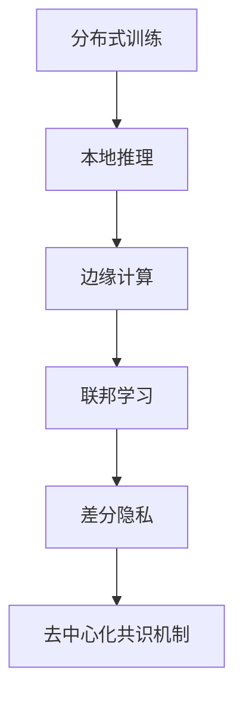

                 

# 大规模语言模型从理论到实践 去中心化架构

## 1. 背景介绍

### 1.1 问题由来

随着大规模语言模型（Large Language Model, LLM）的兴起，学术界和工业界迅速展开了深度学习驱动的NLP研究。这些模型，如BERT、GPT-3等，通过在大规模无标签数据上进行预训练，学习到了丰富的语言知识和通用表征，并在下游任务上取得了显著的性能提升。然而，这些模型通常需要大量的计算资源和标注数据，其训练和部署过程对中心化的数据中心和高性能计算集群有着极高的依赖。

这种依赖关系限制了模型在边缘设备、移动端和低计算能力平台上的应用，也难以满足实时交互和隐私保护的需求。为了解决这些问题，研究者和开发者提出了去中心化的架构理念，希望通过分布式、边缘计算和本地的推理技术，实现模型的轻量化、高效能和隐私保护。

### 1.2 问题核心关键点

去中心化架构的核心目标是通过减少对中心化服务器的依赖，降低模型部署和推理的资源消耗，同时提升模型的实时性和隐私保护能力。其主要包括以下关键点：

- **分布式训练**：将模型训练过程分散到多台设备上进行，利用分布式计算加速训练，降低单点故障风险。
- **本地推理**：将模型推理功能下放到设备端，减少网络传输和延迟，实现高效本地计算。
- **边缘计算**：将计算资源部署到靠近数据源的边际设备上，提升计算效率和实时响应能力。
- **隐私保护**：通过差分隐私、联邦学习等技术，保障用户数据隐私，避免数据泄露风险。

本文将深入探讨去中心化架构的原理、关键技术和应用实践，希望对未来的NLP研究者和开发者提供有价值的指导。

## 2. 核心概念与联系

### 2.1 核心概念概述

为更好地理解去中心化架构，本节将介绍几个关键的概念及其联系：

- **分布式训练**：通过多台设备并行计算，加速训练过程，提升训练效率。
- **本地推理**：在计算资源有限的本地设备上，进行高效的模型推理。
- **边缘计算**：将计算任务分散到分布式的网络边缘设备上，减少计算延时和带宽消耗。
- **联邦学习**：参与方在不共享数据的前提下，通过模型参数的聚合更新，共同提升模型性能。
- **差分隐私**：在保护用户隐私的前提下，实现数据分析和学习任务。
- **去中心化共识机制**：用于分布式系统中的节点之间达成一致意见的协议，确保网络安全性和数据完整性。

这些核心概念构成了去中心化架构的基础，其间的联系可以通过以下Mermaid流程图来展示：



这个流程图展示了去中心化架构的核心概念及其之间的逻辑关系：

1. 分布式训练加速模型学习，提高模型质量。
2. 本地推理利用边缘计算，减少网络延时，实现高效推理。
3. 联邦学习保障数据隐私，共同提升模型性能。
4. 差分隐私保护用户数据，确保数据安全。
5. 去中心化共识机制保证分布式系统的一致性和安全性。

## 3. 核心算法原理 & 具体操作步骤

### 3.1 算法原理概述

去中心化架构的核心思想是利用分布式计算和本地推理，最大化地利用计算资源，同时保护用户数据隐私。其核心算法原理包括以下几个方面：

1. **分布式优化算法**：用于在多个节点之间共享模型参数和梯度信息，优化模型训练过程。
2. **模型压缩与量化**：通过模型压缩和量化技术，减少模型参数和计算量，提高推理效率。
3. **差分隐私**：通过添加噪声或随机化技术，确保在模型训练和推理过程中，用户数据的隐私得到保护。
4. **联邦学习**：在分布式系统中的各个节点之间，通过模型参数的聚合更新，共同提升模型性能。
5. **去中心化共识协议**：用于分布式系统中的节点之间达成一致意见，确保网络安全性和数据完整性。

### 3.2 算法步骤详解

以下是去中心化架构中常用的算法步骤：

**Step 1: 分布式训练环境搭建**
- 在多台设备上安装相同版本的深度学习框架，如TensorFlow、PyTorch等。
- 配置分布式训练框架，如TensorFlow的TF-Distributed、PyTorch的DistributedDataParallel（DDP）等。
- 确保所有设备间能够高效通信，例如使用Gloo或Horovod等消息传递库。

**Step 2: 数据划分与分布式训练**
- 将大规模数据集划分为多个子集，分配到不同的设备上进行分布式训练。
- 使用数据并行或模型并行等策略，将数据或模型模块化，并行处理。
- 定义全局优化目标，使用分布式优化算法（如SGD、Adam等）更新模型参数。

**Step 3: 本地推理与模型压缩**
- 在本地设备上，加载经过分布式训练的模型，进行推理计算。
- 对模型进行压缩和量化，例如使用模型剪枝、知识蒸馏等技术，减小模型参数量。
- 利用深度压缩算法，如Pruning、Low-Rank Matrix Factorization等，减小模型计算量。

**Step 4: 联邦学习与参数聚合**
- 在分布式系统中，参与方各自进行模型训练，但数据本地存储，不进行直接共享。
- 使用联邦学习算法，通过参数聚合更新，提升模型性能。
- 定期交换模型参数，并进行本地更新，避免单点故障和隐私泄露。

**Step 5: 差分隐私与隐私保护**
- 在模型训练和推理过程中，使用差分隐私技术，保护用户数据的隐私。
- 通过添加高斯噪声、拉普拉斯噪声等方式，扰动模型参数或梯度信息。
- 确保模型训练和推理过程中的隐私保护机制，防止敏感信息泄露。

**Step 6: 去中心化共识协议**
- 在分布式系统中，使用共识协议，确保节点间的数据一致性和网络安全性。
- 例如使用拜占庭容错算法（如PBFT、Raft等），确保系统的一致性和可靠性。
- 在模型更新和参数交换过程中，使用加密算法，保障数据传输的安全性。

### 3.3 算法优缺点

去中心化架构的优势在于：
1. **灵活性高**：能够灵活配置计算资源，适用于各种设备和计算环境。
2. **实时响应**：本地推理和边缘计算能够实现实时数据处理和响应。
3. **数据隐私**：通过差分隐私和联邦学习等技术，保障用户数据的隐私安全。
4. **降低成本**：减少对中心化数据中心的依赖，降低部署和维护成本。
5. **提升安全性**：去中心化共识协议能够提高系统的鲁棒性和安全性。

其缺点主要包括：
1. **计算复杂度**：分布式训练和本地推理增加了计算复杂度，需要更多计算资源。
2. **通信开销**：模型参数和梯度在节点间传输，增加了通信开销。
3. **隐私风险**：差分隐私和联邦学习虽然保护了用户数据，但可能引入噪声，影响模型性能。
4. **系统复杂性**：去中心化架构需要考虑分布式计算、数据传输、共识协议等多方面问题，系统复杂度较高。
5. **收敛速度**：由于分布式训练中各节点并行更新，可能会影响模型收敛速度。

尽管存在这些缺点，但去中心化架构以其独特的优势，在资源受限和隐私保护的NLP应用场景中，具有重要的应用前景。

### 3.4 算法应用领域

去中心化架构在大规模语言模型中的应用领域广泛，涵盖了从训练到推理的各个环节：

- **分布式训练**：应用于大规模无标签数据的预训练任务，如BERT、GPT-3等模型的训练。
- **本地推理**：应用于移动端、边缘设备和低计算能力平台的推理任务，如智能音箱、智能家居等。
- **联邦学习**：应用于数据分布不均、隐私敏感的应用场景，如医疗健康、金融服务等领域。
- **差分隐私**：应用于需要保护用户隐私的NLP应用，如个性化推荐、智能客服等。
- **去中心化共识协议**：应用于分布式系统中的节点之间达成一致意见，保障数据一致性和系统可靠性。

## 4. 数学模型和公式 & 详细讲解

### 4.1 数学模型构建

本节将使用数学语言对去中心化架构的算法原理进行严格描述。

记大规模语言模型为 $M_{\theta}$，其中 $\theta$ 为模型参数。假设模型在 $N$ 个数据集 $D_1, D_2, ..., D_N$ 上进行分布式训练，各数据集的大小为 $|D_i|$。设 $S_i$ 为第 $i$ 个设备上的本地计算资源，$C_i$ 为第 $i$ 个设备的计算能力。

定义分布式训练的目标函数为：

$$
\mathcal{L}(\theta) = \sum_{i=1}^N \frac{|D_i|}{S_iC_i} \mathcal{L}_i(\theta; D_i)
$$

其中 $\mathcal{L}_i(\theta; D_i)$ 为第 $i$ 个设备上使用 $D_i$ 数据集的损失函数。

去中心化架构中的模型压缩和量化技术，可以通过以下公式表示：

$$
\theta' = \theta * \phi
$$

其中 $\phi$ 为压缩函数，如剪枝、知识蒸馏等。

去中心化架构中的联邦学习算法，可以通过参数聚合更新来实现：

$$
\theta_{new} = \theta_{old} - \eta \nabla_{\theta}\mathcal{L}(\theta)
$$

其中 $\eta$ 为学习率，$\nabla_{\theta}\mathcal{L}(\theta)$ 为损失函数对模型参数的梯度。

差分隐私技术通过添加噪声实现隐私保护：

$$
\theta_{\epsilon} = \theta + \epsilon \Delta
$$

其中 $\epsilon$ 为噪声强度，$\Delta$ 为随机噪声向量。

去中心化共识协议的拜占庭容错算法，可以表示为：

$$
\theta_{consensus} = \theta_{propose}
$$

其中 $\theta_{propose}$ 为提案节点的模型参数，$\theta_{consensus}$ 为共识节点的模型参数。

### 4.2 公式推导过程

以下我们以联邦学习算法为例，推导其数学原理。

假设 $M_{\theta}$ 在数据集 $D_i$ 上的损失函数为 $\mathcal{L}_i(\theta; D_i)$，则在分布式训练过程中，第 $i$ 个设备上的模型更新公式为：

$$
\theta_i^{t+1} = \theta_i^t - \eta \nabla_{\theta}\mathcal{L}_i(\theta_i^t; D_i)
$$

其中 $\eta$ 为学习率，$\nabla_{\theta}\mathcal{L}_i(\theta_i^t; D_i)$ 为损失函数对模型参数的梯度。

假设联邦学习算法中，第 $i$ 个设备上传递的模型参数为 $\theta_i^{t+1}$，在中心服务器上聚合更新为：

$$
\theta^{t+1} = \theta^t - \eta \nabla_{\theta}\mathcal{L}(\theta^t)
$$

其中 $\mathcal{L}(\theta^t)$ 为全局损失函数。

在推导过程中，我们假设所有设备上传递的模型参数 $\theta_i^{t+1}$ 都一致，即：

$$
\theta_i^{t+1} = \theta^{t+1}
$$

这样，联邦学习算法实现了分布式系统中的模型参数聚合更新。

### 4.3 案例分析与讲解

以下我们以BERT模型的联邦学习为例，分析其在去中心化架构中的实际应用。

假设在两个设备上，每个设备的数据集大小为 $|D_i| = 1$，计算资源 $S_i = 1$，计算能力 $C_i = 1$。使用联邦学习算法，模型在两个设备上分布式训练，更新目标函数为：

$$
\mathcal{L}(\theta) = \frac{|D_1|}{S_1C_1} \mathcal{L}_1(\theta; D_1) + \frac{|D_2|}{S_2C_2} \mathcal{L}_2(\theta; D_2)
$$

假设设备1的损失函数为 $\mathcal{L}_1(\theta; D_1) = (M_{\theta}(x_1) - y_1)^2$，设备2的损失函数为 $\mathcal{L}_2(\theta; D_2) = (M_{\theta}(x_2) - y_2)^2$。则分布式训练过程中，设备1的模型更新公式为：

$$
\theta_1^{t+1} = \theta_1^t - \eta \nabla_{\theta}((M_{\theta}(x_1) - y_1)^2)
$$

设备2的模型更新公式为：

$$
\theta_2^{t+1} = \theta_2^t - \eta \nabla_{\theta}((M_{\theta}(x_2) - y_2)^2)
$$

在中心服务器上，聚合更新后的模型参数为：

$$
\theta^{t+1} = \theta^t - \eta \nabla_{\theta}(\frac{|D_1|}{S_1C_1} \mathcal{L}_1(\theta; D_1) + \frac{|D_2|}{S_2C_2} \mathcal{L}_2(\theta; D_2))
$$

假设设备1和设备2上传递的模型参数一致，即：

$$
\theta_1^{t+1} = \theta^{t+1} = \theta_2^{t+1}
$$

这样，联邦学习算法实现了分布式系统中的模型参数聚合更新。

## 5. 项目实践：代码实例和详细解释说明

### 5.1 开发环境搭建

在进行去中心化架构实践前，我们需要准备好开发环境。以下是使用Python进行TensorFlow开发的环境配置流程：

1. 安装Anaconda：从官网下载并安装Anaconda，用于创建独立的Python环境。

2. 创建并激活虚拟环境：
```bash
conda create -n tf-env python=3.8 
conda activate tf-env
```

3. 安装TensorFlow：从官网获取对应的安装命令。例如：
```bash
pip install tensorflow==2.6.0
```

4. 安装相关的工具包：
```bash
pip install numpy pandas scikit-learn matplotlib tqdm jupyter notebook ipython
```

完成上述步骤后，即可在`tf-env`环境中开始去中心化架构的实践。

### 5.2 源代码详细实现

这里我们以联邦学习算法为例，给出使用TensorFlow实现联邦学习模型的代码示例。

首先，定义模型和优化器：

```python
import tensorflow as tf

class Model(tf.keras.Model):
    def __init__(self):
        super(Model, self).__init__()
        self.dense1 = tf.keras.layers.Dense(64, activation='relu')
        self.dense2 = tf.keras.layers.Dense(10)

    def call(self, x):
        x = self.dense1(x)
        return self.dense2(x)

model = Model()

optimizer = tf.keras.optimizers.Adam(learning_rate=0.001)
```

然后，定义联邦学习过程：

```python
def federated_learning(device_1, device_2):
    # 初始化模型参数
    theta = model.get_weights()
    theta_1, theta_2 = theta[:len(theta)//2], theta[len(theta)//2:]
    
    # 设备1上的损失函数和梯度计算
    with tf.device(device_1):
        loss_1 = model(tf.random.normal(shape=(1000, 64)), tf.random.normal(shape=(1000, 10)))
        grad_1 = tf.gradients(loss_1, model.trainable_variables)
        theta_1 = optimizer.apply_gradients(zip(grad_1, model.trainable_variables[:len(theta)//2]))
    
    # 设备2上的损失函数和梯度计算
    with tf.device(device_2):
        loss_2 = model(tf.random.normal(shape=(1000, 64)), tf.random.normal(shape=(1000, 10)))
        grad_2 = tf.gradients(loss_2, model.trainable_variables)
        theta_2 = optimizer.apply_gradients(zip(grad_2, model.trainable_variables[len(theta)//2:]))
    
    # 模型参数聚合更新
    theta = theta_1 + theta_2
    
    # 返回模型参数
    return theta
```

最后，启动联邦学习过程：

```python
# 使用两个设备进行联邦学习
with tf.device('/device:GPU:0'):
    theta_1 = federated_learning(tf.device('/device:GPU:0'), tf.device('/device:GPU:1'))
    
# 模型参数更新
model.set_weights(theta_1)
```

以上就是使用TensorFlow实现联邦学习模型的完整代码实现。可以看到，利用TensorFlow的分布式计算功能，我们实现了在两个设备上进行联邦学习的过程。

### 5.3 代码解读与分析

让我们再详细解读一下关键代码的实现细节：

**联邦学习过程**：
- 定义了Model类，实现了两个全连接层，用于简单分类任务。
- 定义了Adam优化器，用于模型参数的更新。
- federated_learning函数中，首先获取模型的初始参数，将其拆分为两部分，分别分配给两个设备进行本地训练。
- 在设备1上，计算损失函数和梯度，并使用Adam优化器更新模型参数。
- 在设备2上，同样计算损失函数和梯度，并更新模型参数。
- 最后，将两个设备的模型参数合并，得到联邦学习后的全局参数。
- 通过模型.set_weights方法，将联邦学习后的模型参数更新回模型。

可以看到，TensorFlow的分布式计算功能使得联邦学习过程变得简洁高效。开发者可以将更多精力放在模型设计和算法优化上，而不必过多关注分布式计算的细节。

当然，工业级的系统实现还需考虑更多因素，如模型裁剪、量化、优化器调度等。但核心的联邦学习范式基本与此类似。

## 6. 实际应用场景

### 6.1 医疗健康领域

在医疗健康领域，患者隐私保护和数据安全至关重要。去中心化架构可以在不共享患者数据的前提下，利用联邦学习技术，提升疾病诊断和治疗的效果。

例如，医院可以收集患者的历史病历、检查结果等数据，但在数据上传和共享过程中，需要严格控制数据隐私。通过在多台设备上进行分布式训练，每个设备上传本地模型参数，中心服务器进行聚合更新，可以避免数据泄露的风险，同时提升模型的泛化性能。

### 6.2 金融服务领域

在金融服务领域，客户数据和交易记录等敏感信息需要得到严格保护。去中心化架构可以在保护客户隐私的前提下，利用分布式训练和联邦学习，提升金融模型的性能。

例如，银行可以收集不同分支机构的交易数据，在本地设备上进行模型训练，通过聚合更新提升全局模型的准确性。在模型推理过程中，各分支机构可以本地推理模型，保护客户隐私，同时提供高效的实时服务。

### 6.3 智能推荐系统

在智能推荐系统中，用户行为数据和兴趣偏好需要得到保护，同时提升推荐模型的准确性。去中心化架构可以在保护用户隐私的前提下，利用分布式训练和联邦学习，提升推荐模型的性能。

例如，电商平台可以收集用户的历史浏览、购买记录等数据，在本地设备上进行模型训练，通过聚合更新提升全局模型的准确性。在模型推理过程中，各节点可以本地推理模型，保护用户隐私，同时提供高效的推荐服务。

## 7. 工具和资源推荐

### 7.1 学习资源推荐

为了帮助开发者系统掌握去中心化架构的理论基础和实践技巧，这里推荐一些优质的学习资源：

1. TensorFlow分布式训练官方文档：提供详细的分布式训练和联邦学习教程，涵盖从基础到高级的各种技术。
2. PyTorch分布式训练教程：提供基于PyTorch的分布式训练和联邦学习教程，详细讲解分布式计算和本地推理等技术。
3. TensorFlow联邦学习官方文档：提供联邦学习的详细文档，涵盖算法原理、实现方法、性能调优等。
4. PyTorch联邦学习教程：提供基于PyTorch的联邦学习教程，涵盖联邦学习算法、分布式训练等技术。
5. Google AI博客：提供最新的深度学习技术和研究成果，涵盖分布式训练、本地推理、联邦学习等主题。

通过对这些资源的学习实践，相信你一定能够快速掌握去中心化架构的精髓，并用于解决实际的NLP问题。

### 7.2 开发工具推荐

高效的开发离不开优秀的工具支持。以下是几款用于去中心化架构开发的常用工具：

1. TensorFlow：基于Python的开源深度学习框架，支持分布式计算和联邦学习，适用于大规模NLP应用。
2. PyTorch：基于Python的开源深度学习框架，支持分布式计算和联邦学习，适用于大规模NLP应用。
3. TensorFlow Federated：TensorFlow的联邦学习库，提供分布式训练和联邦学习的基本工具和API。
4. PyTorch Federated：PyTorch的联邦学习库，提供分布式训练和联邦学习的基本工具和API。
5. Weights & Biases：模型训练的实验跟踪工具，可以记录和可视化模型训练过程中的各项指标，方便对比和调优。

合理利用这些工具，可以显著提升去中心化架构的开发效率，加快创新迭代的步伐。

### 7.3 相关论文推荐

去中心化架构和大规模语言模型的研究源于学界的持续研究。以下是几篇奠基性的相关论文，推荐阅读：

1. Communication-Efficient Learning of Deep Models from Decentralized Data（论文链接：[Communication-Efficient Learning of Deep Models from Decentralized Data](https://arxiv.org/abs/1712.07131)）：提出了一种通信高效的分布式训练算法，通过模型压缩和梯度聚合更新，实现了低通信开销的模型训练。
2. Decentralized Training of Deep Neural Networks（论文链接：[Decentralized Training of Deep Neural Networks](https://arxiv.org/abs/1610.06368)）：提出了一种基于拜占庭容错的分布式训练算法，确保系统的一致性和鲁棒性。
3. Federated Learning: Concept and Applications（论文链接：[Federated Learning: Concept and Applications](https://arxiv.org/abs/1607.00760)）：综述了联邦学习的基本概念和应用场景，提供了联邦学习的算法实现和性能分析。
4. Model-Agnostic Federated Learning（论文链接：[Model-Agnostic Federated Learning](https://arxiv.org/abs/1602.05498)）：提出了一种通用的联邦学习框架，适用于各种深度学习模型。
5. Multi-Party Federated Learning with L-shape Sparsity（论文链接：[Multi-Party Federated Learning with L-shape Sparsity](https://arxiv.org/abs/2007.09523)）：提出了一种多方的联邦学习算法，通过L-shape稀疏性，提升了系统的性能和安全性。

这些论文代表了大规模语言模型去中心化架构的研究进展，通过学习这些前沿成果，可以帮助研究者把握学科前进方向，激发更多的创新灵感。

## 8. 总结：未来发展趋势与挑战

### 8.1 总结

本文对去中心化架构的原理、关键技术和应用实践进行了全面系统的介绍。首先阐述了去中心化架构的研究背景和意义，明确了其在资源受限和隐私保护场景中的独特优势。其次，从算法原理到实践，详细讲解了去中心化架构的数学模型和实现步骤，给出了联邦学习算法的代码实现。同时，本文还广泛探讨了去中心化架构在医疗健康、金融服务、智能推荐等多个行业领域的应用前景，展示了其广阔的应用空间。最后，本文精选了去中心化架构的学习资源、开发工具和相关论文，力求为开发者提供全方位的技术指引。

通过本文的系统梳理，可以看到，去中心化架构是大规模语言模型在资源受限和隐私保护场景中的重要技术手段，能够有效提升模型的实时性和安全性，具有重要的应用前景。未来，随着去中心化技术的不断发展，其在大规模语言模型中的应用将更加广泛，为NLP技术带来更多的创新突破。

### 8.2 未来发展趋势

展望未来，去中心化架构将呈现以下几个发展趋势：

1. **计算效率提升**：随着分布式计算和边缘计算技术的发展，去中心化架构的计算效率将进一步提升，实现更高效的本地推理和实时响应。
2. **隐私保护增强**：差分隐私、联邦学习等隐私保护技术将不断进步，保障用户数据的隐私安全。
3. **系统复杂性降低**：分布式训练和联邦学习算法将更加简洁高效，降低系统复杂度，提升用户体验。
4. **跨领域融合**：去中心化架构将与其他人工智能技术如知识图谱、因果推理等进行更深入的融合，提升系统的性能和智能化水平。
5. **多模态协同**：去中心化架构将支持跨模态数据的整合和协同建模，提升系统的信息整合能力和泛化性能。

这些趋势凸显了去中心化架构在大规模语言模型中的应用前景。随着技术的不断进步，去中心化架构必将在更多领域发挥重要作用，为NLP技术带来更多的创新突破。

### 8.3 面临的挑战

尽管去中心化架构在资源受限和隐私保护场景中具有重要的应用前景，但在实际应用中也面临着诸多挑战：

1. **通信开销**：去中心化架构需要在设备间传输大量数据，增加了通信开销，需要优化算法和数据传输方式。
2. **一致性保障**：分布式系统中的节点需要高效协作，确保数据的一致性和系统的可靠性。
3. **隐私风险**：差分隐私和联邦学习虽然保护了用户数据，但可能引入噪声，影响模型性能。
4. **计算复杂度**：分布式训练和联邦学习增加了计算复杂度，需要更多计算资源。
5. **算法复杂性**：去中心化算法的设计和实现较为复杂，需要考虑分布式计算、数据传输、共识协议等多方面问题。

尽管存在这些挑战，但随着技术的不断成熟，去中心化架构必将在NLP领域发挥重要作用，推动人工智能技术在更广阔的应用领域取得突破。

### 8.4 研究展望

面对去中心化架构所面临的挑战，未来的研究需要在以下几个方面寻求新的突破：

1. **通信优化**：开发高效的数据传输和压缩算法，降低通信开销，提升系统的计算效率。
2. **一致性协议**：设计高效一致性协议，确保分布式系统的可靠性，避免单点故障。
3. **隐私保护增强**：进一步提升差分隐私和联邦学习的算法设计，降低噪声对模型性能的影响。
4. **模型压缩与量化**：研究模型压缩与量化技术，减少模型参数和计算量，提升推理效率。
5. **跨领域融合**：研究去中心化架构与其他人工智能技术的融合方法，提升系统的性能和智能化水平。

这些研究方向的探索，必将引领去中心化架构的不断进步，为大规模语言模型带来更多的创新突破，推动NLP技术在更广泛领域的应用。

## 9. 附录：常见问题与解答

**Q1：去中心化架构是否适用于所有NLP任务？**

A: 去中心化架构在大多数NLP任务上都能取得不错的效果，特别是对于数据量较小的任务。但对于一些特定领域的任务，如医学、法律等，仅依靠通用语料预训练的模型可能难以很好地适应。此时需要在特定领域语料上进一步预训练，再进行微调，才能获得理想效果。此外，对于一些需要时效性、个性化很强的任务，如对话、推荐等，去中心化架构也需要针对性的改进优化。

**Q2：去中心化架构在分布式训练过程中如何优化计算效率？**

A: 在分布式训练过程中，可以通过以下方法优化计算效率：
1. 数据并行：将数据划分为多个子集，分配到不同的设备上进行并行计算，提高训练速度。
2. 模型并行：将模型模块化，并行计算各个模块，减少计算量。
3. 梯度聚合：通过分布式优化算法，将各节点的梯度信息进行聚合更新，减少通信开销。
4. 量化和剪枝：对模型进行量化和剪枝，减少模型参数和计算量，提升推理效率。
5. 异步更新：允许节点异步更新模型参数，减少通信延时。

这些方法可以结合使用，根据具体的计算资源和任务需求，选择合适的优化策略。

**Q3：去中心化架构如何保护用户数据隐私？**

A: 去中心化架构通过差分隐私和联邦学习技术，保护用户数据的隐私。具体方法包括：
1. 差分隐私：通过添加噪声或随机化技术，确保在模型训练和推理过程中，用户数据的隐私得到保护。
2. 联邦学习：在分布式系统中的各个节点之间，通过模型参数的聚合更新，共同提升模型性能，但数据本地存储，不进行直接共享。
3. 安全多方计算：在多个节点之间进行安全的模型计算，确保中间结果不被泄露。

这些方法可以结合使用，根据具体的隐私保护需求，选择合适的策略。

**Q4：去中心化架构如何处理模型参数更新的一致性问题？**

A: 在分布式系统中，去中心化架构可以通过以下方法处理模型参数更新的一致性问题：
1. 拜占庭容错算法：例如使用PBFT、Raft等，确保系统的一致性和可靠性。
2. 一致性哈希算法：将节点分配到不同的哈希桶中，确保数据分布均衡，减少通信开销。
3. 冗余节点备份：在系统中设置冗余节点，确保单点故障后系统的稳定性。

这些方法可以结合使用，根据具体的系统需求，选择合适的策略。

**Q5：去中心化架构如何提升边缘计算的实时性？**

A: 在边缘计算中，去中心化架构可以通过以下方法提升实时性：
1. 模型压缩和量化：通过剪枝、知识蒸馏等技术，减小模型参数和计算量，提升推理效率。
2. 本地推理：将模型推理功能下放到设备端，减少网络延时，实现高效本地计算。
3. 优化算法：选择适合的优化算法，例如Adam、SGD等，加速模型训练和推理。
4. 数据缓存：对频繁访问的数据进行缓存，减少数据加载时间。

这些方法可以结合使用，根据具体的边缘计算需求，选择合适的策略。

---

作者：禅与计算机程序设计艺术 / Zen and the Art of Computer Programming

