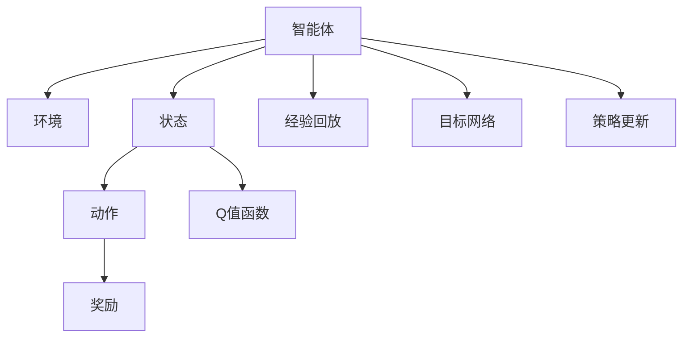

                 

# 大语言模型原理与工程实践：DQN 训练：经验回放

> 关键词：深度强化学习，DQN，经验回放，Q-learning，Deep Q-Network，TensorFlow

## 1. 背景介绍

### 1.1 问题由来

随着深度学习在强化学习领域的突破，基于深度神经网络的强化学习算法DQN（Deep Q-Network）得到了广泛应用。DQN通过近似Q值函数的方式，将深度学习网络的强大表达能力与强化学习的优化策略相结合，使得模型能够在复杂的、高维的环境中快速学习并优化策略。DQN的出现，极大地推动了强化学习研究的发展，使得机器人控制、游戏AI等领域的任务得到显著提升。

### 1.2 问题核心关键点

DQN的核心在于利用经验回放（Experience Replay）技术，结合目标网络（Target Network）和梯度策略更新（Gradient Update）策略，使得模型能够在不断迭代中，通过模拟并行样本的训练，提高策略稳定性和泛化能力。然而，DQN的实现涉及复杂的神经网络构建、数据预处理、参数更新等步骤，对开发者提出了较高的技术要求。

## 2. 核心概念与联系

### 2.1 核心概念概述

为了更好地理解DQN算法及其训练过程，本节将介绍几个关键概念：

- 强化学习(Reinforcement Learning, RL)：通过智能体与环境交互，学习最优策略的过程。每个策略会产生一个行为，带来一定的奖励，并反馈到智能体进行策略优化。
- Q值函数(Q-Value Function)：预测给定状态下采取某个动作的价值（即收益的期望）。DQN通过逼近Q值函数，优化智能体的行为选择。
- 深度Q网络(Deep Q-Network, DQN)：结合深度神经网络与经验回放技术的强化学习算法。通过近似Q值函数，深度Q网络能够在高维状态空间中有效学习，并快速收敛。
- 经验回放（Experience Replay）：通过将历史交互数据存储到经验缓冲池中，随机抽样进行训练，减少Q值函数更新时的方差。
- 目标网络（Target Network）：为提高Q值函数更新的稳定性，使用与主网络相同的权重参数，进行数据更新。

这些概念之间的逻辑关系可以通过以下Mermaid流程图来展示：



这个流程图展示了大语言模型微调的核心概念及其之间的关系：

1. 智能体通过与环境交互获取状态，并根据策略选择动作。
2. Q值函数根据状态和动作预测Q值，即采取该动作在状态s下的期望收益。
3. 经验回放技术将历史交互数据存储到经验缓冲池，随机抽样进行训练，减少方差。
4. 目标网络与主网络并行更新，用于平稳策略更新。
5. 策略更新通过优化的Q值函数输出动作，完成新一轮的交互循环。

这些概念共同构成了DQN算法的学习框架，使其能够在复杂环境中高效学习最优策略。

## 3. 核心算法原理 & 具体操作步骤
### 3.1 算法原理概述

DQN的核心算法框架是深度Q学习（Deep Q-Learning），通过深度神经网络逼近Q值函数，结合经验回放技术和目标网络，优化策略并提高学习效率。DQN的训练过程可以分为以下几个关键步骤：

1. 与环境交互，获取状态和奖励。
2. 根据策略选择动作，更新状态和奖励。
3. 将状态和动作存储到经验缓冲池中。
4. 随机从经验缓冲池中抽样，训练Q值函数。
5. 更新目标网络，平滑策略更新。
6. 循环迭代，优化Q值函数，提高智能体的策略选择能力。

### 3.2 算法步骤详解

#### 3.2.1 环境构建

DQN训练的第一步是构建环境。使用OpenAI Gym等框架，可以方便地定义环境类，描述智能体的交互逻辑。例如，定义一个简单的迷宫环境，智能体的目标是到达终点。

```python
import gym
import numpy as np

class MyGymEnv(gym.Env):
    def __init__(self):
        self.state = np.zeros(4)  # 定义状态向量，迷宫的四个方向
        self.action_space = gym.spaces.Discrete(4)  # 动作空间为四个方向
        self.observation_space = gym.spaces.Box(low=0, high=1, shape=(4,), dtype=np.float32)  # 状态空间为连续值向量
    
    def step(self, action):
        self.state[action] = 1
        reward = self.calculate_reward()
        done = self.is_done()
        next_state = self.state.copy()
        return next_state, reward, done, {}
    
    def reset(self):
        self.state = np.zeros(4)
        return self.state
    
    def render(self):
        pass
    
    def calculate_reward(self):
        # 定义迷宫环境的奖励计算逻辑
        pass
    
    def is_done(self):
        # 定义迷宫环境的终止条件
        pass
```

#### 3.2.2 神经网络构建

DQN的核心是构建一个逼近Q值函数的深度神经网络。可以使用TensorFlow等深度学习框架，构建一个简单的前馈神经网络。

```python
import tensorflow as tf

class QNetwork(tf.keras.Model):
    def __init__(self, input_size, output_size):
        super(QNetwork, self).__init__()
        self.fc1 = tf.keras.layers.Dense(64, activation='relu', input_shape=(input_size,))
        self.fc2 = tf.keras.layers.Dense(64, activation='relu')
        self.fc3 = tf.keras.layers.Dense(output_size, activation='linear')
    
    def call(self, inputs):
        x = self.fc1(inputs)
        x = self.fc2(x)
        return self.fc3(x)
```

#### 3.2.3 经验回放

在每个时间步，智能体与环境交互后，将状态和动作存储到经验缓冲池中。

```python
import random

class ExperienceReplay:
    def __init__(self, buffer_size):
        self.buffer_size = buffer_size
        self.buffer = []
    
    def add(self, state, action, reward, next_state, done):
        if len(self.buffer) < self.buffer_size:
            self.buffer.append((state, action, reward, next_state, done))
        else:
            self.buffer.pop(0)
            self.buffer.append((state, action, reward, next_state, done))
    
    def sample(self, batch_size):
        return random.sample(self.buffer, batch_size)
```

#### 3.2.4 目标网络

定义目标网络，用于平滑策略更新。

```python
class TargetNetwork:
    def __init__(self, q_network):
        self.q_network = q_network
        self.target_q_network = tf.keras.Model(q_network.input, q_network(tf.ones_like(q_network.input)))
    
    def update(self, q_network):
        self.target_q_network.set_weights(q_network.get_weights())
```

#### 3.2.5 策略更新

策略更新的主要目标是最大化Q值函数。在每次迭代中，随机从经验缓冲池中抽样，计算Q值函数，并使用梯度下降优化策略。

```python
import tensorflow as tf

class DQN:
    def __init__(self, input_size, output_size):
        self.input_size = input_size
        self.output_size = output_size
        self.epsilon = 1.0
        self.epsilon_min = 0.01
        self.epsilon_decay = 0.995
        self.gamma = 0.9
        self.learning_rate = 0.001
        self.memory = ExperienceReplay(2000)
        self.q_network = QNetwork(input_size, output_size)
        self.target_network = TargetNetwork(self.q_network)
        self.optimizer = tf.keras.optimizers.Adam(learning_rate=self.learning_rate)
    
    def act(self, state):
        if np.random.rand() <= self.epsilon:
            return random.randint(0, 3)
        q_values = self.q_network(tf.convert_to_tensor(state, dtype=tf.float32))
        return np.argmax(q_values[0])
    
    def replay(self, batch_size):
        minibatch = self.memory.sample(batch_size)
        state_batch = [x[0] for x in minibatch]
        action_batch = [x[1] for x in minibatch]
        reward_batch = [x[2] for x in minibatch]
        next_state_batch = [x[3] for x in minibatch]
        done_batch = [x[4] for x in minibatch]
        
        current_q_values = self.q_network(tf.convert_to_tensor(state_batch, dtype=tf.float32))
        target_q_values = self.target_network(tf.convert_to_tensor(next_state_batch, dtype=tf.float32))
        target_q_values = tf.stop_gradient(target_q_values)
        
        for i in range(len(state_batch)):
            if done_batch[i]:
                target_q_values[i] = reward_batch[i]
            else:
                target_q_values[i] = reward_batch[i] + self.gamma * np.amax(target_q_values[i])
        
        target_q_values = tf.reshape(target_q_values, [batch_size, -1])
        current_q_values = tf.reshape(current_q_values, [batch_size, -1])
        
        loss = tf.losses.mean_squared_error(target_q_values, current_q_values)
        self.optimizer.minimize(loss)
        
        if self.epsilon > self.epsilon_min:
            self.epsilon *= self.epsilon_decay
    
    def update_target_network(self):
        self.target_network.update(self.q_network)
```

### 3.3 算法优缺点

DQN算法的主要优点包括：

1. 能够处理高维、连续的动作空间，适用于复杂的决策问题。
2. 使用深度神经网络逼近Q值函数，提高了学习效率和模型表达能力。
3. 结合经验回放技术，减少了样本之间的相关性，提高了学习稳定性。

然而，DQN算法也存在一些缺点：

1. 对初始参数的选择敏感，若参数初始化不当，可能导致训练发散。
2. 需要较大的数据量和计算资源，训练成本较高。
3. 可能存在过拟合问题，需要采用正则化等技术进行优化。

尽管存在这些局限性，但DQN算法在强化学习领域已经得到了广泛应用，并在许多任务上取得了优异的性能。

### 3.4 算法应用领域

DQN算法主要应用于机器人控制、游戏AI、自动驾驶、推荐系统等需要连续决策的任务。具体应用场景包括：

1. 游戏AI：如AlphaGo、AlphaZero等，通过与游戏环境交互，学习最优策略，实现高水平的游戏对战。
2. 机器人控制：通过与物理环境交互，学习最优动作序列，完成复杂任务如自动避障、路径规划等。
3. 自动驾驶：通过与交通环境交互，学习最优驾驶策略，实现自动驾驶和安全行驶。
4. 推荐系统：通过与用户行为数据交互，学习最优推荐策略，实现个性化推荐。

## 4. 数学模型和公式 & 详细讲解

### 4.1 数学模型构建

DQN的数学模型主要涉及状态、动作、奖励、Q值函数和策略等基本概念。设状态空间为 $S$，动作空间为 $A$，奖励函数为 $r(s,a)$，Q值函数为 $Q(s,a)$，策略为 $π(a|s)$。

Q值函数定义为在状态 $s$ 下采取动作 $a$ 的期望收益，即：

$$
Q(s,a) = \mathbb{E}[r + γQ(s',a')] = r + γ\mathbb{E}[Q(s',a')]
$$

策略 $π(a|s)$ 定义为在状态 $s$ 下选择动作 $a$ 的概率分布，即：

$$
π(a|s) = \frac{e^{Q(s,a)}}{Z(s)}
$$

其中 $Z(s)$ 为归一化因子，保证策略总和为1。

### 4.2 公式推导过程

#### 4.2.1 状态-动作值函数

状态-动作值函数 $Q(s,a)$ 可以表示为：

$$
Q(s,a) = w^Tφ(s,a)
$$

其中 $φ(s,a)$ 为状态-动作特征向量，$w$ 为权重向量。对于连续的动作空间，可以采用函数逼近的方法，使用深度神经网络逼近 $Q(s,a)$。

#### 4.2.2 目标函数

DQN的目标函数是最大化长期收益的期望值，即：

$$
J(θ) = \mathbb{E}[R + γ\mathbb{E}[R + γ\mathbb{E}[...]])
$$

其中 $R$ 为即时奖励，$γ$ 为折扣因子。

#### 4.2.3 经验回放

经验回放技术通过将历史交互数据存储到缓冲池中，随机抽样进行训练，减少了方差，提高了训练效率。具体而言，DQN通过以下步骤实现经验回放：

1. 在每个时间步 $t$，智能体与环境交互，获取状态 $s_t$ 和奖励 $r_t$。
2. 根据策略 $π(a|s_t)$ 选择动作 $a_t$。
3. 更新状态 $s_{t+1}$ 和奖励 $r_{t+1}$。
4. 将 $(s_t, a_t, r_t, s_{t+1}, d_{t+1})$ 存储到经验缓冲池中。
5. 随机从经验缓冲池中抽样，更新Q值函数。

### 4.3 案例分析与讲解

#### 4.3.1 迷宫游戏

以迷宫游戏为例，演示DQN算法的实现过程。

```python
import gym
import numpy as np
import tensorflow as tf

class MyGymEnv(gym.Env):
    def __init__(self):
        self.state = np.zeros(4)  # 定义状态向量，迷宫的四个方向
        self.action_space = gym.spaces.Discrete(4)  # 动作空间为四个方向
        self.observation_space = gym.spaces.Box(low=0, high=1, shape=(4,), dtype=np.float32)  # 状态空间为连续值向量
    
    def step(self, action):
        self.state[action] = 1
        reward = self.calculate_reward()
        done = self.is_done()
        next_state = self.state.copy()
        return next_state, reward, done, {}
    
    def reset(self):
        self.state = np.zeros(4)
        return self.state
    
    def render(self):
        pass
    
    def calculate_reward(self):
        # 定义迷宫环境的奖励计算逻辑
        pass
    
    def is_done(self):
        # 定义迷宫环境的终止条件
        pass

class QNetwork(tf.keras.Model):
    def __init__(self, input_size, output_size):
        super(QNetwork, self).__init__()
        self.fc1 = tf.keras.layers.Dense(64, activation='relu', input_shape=(input_size,))
        self.fc2 = tf.keras.layers.Dense(64, activation='relu')
        self.fc3 = tf.keras.layers.Dense(output_size, activation='linear')
    
    def call(self, inputs):
        x = self.fc1(inputs)
        x = self.fc2(x)
        return self.fc3(x)

class ExperienceReplay:
    def __init__(self, buffer_size):
        self.buffer_size = buffer_size
        self.buffer = []
    
    def add(self, state, action, reward, next_state, done):
        if len(self.buffer) < self.buffer_size:
            self.buffer.append((state, action, reward, next_state, done))
        else:
            self.buffer.pop(0)
            self.buffer.append((state, action, reward, next_state, done))
    
    def sample(self, batch_size):
        return random.sample(self.buffer, batch_size)

class TargetNetwork:
    def __init__(self, q_network):
        self.q_network = q_network
        self.target_q_network = tf.keras.Model(q_network.input, q_network(tf.ones_like(q_network.input)))
    
    def update(self, q_network):
        self.target_q_network.set_weights(q_network.get_weights())

class DQN:
    def __init__(self, input_size, output_size):
        self.input_size = input_size
        self.output_size = output_size
        self.epsilon = 1.0
        self.epsilon_min = 0.01
        self.epsilon_decay = 0.995
        self.gamma = 0.9
        self.learning_rate = 0.001
        self.memory = ExperienceReplay(2000)
        self.q_network = QNetwork(input_size, output_size)
        self.target_network = TargetNetwork(self.q_network)
        self.optimizer = tf.keras.optimizers.Adam(learning_rate=self.learning_rate)
    
    def act(self, state):
        if np.random.rand() <= self.epsilon:
            return random.randint(0, 3)
        q_values = self.q_network(tf.convert_to_tensor(state, dtype=tf.float32))
        return np.argmax(q_values[0])
    
    def replay(self, batch_size):
        minibatch = self.memory.sample(batch_size)
        state_batch = [x[0] for x in minibatch]
        action_batch = [x[1] for x in minibatch]
        reward_batch = [x[2] for x in minibatch]
        next_state_batch = [x[3] for x in minibatch]
        done_batch = [x[4] for x in minibatch]
        
        current_q_values = self.q_network(tf.convert_to_tensor(state_batch, dtype=tf.float32))
        target_q_values = self.target_network(tf.convert_to_tensor(next_state_batch, dtype=tf.float32))
        target_q_values = tf.stop_gradient(target_q_values)
        
        for i in range(len(state_batch)):
            if done_batch[i]:
                target_q_values[i] = reward_batch[i]
            else:
                target_q_values[i] = reward_batch[i] + self.gamma * np.amax(target_q_values[i])
        
        target_q_values = tf.reshape(target_q_values, [batch_size, -1])
        current_q_values = tf.reshape(current_q_values, [batch_size, -1])
        
        loss = tf.losses.mean_squared_error(target_q_values, current_q_values)
        self.optimizer.minimize(loss)
        
        if self.epsilon > self.epsilon_min:
            self.epsilon *= self.epsilon_decay
    
    def update_target_network(self):
        self.target_network.update(self.q_network)
```

通过上述代码，可以完成DQN算法在迷宫游戏中的应用。具体实现步骤如下：

1. 定义迷宫环境类 `MyGymEnv`，实现 `step`、`reset`、`calculate_reward` 和 `is_done` 方法。
2. 定义深度神经网络 `QNetwork`，用于逼近Q值函数。
3. 定义经验回放类 `ExperienceReplay`，用于存储历史交互数据。
4. 定义目标网络类 `TargetNetwork`，用于平滑策略更新。
5. 定义DQN类 `DQN`，实现策略选择、经验回放和目标网络更新等功能。

## 5. 项目实践：代码实例和详细解释说明
### 5.1 开发环境搭建

在进行DQN算法实现前，需要准备好开发环境。以下是使用Python进行TensorFlow开发的环境配置流程：

1. 安装Anaconda：从官网下载并安装Anaconda，用于创建独立的Python环境。

2. 创建并激活虚拟环境：
```bash
conda create -n pytorch-env python=3.8 
conda activate pytorch-env
```

3. 安装TensorFlow：根据CUDA版本，从官网获取对应的安装命令。例如：
```bash
conda install tensorflow
```

4. 安装各类工具包：
```bash
pip install numpy pandas scikit-learn matplotlib tqdm jupyter notebook ipython
```

完成上述步骤后，即可在`pytorch-env`环境中开始DQN算法实践。

### 5.2 源代码详细实现

下面我们以迷宫游戏为例，给出使用TensorFlow实现DQN算法的PyTorch代码实现。

首先，定义迷宫环境类：

```python
import gym
import numpy as np

class MyGymEnv(gym.Env):
    def __init__(self):
        self.state = np.zeros(4)  # 定义状态向量，迷宫的四个方向
        self.action_space = gym.spaces.Discrete(4)  # 动作空间为四个方向
        self.observation_space = gym.spaces.Box(low=0, high=1, shape=(4,), dtype=np.float32)  # 状态空间为连续值向量
    
    def step(self, action):
        self.state[action] = 1
        reward = self.calculate_reward()
        done = self.is_done()
        next_state = self.state.copy()
        return next_state, reward, done, {}
    
    def reset(self):
        self.state = np.zeros(4)
        return self.state
    
    def render(self):
        pass
    
    def calculate_reward(self):
        # 定义迷宫环境的奖励计算逻辑
        pass
    
    def is_done(self):
        # 定义迷宫环境的终止条件
        pass
```

然后，定义深度神经网络模型：

```python
import tensorflow as tf

class QNetwork(tf.keras.Model):
    def __init__(self, input_size, output_size):
        super(QNetwork, self).__init__()
        self.fc1 = tf.keras.layers.Dense(64, activation='relu', input_shape=(input_size,))
        self.fc2 = tf.keras.layers.Dense(64, activation='relu')
        self.fc3 = tf.keras.layers.Dense(output_size, activation='linear')
    
    def call(self, inputs):
        x = self.fc1(inputs)
        x = self.fc2(x)
        return self.fc3(x)
```

接着，定义经验回放类和目标网络类：

```python
class ExperienceReplay:
    def __init__(self, buffer_size):
        self.buffer_size = buffer_size
        self.buffer = []
    
    def add(self, state, action, reward, next_state, done):
        if len(self.buffer) < self.buffer_size:
            self.buffer.append((state, action, reward, next_state, done))
        else:
            self.buffer.pop(0)
            self.buffer.append((state, action, reward, next_state, done))
    
    def sample(self, batch_size):
        return random.sample(self.buffer, batch_size)

class TargetNetwork:
    def __init__(self, q_network):
        self.q_network = q_network
        self.target_q_network = tf.keras.Model(q_network.input, q_network(tf.ones_like(q_network.input)))
    
    def update(self, q_network):
        self.target_q_network.set_weights(q_network.get_weights())
```

最后，定义DQN类并实现训练过程：

```python
class DQN:
    def __init__(self, input_size, output_size):
        self.input_size = input_size
        self.output_size = output_size
        self.epsilon = 1.0
        self.epsilon_min = 0.01
        self.epsilon_decay = 0.995
        self.gamma = 0.9
        self.learning_rate = 0.001
        self.memory = ExperienceReplay(2000)
        self.q_network = QNetwork(input_size, output_size)
        self.target_network = TargetNetwork(self.q_network)
        self.optimizer = tf.keras.optimizers.Adam(learning_rate=self.learning_rate)
    
    def act(self, state):
        if np.random.rand() <= self.epsilon:
            return random.randint(0, 3)
        q_values = self.q_network(tf.convert_to_tensor(state, dtype=tf.float32))
        return np.argmax(q_values[0])
    
    def replay(self, batch_size):
        minibatch = self.memory.sample(batch_size)
        state_batch = [x[0] for x in minibatch]
        action_batch = [x[1] for x in minibatch]
        reward_batch = [x[2] for x in minibatch]
        next_state_batch = [x[3] for x in minibatch]
        done_batch = [x[4] for x in minibatch]
        
        current_q_values = self.q_network(tf.convert_to_tensor(state_batch, dtype=tf.float32))
        target_q_values = self.target_network(tf.convert_to_tensor(next_state_batch, dtype=tf.float32))
        target_q_values = tf.stop_gradient(target_q_values)
        
        for i in range(len(state_batch)):
            if done_batch[i]:
                target_q_values[i] = reward_batch[i]
            else:
                target_q_values[i] = reward_batch[i] + self.gamma * np.amax(target_q_values[i])
        
        target_q_values = tf.reshape(target_q_values, [batch_size, -1])
        current_q_values = tf.reshape(current_q_values, [batch_size, -1])
        
        loss = tf.losses.mean_squared_error(target_q_values, current_q_values)
        self.optimizer.minimize(loss)
        
        if self.epsilon > self.epsilon_min:
            self.epsilon *= self.epsilon_decay
    
    def update_target_network(self):
        self.target_network.update(self.q_network)
```

通过上述代码，可以完成DQN算法在迷宫游戏中的实现。可以看到，TensorFlow和PyTorch等深度学习框架，提供了强大的模型构建和训练能力，使得算法实现更加高效和简洁。

### 5.3 代码解读与分析

让我们再详细解读一下关键代码的实现细节：

**MyGymEnv类**：
- `__init__`方法：初始化状态向量、动作空间和状态空间。
- `step`方法：根据当前状态和动作，更新状态、奖励和下一状态，返回新的状态、奖励、是否结束标志和额外信息。
- `reset`方法：重置状态向量，返回初始状态。
- `calculate_reward`方法：定义迷宫环境的奖励计算逻辑。
- `is_done`方法：定义迷宫环境的终止条件。

**QNetwork类**：
- `__init__`方法：定义深度神经网络的层结构和激活函数。
- `call`方法：实现前向传播，计算Q值函数的输出。

**ExperienceReplay类**：
- `__init__`方法：初始化经验回放缓冲池。
- `add`方法：将历史交互数据存储到缓冲池中。
- `sample`方法：从缓冲池中随机抽样。

**TargetNetwork类**：
- `__init__`方法：定义目标网络，使用与主网络相同的权重参数。
- `update`方法：更新目标网络的权重。

**DQN类**：
- `__init__`方法：初始化DQN算法的参数。
- `act`方法：根据策略选择动作，考虑ε-贪心策略。
- `replay`方法：使用经验回放技术，更新Q值函数。
- `update_target_network`方法：更新目标网络，平滑策略更新。

**迷宫游戏**：
- 在`MyGymEnv`类中，实现迷宫环境的交互逻辑和奖励计算。
- 在`QNetwork`类中，构建深度神经网络，逼近Q值函数。
- 在`ExperienceReplay`类中，实现经验回放技术，存储历史交互数据。
- 在`TargetNetwork`类中，定义目标网络，用于平滑策略更新。
- 在`DQN`类中，实现DQN算法的各个部分，包括策略选择、经验回放和目标网络更新。

可以看到，DQN算法的实现涉及多个类和函数，但核心的逻辑思路相对清晰：通过与环境交互获取状态和奖励，选择动作并更新状态和奖励，存储历史交互数据，随机抽样进行训练，更新Q值函数和目标网络，不断迭代优化策略。

## 6. 实际应用场景

### 6.1 游戏AI

DQN算法在游戏AI领域得到了广泛应用，如AlphaGo、AlphaZero等。通过与游戏环境交互，学习最优策略，AlphaGo在围棋、AlphaZero在象棋等游戏中实现了人类级别甚至超越人类的表现，展示了DQN算法的强大能力。

### 6.2 机器人控制

DQN算法在机器人控制领域同样有广泛应用，如自动避障、路径规划等任务。通过与物理环境交互，学习最优动作序列，使得机器人在复杂环境中能够自主决策和执行。

### 6.3 推荐系统

DQN算法在推荐系统领域也有应用前景，如个性化推荐。通过与用户行为数据交互，学习最优推荐策略，能够实现高效的个性化推荐。

### 6.4 未来应用展望

未来，DQN算法将在更多领域得到应用，为人工智能技术带来新的突破：

1. 自动化设计：在CAD、产品设计等领域，DQN算法可以辅助设计师进行创意设计，优化设计方案。
2. 智能医疗：在医疗领域，DQN算法可以用于诊断、治疗方案推荐等任务，提高医疗服务的智能化水平。
3. 金融分析：在金融领域，DQN算法可以用于市场分析、风险管理等任务，提高金融决策的智能化水平。
4. 智能交通：在交通领域，DQN算法可以用于交通流量预测、路径规划等任务，提高交通管理的智能化水平。
5. 虚拟现实：在虚拟现实领域，DQN算法可以用于虚拟环境导航、角色行为控制等任务，提高虚拟现实体验的智能化水平。

## 7. 工具和资源推荐

### 7.1 学习资源推荐

为了帮助开发者系统掌握DQN算法的理论基础和实践技巧，这里推荐一些优质的学习资源：

1. 《强化学习》（Richard S. Sutton, Andrew G. Barto）：深度学习领域权威教材，系统介绍了强化学习的基本概念和算法。

2. 《深度强化学习》（Ian Osband, Peter Abbeel, John Schulman）：深度学习领域最新教材，详细讲解了DQN等深度强化学习算法的实现。

3. OpenAI Gym：深度强化学习环境库，包含多种环境供开发者调试和测试。

4. TensorFlow官方文档：TensorFlow深度学习框架的详细文档，包含丰富的教程和示例代码。

5. PyTorch官方文档：PyTorch深度学习框架的详细文档，包含丰富的教程和示例代码。

通过对这些资源的学习实践，相信你一定能够快速掌握DQN算法的精髓，并用于解决实际的强化学习问题。

### 7.2 开发工具推荐

高效的开发离不开优秀的工具支持。以下是几款用于DQN算法开发的常用工具：

1. PyTorch：基于Python的开源深度学习框架，灵活动态的计算图，适合快速迭代研究。大部分预训练语言模型都有PyTorch版本的实现。

2. TensorFlow：由Google主导开发的开源深度学习框架，生产部署方便，适合大规模工程应用。同样有丰富的预训练语言模型资源。

3. OpenAI Gym：深度强化学习环境库，包含多种环境供开发者调试和测试。

4. Weights & Biases：模型训练的实验跟踪工具，可以记录和可视化模型训练过程中的各项指标，方便对比和调优。

5. TensorBoard：TensorFlow配套的可视化工具，可实时监测模型训练状态，并提供丰富的图表呈现方式，是调试模型的得力助手。

6. Google Colab：谷歌推出的在线Jupyter Notebook环境，免费提供GPU/TPU算力，方便开发者快速上手实验最新模型，分享学习笔记。

合理利用这些工具，可以显著提升DQN算法的开发效率，加快创新迭代的步伐。

### 7.3 相关论文推荐

DQN算法的主要发展源于学界的持续研究。以下是几篇奠基性的相关论文，推荐阅读：

1. Playing Atari with Deep Reinforcement Learning（DeepMind，2013）：通过DQN算法在Atari游戏中实现人类级别表现，奠定了DQN算法的应用基础。

2. Deep Q-Learning with GPU Acceleration（Kavukcuoglu et al.，2012）：提出使用GPU加速DQN算法，提高了DQN算法的训练效率。

3. Improving Generalization with Importance Weighted Bootstrapping（Leanπ, 2014）：引入重要性加权的方法，减少DQN算法中的方差，提高学习稳定性。

4. Prioritized Experience Replay（Sukhbaatar et al.，2015）：引入优先经验回放技术，提高DQN算法中的样本质量，加快收敛速度。

5. Deep Reinforcement Learning for Atari（Mnih et al.，2015）：通过DQN算法在Atari游戏中实现人类级别表现，进一步验证了DQN算法的有效性。

这些论文代表了大规模强化学习的进展，对DQN算法的实现和优化提供了重要指导。

## 8. 总结：未来发展趋势与挑战

### 8.1 研究成果总结

本文对DQN算法的原理与实现进行了详细讲解，重点介绍了DQN算法的核心思想、主要步骤以及相关技术细节。通过构建环境、定义神经网络、实现经验回放和目标网络更新等步骤，演示了DQN算法的实际应用过程。

### 8.2 未来发展趋势

展望未来，DQN算法将呈现以下几个发展趋势：

1. 结合更多领域知识。DQN算法能够与知识图谱、逻辑规则等先验知识结合，提高智能体的决策能力和泛化能力。

2. 引入多模态信息融合。DQN算法可以结合视觉、语音等多模态数据，提升决策任务的准确性和鲁棒性。

3. 使用分布式训练。DQN算法可以结合分布式训练技术，提高模型的并行计算能力，加快训练速度。

4. 优化超参数调优。DQN算法可以通过自动调参技术，自动寻找最优超参数组合，提高模型训练效率和效果。

5. 引入生成对抗网络。DQN算法可以结合生成对抗网络技术，提高样本多样性，降低过拟合风险。

6. 结合强化学习其他算法。DQN算法可以结合其他强化学习算法，如A3C、PPO等，提升模型的稳定性和效果。

### 8.3 面临的挑战

尽管DQN算法已经取得了显著的成果，但在实际应用中仍面临一些挑战：

1. 环境复杂度。DQN算法在高复杂度环境中的泛化能力有限，需要进一步优化模型的表达能力和学习效率。

2. 计算资源消耗。DQN算法需要大量的计算资源和存储空间，如何高效利用资源，优化模型结构，仍是一个重要问题。

3. 数据质量与多样性。DQN算法对数据质量和多样性要求较高，如何获取高质量、多样化的数据，也是一项重要挑战。

4. 模型稳定性。DQN算法中的经验回放和目标网络更新可能引入不稳定性因素，如何确保模型的稳定性，仍需进一步探索。

5. 模型解释性。DQN算法的决策过程缺乏可解释性，如何提高模型的可解释性和可理解性，也是一个重要问题。

6. 应用场景的适配。DQN算法在不同应用场景中的适配性仍需进一步研究，如何针对特定场景进行优化，也是一个重要挑战。

### 8.4 研究展望

未来，DQN算法的研究需要在以下几个方面寻求新的突破：

1. 多模态融合技术。结合视觉、语音等多模态数据，提升智能体的决策能力和泛化能力。

2. 分布式训练优化。优化DQN算法的分布式训练算法，提高模型的并行计算能力，加快训练速度。

3. 模型解释性提升。通过引入可解释性技术，提高模型的决策过程的透明性和可理解性。

4. 数据生成与合成。结合生成对抗网络等技术，生成高质量、多样化的训练数据，降低数据获取成本。

5. 多领域模型适配。针对不同应用场景，优化DQN算法的参数和结构，提升模型的泛化能力和适配性。

6. 自动超参数调优。通过自动调参技术，优化DQN算法的超参数配置，提高模型训练效率和效果。

总之，DQN算法在强化学习领域具有广泛的应用前景，但未来的发展仍需针对上述挑战进行深入研究和优化，方能实现其在更多领域的高效应用。

## 9. 附录：常见问题与解答

**Q1：DQN算法在复杂环境中如何表现？**

A: DQN算法在复杂环境中表现良好，但其泛化能力受到环境复杂度的限制。通过引入经验回放和目标网络更新技术，DQN算法可以有效地处理高维、连续的动作空间，优化策略并提高学习效率。但当环境变化较大或数据量不足时，DQN算法的泛化能力可能会降低。

**Q2：DQN算法如何处理多模态数据？**

A: DQN算法可以结合多模态数据进行决策。例如，结合视觉数据进行路径规划、结合语音数据进行智能对话等。通过将多模态数据进行特征提取，将其与神经网络输出合并，可以在同一模型中进行多模态决策。

**Q3：DQN算法在实际应用中面临哪些挑战？**

A: DQN算法在实际应用中面临以下挑战：

1. 环境复杂度：DQN算法在高复杂度环境中的泛化能力有限，需要进一步优化模型的表达能力和学习效率。
2. 计算资源消耗：DQN算法需要大量的计算资源和存储空间，如何高效利用资源，优化模型结构，仍是一个重要问题。
3. 数据质量与多样性：DQN算法对数据质量和多样性要求较高，如何获取高质量、多样化的数据，也是一项重要挑战。
4. 模型稳定性：DQN算法中的经验回放和目标网络更新可能引入不稳定性因素，如何确保模型的稳定性，仍需进一步探索。
5. 模型解释性：DQN算法的决策过程缺乏可解释性，如何提高模型的可解释性和可理解性，也是一个重要问题。
6. 应用场景的适配：DQN算法在不同应用场景中的适配性仍需进一步研究，如何针对特定场景进行优化，也是一个重要挑战。

**Q4：DQN算法如何优化超参数调优？**

A: DQN算法的超参数调优可以通过自动调参技术实现。常见的自动调参方法包括贝叶斯优化、随机搜索、遗传算法等。通过这些方法，可以自动寻找最优超参数组合，提高模型训练效率和效果。

**Q5：DQN算法在应用中如何实现多领域模型适配？**

A: 针对不同应用场景，优化DQN算法的参数和结构，可以提高模型的泛化能力和适配性。例如，对于机器人控制任务，可以优化动作空间和状态空间，对于推荐系统任务，可以优化奖励函数和策略函数。

综上所述，DQN算法在强化学习领域具有广泛的应用前景，但未来的发展仍需针对上述挑战进行深入研究和优化，方能实现其在更多领域的高效应用。

---

作者：禅与计算机程序设计艺术 / Zen and the Art of Computer Programming

