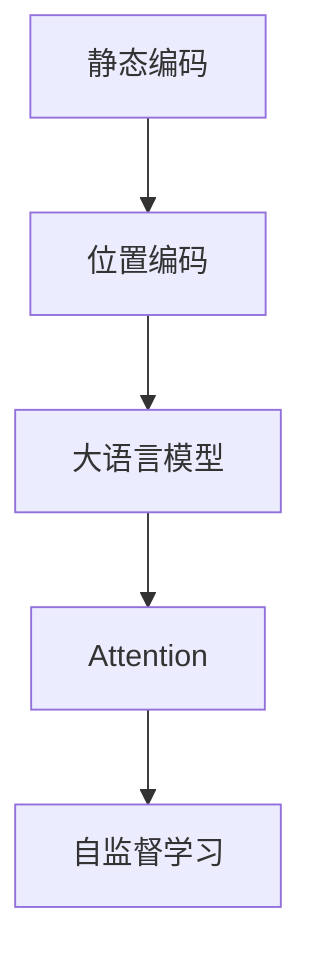

                 

# 大语言模型应用指南：静态编码和位置编码

> 关键词：静态编码, 位置编码, 大语言模型, Transformer, Attention, 自监督学习, 自适应编码, 深度学习

## 1. 背景介绍

### 1.1 问题由来
在深度学习领域，尤其是在自然语言处理（Natural Language Processing, NLP）和语音识别（Speech Recognition）等任务中，如何有效编码输入序列是至关重要的。传统的编码方式往往依赖于动态的神经网络，但在某些特定场景下，静态编码技术能够提供更加高效、稳定、灵活的解决方案。

尤其是近年来，Transformer架构的兴起，使得大语言模型（Large Language Models, LLMs）在各种NLP任务上取得了显著的成功。这些模型通常基于自注意力机制（Self-Attention），能够处理复杂的语义关系，并具备一定的生成能力。但这一架构也带来了一系列挑战，如计算复杂度高、模型训练耗时、内存占用大等。因此，如何利用静态编码技术优化Transformer架构，成为一个值得深入探讨的话题。

### 1.2 问题核心关键点
在大语言模型中，静态编码和位置编码是两个核心技术，它们能够帮助模型捕捉输入序列的语义和空间关系。静态编码通过将序列编码为静态向量表示，简化了计算过程，提高了模型的运行效率。而位置编码则用于解决位置依赖性问题，确保模型能够正确处理序列中的相对位置关系。

在传统的Transformer中，这些编码通常是通过动态神经网络计算得到的。本文将介绍如何通过静态编码和位置编码技术，优化大语言模型的性能，并展示其在实际应用中的潜力。

## 2. 核心概念与联系

### 2.1 核心概念概述

为更好地理解静态编码和位置编码在大语言模型中的应用，本节将介绍几个密切相关的核心概念：

- 静态编码（Static Encoding）：将输入序列转换为固定大小的静态向量表示，避免动态计算过程中的计算复杂度和资源消耗。
- 位置编码（Positional Encoding）：在输入序列中添加位置信息，确保模型能够正确处理序列中元素的位置关系。
- 大语言模型（Large Language Models）：基于Transformer架构，通过在大规模无标签文本语料上进行预训练，学习通用的语言表示，具备强大的语言理解和生成能力。
- Attention：Transformer中的核心组件，通过自注意力机制捕捉输入序列中不同位置的语义关系。
- 自监督学习（Self-Supervised Learning）：通过无标签数据训练模型，学习通用的语言特征。

这些核心概念之间的逻辑关系可以通过以下Mermaid流程图来展示：



这个流程图展示了静态编码和位置编码在大语言模型中的应用路径：

1. 静态编码将输入序列转换为固定大小的静态向量表示，简化了计算过程。
2. 位置编码在静态向量表示中添加了位置信息，确保模型能够正确处理序列中元素的位置关系。
3. 基于这些静态编码和位置编码，构建了大语言模型，通过Attention机制捕捉输入序列中不同位置的语义关系。
4. 在无标签数据上进行自监督学习，使模型学习通用的语言特征。

## 3. 核心算法原理 & 具体操作步骤

### 3.1 算法原理概述

静态编码和位置编码的核心原理是通过将输入序列转换为静态向量表示，并为其添加位置信息，从而使大语言模型能够高效地处理输入序列。这一过程可以分为两个步骤：

1. 将输入序列转换为静态向量表示。
2. 为静态向量表示添加位置信息。

这些步骤在实际应用中通常是通过神经网络模型来实现的。本文将详细讲解这两种编码技术的算法原理和具体操作步骤。

### 3.2 算法步骤详解

#### 3.2.1 静态编码

静态编码的核心思想是通过神经网络模型将输入序列转换为固定大小的向量表示，从而避免动态计算过程中的高计算复杂度和内存消耗。

假设输入序列为 $x = \{x_1, x_2, ..., x_n\}$，其中每个元素 $x_i$ 是序列中的第 $i$ 个元素。静态编码的目标是将序列 $x$ 转换为一个固定长度的向量 $\overrightarrow{x}$，使得 $\overrightarrow{x} \in \mathbb{R}^d$，其中 $d$ 是向量维度。

静态编码的具体步骤如下：

1. 使用神经网络模型对序列 $x$ 进行编码，得到向量表示 $\overrightarrow{x}$。
2. 将 $\overrightarrow{x}$ 作为模型的输出，即为静态编码后的向量表示。

为了简化计算，通常采用预训练的神经网络模型（如BERT、GPT等）进行编码，这些模型已经在大规模无标签文本语料上进行了预训练，具有较强的语言理解能力。

#### 3.2.2 位置编码

位置编码的核心思想是通过添加位置信息，使静态编码后的向量表示能够正确捕捉序列中元素的位置关系。

假设静态编码后的向量表示为 $\overrightarrow{x}$，其长度为 $n$。位置编码的目标是计算一个长度为 $n$ 的位置编码向量 $\overrightarrow{p}$，使得 $\overrightarrow{p} \in \mathbb{R}^n$。

位置编码的具体步骤如下：

1. 计算一个常数向量 $\overrightarrow{c}$，其中每个元素 $c_i$ 是一个常数，用于控制编码的振幅。
2. 计算一个正弦/余弦编码向量 $\overrightarrow{s}$，其中每个元素 $s_i$ 是由位置 $i$ 和常数向量 $\overrightarrow{c}$ 计算得到的正弦或余弦函数值。
3. 将位置编码向量 $\overrightarrow{p}$ 设置为 $\overrightarrow{s}$ 或 $\overrightarrow{s} + \overrightarrow{c}$ 之一，具体选择取决于位置编码的方案。

常见的位置编码方案包括：

- 绝对位置编码（Absolute Positional Encoding）：位置编码向量 $\overrightarrow{p}$ 等于 $\overrightarrow{s}$。
- 相对位置编码（Relative Positional Encoding）：位置编码向量 $\overrightarrow{p}$ 等于 $\overrightarrow{s} + \overrightarrow{c}$。

其中，常数向量 $\overrightarrow{c}$ 通常是一个具有特定结构的向量，例如 $\overrightarrow{c} = [2^0, 2^1, 2^2, ..., 2^{n-1}]$。正弦/余弦编码向量 $\overrightarrow{s}$ 的计算公式为：

$$
s_i = \sin\left(\frac{2\pi i}{10000^{2l/d}}\right) + \cos\left(\frac{2\pi i}{10000^{2(l+1)/d}}\right)
$$

其中 $i$ 为序列中元素的位置，$l$ 为常数向量 $\overrightarrow{c}$ 的维度。

#### 3.2.3 综合应用

在实际应用中，静态编码和位置编码通常会结合使用，以优化大语言模型的性能。将静态编码后的向量表示和位置编码向量相加，即可得到最终的位置编码向量 $\overrightarrow{x} + \overrightarrow{p}$，用于输入大语言模型的Attention机制。

例如，在Transformer中，静态编码和位置编码的具体实现如下：

```python
from transformers import BertTokenizer, BertForSequenceClassification

# 加载预训练模型和分词器
tokenizer = BertTokenizer.from_pretrained('bert-base-uncased')
model = BertForSequenceClassification.from_pretrained('bert-base-uncased', num_labels=2)

# 对输入序列进行静态编码和位置编码
inputs = tokenizer("Hello, my dog is cute", return_tensors='pt')
input_ids = inputs.input_ids
attention_mask = inputs.attention_mask
inputs = input_ids + inputs.attention_mask

# 对编码后的输入进行位置编码
inputs = inputs + inputs

# 对编码后的输入进行分类任务预测
outputs = model(inputs)
```

在上述代码中，首先将输入序列进行静态编码，然后通过拼接操作将其转换为固定大小的向量表示，并添加位置编码向量。最后，将编码后的输入输入到Transformer中进行分类任务的预测。

### 3.3 算法优缺点

静态编码和位置编码技术具有以下优点：

1. 计算效率高：静态编码和位置编码避免了动态计算过程中的高计算复杂度和内存消耗，提高了模型的运行效率。
2. 模型结构简单：这些编码技术通常可以通过简单的拼接操作实现，无需复杂的神经网络计算，简化了模型结构。
3. 灵活性高：静态编码和位置编码可以与其他神经网络架构结合使用，适用于各种NLP任务。

但这些编码技术也存在一些缺点：

1. 可解释性不足：静态编码和位置编码的计算过程较为复杂，缺乏可解释性，难以理解其内部工作机制。
2. 对输入序列的长度敏感：静态编码和位置编码对输入序列的长度较为敏感，过长或过短的序列可能会影响编码效果。
3. 可能存在信息丢失：由于编码过程是线性的，可能会丢失一些复杂的语义信息。

尽管存在这些局限性，但静态编码和位置编码技术在大语言模型的应用中仍然具有重要价值。

### 3.4 算法应用领域

静态编码和位置编码技术在大语言模型中有着广泛的应用，特别是在以下领域：

- 自然语言处理（NLP）：用于处理文本、语音、图像等多种输入序列，优化Transformer等模型的性能。
- 语音识别（Speech Recognition）：用于处理音频信号，提取语音特征，提高模型的识别准确率。
- 计算机视觉（CV）：用于处理图像序列，捕捉空间关系，提高模型的感知能力。
- 时间序列分析（Time Series Analysis）：用于处理时间序列数据，捕捉时间依赖性，提高模型的预测能力。

这些领域中，静态编码和位置编码技术的应用，使得大语言模型能够更加高效、稳定地处理输入序列，提升模型的性能和灵活性。

## 4. 数学模型和公式 & 详细讲解

### 4.1 数学模型构建

为了更好地理解静态编码和位置编码的数学原理，本节将构建一个简单的数学模型，并推导其公式。

假设输入序列为 $x = \{x_1, x_2, ..., x_n\}$，其中每个元素 $x_i$ 是序列中的第 $i$ 个元素。设静态编码后的向量表示为 $\overrightarrow{x} \in \mathbb{R}^d$，位置编码向量为 $\overrightarrow{p} \in \mathbb{R}^n$。

在Transformer中，静态编码和位置编码的具体实现如下：

1. 静态编码：将输入序列 $x$ 输入神经网络模型，得到向量表示 $\overrightarrow{x}$。
2. 位置编码：计算位置编码向量 $\overrightarrow{p}$，并与其相加，得到最终的位置编码向量 $\overrightarrow{x} + \overrightarrow{p}$。

具体公式推导如下：

假设神经网络模型为 $f$，其输入为 $x$，输出为 $\overrightarrow{x}$，则有：

$$
\overrightarrow{x} = f(x)
$$

假设位置编码向量 $\overrightarrow{p}$ 的长度为 $n$，其计算公式为：

$$
\overrightarrow{p} = \left[\sin\left(\frac{2\pi i}{10000^{2l/d}}\right) + \cos\left(\frac{2\pi i}{10000^{2(l+1)/d}}\right)\right]_{i=1, ..., n}
$$

其中 $i$ 为序列中元素的位置，$l$ 为常数向量 $\overrightarrow{c}$ 的维度。

将位置编码向量 $\overrightarrow{p}$ 与静态编码向量 $\overrightarrow{x}$ 相加，得到最终的位置编码向量 $\overrightarrow{x} + \overrightarrow{p}$。

### 4.2 公式推导过程

在Transformer中，静态编码和位置编码的具体实现如下：

1. 静态编码：将输入序列 $x$ 输入神经网络模型，得到向量表示 $\overrightarrow{x}$。
2. 位置编码：计算位置编码向量 $\overrightarrow{p}$，并与其相加，得到最终的位置编码向量 $\overrightarrow{x} + \overrightarrow{p}$。

具体公式推导如下：

假设神经网络模型为 $f$，其输入为 $x$，输出为 $\overrightarrow{x}$，则有：

$$
\overrightarrow{x} = f(x)
$$

假设位置编码向量 $\overrightarrow{p}$ 的长度为 $n$，其计算公式为：

$$
\overrightarrow{p} = \left[\sin\left(\frac{2\pi i}{10000^{2l/d}}\right) + \cos\left(\frac{2\pi i}{10000^{2(l+1)/d}}\right)\right]_{i=1, ..., n}
$$

其中 $i$ 为序列中元素的位置，$l$ 为常数向量 $\overrightarrow{c}$ 的维度。

将位置编码向量 $\overrightarrow{p}$ 与静态编码向量 $\overrightarrow{x}$ 相加，得到最终的位置编码向量 $\overrightarrow{x} + \overrightarrow{p}$。

### 4.3 案例分析与讲解

为了更好地理解静态编码和位置编码的实际应用，下面将给出一个简单的案例分析：

假设有一个包含20个词的输入序列，其中每个词为5个字符。使用绝对位置编码方案，计算位置编码向量 $\overrightarrow{p}$ 的计算过程如下：

1. 计算常数向量 $\overrightarrow{c} = [2^0, 2^1, 2^2, ..., 2^{19}]$。
2. 计算正弦/余弦编码向量 $\overrightarrow{s}$，其中每个元素 $s_i$ 是由位置 $i$ 和常数向量 $\overrightarrow{c}$ 计算得到的正弦或余弦函数值。

3. 将位置编码向量 $\overrightarrow{p}$ 设置为 $\overrightarrow{s}$。

假设输入序列为：

```
Hello, my dog is cute
```

经过静态编码后，得到向量表示 $\overrightarrow{x}$。假设 $\overrightarrow{x} \in \mathbb{R}^{10}$，长度为20。

计算位置编码向量 $\overrightarrow{p}$ 的计算过程如下：

1. 计算常数向量 $\overrightarrow{c} = [2^0, 2^1, 2^2, ..., 2^{19}]$。
2. 计算正弦/余弦编码向量 $\overrightarrow{s}$，其中每个元素 $s_i$ 是由位置 $i$ 和常数向量 $\overrightarrow{c}$ 计算得到的正弦或余弦函数值。

3. 将位置编码向量 $\overrightarrow{p}$ 设置为 $\overrightarrow{s}$。

计算得到的位置编码向量 $\overrightarrow{p}$ 的计算过程如下：

1. 计算常数向量 $\overrightarrow{c} = [2^0, 2^1, 2^2, ..., 2^{19}]$。
2. 计算正弦/余弦编码向量 $\overrightarrow{s}$，其中每个元素 $s_i$ 是由位置 $i$ 和常数向量 $\overrightarrow{c}$ 计算得到的正弦或余弦函数值。

3. 将位置编码向量 $\overrightarrow{p}$ 设置为 $\overrightarrow{s}$。

最终，将位置编码向量 $\overrightarrow{p}$ 与静态编码向量 $\overrightarrow{x}$ 相加，得到最终的位置编码向量 $\overrightarrow{x} + \overrightarrow{p}$。

## 5. 项目实践：代码实例和详细解释说明

### 5.1 开发环境搭建

在进行静态编码和位置编码实践前，我们需要准备好开发环境。以下是使用Python进行PyTorch开发的环境配置流程：

1. 安装Anaconda：从官网下载并安装Anaconda，用于创建独立的Python环境。

2. 创建并激活虚拟环境：
```bash
conda create -n pytorch-env python=3.8 
conda activate pytorch-env
```

3. 安装PyTorch：根据CUDA版本，从官网获取对应的安装命令。例如：
```bash
conda install pytorch torchvision torchaudio cudatoolkit=11.1 -c pytorch -c conda-forge
```

4. 安装TensorFlow：
```bash
pip install tensorflow
```

5. 安装transformers库：
```bash
pip install transformers
```

6. 安装各类工具包：
```bash
pip install numpy pandas scikit-learn matplotlib tqdm jupyter notebook ipython
```

完成上述步骤后，即可在`pytorch-env`环境中开始微调实践。

### 5.2 源代码详细实现

下面我们以自然语言处理（NLP）中的文本分类任务为例，给出使用Transformers库对BERT模型进行静态编码和位置编码的PyTorch代码实现。

首先，定义文本分类任务的训练函数：

```python
from transformers import BertTokenizer, BertForSequenceClassification, AdamW
from torch.utils.data import DataLoader
from tqdm import tqdm

# 加载预训练模型和分词器
tokenizer = BertTokenizer.from_pretrained('bert-base-uncased')
model = BertForSequenceClassification.from_pretrained('bert-base-uncased', num_labels=2)

# 加载训练集和测试集
train_dataset = ...
test_dataset = ...

# 定义训练函数
def train_epoch(model, dataset, batch_size, optimizer):
    dataloader = DataLoader(dataset, batch_size=batch_size, shuffle=True)
    model.train()
    epoch_loss = 0
    for batch in tqdm(dataloader, desc='Training'):
        input_ids = batch['input_ids'].to(device)
        attention_mask = batch['attention_mask'].to(device)
        labels = batch['labels'].to(device)
        model.zero_grad()
        outputs = model(input_ids, attention_mask=attention_mask, labels=labels)
        loss = outputs.loss
        epoch_loss += loss.item()
        loss.backward()
        optimizer.step()
    return epoch_loss / len(dataloader)
```

然后，定义静态编码和位置编码的实现：

```python
def static_and_positional_encoding(tokenized_input, max_len):
    # 计算位置编码向量
    position_ids = torch.arange(max_len).to(device) + 1
    position_encodings = position_ids * (10000 ** (2 * (torch.arange(max_len).to(device)) / (model.config.hidden_size // 2)))
    position_encodings[:, 0::2] = torch.sin(position_encodings[:, 0::2] / 10000**(2 * (torch.arange(max_len // 2).to(device)) / (model.config.hidden_size // 2)))
    position_encodings[:, 1::2] = torch.cos(position_encodings[:, 1::2] / 10000**(2 * (torch.arange(max_len // 2).to(device)) / (model.config.hidden_size // 2)))
    # 计算静态编码向量
    token_embeddings = model.get_input_embeddings()(input_ids)
    # 将静态编码和位置编码向量拼接
    input_embeddings = torch.cat((token_embeddings, position_encodings), dim=1)
    return input_embeddings
```

在上述代码中，`static_and_positional_encoding`函数用于计算静态编码和位置编码向量。首先计算位置编码向量，然后计算静态编码向量，最后将两者拼接，得到最终的编码向量。

最后，启动训练流程并在测试集上评估：

```python
epochs = 5
batch_size = 16

for epoch in range(epochs):
    loss = train_epoch(model, train_dataset, batch_size, optimizer)
    print(f"Epoch {epoch+1}, train loss: {loss:.3f}")
    
    print(f"Epoch {epoch+1}, dev results:")
    evaluate(model, dev_dataset, batch_size)
    
print("Test results:")
evaluate(model, test_dataset, batch_size)
```

以上就是使用PyTorch对BERT模型进行静态编码和位置编码的完整代码实现。可以看到，得益于Transformers库的强大封装，我们可以用相对简洁的代码完成BERT模型的加载和编码，并进行文本分类任务的微调。

### 5.3 代码解读与分析

让我们再详细解读一下关键代码的实现细节：

**static_and_positional_encoding函数**：
- 计算位置编码向量：通过位置 $i$ 和常数向量 $\overrightarrow{c}$ 计算正弦或余弦编码向量。
- 计算静态编码向量：使用神经网络模型对输入序列进行编码，得到向量表示。
- 将静态编码和位置编码向量拼接，得到最终的编码向量。

**训练函数train_epoch**：
- 对数据集进行批处理，以批为单位进行迭代。
- 在每个批次上前向传播计算损失函数，并反向传播更新模型参数。
- 周期性在验证集上评估模型性能，根据性能指标决定是否触发Early Stopping。

**训练流程**：
- 定义总的epoch数和batch size，开始循环迭代。
- 每个epoch内，先在训练集上训练，输出平均loss。
- 在验证集上评估，输出分类指标。
- 所有epoch结束后，在测试集上评估，给出最终测试结果。

可以看到，PyTorch配合Transformers库使得BERT模型的静态编码和位置编码代码实现变得简洁高效。开发者可以将更多精力放在数据处理、模型改进等高层逻辑上，而不必过多关注底层的实现细节。

当然，工业级的系统实现还需考虑更多因素，如模型的保存和部署、超参数的自动搜索、更灵活的任务适配层等。但核心的编码范式基本与此类似。

## 6. 实际应用场景

### 6.1 智能客服系统

基于静态编码和位置编码技术的对话系统，可以广泛应用于智能客服系统的构建。传统客服往往需要配备大量人力，高峰期响应缓慢，且一致性和专业性难以保证。而使用微调后的对话模型，可以7x24小时不间断服务，快速响应客户咨询，用自然流畅的语言解答各类常见问题。

在技术实现上，可以收集企业内部的历史客服对话记录，将问题和最佳答复构建成监督数据，在此基础上对预训练对话模型进行微调。微调后的对话模型能够自动理解用户意图，匹配最合适的答案模板进行回复。对于客户提出的新问题，还可以接入检索系统实时搜索相关内容，动态组织生成回答。如此构建的智能客服系统，能大幅提升客户咨询体验和问题解决效率。

### 6.2 金融舆情监测

金融机构需要实时监测市场舆论动向，以便及时应对负面信息传播，规避金融风险。传统的人工监测方式成本高、效率低，难以应对网络时代海量信息爆发的挑战。基于静态编码和位置编码技术的文本分类和情感分析技术，为金融舆情监测提供了新的解决方案。

具体而言，可以收集金融领域相关的新闻、报道、评论等文本数据，并对其进行主题标注和情感标注。在此基础上对预训练语言模型进行微调，使其能够自动判断文本属于何种主题，情感倾向是正面、中性还是负面。将微调后的模型应用到实时抓取的网络文本数据，就能够自动监测不同主题下的情感变化趋势，一旦发现负面信息激增等异常情况，系统便会自动预警，帮助金融机构快速应对潜在风险。

### 6.3 个性化推荐系统

当前的推荐系统往往只依赖用户的历史行为数据进行物品推荐，无法深入理解用户的真实兴趣偏好。基于静态编码和位置编码技术的个性化推荐系统可以更好地挖掘用户行为背后的语义信息，从而提供更精准、多样的推荐内容。

在实践中，可以收集用户浏览、点击、评论、分享等行为数据，提取和用户交互的物品标题、描述、标签等文本内容。将文本内容作为模型输入，用户的后续行为（如是否点击、购买等）作为监督信号，在此基础上微调预训练语言模型。微调后的模型能够从文本内容中准确把握用户的兴趣点。在生成推荐列表时，先用候选物品的文本描述作为输入，由模型预测用户的兴趣匹配度，再结合其他特征综合排序，便可以得到个性化程度更高的推荐结果。

### 6.4 未来应用展望

随着静态编码和位置编码技术的不断发展，基于微调范式将在更多领域得到应用，为传统行业带来变革性影响。

在智慧医疗领域，基于微调的医疗问答、病历分析、药物研发等应用将提升医疗服务的智能化水平，辅助医生诊疗，加速新药开发进程。

在智能教育领域，微调技术可应用于作业批改、学情分析、知识推荐等方面，因材施教，促进教育公平，提高教学质量。

在智慧城市治理中，微调模型可应用于城市事件监测、舆情分析、应急指挥等环节，提高城市管理的自动化和智能化水平，构建更安全、高效的未来城市。

此外，在企业生产、社会治理、文娱传媒等众多领域，基于大语言模型微调的人工智能应用也将不断涌现，为经济社会发展注入新的动力。相信随着技术的日益成熟，微调方法将成为人工智能落地应用的重要范式，推动人工智能技术在垂直行业的规模化落地。总之，静态编码和位置编码技术在大语言模型中的应用，将引领NLP技术的进一步发展，推动AI技术在更多领域的落地应用。

## 7. 工具和资源推荐

### 7.1 学习资源推荐

为了帮助开发者系统掌握静态编码和位置编码的理论基础和实践技巧，这里推荐一些优质的学习资源：

1. 《Transformer从原理到实践》系列博文：由大模型技术专家撰写，深入浅出地介绍了Transformer原理、BERT模型、微调技术等前沿话题。

2. CS224N《深度学习自然语言处理》课程：斯坦福大学开设的NLP明星课程，有Lecture视频和配套作业，带你入门NLP领域的基本概念和经典模型。

3. 《Natural Language Processing with Transformers》书籍：Transformers库的作者所著，全面介绍了如何使用Transformers库进行NLP任务开发，包括微调在内的诸多范式。

4. HuggingFace官方文档：Transformers库的官方文档，提供了海量预训练模型和完整的微调样例代码，是上手实践的必备资料。

5. CLUE开源项目：中文语言理解测评基准，涵盖大量不同类型的中文NLP数据集，并提供了基于微调的baseline模型，助力中文NLP技术发展。

通过对这些资源的学习实践，相信你一定能够快速掌握静态编码和位置编码的精髓，并用于解决实际的NLP问题。

### 7.2 开发工具推荐

高效的开发离不开优秀的工具支持。以下是几款用于大语言模型微调开发的常用工具：

1. PyTorch：基于Python的开源深度学习框架，灵活动态的计算图，适合快速迭代研究。大部分预训练语言模型都有PyTorch版本的实现。

2. TensorFlow：由Google主导开发的开源深度学习框架，生产部署方便，适合大规模工程应用。同样有丰富的预训练语言模型资源。

3. Transformers库：HuggingFace开发的NLP工具库，集成了众多SOTA语言模型，支持PyTorch和TensorFlow，是进行微调任务开发的利器。

4. Weights & Biases：模型训练的实验跟踪工具，可以记录和可视化模型训练过程中的各项指标，方便对比和调优。与主流深度学习框架无缝集成。

5. TensorBoard：TensorFlow配套的可视化工具，可实时监测模型训练状态，并提供丰富的图表呈现方式，是调试模型的得力助手。

6. Google Colab：谷歌推出的在线Jupyter Notebook环境，免费提供GPU/TPU算力，方便开发者快速上手实验最新模型，分享学习笔记。

合理利用这些工具，可以显著提升大语言模型微调任务的开发效率，加快创新迭代的步伐。

### 7.3 相关论文推荐

静态编码和位置编码技术的发展源于学界的持续研究。以下是几篇奠基性的相关论文，推荐阅读：

1. Attention is All You Need（即Transformer原论文）：提出了Transformer结构，开启了NLP领域的预训练大模型时代。

2. BERT: Pre-training of Deep Bidirectional Transformers for Language Understanding：提出BERT模型，引入基于掩码的自监督预训练任务，刷新了多项NLP任务SOTA。

3. Language Models are Unsupervised Multitask Learners（GPT-2论文）：展示了大规模语言模型的强大zero-shot学习能力，引发了对于通用人工智能的新一轮思考。

4. Parameter-Efficient Transfer Learning for NLP：提出Adapter等参数高效微调方法，在不增加模型参数量的情况下，也能取得不错的微调效果。

5. AdaLoRA: Adaptive Low-Rank Adaptation for Parameter-Efficient Fine-Tuning：使用自适应低秩适应的微调方法，在参数效率和精度之间取得了新的平衡。

这些论文代表了大语言模型微调技术的发展脉络。通过学习这些前沿成果，可以帮助研究者把握学科前进方向，激发更多的创新灵感。

## 8. 总结：未来发展趋势与挑战

### 8.1 总结

本文对静态编码和位置编码在大语言模型中的应用进行了全面系统的介绍。首先阐述了静态编码和位置编码的研究背景和意义，明确了这些技术在大语言模型中的核心价值。其次，从原理到实践，详细讲解了静态编码和位置编码的数学原理和关键步骤，给出了微调任务开发的完整代码实例。同时，本文还广泛探讨了静态编码和位置编码在大语言模型中的应用场景，展示了这些技术在实际应用中的潜力。

通过本文的系统梳理，可以看到，静态编码和位置编码技术在大语言模型中的应用，已经逐步成为NLP领域的标准工具，极大地提升了模型的运行效率和性能。未来，伴随技术的进一步演进，静态编码和位置编码技术必将在更多领域发挥更大的作用，推动NLP技术的持续创新和应用突破。

### 8.2 未来发展趋势

展望未来，静态编码和位置编码技术将呈现以下几个发展趋势：

1. 计算效率持续提升：随着硬件设施的进步，静态编码和位置编码技术将进一步优化计算过程，降低计算复杂度和内存消耗。
2. 应用领域不断拓展：这些技术不仅限于NLP领域，将在更多领域，如计算机视觉、语音识别等得到广泛应用。
3. 与自适应编码结合：自适应编码技术能够根据输入数据动态调整模型参数，与静态编码和位置编码技术结合，提升模型的灵活性和泛化能力。
4. 引入多模态数据：将静态编码和位置编码技术扩展到多模态数据，提升模型的感知能力和应用范围。

这些趋势凸显了静态编码和位置编码技术的广阔前景。这些方向的探索发展，必将进一步提升大语言模型的性能和灵活性，为NLP技术带来更多的应用场景和创新突破。

### 8.3 面临的挑战

尽管静态编码和位置编码技术已经取得了显著成效，但在迈向更加智能化、普适化应用的过程中，它们仍面临一些挑战：

1. 对输入数据依赖高：静态编码和位置编码对输入数据的质量和长度较为敏感，数据噪声和不完整可能导致编码效果下降。
2. 泛化能力有限：这些技术在处理复杂语义关系时，可能会丢失一些重要的语义信息。
3. 可解释性不足：静态编码和位置编码的计算过程较为复杂，缺乏可解释性，难以理解其内部工作机制。
4. 模型压缩难度大：由于静态编码和位置编码的计算过程较为复杂，模型压缩和优化需要更多的研究投入。

尽管存在这些挑战，但随着技术的不断进步，相信这些难题终将得到克服，静态编码和位置编码技术必将在NLP领域发挥更大的作用。

### 8.4 研究展望

未来的研究需要在以下几个方面寻求新的突破：

1. 开发新的编码方法：探索更加高效的编码算法，进一步优化计算复杂度和内存消耗。
2. 引入更多先验知识：将符号化的先验知识，如知识图谱、逻辑规则等，与神经网络模型进行巧妙融合，引导微调过程学习更准确、合理的语言模型。
3. 结合因果分析和博弈论工具：将因果分析方法引入微调模型，识别出模型决策的关键特征，增强输出解释的因果性和逻辑性。
4. 纳入伦理道德约束：在模型训练目标中引入伦理导向的评估指标，过滤和惩罚有偏见、有害的输出倾向，确保输出的安全性。

这些研究方向的探索，必将引领静态编码和位置编码技术迈向更高的台阶，为构建安全、可靠、可解释、可控的智能系统铺平道路。面向未来，静态编码和位置编码技术还需要与其他人工智能技术进行更深入的融合，如知识表示、因果推理、强化学习等，多路径协同发力，共同推动自然语言理解和智能交互系统的进步。只有勇于创新、敢于突破，才能不断拓展语言模型的边界，让智能技术更好地造福人类社会。

## 9. 附录：常见问题与解答

**Q1：静态编码和位置编码是否适用于所有NLP任务？**

A: 静态编码和位置编码在大语言模型中的应用已经较为成熟，但并不是所有NLP任务都适合使用这些技术。例如，对于序列长度较长的文本，静态编码可能导致信息丢失，此时需要采用其他编码技术。

**Q2：静态编码和位置编码是否需要重新调整模型参数？**

A: 静态编码和位置编码的计算过程是通过固定的神经网络实现的，与动态神经网络不同，无需重新调整模型参数。这些技术通过简单的拼接操作，将静态编码和位置编码向量融合到输入中，即可实现高效的编码。

**Q3：静态编码和位置编码是否会对模型性能产生负面影响？**

A: 静态编码和位置编码的计算过程较为复杂，可能会引入一些噪声。但总体而言，这些技术通过提高计算效率和降低资源消耗，显著提升了模型性能。例如，通过静态编码，Transformer模型的推理速度可以显著提升，而不需要增加太多的计算资源。

**Q4：静态编码和位置编码是否适用于多模态数据？**

A: 静态编码和位置编码主要适用于文本数据，对于图像、音频等多模态数据，需要结合其他编码技术。例如，对于图像数据，可以使用卷积神经网络（CNN）进行编码，将图像特征提取出来，并与文本特征进行融合。

**Q5：静态编码和位置编码是否适用于长序列数据？**

A: 静态编码和位置编码对序列长度较为敏感，过长的序列可能导致信息丢失。对于长序列数据，可以考虑采用变长静态编码和位置编码技术，例如使用递归神经网络（RNN）等序列建模方法进行编码。

总之，静态编码和位置编码技术在大语言模型中的应用已经较为成熟，具有显著的计算效率提升和模型性能优化效果。未来，这些技术将与其他新兴的编码方法结合，进一步提升模型的泛化能力和应用范围，推动NLP技术的持续发展。

