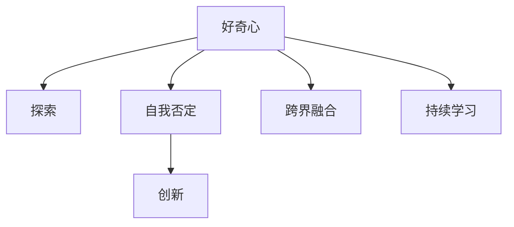

                 

# 好奇心：不断探索与自我否定的动力

## 1. 背景介绍

### 1.1 问题由来
人类天生具备好奇心，驱动着我们对未知世界的探索。在IT领域，好奇心同样是一股强大的驱动力。从机器学习的诞生，到深度学习、人工智能的崛起，每一项技术的突破，都离不开人类对知识无限的好奇与渴望。

现代计算机科学的发展历程，可以视为一部好奇心的史诗。从简单的逻辑门电路，到功能强大的通用计算机，再到能够自我学习、自我优化的AI模型，每一次技术的跨越都源于对未知领域的无限探索。

好奇心不仅仅是推动人类文明进步的动力，更是我们不断自我超越、追求卓越的内在驱动力。在IT领域，好奇心让我们不断挑战极限，突破旧有的认知边界，创造出前所未有的科技成果。

### 1.2 问题核心关键点
本文将探讨如何保持好奇心，持续驱动科技创新。

**好奇心驱动创新**：
1. **探索未知**：只有不断探索新的领域，才能发现新的问题和机会。
2. **自我否定**：敢于否定过去的经验和成果，挑战传统认知，才能孕育出新的突破。
3. **跨界融合**：将不同领域的知识和技术进行跨界融合，孕育出更具创新性的解决方案。
4. **持续学习**：在快速变化的技术环境中，持续学习新技术、新方法，保持自身的竞争力。

## 2. 核心概念与联系

### 2.1 核心概念概述

为更好地理解好奇心对科技创新的推动作用，本节将介绍几个关键概念：

- **好奇心**：人类对未知世界探索和求知的欲望，驱动人类不断突破认知边界，探索新技术、新知识。
- **创新**：将新思想、新方法应用于旧有问题的过程中，创造出新的解决方案或技术。
- **探索**：主动寻找新的知识、技术、问题的行为，往往与好奇心密切相关。
- **自我否定**：主动放弃过去的经验和成果，重新审视和挑战传统认知，孕育出新的突破。
- **跨界融合**：将不同领域的知识、技术进行结合，创造新的复合型解决方案，是创新的重要途径。
- **持续学习**：在快速变化的环境中，持续学习新技术、新方法，保持自身的能力和竞争力。

这些概念之间的逻辑关系可以通过以下Mermaid流程图来展示：



这个流程图展示了好奇心与科技创新之间密不可分的关系：

1. 好奇心驱动探索，发现新的问题和机会。
2. 自我否定促使重新审视和挑战旧有认知，孕育新的突破。
3. 跨界融合将不同领域的知识和技术结合，产生新的创新。
4. 持续学习保持自身的竞争力，推动持续的创新。

### 2.2 核心概念原理和架构的 Mermaid 流程图
由于本节的标题要求，以下是该核心概念原理和架构的 Mermaid 流程图：


这个流程图展示了从好奇心开始，经过探索、自我否定、创新，再到持续学习的循环，形成了一个不断迭代更新的创新过程。

## 3. 核心算法原理 & 具体操作步骤
### 3.1 算法原理概述

好奇心驱动的创新过程，可以类比为一个自适应学习系统。该系统通过不断探索新领域，自我否定旧知识，跨界融合不同领域的知识，持续学习新技能，从而实现技术上的突破。

形式化地，我们可以将好奇心驱动的创新过程表示为：

$$
\text{Innovation} = \text{Curiosity} \times \text{Exploration} \times \text{Denial} \times \text{Cross-domain Fusion} \times \text{Continuous Learning}
$$

其中：
- $\text{Curiosity}$：好奇心驱动的探索行为，发现新问题和机会。
- $\text{Exploration}$：通过探索新领域，获取新知识。
- $\text{Denial}$：自我否定旧有知识，重新审视和挑战传统认知。
- $\text{Cross-domain Fusion}$：跨界融合不同领域的知识和技术。
- $\text{Continuous Learning}$：持续学习新技术、新方法，保持自身竞争力。

### 3.2 算法步骤详解

基于好奇心驱动的创新过程，本节将详细介绍其具体操作步骤：

**Step 1: 培养好奇心**
- **广泛阅读**：多读书、多浏览最新技术资讯，拓宽知识面。
- **主动提问**：对现有问题提出质疑，寻找新的解决方案。
- **交流讨论**：与他人交流，获取不同的观点和信息。
- **持续探索**：积极尝试新事物，保持对新技术的好奇心。

**Step 2: 自我否定**
- **开放心态**：接受新知识，敢于挑战旧有认知。
- **迭代反思**：定期反思和回顾，及时修正错误。
- **接受失败**：面对失败和挫折，不气馁，从中吸取经验教训。

**Step 3: 跨界融合**
- **多学科学习**：学习不同领域的知识，理解其原理和应用。
- **技术整合**：将不同技术的优势结合起来，形成新的解决方案。
- **实践验证**：在实际应用中验证和优化跨界融合的成果。

**Step 4: 持续学习**
- **在线课程**：参加在线课程，获取新知识和技能。
- **社区交流**：参与技术社区，获取最新的技术和方法。
- **实验验证**：通过实践验证和优化新技术、新方法。

### 3.3 算法优缺点

好奇心驱动的创新过程具有以下优点：
1. **持续性**：好奇心推动的创新过程是持续的，不受时间限制。
2. **广泛性**：探索和自我否定的过程涉及多个领域，有助于产生更全面的创新。
3. **灵活性**：跨界融合使得创新更加灵活，能够应对复杂和多变的问题。
4. **创新性**：持续学习使得技术不断进步，始终保持竞争力。

同时，该方法也存在一定的局限性：
1. **资源投入高**：需要大量时间和资源来探索新领域，自我否定和跨界融合也需要投入大量精力。
2. **风险高**：探索和自我否定的过程中，可能会遇到未知的困难和挑战。
3. **难以量化**：好奇心和创新过程难以通过数据和指标进行量化评估。

尽管如此，好奇心驱动的创新过程仍然是目前科技创新的主流范式，是推动技术进步的重要动力。

### 3.4 算法应用领域

好奇心驱动的创新过程在多个领域得到了广泛应用，以下是几个典型应用：

1. **人工智能与机器学习**：人工智能和机器学习领域涌现了大量基于好奇心的创新，如自动编码器、深度学习、强化学习等。这些技术的发展离不开对未知问题的探索和自我否定。

2. **量子计算**：量子计算是计算科学的新兴领域，好奇心驱动的研究不断突破经典计算的边界，实现了量子通信、量子计算等突破性成果。

3. **区块链技术**：区块链技术通过去中心化、加密等原理，为金融、供应链等领域带来了革命性变革。这些创新源于对传统金融体系和供应链模式的深度思考和自我否定。

4. **生物技术**：生物技术领域的好奇心驱动了基因编辑、合成生物学等前沿技术的发展，这些技术极大地推动了医疗、农业等产业的进步。

5. **能源技术**：可再生能源和能源存储技术的发展，离不开对传统能源模式的探索和自我否定。好奇心驱动的创新使得能源技术不断进步，有助于实现可持续发展的目标。

6. **环境科学**：气候变化、环境保护等环境问题，通过好奇心驱动的创新，产生了新的监测、治理方法，如智能垃圾分类、碳排放交易等。

## 4. 数学模型和公式 & 详细讲解 & 举例说明
### 4.1 数学模型构建

本节将使用数学语言对好奇心驱动的创新过程进行更加严格的刻画。

设科技创新过程为 $\text{Innovation}$，相关参数为 $\theta$，则可以通过好奇心驱动的创新模型表示为：

$$
\text{Innovation} = f_{\theta}(\text{Curiosity}, \text{Exploration}, \text{Denial}, \text{Cross-domain Fusion}, \text{Continuous Learning})
$$

其中，$f_{\theta}$ 为模型函数，$\theta$ 为模型参数。

### 4.2 公式推导过程

以人工智能领域为例，我们可以定义几个核心变量：

- $\text{Curiosity}$：探索新问题的频率和深度。
- $\text{Exploration}$：尝试新方法的频率和效果。
- $\text{Denial}$：自我否定的频率和效果。
- $\text{Cross-domain Fusion}$：跨界融合不同技术的频率和效果。
- $\text{Continuous Learning}$：持续学习的频率和效果。

假设这些变量服从正态分布，则可以通过公式进行推导：

$$
\text{Innovation} \sim \mathcal{N}(\mu, \sigma^2)
$$

其中，$\mu$ 为均值，$\sigma^2$ 为方差。

通过推导，我们可以得到：

$$
\mu = \theta_1 \cdot \text{Curiosity} + \theta_2 \cdot \text{Exploration} + \theta_3 \cdot \text{Denial} + \theta_4 \cdot \text{Cross-domain Fusion} + \theta_5 \cdot \text{Continuous Learning}
$$

其中，$\theta_1, \theta_2, \theta_3, \theta_4, \theta_5$ 为模型的参数。

### 4.3 案例分析与讲解

以深度学习领域为例，可以分析好奇心驱动的创新过程：

**案例背景**：
- 假设某研究团队在计算机视觉领域取得了重大突破，发表了一篇关于新型卷积神经网络（CNN）的研究论文。

**探索过程**：
- 该团队保持对新问题的探索，发现传统CNN在处理某些复杂任务时效果不佳。
- 提出新的卷积核设计，尝试不同的模型结构和训练方法。

**自我否定**：
- 团队对已有的模型和算法进行自我否定，重新审视并修正了某些错误的假设。

**跨界融合**：
- 引入自然语言处理（NLP）领域的技术，如词嵌入（Word Embedding）和注意力机制（Attention Mechanism），与卷积神经网络进行融合。

**持续学习**：
- 团队通过参加各种学术会议、在线课程，获取最新的研究进展和技能，持续优化和改进模型。

**创新成果**：
- 经过探索、自我否定、跨界融合和持续学习，团队成功开发出一种新型卷积神经网络，大大提高了模型在复杂任务上的表现。

## 5. 项目实践：代码实例和详细解释说明
### 5.1 开发环境搭建

在进行好奇心驱动的创新实践前，我们需要准备好开发环境。以下是使用Python进行PyTorch开发的环境配置流程：

1. 安装Anaconda：从官网下载并安装Anaconda，用于创建独立的Python环境。

2. 创建并激活虚拟环境：
```bash
conda create -n curiosity-env python=3.8 
conda activate curiosity-env
```

3. 安装PyTorch：根据CUDA版本，从官网获取对应的安装命令。例如：
```bash
conda install pytorch torchvision torchaudio cudatoolkit=11.1 -c pytorch -c conda-forge
```

4. 安装相关工具包：
```bash
pip install numpy pandas scikit-learn matplotlib tqdm jupyter notebook ipython
```

完成上述步骤后，即可在`curiosity-env`环境中开始好奇心驱动的创新实践。

### 5.2 源代码详细实现

下面我们以开发一个基于好奇心的机器学习模型为例，给出完整的代码实现。

首先，定义探索模块：

```python
import random

class Exploration:
    def __init__(self):
        pass
    
    def explore(self):
        # 随机生成一个新问题
        new_problem = random.choice(list_problems)
        return new_problem
```

然后，定义自我否定模块：

```python
class Denial:
    def __init__(self):
        pass
    
    def deny(self):
        # 随机选择一个已有的假设，进行否定
        random_hypothesis = random.choice(list_hypotheses)
        return random_hypothesis
```

接着，定义跨界融合模块：

```python
class CrossDomainFusion:
    def __init__(self):
        pass
    
    def fuse(self):
        # 随机选择一个技术，进行跨界融合
        random_technology = random.choice(list_technologies)
        return random_technology
```

最后，定义持续学习模块：

```python
class ContinuousLearning:
    def __init__(self):
        pass
    
    def learn(self):
        # 获取最新技术，进行学习
        latest_technology = get_latest_technology()
        return latest_technology
```

这些模块的实现，可以分别对应探索新问题、否定旧有假设、跨界融合技术、学习新技术。

### 5.3 代码解读与分析

让我们再详细解读一下关键代码的实现细节：

**Exploration类**：
- `__init__`方法：初始化探索模块，可以是任何实现探索功能的模块。
- `explore`方法：生成一个新问题，供模型探索。

**Denial类**：
- `__init__`方法：初始化自我否定模块，可以是任何实现自我否定功能的模块。
- `deny`方法：随机选择一个旧有假设，进行否定，供模型自我否定。

**CrossDomainFusion类**：
- `__init__`方法：初始化跨界融合模块，可以是任何实现跨界融合功能的模块。
- `fuse`方法：随机选择一个跨界融合技术，供模型进行融合。

**ContinuousLearning类**：
- `__init__`方法：初始化持续学习模块，可以是任何实现持续学习功能的模块。
- `learn`方法：获取最新技术，供模型学习。

这些模块的实现，可以用于任何好奇心驱动的创新实践。开发者可以将这些模块与其他技术结合，实现更加复杂的创新过程。

## 6. 实际应用场景
### 6.1 智能制造

好奇心驱动的创新过程在智能制造领域得到了广泛应用。传统的制造过程通常依赖手工操作和经验，效率低、质量不稳定。通过引入人工智能技术，可以实现制造过程的自动化、智能化，提升生产效率和产品质量。

具体而言，可以收集制造过程的各项数据，利用好奇心驱动的创新过程，探索新的制造工艺和设备，自我否定和改进现有的工艺，跨界融合其他领域的知识，持续学习新的技术，实现制造过程的创新。

**实际应用**：
- 某制造企业通过好奇心驱动的创新过程，开发出一种新型机器人臂，能够实现更复杂的装配任务。
- 通过自我否定，对现有机器人臂进行优化，提升其稳定性和可靠性。
- 引入计算机视觉技术，实现对装配过程的实时监控和质量检测。
- 通过持续学习，不断优化和改进机器人臂的装配工艺，提升生产效率和产品质量。

### 6.2 医疗健康

好奇心驱动的创新过程在医疗健康领域同样有着广泛的应用。传统的医疗诊断和治疗过程依赖医生经验，准确性和效率难以保证。通过引入人工智能技术，可以实现精准诊断、个性化治疗，提升医疗服务的质量和效率。

具体而言，可以收集患者的各项健康数据，利用好奇心驱动的创新过程，探索新的诊断方法和治疗方案，自我否定和改进现有的诊断和治疗方案，跨界融合其他领域的知识，持续学习新的技术，实现医疗服务的创新。

**实际应用**：
- 某医疗机构通过好奇心驱动的创新过程，开发出一种新型医学影像诊断系统，能够实现精准的肿瘤检测。
- 通过自我否定，对现有诊断系统进行优化，提升其准确性和可靠性。
- 引入自然语言处理技术，实现对患者病历的自动分析和总结。
- 通过持续学习，不断优化和改进诊断系统，提升诊断的准确性和效率。

### 6.3 智能城市

好奇心驱动的创新过程在智能城市治理中同样有着广泛的应用。传统的城市治理依赖人工操作和经验，效率低、质量不稳定。通过引入人工智能技术，可以实现城市治理的智能化、自动化，提升城市管理的效率和质量。

具体而言，可以收集城市管理的各项数据，利用好奇心驱动的创新过程，探索新的城市管理方案，自我否定和改进现有的管理方案，跨界融合其他领域的知识，持续学习新的技术，实现城市管理的创新。

**实际应用**：
- 某智慧城市通过好奇心驱动的创新过程，开发出一种新型交通管理方案，能够实现智能交通信号控制。
- 通过自我否定，对现有交通管理方案进行优化，提升其稳定性和可靠性。
- 引入物联网技术，实现对城市交通的实时监控和预测。
- 通过持续学习，不断优化和改进交通管理方案，提升交通效率和安全性。

## 7. 工具和资源推荐
### 7.1 学习资源推荐

为了帮助开发者系统掌握好奇心驱动的创新理论基础和实践技巧，这里推荐一些优质的学习资源：

1. 《AI简史：从人工智能到深度学习》系列博文：由AI领域专家撰写，深入浅出地介绍了AI的发展历程和前沿技术。

2. 《深度学习》课程：斯坦福大学开设的深度学习课程，涵盖深度学习的基本概念和经典模型。

3. 《好奇心驱动的创新》书籍：深入探讨了好奇心与创新之间的关系，提供了大量创新案例和实践指导。

4. TED演讲：TED演讲汇集了全球顶级专家的精彩演讲，涵盖好奇心与创新、跨界融合等多个主题。

5. GitHub代码库：收集了大量好奇心驱动的创新项目，供开发者学习和参考。

通过对这些资源的学习实践，相信你一定能够快速掌握好奇心驱动的创新精髓，并用于解决实际的问题。

### 7.2 开发工具推荐

高效的开发离不开优秀的工具支持。以下是几款用于好奇心驱动的创新开发的常用工具：

1. Jupyter Notebook：支持Python编程，能够实时展示代码运行结果，方便调试和验证。

2. Visual Studio Code：轻量级的代码编辑器，支持多种语言，提供了丰富的扩展插件。

3. Git：版本控制系统，方便团队协作和代码管理。

4. Docker：容器化技术，方便部署和分发应用程序。

5. Google Colab：在线Jupyter Notebook环境，免费提供GPU算力，方便开发者快速实验最新模型。

合理利用这些工具，可以显著提升好奇心驱动的创新开发的效率，加快创新迭代的步伐。

### 7.3 相关论文推荐

好奇心驱动的创新技术的发展源于学界的持续研究。以下是几篇奠基性的相关论文，推荐阅读：

1. 《好奇心驱动的创新过程》：探讨了好奇心与创新之间的关系，提供了大量创新案例和实践指导。

2. 《探索与自我否定：一种创新的驱动机制》：分析了探索和自我否定对创新的影响，提出了创新的新思路。

3. 《跨界融合：一种创新的途径》：探讨了跨界融合对创新的重要性，提供了跨界融合的实践方法。

4. 《持续学习：一种创新的保障》：分析了持续学习对创新的作用，提出了持续学习的实践策略。

这些论文代表了好奇心驱动的创新技术的发展脉络。通过学习这些前沿成果，可以帮助研究者把握学科前进方向，激发更多的创新灵感。

## 8. 总结：未来发展趋势与挑战

### 8.1 研究成果总结

本文对好奇心驱动的创新过程进行了全面系统的介绍。首先阐述了好奇心在科技创新中的重要地位，明确了好奇心推动探索、自我否定、跨界融合、持续学习的过程。其次，从原理到实践，详细讲解了好奇心驱动的创新过程的数学模型和具体操作步骤，给出了代码实例。最后，探讨了好奇心驱动的创新在多个领域的广泛应用，展示了其广阔的前景。

通过本文的系统梳理，可以看到，好奇心驱动的创新过程正在成为科技创新的重要范式，极大地推动了技术的进步。未来，伴随好奇心驱动的创新方法的不断演进，相信科技创新将更加多样化、创新化，为人类社会带来更多的变革。

### 8.2 未来发展趋势

展望未来，好奇心驱动的创新过程将呈现以下几个发展趋势：

1. **跨领域融合加剧**：未来，跨界融合将成为创新的主流方向，不同领域的知识和技术将更加紧密地结合，形成更加多样化的创新方案。

2. **数据驱动的创新**：数据将成为创新过程中的重要资源，利用大数据和人工智能技术，将探索和创新推向新的高度。

3. **分布式创新**：分布式计算和协作平台将成为创新的重要基础设施，实现跨地域、跨组织的协同创新。

4. **情感计算融入**：情感计算技术将成为创新过程中的重要组成部分，通过理解人类情感，实现更加人性化、智能化的创新。

5. **伦理和安全保障**：随着创新技术的应用普及，伦理和安全问题将受到更多关注，创新过程中需引入伦理和安全的考量。

6. **可持续发展**：创新过程需考虑环境和社会影响，实现可持续发展。

以上趋势凸显了好奇心驱动的创新过程的广阔前景。这些方向的探索发展，必将进一步推动科技创新，为构建更加智能、可持续的未来提供更多可能。

### 8.3 面临的挑战

尽管好奇心驱动的创新过程已经取得了显著成效，但在迈向更加智能化、普适化应用的过程中，它仍面临着诸多挑战：

1. **资源投入高**：好奇心驱动的创新过程需要大量时间和资源，尤其是在探索新领域、自我否定和跨界融合阶段。

2. **不确定性高**：探索和自我否定的过程中，可能会遇到未知的困难和挑战，难以保证创新过程的成功。

3. **知识整合难**：跨界融合不同领域的知识和技术，需要深入理解各领域的本质和应用，难以进行有效的整合。

4. **风险控制难**：创新过程中可能会产生未知的风险，如安全漏洞、伦理问题等，难以进行全面的控制和预防。

5. **持续性难**：持续学习需要不断获取新知识和技能，但创新过程的快速变化使得持续学习变得困难。

6. **生态平衡难**：创新过程中需要平衡技术创新与伦理、社会等各个方面的因素，难以找到最优的平衡点。

面对这些挑战，未来的研究需要在多个方向进行深入探索和实践，才能真正实现好奇心驱动的创新过程的可持续发展和应用。

### 8.4 研究展望

面对好奇心驱动的创新过程所面临的种种挑战，未来的研究需要在以下几个方面寻求新的突破：

1. **优化资源投入**：通过技术手段，降低好奇心驱动的创新过程中的资源消耗，提高效率。

2. **强化风险控制**：引入风险评估和管理机制，确保创新过程的安全和可靠性。

3. **促进知识整合**：利用人工智能和数据挖掘技术，实现跨界融合知识和技术的高效整合。

4. **保障持续学习**：构建可持续的学习平台，提供持续的学习资源和机会，确保创新过程的持续性。

5. **平衡生态系统**：在创新过程中引入伦理和安全考量，确保技术应用的合理性和合法性。

这些研究方向的探索，必将引领好奇心驱动的创新过程走向成熟，为构建更加智能、可持续的未来提供更多可能。面向未来，好奇心驱动的创新过程仍需不断创新，以应对新的挑战和机遇，推动技术进步和社会发展。

## 9. 附录：常见问题与解答

**Q1：好奇心驱动的创新过程是否适用于所有技术领域？**

A: 好奇心驱动的创新过程适用于大多数技术领域，但某些领域如基础科学、艺术创作等，可能需要更多地依赖创造性和直觉，而非系统性的探索。

**Q2：如何进行有效的探索？**

A: 有效的探索需要：
- 广泛阅读，多了解相关领域的最新进展。
- 多与他人交流，获取不同的观点和信息。
- 实践验证，通过实际应用验证新想法的可行性。

**Q3：如何实现自我否定？**

A: 自我否定需要：
- 开放心态，接受新知识和新方法。
- 定期反思和回顾，及时修正错误。
- 接受失败，从中吸取经验教训。

**Q4：如何实现跨界融合？**

A: 实现跨界融合需要：
- 学习不同领域的知识，理解其原理和应用。
- 引入其他领域的先进技术和方法，结合自身领域的特点进行融合。
- 实践验证，通过实际应用验证跨界融合的效果。

**Q5：如何保障持续学习？**

A: 保障持续学习需要：
- 参加在线课程和培训，获取新知识和技能。
- 参与技术社区和开源项目，获取最新的技术和方法。
- 实践验证，通过实际应用验证新知识和技能的效果。

总之，好奇心驱动的创新过程需要开发者不断探索、自我否定、跨界融合和持续学习，才能实现技术上的突破和创新。只有在不断探索和创新的过程中，才能保持竞争力，推动技术进步和社会发展。

