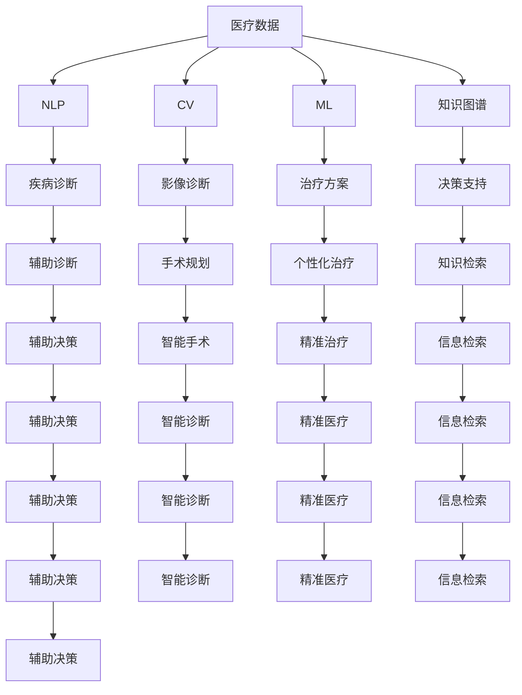

                 

## 1. 背景介绍

医疗科技一直是推动社会进步、改善人类健康的重要力量。随着大数据、人工智能、区块链等新兴技术的迅猛发展，医疗科技也迎来了翻天覆地的变革。医疗数据的海量增长，为科技应用提供了丰富的素材；科技的不断创新，也为医疗提供了更高效、精准的服务。在这场变革中，如何更好地利用技术能力进行医疗创新，成为了行业关注的焦点。

### 1.1 问题由来

医疗科技的创新涉及多个方面，包括但不限于疾病诊断、治疗方案、药品研发、医疗管理等。这些创新都需要结合最新的技术手段，如自然语言处理(NLP)、计算机视觉(CV)、机器学习(ML)等，来实现智能化、高效化的医疗服务。然而，当前医疗科技的发展仍面临诸多挑战：

- **数据孤岛问题**：医疗机构的数据通常存储在不同的系统中，数据孤岛现象严重，难以互通互用。
- **隐私与安全**：医疗数据高度敏感，数据泄露和滥用风险巨大，隐私保护和安全问题亟需解决。
- **知识图谱构建**：医疗领域的知识复杂且分散，如何构建精准的医学知识图谱，辅助医疗决策，是一大难题。
- **技术落地难度**：即便有了先进的技术，如何将其应用于医疗实际场景，提升医疗服务的效能，仍需克服诸多落地障碍。

### 1.2 问题核心关键点

要想在医疗领域取得创新，需要在以下几个方面进行深入探索：

- **数据的获取与清洗**：高效获取、清洗和整合医疗数据，构建知识图谱。
- **算法的开发与优化**：结合最新的深度学习、强化学习等算法，提升诊断和治疗精度。
- **系统的集成与优化**：将技术应用集成到医疗流程中，优化系统的可扩展性和用户体验。
- **隐私保护与伦理审查**：确保技术应用在隐私保护和伦理审查方面符合规定。

这些问题涉及数据、算法、系统、伦理等多个层面，需要在科技创新的过程中综合考虑，以实现医疗科技的全面突破。

## 2. 核心概念与联系

### 2.1 核心概念概述

为更好地理解医疗科技创新，本节将介绍几个核心概念：

- **医疗数据**：包括电子病历、影像资料、基因数据、健康记录等，是医疗科技创新的基础。
- **自然语言处理(NLP)**：通过处理和理解医疗文本数据，辅助医生进行疾病诊断和治疗决策。
- **计算机视觉(CV)**：利用图像识别和处理技术，辅助医生进行影像诊断、手术规划等。
- **机器学习(ML)**：通过训练模型，提高疾病的预测、诊断和治疗效果。
- **知识图谱**：通过构建医学领域的知识图谱，辅助医生进行知识检索和决策支持。
- **区块链**：利用分布式账本技术，确保医疗数据的真实性、完整性和隐私性。

这些核心概念之间的逻辑关系可以通过以下Mermaid流程图来展示：



这个流程图展示了医疗数据在各个核心概念中的应用路径：

- 医疗数据通过自然语言处理、计算机视觉和机器学习等技术进行处理和分析。
- 构建知识图谱，辅助医生进行知识检索和决策支持。
- 最终应用于疾病诊断、影像诊断、手术规划、个性化治疗等医疗场景，提升医疗服务的效能和精度。

## 3. 核心算法原理 & 具体操作步骤
### 3.1 算法原理概述

医疗科技创新中，自然语言处理、计算机视觉和机器学习等技术是核心驱动力。它们通过各自的方法和工具，对医疗数据进行自动化处理，辅助医生进行更高效、更精准的医疗决策。

### 3.2 算法步骤详解

以下以自然语言处理在医疗领域的应用为例，详细介绍其算法步骤：

#### 3.2.1 医疗文本数据处理

**步骤1：文本预处理**

- **分词**：将医疗文本数据进行分词处理，分离出有意义的词汇和短语。
- **清洗**：去除无用字符和停用词，确保文本的准确性和简洁性。
- **标准化**：将不同格式的文本数据转换为统一格式，便于后续处理。

**步骤2：特征提取**

- **词向量**：利用词嵌入技术，如Word2Vec、GloVe等，将词汇映射到高维空间，保留词汇的语义信息。
- **卷积神经网络(CNN)**：对文本进行局部特征提取，识别出关键信息。
- **循环神经网络(RNN)**：对文本序列进行建模，理解文本的上下文关系。
- **Transformer**：利用自注意力机制，捕捉长文本的依赖关系，提升模型的理解和生成能力。

**步骤3：文本分类与标注**

- **分类模型**：使用逻辑回归、支持向量机(SVM)等分类算法，对文本进行分类。
- **标注模型**：使用序列标注算法，如CRF、BiLSTM-CRF等，对文本中的关键信息进行标注，如疾病名称、症状、实验室检测结果等。

**步骤4：模型训练与评估**

- **数据集准备**：收集标注好的医疗文本数据集，划分为训练集、验证集和测试集。
- **模型训练**：使用随机梯度下降等优化算法，训练分类和标注模型。
- **评估与优化**：在验证集上评估模型性能，使用指标如准确率、召回率、F1-score等进行优化。

#### 3.2.2 算法优缺点

自然语言处理技术在医疗领域具有以下优点：

- **自动化处理**：大幅提升医疗文本数据的处理效率，减少人力成本。
- **准确性提升**：通过自动化分类和标注，提高疾病诊断和治疗的准确性。
- **知识整合**：将医疗文本数据与知识图谱结合，实现知识整合和决策支持。

同时，该技术也存在一定的局限性：

- **数据质量问题**：医疗数据存在噪音和错误，影响模型的准确性。
- **解释性不足**：深度学习模型具有"黑盒"特性，缺乏可解释性。
- **算法复杂性**：模型的复杂度较高，计算资源需求大。

### 3.3 算法应用领域

自然语言处理技术在医疗领域具有广泛的应用场景：

- **病历分析**：对电子病历进行文本分类和标注，提取关键医疗信息，辅助医生进行诊断和治疗。
- **文献检索**：利用自然语言处理技术，对医学文献进行关键词提取和摘要生成，加速知识获取。
- **智能问答**：构建医疗知识图谱，实现智能问答系统，解答医生的查询问题，提供决策支持。
- **情感分析**：对医疗文本进行情感分析，评估患者的情绪状态，辅助医生进行心理治疗。

## 4. 数学模型和公式 & 详细讲解 & 举例说明

### 4.1 数学模型构建

自然语言处理在医疗领域的应用，主要依赖于文本分类和序列标注模型。下面以序列标注为例，介绍其数学模型的构建。

设医疗文本序列为 $X=\{x_1, x_2, ..., x_n\}$，其中 $x_i$ 表示第 $i$ 个词汇。序列标注任务的输出为 $Y=\{y_1, y_2, ..., y_n\}$，其中 $y_i$ 表示第 $i$ 个词汇的标注标签，如“疾病名称”、“症状”、“实验室检测结果”等。序列标注问题可以形式化为：

$$
\hat{Y} = \mathop{\arg\max}_{Y} P(Y|X; \theta)
$$

其中 $P(Y|X; \theta)$ 为标注模型的概率分布，$\theta$ 为模型参数。

### 4.2 公式推导过程

假设使用条件随机场(CRF)进行序列标注，其概率模型为：

$$
P(Y|X; \theta) = \frac{1}{Z(X; \theta)} \prod_{i=1}^{n} T(y_i, y_{i-1}, x_i) \cdot O(y_i)
$$

其中 $T(y_i, y_{i-1}, x_i)$ 为转移概率，$O(y_i)$ 为观测概率。$Z(X; \theta)$ 为归一化因子。

对 $P(Y|X; \theta)$ 取对数，得到：

$$
\log P(Y|X; \theta) = -\sum_{i=1}^{n} \log Z(X; \theta) + \sum_{i=1}^{n} \log T(y_i, y_{i-1}, x_i) + \sum_{i=1}^{n} \log O(y_i)
$$

其中 $Z(X; \theta)$ 的对数形式为：

$$
\log Z(X; \theta) = \sum_{y} \exp(-\sum_{i=1}^{n} \log T(y_i, y_{i-1}, x_i) + \sum_{i=1}^{n} \log O(y_i))
$$

利用最大似然估计，可以将序列标注问题转化为优化问题：

$$
\hat{\theta} = \mathop{\arg\min}_{\theta} -\frac{1}{N} \sum_{i=1}^{N} \log P(Y|X; \theta)
$$

在优化过程中，通常采用随机梯度下降等算法进行求解。

### 4.3 案例分析与讲解

以医学影像中的病变检测为例，介绍计算机视觉在医疗领域的应用。

**步骤1：数据准备**

- **数据集**：收集大量带标注的医学影像数据集，如X光片、CT影像、MRI影像等。
- **标注**：对每张影像标注病变的类型、位置、大小等信息。

**步骤2：模型训练**

- **数据预处理**：对影像数据进行归一化、旋转、裁剪等预处理操作。
- **特征提取**：使用卷积神经网络(CNN)等深度学习模型，提取影像的局部特征。
- **分类器训练**：使用softmax分类器，对提取的特征进行分类，识别病变类型。

**步骤3：模型评估**

- **验证集评估**：在验证集上评估模型性能，计算准确率、召回率、F1-score等指标。
- **参数调优**：根据评估结果，调整模型的超参数，如卷积层数、滤波器大小、学习率等。

## 5. 项目实践：代码实例和详细解释说明

### 5.1 开发环境搭建

在进行医疗科技创新项目实践时，需要搭建合适的开发环境。以下是Python环境中主要依赖包的安装和配置流程：

1. **Python环境配置**：
```bash
python -m pip install -U pip
pip install numpy pandas scikit-learn pytorch torchvision torchtext transformers
```

2. **依赖库安装**：
```bash
pip install PyYAML PyTorchText
```

3. **虚拟环境**：
```bash
python -m venv venv
source venv/bin/activate
```

完成上述步骤后，即可在虚拟环境中进行项目开发。

### 5.2 源代码详细实现

以医疗文本分类项目为例，展示如何使用自然语言处理技术进行病历分析。

```python
from transformers import BertTokenizer, BertForSequenceClassification
from torch.utils.data import Dataset, DataLoader
from torch.nn import CrossEntropyLoss, AdamW
import torch
import pandas as pd
import torch.nn.functional as F

# 加载预训练模型和分词器
model_name = 'bert-base-cased'
tokenizer = BertTokenizer.from_pretrained(model_name)
model = BertForSequenceClassification.from_pretrained(model_name, num_labels=2)

# 定义数据集
class MedicalDataset(Dataset):
    def __init__(self, data, tokenizer):
        self.data = data
        self.tokenizer = tokenizer
        
    def __len__(self):
        return len(self.data)
    
    def __getitem__(self, idx):
        text = self.data.iloc[idx]['text']
        label = self.data.iloc[idx]['label']
        encoding = self.tokenizer(text, truncation=True, padding='max_length', max_length=512, return_tensors='pt')
        input_ids = encoding['input_ids']
        attention_mask = encoding['attention_mask']
        return {'input_ids': input_ids, 'attention_mask': attention_mask, 'labels': torch.tensor(label)}

# 定义训练和评估函数
def train_model(model, data_loader, optimizer, device, num_epochs=5):
    model.to(device)
    criterion = CrossEntropyLoss()
    for epoch in range(num_epochs):
        model.train()
        for batch in data_loader:
            input_ids = batch['input_ids'].to(device)
            attention_mask = batch['attention_mask'].to(device)
            labels = batch['labels'].to(device)
            optimizer.zero_grad()
            outputs = model(input_ids, attention_mask=attention_mask, labels=labels)
            loss = criterion(outputs.logits, labels)
            loss.backward()
            optimizer.step()
        print(f'Epoch {epoch+1}/{num_epochs}, Loss: {loss.item()}')
    
def evaluate_model(model, data_loader, device):
    model.eval()
    total_correct, total_label = 0, 0
    for batch in data_loader:
        input_ids = batch['input_ids'].to(device)
        attention_mask = batch['attention_mask'].to(device)
        labels = batch['labels'].to(device)
        outputs = model(input_ids, attention_mask=attention_mask)
        total_correct += (outputs.logits.argmax(dim=1) == labels).sum().item()
        total_label += labels.numel()
    accuracy = total_correct / total_label
    print(f'Accuracy: {accuracy:.2f}')

# 加载数据集
data = pd.read_csv('medical_data.csv')
train_data, test_data = train_test_split(data, test_size=0.2)
train_dataset = MedicalDataset(train_data, tokenizer)
test_dataset = MedicalDataset(test_data, tokenizer)
train_loader = DataLoader(train_dataset, batch_size=16, shuffle=True)
test_loader = DataLoader(test_dataset, batch_size=16)

# 定义超参数
learning_rate = 2e-5
device = torch.device('cuda' if torch.cuda.is_available() else 'cpu')

# 训练模型
optimizer = AdamW(model.parameters(), lr=learning_rate)
model.train_model(train_loader, optimizer, device, num_epochs=5)

# 评估模型
model.evaluate_model(test_loader, device)
```

### 5.3 代码解读与分析

上述代码展示了如何使用BERT模型对医疗文本数据进行分类。以下是关键代码的详细解读：

1. **数据准备**：
   - 使用PyYAML加载配置文件，定义数据集路径和模型参数。
   - 使用Pandas读取CSV文件，获取文本和标签数据。
   - 使用BertTokenizer对文本进行分词和编码。

2. **模型定义**：
   - 定义BERTForSequenceClassification模型，设置标签数为2。
   - 定义AdamW优化器，设置学习率为2e-5。

3. **数据集定义**：
   - 使用Dataset类定义数据集，重载`__len__`和`__getitem__`方法，实现数据集的处理和迭代。
   - 在`__getitem__`方法中，将文本数据编码成输入ids和attention_mask，并返回标签。

4. **训练函数**：
   - 使用随机梯度下降训练模型，每次迭代计算损失并更新参数。
   - 在每个epoch结束时，打印平均损失。

5. **评估函数**：
   - 使用evaluation函数计算模型的准确率。
   - 在测试集上评估模型性能，输出准确率。

6. **运行结果**：
   - 在训练集和测试集上分别进行训练和评估。

## 6. 实际应用场景

### 6.1 智能诊疗系统

智能诊疗系统是医疗科技创新的重要应用场景。通过自然语言处理和计算机视觉技术，智能诊疗系统可以辅助医生进行疾病诊断和治疗，提升医疗服务的质量和效率。

**应用场景**：
- **病历分析**：利用自然语言处理技术，对电子病历进行文本分类和标注，提取关键医疗信息，辅助医生进行诊断和治疗。
- **影像诊断**：通过计算机视觉技术，对医学影像进行自动识别和分类，识别病变类型和位置。
- **健康监测**：利用可穿戴设备采集的健康数据，结合自然语言处理技术，进行健康监测和预警。

**技术架构**：
- **数据层**：收集和整合电子病历、医学影像、健康监测数据等医疗数据。
- **算法层**：基于自然语言处理和计算机视觉技术，构建疾病诊断、影像诊断、健康监测等算法模型。
- **应用层**：通过API接口将算法模型集成到诊疗系统中，提供决策支持、智能诊断、健康预警等服务。

### 6.2 个性化治疗方案

个性化治疗方案是医疗科技创新的另一重要方向。通过机器学习和知识图谱技术，个性化治疗方案可以提供更加精准、高效的治疗方案，提升患者的治疗效果和满意度。

**应用场景**：
- **基因组学**：通过基因组测序和分析，为患者提供个性化治疗方案。
- **病历分析**：结合患者的病史、生活习惯等信息，提供个性化的治疗建议。
- **药物研发**：利用机器学习技术，预测药物的疗效和副作用，优化药物研发流程。

**技术架构**：
- **数据层**：收集和整合基因数据、病历数据、药物数据等医疗数据。
- **算法层**：基于机器学习技术和知识图谱技术，构建个性化治疗方案的算法模型。
- **应用层**：通过API接口将算法模型集成到个性化治疗系统中，提供精准治疗方案和药物研发支持。

## 7. 工具和资源推荐

### 7.1 学习资源推荐

为了帮助开发者系统掌握医疗科技创新的理论基础和实践技巧，这里推荐一些优质的学习资源：

1. **《医疗大数据与人工智能》**：系统介绍医疗大数据和人工智能技术在医疗领域的应用，涵盖数据预处理、算法开发、系统集成等多个方面。
2. **《深度学习在医疗中的应用》**：介绍深度学习在医疗领域的各类应用，如疾病预测、影像诊断、药物研发等。
3. **《自然语言处理在医疗中的应用》**：详细讲解自然语言处理技术在医疗领域的应用，包括病历分析、智能问答等。
4. **《计算机视觉在医疗中的应用》**：介绍计算机视觉技术在医疗领域的应用，如影像诊断、手术规划等。

通过这些资源的学习实践，相信你一定能够快速掌握医疗科技创新的精髓，并用于解决实际的医疗问题。

### 7.2 开发工具推荐

高效的开发离不开优秀的工具支持。以下是几款用于医疗科技创新开发的常用工具：

1. **PyTorch**：基于Python的开源深度学习框架，灵活的计算图，适合快速迭代研究。
2. **TensorFlow**：由Google主导开发的开源深度学习框架，生产部署方便，适合大规模工程应用。
3. **PyTorchText**：基于PyTorch的NLP工具库，集成了众多自然语言处理模型，便于快速开发。
4. **TensorBoard**：TensorFlow配套的可视化工具，实时监测模型训练状态，提供丰富的图表呈现方式。

合理利用这些工具，可以显著提升医疗科技创新任务的开发效率，加快创新迭代的步伐。

### 7.3 相关论文推荐

医疗科技创新的发展源于学界的持续研究。以下是几篇奠基性的相关论文，推荐阅读：

1. **《医疗大数据挖掘与分析》**：介绍医疗大数据的挖掘和分析方法，涵盖文本挖掘、图像分析、基因组学等多个方面。
2. **《基于深度学习的医疗影像分析》**：介绍深度学习在医学影像分析中的应用，包括影像分类、病变检测等。
3. **《自然语言处理在医疗中的应用》**：详细介绍自然语言处理技术在医疗领域的应用，包括病历分析、智能问答等。
4. **《医疗知识图谱构建与应用》**：介绍知识图谱在医疗领域的应用，涵盖疾病诊断、药物研发、健康监测等多个方面。

这些论文代表了大数据、深度学习在医疗领域的研究进展，通过学习这些前沿成果，可以帮助研究者把握学科前进方向，激发更多的创新灵感。

## 8. 总结：未来发展趋势与挑战

### 8.1 研究成果总结

通过上述讨论，我们可以看到医疗科技创新的巨大潜力和广阔前景。自然语言处理、计算机视觉和机器学习等技术，已经在疾病诊断、治疗方案、个性化治疗等多个方面展现了卓越的性能和应用前景。

### 8.2 未来发展趋势

展望未来，医疗科技创新的趋势包括：

1. **跨领域融合**：医疗科技与其他领域的深度融合，如自然语言处理与生物信息学、计算机视觉与影像医学、机器学习与基因组学等，推动医疗技术的全面创新。
2. **智能化升级**：医疗系统的智能化水平不断提升，智能诊疗、个性化治疗、智能管理等应用场景将越来越普及。
3. **数据驱动决策**：通过数据驱动的决策支持系统，提高医疗决策的科学性和准确性。
4. **多模态融合**：将文本、影像、基因等多模态数据融合，构建更全面、精准的医疗模型。
5. **个性化医疗**：基于患者个体数据，提供更加精准、个性化的医疗服务。
6. **远程医疗**：利用智能技术，提供远程诊疗、健康监测、在线咨询等服务，缩小医疗资源分布差距。

### 8.3 面临的挑战

尽管医疗科技创新的前景广阔，但在实践中仍面临诸多挑战：

1. **数据隐私与安全**：医疗数据高度敏感，隐私保护和安全问题亟需解决。
2. **算法鲁棒性**：深度学习模型面对异常数据时，鲁棒性不足，容易产生误诊。
3. **算法解释性**：深度学习模型具有"黑盒"特性，缺乏可解释性，影响医生信任和使用。
4. **技术落地难度**：现有技术在实际医疗场景中的应用仍存在诸多落地障碍，需要进一步优化和改进。
5. **跨学科合作**：医疗科技创新的跨学科合作难度较大，需要多方协同努力。

### 8.4 研究展望

未来，医疗科技创新的研究需要从以下几个方面寻求新的突破：

1. **数据隐私保护**：研究高效的数据保护技术，确保医疗数据的隐私和安全。
2. **算法鲁棒性提升**：开发更加鲁棒的算法模型，提高算法的稳定性和可靠性。
3. **算法解释性增强**：利用可解释性技术，提升模型的可解释性，增加医生对模型的信任。
4. **跨学科合作**：加强跨学科合作，推动医疗科技创新的全面发展。
5. **技术应用优化**：优化技术在实际医疗场景中的应用，提升系统的可扩展性和用户体验。

总之，医疗科技创新的未来充满挑战，但也充满机遇。通过科技的不断创新和优化，相信医疗科技将为人类健康事业做出更大的贡献。

## 9. 附录：常见问题与解答

**Q1：医疗数据孤岛问题如何解决？**

A: 医疗数据孤岛问题是医疗科技创新的重要挑战。解决该问题的方法包括：

1. **数据标准化**：制定统一的数据格式和标准，确保不同系统间的数据互通互用。
2. **数据共享平台**：构建统一的医疗数据共享平台，促进不同医疗机构之间的数据交流。
3. **数据治理**：建立数据治理机制，确保数据质量和安全。

通过以上措施，可以有效减少数据孤岛现象，推动医疗数据的共享和整合。

**Q2：如何确保医疗数据的安全性？**

A: 确保医疗数据的安全性是医疗科技创新的关键。以下是几种常用的数据安全措施：

1. **数据加密**：对医疗数据进行加密处理，确保数据在传输和存储过程中的安全性。
2. **访问控制**：对医疗数据进行严格的访问控制，限制非授权用户访问。
3. **审计日志**：建立审计日志系统，记录数据访问和使用情况，确保数据使用的可追溯性。

通过以上措施，可以有效地保护医疗数据的隐私和安全。

**Q3：如何提高医疗算法的鲁棒性？**

A: 提高医疗算法的鲁棒性是医疗科技创新的重要方向。以下是几种常用的鲁棒性提升方法：

1. **数据增强**：通过数据增强技术，增加训练数据的多样性和复杂性，提高算法的鲁棒性。
2. **模型校验**：使用模型校验技术，如对抗样本生成、鲁棒损失函数等，提高模型的鲁棒性。
3. **多模型集成**：通过模型集成技术，将多个模型的预测结果进行融合，提高算法的鲁棒性。

通过以上方法，可以有效地提升医疗算法的鲁棒性，确保其在各种情况下的稳定性和可靠性。

**Q4：如何增强医疗算法的可解释性？**

A: 增强医疗算法的可解释性是医疗科技创新的重要任务。以下是几种常用的可解释性提升方法：

1. **特征提取**：通过特征提取技术，将模型的预测过程转化为可解释的特征，帮助医生理解模型的决策过程。
2. **模型可视化**：使用模型可视化技术，展示模型的内部结构和预测过程，帮助医生理解模型的行为。
3. **解释性算法**：使用解释性算法，如LIME、SHAP等，提高模型的可解释性。

通过以上方法，可以有效地增强医疗算法的可解释性，提高医生的信任和使用效果。

**Q5：如何优化医疗技术的落地应用？**

A: 优化医疗技术的落地应用是医疗科技创新的关键。以下是几种常用的优化方法：

1. **系统集成**：将医疗技术集成到现有的医疗系统中，确保系统的稳定性和兼容性。
2. **用户培训**：对医疗人员进行培训，提高其对新技术的掌握和应用能力。
3. **技术支持**：提供技术支持和维护服务，确保系统的长期稳定运行。

通过以上措施，可以有效地优化医疗技术的落地应用，提高系统的可扩展性和用户体验。

---

作者：禅与计算机程序设计艺术 / Zen and the Art of Computer Programming

