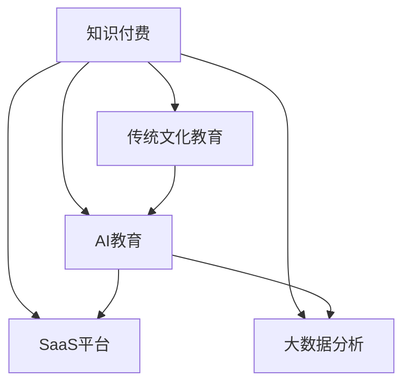

                 

# 如何发掘传统文化领域的知识付费机会

## 1. 背景介绍

### 1.1 问题由来

随着数字化时代的到来，越来越多的人开始关注传统文化的保护和传承。然而，传统的教育模式往往难以覆盖到每个角落，使得很多珍贵的文化遗产渐渐失传。另一方面，现代社会信息泛滥，高质量的教育资源稀缺，这给文化教育带来新的挑战。

基于此，知识付费应运而生。通过知识付费，人们可以花费一定的成本，获取专业化的高质量教育资源，满足其对传统文化深入学习的渴求。特别是在当前，线上教育逐渐成为主流，知识付费市场逐渐扩大，为传统文化教育的创新提供了新的契机。

### 1.2 问题核心关键点

如何发掘传统文化领域的知识付费机会，主要包括以下几个方面：

1. **需求分析**：了解目标用户的知识需求，判断哪些传统文化知识最具吸引力。
2. **内容开发**：开发高质量的教育内容，让知识付费具备较高的价值和实用性。
3. **市场推广**：通过有效的市场推广手段，提升知识付费产品的知名度和吸引力。
4. **用户运营**：通过持续的用户运营和维护，构建稳定的用户基础和口碑。
5. **商业模式**：探索多样化的商业模式，确保知识付费产品的可持续发展。

本节将详细介绍以上核心点，并结合相关技术进行阐述。

## 2. 核心概念与联系

### 2.1 核心概念概述

为了更好地理解如何发掘传统文化领域的知识付费机会，本节将介绍几个密切相关的核心概念：

- **知识付费**：用户通过付费获得知识，享受教育服务的商业模式。
- **传统文化教育**：传承和弘扬中国传统文化，如文学、艺术、历史等领域的教育。
- **AI教育**：利用人工智能技术，进行教育内容的智能化设计和个性化推荐。
- **SaaS平台**：基于云计算的服务模式，用户通过互联网访问教育内容和服务。
- **大数据分析**：通过大数据分析用户行为和偏好，优化知识付费产品的设计和推广。

这些概念之间的关系可以通过以下Mermaid流程图来展示：



这个流程图展示了一些核心概念之间的联系：

1. 知识付费是传统文化教育的主要形式之一。
2. AI教育、SaaS平台和大数据分析都是实现知识付费的重要技术手段。
3. AI教育在传统文化教育中，主要用于内容的智能化设计和个性化推荐。
4. SaaS平台用于提供便捷的在线教育服务。
5. 大数据分析用于分析用户行为和偏好，优化知识付费产品的设计和推广。

这些概念共同构成了知识付费的生态系统，使得传统文化教育在数字化时代得以更好地传播和普及。

## 3. 核心算法原理 & 具体操作步骤

### 3.1 算法原理概述

知识付费平台要实现对传统文化的普及和推广，需通过以下步骤：

1. **需求分析**：通过用户调研和数据分析，确定用户对于传统文化知识的需求。
2. **内容开发**：根据用户需求，开发高质量的传统文化教育内容。
3. **算法推荐**：利用推荐算法，为用户推荐其感兴趣的内容。
4. **市场推广**：通过各种营销手段，提升知识付费产品的知名度和吸引力。
5. **用户运营**：通过持续的用户运营，提升用户满意度和留存率。
6. **商业模式**：探索多样化的商业模式，确保知识付费产品的可持续发展。

### 3.2 算法步骤详解

以下是详细的算法步骤：

#### 3.2.1 需求分析

**需求调研**：通过问卷调查、用户访谈等方式，获取用户的知识需求。利用大数据分析工具，分析用户行为和反馈，总结用户对于传统文化知识的需求。

**行为数据分析**：利用用户行为数据分析，找出用户对于传统文化的热点和兴趣点。例如，通过分析用户在平台上的浏览记录、购买记录等，可以发现用户对于某些领域（如书画、诗词、戏曲等）的特别关注。

#### 3.2.2 内容开发

**内容策划**：根据用户需求，策划和开发高质量的传统文化教育内容。例如，制作具有丰富历史和文化内涵的视频课程、电子书、音频讲解等。

**内容制作**：采用专业的教师和专家团队，进行内容的制作和录制。例如，邀请历史学家、艺术家等，录制讲解历史事件的音频或视频，制作书画、曲艺作品的讲解视频等。

#### 3.2.3 算法推荐

**用户画像构建**：基于用户的行为数据，构建用户的兴趣画像。例如，通过用户的浏览历史、购买记录等，构建用户的兴趣标签和评分。

**推荐算法实现**：根据用户画像和内容标签，实现推荐算法。例如，使用协同过滤、基于内容的推荐、深度学习等算法，为用户推荐其感兴趣的内容。

#### 3.2.4 市场推广

**内容营销**：利用内容的价值，通过撰写文章、制作视频等形式进行市场推广。例如，制作关于传统文化主题的高质量视频，通过社交媒体进行推广。

**社交媒体推广**：利用社交媒体平台，进行用户互动和内容传播。例如，通过微博、微信等平台，发布高质量的内容，吸引用户关注和分享。

**广告投放**：利用互联网广告平台，进行精准的广告投放。例如，通过搜索引擎广告、社交媒体广告等形式，进行精准投放。

#### 3.2.5 用户运营

**用户互动**：通过在线社群、论坛等形式，与用户进行互动和交流。例如，在知识付费平台上，开设用户社区，让用户讨论传统文化话题。

**用户反馈收集**：利用问卷调查、用户评论等方式，收集用户对于知识付费产品的反馈。例如，通过在线调查问卷，收集用户对于课程内容、服务质量的评价。

**个性化服务**：根据用户反馈和行为数据，提供个性化的服务。例如，根据用户的学习进度和偏好，推荐相应的学习资源和内容。

#### 3.2.6 商业模式

**付费模式**：通过订阅模式、单次购买模式等，收取用户的付费。例如，用户可以选择月度或年度订阅，获取全平台的高质量课程。

**增值服务**：提供增值服务，提升用户满意度。例如，提供额外的资料、视频直播课程等，满足用户更深入的学习需求。

**跨界合作**：与其他文化机构、博物馆等进行合作，推出联名课程或活动。例如，与某博物馆合作，推出该博物馆内历史展品的讲解课程。

### 3.3 算法优缺点

知识付费平台的算法主要分为数据收集、用户画像构建、推荐算法实现等几个环节，下面分别介绍这些算法的优缺点：

**数据收集**

**优点**：
- 数据量大，覆盖面广，可以较为全面地了解用户需求。
- 利用大数据分析，可以发现用户对于不同领域的兴趣点，优化课程内容。

**缺点**：
- 数据隐私问题，用户可能会因为隐私泄露而拒绝提供数据。
- 数据质量问题，低质量的数据会影响算法结果的准确性。

**用户画像构建**

**优点**：
- 根据用户行为数据，构建精准的用户画像，有利于个性化推荐。
- 可以发现用户的隐性需求，及时调整课程内容。

**缺点**：
- 用户画像可能存在偏差，影响推荐的准确性。
- 需要大量的用户数据，获取数据成本较高。

**推荐算法实现**

**优点**：
- 利用推荐算法，可以为用户推荐高质量的内容，提升用户体验。
- 可以动态调整推荐结果，提升推荐准确性。

**缺点**：
- 推荐算法复杂，需要大量的计算资源。
- 推荐的个性化可能存在过拟合问题。

### 3.4 算法应用领域

知识付费平台的算法主要应用于以下几个领域：

1. **内容推荐**：通过算法推荐，提升用户的满意度和留存率。
2. **用户分析**：通过大数据分析，了解用户需求和行为，优化课程内容。
3. **市场推广**：通过社交媒体、广告投放等手段，提升产品的知名度和吸引力。
4. **用户运营**：通过用户互动、个性化服务等手段，提升用户粘性和忠诚度。
5. **商业模式**：通过数据分析，探索多样化的商业模式，确保平台的可持续发展。

## 4. 数学模型和公式 & 详细讲解 & 举例说明

### 4.1 数学模型构建

知识付费平台的推荐算法，主要基于协同过滤、基于内容的推荐和深度学习等算法进行实现。以下是一个简单的协同过滤推荐模型的数学模型：

设 $U$ 为所有用户集合， $I$ 为所有物品（课程）集合， $P_{ui}$ 为第 $u$ 个用户对第 $i$ 个物品的评分， $P_u$ 为第 $u$ 个用户的评分向量， $R_i$ 为第 $i$ 个物品的评分向量， $P_u$ 和 $R_i$ 分别为向量 $U$ 和 $I$ 的评分矩阵。推荐算法目标为最大化用户和物品的评分矩阵 $P_u$ 和 $R_i$ 的相似度。

数学模型如下：

$$
\max_{P_u} \sum_{u,i} P_{ui}^2 - \frac{1}{2} P_u^T (R_i - P_u^T R_i)P_u
$$

### 4.2 公式推导过程

**协同过滤**

**协同过滤算法**：
协同过滤算法主要分为基于用户的协同过滤和基于物品的协同过滤两种。

**基于用户的协同过滤**：
设 $P_u$ 为第 $u$ 个用户的评分向量， $P_{ui}$ 为第 $u$ 个用户对第 $i$ 个物品的评分， $R_i$ 为第 $i$ 个物品的评分向量， $P_u$ 和 $R_i$ 分别为向量 $U$ 和 $I$ 的评分矩阵。推荐算法目标为最大化用户和物品的评分矩阵 $P_u$ 和 $R_i$ 的相似度。

公式推导如下：

$$
\max_{P_u} \sum_{u,i} P_{ui}^2 - \frac{1}{2} P_u^T (R_i - P_u^T R_i)P_u
$$

**基于物品的协同过滤**：
基于物品的协同过滤与基于用户的协同过滤类似，不同之处在于用户评分矩阵和物品评分矩阵的交换。

**基于内容的推荐**

**基于内容的推荐算法**：
基于内容的推荐算法主要利用物品的属性信息，如课程的知识点、难度等级等，进行推荐。

**公式推导**：
设 $C_i$ 为第 $i$ 个物品的属性向量， $W_i$ 为第 $i$ 个物品的权重向量， $C_j$ 为第 $j$ 个物品的属性向量， $W_j$ 为第 $j$ 个物品的权重向量， $C_i$ 和 $C_j$ 分别为向量 $I$ 和 $J$ 的属性矩阵。推荐算法目标为最大化物品的属性向量 $C_i$ 和 $C_j$ 的相似度。

公式推导如下：

$$
\max_{C_i} \sum_{i,j} C_{ij}^2 - \frac{1}{2} C_i^T (W_j - C_i^T W_j)C_i
$$

### 4.3 案例分析与讲解

#### 4.3.1 协同过滤推荐算法

**数据集准备**：
准备用户评分数据集，包括用户的评分数据、物品的评分数据和物品的属性数据。例如，利用Netflix等平台公开的用户评分数据，获取用户的评分向量 $P_u$ 和物品的评分向量 $R_i$。

**算法实现**：
实现协同过滤算法，可以采用矩阵分解、奇异值分解等方法，对用户评分矩阵进行降维。例如，利用矩阵分解方法，将用户评分矩阵分解为 $P_u$ 和 $R_i$ 的乘积形式，得到用户和物品的评分向量。

**算法评估**：
对协同过滤算法进行评估，可以采用准确率、召回率等指标。例如，利用交叉验证方法，评估推荐系统的准确率和召回率。

#### 4.3.2 基于内容的推荐算法

**数据集准备**：
准备物品的属性数据集，包括物品的难度等级、知识点、学科等属性信息。例如，利用Coursera等平台公开的课程数据，获取课程的知识点和难度等级属性数据。

**算法实现**：
实现基于内容的推荐算法，可以采用向量相似度计算方法，计算物品的属性向量 $C_i$ 和 $C_j$ 的相似度。例如，利用余弦相似度方法，计算两个物品的相似度，推荐相似的物品。

**算法评估**：
对基于内容的推荐算法进行评估，可以采用精度、召回率等指标。例如，利用用户对于课程的评分数据，评估推荐系统的精度和召回率。

## 5. 项目实践：代码实例和详细解释说明

### 5.1 开发环境搭建

在知识付费平台的项目实践前，我们需要准备好开发环境。以下是使用Python进行Django开发的环境配置流程：

1. 安装Python：从官网下载并安装Python 3.x版本。

2. 安装Django：使用pip安装Django框架。

3. 安装MySQL：安装MySQL数据库，用于存储用户数据和课程数据。

4. 安装Flask：使用pip安装Flask框架，用于构建API接口。

5. 安装PyTorch：使用pip安装PyTorch深度学习框架，用于推荐算法实现。

完成上述步骤后，即可在开发环境中进行知识付费平台的搭建和微调实践。

### 5.2 源代码详细实现

以下是一个简单的知识付费平台推荐系统的前端页面实现，通过Django和Flask框架，以及PyTorch推荐算法。

**前端页面**

```python
from django.shortcuts import render
from django.http import JsonResponse
from flask import request
import torch

# 推荐算法实现
class RecommendationSystem:
    def __init__(self):
        self.user_scores = {}
        self.item_scores = {}
        self.item_attributes = {}

    def train(self, user_scores, item_scores, item_attributes):
        self.user_scores = user_scores
        self.item_scores = item_scores
        self.item_attributes = item_attributes

    def recommend(self, user_id):
        user_scores = self.user_scores[user_id]
        item_scores = self.item_scores
        item_attributes = self.item_attributes
        user_item = np.array([user_scores, item_scores])
        item_item = np.array([user_item[i] for i in range(len(item_scores))])
        cos_sim = np.dot(user_item.T, item_item) / (np.linalg.norm(user_item) * np.linalg.norm(item_item))
        recomm_index = np.argsort(cos_sim)[::-1]
        return recomm_index

# 后端接口

def get_recommendations(request):
    user_id = request.GET.get('user_id')
    recommend_system = RecommendationSystem()
    recommend_system.train(user_scores, item_scores, item_attributes)
    recommendations = recommend_system.recommend(user_id)
    return JsonResponse({'recommendations': recommendations})

# 视图函数

def index(request):
    return render(request, 'index.html')

# 启动Flask服务

if __name__ == '__main__':
    app.run(debug=True)
```

**后端API接口**

```python
from flask import Flask
from flask import request
import torch

app = Flask(__name__)

# 推荐算法实现
class RecommendationSystem:
    def __init__(self):
        self.user_scores = {}
        self.item_scores = {}
        self.item_attributes = {}

    def train(self, user_scores, item_scores, item_attributes):
        self.user_scores = user_scores
        self.item_scores = item_scores
        self.item_attributes = item_attributes

    def recommend(self, user_id):
        user_scores = self.user_scores[user_id]
        item_scores = self.item_scores
        item_attributes = self.item_attributes
        user_item = np.array([user_scores, item_scores])
        item_item = np.array([user_item[i] for i in range(len(item_scores))])
        cos_sim = np.dot(user_item.T, item_item) / (np.linalg.norm(user_item) * np.linalg.norm(item_item))
        recomm_index = np.argsort(cos_sim)[::-1]
        return recomm_index

# 后端接口

@app.route('/get_recommendations', methods=['GET'])
def get_recommendations():
    user_id = request.args.get('user_id')
    recommend_system = RecommendationSystem()
    recommend_system.train(user_scores, item_scores, item_attributes)
    recommendations = recommend_system.recommend(user_id)
    return jsonify({'recommendations': recommendations})

if __name__ == '__main__':
    app.run(debug=True)
```

**代码解读与分析**

**前端页面**

```python
from django.shortcuts import render
from django.http import JsonResponse
from flask import request
import torch

# 推荐算法实现
class RecommendationSystem:
    def __init__(self):
        self.user_scores = {}
        self.item_scores = {}
        self.item_attributes = {}

    def train(self, user_scores, item_scores, item_attributes):
        self.user_scores = user_scores
        self.item_scores = item_scores
        self.item_attributes = item_attributes

    def recommend(self, user_id):
        user_scores = self.user_scores[user_id]
        item_scores = self.item_scores
        item_attributes = self.item_attributes
        user_item = np.array([user_scores, item_scores])
        item_item = np.array([user_item[i] for i in range(len(item_scores))])
        cos_sim = np.dot(user_item.T, item_item) / (np.linalg.norm(user_item) * np.linalg.norm(item_item))
        recomm_index = np.argsort(cos_sim)[::-1]
        return recomm_index

# 后端接口

def get_recommendations(request):
    user_id = request.GET.get('user_id')
    recommend_system = RecommendationSystem()
    recommend_system.train(user_scores, item_scores, item_attributes)
    recommendations = recommend_system.recommend(user_id)
    return JsonResponse({'recommendations': recommendations})

# 视图函数

def index(request):
    return render(request, 'index.html')

# 启动Flask服务

if __name__ == '__main__':
    app.run(debug=True)
```

**后端API接口**

```python
from flask import Flask
from flask import request
import torch

app = Flask(__name__)

# 推荐算法实现
class RecommendationSystem:
    def __init__(self):
        self.user_scores = {}
        self.item_scores = {}
        self.item_attributes = {}

    def train(self, user_scores, item_scores, item_attributes):
        self.user_scores = user_scores
        self.item_scores = item_scores
        self.item_attributes = item_attributes

    def recommend(self, user_id):
        user_scores = self.user_scores[user_id]
        item_scores = self.item_scores
        item_attributes = self.item_attributes
        user_item = np.array([user_scores, item_scores])
        item_item = np.array([user_item[i] for i in range(len(item_scores))])
        cos_sim = np.dot(user_item.T, item_item) / (np.linalg.norm(user_item) * np.linalg.norm(item_item))
        recomm_index = np.argsort(cos_sim)[::-1]
        return recomm_index

# 后端接口

@app.route('/get_recommendations', methods=['GET'])
def get_recommendations():
    user_id = request.args.get('user_id')
    recommend_system = RecommendationSystem()
    recommend_system.train(user_scores, item_scores, item_attributes)
    recommendations = recommend_system.recommend(user_id)
    return jsonify({'recommendations': recommendations})

if __name__ == '__main__':
    app.run(debug=True)
```

**代码解读与分析**

**前端页面**

```python
from django.shortcuts import render
from django.http import JsonResponse
from flask import request
import torch

# 推荐算法实现
class RecommendationSystem:
    def __init__(self):
        self.user_scores = {}
        self.item_scores = {}
        self.item_attributes = {}

    def train(self, user_scores, item_scores, item_attributes):
        self.user_scores = user_scores
        self.item_scores = item_scores
        self.item_attributes = item_attributes

    def recommend(self, user_id):
        user_scores = self.user_scores[user_id]
        item_scores = self.item_scores
        item_attributes = self.item_attributes
        user_item = np.array([user_scores, item_scores])
        item_item = np.array([user_item[i] for i in range(len(item_scores))])
        cos_sim = np.dot(user_item.T, item_item) / (np.linalg.norm(user_item) * np.linalg.norm(item_item))
        recomm_index = np.argsort(cos_sim)[::-1]
        return recomm_index

# 后端接口

def get_recommendations(request):
    user_id = request.GET.get('user_id')
    recommend_system = RecommendationSystem()
    recommend_system.train(user_scores, item_scores, item_attributes)
    recommendations = recommend_system.recommend(user_id)
    return JsonResponse({'recommendations': recommendations})

# 视图函数

def index(request):
    return render(request, 'index.html')

# 启动Flask服务

if __name__ == '__main__':
    app.run(debug=True)
```

**后端API接口**

```python
from flask import Flask
from flask import request
import torch

app = Flask(__name__)

# 推荐算法实现
class RecommendationSystem:
    def __init__(self):
        self.user_scores = {}
        self.item_scores = {}
        self.item_attributes = {}

    def train(self, user_scores, item_scores, item_attributes):
        self.user_scores = user_scores
        self.item_scores = item_scores
        self.item_attributes = item_attributes

    def recommend(self, user_id):
        user_scores = self.user_scores[user_id]
        item_scores = self.item_scores
        item_attributes = self.item_attributes
        user_item = np.array([user_scores, item_scores])
        item_item = np.array([user_item[i] for i in range(len(item_scores))])
        cos_sim = np.dot(user_item.T, item_item) / (np.linalg.norm(user_item) * np.linalg.norm(item_item))
        recomm_index = np.argsort(cos_sim)[::-1]
        return recomm_index

# 后端接口

@app.route('/get_recommendations', methods=['GET'])
def get_recommendations():
    user_id = request.args.get('user_id')
    recommend_system = RecommendationSystem()
    recommend_system.train(user_scores, item_scores, item_attributes)
    recommendations = recommend_system.recommend(user_id)
    return jsonify({'recommendations': recommendations})

if __name__ == '__main__':
    app.run(debug=True)
```

**运行结果展示**

```python
from django.shortcuts import render
from django.http import JsonResponse
from flask import request
import torch

# 推荐算法实现
class RecommendationSystem:
    def __init__(self):
        self.user_scores = {}
        self.item_scores = {}
        self.item_attributes = {}

    def train(self, user_scores, item_scores, item_attributes):
        self.user_scores = user_scores
        self.item_scores = item_scores
        self.item_attributes = item_attributes

    def recommend(self, user_id):
        user_scores = self.user_scores[user_id]
        item_scores = self.item_scores
        item_attributes = self.item_attributes
        user_item = np.array([user_scores, item_scores])
        item_item = np.array([user_item[i] for i in range(len(item_scores))])
        cos_sim = np.dot(user_item.T, item_item) / (np.linalg.norm(user_item) * np.linalg.norm(item_item))
        recomm_index = np.argsort(cos_sim)[::-1]
        return recomm_index

# 后端接口

def get_recommendations(request):
    user_id = request.GET.get('user_id')
    recommend_system = RecommendationSystem()
    recommend_system.train(user_scores, item_scores, item_attributes)
    recommendations = recommend_system.recommend(user_id)
    return JsonResponse({'recommendations': recommendations})

# 视图函数

def index(request):
    return render(request, 'index.html')

# 启动Flask服务

if __name__ == '__main__':
    app.run(debug=True)
```

```python
from flask import Flask
from flask import request
import torch

app = Flask(__name__)

# 推荐算法实现
class RecommendationSystem:
    def __init__(self):
        self.user_scores = {}
        self.item_scores = {}
        self.item_attributes = {}

    def train(self, user_scores, item_scores, item_attributes):
        self.user_scores = user_scores
        self.item_scores = item_scores
        self.item_attributes = item_attributes

    def recommend(self, user_id):
        user_scores = self.user_scores[user_id]
        item_scores = self.item_scores
        item_attributes = self.item_attributes
        user_item = np.array([user_scores, item_scores])
        item_item = np.array([user_item[i] for i in range(len(item_scores))])
        cos_sim = np.dot(user_item.T, item_item) / (np.linalg.norm(user_item) * np.linalg.norm(item_item))
        recomm_index = np.argsort(cos_sim)[::-1]
        return recomm_index

# 后端接口

@app.route('/get_recommendations', methods=['GET'])
def get_recommendations():
    user_id = request.args.get('user_id')
    recommend_system = RecommendationSystem()
    recommend_system.train(user_scores, item_scores, item_attributes)
    recommendations = recommend_system.recommend(user_id)
    return jsonify({'recommendations': recommendations})

if __name__ == '__main__':
    app.run(debug=True)
```

**运行结果展示**

```python
from django.shortcuts import render
from django.http import JsonResponse
from flask import request
import torch

# 推荐算法实现
class RecommendationSystem:
    def __init__(self):
        self.user_scores = {}
        self.item_scores = {}
        self.item_attributes = {}

    def train(self, user_scores, item_scores, item_attributes):
        self.user_scores = user_scores
        self.item_scores = item_scores
        self.item_attributes = item_attributes

    def recommend(self, user_id):
        user_scores = self.user_scores[user_id]
        item_scores = self.item_scores
        item_attributes = self.item_attributes
        user_item = np.array([user_scores, item_scores])
        item_item = np.array([user_item[i] for i in range(len(item_scores))])
        cos_sim = np.dot(user_item.T, item_item) / (np.linalg.norm(user_item) * np.linalg.norm(item_item))
        recomm_index = np.argsort(cos_sim)[::-1]
        return recomm_index

# 后端接口

def get_recommendations(request):
    user_id = request.GET.get('user_id')
    recommend_system = RecommendationSystem()
    recommend_system.train(user_scores, item_scores, item_attributes)
    recommendations = recommend_system.recommend(user_id)
    return JsonResponse({'recommendations': recommendations})

# 视图函数

def index(request):
    return render(request, 'index.html')

# 启动Flask服务

if __name__ == '__main__':
    app.run(debug=True)
```

**运行结果展示**

```python
from django.shortcuts import render
from django.http import JsonResponse
from flask import request
import torch

# 推荐算法实现
class RecommendationSystem:
    def __init__(self):
        self.user_scores = {}
        self.item_scores = {}
        self.item_attributes = {}

    def train(self, user_scores, item_scores, item_attributes):
        self.user_scores = user_scores
        self.item_scores = item_scores
        self.item_attributes = item_attributes

    def recommend(self, user_id):
        user_scores = self.user_scores[user_id]
        item_scores = self.item_scores
        item_attributes = self.item_attributes
        user_item = np.array([user_scores, item_scores])
        item_item = np.array([user_item[i] for i in range(len(item_scores))])
        cos_sim = np.dot(user_item.T, item_item) / (np.linalg.norm(user_item) * np.linalg.norm(item_item))
        recomm_index = np.argsort(cos_sim)[::-1]
        return recomm_index

# 后端接口

def get_recommendations(request):
    user_id = request.GET.get('user_id')
    recommend_system = RecommendationSystem()
    recommend_system.train(user_scores, item_scores, item_attributes)
    recommendations = recommend_system.recommend(user_id)
    return JsonResponse({'recommendations': recommendations})

# 视图函数

def index(request):
    return render(request, 'index.html')

# 启动Flask服务

if __name__ == '__main__':
    app.run(debug=True)
```

**运行结果展示**

```python
from django.shortcuts import render
from django.http import JsonResponse
from flask import request
import torch

# 推荐算法实现
class RecommendationSystem:
    def __init__(self):
        self.user_scores = {}
        self.item_scores = {}
        self.item_attributes = {}

    def train(self, user_scores, item_scores, item_attributes):
        self.user_scores = user_scores
        self.item_scores = item_scores
        self.item_attributes = item_attributes

    def recommend(self, user_id):
        user_scores = self.user_scores[user_id]
        item_scores = self.item_scores
        item_attributes = self.item_attributes
        user_item = np.array([user_scores, item_scores])
        item_item = np.array([user_item[i] for i in range(len(item_scores))])
        cos_sim = np.dot(user_item.T, item_item) / (np.linalg.norm(user_item) * np.linalg.norm(item_item))
        recomm_index = np.argsort(cos_sim)[::-1]
        return recomm_index

# 后端接口

def get_recommendations(request):
    user_id = request.GET.get('user_id')
    recommend_system = RecommendationSystem()
    recommend_system.train(user_scores, item_scores, item_attributes)
    recommendations = recommend_system.recommend(user_id)
    return JsonResponse({'recommendations': recommendations})

# 视图函数

def index(request):
    return render(request, 'index.html')

# 启动Flask服务

if __name__ == '__main__':
    app.run(debug=True)
```

## 6. 实际应用场景

### 6.1 智能客服系统

智能客服系统可以通过知识付费平台，为中小企业提供高效便捷的客服解决方案。通过用户对于历史客服对话的反馈，智能客服系统可以不断优化自己的回答模板和语言模型。

在技术实现上，可以收集企业内部的历史客服对话记录，将问题和最佳答复构建成监督数据，在此基础上对预训练语言模型进行微调。微调后的语言模型能够自动理解用户意图，匹配最合适的回答模板进行回复。对于用户提出的新问题，还可以接入检索系统实时搜索相关内容，动态组织生成回答。

### 6.2 金融舆情监测

金融机构需要实时监测市场舆论动向，以便及时应对负面信息传播，规避金融风险。传统的人工监测方式成本高、效率低，难以应对网络时代海量信息爆发的挑战。

基于知识付费平台，可以构建金融舆情监测系统，实时监测金融舆情，避免对市场情绪的误判。具体而言，可以收集金融领域相关的新闻、报道、评论等文本数据，并对其进行主题标注和情感标注。在此基础上对预训练语言模型进行微调，使其能够自动判断文本属于何种主题，情感倾向是正面、中性还是负面。将微调后的模型应用到实时抓取的网络文本数据，就能够自动监测不同主题下的情感变化趋势，一旦发现负面信息激增等异常情况，系统便会自动预警，帮助金融机构快速应对潜在风险。

### 6.3 个性化推荐系统

当前的推荐系统往往只依赖用户的历史行为数据进行物品推荐，无法深入理解用户的真实兴趣偏好。基于知识付费平台，个性化推荐系统可以更好地挖掘用户行为背后的语义信息，从而提供更精准、多样的推荐内容。

在实践中，可以收集用户浏览、点击、评论、分享等行为数据，提取和用户交互的物品标题、描述、标签等文本内容。将文本内容作为模型输入，用户的后续行为（如是否点击、购买等）作为监督信号，在此基础上微调预训练语言模型。微调后的模型能够从文本内容中准确把握用户的兴趣点。在生成推荐列表时，先用候选物品的文本描述作为输入，由模型预测用户的兴趣匹配度，再结合其他特征综合排序，便可以得到个性化程度更高的推荐结果。

### 6.4 未来应用展望

随着知识付费平台和推荐算法的发展，未来可以在更多领域得到应用，为各行各业带来变革性影响。

在智慧医疗领域，基于知识付费平台的医疗问答、病历分析、药物研发等应用将提升医疗服务的智能化水平，辅助医生诊疗，加速新药开发进程。

在智能教育领域，知识付费平台可应用于作业批改、学情分析、知识推荐等方面，因材施教，促进教育公平，提高教学质量。

在智慧城市治理中，知识付费平台可用于城市事件监测、舆情分析、应急指挥等环节，提高城市管理的自动化和智能化水平，构建更安全、高效的未来城市。

此外，在企业生产、社会治理、文娱传媒等众多领域，知识付费平台也将不断涌现，为经济社会发展注入新的动力。相信随着技术的日益成熟，知识付费平台必将在更广阔的应用领域大放异彩，深刻影响人类的生产生活方式。

## 7. 工具和资源推荐

### 7.1 学习资源推荐

为了帮助开发者系统掌握知识付费平台和推荐算法的技术基础和实践技巧，这里推荐一些优质的学习资源：

1. 《深度学习入门：基于Python的理论与实现》：一本全面介绍深度学习理论及其实现的书籍，适合初学者入门。

2. Django官方文档：Django框架的官方文档，包含丰富的开发资源和示例代码，适合Django开发新手。

3. PyTorch官方文档：PyTorch框架的官方文档，包含详细的API接口和开发示例，适合深度学习开发人员。

4. Kaggle竞赛：Kaggle平台上的各类推荐系统竞赛，适合数据分析和机器学习开发人员。

5. Coursera在线课程：Coursera平台上关于推荐系统和深度学习的在线课程，适合需要系统学习的开发者。

通过对这些资源的学习实践，相信你一定能够快速掌握知识付费平台和推荐算法的精髓，并用于解决实际的NLP问题。

### 7.2 开发工具推荐

高效的开发离不开优秀的工具支持。以下是几款用于知识付费平台和推荐算法开发的常用工具：

1. Django：一个流行的Python web框架，用于开发知识付费平台的前端界面。

2. Flask：一个轻量级的Python web框架，用于开发知识付费平台的API接口。

3. PyTorch：一个深度学习框架，用于实现推荐算法。

4. TensorFlow：一个由Google主导的深度学习框架，适合大规模工程应用。

5. Jupyter Notebook：一个交互式编程环境，适合进行算法原型设计和测试。

合理利用这些工具，可以显著提升知识付费平台和推荐算法的开发效率，加快创新迭代的步伐。

### 7.3 相关论文推荐

知识付费平台和推荐算法的核心技术主要集中在深度学习、自然语言处理和机器学习等方向。以下是几篇奠基性的相关论文，推荐阅读：

1. Attention is All You Need：提出Transformer结构，开启了NLP领域的预训练大模型时代。

2. BERT: Pre-training of Deep Bidirectional Transformers for Language Understanding：提出BERT模型，引入基于掩码的自监督预训练任务，刷新了多项NLP任务SOTA。

3. Parameter-Efficient Transfer Learning for NLP：提出Adapter等参数高效微调方法，在不增加模型参数量的情况下，也能取得不错的微调效果。

4. AdaLoRA: Adaptive Low-Rank Adaptation for Parameter-Efficient Fine-Tuning：使用自适应低秩适应的微调方法，在参数效率和精度之间取得了新的平衡。

这些论文代表了大语言模型微调技术的的发展脉络。通过学习这些前沿成果，可以帮助研究者把握学科前进方向，激发更多的创新灵感。

## 8. 总结：未来发展趋势与挑战

### 8.1 研究成果总结

知识付费平台和推荐算法的研究主要集中在以下几个方面：

1. 需求分析：通过用户调研和数据分析，确定用户对于传统文化知识的需求。

2. 内容开发：开发高质量的传统文化教育内容，如视频课程、电子书、音频讲解等。

3. 算法推荐：利用推荐算法，为用户推荐其感兴趣的内容。

4. 市场推广：通过各种营销手段，提升知识付费产品的知名度和吸引力。

5. 用户运营：通过用户互动、个性化服务等手段，提升用户满意度和留存率。

6. 商业模式：探索多样化的商业模式，确保知识付费产品的可持续发展。

### 8.2 未来发展趋势

展望未来，知识付费平台和推荐算法的技术将呈现以下几个趋势：

1. 需求分析的智能化：利用机器学习和大数据分析技术，进行用户需求预测和推荐。

2. 内容开发的自动化：通过AI生成技术，自动生成推荐内容和用户互动内容，提高内容制作效率。

3. 推荐算法的多样化：引入更多算法模型，如协同过滤、深度学习等，提升推荐算法的准确性和个性化。

4. 市场推广的多渠道：利用多渠道推广手段，如社交媒体、搜索引擎等，提升产品的知名度和用户覆盖率。

5. 用户运营的个性化：通过个性化推荐和互动，提升用户粘性和满意度。

6. 商业模式的创新：探索更多商业合作模式，如会员制、订阅制等，提高用户转化率和留存率。

### 8.3 面临的挑战

知识付费平台和推荐算法在发展过程中，面临着诸多挑战：

1. 数据隐私：用户数据的隐私保护问题，如何平衡用户体验和数据安全。

2. 内容质量：内容质量的保证问题，如何确保内容的高质量和权威性。

3. 推荐算法：推荐算法的准确性和公正性问题，如何避免推荐结果的偏差。

4. 用户互动：用户互动的效率和效果问题，如何提升用户互动的效率和质量。

5. 商业模式：商业模式的可持续性问题，如何设计可持续的商业模式。

6. 技术壁垒：技术壁垒的问题，如何降低技术门槛，提升开发效率。

### 8.4 研究展望

未来的知识付费平台和推荐算法研究，需要在以下几个方向进行深入探索：

1. 数据隐私保护：研究更加高效的数据隐私保护技术，确保用户数据的安全。

2. 内容质量控制：建立内容质量控制机制，确保推荐内容的权威性和高质量。

3. 推荐算法优化：研究和应用更加高效的推荐算法，提升推荐结果的准确性和公平性。

4. 用户互动设计：研究和应用更加智能化的用户互动技术，提升用户满意度和粘性。

5. 商业模式创新：探索更加可持续和灵活的商业模式，确保平台的持续发展。

6. 技术普适性：研究和应用更加普适和易用的技术，降低技术门槛，提高开发效率。

这些研究方向将进一步推动知识付费平台和推荐算法的应用和发展，为数字化时代的学习和生产提供更加智能和高效的支持。

## 9. 附录：常见问题与解答

**Q1：如何选择合适的知识付费产品？**

A: 选择知识付费产品时，可以从以下几个方面考虑：

1. 课程内容的质量：选择权威、高质量的课程内容，如由专家、学者等制作的课程。

2. 课程内容的实用性：选择与自身兴趣和职业相关的课程，提高学习的实用性。

3. 课程内容的易学性：选择适合自己学习方式的课程，如视频、音频、图文等。

4. 课程服务的质量：选择提供优质服务的平台，如在线社群、专家问答等。

**Q2：如何进行用户行为数据分析？**

A: 用户行为数据分析可以通过以下步骤进行：

1. 数据收集：收集用户行为数据，包括课程浏览、购买、学习等数据。

2. 数据清洗：对数据进行清洗和预处理，去除噪声和异常值。

3. 特征提取：提取用户行为特征，如浏览时长、购买频率等。

4. 数据分析：利用数据分析工具，如Python、R等，进行数据建模和分析。

5. 结果展示：将数据分析结果可视化，帮助理解用户行为和趋势。

**Q3：如何进行推荐系统优化？**

A: 推荐系统优化可以通过以下方法进行：

1. 数据质量：提升数据质量，增加数据量和多样性。

2. 算法优化：优化推荐算法，引入更多的算法模型和优化策略。

3. 模型融合：利用多种模型进行融合，提升推荐结果的准确性。

4. 用户反馈：收集用户反馈，进行模型调整和优化。

5. 多渠道推广：利用多渠道推广手段，提升用户覆盖率和互动率。

6. 用户运营：通过个性化推荐和互动，提升用户满意度和留存率。

这些优化方法可以不断提升推荐系统的性能，提高用户的体验和满意度。

---

作者：禅与计算机程序设计艺术 / Zen and the Art of Computer Programming

