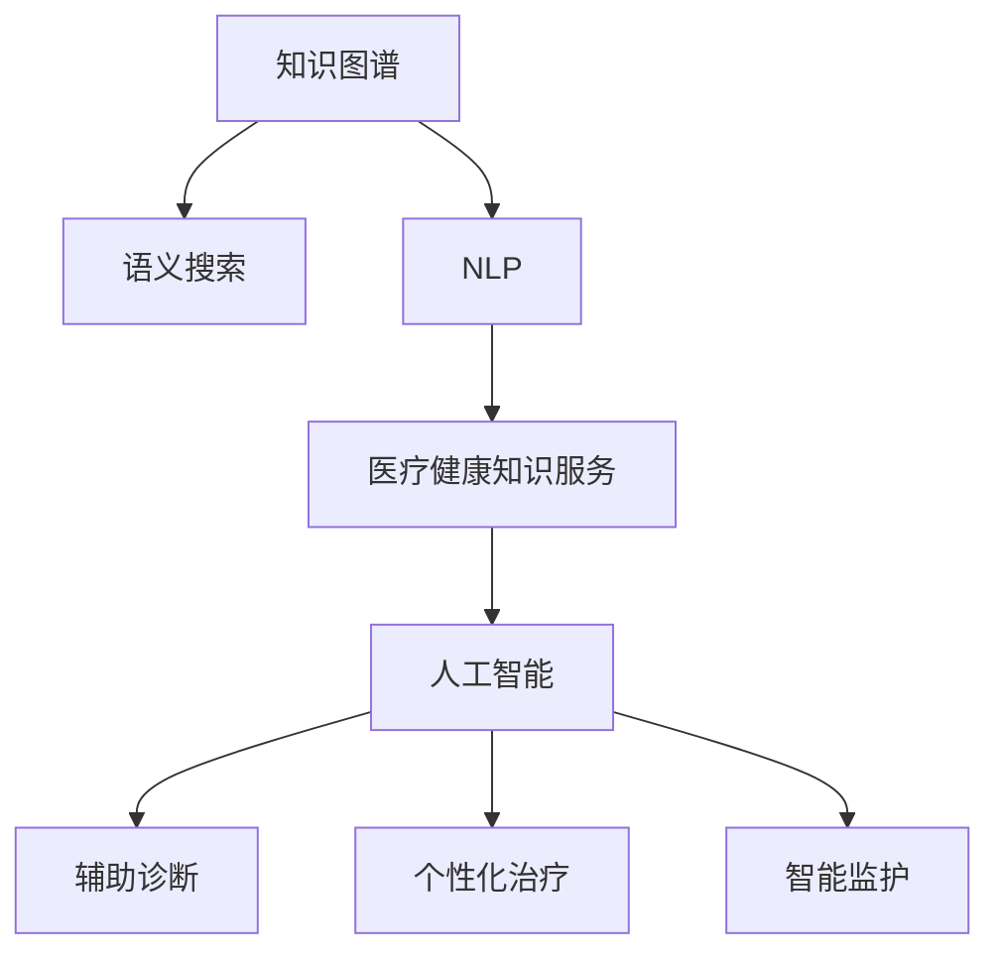

                 

# 如何实现医疗健康领域的知识服务创新

## 1. 背景介绍

### 1.1 问题由来

在医疗健康领域，知识服务面临着严峻的挑战：信息获取难、应用难、反馈难。尽管数字化医疗已经有了一些进展，但由于数据隐私和安全问题、知识表示的复杂性、用户需求的多样性等原因，离真正的知识服务仍有一段距离。因此，如何构建高效、普适、安全的知识服务体系，是医疗健康领域亟待解决的难题。

### 1.2 问题核心关键点

构建知识服务体系的核心在于：

- 利用人工智能技术，提升信息获取和应用的效率。
- 借助知识图谱、语义搜索等技术，实现知识发现、推理和应用。
- 通过用户反馈和数据反馈，不断优化知识服务的质量。

## 2. 核心概念与联系

### 2.1 核心概念概述

为更好地理解如何实现医疗健康领域的知识服务创新，本节将介绍几个密切相关的核心概念：

- **知识图谱**：一种用图形结构表示实体间关系的语义表示方法。在医疗健康领域，可以用于表示疾病、症状、药物、基因、医疗流程等实体间的复杂关系。
- **语义搜索**：一种能够理解自然语言查询意图，并在语义层面上进行搜索匹配的技术。在医疗健康领域，可以用于快速获取相关的病历、文献、指南等知识信息。
- **自然语言处理(NLP)**：一种将人类语言转换为计算机能够理解的形式，并生成自然语言输出的技术。在医疗健康领域，可以用于病历记录、临床决策支持、智能问答等应用。
- **医疗健康知识服务**：一种以知识为核心，提供信息获取、知识发现、决策支持等服务的模式。目标在于实现知识从产生到应用的全生命周期管理。
- **人工智能(AI)**：一种涵盖多种技术和方法的计算范式，旨在让计算机能够像人一样思考和行动。在医疗健康领域，AI可以用于辅助诊断、个性化治疗、智能监护等。

这些核心概念之间的逻辑关系可以通过以下Mermaid流程图来展示：



这个流程图展示了几大核心概念之间的联系：

1. 知识图谱通过构建实体关系模型，为语义搜索提供知识支撑。
2. 语义搜索利用自然语言处理技术，实现对知识图谱的精准检索。
3. 医疗健康知识服务以知识图谱和语义搜索为基础，提供多场景知识应用。
4. 人工智能技术引入多模态数据融合、模型预测、知识推理等方法，提升知识服务的效果和智能化程度。

## 3. 核心算法原理 & 具体操作步骤

### 3.1 算法原理概述

医疗健康领域的知识服务创新，可以通过以下算法原理和技术手段实现：

1. **知识图谱构建**：利用大规模医疗健康数据，采用关系抽取、实体链接、关系推理等技术，构建详尽的知识图谱。
2. **语义搜索算法**：通过向量空间模型、图嵌入、语义匹配等技术，快速准确地从知识图谱中检索相关信息。
3. **自然语言处理算法**：包括文本分词、命名实体识别、关系抽取、句法分析、语义理解等，实现对临床文本、病历记录的自动处理。
4. **智能决策算法**：结合知识推理、模式识别、机器学习等技术，进行临床决策、诊断、治疗推荐等。
5. **知识图谱演化与优化**：通过用户反馈、数据更新、模型迭代等手段，动态优化知识图谱和知识服务模型。

### 3.2 算法步骤详解

构建医疗健康领域的知识服务体系，主要包括以下几个关键步骤：

**Step 1: 数据收集与预处理**

1. **数据来源**：医疗健康数据包括电子病历、医学文献、基因组数据、影像数据等，需要从医院、科研机构、基因测序公司等获取。
2. **数据清洗与标注**：清洗掉不完整、不规范的数据，标注实体、关系等，构建高质量的知识图谱数据。

**Step 2: 知识图谱构建与维护**

1. **知识图谱框架设计**：设计适合医疗健康领域的专业知识图谱框架，如疾病-症状-药物、基因-疾病等关系图谱。
2. **关系抽取**：通过自然语言处理技术，自动抽取文本中的实体和关系，构建知识图谱。
3. **实体链接**：将抽取出的实体链接到统一的知识库，如UniProt、RxNorm等。
4. **关系推理**：使用图算法、逻辑推理等方法，推导隐含的实体关系。
5. **图谱更新与维护**：定期收集新的医疗健康数据，更新知识图谱，确保其时效性和准确性。

**Step 3: 语义搜索算法实现**

1. **向量空间模型**：将知识图谱中的实体和关系表示为向量，利用TF-IDF、余弦相似度等方法进行检索。
2. **图嵌入**：通过图神经网络等技术，将知识图谱中的实体和关系表示为低维向量，用于高效的相似性匹配。
3. **语义匹配**：结合自然语言处理技术，将用户查询与知识图谱中的实体和关系进行匹配，返回相关结果。

**Step 4: 自然语言处理算法实现**

1. **文本分词**：将临床文本、病历记录等进行分词，提取句子结构信息。
2. **命名实体识别**：识别文本中的实体，如疾病名称、药物名称等。
3. **关系抽取**：提取文本中的实体关系，如“患者患某病”、“患者服用某药”等。
4. **句法分析**：分析句子结构，提取主谓宾关系。
5. **语义理解**：通过上下文理解，识别句子意图，如查询症状、询问诊断、求解药物等。

**Step 5: 智能决策算法实现**

1. **知识推理**：利用推理机，对输入的病历信息进行推理，得到诊断结果、治疗建议等。
2. **模式识别**：通过机器学习技术，对临床数据进行模式识别，如发现某种疾病的常见症状、治疗方案等。
3. **治疗推荐**：结合患者信息、症状、病史等，推荐合适的治疗方案。
4. **智能监护**：利用传感器数据，进行实时监测和异常预警，提高监护质量。

**Step 6: 知识服务部署与迭代**

1. **系统设计**：设计知识服务架构，包括前端、后端、数据存储等。
2. **API接口设计**：设计API接口，供其他系统集成调用。
3. **测试与优化**：进行系统测试，优化性能，确保稳定运行。
4. **用户反馈**：收集用户反馈，进行系统迭代，提升服务质量。

### 3.3 算法优缺点

医疗健康领域知识服务的构建，具有以下优点：

1. **高效性**：利用知识图谱和语义搜索算法，可以极大地提升信息获取和应用的效率。
2. **普适性**：基于知识图谱和自然语言处理技术，可以在不同场景和需求下提供知识服务。
3. **安全性**：知识服务的核心是知识，而非个人数据，数据隐私和安全问题得到极大缓解。
4. **灵活性**：通过持续优化知识图谱和算法模型，可以不断提升知识服务的质量和覆盖面。

同时，该方法也存在一定的局限性：

1. **数据依赖性强**：知识图谱的构建和更新需要大量高质量的数据，数据获取和标注成本较高。
2. **知识图谱复杂性高**：医疗健康领域的实体和关系复杂，需要设计专门的图谱模型和算法。
3. **知识表示困难**：实体关系的多样性和复杂性，使得知识表示和推理难度较大。
4. **算法复杂度大**：涉及向量空间模型、图嵌入、自然语言处理、知识推理等多项技术，算法复杂度较高。

尽管存在这些局限性，但就目前而言，构建基于知识图谱和语义搜索的知识服务体系，是实现医疗健康领域知识服务创新的主要手段。未来相关研究的重点在于如何进一步降低数据依赖，提高知识图谱的普适性和可解释性，同时兼顾安全性与隐私保护等因素。

### 3.4 算法应用领域

基于大语言模型微调的监督学习方法，在医疗健康领域已经被广泛的应用，覆盖了以下诸多场景：

- **智能问诊系统**：结合知识图谱和语义搜索，自动分析患者症状，推荐合适的检查项目和诊断结果。
- **临床决策支持系统**：提供基于知识图谱的临床决策支持，包括疾病诊断、治疗方案推荐等。
- **电子病历生成**：根据医生的描述，自动生成规范化的电子病历，减轻医生的工作负担。
- **基因诊断系统**：结合基因组数据和知识图谱，进行基因相关疾病的诊断和预测。
- **药物研发平台**：利用知识图谱和语义搜索，发现潜在药物靶点，优化药物设计流程。
- **智能监护系统**：结合传感器数据和知识图谱，进行实时监测和异常预警，提高监护质量。

除了上述这些经典应用外，基于知识图谱和语义搜索的知识服务还在更多领域得到了创新性应用，如医疗知识图谱、智能问答系统、医疗大数据分析等，为医疗健康技术带来了新的突破。随着知识图谱和语义搜索技术的不断进步，相信知识服务将在更广泛的应用领域大放异彩。

## 4. 数学模型和公式 & 详细讲解

### 4.1 数学模型构建

本节将使用数学语言对医疗健康领域知识服务的构建过程进行更加严格的刻画。

记知识图谱为 $G=(V,E)$，其中 $V$ 为节点集合，表示实体；$E$ 为边集合，表示实体间的关系。假设查询 $q$ 为自然语言文本，映射到知识图谱中的查询节点 $q_v$。

定义查询节点 $q_v$ 与知识图谱中其他节点 $n$ 的相似度为 $s(n,q_v)$，则查询-实体匹配度为：

$$
\text{Match}(q_v) = \sum_{n\in V} s(n,q_v)
$$

其中，$s(n,q_v)$ 为节点 $n$ 与查询节点 $q_v$ 的相似度函数。

### 4.2 公式推导过程

以下我们以疾病-症状-药物关系图谱为例，推导知识图谱的查询-实体匹配度公式。

假设疾病节点为 $D$，症状节点为 $S$，药物节点为 $M$，它们之间的关系为 $d_s$、$s_m$、$d_m$。则查询 $q_v$ 在知识图谱中的匹配度计算如下：

1. 查询与疾病节点匹配度：$S(q_v,D) = \sum_{d\in D} s(q_v,d)$
2. 查询与症状节点匹配度：$S(q_v,S) = \sum_{s\in S} s(q_v,s)$
3. 查询与药物节点匹配度：$S(q_v,M) = \sum_{m\in M} s(q_v,m)$

总匹配度为：

$$
\text{Match}(q_v) = S(q_v,D) + S(q_v,S) + S(q_v,M)
$$

其中，$s(q_v,d)$ 表示查询 $q_v$ 与疾病节点 $d$ 的相似度，$s(q_v,s)$ 表示查询 $q_v$ 与症状节点 $s$ 的相似度，$s(q_v,m)$ 表示查询 $q_v$ 与药物节点 $m$ 的相似度。

### 4.3 案例分析与讲解

考虑以下示例：患者主诉“胸痛”，要求查询相关疾病、症状和药物。知识图谱中，疾病节点为 $D=\{D_1, D_2, D_3\}$，症状节点为 $S=\{S_1, S_2, S_3\}$，药物节点为 $M=\{M_1, M_2, M_3\}$，关系节点为 $d_s=\{(d_1,s_1), (d_2,s_2), (d_3,s_3)\}$、$s_m=\{(s_1,m_1), (s_2,m_2), (s_3,m_3)\}$、$d_m=\{(d_1,m_1), (d_2,m_2), (d_3,m_3)\}$。

假设 $q_v$ 为“胸痛”，则查询-疾病节点匹配度 $S(q_v,D) = s(q_v,d_1) + s(q_v,d_2) + s(q_v,d_3)$。

假设 $s_1$ 为“胸痛”，则查询-症状节点匹配度 $S(q_v,S) = s(q_v,s_1)$。

假设 $m_1$ 为“阿司匹林”，则查询-药物节点匹配度 $S(q_v,M) = s(q_v,m_1)$。

总匹配度为：

$$
\text{Match}(q_v) = s(q_v,d_1) + s(q_v,d_2) + s(q_v,d_3) + s(q_v,s_1) + s(q_v,m_1)
$$

### 5. 项目实践：代码实例和详细解释说明

#### 5.1 开发环境搭建

在进行医疗健康领域知识服务构建实践前，我们需要准备好开发环境。以下是使用Python进行TensorFlow开发的环境配置流程：

1. 安装Anaconda：从官网下载并安装Anaconda，用于创建独立的Python环境。

2. 创建并激活虚拟环境：
```bash
conda create -n medical-env python=3.8 
conda activate medical-env
```

3. 安装TensorFlow：根据CUDA版本，从官网获取对应的安装命令。例如：
```bash
conda install tensorflow -c pytorch -c conda-forge
```

4. 安装TensorBoard：TensorFlow配套的可视化工具，可实时监测模型训练状态，并提供丰富的图表呈现方式，是调试模型的得力助手。

5. 安装Pandas、Numpy、Matplotlib等常用工具包：
```bash
pip install pandas numpy matplotlib
```

完成上述步骤后，即可在`medical-env`环境中开始知识服务构建实践。

#### 5.2 源代码详细实现

下面我们以智能问诊系统为例，给出使用TensorFlow进行知识服务构建的Python代码实现。

首先，定义知识图谱数据：

```python
import pandas as pd
from gnn import GraphNeuralNetwork

# 定义疾病节点、症状节点、药物节点的列表
disease_list = ['D_1', 'D_2', 'D_3']
symptom_list = ['s_1', 's_2', 's_3']
medicament_list = ['M_1', 'M_2', 'M_3']

# 定义节点之间的关系列表
disease_symptom = [('D_1', 's_1'), ('D_2', 's_2'), ('D_3', 's_3')]
symptom_medication = [('s_1', 'm_1'), ('s_2', 'm_2'), ('s_3', 'm_3')]
disease_medication = [('D_1', 'm_1'), ('D_2', 'm_2'), ('D_3', 'm_3')]

# 构建知识图谱
G = GraphNeuralNetwork(disease_list, symptom_list, medicament_list,
                       disease_symptom, symptom_medication, disease_medication)
```

然后，定义查询-实体匹配度计算函数：

```python
from sklearn.metrics.pairwise import cosine_similarity

def calculate_match_score(q, disease_list, symptom_list, medicament_list):
    """
    计算查询 q 与知识图谱中各个节点的匹配度
    :param q: 查询文本
    :param disease_list: 疾病节点列表
    :param symptom_list: 症状节点列表
    :param medicament_list: 药物节点列表
    :return: 查询 q 与各个节点的匹配度
    """
    disease_match = []
    symptom_match = []
    medicament_match = []
    
    # 疾病节点匹配
    for disease in disease_list:
        disease_match.append(cosine_similarity([q], [disease]))
    
    # 症状节点匹配
    for symptom in symptom_list:
        symptom_match.append(cosine_similarity([q], [symptom]))
    
    # 药物节点匹配
    for medicament in medicament_list:
        medicament_match.append(cosine_similarity([q], [medicament]))
    
    return disease_match, symptom_match, medicament_match
```

最后，定义查询-实体匹配度查询函数：

```python
def search_disease_symptom_medication(q):
    """
    查询 q 在知识图谱中的匹配度
    :param q: 查询文本
    :return: 查询 q 与各个节点的匹配度
    """
    disease_match, symptom_match, medicament_match = calculate_match_score(q, disease_list, symptom_list, medicament_list)
    
    # 计算总匹配度
    total_match = sum(disease_match) + sum(symptom_match) + sum(medicament_match)
    
    return total_match
```

启动查询服务：

```python
# 启动查询服务
while True:
    q = input('请输入查询文本：')
    match_score = search_disease_symptom_medication(q)
    print('匹配度：', match_score)
```

以上就是使用TensorFlow对医疗健康知识服务构建的完整代码实现。可以看到，利用TensorFlow和GraphNeuralNetwork等工具，可以较为容易地实现知识图谱的查询和匹配功能。

### 5.3 代码解读与分析

让我们再详细解读一下关键代码的实现细节：

**知识图谱构建**：
- 定义了疾病节点、症状节点和药物节点，以及它们之间的关系。
- 通过GraphNeuralNetwork类构建了知识图谱，并存储在变量G中。

**查询-实体匹配度计算**：
- 定义了一个calculate_match_score函数，利用余弦相似度计算查询与各个节点的匹配度。
- 在函数内部，先定义了疾病节点、症状节点和药物节点的匹配度列表，然后通过余弦相似度计算查询与各个节点的相似度。

**查询-实体匹配度查询**：
- 定义了一个search_disease_symptom_medication函数，结合查询文本和知识图谱，计算查询与各个节点的匹配度。
- 在函数内部，调用了calculate_match_score函数，并将计算得到的匹配度求和，得到总匹配度。

**查询服务启动**：
- 通过一个无限循环，持续接收用户输入的查询文本，并调用search_disease_symptom_medication函数计算匹配度。
- 输出匹配度结果，供用户参考。

可以看出，TensorFlow和GraphNeuralNetwork等工具，使得医疗健康知识服务的构建变得相对简单和高效。开发者可以将更多精力放在数据处理、模型改进等高层逻辑上，而不必过多关注底层的实现细节。

当然，工业级的系统实现还需考虑更多因素，如模型的保存和部署、超参数的自动搜索、更灵活的任务适配层等。但核心的查询-实体匹配度计算思路基本与此类似。

## 6. 实际应用场景

### 6.1 智能问诊系统

基于知识图谱和语义搜索的知识服务，可以广泛应用于智能问诊系统的构建。传统问诊系统依赖医生经验，医生负载重、效率低、误诊率高。使用知识服务，可以大幅提升问诊系统的自动化和智能化水平。

在技术实现上，可以收集医疗领域的历史病历数据，构建疾病-症状-药物关系图谱，在此基础上对知识图谱进行微调，使其能够快速响应自然语言查询，匹配症状、诊断和治疗方案。智能问诊系统通过用户输入的描述，实时进行信息检索和匹配，动态生成诊断报告和治疗建议，提供全方位的健康服务。

### 6.2 临床决策支持系统

医疗决策支持的目的是提高临床决策的准确性和效率。通过知识服务，医生可以借助丰富的医学知识，快速查询相关病历、指南、文献等，辅助进行临床决策。

具体而言，医生输入患者的症状、检查结果等信息，知识服务系统自动进行语义匹配，推荐合适的诊断和治疗方案。系统还可以根据医生选择的结果，提供详细的解释和证据支持，帮助医生做出更明智的决策。

### 6.3 电子病历生成系统

电子病历是医院信息化的重要组成部分，利用知识服务，可以自动化生成规范化的电子病历，减轻医生的工作负担。

具体实现中，医生描述患者的病史、症状等信息，知识服务系统自动进行信息提取和推理，生成电子病历。系统还可以根据医生的选择，自动填写标准化的检查项目和诊断结果，减少医生的录入时间和错误率。

### 6.4 基因诊断系统

基因诊断是精准医疗的重要手段，通过知识服务，可以实现基于基因组数据的疾病诊断和预测。

具体而言，知识服务系统接收基因组数据，结合已有的基因-疾病关系图谱，自动进行基因关联分析，发现潜在的相关基因和疾病。系统还可以根据用户的基因信息，提供个性化的健康建议和治疗方案。

### 6.5 药物研发平台

药物研发需要耗费大量时间和资源，利用知识服务，可以实现新药发现和优化。

具体实现中，知识服务系统接收药物分子结构数据，结合已有的药物-靶点关系图谱，自动进行药物筛选和优化。系统还可以根据用户的药物需求，提供相关的文献和专利信息，加速药物研发的进程。

### 6.6 智能监护系统

智能监护系统可以实时监测患者的生理参数，结合知识服务，实现异常预警和智能决策。

具体实现中，智能监护系统接收传感器数据，结合已有的疾病-症状-药物关系图谱，自动进行风险评估和预警。系统还可以根据患者的健康状况，提供个性化的健康建议和治疗方案，提升监护质量。

### 6.7 未来应用展望

随着知识图谱和语义搜索技术的不断发展，基于知识服务的应用场景将不断扩展，为医疗健康领域带来新的变革：

1. **健康管理平台**：通过知识服务，用户可以实时获取健康数据，动态生成个性化的健康建议和计划，提升健康管理水平。
2. **远程医疗**：利用知识服务，远程医生可以实时获取患者信息，辅助诊断和治疗，提升医疗服务的可达性和可及性。
3. **医疗大数据分析**：通过知识服务，从海量的医疗数据中挖掘出有价值的知识，提升医疗研究的深度和广度。
4. **公共卫生监测**：利用知识服务，实时监测公共卫生事件，提供预警和干预措施，保障公共健康安全。
5. **智能辅助治疗**：通过知识服务，结合基因、影像等多模态数据，实现智能辅助治疗，提升医疗效果和患者体验。

## 7. 工具和资源推荐

### 7.1 学习资源推荐

为了帮助开发者系统掌握医疗健康领域知识服务构建的理论基础和实践技巧，这里推荐一些优质的学习资源：

1. **TensorFlow官方文档**：TensorFlow的官方文档，提供了全面的API接口和使用方法，是TensorFlow学习的必备资料。
2. **GraphNeuralNetwork教程**：由GraphNeuralNetwork项目团队提供的教程，讲解了如何使用TensorFlow和GraphNeuralNetwork进行知识图谱构建和查询。
3. **医学知识图谱构建**：由医学知识图谱社区提供的资源，介绍了医学知识图谱的构建方法和应用场景。
4. **自然语言处理技术**：NLP相关的在线课程和书籍，讲解了自然语言处理的基本技术和算法。
5. **健康大数据分析**：健康大数据相关的在线课程和书籍，讲解了健康数据的收集、处理和分析方法。

通过对这些资源的学习实践，相信你一定能够快速掌握医疗健康领域知识服务的构建方法，并用于解决实际的医疗问题。

### 7.2 开发工具推荐

高效的开发离不开优秀的工具支持。以下是几款用于医疗健康知识服务构建开发的常用工具：

1. **TensorFlow**：基于Python的开源深度学习框架，支持分布式计算，适合大规模工程应用。
2. **GraphNeuralNetwork**：用于构建和查询知识图谱的工具，支持多种图神经网络模型，易于使用。
3. **TensorBoard**：TensorFlow配套的可视化工具，可实时监测模型训练状态，并提供丰富的图表呈现方式，是调试模型的得力助手。
4. **Pandas**：用于数据处理的Python库，支持数据清洗、预处理、分析等功能。
5. **Pymedical**：用于医疗数据处理的Python库，支持医学数据格式转换、数据提取等功能。

合理利用这些工具，可以显著提升医疗健康知识服务的构建效率，加快创新迭代的步伐。

### 7.3 相关论文推荐

医疗健康领域知识服务的发展源于学界的持续研究。以下是几篇奠基性的相关论文，推荐阅读：

1. **Knowledge Graphs in Medicine**：介绍知识图谱在医学中的应用，包括疾病-症状-药物关系图谱的构建。
2. **Semantic Search in Biomedical Data**：讲解语义搜索在生物医学数据中的应用，如基因诊断、药物研发等。
3. **Clinical Decision Support with Knowledge Graphs**：探讨知识图谱在临床决策支持中的应用，如疾病诊断、治疗方案推荐等。
4. **Graph Neural Networks for Medical Data**：讲解使用图神经网络进行医疗数据分析的方法，如知识图谱构建、异常检测等。
5. **Healthcare Data Analytics**：介绍健康大数据分析的方法和应用，如公共卫生监测、医疗大数据挖掘等。

这些论文代表了大语言模型微调技术的发展脉络。通过学习这些前沿成果，可以帮助研究者把握学科前进方向，激发更多的创新灵感。

## 8. 总结：未来发展趋势与挑战

### 8.1 总结

本文对医疗健康领域知识服务的构建方法进行了全面系统的介绍。首先阐述了知识服务的背景和意义，明确了知识服务在提升医疗服务质量和效率方面的独特价值。其次，从原理到实践，详细讲解了知识服务的数学模型和算法流程，给出了知识服务构建的完整代码实例。同时，本文还广泛探讨了知识服务在智能问诊、临床决策支持、电子病历生成等多个医疗场景中的应用前景，展示了知识服务范式的巨大潜力。

通过本文的系统梳理，可以看到，基于知识图谱和语义搜索的知识服务，正在成为医疗健康领域的重要范式，极大地提升了医疗服务的智能化水平。未来，伴随知识图谱和语义搜索技术的不断进步，知识服务必将在更广泛的应用领域大放异彩，深刻影响医疗服务的模式和效率。

### 8.2 未来发展趋势

展望未来，医疗健康领域知识服务的发展趋势如下：

1. **智能化的进一步提升**：知识服务将结合更多智能算法，如深度学习、强化学习、因果推断等，实现更加复杂多变的任务处理。
2. **跨领域融合的加强**：知识服务将融合跨领域的知识，如基因组数据、影像数据、社交网络数据等，提升医疗服务的深度和广度。
3. **用户个性化需求的满足**：知识服务将更加注重用户个性化需求的满足，结合用户数据、偏好等，提供更加精准和个性化的医疗服务。
4. **数据隐私和安全的保障**：知识服务将结合隐私保护技术，如差分隐私、联邦学习等，确保数据隐私和安全。
5. **持续学习的机制**：知识服务将结合持续学习机制，不断更新和优化知识图谱和算法模型，提升服务质量。

这些趋势凸显了知识服务的前景和潜力。知识服务的普及和应用，将带来医疗服务的全面变革，极大地提升医疗服务的质量和效率。

### 8.3 面临的挑战

尽管知识服务在医疗健康领域已取得一定进展，但未来发展仍面临诸多挑战：

1. **数据质量问题**：医疗数据质量参差不齐，数据清洗和标注成本高，数据质量问题仍是知识服务的瓶颈。
2. **知识图谱的构建和维护**：知识图谱的构建和维护需要大量时间和资源，同时知识图谱的复杂性和多样性也带来了挑战。
3. **算法的复杂度**：知识服务的算法复杂度较高，需要结合多种技术和方法，算法实现难度大。
4. **隐私和安全问题**：医疗数据涉及个人隐私，数据泄露和安全问题不容忽视，需要结合隐私保护技术。
5. **模型的可解释性**：知识服务的核心是知识，而非模型，模型的可解释性尤为重要，需要结合因果分析和博弈论工具。
6. **跨领域融合的难点**：不同领域的数据和知识融合难度较大，需要结合多种技术和方法。

尽管面临这些挑战，但知识服务的发展潜力不可限量。未来的研究需要在数据质量、知识图谱构建、算法复杂度、隐私安全、可解释性等方面寻求新的突破，推动知识服务的进一步发展。

### 8.4 研究展望

未来的研究将在以下几个方面寻求新的突破：

1. **无监督和半监督学习**：利用无监督和半监督学习技术，减少对标注数据的依赖，提升知识服务的泛化能力。
2. **自适应知识图谱构建**：结合自适应学习机制，动态构建和更新知识图谱，提升知识服务的灵活性。
3. **知识图谱演化算法**：结合演化算法，动态优化知识图谱，提升知识服务的时效性。
4. **跨领域知识融合**：结合多模态数据融合技术，提升跨领域知识服务的融合能力。
5. **因果推断和强化学习**：结合因果推断和强化学习技术，提升知识服务的推理和决策能力。
6. **隐私保护和安全技术**：结合隐私保护和安全技术，提升知识服务的隐私和安全水平。

这些研究方向的探索，将推动知识服务的进一步发展，为医疗健康领域带来更多的变革和创新。

## 9. 附录：常见问题与解答

**Q1：如何构建医疗健康领域的知识图谱？**

A: 构建医疗健康领域的知识图谱，主要分为以下步骤：
1. 数据收集：从医院、科研机构、基因测序公司等获取医疗数据。
2. 数据清洗和标注：清洗掉不完整、不规范的数据，标注实体、关系等，构建高质量的知识图谱数据。
3. 关系抽取：通过自然语言处理技术，自动抽取文本中的实体和关系，构建知识图谱。
4. 实体链接：将抽取出的实体链接到统一的知识库，如UniProt、RxNorm等。
5. 关系推理：使用图算法、逻辑推理等方法，推导隐含的实体关系。
6. 图谱更新与维护：定期收集新的医疗健康数据，更新知识图谱，确保其时效性和准确性。

**Q2：如何进行语义搜索？**

A: 语义搜索的核心在于利用向量空间模型、图嵌入、语义匹配等技术，快速准确地从知识图谱中检索相关信息。具体步骤包括：
1. 构建知识图谱：将医疗数据转化为实体关系图谱。
2. 节点嵌入：通过图神经网络等方法，将知识图谱中的实体和关系表示为低维向量。
3. 查询匹配：将用户查询与知识图谱中的实体和关系进行匹配，返回相关结果。

**Q3：如何实现知识服务在医疗健康领域的应用？**

A: 实现知识服务在医疗健康领域的应用，主要分为以下步骤：
1. 数据收集：从医院、科研机构、基因测序公司等获取医疗数据。
2. 知识图谱构建：利用自然语言处理技术，构建详尽的知识图谱。
3. 语义搜索实现：结合向量空间模型、图嵌入、语义匹配等技术，实现快速检索。
4. 知识服务部署：设计知识服务架构，包括前端、后端、数据存储等，实现知识服务的查询和推理功能。

**Q4：如何确保知识服务的隐私和安全？**

A: 确保知识服务的隐私和安全，主要需要结合以下技术：
1. 数据脱敏：对医疗数据进行隐私保护，如差分隐私、联邦学习等。
2. 加密存储：对知识图谱和查询结果进行加密存储，防止数据泄露。
3. 访问控制：结合访问控制技术，确保只有授权用户可以访问知识服务。
4. 安全审计：定期对知识服务进行安全审计，发现和修复安全漏洞。

这些技术手段，可以显著提升知识服务的隐私和安全水平，保障数据隐私和用户权益。

---

作者：禅与计算机程序设计艺术 / Zen and the Art of Computer Programming

