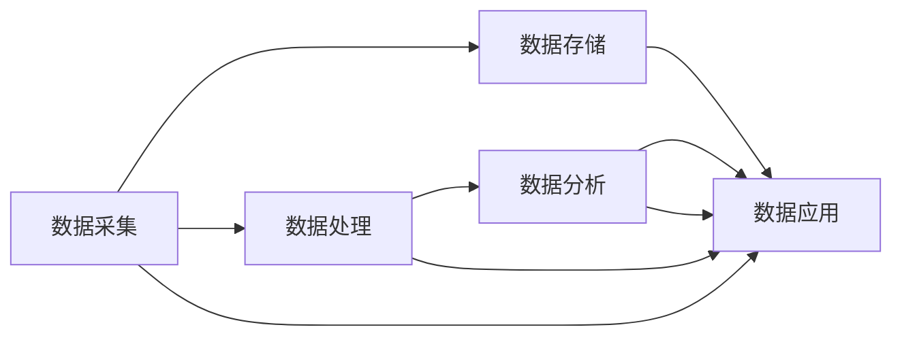

                 

# 平台经济的数据化：数据驱动平台的运营和发展

## 1. 背景介绍

### 1.1 问题由来
在数字化浪潮的推动下，平台经济已成为全球经济的重要组成部分。平台作为连接供需双方、提供价值交换的中介，其运营和发展日益依赖于数据驱动的决策。然而，数据化运营并非易事。如何从海量数据中提取有价值的信息，如何利用数据优化平台策略，如何确保数据隐私和安全性，是平台经济数据化面临的主要挑战。本文旨在系统介绍平台经济的数据化过程，探讨如何通过数据驱动平台的运营和发展，实现平台效益最大化。

### 1.2 问题核心关键点
平台经济的数据化涉及多个关键环节，包括数据采集、存储、处理、分析和应用。本文将重点关注以下关键点：
- 数据采集：如何高效、全面地采集用户行为数据和市场数据。
- 数据存储：如何安全、可靠地存储和管理大规模数据。
- 数据处理：如何利用先进的数据处理技术，提升数据质量。
- 数据分析：如何通过机器学习、深度学习等技术，提取数据中的深层次信息。
- 数据应用：如何将数据洞察转化为平台运营决策，提升平台效能。

### 1.3 问题研究意义
数据驱动的运营决策已成为平台经济竞争的关键要素。通过数据化运营，平台能够实现：
- 提升用户满意度和忠诚度。通过个性化推荐、精准营销等策略，提升用户体验。
- 优化资源配置。通过预测分析、负载均衡等方法，实现资源的最优配置。
- 降低运营成本。通过自动化流程、智能客服等技术，减少人工干预和成本。
- 应对市场变化。通过实时数据分析，灵活调整策略，应对市场波动。
- 提升平台竞争力。通过数据洞察，发现新商机，开拓新市场。

## 2. 核心概念与联系

### 2.1 核心概念概述
在探讨平台经济数据化的过程中，涉及多个核心概念，这些概念之间的关系可以通过以下Mermaid流程图进行展示：



这个流程图展示了平台经济数据化的核心流程：从数据采集到数据应用的全过程。

- **数据采集**：指从多个来源收集用户行为、市场变化等数据的过程。
- **数据存储**：指通过可靠的技术手段，将数据安全、高效地存储起来，以供后续分析和使用。
- **数据处理**：指利用先进的数据处理技术，提升数据质量，挖掘数据价值。
- **数据分析**：指通过机器学习、深度学习等算法，对数据进行深入分析，提取深层次信息。
- **数据应用**：指将数据分析结果转化为实际的运营决策，提升平台效益。

这些概念之间相互联系，共同构成了平台经济数据化的整体框架。

## 3. 核心算法原理 & 具体操作步骤
### 3.1 算法原理概述
平台经济的数据化过程基于数据驱动的决策模型，其核心算法包括：

- **回归分析**：用于分析变量之间的线性关系，预测市场趋势。
- **聚类分析**：用于将数据分成若干组，发现数据中的模式。
- **分类算法**：用于预测数据的分类，如用户行为分类。
- **关联规则学习**：用于挖掘数据中的关联关系，如购物篮分析。
- **时间序列分析**：用于预测未来的数据趋势，如流量预测。

这些算法通过组合和迭代，可以实现对数据的深度挖掘和应用。

### 3.2 算法步骤详解
平台经济的数据化通常包括以下几个关键步骤：

**Step 1: 数据采集**
- 定义数据采集目标，明确需要采集的数据类型和来源。
- 搭建数据采集系统，自动从网站、APP、第三方接口等采集数据。

**Step 2: 数据存储**
- 选择合适的数据存储方案，如关系型数据库、NoSQL数据库等。
- 设计数据表结构，保证数据的完整性和一致性。

**Step 3: 数据处理**
- 清洗数据，去除无效、重复、错误的数据。
- 数据预处理，如归一化、标准化、特征工程等。
- 数据集成，将不同来源的数据进行整合。

**Step 4: 数据分析**
- 选择合适的分析工具，如Pandas、R、Python等。
- 设计分析模型，如回归模型、聚类模型、分类模型等。
- 进行模型训练和评估，优化模型性能。

**Step 5: 数据应用**
- 将分析结果转化为业务决策，如产品推荐、价格调整、库存管理等。
- 实时监控数据，调整模型参数，提升决策效果。
- 定期评估效果，优化数据化运营流程。

### 3.3 算法优缺点
平台经济的数据化算法具有以下优点：
- 提升决策效率：数据驱动的决策模型能够快速响应市场变化，提升决策效率。
- 优化资源配置：通过对数据的深入分析，实现资源的精准配置，降低运营成本。
- 增强竞争力：数据洞察能够帮助平台发现新商机，开拓新市场，提升竞争力。

同时，这些算法也存在一定的局限性：
- 数据质量依赖：算法的输出结果高度依赖于数据质量，数据的准确性和完整性直接影响分析结果。
- 算法复杂度高：复杂的数据分析模型需要大量计算资源，处理大规模数据时效率较低。
- 模型黑箱问题：部分高级算法模型难以解释其内部工作机制，不易理解和调试。
- 数据隐私风险：数据的采集和存储可能涉及用户隐私，如何保护数据隐私是关键问题。

### 3.4 算法应用领域
平台经济的数据化算法广泛应用于多个领域，包括：

- **电商平台**：通过数据分析，优化商品推荐、库存管理、价格调整等策略，提升用户体验和平台收益。
- **金融平台**：通过预测分析，预测市场趋势、风险控制、用户行为等，提升金融产品的风险管理和客户服务。
- **社交平台**：通过数据分析，优化内容推荐、广告投放、用户画像等，提升平台活跃度和用户粘性。
- **物流平台**：通过实时数据分析，优化物流路线、仓库管理、配送调度等，提升物流效率和服务质量。
- **旅游平台**：通过数据分析，优化旅游产品推荐、预订流程、用户行为分析等，提升平台体验和收益。

## 4. 数学模型和公式 & 详细讲解 & 举例说明
### 4.1 数学模型构建
平台经济的数据化通常基于以下数学模型：

- **线性回归模型**：用于预测市场趋势，公式为 $\hat{y} = \beta_0 + \beta_1 x_1 + \beta_2 x_2 + \cdots + \beta_p x_p$。
- **决策树模型**：用于分类分析，公式为 $T = (R, S, T_{left}, T_{right})$。
- **随机森林模型**：用于提升决策树模型的泛化能力，公式为 $F = \frac{1}{m} \sum_{i=1}^m T_i$。
- **支持向量机模型**：用于分类和回归分析，公式为 $w = \sum_{i=1}^n \alpha_i y_i x_i$。

### 4.2 公式推导过程
以线性回归模型为例，推导其基本公式：

设训练集为 $\{(x_1, y_1), (x_2, y_2), \cdots, (x_n, y_n)\}$，其中 $x_i$ 为输入特征向量，$y_i$ 为输出标签。根据最小二乘法，线性回归模型的参数 $\beta_0, \beta_1, \cdots, \beta_p$ 可以通过以下公式求解：

$$
\hat{\beta} = \mathop{\arg\min}_{\beta} \sum_{i=1}^n (y_i - \hat{y}_i)^2
$$

其中 $\hat{y}_i = \beta_0 + \beta_1 x_{1i} + \beta_2 x_{2i} + \cdots + \beta_p x_{pi}$。

### 4.3 案例分析与讲解
以电商平台的用户行为分析为例，假设电商平台有用户行为数据 $\{(x_1, y_1), (x_2, y_2), \cdots, (x_n, y_n)\}$，其中 $x_i$ 为用户的行为特征（如浏览时间、点击率、购买记录等），$y_i$ 为用户的购买决策（0或1）。使用线性回归模型进行用户行为预测，公式为：

$$
\hat{y} = \beta_0 + \beta_1 x_{1i} + \beta_2 x_{2i} + \cdots + \beta_p x_{pi}
$$

通过训练模型，可以预测新用户的购买概率，从而进行个性化推荐和精准营销。

## 5. 项目实践：代码实例和详细解释说明
### 5.1 开发环境搭建
在进行平台经济的数据化实践前，需要搭建好开发环境。以下是在Python环境下搭建开发环境的步骤：

1. 安装Python：从官网下载并安装最新版本的Python。
2. 安装Pandas、NumPy、Scikit-learn等数据处理库：
```bash
pip install pandas numpy scikit-learn
```
3. 安装TensorFlow、PyTorch等机器学习库：
```bash
pip install tensorflow pytorch
```
4. 安装Jupyter Notebook：用于编写和运行Python代码：
```bash
pip install jupyter notebook
```

### 5.2 源代码详细实现

以下是一个使用Python进行电商用户行为分析的代码实现示例：

```python
import pandas as pd
from sklearn.linear_model import LinearRegression

# 加载用户行为数据
data = pd.read_csv('user_behavior.csv')

# 定义特征和标签
features = ['浏览时间', '点击率', '购买记录']
target = '购买决策'

# 数据预处理
data = data.dropna()
data = data[features + [target]]

# 划分训练集和测试集
train_data = data.sample(frac=0.8, random_state=42)
test_data = data.drop(train_data.index)

# 训练模型
model = LinearRegression()
model.fit(train_data[features], train_data[target])

# 预测和评估
y_pred = model.predict(test_data[features])
print(classification_report(test_data[target], y_pred))
```

### 5.3 代码解读与分析
- `pd.read_csv('user_behavior.csv')`：读取用户行为数据文件。
- `data.sample(frac=0.8, random_state=42)`：随机划分训练集和测试集，比例为80%和20%。
- `model.fit(train_data[features], train_data[target])`：训练线性回归模型。
- `y_pred = model.predict(test_data[features])`：使用模型进行预测。
- `classification_report(test_data[target], y_pred)`：评估模型预测结果。

### 5.4 运行结果展示
运行上述代码，将输出模型的评估结果，包括准确率、召回率、F1值等指标，用于评估模型的性能。

## 6. 实际应用场景
### 6.1 智能推荐系统
智能推荐系统是平台经济中应用最广泛的数据化场景之一。通过分析用户行为数据，推荐系统能够为用户推荐最符合其兴趣的商品，提升用户体验和平台收益。

### 6.2 风险管理与预警
金融平台通过实时分析市场数据和用户行为，能够及时发现异常交易和风险信号，采取有效的风险管理措施，保障平台安全。

### 6.3 用户画像与个性化服务
社交平台通过分析用户行为数据，构建用户画像，提供个性化的内容推荐和广告投放，提升用户粘性和平台收益。

### 6.4 供应链优化
物流平台通过实时数据分析，优化仓储和配送策略，提升物流效率和用户体验。

## 7. 工具和资源推荐
### 7.1 学习资源推荐
为了帮助开发者系统掌握平台经济数据化的理论基础和实践技巧，以下是一些优质的学习资源：

1. 《机器学习实战》：由机器学习专家撰写，涵盖机器学习算法的基本概念和实现细节。
2. 《Python数据科学手册》：全面介绍了Python在数据科学中的应用，包括数据采集、处理、分析等。
3. 《深度学习入门》：讲解深度学习的基本原理和应用场景，适合初学者入门。
4. Kaggle竞赛：通过参与实际的Kaggle竞赛，积累实战经验，提升数据处理和模型训练技能。

### 7.2 开发工具推荐
以下是几款用于平台经济数据化开发的常用工具：

1. Jupyter Notebook：用于编写和运行Python代码，支持数据可视化、代码调试等功能。
2. PyCharm：一款功能强大的Python IDE，提供代码自动补全、调试器、版本控制等功能。
3. Apache Spark：用于处理大规模数据，支持分布式计算和实时流处理。
4. Apache Flink：适用于低延迟、高吞吐量的数据处理场景，支持流式处理和批处理。
5. Elasticsearch：用于大规模文档存储和搜索，支持分布式架构和实时索引。

### 7.3 相关论文推荐
以下是几篇奠基性的相关论文，推荐阅读：

1. 《Google Scholar: A System for Large-Scale Machine Learning at Google》：介绍了Google Scholar系统在数据驱动搜索中的应用。
2. 《The Google PageRank Algorithm》：讲述了Google PageRank算法的核心原理和应用。
3. 《Platform Economics》：探讨了平台经济的基本概念和运营策略，提供理论基础。

## 8. 总结：未来发展趋势与挑战
### 8.1 研究成果总结
本文系统介绍了平台经济的数据化过程，探讨了数据采集、存储、处理、分析和应用的全流程。通过数据驱动的运营决策，平台能够提升用户体验、优化资源配置、降低运营成本、应对市场变化和提升平台竞争力。

### 8.2 未来发展趋势
展望未来，平台经济的数据化将呈现以下几个发展趋势：

1. 数据采集自动化：随着物联网和人工智能技术的发展，数据采集将更加自动化、智能化，采集的数据类型将更加丰富。
2. 数据分析实时化：实时数据分析将广泛应用于智能推荐、风险管理等领域，提升决策效率和响应速度。
3. 数据应用智能化：智能算法和AI技术将进一步应用于数据分析，提升决策的智能化和自动化水平。
4. 数据隐私保护：随着数据隐私保护意识的提升，如何保护用户数据隐私将是未来数据化运营的重要课题。
5. 数据伦理规范：平台经济的数据化运营需要遵循数据伦理规范，确保数据使用的透明性和公正性。

### 8.3 面临的挑战
平台经济的数据化面临以下挑战：

1. 数据质量和完整性：平台需要保证数据的准确性和完整性，确保分析结果的可靠性。
2. 数据安全和隐私：数据采集和存储过程中需要确保用户数据的安全和隐私，避免数据泄露和滥用。
3. 数据应用复杂度：复杂的算法模型需要大量计算资源，如何提升模型训练和推理的效率是关键问题。
4. 数据化运营成本：平台需要投入大量资源进行数据化运营，如何降低运营成本是重要课题。
5. 算法透明度和可解释性：高级算法模型的内部工作机制难以解释，如何提升算法的透明度和可解释性是未来挑战。

### 8.4 研究展望
未来的研究需要在以下几个方面寻求新的突破：

1. 自动化数据采集：利用物联网和人工智能技术，实现数据采集的自动化和智能化。
2. 实时数据分析：通过分布式计算和流处理技术，实现数据的实时分析和处理。
3. 数据隐私保护：引入区块链和隐私计算技术，保护用户数据隐私。
4. 数据伦理规范：制定数据伦理规范，确保数据使用的透明性和公正性。
5. 智能算法开发：开发更加高效、智能的算法模型，提升数据化运营的效率和效果。

## 9. 附录：常见问题与解答

**Q1: 数据采集自动化有哪些技术手段？**

A: 数据采集自动化通常利用爬虫技术、API接口、传感器等手段，实现数据的实时采集和更新。爬虫技术能够从网页上自动提取数据，API接口能够从第三方平台获取数据，传感器能够从物联网设备中获取实时数据。

**Q2: 如何保证数据安全和隐私？**

A: 保证数据安全和隐私需要采用多种手段，包括数据加密、访问控制、匿名化处理等。数据加密能够保护数据在传输和存储过程中的安全，访问控制能够限制数据的访问权限，匿名化处理能够保护用户隐私。

**Q3: 如何提升数据应用效率？**

A: 提升数据应用效率需要优化算法模型，采用分布式计算和流处理技术，以及数据压缩和缓存等手段。优化算法模型能够提高计算效率，分布式计算和流处理技术能够处理大规模数据，数据压缩和缓存能够减少数据传输和存储的开销。

**Q4: 数据化运营的投入产出比如何衡量？**

A: 数据化运营的投入产出比通常通过ROI（投资回报率）、ROAS（广告支出回报率）、CAC（用户获取成本）等指标进行衡量。ROI和ROAS能够评估数据化运营的经济效益，CAC能够评估数据化运营的用户获取成本。

**Q5: 平台经济的数据化运营有哪些成功案例？**

A: 平台经济的数据化运营有很多成功案例，如亚马逊的推荐系统、阿里巴巴的实时数据分析、滴滴出行的智能调度等。这些案例展示了数据化运营在提升用户体验、优化资源配置、降低运营成本等方面的巨大潜力。

---

作者：禅与计算机程序设计艺术 / Zen and the Art of Computer Programming

