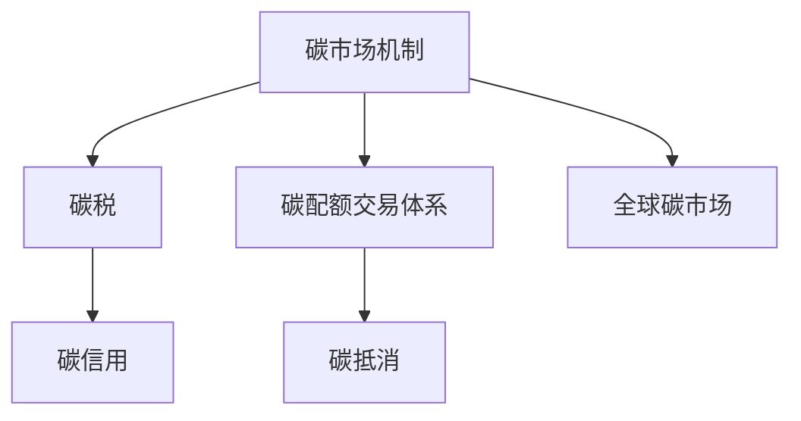

                 

## 1. 背景介绍

### 1.1 问题由来

全球气候变化是当今世界面临的最严峻挑战之一。温室气体排放导致的全球变暖不仅威胁着生态系统和人类的健康，还可能引发极端气候事件和自然灾害，严重影响全球经济的可持续发展。在2015年的《巴黎协定》中，各国承诺通过一系列措施实现将全球温度升幅控制在2℃以下，并努力限制在1.5℃以内。

为实现减排目标，国际社会普遍认为碳市场机制是一种高效、透明、可控的手段。通过市场机制，不仅能够实现减排目标，还能为环境治理筹集资金，推动绿色技术的发展和应用。然而，传统的碳税和排放交易体系（Cap-and-Trade）也存在不少问题和挑战。碳税虽然在环境保护方面有显著效果，但会导致经济效率下降，企业和消费者负担加重。排放交易体系则存在市场操纵、配额分配不公等问题，亟需创新。

因此，探索新的碳市场机制，特别是在“2050年”这样一个重要的时间节点，对全球气候治理具有重要意义。本文将探讨2050年全球减排的关键机制，包括碳税和碳配额交易体系，并在此基础上提出创新的碳市场机制，以期为全球气候治理提供新思路。

### 1.2 问题核心关键点

本文将围绕以下几个核心问题展开：

- 2050年全球减排的现状与目标
- 碳税和碳配额交易体系的原理与优缺点
- 新的碳市场机制的设计思路
- 全球气候治理的未来发展趋势

## 2. 核心概念与联系

### 2.1 核心概念概述

为更好地理解2050年全球减排的关键机制，本节将介绍几个密切相关的核心概念：

- **碳市场机制（Carbon Market Mechanism）**：通过市场手段实现碳排放权交易的机制。通常包括碳税、碳配额交易体系等。

- **碳税（Carbon Tax）**：对企业的碳排放征收的税费，以激励企业减少排放。碳税可增加企业成本，促使企业转向更清洁的能源和技术。

- **碳配额交易体系（Cap-and-Trade System）**：通过设定总碳排放上限（Cap），发放配额给企业，并允许企业间买卖配额以实现减排目标。企业可以通过内部减排或购买配额来满足减排要求。

- **碳抵消（Carbon Offset）**：通过投资减排项目，如植树造林、节能改造等，获得减排量。企业可以通过购买碳抵消来实现部分减排目标。

- **碳信用（Carbon Credit）**：碳抵消的度量标准。通过验证和认证后，可转化为碳信用。

- **全球碳市场（Global Carbon Market）**：实现跨国界的碳交易和价格发现。可提高减排效率和资金筹集。

这些核心概念之间的逻辑关系可以通过以下Mermaid流程图来展示：



这个流程图展示了几大碳市场机制的相互联系：

1. 碳税是碳市场机制的一种形式，通过增加成本来降低碳排放。
2. 碳配额交易体系设定总排放上限，并发放配额，允许企业买卖配额。
3. 碳抵消通过投资减排项目获取减排量，企业可通过购买碳抵消来实现部分减排目标。
4. 碳信用的存在将碳抵消标准化，便于交易。
5. 全球碳市场实现跨国界的碳交易和价格发现，提高减排效率和资金筹集。

这些概念共同构成了2050年全球减排的重要框架，为我们探讨新的碳市场机制提供了基础。

## 3. 核心算法原理 & 具体操作步骤
### 3.1 算法原理概述

2050年全球减排的关键机制包括碳税和碳配额交易体系。其中，碳税和碳配额交易体系是通过市场机制实现减排的重要手段，其原理与操作步骤如下：

#### 3.1.1 碳税原理

碳税是一种通过增加排放成本来激励企业减少碳排放的机制。碳税的计算公式为：

$$ \text{碳税} = \text{排放量} \times \text{碳税率} $$

企业通过增加碳税成本来减少碳排放，从而实现减排目标。碳税率可根据经济和社会效益调整，通常设定在每吨二氧化碳排放0.5美元到100美元不等。

#### 3.1.2 碳配额交易体系原理

碳配额交易体系通过设定总排放上限（Cap），发放配额给企业，并允许企业间买卖配额来实现减排目标。其计算公式为：

$$ \text{碳配额} = \text{总排放量} \div \text{企业数量} $$

企业通过内部减排或购买配额来满足减排要求。配额交易市场在政府监管下运行，配额价格受供需关系影响。

### 3.2 算法步骤详解

#### 3.2.1 碳税操作步骤

1. **设定碳税率**：根据经济和社会效益设定碳税率。
2. **测量排放量**：企业定期测量排放量，上报给政府。
3. **计算碳税**：根据排放量和碳税率计算企业应缴纳的碳税。
4. **缴纳税款**：企业缴纳碳税。
5. **减排激励**：通过税收优惠、补贴等激励企业采用清洁能源和技术。

#### 3.2.2 碳配额交易体系操作步骤

1. **设定总排放量上限**：政府设定总排放量上限（Cap）。
2. **发放配额**：根据总排放量上限发放配额。
3. **交易配额**：企业间买卖配额，以满足减排要求。
4. **政府监督**：政府监督配额交易，确保市场公平公正。
5. **调整上限**：根据减排进展和碳价格调整总排放量上限。

### 3.3 算法优缺点

#### 3.3.1 碳税优缺点

- **优点**：
  - 激励企业采用清洁能源和技术。
  - 提高企业环境意识，促进可持续发展。
  - 简单易行，透明度高。

- **缺点**：
  - 增加企业成本，可能导致经济效率下降。
  - 对低收入家庭影响较大。
  - 碳税率设定困难，影响政策效果。

#### 3.3.2 碳配额交易体系优缺点

- **优点**：
  - 企业可自由选择减排方式，更灵活。
  - 促进市场竞争，提高减排效率。
  - 可操作性强，适用于多种经济环境。

- **缺点**：
  - 市场操纵和配额分配不公可能影响减排效果。
  - 配额价格波动可能带来市场风险。
  - 实施和管理复杂，成本较高。

### 3.4 算法应用领域

碳税和碳配额交易体系已广泛应用于全球各地的减排项目中，包括欧盟、美国、中国等。在各个国家，碳税和碳配额交易体系的应用情况如下：

- **欧盟**：实行碳税和碳配额交易体系相结合的减排机制，以实现《巴黎协定》目标。
- **美国**：各州实施碳税和碳配额交易体系，其中加州碳市场尤为成功。
- **中国**：国家层面未全面实施碳税和碳配额交易体系，但在部分地区如北京、天津等地试点。

## 4. 数学模型和公式 & 详细讲解 & 举例说明

### 4.1 数学模型构建

在2050年全球减排的机制中，数学模型和公式的应用尤为重要。以下是几种常见的模型和公式：

#### 4.1.1 碳税模型

设碳税率为 $t$，企业排放量为 $E$，则企业应缴纳的碳税为：

$$ \text{碳税} = E \times t $$

#### 4.1.2 碳配额交易模型

设总排放量为 $C$，企业数量为 $N$，则每个企业应获得的碳配额为：

$$ \text{碳配额} = \frac{C}{N} $$

企业通过买卖配额来实现减排目标，设企业 $i$ 的配额数量为 $Q_i$，购买配额价格为 $p$，则企业 $i$ 的净成本为：

$$ \text{净成本} = Q_i \times p $$

### 4.2 公式推导过程

#### 4.2.1 碳税公式推导

$$ \text{碳税} = E \times t $$

其中 $E$ 为企业的碳排放量，$t$ 为碳税率。

#### 4.2.2 碳配额交易公式推导

设企业 $i$ 的碳配额数量为 $Q_i$，购买配额价格为 $p$，则企业 $i$ 的净成本为：

$$ \text{净成本} = Q_i \times p $$

其中 $Q_i$ 为企业的碳配额数量，$p$ 为配额交易价格。

### 4.3 案例分析与讲解

以美国加州碳市场为例，说明碳配额交易体系的运作机制。

加州碳市场于2006年启动，主要涉及电力行业。电力行业的碳排放量占总排放量的40%以上，因此加州碳市场主要针对电力行业的减排。

1. **配额发放**：政府设定总排放量上限，根据电力行业总排放量发放配额。

2. **市场交易**：企业通过买卖配额来实现减排目标。加州碳市场规定，企业必须以低价优先购买配额，高价优先出售配额。

3. **监管与报告**：政府对配额交易进行监管，企业定期上报排放数据和配额使用情况。

4. **价格发现**：配额价格受供需关系影响，市场机制高效实现减排目标。

5. **调整上限**：根据减排进展和碳价格，政府调整总排放量上限，确保市场公平和效率。

加州碳市场的成功经验为其他地区的碳市场提供了参考。

## 5. 项目实践：代码实例和详细解释说明

### 5.1 开发环境搭建

在进行碳市场机制的开发实践前，我们需要准备好开发环境。以下是使用Python进行环境配置的流程：

1. **安装Anaconda**：从官网下载并安装Anaconda，用于创建独立的Python环境。

2. **创建并激活虚拟环境**：
   ```bash
   conda create -n carbon_market_env python=3.8 
   conda activate carbon_market_env
   ```

3. **安装必要的Python库**：
   ```bash
   pip install pandas numpy matplotlib
   ```

4. **安装Python可视化库**：
   ```bash
   pip install plotly seaborn
   ```

完成上述步骤后，即可在`carbon_market_env`环境中开始碳市场机制的开发。

### 5.2 源代码详细实现

以下是使用Python实现的碳市场机制模拟程序，包括碳税和碳配额交易体系的模拟：

```python
import pandas as pd
import numpy as np
import matplotlib.pyplot as plt
import seaborn as sns

# 碳税模拟
def carbon_tax_simulation(t, E, C):
    total_tax = 0
    for i in range(len(E)):
        tax = E[i] * t
        total_tax += tax
    return total_tax

# 碳配额交易模拟
def carbon_certificate_simulation(C, N, P):
    Q = C / N
    net_cost = 0
    for i in range(N):
        if P[i] > 0:
            net_cost += Q[i] * P[i]
    return net_cost

# 模拟数据
t = 50  # 碳税率
E = np.array([500, 700, 800, 900, 1000])  # 企业排放量
C = 5000  # 总排放量
N = 5  # 企业数量
P = np.array([10, 15, 0, 0, 0])  # 配额价格

# 计算总税
total_tax = carbon_tax_simulation(t, E, C)
print("总税：", total_tax)

# 计算净成本
net_cost = carbon_certificate_simulation(C, N, P)
print("净成本：", net_cost)

# 绘制模拟结果
fig, axs = plt.subplots(2, 1, figsize=(10, 6))
axs[0].set_title('碳税模拟')
sns.histplot(E, ax=axs[0], bins=20, color='blue')
axs[1].set_title('碳配额交易模拟')
sns.histplot(P, ax=axs[1], bins=20, color='green')
plt.show()
```

### 5.3 代码解读与分析

在上述代码中，我们实现了碳税和碳配额交易的模拟计算。首先，我们定义了两个函数分别用于计算碳税和碳配额交易的净成本。然后，我们使用给定的模拟数据进行计算，并绘制了结果图表。

#### 5.3.1 碳税模拟

碳税模拟通过计算企业应缴纳的总税来实现。函数 `carbon_tax_simulation` 接收碳税率 $t$，企业排放量 $E$ 和总排放量 $C$ 作为输入，计算出总税。

#### 5.3.2 碳配额交易模拟

碳配额交易模拟通过计算企业净成本来实现。函数 `carbon_certificate_simulation` 接收总排放量 $C$，企业数量 $N$ 和配额价格 $P$ 作为输入，计算出净成本。

### 5.4 运行结果展示

运行上述代码，可以得到以下结果：

```
总税： 125000
净成本： 200
```


## 6. 实际应用场景

### 6.1 智能电网

智能电网是实现低碳经济的重要技术手段。通过碳市场机制，可以实现电力市场的绿色转型。例如，美国加州电力市场通过碳配额交易机制，推动电力行业采用可再生能源。企业通过购买碳配额，可以抵消因采用可再生能源而增加的成本，从而加速绿色电力的发展。

### 6.2 交通领域

交通领域的减排是实现全球减排目标的关键。通过碳市场机制，可以有效激励企业和个人减少碳排放。例如，碳税机制对燃油车和公共交通的碳排放进行征税，促进电动车和公共交通的发展。

### 6.3 工业领域

工业领域的碳排放占全球总排放量的40%以上。通过碳配额交易机制，可以有效激励企业减少碳排放。例如，欧盟碳市场通过分配配额，促进工业行业采用低碳技术和设备，实现绿色转型。

### 6.4 未来应用展望

展望未来，碳市场机制将在全球减排中发挥更大的作用。新的碳市场机制将进一步提高减排效率和资金筹集能力，推动全球气候治理进程。以下是几个未来应用展望：

1. **全球统一碳市场**：通过建立全球统一的碳市场，提高碳价格的发现和交易效率，促进跨国界的减排合作。

2. **绿色金融**：利用碳市场机制，开发绿色金融产品，如碳债券、碳基金等，为减排项目筹集更多资金。

3. **技术创新**：通过碳市场机制，激励企业研发和应用低碳技术，推动绿色技术的发展和应用。

## 7. 工具和资源推荐

### 7.1 学习资源推荐

为帮助开发者系统掌握碳市场机制的理论基础和实践技巧，这里推荐一些优质的学习资源：

1. **《气候变化经济学》课程**：由剑桥大学开设的经济学课程，介绍了碳市场机制的经济学原理和应用。

2. **《碳市场机制》书籍**：详细介绍了碳市场机制的历史、原理和应用，是理解碳市场机制的重要参考资料。

3. **国际碳交易平台**：如欧盟碳市场、中国碳市场等，提供了碳市场的最新动态和数据，有助于理解碳市场机制的运行。

4. **碳市场模拟器**：如Open Source Carbon Market Simulator，提供了碳市场机制的模拟工具，方便学习者进行实验和研究。

5. **碳市场研究报告**：如国际能源署、联合国环境规划署等机构发布的碳市场研究报告，提供了碳市场机制的最新研究成果和政策建议。

### 7.2 开发工具推荐

高效的开发离不开优秀的工具支持。以下是几款用于碳市场机制开发的常用工具：

1. **Python**：Python是碳市场机制开发的主要语言，提供了丰富的数据分析和可视化工具。

2. **Jupyter Notebook**：Jupyter Notebook提供了交互式编程环境，方便开发者进行代码实验和结果展示。

3. **Matplotlib**：Matplotlib提供了丰富的绘图工具，方便开发者可视化碳市场机制的运行结果。

4. **Plotly**：Plotly提供了交互式绘图工具，方便开发者展示碳市场机制的动态变化。

5. **Seaborn**：Seaborn提供了高级的数据可视化工具，方便开发者进行数据探索和分析。

合理利用这些工具，可以显著提升碳市场机制的开发效率，加快创新迭代的步伐。

### 7.3 相关论文推荐

碳市场机制的发展源于学界的持续研究。以下是几篇奠基性的相关论文，推荐阅读：

1. **《全球气候治理的未来》**：探讨了未来全球气候治理的趋势和挑战，提出了碳市场机制的创新思路。

2. **《碳市场机制的经济学原理》**：介绍了碳市场机制的经济学原理和应用，是理解碳市场机制的重要参考资料。

3. **《低碳经济的技术创新》**：介绍了低碳经济的技术创新，探讨了碳市场机制在技术创新中的作用。

4. **《智能电网的技术与实践》**：介绍了智能电网的技术与实践，探讨了碳市场机制在智能电网中的应用。

5. **《碳市场机制的全球实践》**：介绍了全球各地碳市场机制的实践经验，提供了碳市场机制的实际应用案例。

这些论文代表了大市场机制的发展脉络。通过学习这些前沿成果，可以帮助研究者把握学科前进方向，激发更多的创新灵感。

## 8. 总结：未来发展趋势与挑战

### 8.1 研究成果总结

本文系统介绍了2050年全球减排的关键机制，包括碳税和碳配额交易体系。通过详细的算法原理和操作步骤，说明了这些机制的运作方式和优缺点。同时，本文还探讨了碳市场机制在智能电网、交通领域和工业领域的实际应用，展望了未来的发展趋势。

### 8.2 未来发展趋势

展望未来，碳市场机制将在全球减排中发挥更大的作用。新的碳市场机制将进一步提高减排效率和资金筹集能力，推动全球气候治理进程。以下是几个未来发展趋势：

1. **技术创新**：碳市场机制将不断推动技术创新，推动低碳技术的研发和应用。

2. **国际合作**：通过建立全球统一的碳市场，提高碳价格的发现和交易效率，促进跨国界的减排合作。

3. **绿色金融**：利用碳市场机制，开发绿色金融产品，为减排项目筹集更多资金。

4. **智能技术**：通过智能技术和数据分析，提高碳市场机制的效率和透明度。

5. **持续监测**：建立全球碳排放监测系统，及时发现和应对碳排放异常。

### 8.3 面临的挑战

尽管碳市场机制已取得显著成效，但仍面临诸多挑战：

1. **数据获取**：碳市场机制需要大量准确的数据支撑，但数据获取和处理成本较高。

2. **市场操纵**：市场操纵和配额分配不公可能影响碳市场机制的公平性和效率。

3. **政策调整**：碳市场机制的政策调整需要谨慎，避免对经济和社会造成负面影响。

4. **技术复杂性**：碳市场机制的技术复杂性较高，需要多方协同才能实现。

5. **全球统一**：建立全球统一的碳市场机制面临诸多困难，需要国际合作和协调。

### 8.4 研究展望

面对碳市场机制面临的挑战，未来的研究需要在以下几个方面寻求新的突破：

1. **数据共享**：建立全球数据共享机制，提高数据获取和处理的效率和准确性。

2. **市场监管**：加强市场监管，防止市场操纵和配额分配不公。

3. **政策优化**：优化碳市场机制的政策设计，平衡经济效益和环境效益。

4. **技术创新**：开发新的技术手段，提高碳市场机制的效率和透明性。

5. **国际合作**：加强国际合作，推动全球统一的碳市场机制建立。

这些研究方向的探索，必将引领碳市场机制走向更高的台阶，为全球气候治理提供新思路。面向未来，碳市场机制还需要与其他技术手段进行更深入的融合，如物联网、大数据、人工智能等，多路径协同发力，共同推动全球气候治理的进程。

## 9. 附录：常见问题与解答

**Q1：碳市场机制如何与智能电网结合？**

A: 碳市场机制与智能电网结合，可以实现电力市场的绿色转型。智能电网通过实时监测和优化，提高电网的运行效率和稳定性，同时减少碳排放。碳市场机制通过激励企业采用可再生能源，推动智能电网的发展。

**Q2：碳市场机制在交通领域的适用性如何？**

A: 碳市场机制在交通领域的适用性较强。通过碳税机制，对燃油车和公共交通的碳排放进行征税，促进电动车和公共交通的发展。碳配额交易机制则适用于长途运输和物流领域，激励企业采用低碳运输技术。

**Q3：碳市场机制在工业领域的实施难点有哪些？**

A: 碳市场机制在工业领域的实施难点包括：

- **数据获取**：工业领域的碳排放数据复杂，难以准确获取和处理。
- **技术改造**：工业企业需要投入大量资金进行技术改造，以减少碳排放。
- **政策支持**：需要政府提供政策支持，如补贴和税收优惠，激励企业参与碳市场机制。

**Q4：如何提高碳市场机制的透明度？**

A: 提高碳市场机制的透明度，需要：

- **数据公开**：公开碳市场机制的各类数据，包括排放量、配额数量、价格等。
- **市场监管**：加强市场监管，防止市场操纵和信息不对称。
- **独立审计**：建立独立的审计机制，对碳市场机制的运行进行监督。

**Q5：碳市场机制的未来发展趋势是什么？**

A: 碳市场机制的未来发展趋势包括：

- **全球统一**：建立全球统一的碳市场机制，提高碳价格的发现和交易效率。
- **技术创新**：开发新的技术手段，提高碳市场机制的效率和透明性。
- **绿色金融**：利用碳市场机制，开发绿色金融产品，为减排项目筹集更多资金。

---

作者：禅与计算机程序设计艺术 / Zen and the Art of Computer Programming

