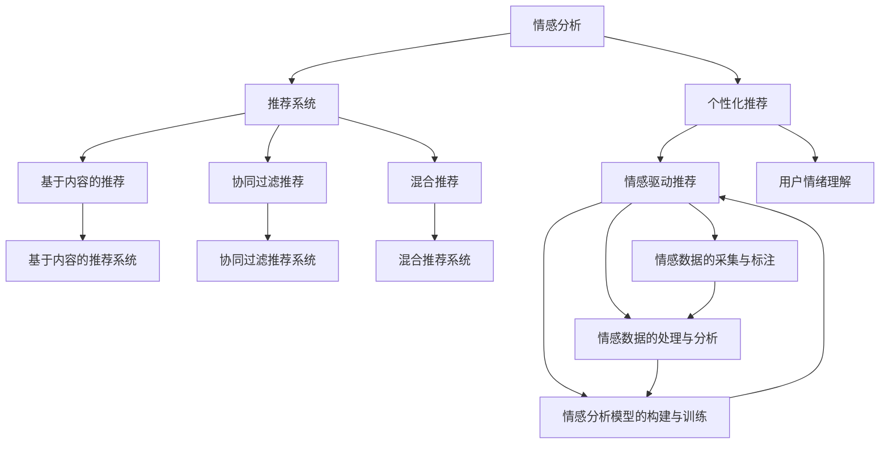

                 

# 情感驱动推荐：AI 如何理解用户情绪，提供个性化推荐

> 关键词：情感分析, 推荐系统, 个性化, 自然语言处理(NLP), 机器学习(ML), 深度学习(DL)

## 1. 背景介绍

### 1.1 问题由来

在现代社会，个性化推荐已成为电商、社交、新闻等领域的重要应用。用户对于个性化推荐的需求日益增长，希望获得更为精准、有针对性的内容推送。传统的推荐系统往往基于用户的点击、浏览历史等行为数据进行推荐，无法捕捉到用户的真实情绪和偏好，难以提供更加个性化和情绪化的服务。

近年来，随着深度学习和自然语言处理(NLP)技术的飞速发展，基于情感分析的推荐系统成为热点研究方向。通过情感分析技术，可以更加全面地理解用户的情感状态和需求，从而提升推荐系统的个性化和精准度。

### 1.2 问题核心关键点

本文旨在探讨如何利用情感分析技术，优化推荐系统，提升用户体验。核心关键点包括：

1. 用户情感数据的采集与标注。如何高效、准确地获取用户的情感数据，是情感驱动推荐的基础。
2. 情感数据的处理与分析。如何对用户的情感数据进行清洗、特征提取，并转化为机器学习模型的输入。
3. 情感分析模型的构建与训练。如何选择和设计情感分析模型，确保其性能和鲁棒性。
4. 推荐策略的优化与融合。如何将情感分析结果与推荐策略相结合，提升推荐系统的性能。

## 2. 核心概念与联系

### 2.1 核心概念概述

为更好地理解情感驱动推荐的原理和流程，本节将介绍几个关键概念：

- 情感分析（Sentiment Analysis）：一种NLP任务，旨在分析文本中的情感倾向，通常分为情感分类、情感强度分析、情感极性分析等不同类别。情感分析结果可以用于理解用户情绪、行为和需求。

- 推荐系统（Recommendation System）：一种信息过滤技术，通过分析用户行为和特征，推荐满足用户兴趣和需求的内容。推荐系统通常分为基于内容的推荐、协同过滤推荐、混合推荐等不同类型。

- 个性化推荐（Personalized Recommendation）：推荐系统的一种高级形式，针对特定用户，提供量身定制的推荐内容，以提升用户体验和满意度。

- 自然语言处理（NLP）：一种涉及文本、语音等自然语言数据处理的AI技术，涵盖语言模型、文本分类、序列标注、情感分析等任务。

- 机器学习（ML）：一种通过数据训练模型，自动发现规律和模式的技术，包括监督学习、无监督学习和强化学习等不同类型。

- 深度学习（DL）：一种基于神经网络的机器学习技术，适用于处理大规模复杂数据，在NLP、计算机视觉、语音识别等领域有广泛应用。

这些核心概念之间的逻辑关系可以通过以下Mermaid流程图来展示：



这个流程图展示了情感驱动推荐的核心流程：

1. 首先采集和标注用户的情感数据。
2. 对情感数据进行清洗和特征提取，转换为机器学习模型的输入。
3. 训练情感分析模型，提取用户情感特征。
4. 结合用户行为数据和情感特征，优化推荐系统，提升个性化推荐效果。

## 3. 核心算法原理 & 具体操作步骤
### 3.1 算法原理概述

情感驱动推荐系统的核心思想是通过情感分析技术，对用户行为数据和反馈信息进行综合分析，理解用户的情感状态和需求，从而提供更加精准和个性化的推荐内容。其基本流程如下：

1. 采集和标注用户情感数据。通过用户评论、评分、点赞等行为数据，分析用户的情感倾向和强度。
2. 构建情感分析模型。将情感数据作为训练样本，训练情感分类或强度分析模型，提取用户情感特征。
3. 优化推荐系统。将情感特征与用户行为数据融合，设计优化算法，提升推荐系统的性能。
4. 实施推荐策略。将优化后的推荐系统应用于实际推荐场景，根据用户的实时反馈进行动态调整。

### 3.2 算法步骤详解

#### 3.2.1 数据采集与标注

数据采集是情感驱动推荐的基础，通常包括以下几个步骤：

1. **用户行为数据采集**：通过日志、评论、评分、点击等行为数据，收集用户的互动信息。例如，电商平台可以采集用户的浏览、购买记录，社交平台可以收集用户的点赞、评论等互动数据。

2. **情感数据标注**：对采集到的行为数据进行情感标注，生成情感标签。情感标注可以通过人工标注、半监督学习或无监督学习等方法完成。常用的情感标注标签包括积极、消极、中性等。

#### 3.2.2 情感数据处理

情感数据处理包括数据清洗、特征提取和转换等步骤，主要目的是将文本数据转换为适合机器学习模型训练的格式：

1. **数据清洗**：去除无关信息，如噪音、特殊字符、停用词等，保留有用信息。

2. **特征提取**：从文本中提取有用的情感特征，常用的特征提取方法包括词袋模型、TF-IDF、词嵌入等。

3. **特征转换**：将提取的特征转换为机器学习模型的输入格式，如将词嵌入转换为向量形式，使用余弦相似度等方法计算文本相似度。

#### 3.2.3 情感分析模型构建与训练

情感分析模型通常包括文本分类模型、情感强度分析模型和情感极性分析模型等。常用的模型包括朴素贝叶斯、支持向量机（SVM）、卷积神经网络（CNN）、循环神经网络（RNN）和Transformer等。模型构建和训练过程如下：

1. **模型选择**：根据任务特点和数据规模，选择合适的情感分析模型。

2. **数据预处理**：对标注数据进行清洗、归一化等预处理操作。

3. **模型训练**：使用标注数据训练情感分析模型，优化模型参数。

4. **模型评估**：使用测试数据集对模型进行评估，选择最优模型。

#### 3.2.4 推荐系统优化

推荐系统优化是将情感分析结果与用户行为数据融合，设计优化算法，提升推荐系统性能的过程。常用的优化算法包括协同过滤、基于内容的推荐、混合推荐等。

1. **协同过滤**：通过用户和物品之间的交互数据，推荐与用户喜好相似的物品。常用的协同过滤方法包括基于用户的协同过滤和基于物品的协同过滤。

2. **基于内容的推荐**：根据物品的特征信息，推荐与用户偏好相似的物品。常用的基于内容的推荐方法包括基于内容的过滤、基于标签的推荐等。

3. **混合推荐**：将多种推荐方法结合，提升推荐系统的效果。常用的混合推荐方法包括基于模型的混合推荐、基于混合特征的推荐等。

#### 3.2.5 实施推荐策略

推荐策略的实施是将优化后的推荐系统应用于实际推荐场景，根据用户的实时反馈进行动态调整的过程：

1. **实时推荐**：根据用户行为和情感分析结果，实时推荐物品。

2. **反馈调整**：根据用户对推荐结果的反馈，动态调整推荐策略。

3. **个性化推荐**：根据用户的历史行为和情感状态，提供量身定制的推荐内容。

### 3.3 算法优缺点

情感驱动推荐系统具有以下优点：

1. **提高个性化推荐效果**：通过情感分析，可以更全面地理解用户需求和偏好，提供更加精准和个性化的推荐内容。

2. **增强用户体验**：情感驱动推荐系统可以理解用户的情感状态，提供情绪化内容，提升用户体验和满意度。

3. **数据利用率高**：情感分析可以充分利用用户行为数据，提高数据利用率，减少推荐系统冷启动问题。

4. **应用范围广**：情感驱动推荐系统适用于电商、社交、新闻等众多领域，具有广泛的应用前景。

情感驱动推荐系统也存在以下缺点：

1. **标注数据需求高**：情感数据标注需要大量人工参与，标注成本高。

2. **模型复杂度高**：情感分析模型和推荐系统都需要复杂的机器学习模型，训练和优化复杂。

3. **用户隐私问题**：情感数据的采集和分析可能涉及用户隐私，需要采取相应的隐私保护措施。

4. **实时处理要求高**：实时推荐需要高效的算法和系统支持，对计算资源和系统架构要求较高。

### 3.4 算法应用领域

情感驱动推荐系统在多个领域得到了广泛应用：

1. **电商推荐**：电商平台通过情感分析，了解用户的情感状态，提供个性化的商品推荐。

2. **社交媒体**：社交媒体平台通过情感分析，分析用户的情感状态，提供情绪化内容推荐。

3. **新闻推荐**：新闻平台通过情感分析，了解用户的情感倾向，提供情绪化的新闻内容推荐。

4. **在线教育**：在线教育平台通过情感分析，了解学生的情感状态，提供个性化的学习内容和推荐。

## 4. 数学模型和公式 & 详细讲解  
### 4.1 数学模型构建

本节将使用数学语言对情感驱动推荐系统的数学模型进行详细讲解。

假设用户行为数据为 $D=\{(x_i, y_i)\}_{i=1}^N, x_i \in \mathcal{X}, y_i \in \mathcal{Y}$，其中 $\mathcal{X}$ 为输入空间，$\mathcal{Y}$ 为输出空间，$y_i$ 为情感标签。

定义情感分析模型为 $F_{\theta}(x)$，其中 $\theta$ 为模型参数。情感分析模型的输出为 $\hat{y}$，表示预测的情感标签。

情感驱动推荐系统的目标是最小化预测错误率，即：

$$
\min_{\theta} \frac{1}{N} \sum_{i=1}^N \mathbb{1}[F_{\theta}(x_i) \neq y_i]
$$

其中 $\mathbb{1}$ 为指示函数，当 $F_{\theta}(x_i) = y_i$ 时为 1，否则为 0。

在实际应用中，情感分析模型的输出通常为概率分布 $P_{\theta}(y|x)$，即预测情感标签 $y$ 的条件概率。此时，推荐系统的目标可以表述为：

$$
\min_{\theta} \mathbb{E}_{(x,y)\sim D}[\ell(P_{\theta}(y|x), y)]
$$

其中 $\ell$ 为损失函数，如交叉熵损失函数。

### 4.2 公式推导过程

以情感分类为例，假设情感分类任务包含两类标签：积极（positive）和消极（negative）。使用二分类交叉熵损失函数，目标函数可以表示为：

$$
\min_{\theta} -\frac{1}{N} \sum_{i=1}^N [y_i\log P_{\theta}(\text{positive}|x_i)+(1-y_i)\log P_{\theta}(\text{negative}|x_i)]
$$

在实际应用中，通常使用随机梯度下降（SGD）等优化算法进行求解。假设训练样本 $(x_i, y_i)$ 的梯度为 $\nabla_{\theta}L(x_i, y_i)$，优化算法为：

$$
\theta \leftarrow \theta - \eta \nabla_{\theta}L(x_i, y_i)
$$

其中 $\eta$ 为学习率。

### 4.3 案例分析与讲解

以电商平台为例，假设平台采集到用户对商品的评价数据 $D=\{(x_i, y_i)\}_{i=1}^N, x_i$ 为评价文本，$y_i$ 为情感标签。情感分类模型 $F_{\theta}$ 的输入为文本嵌入 $E(x_i)$，输出为情感分类概率 $P_{\theta}(y|x)$。

假设使用 BERT 模型作为情感分类模型，对每个商品评价进行情感分类。具体步骤如下：

1. **数据采集**：收集用户对商品的评价数据，标注情感标签。

2. **特征提取**：使用 BERT 模型将评价文本转换为向量表示 $E(x_i)$。

3. **模型训练**：使用标注数据训练情感分类模型 $F_{\theta}$。

4. **情感分析**：对每个新评价文本进行情感分类，预测情感标签 $y_i$。

5. **推荐优化**：根据用户情感分类结果，结合用户行为数据，优化推荐算法，提升个性化推荐效果。

## 5. 项目实践：代码实例和详细解释说明
### 5.1 开发环境搭建

在进行情感驱动推荐系统开发前，需要先准备好开发环境。以下是使用 Python 和 PyTorch 进行情感分析与推荐系统开发的流程：

1. 安装 Anaconda：从官网下载并安装 Anaconda，用于创建独立的 Python 环境。

2. 创建并激活虚拟环境：
```bash
conda create -n recommendation-env python=3.8 
conda activate recommendation-env
```

3. 安装 PyTorch：根据 CUDA 版本，从官网获取对应的安装命令。例如：
```bash
conda install pytorch torchvision torchaudio cudatoolkit=11.1 -c pytorch -c conda-forge
```

4. 安装 Transformers 库：
```bash
pip install transformers
```

5. 安装 Pandas、NumPy、Scikit-learn 等工具包：
```bash
pip install numpy pandas scikit-learn
```

完成上述步骤后，即可在 `recommendation-env` 环境中开始情感驱动推荐系统开发。

### 5.2 源代码详细实现

下面以电商推荐为例，给出使用 Transformers 库对 BERT 模型进行情感分类和个性化推荐开发的 PyTorch 代码实现。

首先，定义数据处理函数：

```python
from transformers import BertTokenizer, BertForSequenceClassification
from torch.utils.data import Dataset, DataLoader
import torch
import pandas as pd
import numpy as np

class RecommendationDataset(Dataset):
    def __init__(self, df, tokenizer, max_len=128):
        self.df = df
        self.tokenizer = tokenizer
        self.max_len = max_len
        
    def __len__(self):
        return len(self.df)
    
    def __getitem__(self, item):
        text = self.df['text'].values[item]
        label = self.df['label'].values[item]
        
        encoding = self.tokenizer(text, return_tensors='pt', max_length=self.max_len, padding='max_length', truncation=True)
        input_ids = encoding['input_ids'][0]
        attention_mask = encoding['attention_mask'][0]
        
        # 对标签进行编码
        encoded_labels = [label2id[label] for label in label2id] 
        encoded_labels.extend([label2id['O']] * (self.max_len - len(encoded_labels)))
        labels = torch.tensor(encoded_labels, dtype=torch.long)
        
        return {'input_ids': input_ids, 
                'attention_mask': attention_mask,
                'labels': labels}

# 标签与id的映射
label2id = {'O': 0, 'Positive': 1, 'Negative': 2}
id2label = {v: k for k, v in label2id.items()}

# 创建dataset
tokenizer = BertTokenizer.from_pretrained('bert-base-cased')

train_df = pd.read_csv('train.csv')
dev_df = pd.read_csv('dev.csv')
test_df = pd.read_csv('test.csv')

train_dataset = RecommendationDataset(train_df, tokenizer)
dev_dataset = RecommendationDataset(dev_df, tokenizer)
test_dataset = RecommendationDataset(test_df, tokenizer)
```

然后，定义模型和优化器：

```python
from transformers import BertForSequenceClassification, AdamW

model = BertForSequenceClassification.from_pretrained('bert-base-cased', num_labels=len(label2id))

optimizer = AdamW(model.parameters(), lr=2e-5)
```

接着，定义训练和评估函数：

```python
from tqdm import tqdm

device = torch.device('cuda') if torch.cuda.is_available() else torch.device('cpu')
model.to(device)

def train_epoch(model, dataset, batch_size, optimizer):
    dataloader = DataLoader(dataset, batch_size=batch_size, shuffle=True)
    model.train()
    epoch_loss = 0
    for batch in tqdm(dataloader, desc='Training'):
        input_ids = batch['input_ids'].to(device)
        attention_mask = batch['attention_mask'].to(device)
        labels = batch['labels'].to(device)
        model.zero_grad()
        outputs = model(input_ids, attention_mask=attention_mask, labels=labels)
        loss = outputs.loss
        epoch_loss += loss.item()
        loss.backward()
        optimizer.step()
    return epoch_loss / len(dataloader)

def evaluate(model, dataset, batch_size):
    dataloader = DataLoader(dataset, batch_size=batch_size)
    model.eval()
    preds, labels = [], []
    with torch.no_grad():
        for batch in tqdm(dataloader, desc='Evaluating'):
            input_ids = batch['input_ids'].to(device)
            attention_mask = batch['attention_mask'].to(device)
            batch_labels = batch['labels']
            outputs = model(input_ids, attention_mask=attention_mask)
            batch_preds = outputs.logits.argmax(dim=2).to('cpu').tolist()
            batch_labels = batch_labels.to('cpu').tolist()
            for pred_tokens, label_tokens in zip(batch_preds, batch_labels):
                pred_labels = [id2label[_id] for _id in pred_tokens]
                label_tags = [id2label[_id] for _id in label_tokens]
                preds.append(pred_labels[:len(label_tags)])
                labels.append(label_tags)
                
    print(classification_report(labels, preds))
```

最后，启动训练流程并在测试集上评估：

```python
epochs = 5
batch_size = 16

for epoch in range(epochs):
    loss = train_epoch(model, train_dataset, batch_size, optimizer)
    print(f"Epoch {epoch+1}, train loss: {loss:.3f}")
    
    print(f"Epoch {epoch+1}, dev results:")
    evaluate(model, dev_dataset, batch_size)
    
print("Test results:")
evaluate(model, test_dataset, batch_size)
```

以上就是使用 PyTorch 对 BERT 模型进行情感分类和个性化推荐开发的完整代码实现。可以看到，得益于 Transformers 库的强大封装，我们可以用相对简洁的代码完成情感分类和推荐系统的开发。

### 5.3 代码解读与分析

让我们再详细解读一下关键代码的实现细节：

**RecommendationDataset类**：
- `__init__`方法：初始化文本、标签、分词器等关键组件。
- `__len__`方法：返回数据集的样本数量。
- `__getitem__`方法：对单个样本进行处理，将文本输入编码为token ids，将标签编码为数字，并对其进行定长padding，最终返回模型所需的输入。

**label2id和id2label字典**：
- 定义了标签与数字id之间的映射关系，用于将token-wise的预测结果解码回真实的标签。

**训练和评估函数**：
- 使用PyTorch的DataLoader对数据集进行批次化加载，供模型训练和推理使用。
- 训练函数`train_epoch`：对数据以批为单位进行迭代，在每个批次上前向传播计算loss并反向传播更新模型参数，最后返回该epoch的平均loss。
- 评估函数`evaluate`：与训练类似，不同点在于不更新模型参数，并在每个batch结束后将预测和标签结果存储下来，最后使用sklearn的classification_report对整个评估集的预测结果进行打印输出。

**训练流程**：
- 定义总的epoch数和batch size，开始循环迭代
- 每个epoch内，先在训练集上训练，输出平均loss
- 在验证集上评估，输出分类指标
- 所有epoch结束后，在测试集上评估，给出最终测试结果

可以看到，PyTorch配合Transformers库使得BERT模型的情感分类和推荐系统的代码实现变得简洁高效。开发者可以将更多精力放在数据处理、模型改进等高层逻辑上，而不必过多关注底层的实现细节。

当然，工业级的系统实现还需考虑更多因素，如模型的保存和部署、超参数的自动搜索、更灵活的任务适配层等。但核心的情感驱动推荐系统开发流程基本与此类似。

## 6. 实际应用场景
### 6.1 智能客服系统

智能客服系统可以通过情感驱动推荐技术，提升客户咨询体验。用户在与客服互动时，可以实时获得情绪化回复，更好地理解和解决问题。

具体而言，可以收集用户对客服互动的情感数据，如满意度、情绪强度等，结合用户历史行为数据，训练情感分析模型。根据用户情感状态，智能客服系统可以自动调整回复内容和风格，提供更符合用户期望的解答。

### 6.2 电商推荐系统

电商推荐系统通过情感驱动推荐技术，可以更好地理解用户需求，提供个性化商品推荐。用户在浏览商品时，可以实时获得情感化的推荐结果，提升购物体验。

具体而言，可以收集用户对商品评论的情感数据，结合用户历史行为数据，训练情感分析模型。根据用户情感状态，推荐系统可以动态调整推荐结果，提供更加贴合用户需求的商品推荐。

### 6.3 新闻推荐系统

新闻推荐系统通过情感驱动推荐技术，可以更好地理解用户情感倾向，提供个性化新闻内容。用户在浏览新闻时，可以实时获得情绪化推荐，提升阅读体验。

具体而言，可以收集用户对新闻文章的情感数据，结合用户历史行为数据，训练情感分析模型。根据用户情感状态，推荐系统可以动态调整推荐内容，提供更符合用户兴趣的新闻资讯。

### 6.4 在线教育平台

在线教育平台通过情感驱动推荐技术，可以更好地理解学生情感状态，提供个性化学习内容。学生在学习时，可以实时获得情绪化推荐，提升学习效果。

具体而言，可以收集学生对课程视频的情感数据，结合学生历史学习数据，训练情感分析模型。根据学生情感状态，推荐系统可以动态调整推荐内容，提供更符合学生需求的学习资源。

## 7. 工具和资源推荐
### 7.1 学习资源推荐

为了帮助开发者系统掌握情感驱动推荐技术，这里推荐一些优质的学习资源：

1. **《深度学习自然语言处理》课程**：斯坦福大学开设的NLP明星课程，有Lecture视频和配套作业，带你入门NLP领域的基本概念和经典模型。

2. **《Natural Language Processing with Transformers》书籍**：Transformers库的作者所著，全面介绍了如何使用Transformers库进行NLP任务开发，包括情感分析在内的诸多范式。

3. **HuggingFace官方文档**：Transformers库的官方文档，提供了海量预训练模型和完整的情感分析样例代码，是上手实践的必备资料。

4. **情感分析公开数据集**：包括IMDb电影评论、Yelp餐厅评论、Twitter情感数据等，提供丰富的情感数据标注资源。

通过对这些资源的学习实践，相信你一定能够快速掌握情感驱动推荐技术的精髓，并用于解决实际的情感分析与推荐问题。

### 7.2 开发工具推荐

高效的开发离不开优秀的工具支持。以下是几款用于情感驱动推荐系统开发的常用工具：

1. **PyTorch**：基于Python的开源深度学习框架，灵活动态的计算图，适合快速迭代研究。

2. **TensorFlow**：由Google主导开发的开源深度学习框架，生产部署方便，适合大规模工程应用。

3. **Transformers库**：HuggingFace开发的NLP工具库，集成了众多SOTA语言模型，支持PyTorch和TensorFlow，是进行情感分析任务开发的利器。

4. **Weights & Biases**：模型训练的实验跟踪工具，可以记录和可视化模型训练过程中的各项指标，方便对比和调优。

5. **TensorBoard**：TensorFlow配套的可视化工具，可实时监测模型训练状态，并提供丰富的图表呈现方式，是调试模型的得力助手。

6. **Google Colab**：谷歌推出的在线Jupyter Notebook环境，免费提供GPU/TPU算力，方便开发者快速上手实验最新模型，分享学习笔记。

合理利用这些工具，可以显著提升情感驱动推荐系统的开发效率，加快创新迭代的步伐。

### 7.3 相关论文推荐

情感驱动推荐技术的研究源于学界的持续研究。以下是几篇奠基性的相关论文，推荐阅读：

1. **《Attention is All You Need》**：提出了Transformer结构，开启了NLP领域的预训练大模型时代。

2. **《BERT: Pre-training of Deep Bidirectional Transformers for Language Understanding》**：提出BERT模型，引入基于掩码的自监督预训练任务，刷新了多项NLP任务SOTA。

3. **《Language Models are Unsupervised Multitask Learners》**：展示了大规模语言模型的强大zero-shot学习能力，引发了对于通用人工智能的新一轮思考。

4. **《Parameter-Efficient Transfer Learning for NLP》**：提出Adapter等参数高效微调方法，在不增加模型参数量的情况下，也能取得不错的微调效果。

5. **《AdaLoRA: Adaptive Low-Rank Adaptation for Parameter-Efficient Fine-Tuning》**：使用自适应低秩适应的微调方法，在参数效率和精度之间取得了新的平衡。

这些论文代表了大语言模型微调技术的发展脉络。通过学习这些前沿成果，可以帮助研究者把握学科前进方向，激发更多的创新灵感。

## 8. 总结：未来发展趋势与挑战

### 8.1 总结

本文对情感驱动推荐系统进行了全面系统的介绍。首先阐述了情感分析与推荐系统结合的动机和背景，明确了情感驱动推荐系统的应用前景和核心关键点。其次，从原理到实践，详细讲解了情感驱动推荐系统的数学模型和操作步骤，给出了情感分类和推荐系统的完整代码实现。同时，本文还广泛探讨了情感驱动推荐系统的应用场景，展示了其在智能客服、电商推荐、新闻推荐、在线教育等众多领域的应用前景。最后，本文精选了情感驱动推荐系统的学习资源、开发工具和相关论文，力求为读者提供全方位的技术指引。

通过本文的系统梳理，可以看到，情感驱动推荐系统正在成为推荐系统的重要分支，通过情感分析技术，可以更全面地理解用户需求和情绪，提升推荐系统的个性化和精准度。未来，伴随情感驱动推荐技术的不断发展，推荐系统将能够更好地捕捉用户情绪，提供更加个性化和情绪化的服务，为用户带来更优质的体验。

### 8.2 未来发展趋势

展望未来，情感驱动推荐技术将呈现以下几个发展趋势：

1. **深度融合多模态信息**：情感驱动推荐系统可以与视觉、语音等多模态信息进行融合，提升系统的感知能力和泛化性能。例如，结合图像和文本信息，理解用户的情感状态和需求，提供更精准的推荐结果。

2. **结合因果推理**：情感驱动推荐系统可以引入因果推理技术，增强推荐系统的可解释性和鲁棒性。通过因果分析，理解用户行为和情感状态之间的关系，提供更加合理和可解释的推荐结果。

3. **引入对抗训练**：情感驱动推荐系统可以引入对抗训练技术，提高系统的鲁棒性和安全性。通过对抗样本训练，增强系统的泛化能力和抗干扰能力，确保推荐结果的准确性和稳定性。

4. **实时化和个性化**：情感驱动推荐系统可以结合实时数据和用户个性化需求，提供更加动态和个性化的推荐结果。例如，结合用户实时反馈和情感状态，动态调整推荐策略，提升用户体验和满意度。

5. **跨领域迁移能力**：情感驱动推荐系统可以结合知识图谱和符号化知识，提升系统的跨领域迁移能力。通过引入外部知识库和规则库，增强系统的常识推理和信息整合能力，提升推荐系统的泛化性能。

这些趋势凸显了情感驱动推荐技术的广阔前景。这些方向的探索发展，必将进一步提升推荐系统的性能和应用范围，为用户带来更优质的体验。

### 8.3 面临的挑战

尽管情感驱动推荐技术已经取得了瞩目成就，但在迈向更加智能化、普适化应用的过程中，它仍面临着诸多挑战：

1. **数据标注成本高**：情感数据的标注需要大量人工参与，标注成本高，数据采集和处理难度大。如何高效、准确地采集和标注情感数据，是情感驱动推荐系统的瓶颈。

2. **模型复杂度高**：情感驱动推荐系统涉及情感分析和推荐系统两个复杂模型，训练和优化难度大。如何设计高效、鲁棒的情感分析模型和推荐系统，是情感驱动推荐系统的核心挑战。

3. **用户隐私问题**：情感数据的采集和分析可能涉及用户隐私，需要采取相应的隐私保护措施。如何在保证数据质量的同时，保护用户隐私，是情感驱动推荐系统的伦理问题。

4. **实时处理要求高**：实时推荐需要高效的算法和系统支持，对计算资源和系统架构要求较高。如何优化算法和系统架构，提高实时处理能力，是情感驱动推荐系统的技术难点。

5. **推荐结果可解释性不足**：情感驱动推荐系统的推荐结果通常缺乏可解释性，难以对其推理逻辑进行分析和调试。如何在提升推荐系统性能的同时，增强其可解释性，是情感驱动推荐系统的关键挑战。

6. **系统鲁棒性不足**：情感驱动推荐系统在面对域外数据时，泛化性能往往大打折扣。如何提高系统的鲁棒性和泛化能力，避免灾难性遗忘，是情感驱动推荐系统的研究重点。

### 8.4 研究展望

面对情感驱动推荐系统所面临的挑战，未来的研究需要在以下几个方面寻求新的突破：

1. **探索高效情感数据采集方法**：开发高效、自动化的情感数据采集和标注方法，降低情感驱动推荐系统的数据标注成本，提高数据质量和采集效率。

2. **优化情感分析模型和推荐系统**：研究高效、鲁棒的情感分析模型和推荐系统，优化模型的训练和优化算法，提高系统的性能和鲁棒性。

3. **结合因果推理和对抗训练**：引入因果推理和对抗训练技术，增强情感驱动推荐系统的可解释性和鲁棒性，提高系统的泛化能力和安全性。

4. **融合多模态信息**：结合视觉、语音等多模态信息，提升情感驱动推荐系统的感知能力和泛化性能，提供更加精准和个性化的推荐结果。

5. **引入外部知识库**：结合知识图谱和符号化知识，增强情感驱动推荐系统的跨领域迁移能力，提升系统的常识推理和信息整合能力。

6. **保护用户隐私**：在情感驱动推荐系统的设计中，引入隐私保护技术，确保用户数据的安全和隐私保护，增强系统的伦理性和可信任度。

这些研究方向的探索，必将引领情感驱动推荐技术迈向更高的台阶，为构建更加智能化、个性化、情绪化的推荐系统铺平道路。面向未来，情感驱动推荐技术还需要与其他AI技术进行更深入的融合，如知识表示、因果推理、强化学习等，多路径协同发力，共同推动推荐系统技术的发展。只有勇于创新、敢于突破，才能不断拓展推荐系统的边界，让推荐系统更好地服务于用户需求，提升用户体验和满意度。

## 9. 附录：常见问题与解答

**Q1：情感驱动推荐系统与传统推荐系统有何区别？**

A: 情感驱动推荐系统与传统推荐系统的区别主要在于：

1. **情感数据采集**：情感驱动推荐系统通过情感分析技术，采集用户的情感数据，理解用户的情绪状态和需求。传统推荐系统主要依赖用户的点击、浏览历史等行为数据，缺乏对用户情感的深入理解。

2. **推荐内容个性化**：情感驱动推荐系统可以结合用户的情感状态，提供更加情绪化、个性化的推荐内容。传统推荐系统通常只能提供基于行为的推荐结果，缺乏情感维度的考虑。

3. **推荐算法优化**：情感驱动推荐系统结合情感分析结果，优化推荐算法，提升推荐系统的性能。传统推荐系统通常采用协同过滤、基于内容的推荐等算法，缺乏对情感数据的融合。

4. **推荐结果可解释性**：情感驱动推荐系统可以通过情感分析结果，解释推荐内容的逻辑和原因，提供更好的推荐结果解释。传统推荐系统通常缺乏可解释性，难以解释推荐结果的来源和原因。

**Q2：情感驱动推荐系统如何处理情感数据的噪音？**

A: 情感数据的噪音是情感驱动推荐系统面临的一个重要问题。通常有以下几种方法可以处理情感数据的噪音：

1. **数据清洗**：去除无关信息，如噪音、特殊字符、停用词等，保留有用信息。

2. **特征提取**：使用TF-IDF、词嵌入等方法提取情感特征，去除噪音。

3. **模型训练**：通过半监督学习、无监督学习等方法，减少噪音对情感分析模型的影响。

4. **情感强度分析**：结合情感强度分析模型，去除情感强度较低的情感数据，减少噪音的干扰。

5. **模型集成**：使用多个情感分析模型进行集成，减少单个模型的误差和噪音影响。

这些方法可以结合使用，提升情感驱动推荐系统的性能和鲁棒性。

**Q3：情感驱动推荐系统的推荐结果如何解释？**

A: 情感驱动推荐系统的推荐结果通常缺乏可解释性，难以对其推理逻辑进行分析和调试。以下是几种常用的解释方法：

1. **特征分析**：分析情感分析模型的特征提取过程，理解情感特征的含义和来源。

2. **因果推理**：通过因果推理技术，理解用户行为和情感状态之间的关系，解释推荐结果的逻辑和原因。

3. **模型可解释性**：研究可解释性的情感分析模型和推荐系统，提供推荐结果的解释和理由。

4. **用户反馈**：结合用户反馈和行为数据，解释推荐结果的原因和改进措施。

这些方法可以结合使用，提升情感驱动推荐系统的可解释性和用户满意度。

**Q4：情感驱动推荐系统的应用前景有哪些？**

A: 情感驱动推荐系统的应用前景非常广泛，主要包括以下几个方面：

1. **电商推荐**：通过情感分析，了解用户的情感状态，提供个性化的商品推荐，提升用户体验和满意度。

2. **智能客服**：通过情感分析，理解用户的情绪和需求，提供情绪化回复和解决方案，提升客服服务质量。

3. **新闻推荐**：通过情感分析，了解用户的情感倾向，提供情绪化的新闻内容，提升阅读体验。

4. **在线教育**：通过情感分析，了解学生的情感状态，提供个性化的学习内容和推荐，提升学习效果。

5. **健康医疗**：通过情感分析，理解患者的情感状态，提供情绪化的医疗建议和护理方案，提升医疗服务质量。

6. **金融服务**：通过情感分析，理解用户的情感状态，提供情绪化的金融建议和产品推荐，提升用户满意度。

情感驱动推荐系统的应用前景非常广阔，未来随着技术的不断进步，将会在更多领域得到应用，为用户带来更优质的体验。

---

作者：禅与计算机程序设计艺术 / Zen and the Art of Computer Programming

