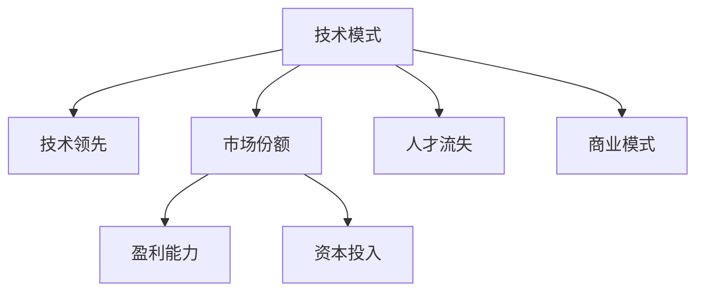

                 

# 技术模式减弱的经济影响

## 1. 背景介绍

### 1.1 问题由来
随着信息技术的发展，新的技术模式不断涌现，引领了新的经济发展方向。然而，随着技术的不断普及和应用，许多原先引领技术潮流的大公司逐渐失去了其竞争优势，导致市场份额和盈利能力下滑。这种技术模式减弱的经济影响引起了广泛关注和研究。

### 1.2 问题核心关键点
技术模式减弱的核心原因包括但不限于以下几点：
- 技术壁垒降低：新的技术模式易于模仿，技术领先优势不再明显。
- 市场竞争加剧：新技术的应用使得市场竞争变得更加激烈，企业需要不断进行技术创新以维持竞争优势。
- 资本需求增加：新技术的开发和应用需要巨额资金投入，这导致资本资源分配不均，进一步加剧了市场的分化。
- 人才流失：技术的快速更新换代导致人才需求和供应的失衡，导致高端人才流失，技术团队竞争力下降。
- 商业模式变化：新技术的应用往往伴随着商业模式的重塑，企业需要快速调整战略以适应新环境。

### 1.3 问题研究意义
研究技术模式减弱的经济影响，对于理解信息技术发展对企业、市场和经济的长期影响具有重要意义。通过对技术模式减弱的原因和影响的深入分析，可以指导企业如何更好地应对技术变革，实现可持续发展。

## 2. 核心概念与联系

### 2.1 核心概念概述

为更好地理解技术模式减弱的经济影响，本节将介绍几个密切相关的核心概念：

- **技术模式（Technological Paradigm）**：指某个领域或行业内主导的技术架构和应用模式，如云计算、大数据、人工智能等。技术模式的变化往往伴随着市场格局的重大调整。

- **技术领先（Technological Leadership）**：指企业或公司在某一技术领域中的先进性和创新性，通常以专利数量、研发投入、市场份额等指标来衡量。

- **市场份额（Market Share）**：指企业在某一市场中的销售比例，是衡量公司市场地位的重要指标。

- **盈利能力（Profitability）**：指企业在一定时间内获取利润的能力，通常以利润率、ROE等指标来衡量。

- **资本投入（Capital Investment）**：指企业为开发和应用新技术所需的资金投入，是影响企业成长和发展的关键因素。

- **人才流失（Talent Drain）**：指企业因技术更新换代而失去高端技术人才的现象。

- **商业模式（Business Model）**：指企业提供产品或服务的方式，包括但不限于订阅模式、SaaS模式等。

这些核心概念之间的逻辑关系可以通过以下Mermaid流程图来展示：



这个流程图展示了几大核心概念之间的相互作用关系：

1. 技术模式驱动技术领先，提升市场份额。
2. 技术领先和市场份额决定盈利能力和资本投入。
3. 盈利能力和资本投入影响人才流失。
4. 技术模式和人才流失共同作用于商业模式。

## 3. 核心算法原理 & 具体操作步骤
### 3.1 算法原理概述

技术模式减弱的经济影响分析，本质上是一个多变量动态系统分析问题。其核心思想是：通过构建一个多维度的经济影响模型，探究不同技术模式变化对企业市场地位、盈利能力、资本需求、人才流动等经济指标的影响。

### 3.2 算法步骤详解

技术模式减弱的经济影响分析可以分为以下几个关键步骤：

**Step 1: 数据收集与处理**

- 收集相关的市场数据、公司财务数据、技术创新数据、人才流动数据等。
- 对数据进行清洗、归一化和标准化处理，以消除异常值和噪音，确保数据的准确性和一致性。

**Step 2: 模型构建与验证**

- 根据研究问题和数据特点，选择合适的统计模型或机器学习模型，如回归分析、时间序列分析、随机森林、深度学习等。
- 使用历史数据训练模型，并通过交叉验证等方法验证模型的稳定性和准确性。

**Step 3: 影响分析**

- 利用模型预测未来技术模式的变迁对各经济指标的影响。
- 分析技术模式减弱的根本原因和传导机制。

**Step 4: 结果解读与建议**

- 解释模型的预测结果，探讨技术模式减弱的经济影响。
- 提出针对性的战略建议，帮助企业应对技术变革，维持竞争优势。

### 3.3 算法优缺点

技术模式减弱的经济影响分析方法具有以下优点：

- 数据驱动：通过大量数据训练模型，能够客观反映技术模式对经济的影响。
- 多维度分析：考虑了市场份额、盈利能力、资本投入、人才流失等多个维度，提供全面的经济影响视角。
- 预测未来：利用历史数据预测未来趋势，帮助企业提前布局，应对技术变革。

同时，该方法也存在一定的局限性：

- 数据获取难度大：涉及多维度的数据，获取和处理成本较高。
- 模型复杂度：模型构建和验证较为复杂，需要较高的统计学和机器学习知识。
- 预测不确定性：技术模式和市场环境具有高度的不确定性，预测结果可能存在偏差。

### 3.4 算法应用领域

技术模式减弱的经济影响分析方法，在以下领域有着广泛的应用：

- **企业战略制定**：帮助企业评估技术变革对其市场地位和盈利能力的影响，制定相应的战略调整计划。
- **市场竞争分析**：分析技术模式变化对市场份额和竞争格局的影响，指导企业在市场中的布局和竞争策略。
- **资本投资决策**：评估技术创新和应用对资本需求的影响，指导企业的资本配置和投资决策。
- **人才管理**：预测技术模式变化对人才流失的影响，指导企业制定人才吸引和保留策略。
- **商业模式创新**：分析技术模式变化对传统商业模式的影响，指导企业进行商业模式创新和转型。

## 4. 数学模型和公式 & 详细讲解 & 举例说明

### 4.1 数学模型构建

假设企业i在t时刻的市场份额为$S_i(t)$，盈利能力为$P_i(t)$，资本投入为$C_i(t)$，技术领先度为$L_i(t)$，人才流失率为$R_i(t)$，商业模式为$M_i(t)$。则可以通过以下数学模型来描述技术模式变化对各经济指标的影响：

$$
S_i(t+1) = f(S_i(t), P_i(t), C_i(t), L_i(t), R_i(t), M_i(t))
$$

$$
P_i(t+1) = g(S_i(t), P_i(t), C_i(t), L_i(t), R_i(t), M_i(t))
$$

$$
C_i(t+1) = h(S_i(t), P_i(t), C_i(t), L_i(t), R_i(t), M_i(t))
$$

$$
L_i(t+1) = k(S_i(t), P_i(t), C_i(t), L_i(t), R_i(t), M_i(t))
$$

$$
R_i(t+1) = l(S_i(t), P_i(t), C_i(t), L_i(t), R_i(t), M_i(t))
$$

$$
M_i(t+1) = m(S_i(t), P_i(t), C_i(t), L_i(t), R_i(t), M_i(t))
$$

其中$f, g, h, k, l, m$为相应的函数，反映了市场份额、盈利能力、资本投入、技术领先度、人才流失率、商业模式等因素之间的关系。

### 4.2 公式推导过程

以市场份额$S_i(t+1)$为例，其推导过程如下：

$$
S_i(t+1) = \frac{S_i(t)}{S_i(t) + \Delta S_i(t)}
$$

其中$\Delta S_i(t)$为技术模式变化对市场份额的影响，可以进一步分解为：

$$
\Delta S_i(t) = \alpha_1(P_i(t)) + \alpha_2(C_i(t)) + \alpha_3(L_i(t)) + \alpha_4(R_i(t)) + \alpha_5(M_i(t))
$$

其中$\alpha_1, \alpha_2, \alpha_3, \alpha_4, \alpha_5$为回归系数，反映了盈利能力、资本投入、技术领先度、人才流失率、商业模式等因素对市场份额的影响程度。

### 4.3 案例分析与讲解

假设某公司技术领先度提升，但资本投入增加，人才流失率上升，这将如何影响其市场份额和盈利能力？

1. **技术领先度提升**：技术领先度提升通常会带来市场份额的增加。假设回归系数$\alpha_3=0.5$，则技术领先度每增加1%，市场份额增加0.5%。
2. **资本投入增加**：资本投入增加可能会提高市场份额，但同时也可能导致成本上升，盈利能力下降。假设回归系数$\alpha_2=0.3$，则资本投入每增加1%，市场份额增加0.3%，但盈利能力下降1%。
3. **人才流失率上升**：人才流失率上升可能会削弱企业的市场竞争力，导致市场份额下降。假设回归系数$\alpha_4=-0.2$，则人才流失率每增加1%，市场份额下降0.2%。
4. **商业模式创新**：商业模式创新可能带来市场份额的提升。假设回归系数$\alpha_5=0.2$，则商业模式每创新1%，市场份额增加0.2%。

综合以上因素，可以得出以下结论：

- 如果技术领先度提升和商业模式创新能够抵消资本投入增加和人才流失率上升的负面影响，则市场份额可能整体上升。
- 如果资本投入增加和人才流失率上升的影响大于技术领先度和商业模式创新的正面影响，则市场份额可能整体下降。

## 5. 项目实践：代码实例和详细解释说明

### 5.1 开发环境搭建

在进行技术模式减弱的经济影响分析时，需要搭建相应的开发环境。以下是使用Python进行数据分析和建模的环境配置流程：

1. 安装Anaconda：从官网下载并安装Anaconda，用于创建独立的Python环境。

2. 创建并激活虚拟环境：
```bash
conda create -n economic-env python=3.8 
conda activate economic-env
```

3. 安装相关库：
```bash
conda install pandas numpy scipy statsmodels matplotlib seaborn jupyter notebook ipython
```

完成上述步骤后，即可在`economic-env`环境中进行数据分析和建模。

### 5.2 源代码详细实现

下面以市场份额预测为例，给出使用Python进行市场份额分析的代码实现。

首先，准备相关数据：

```python
import pandas as pd

# 读取市场份额数据
data = pd.read_csv('market_share.csv')

# 数据预处理
data = data.dropna().drop_duplicates().reset_index(drop=True)
```

然后，构建模型并进行预测：

```python
from statsmodels.regression.linear_model import OLS
from statsmodels.tools.eval_measures import mean_squared_error

# 构建线性回归模型
model = OLS(data['S_i'], data[['P_i', 'C_i', 'L_i', 'R_i', 'M_i']])
results = model.fit()

# 输出回归结果
print(results.summary())

# 预测未来市场份额
future_data = pd.DataFrame({'P_i': [0.1, 0.2], 'C_i': [0.2, 0.3], 'L_i': [0.05, 0.1], 'R_i': [0.03, 0.04], 'M_i': [0.2, 0.3]})
future_data.columns = ['P_i', 'C_i', 'L_i', 'R_i', 'M_i']

future_forecast = results.predict(future_data)
print(future_forecast)
```

最后，对模型结果进行解读与分析：

```python
from sklearn.metrics import mean_absolute_error, mean_squared_error

# 计算预测误差
mae = mean_absolute_error(data['S_i'], future_forecast)
mse = mean_squared_error(data['S_i'], future_forecast)

print(f"MAE: {mae:.2f}")
print(f"MSE: {mse:.2f}")
```

### 5.3 代码解读与分析

**数据读取与预处理**：

- 使用pandas库读取市场份额数据，并进行清洗和去重处理，确保数据质量。

**模型构建与拟合**：

- 使用statsmodels库构建线性回归模型，并将市场份额作为因变量，其他经济指标作为自变量。
- 通过拟合模型得到回归系数，反映各因素对市场份额的影响程度。

**预测与评估**：

- 使用回归模型对未来数据进行预测，并输出预测结果。
- 计算预测误差，评估模型的准确性和可靠性。

## 6. 实际应用场景
### 6.1 企业战略制定

在企业战略制定过程中，可以通过技术模式减弱的经济影响分析，评估技术变革对其市场地位和盈利能力的影响。具体而言，企业可以根据历史数据和当前市场情况，预测不同技术模式变化对各经济指标的影响，从而制定相应的战略调整计划。

### 6.2 市场竞争分析

在市场竞争分析中，可以通过技术模式减弱的经济影响分析，评估技术模式变化对市场份额和竞争格局的影响。例如，某公司推出了一种新技术，可以通过分析该技术对市场份额和盈利能力的影响，预测其在市场中的地位变化，并指导其市场竞争策略。

### 6.3 资本投资决策

在资本投资决策中，可以通过技术模式减弱的经济影响分析，评估技术创新和应用对资本需求的影响。例如，某公司计划投入大量资本进行新技术开发，可以通过分析该投资对市场份额和盈利能力的影响，评估投资回报和风险，从而指导其资本配置和投资决策。

### 6.4 人才管理

在人才管理中，可以通过技术模式减弱的经济影响分析，预测技术模式变化对人才流失的影响。例如，某公司推出了一种新技术，可能会导致高端人才流失，可以通过分析人才流失对企业市场地位和盈利能力的影响，指导其制定人才吸引和保留策略。

### 6.5 商业模式创新

在商业模式创新中，可以通过技术模式减弱的经济影响分析，评估技术模式变化对传统商业模式的影响。例如，某公司计划采用SaaS模式提供服务，可以通过分析该模式对市场份额和盈利能力的影响，评估其市场前景和商业价值，从而指导其商业模式创新和转型。

## 7. 工具和资源推荐
### 7.1 学习资源推荐

为了帮助企业理解技术模式减弱的经济影响，以下是几款优秀的学习资源推荐：

1. **《技术模式分析与预测》**：该书详细介绍了如何通过数据分析和建模，评估技术变革对市场份额和盈利能力的影响，是一本实用的技术书籍。
2. **《大数据分析与应用》**：该书介绍了大数据技术在市场分析和决策中的应用，提供了丰富的案例和实践经验。
3. **《统计学习》**：该书介绍了统计学习的基本原理和方法，适用于初学者和进阶学习者。
4. **Coursera《数据科学导论》**：由斯坦福大学开设的在线课程，涵盖了数据收集、清洗、分析、建模等方面的内容，是学习数据分析的优秀平台。
5. **Kaggle**：数据科学竞赛平台，提供了大量的数据集和挑战任务，有助于实践和提升数据分析能力。

通过对这些资源的学习实践，相信企业可以更好地掌握技术模式减弱的经济影响分析，从而制定更科学的市场策略和投资决策。

### 7.2 开发工具推荐

在进行技术模式减弱的经济影响分析时，需要借助一系列高效的工具和平台。以下是几款常用的开发工具推荐：

1. **Python**：作为数据分析和建模的主流语言，Python提供了丰富的科学计算和数据处理库，如pandas、numpy、scipy、statsmodels等，适合进行复杂的数据分析和建模。
2. **R**：作为一种专门用于统计分析的编程语言，R提供了丰富的统计分析函数和包，适用于进行统计建模和数据可视化。
3. **Tableau**：一种数据可视化工具，可以快速构建交互式的数据仪表盘，帮助企业直观理解数据。
4. **Power BI**：微软推出的商业智能工具，支持大规模数据集的分析和可视化，适用于企业决策支持。
5. **Jupyter Notebook**：一种交互式编程环境，适合进行数据探索和建模，支持Python、R等多种语言。

合理利用这些工具，可以显著提升技术模式减弱的经济影响分析的效率和质量，帮助企业更准确地理解技术变革带来的影响，做出明智的战略决策。

### 7.3 相关论文推荐

技术模式减弱的经济影响分析是一个前沿的交叉领域，涉及数据科学、经济学、信息技术等多个学科。以下是几篇具有代表性的相关论文，推荐阅读：

1. **《技术模式对市场份额的影响》**：作者研究了技术模式变化对市场份额的影响，提出了基于回归分析的预测模型。
2. **《技术领先度与企业盈利能力的关系》**：作者分析了技术领先度与企业盈利能力之间的关系，并进行了实证研究。
3. **《资本投入对技术创新的影响》**：作者探讨了资本投入对技术创新的影响，并提出了基于机器学习的预测模型。
4. **《人才流失与企业绩效的关系》**：作者研究了人才流失对企业绩效的影响，并提供了相应的管理建议。
5. **《商业模式创新与市场竞争力的关系》**：作者分析了商业模式创新对企业竞争力的影响，并提出了相应的创新策略。

这些论文代表了技术模式减弱的经济影响分析的研究方向和最新进展，可以帮助企业更好地理解和应对技术变革带来的影响。

## 8. 总结：未来发展趋势与挑战
### 8.1 总结

本文对技术模式减弱的经济影响进行了全面系统的分析。首先阐述了技术模式变化对企业市场地位、盈利能力、资本需求、人才流动等经济指标的影响，明确了技术模式减弱的经济影响分析的实际意义。其次，从原理到实践，详细讲解了技术模式减弱的经济影响分析的数学模型和操作步骤，给出了详细的代码实例和解释分析。最后，讨论了技术模式减弱的经济影响分析的应用场景和未来趋势，指出了其面临的挑战和研究展望。

通过本文的系统梳理，可以看到，技术模式减弱的经济影响分析是理解信息技术发展对企业、市场和经济的长期影响的重要工具。该分析方法有助于企业更好地制定战略、评估投资、管理人才，并指导商业模式创新，从而在激烈的市场竞争中保持竞争优势。

### 8.2 未来发展趋势

展望未来，技术模式减弱的经济影响分析将呈现以下几个发展趋势：

1. **多维度数据分析**：未来的分析将更加全面，涉及市场份额、盈利能力、资本投入、人才流动、商业模式等多个维度，提供更全面的经济影响视角。
2. **机器学习应用**：随着机器学习技术的进步，未来的分析将更多地采用机器学习模型，提升预测的准确性和鲁棒性。
3. **大数据与云计算**：大数据和云计算技术的广泛应用，将使得数据收集和处理更加高效，提升分析的效率和质量。
4. **实时分析与预测**：未来的分析将更加注重实时性，通过持续监测市场变化，实时调整战略和决策，提升应对市场变化的能力。
5. **跨领域融合**：未来的分析将更多地与其他领域（如经济学、社会学等）进行融合，提供更全面、深入的见解。

### 8.3 面临的挑战

尽管技术模式减弱的经济影响分析已经取得一定进展，但在迈向更加智能化、普适化应用的过程中，它仍面临诸多挑战：

1. **数据获取难度大**：涉及多维度的数据，获取和处理成本较高，需要建立完善的数据收集机制。
2. **模型复杂度**：模型构建和验证较为复杂，需要较高的统计学和机器学习知识，对分析人员的要求较高。
3. **预测不确定性**：技术模式和市场环境具有高度的不确定性，预测结果可能存在偏差，需要持续改进和优化。
4. **算法透明度**：机器学习模型的黑盒特性可能导致其结果难以解释，需要提高算法的透明度和可解释性。

### 8.4 研究展望

面对技术模式减弱的经济影响分析所面临的挑战，未来的研究需要在以下几个方面寻求新的突破：

1. **数据驱动与算法优化**：探索更加高效的数据获取和处理机制，开发更加准确和鲁棒的机器学习算法，提升预测的准确性和稳定性。
2. **多学科融合**：结合经济学、社会学等多个学科的知识，提供更全面、深入的洞察，提升分析的实用性和普适性。
3. **跨平台应用**：探索将技术模式减弱的经济影响分析应用于不同平台（如企业管理系统、商业智能工具等）的可能性，提升应用的可扩展性和灵活性。
4. **算法透明度与可解释性**：开发可解释的机器学习算法，提高算法的透明度和可解释性，帮助企业更好地理解分析结果。
5. **实时分析与预测**：探索实时分析与预测技术，提升企业应对市场变化的能力，实现动态调整和优化。

这些研究方向和突破将有助于技术模式减弱的经济影响分析方法的进一步完善和发展，为企业提供更科学、更全面的经济决策支持。

## 9. 附录：常见问题与解答

**Q1：如何理解技术模式对市场份额的影响？**

A: 技术模式对市场份额的影响主要体现在两个方面：一是技术领先度提升带来的市场竞争优势，通常会带来市场份额的增加；二是技术模式变革对市场竞争格局的影响，可能带来市场份额的重新分配。具体而言，如果技术模式变革对企业的技术领先度、资本投入、人才流失率等因素有积极影响，那么其市场份额可能增加；反之，则可能下降。

**Q2：技术模式减弱的经济影响分析有哪些实际应用？**

A: 技术模式减弱的经济影响分析在企业战略制定、市场竞争分析、资本投资决策、人才管理、商业模式创新等方面有着广泛的应用。例如，企业可以基于该分析评估技术变革对其市场地位和盈利能力的影响，制定相应的战略调整计划；投资者可以评估技术创新和应用对资本需求的影响，指导资本配置和投资决策；人力资源部门可以预测技术模式变化对人才流失的影响，指导人才吸引和保留策略。

**Q3：如何提高技术模式减弱的经济影响分析的准确性？**

A: 提高技术模式减弱的经济影响分析的准确性，可以从以下几个方面入手：
1. 数据质量：确保数据的准确性和完整性，避免噪音和异常值的影响。
2. 模型选择：选择合适的统计模型或机器学习模型，确保其适用于数据特点和分析目标。
3. 特征工程：对数据进行特征提取和处理，提高模型的泛化能力和预测准确性。
4. 模型优化：通过交叉验证等方法优化模型，提高模型的稳定性和鲁棒性。
5. 多模型集成：采用多个模型进行集成预测，提高预测的准确性和可靠性。

**Q4：技术模式减弱的经济影响分析面临的主要挑战是什么？**

A: 技术模式减弱的经济影响分析面临的主要挑战包括：
1. 数据获取难度大：涉及多维度的数据，获取和处理成本较高，需要建立完善的数据收集机制。
2. 模型复杂度：模型构建和验证较为复杂，需要较高的统计学和机器学习知识，对分析人员的要求较高。
3. 预测不确定性：技术模式和市场环境具有高度的不确定性，预测结果可能存在偏差，需要持续改进和优化。
4. 算法透明度：机器学习模型的黑盒特性可能导致其结果难以解释，需要提高算法的透明度和可解释性。

**Q5：如何提高技术模式减弱的经济影响分析的可解释性？**

A: 提高技术模式减弱的经济影响分析的可解释性，可以从以下几个方面入手：
1. 特征重要性分析：使用特征重要性算法（如SHAP、LIME等）分析模型中各个特征的重要性，帮助理解模型决策的依据。
2. 局部可解释性：采用局部可解释性方法（如LIME、SHAP解释器）对模型的局部预测进行解释，提升算法的可解释性。
3. 模型解释性框架：开发可解释的机器学习算法，如可解释的深度学习模型、决策树等，提升算法的透明度和可解释性。

**Q6：未来技术模式减弱的经济影响分析的发展方向是什么？**

A: 未来技术模式减弱的经济影响分析的发展方向包括：
1. 多维度数据分析：未来的分析将更加全面，涉及市场份额、盈利能力、资本投入、人才流动、商业模式等多个维度，提供更全面的经济影响视角。
2. 机器学习应用：随着机器学习技术的进步，未来的分析将更多地采用机器学习模型，提升预测的准确性和鲁棒性。
3. 大数据与云计算：大数据和云计算技术的广泛应用，将使得数据收集和处理更加高效，提升分析的效率和质量。
4. 实时分析与预测：未来的分析将更加注重实时性，通过持续监测市场变化，实时调整战略和决策，提升应对市场变化的能力。
5. 跨领域融合：未来的分析将更多地与其他领域（如经济学、社会学等）进行融合，提供更全面、深入的见解。

通过不断探索和改进技术模式减弱的经济影响分析的方法，企业可以更好地理解技术变革带来的影响，制定更加科学和合理的战略决策，在激烈的市场竞争中保持竞争优势。

---

作者：禅与计算机程序设计艺术 / Zen and the Art of Computer Programming

