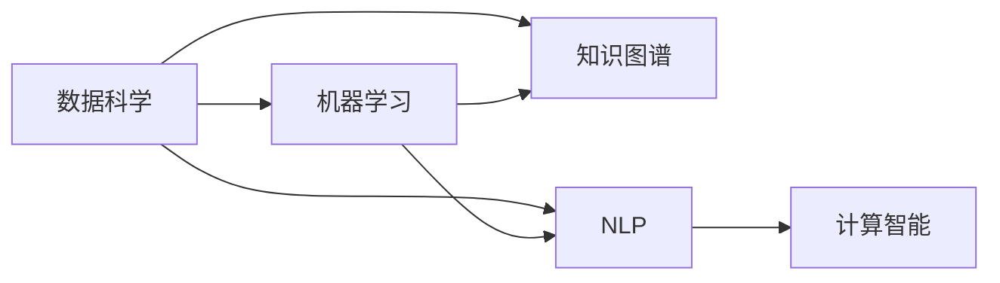

                 

# 推动知识发现与创新：人类计算的智力贡献

在数字时代的浪潮中，人工智能（AI）正以前所未有的速度发展，推动着人类社会的进步与变革。作为AI的重要组成部分，计算智能，尤其是人类计算的智力贡献，正在通过数据驱动和算法创新，极大地推动着知识发现与创新的进程。本文将深入探讨人类计算的智力贡献，从背景介绍、核心概念与联系、核心算法原理与具体操作步骤，到实际应用场景与未来展望，全面解析这一领域的前沿技术与实践。

## 1. 背景介绍

### 1.1 问题由来

随着信息技术的飞速发展，人类社会已进入大数据时代。海量数据和复杂算法的结合，为知识发现与创新提供了前所未有的机会。然而，数据本身的庞杂性、不确定性和非结构性，使得从数据中提取有价值信息的难度极大增加。人类计算的智力贡献，通过智能化算法、高效计算与协作平台，为应对数据挑战、推进知识发现与创新提供了有力支持。

### 1.2 问题核心关键点

人类计算的智力贡献主要体现在以下几个方面：
- **数据处理能力**：通过先进的算法和技术，高效处理海量数据，提取有用信息。
- **模式识别与知识图谱**：从数据中发现规律和模式，构建知识图谱，支持复杂知识推理。
- **智能算法与优化**：利用智能算法优化计算过程，提升计算效率。
- **人机协作与共创**：结合人类智慧与计算能力，实现协作创新。

## 2. 核心概念与联系

### 2.1 核心概念概述

为更好地理解人类计算的智力贡献，我们首先介绍几个核心概念：

- **数据科学（Data Science）**：通过统计学、机器学习和数据挖掘等方法，从大量数据中提取有用信息，并进行数据分析。
- **知识图谱（Knowledge Graph）**：将结构化或非结构化数据转化为语义化知识，构建成知识图谱，以支持复杂知识的推理和查询。
- **机器学习（Machine Learning）**：使用算法和模型，从数据中学习规律，以实现预测、分类、聚类等任务。
- **自然语言处理（Natural Language Processing, NLP）**：让机器理解、处理、生成人类语言，实现人机交互。
- **计算智能（Computational Intelligence）**：结合人工智能与计算技术，实现智能化计算。

这些概念之间存在紧密的联系，共同构成了推动知识发现与创新的技术基础。

### 2.2 核心概念原理和架构的 Mermaid 流程图



这个流程图展示了数据科学、知识图谱、机器学习和自然语言处理之间的联系和交互，以及计算智能在这些技术基础上的综合应用。

## 3. 核心算法原理 & 具体操作步骤

### 3.1 算法原理概述

人类计算的智力贡献，主要通过算法和技术手段，实现数据处理、知识发现和智能推理。核心算法原理包括以下几个方面：

- **特征提取与选择**：从数据中提取关键特征，选择与任务相关的特征。
- **数据清洗与预处理**：清洗数据中的噪声，进行标准化和归一化处理。
- **模型训练与优化**：使用机器学习模型进行训练，并通过交叉验证、正则化等技术进行优化。
- **知识推理与融合**：将知识图谱中的知识与数据融合，进行推理和预测。

### 3.2 算法步骤详解

#### 3.2.1 数据预处理

- **数据清洗**：去除数据中的噪声和异常值，确保数据质量。
- **数据归一化**：对数据进行标准化或归一化处理，确保模型输入的一致性。
- **特征提取**：使用特征提取算法，如PCA、SVD等，从原始数据中提取关键特征。
- **特征选择**：利用特征选择算法，如LASSO、RFE等，选择与任务相关的特征。

#### 3.2.2 模型训练与优化

- **模型选择**：选择合适的机器学习模型，如线性回归、决策树、神经网络等。
- **训练算法**：使用梯度下降、随机森林、支持向量机等算法进行模型训练。
- **交叉验证**：使用交叉验证技术，评估模型性能，避免过拟合。
- **正则化**：应用正则化技术，如L1正则、Dropout等，提升模型泛化能力。
- **超参数调优**：通过网格搜索、随机搜索等方法，优化模型超参数。

#### 3.2.3 知识推理与融合

- **知识图谱构建**：使用知识图谱构建工具，如Neo4j、Protegé等，构建知识图谱。
- **知识推理**：使用知识推理算法，如RDFS、OWL等，进行知识推理。
- **知识融合**：将知识图谱中的知识与数据融合，提升推理效果。

### 3.3 算法优缺点

**优点**：
- **高效性**：通过算法优化，实现数据高效处理和知识发现。
- **泛化能力**：利用机器学习模型，提高模型的泛化能力。
- **灵活性**：通过知识图谱和知识推理，实现灵活的知识推理。

**缺点**：
- **计算复杂性**：处理大规模数据和复杂算法时，计算复杂性较高。
- **数据依赖性**：依赖高质量数据，数据质量影响算法效果。
- **模型解释性**：部分算法模型如深度神经网络，缺乏解释性。

### 3.4 算法应用领域

人类计算的智力贡献广泛应用于以下几个领域：

- **金融分析**：使用数据科学和机器学习算法，进行市场分析和投资策略优化。
- **医疗诊断**：利用知识图谱和NLP技术，辅助医生进行疾病诊断和患者信息管理。
- **智能客服**：结合NLP和知识图谱，实现自然语言理解与智能对话。
- **电子商务**：使用机器学习算法和数据科学，进行推荐系统和价格优化。
- **智能制造**：通过数据科学和计算智能，进行工业设备和生产流程的优化。

## 4. 数学模型和公式 & 详细讲解 & 举例说明

### 4.1 数学模型构建

本节将使用数学语言对人类计算的智力贡献进行更加严格的刻画。

假设我们有一个数据集 $D = \{(x_i, y_i)\}_{i=1}^N$，其中 $x_i$ 为特征向量，$y_i$ 为标签。我们的目标是通过算法，找到最优的模型参数 $\theta$，使得模型 $M_{\theta}(x)$ 在数据集上的预测误差最小。

### 4.2 公式推导过程

使用线性回归模型作为示例，推导最小二乘法的优化公式。

设线性回归模型为 $M_{\theta}(x) = \theta^T \phi(x)$，其中 $\phi(x)$ 为特征映射函数。

最小化均方误差损失函数：
$$
\min_{\theta} \frac{1}{2N} \sum_{i=1}^N (y_i - M_{\theta}(x_i))^2
$$

对上式求导，得到梯度：
$$
\nabla_{\theta}L = \frac{1}{N} \sum_{i=1}^N (y_i - M_{\theta}(x_i)) \phi(x_i)
$$

使用梯度下降算法更新模型参数：
$$
\theta \leftarrow \theta - \eta \nabla_{\theta}L
$$

其中 $\eta$ 为学习率。

### 4.3 案例分析与讲解

以信用评分为例，说明数据科学在金融领域的应用。

假设我们有一个包含个人信用记录的数据集，目标是预测个人信用评分。

1. **数据预处理**：清洗数据，去除缺失值和异常值，进行标准化处理。
2. **特征提取**：选择与信用评分相关的特征，如收入、负债、信用历史等。
3. **模型训练**：使用线性回归模型进行训练，交叉验证选择最优模型。
4. **结果评估**：使用AUC、MSE等指标评估模型性能。

## 5. 项目实践：代码实例和详细解释说明

### 5.1 开发环境搭建

在进行项目实践前，我们需要准备好开发环境。以下是使用Python进行Scikit-learn开发的环境配置流程：

1. 安装Anaconda：从官网下载并安装Anaconda，用于创建独立的Python环境。

2. 创建并激活虚拟环境：
```bash
conda create -n sklearn-env python=3.8 
conda activate sklearn-env
```

3. 安装Scikit-learn：
```bash
conda install scikit-learn
```

4. 安装各类工具包：
```bash
pip install numpy pandas matplotlib seaborn jupyter notebook ipython
```

完成上述步骤后，即可在`sklearn-env`环境中开始项目实践。

### 5.2 源代码详细实现

下面我们以信用评分预测为例，给出使用Scikit-learn库对线性回归模型进行训练的PyTorch代码实现。

首先，定义数据处理函数：

```python
from sklearn.preprocessing import StandardScaler
from sklearn.model_selection import train_test_split
from sklearn.linear_model import LinearRegression
from sklearn.metrics import mean_squared_error, r2_score

def load_data():
    # 加载数据集
    data = pd.read_csv('credit_score.csv')
    X = data[['income', 'debt', 'credit_history', 'bankruptcy', 'education', 'employment']]
    y = data['credit_score']
    return X, y

def preprocess_data(X, y):
    # 数据标准化处理
    scaler = StandardScaler()
    X_scaled = scaler.fit_transform(X)
    # 数据划分
    X_train, X_test, y_train, y_test = train_test_split(X_scaled, y, test_size=0.2, random_state=42)
    return X_train, X_test, y_train, y_test

def train_model(X_train, y_train):
    # 训练线性回归模型
    model = LinearRegression()
    model.fit(X_train, y_train)
    return model

def evaluate_model(model, X_test, y_test):
    # 模型评估
    y_pred = model.predict(X_test)
    mse = mean_squared_error(y_test, y_pred)
    r2 = r2_score(y_test, y_pred)
    print(f'Mean Squared Error: {mse:.2f}')
    print(f'R-squared: {r2:.2f}')
```

然后，启动模型训练和评估流程：

```python
# 加载数据
X, y = load_data()

# 数据预处理
X_train, X_test, y_train, y_test = preprocess_data(X, y)

# 模型训练
model = train_model(X_train, y_train)

# 模型评估
evaluate_model(model, X_test, y_test)
```

以上就是使用Scikit-learn对线性回归模型进行信用评分预测的完整代码实现。可以看到，Scikit-learn库提供了便捷的数据处理、模型训练和评估功能，使得模型开发更加高效。

### 5.3 代码解读与分析

让我们再详细解读一下关键代码的实现细节：

**load_data函数**：
- 定义了加载数据集的函数，从CSV文件中读取数据，并返回特征矩阵和标签向量。

**preprocess_data函数**：
- 定义了数据预处理的函数，包括数据标准化处理、数据划分等。

**train_model函数**：
- 定义了模型训练的函数，使用线性回归模型进行训练。

**evaluate_model函数**：
- 定义了模型评估的函数，计算均方误差和决定系数（R-squared），并打印输出。

**训练流程**：
- 加载数据集
- 进行数据预处理
- 训练线性回归模型
- 评估模型性能

可以看到，Scikit-learn库使得线性回归模型的开发和评估变得非常简便，开发者可以将更多精力放在数据处理和模型改进等高层逻辑上。

## 6. 实际应用场景

### 6.1 智能客服系统

在智能客服系统中，基于知识图谱和自然语言处理技术，可以实现智能对话和问题解答。用户输入问题后，系统通过分析问题语义，从知识图谱中查找相关信息，结合自然语言处理技术，生成并返回最合适的答案。这大大提高了客户服务效率和用户体验。

### 6.2 医疗诊断系统

在医疗诊断系统中，知识图谱和自然语言处理技术可以帮助医生快速准确地诊断疾病。医生输入病人的症状描述，系统通过自然语言处理技术分析症状，从知识图谱中查找相关疾病信息，结合症状进行诊断，生成诊断报告。这不仅提高了诊断速度，还减少了误诊和漏诊。

### 6.3 电子商务推荐系统

在电子商务推荐系统中，基于机器学习算法的推荐模型，可以分析用户行为数据，预测用户兴趣，推荐商品。系统通过分析用户的浏览历史、购买记录和评分，使用协同过滤、内容推荐等技术，生成个性化推荐结果，提高用户满意度。

### 6.4 智能制造系统

在智能制造系统中，通过数据科学和计算智能技术，可以优化工业设备和生产流程。系统通过分析设备运行数据，识别异常情况，预测设备故障，优化生产计划，提高生产效率和产品质量。

## 7. 工具和资源推荐

### 7.1 学习资源推荐

为了帮助开发者系统掌握人类计算的智力贡献的理论基础和实践技巧，这里推荐一些优质的学习资源：

1. 《Python数据科学手册》：详细介绍了Scikit-learn等Python库的使用，适合入门和进阶。
2. 《深度学习》（Goodfellow et al.）：涵盖了深度学习的基本理论和算法，适合深入学习。
3. 《知识图谱：原理、模型与构建》：介绍了知识图谱的基本原理和构建方法，适合了解知识图谱的深入知识。
4. 《自然语言处理综论》（Jurafsky & Martin）：全面介绍了NLP的各个领域，适合全面了解NLP技术。
5. Coursera上的《数据科学专业证书》：由Johns Hopkins大学提供，涵盖数据科学和机器学习的全面知识。

通过对这些资源的学习实践，相信你一定能够快速掌握人类计算的智力贡献的精髓，并用于解决实际的NLP问题。

### 7.2 开发工具推荐

高效的开发离不开优秀的工具支持。以下是几款用于人类计算的智力贡献开发的常用工具：

1. Python：作为数据科学和机器学习的主流语言，Python的生态系统和库资源丰富，适合快速迭代研究。
2. Jupyter Notebook：交互式编程环境，方便进行代码实验和数据可视化。
3. Weights & Biases：实验跟踪工具，记录和可视化模型训练过程中的各项指标，方便对比和调优。
4. TensorBoard：可视化工具，实时监测模型训练状态，并提供丰富的图表呈现方式，是调试模型的得力助手。

合理利用这些工具，可以显著提升人类计算的智力贡献的开发效率，加快创新迭代的步伐。

### 7.3 相关论文推荐

人类计算的智力贡献的发展源于学界的持续研究。以下是几篇奠基性的相关论文，推荐阅读：

1. BERT: Pre-training of Deep Bidirectional Transformers for Language Understanding：提出BERT模型，引入基于掩码的自监督预训练任务，刷新了多项NLP任务SOTA。
2. Attention is All You Need：提出了Transformer结构，开启了NLP领域的预训练大模型时代。
3. AlphaGo Zero: Mastering the Game of Go without Human Knowledge：使用深度强化学习技术，实现了AlphaGo Zero的自主学习和胜利。
4. GANs Trained by a Two Time-Scale Update Rule Converge to a Local Nash Equilibrium：提出GAN（生成对抗网络），开创了生成模型的新纪元。
5. Causal Discovery from Non-Experimental Data：提出因果推理算法，从非实验数据中推断因果关系。

这些论文代表了大模型微调技术的发展脉络。通过学习这些前沿成果，可以帮助研究者把握学科前进方向，激发更多的创新灵感。

## 8. 总结：未来发展趋势与挑战

### 8.1 总结

本文对人类计算的智力贡献进行了全面系统的介绍。首先阐述了数据科学、知识图谱、机器学习和自然语言处理等核心概念，以及它们之间的联系和交互。接着，从算法原理到具体操作步骤，详细讲解了人类计算的智力贡献的实现方法。最后，从实际应用场景和未来展望，展示了这一领域的广泛应用和潜力。

通过本文的系统梳理，可以看到，人类计算的智力贡献正在通过数据科学、知识图谱和智能算法，极大地推动着知识发现与创新的进程。未来，伴随算法的持续演进和技术的不断进步，相信这一领域将迎来更大的突破，为人类社会的进步与变革带来更深远的影响。

### 8.2 未来发展趋势

展望未来，人类计算的智力贡献将呈现以下几个发展趋势：

1. **算法的智能化**：通过引入深度学习、强化学习等算法，实现更加复杂和高效的知识发现与创新。
2. **数据的自动化获取**：利用传感器、摄像头等设备，自动获取海量数据，实现实时数据驱动的智能决策。
3. **知识的结构化与语义化**：构建更加结构化和语义化的知识图谱，提升知识推理和查询的效率。
4. **人机协作的协同创新**：结合人类智慧与计算能力，实现人机协作的协同创新，提升创新效率和效果。
5. **模型的透明性与解释性**：通过可解释性技术，提升模型的透明性和解释性，增强用户信任。

### 8.3 面临的挑战

尽管人类计算的智力贡献已经取得了瞩目成就，但在迈向更加智能化、普适化应用的过程中，仍面临诸多挑战：

1. **数据质量与隐私**：数据质量直接影响算法效果，同时隐私保护也是一个重要问题。
2. **模型的复杂性与可解释性**：大模型如深度神经网络等，缺乏解释性，难以理解和调试。
3. **计算资源与成本**：大规模数据的处理和存储需要大量计算资源和成本，制约着大规模应用。
4. **系统的可扩展性与可靠性**：系统的可扩展性和可靠性，对于大规模部署至关重要。

### 8.4 研究展望

为了克服上述挑战，未来的研究需要在以下几个方面寻求新的突破：

1. **数据治理与隐私保护**：制定数据治理标准，保护用户隐私，提升数据质量。
2. **可解释性与透明性**：发展可解释性技术，提升模型的透明性和解释性。
3. **计算资源的优化**：优化计算资源使用，降低计算成本，提升系统效率。
4. **系统的可扩展性与可靠性**：提升系统的可扩展性和可靠性，支持大规模部署。

这些研究方向的探索，必将引领人类计算的智力贡献迈向更高的台阶，为知识发现与创新提供更加强大的支持。面向未来，我们需要不断地突破技术瓶颈，推动这一领域的持续进步，为人类社会的进步与变革带来深远影响。

## 9. 附录：常见问题与解答

**Q1：人类计算的智力贡献是否适用于所有NLP任务？**

A: 人类计算的智力贡献在大多数NLP任务上都能取得不错的效果，特别是对于数据量较小的任务。但对于一些特定领域的任务，如医学、法律等，仅仅依靠通用语料预训练的模型可能难以很好地适应。此时需要在特定领域语料上进一步预训练，再进行微调，才能获得理想效果。

**Q2：如何缓解人类计算的智力贡献中的计算复杂性问题？**

A: 缓解计算复杂性的方法包括：
- **模型压缩与剪枝**：去除不必要的参数，压缩模型大小。
- **分布式计算**：利用多台计算机进行分布式计算，提升计算效率。
- **高效算法**：使用高效的算法和数据结构，优化计算过程。

**Q3：人类计算的智力贡献在落地部署时需要注意哪些问题？**

A: 将人类计算的智力贡献转化为实际应用，还需要考虑以下因素：
- **模型的裁剪与优化**：去除不必要的层和参数，提升计算效率。
- **算法的可解释性**：增强算法的可解释性，提升用户信任。
- **系统的可扩展性与稳定性**：提升系统的可扩展性和稳定性，支持大规模部署。

**Q4：如何提升人类计算的智力贡献中的模型透明性与解释性？**

A: 提升模型透明性与解释性的方法包括：
- **可解释性技术**：使用可解释性技术，如LIME、SHAP等，提升模型的透明性和解释性。
- **可视化工具**：使用可视化工具，如TensorBoard、Kibana等，进行模型调试和分析。

这些研究方向的探索，必将引领人类计算的智力贡献迈向更高的台阶，为知识发现与创新提供更加强大的支持。面向未来，我们需要不断地突破技术瓶颈，推动这一领域的持续进步，为人类社会的进步与变革带来深远影响。

