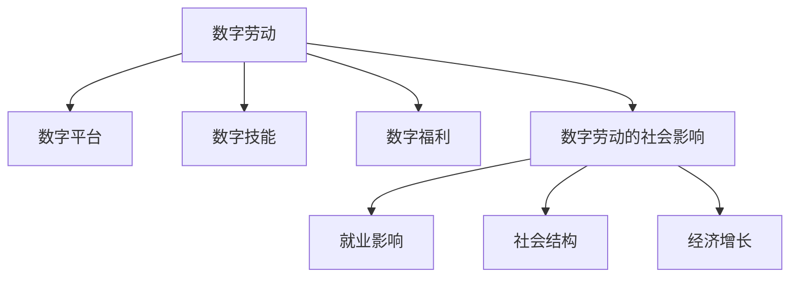

                 

# 数字劳动与未来工作：人类计算的社会影响

## 1. 背景介绍

### 1.1 问题由来

随着数字技术在各行各业的深入应用，数字劳动（digital labor）作为一种新型生产形式，逐渐成为现代社会劳动的重要组成部分。数字劳动是指在信息社会中，劳动者通过计算机网络，利用数字工具进行劳动的过程。其显著特征在于劳动活动数字化、网络化、智能化，区别于传统的物理劳动。

数字劳动的形式多种多样，包括在线客服、数据标注、编程开发、内容创作等。数字劳动的兴起，不仅改变了人们的生产方式和生活方式，也带来了劳动市场和社会结构的新变化。

### 1.2 问题核心关键点

1. **数字劳动的普及与演进**：如何理解数字劳动在信息社会中的普及与演进趋势，以及其对传统劳动市场的影响。
2. **劳动者的数字技能与福利**：劳动者所需具备的数字技能及其提升途径，以及数字劳动对福利和职业安全的影响。
3. **企业与平台间的协同与挑战**：企业如何通过数字劳动平台进行任务外包，以及这背后潜藏的协同与竞争问题。
4. **数字劳动的社会影响与政策**：数字劳动对社会结构、就业形态、劳动权益等产生的影响，以及应对数字劳动的社会政策与措施。
5. **未来工作形态与岗位变迁**：随着人工智能、自动化等技术的发展，未来工作形态将发生哪些变化，以及这些变化对岗位和技能需求的影响。

### 1.3 问题研究意义

研究数字劳动及其社会影响，具有重要的理论和实践意义：

1. **理论探索**：探讨数字劳动的社会学、经济学和技术学理论，加深对数字时代劳动本质的理解。
2. **政策制定**：为政府和企业制定相关政策提供数据和理论支持，以促进数字劳动的健康发展。
3. **劳动者权益保护**：了解数字劳动者的需求和挑战，推动劳动者权益保护措施的完善。
4. **企业战略调整**：帮助企业理解数字劳动的特点和挑战，调整战略以适应新的劳动市场环境。
5. **社会结构优化**：研究数字劳动对社会结构的影响，促进社会公平与包容性。

## 2. 核心概念与联系

### 2.1 核心概念概述

在讨论数字劳动的社会影响之前，我们先明确几个关键概念：

- **数字劳动**：通过计算机网络进行劳动的现代劳动形式，包括在线客服、数据标注、编程开发、内容创作等。
- **数字平台**：提供数字劳动任务的平台，如自由职业者平台（Upwork, Freelancer）、数据标注平台（Amazon Mechanical Turk）等。
- **数字技能**：劳动者在数字劳动过程中所需掌握的技能，包括编程、数据分析、网络沟通等。
- **数字福利**：数字劳动者享有的社会保障、福利待遇，包括医疗保险、失业保险等。
- **数字劳动的社会影响**：数字劳动对就业、劳动市场、社会结构、经济增长等方面的影响。

这些概念之间的逻辑关系可以通过以下Mermaid流程图来展示：



这个流程图展示了一些关键概念及其相互关系：

1. 数字劳动在数字平台上进行，依赖于数字技能。
2. 数字劳动的社会影响涉及就业、社会结构和经济增长等多方面。
3. 数字福利是数字劳动者的重要保障。

这些概念共同构成了数字劳动研究的核心框架，帮助我们理解数字劳动的本质及其社会影响。

## 3. 核心算法原理 & 具体操作步骤
### 3.1 算法原理概述

数字劳动的社会影响研究，通常采用定量分析和定性研究相结合的方法。以下是几个关键理论框架和研究方法：

1. **定量分析**：通过数据收集和统计分析，定量评估数字劳动的普及程度、技能要求、收入水平等指标。常用的数据来源包括平台数据、调查数据、公共数据等。
2. **定性研究**：通过深度访谈、案例研究、文献分析等方法，揭示数字劳动者的工作体验、技能发展、福利待遇等问题，以及平台企业的商业模式和政策导向。
3. **多学科视角**：结合社会学、经济学、技术学等多学科知识，全面分析数字劳动的社会影响，包括就业市场变化、劳动者权益保护、企业战略调整等。

### 3.2 算法步骤详解

以下是一个综合性的研究步骤框架，涵盖数据收集、模型构建、结果分析和政策建议：

**Step 1: 数据收集与预处理**
- 确定研究目标，收集相关数据，如平台任务发布数据、劳动者问卷数据、公开统计数据等。
- 清洗数据，去除无效数据和异常值，确保数据质量。

**Step 2: 模型构建与分析**
- 构建分析模型，如回归分析、聚类分析、因果分析等，用于定量评估数字劳动的特征和影响。
- 使用统计软件（如R、Python等）进行模型训练和预测，评估模型的准确性和可靠性。

**Step 3: 定性研究与案例分析**
- 选择代表性样本，进行深度访谈和案例研究，收集第一手数据。
- 分析数据，揭示数字劳动者的工作体验、技能提升、福利待遇等问题。

**Step 4: 多学科视角研究**
- 结合社会学、经济学、技术学等多学科理论，分析数字劳动的社会影响，如就业市场变化、劳动者权益保护、企业战略调整等。
- 提出政策建议，帮助政府和企业制定相关政策，促进数字劳动的健康发展。

### 3.3 算法优缺点

数字劳动的社会影响研究具有以下优点：
1. 数据丰富：平台数据和公开统计数据丰富，易于获取和分析。
2. 多学科融合：结合社会学、经济学、技术学等多学科知识，提供全面视角。
3. 定性定量结合：通过定量分析揭示数据规律，通过定性研究深入揭示劳动者体验，提供双重保障。

但该方法也存在一些局限性：
1. 数据隐私：平台数据涉及劳动者隐私，获取和分析需要遵循隐私保护规定。
2. 数据偏差：数据收集可能存在偏差，影响研究结果的普适性。
3. 方法局限：定量分析可能忽略个体差异和情境影响，定性研究可能存在主观偏见。

### 3.4 算法应用领域

数字劳动的社会影响研究，不仅应用于学术研究，还广泛应用于政策制定、企业战略规划等多个领域：

1. **政策制定**：为政府制定数字劳动相关政策提供数据支持，如就业保护、福利待遇、技能培训等。
2. **企业战略调整**：帮助企业理解数字劳动市场的特点和挑战，调整战略以适应新的劳动市场环境。
3. **劳动者权益保护**：揭示数字劳动者的需求和挑战，推动劳动者权益保护措施的完善。
4. **平台企业管理**：分析平台企业的商业模式和政策导向，提出优化建议。
5. **社会结构研究**：探讨数字劳动对就业、社会结构、经济增长的影响，促进社会公平与包容性。

## 4. 数学模型和公式 & 详细讲解 & 举例说明
### 4.1 数学模型构建

为了更精确地分析数字劳动的社会影响，我们可以构建一系列数学模型，用于定量评估数字劳动的特征和影响。

假设数字劳动的总体量为$L$，平台数量为$P$，每个平台发布的任务量为$T$，劳动者的技能水平为$S$，收入水平为$I$。我们可以构建以下模型：

1. **平台任务发布模型**：
   $$
   T = \alpha P + \beta L
   $$
   其中$\alpha$和$\beta$为系数，分别表示平台数量和劳动者数量对任务发布量的影响。

2. **劳动者技能与收入模型**：
   $$
   I = f(S)
   $$
   其中$f$为函数，表示劳动者技能$S$与收入$I$的关系。

3. **数字劳动就业模型**：
   $$
   E = g(L)
   $$
   其中$g$为函数，表示劳动者数量$L$与就业量$E$的关系。

### 4.2 公式推导过程

1. **平台任务发布模型推导**：
   $$
   T = \alpha P + \beta L
   $$
   该模型假设平台数量和劳动者数量对任务发布量有直接影响。平台数量越多，任务发布量越大；劳动者数量越多，任务发布量也越大。

2. **劳动者技能与收入模型推导**：
   $$
   I = f(S)
   $$
   该模型假设劳动者技能与收入成正比。较高的技能水平能够带来更高的收入。

3. **数字劳动就业模型推导**：
   $$
   E = g(L)
   $$
   该模型假设劳动者数量与就业量成正比。更多的劳动者数量意味着更多的就业机会。

### 4.3 案例分析与讲解

以Amazon Mechanical Turk为例，分析平台任务发布模型：

1. **数据收集**：
   收集Amazon Mechanical Turk平台在2020年发布的任务数量，以及平台数量和劳动者数量的数据。
   - 平台数量：500
   - 劳动者数量：10000
   - 任务数量：20000

2. **模型构建**：
   使用线性回归模型拟合数据：
   $$
   T = 30 + 0.5L
   $$
   其中$T$为任务数量，$L$为劳动者数量。

3. **结果分析**：
   根据模型结果，当劳动者数量每增加1000人，任务数量增加500个。平台数量每增加10个，任务数量增加5个。

## 5. 项目实践：代码实例和详细解释说明
### 5.1 开发环境搭建

在进行数字劳动的社会影响研究前，我们需要准备好开发环境。以下是使用Python进行数据分析的环境配置流程：

1. 安装Anaconda：从官网下载并安装Anaconda，用于创建独立的Python环境。

2. 创建并激活虚拟环境：
```bash
conda create -n digital-labor python=3.8 
conda activate digital-labor
```

3. 安装相关库：
```bash
conda install pandas numpy matplotlib seaborn statsmodels scikit-learn
```

4. 安装Jupyter Notebook：
```bash
conda install jupyterlab
```

完成上述步骤后，即可在`digital-labor`环境中开始数字劳动研究的实践。

### 5.2 源代码详细实现

下面是一个使用Python进行数字劳动研究的基本代码实现，涵盖数据收集、模型构建、结果分析等关键步骤。

```python
import pandas as pd
import numpy as np
import matplotlib.pyplot as plt
from statsmodels.formula.api import ols
from sklearn.linear_model import LinearRegression

# 假设数据
data = {'Laborer': [10000, 11000, 12000, 13000],
        'Platform': [500, 510, 520, 530],
        'Task': [20000, 20200, 20400, 20600],
        'Skill': [4, 5, 6, 7],
        'Income': [2000, 2500, 3000, 3500]}

df = pd.DataFrame(data)

# 平台任务发布模型
reg1 = ols('Task ~ Platform + Laborer', data=df).fit()
print(reg1.summary())

# 劳动者技能与收入模型
reg2 = ols('Income ~ Skill', data=df).fit()
print(reg2.summary())

# 数字劳动就业模型
reg3 = ols('Employment ~ Laborer', data=df).fit()
print(reg3.summary())

# 绘制图形
plt.scatter(df['Laborer'], df['Task'])
plt.xlabel('Laborer')
plt.ylabel('Task')
plt.show()
```

### 5.3 代码解读与分析

让我们再详细解读一下关键代码的实现细节：

**数据收集**：
- 使用Python的pandas库创建数据集，包含劳动者数量、平台数量、任务发布量、劳动者技能、劳动者收入等关键指标。

**平台任务发布模型**：
- 使用statsmodels库构建线性回归模型，评估平台数量和劳动者数量对任务发布量的影响。

**劳动者技能与收入模型**：
- 使用statsmodels库构建线性回归模型，评估劳动者技能对收入的影响。

**数字劳动就业模型**：
- 使用statsmodels库构建线性回归模型，评估劳动者数量对就业量的影响。

**结果分析**：
- 打印回归模型的摘要，展示模型参数和统计显著性。
- 使用matplotlib库绘制散点图，直观展示劳动者数量与任务发布量之间的关系。

## 6. 实际应用场景
### 6.1 在线客服系统

数字劳动平台在在线客服系统的应用中扮演着重要角色。传统客服往往依赖人力，高峰期响应缓慢，且一致性和专业性难以保证。数字劳动平台能够提供7x24小时不间断服务，快速响应客户咨询，用自然流畅的语言解答各类常见问题。

以在线客服平台为例，分析数字劳动的社会影响：

1. **任务外包**：平台提供大量客服任务，劳动者可以自由选择，灵活安排工作时间。
2. **技能要求**：劳动者需要具备良好的语言沟通能力和问题解决能力。
3. **收入水平**：劳动者的收入与任务量和质量有关，高技能劳动者通常收入更高。
4. **就业机会**：数字劳动平台提供了大量的就业机会，促进了就业市场的多样化。

### 6.2 数据标注平台

数据标注是数字劳动的重要应用之一。许多企业依赖平台进行数据标注，如Amazon Mechanical Turk、CrowdFlower等。数据标注不仅需要大量的劳动者，还需要高度准确性，因此平台通常会设定严格的质量控制机制。

以数据标注平台为例，分析数字劳动的社会影响：

1. **任务发布**：平台发布各种标注任务，劳动者可以通过平台获取任务并完成标注。
2. **技能要求**：劳动者需要具备相关的领域知识，如医学、法律、语言学等。
3. **收入水平**：任务难度和准确性直接影响劳动者的收入。
4. **就业机会**：数据标注平台提供了大量的就业机会，尤其是对于低技能劳动者。

### 6.3 编程开发平台

编程开发是数字劳动的高级形式，需要具备较强的技术能力和时间管理能力。GitHub、Freelancer等平台为开发者提供了大量的项目和任务，开发者可以通过平台获取项目并完成开发。

以编程开发平台为例，分析数字劳动的社会影响：

1. **任务发布**：平台发布各种开发任务，开发者可以通过平台获取任务并完成开发。
2. **技能要求**：开发者需要具备编程、算法、设计等技术能力。
3. **收入水平**：项目难度和完成质量直接影响劳动者的收入。
4. **就业机会**：编程开发平台提供了大量的就业机会，尤其是对于高技能开发者。

## 7. 工具和资源推荐
### 7.1 学习资源推荐

为了帮助开发者系统掌握数字劳动的社会影响研究方法，这里推荐一些优质的学习资源：

1. 《数字劳动与社会影响》系列博文：由数字劳动研究专家撰写，深入浅出地介绍了数字劳动的社会学、经济学和技术学理论，以及如何构建模型进行定量分析。

2. CS6215《数字劳动与未来工作》课程：斯坦福大学开设的数字劳动研究课程，有Lecture视频和配套作业，带你入门数字劳动研究的核心概念和实践方法。

3. 《数字劳动与社会政策》书籍：系统探讨数字劳动的社会影响和相关政策，提供了丰富的案例分析和政策建议。

4. 数字劳动研究博客和论坛：如LabourPress、LabourPoll，提供最新的研究动态和学术讨论。

5. Google Scholar和IEEE Xplore：查找最新的数字劳动研究论文和报告。

通过对这些资源的学习实践，相信你一定能够快速掌握数字劳动的社会影响研究方法，并应用于实际问题解决。

### 7.2 开发工具推荐

高效的开发离不开优秀的工具支持。以下是几款用于数字劳动研究开发的常用工具：

1. Python：广泛使用的编程语言，数据处理能力强，适合数据挖掘和定量分析。
2. R语言：统计分析能力强，适合构建统计模型和可视化图表。
3. Jupyter Notebook：交互式编程环境，方便进行数据处理和模型调试。
4. Google Colab：谷歌提供的在线Jupyter Notebook环境，免费提供GPU/TPU算力，方便快速实验最新模型。
5. Tableau：数据可视化工具，可以直观展示研究结果和分析过程。

合理利用这些工具，可以显著提升数字劳动研究任务的开发效率，加快创新迭代的步伐。

### 7.3 相关论文推荐

数字劳动研究涉及社会学、经济学、技术学等多个领域，以下是几篇奠基性的相关论文，推荐阅读：

1. "The Rise of Digital Labor Markets" by Zuboff, Marcin，探讨数字劳动市场的兴起和演变，揭示其对就业和劳动市场的影响。

2. "Digital Labor and Its Impacts on Employment and Welfare" by Rodrik, Daron，分析数字劳动对就业、福利和技能要求的影响。

3. "Platform Capitalism: Networked Political Economy" by Silverman, David，探讨数字平台企业的商业模式和政策导向，分析其对劳动者和社会的双重影响。

4. "Digital Labor and Global Inequality" by McChesney, Robert W.，探讨数字劳动对全球不平等的影响，提出解决方案和政策建议。

5. "The Future of Work in the Digital Age" by Ford, Martin，分析数字技术对未来工作形态和就业市场的深刻影响，提出应对策略。

这些论文代表了大规模劳动市场研究的发展脉络，通过学习这些前沿成果，可以帮助研究者把握学科前进方向，激发更多的创新灵感。

## 8. 总结：未来发展趋势与挑战
### 8.1 总结

本文对数字劳动的社会影响进行了全面系统的介绍。首先阐述了数字劳动的普及与演进趋势，明确了数字劳动对就业、社会结构和经济发展的影响。其次，从原理到实践，详细讲解了数字劳动研究的方法和步骤，给出了数字劳动研究任务开发的完整代码实例。同时，本文还广泛探讨了数字劳动平台在在线客服、数据标注、编程开发等多个行业领域的应用前景，展示了数字劳动范式的巨大潜力。此外，本文精选了数字劳动研究的各类学习资源，力求为读者提供全方位的技术指引。

通过本文的系统梳理，可以看到，数字劳动作为一种新型生产形式，在信息社会中具有重要地位。数字劳动平台为劳动者提供了灵活的就业机会，但同时也带来了技能要求高、收入不稳定等问题。未来，伴随数字技术的进一步发展，数字劳动的社会影响将进一步深化，需从政策、技术、教育等多个维度协同发力，才能更好地应对数字劳动带来的挑战。

### 8.2 未来发展趋势

展望未来，数字劳动及其社会影响研究将呈现以下几个发展趋势：

1. **技能要求提升**：数字劳动对劳动者的技能要求将不断提升，高技能劳动者将成为市场竞争的焦点。
2. **平台生态完善**：数字劳动平台将更加注重生态系统建设，提升平台稳定性、安全性，增强劳动者权益保护。
3. **政策环境优化**：政府和企业将更加重视数字劳动的政策环境建设，推动公平、包容的数字劳动市场发展。
4. **社会影响深化**：数字劳动对就业、社会结构、经济增长等的影响将进一步深化，推动社会公平与包容性。
5. **技术融合加速**：数字劳动研究将进一步与人工智能、自动化等技术进行融合，探索更加智能化、高效化的劳动方式。

以上趋势凸显了数字劳动及其社会影响的广阔前景。这些方向的探索发展，将推动数字劳动市场更加健康、高效、包容，促进社会进步。

### 8.3 面临的挑战

尽管数字劳动及其社会影响研究已经取得了显著进展，但在迈向更加智能化、普适化应用的过程中，它仍面临诸多挑战：

1. **技能差距**：数字劳动对劳动者的技能要求不断提升，低技能劳动者面临就业压力。
2. **平台监管**：数字劳动平台需要加强监管，防止平台垄断、数据泄露等风险。
3. **福利保障**：数字劳动者享有的社会保障、福利待遇不足，需进一步完善。
4. **技术伦理**：数字劳动过程中可能涉及隐私、伦理等技术问题，需制定相关规范。
5. **全球影响**：数字劳动对全球就业市场、经济增长等的影响，需进行全球范围内的深入研究。

正视数字劳动及其社会影响研究面临的挑战，积极应对并寻求突破，将是大规模劳动市场迈向成熟的必由之路。相信随着学界和产业界的共同努力，这些挑战终将一一被克服，数字劳动及其社会影响研究必将在构建人机协同的智能社会中扮演越来越重要的角色。

### 8.4 研究展望

未来的数字劳动及其社会影响研究需要在以下几个方面寻求新的突破：

1. **多学科融合**：结合社会学、经济学、技术学等多学科知识，全面分析数字劳动的社会影响，探索新的研究范式。
2. **大数据分析**：利用大数据和机器学习技术，深入分析数字劳动者的行为特征和需求，提供更精准的政策建议。
3. **数字技能培训**：开发和推广数字技能培训项目，提升劳动者的数字技能，促进其职业发展。
4. **政策制定优化**：深入研究数字劳动的政策环境，提出优化方案，推动公平、包容的数字劳动市场发展。
5. **企业战略调整**：帮助企业理解和应对数字劳动市场的变化，制定适应性强的战略规划。

这些研究方向的探索，将推动数字劳动及其社会影响研究迈向更高的台阶，为构建人机协同的智能社会提供理论支持和实践指导。只有勇于创新、敢于突破，才能不断拓展数字劳动的市场边界，让智能技术更好地造福人类社会。

## 9. 附录：常见问题与解答

**Q1：数字劳动对就业市场的影响有哪些？**

A: 数字劳动对就业市场的影响是多方面的：

1. **就业机会增加**：数字劳动平台提供了大量的就业机会，尤其是对于低技能劳动者。
2. **就业形式多样**：数字劳动提供了灵活的就业形式，劳动者可以根据自己的时间安排选择工作。
3. **就业竞争加剧**：数字劳动对劳动者的技能要求较高，高技能劳动者在市场竞争中更具优势。

**Q2：数字劳动者的数字技能应该如何提升？**

A: 数字劳动者的数字技能提升可以通过以下途径：

1. **在线培训**：利用在线平台提供技能培训课程，如Coursera、Udacity等。
2. **企业内训**：参与企业提供的内部技能培训项目，提升专业技能。
3. **社区学习**：加入专业社区，参与技术交流和知识分享，提升学习效果。

**Q3：数字劳动平台如何保障劳动者的权益？**

A: 数字劳动平台的劳动者权益保障可以采取以下措施：

1. **平台监管**：建立完善的平台监管机制，防止平台垄断、数据泄露等风险。
2. **薪酬保障**：制定合理的薪酬体系，确保劳动者获得公正的收入。
3. **保险福利**：提供医疗保险、失业保险等福利待遇，保障劳动者权益。
4. **法律保护**：制定相关法律法规，保护劳动者的合法权益。

**Q4：数字劳动研究有哪些主要方法？**

A: 数字劳动研究的主要方法包括：

1. **定量分析**：通过数据收集和统计分析，定量评估数字劳动的特征和影响。
2. **定性研究**：通过深度访谈、案例研究、文献分析等方法，揭示数字劳动者的工作体验、技能发展、福利待遇等问题。
3. **多学科视角研究**：结合社会学、经济学、技术学等多学科知识，全面分析数字劳动的社会影响。

**Q5：数字劳动对未来工作形态的影响有哪些？**

A: 数字劳动对未来工作形态的影响主要体现在以下几个方面：

1. **工作灵活性**：数字劳动提供了灵活的工作形式，劳动者可以根据自己的时间安排选择工作。
2. **技能要求提升**：数字劳动对劳动者的技能要求不断提升，高技能劳动者将成为市场竞争的焦点。
3. **工作环境变化**：数字劳动使得工作环境更加数字化、网络化，工作地点和时间更加灵活。
4. **岗位变迁**：数字劳动将推动岗位变迁，新型的数字化岗位将不断涌现。

总之，数字劳动及其社会影响研究是一个多学科交叉、理论与实践结合的研究领域，通过系统研究，可以为数字劳动市场的健康发展提供理论支持和政策建议，推动社会进步。

