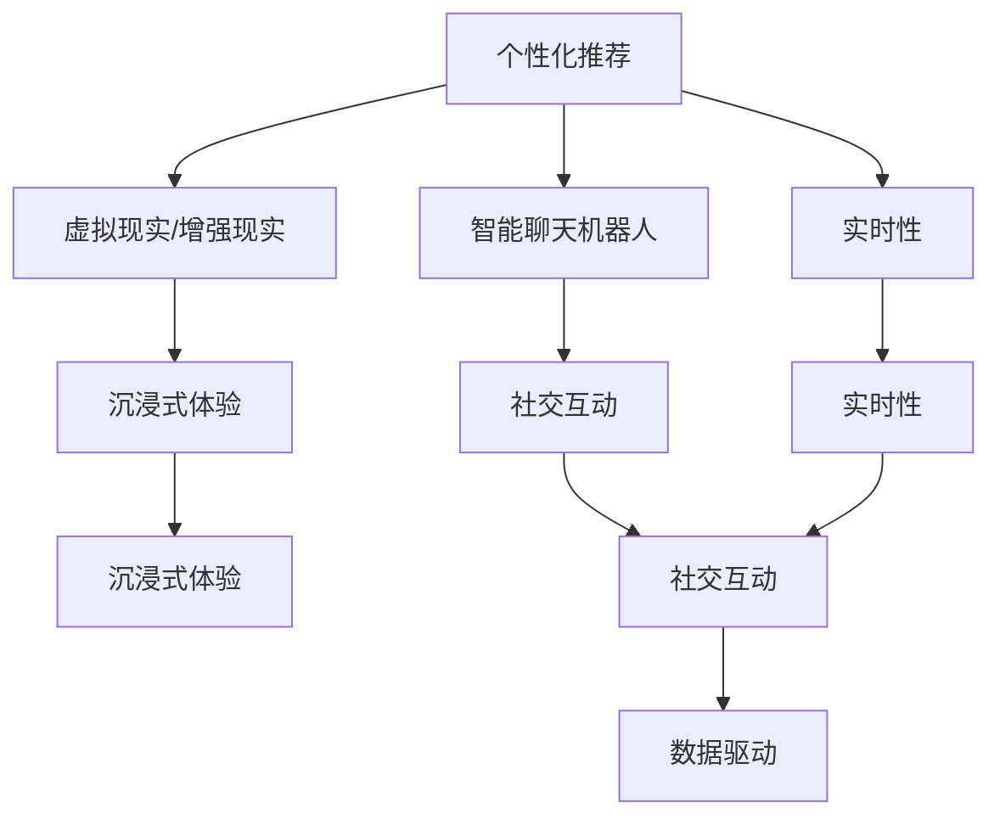

                 

# 数字化休闲：AI重塑娱乐方式

> 关键词：数字化休闲,人工智能,娱乐方式,沉浸式体验,个性化推荐,社交互动,实时性,数据驱动

## 1. 背景介绍

### 1.1 问题由来
数字化休闲正在成为现代生活的重要组成部分。在数字技术的推动下，人们能够以更丰富、便捷、个性化的方式享受休闲娱乐。人工智能（AI）作为数字化休闲的关键技术之一，通过深度学习、自然语言处理等手段，深刻改变了娱乐行业的运营模式，为用户提供了前所未有的体验。

当前，数字化休闲面临着市场竞争激烈、用户需求多样化、个性化需求上升等挑战。AI技术的应用，为这些挑战提供了新的解决路径。通过智能推荐系统、虚拟现实（VR）/增强现实（AR）、游戏AI等，AI技术不仅提升了休闲娱乐的体验，还推动了相关产业链的数字化转型。

### 1.2 问题核心关键点
AI在数字化休闲中的应用，主要围绕以下几个核心点展开：

1. **个性化推荐**：基于用户历史行为数据，AI算法能够精准预测用户偏好，提供个性化推荐，提升用户体验。
2. **沉浸式体验**：通过虚拟现实（VR）/增强现实（AR）技术，AI能够创造沉浸式互动环境，让用户深度参与。
3. **社交互动**：AI可以通过自然语言处理技术，使智能聊天机器人等应用能够与用户进行高效互动，提升社交体验。
4. **实时性**：AI算法能够实时处理和响应用户需求，提升娱乐内容的实时性和互动性。
5. **数据驱动**：AI技术能够利用大数据分析和用户反馈，不断优化推荐模型和娱乐内容，实现自我进化的智能系统。

本文将详细探讨AI在数字化休闲中的应用，从技术原理到实践方法，再到实际应用场景，全面解析AI如何重塑娱乐方式。

## 2. 核心概念与联系

### 2.1 核心概念概述

为更好地理解AI在数字化休闲中的应用，本节将介绍几个核心概念：

- **个性化推荐系统**：基于用户行为数据，推荐系统能够准确预测用户偏好，提供个性化内容。
- **虚拟现实（VR）/增强现实（AR）**：通过模拟真实世界环境，VR/AR技术提供了沉浸式体验，让用户能够身临其境地参与。
- **智能聊天机器人**：利用自然语言处理技术，智能聊天机器人能够理解并回应用户的自然语言输入，实现高效互动。
- **实时性**：AI算法能够实时处理和响应用户需求，提升娱乐内容的实时性和互动性。
- **数据驱动**：AI技术能够利用大数据分析和用户反馈，不断优化推荐模型和娱乐内容，实现自我进化的智能系统。

这些核心概念之间的逻辑关系可以通过以下Mermaid流程图来展示：



这个流程图展示了一系列核心概念及其之间的关系：

1. 个性化推荐是VR/AR和智能聊天机器人等应用的基础，通过精准推荐，提高用户体验和互动性。
2. VR/AR技术提供了沉浸式体验，增强用户的参与感和沉浸感。
3. 智能聊天机器人利用自然语言处理技术，实现了高效的人机互动，提升了社交体验。
4. 实时性提升了娱乐内容的即时性和互动性，使得AI系统能够快速响应用户需求。
5. 数据驱动的AI系统，通过大数据分析和用户反馈，不断优化推荐和互动策略，实现自我进化。

## 3. 核心算法原理 & 具体操作步骤

### 3.1 算法原理概述

AI在数字化休闲中的应用，主要基于以下几个关键技术：

1. **协同过滤**：利用用户历史行为数据，预测用户偏好，实现个性化推荐。
2. **深度学习**：通过神经网络模型，学习用户行为模式，提升推荐系统的精度。
3. **自然语言处理（NLP）**：通过语言模型、情感分析等技术，使智能聊天机器人能够理解并回应用户输入。
4. **生成对抗网络（GAN）**：用于生成高质量的虚拟现实（VR）/增强现实（AR）内容，增强沉浸式体验。
5. **强化学习**：用于优化智能聊天机器人的响应策略，提升互动质量。

### 3.2 算法步骤详解

AI在数字化休闲中的应用主要包括以下几个关键步骤：

**Step 1: 数据收集与预处理**
- 收集用户行为数据，如浏览记录、评分反馈、互动日志等。
- 清洗和处理数据，去除噪声，规范化数据格式。

**Step 2: 模型训练与优化**
- 选择合适的推荐算法（如协同过滤、深度学习等），训练推荐模型。
- 使用交叉验证等技术，优化模型参数，提高推荐精度。

**Step 3: 实时推荐与互动**
- 将训练好的推荐模型应用于实时推荐系统中，根据用户行为数据生成个性化推荐。
- 利用自然语言处理技术，使智能聊天机器人能够理解并回应用户的自然语言输入。

**Step 4: 用户体验优化**
- 利用用户反馈，不断优化推荐和互动策略，提升用户体验。
- 通过数据分析，识别用户需求和兴趣变化，调整推荐内容。

### 3.3 算法优缺点

AI在数字化休闲中的应用，具有以下优点：

1. **提升用户体验**：通过个性化推荐和实时响应，提升用户满意度。
2. **增强沉浸感**：VR/AR技术提供沉浸式体验，增强用户参与感。
3. **优化社交互动**：智能聊天机器人提升人机互动质量，改善社交体验。
4. **实时响应**：实时推荐和互动，提升娱乐内容的即时性。
5. **数据驱动优化**：通过大数据分析和用户反馈，持续优化推荐和互动策略。

同时，该方法也存在一些局限性：

1. **隐私问题**：收集和处理用户数据可能涉及隐私问题，需要严格遵守数据保护法规。
2. **数据质量**：推荐和互动的效果很大程度上依赖于数据质量，不准确的数据可能导致误导性推荐。
3. **算法复杂性**：深度学习等复杂算法对计算资源要求高，需要高性能硬件支持。
4. **可解释性不足**：AI模型的决策过程缺乏可解释性，难以理解和调试。
5. **成本高昂**：大规模数据和模型的训练和部署需要较高的成本投入。

尽管存在这些局限性，但就目前而言，AI在数字化休闲中的应用，仍为行业带来了显著的变革和提升。未来相关研究的重点在于如何进一步降低隐私和安全风险，提高模型的可解释性和算法效率，同时兼顾用户体验和成本控制。

### 3.4 算法应用领域

AI在数字化休闲中的应用已经覆盖了多个领域，例如：

- **在线视频平台**：如Netflix、YouTube等，通过个性化推荐和实时互动，提升用户粘性和满意度。
- **电子游戏**：如《王者荣耀》、《绝地求生》等，利用AI技术提升游戏AI、实时互动和个性化推荐。
- **虚拟现实（VR）/增强现实（AR）内容**：如VR社交平台、AR教育应用等，通过生成对抗网络（GAN）等技术，提供高质量的沉浸式体验。
- **智能聊天机器人**：如智能客服、在线助手等，通过自然语言处理技术，实现高效人机互动。
- **个性化音乐推荐**：如Spotify、Apple Music等，通过深度学习技术，提供个性化的音乐推荐。

除了上述这些应用外，AI在数字化休闲中的创新应用还在不断涌现，如虚拟旅游、虚拟试衣镜、虚拟演唱会等，为娱乐体验带来了全新的视角。

## 4. 数学模型和公式 & 详细讲解 & 举例说明

### 4.1 数学模型构建

本节将使用数学语言对AI在数字化休闲中的应用进行更加严格的刻画。

假设用户行为数据集为 $D=\{(x_i,y_i)\}_{i=1}^N$，其中 $x_i$ 为用户历史行为，$y_i$ 为用户偏好标签。

定义推荐系统为 $F_{\theta}(x)$，其中 $\theta$ 为推荐模型参数。推荐系统的目标是最小化用户与推荐内容之间的误差，即：

$$
\min_{\theta} \sum_{i=1}^N \ell(F_{\theta}(x_i), y_i)
$$

其中 $\ell$ 为损失函数，用于衡量推荐系统预测结果与用户偏好之间的差异。

### 4.2 公式推导过程

以下我们以协同过滤推荐系统为例，推导其推荐公式及其优化过程。

假设用户 $u$ 的历史行为为 $x_u$，推荐系统根据历史行为数据预测用户 $u$ 的偏好，生成推荐列表 $L_u$。推荐系统通过用户 $u$ 的评分反馈，评估推荐列表的质量，定义为 $R_u(L_u)$。推荐系统的优化目标是最小化推荐误差，即：

$$
\min_{\theta} \sum_{u=1}^U \ell(R_u(L_u), y_u)
$$

其中 $U$ 为所有用户的数量。

协同过滤算法主要分为基于用户的协同过滤和基于物品的协同过滤。以下以基于用户的协同过滤为例，推导推荐公式。

假设用户 $u$ 与用户 $v$ 的相似度为 $S_{uv}$，用户 $u$ 对物品 $i$ 的评分与用户 $v$ 的评分相似度为 $P_{iu,v}$。基于用户的协同过滤推荐公式为：

$$
R_u(L_u) = \sum_{i=1}^M \alpha_i P_{iu,v}
$$

其中 $\alpha_i$ 为物品 $i$ 的权重，$M$ 为物品数量。推荐系统目标是最小化推荐误差，即：

$$
\min_{\theta} \sum_{u=1}^U \sum_{i=1}^M \alpha_i (y_i - \sum_{j=1}^N S_{uj} P_{ij,v})
$$

通过梯度下降等优化算法，求解上述最小化问题，即可得到推荐系统参数 $\theta$。

### 4.3 案例分析与讲解

**案例：Netflix推荐系统**

Netflix的推荐系统采用了基于协同过滤的算法。通过收集用户的历史观看记录和评分数据，Netflix能够精准预测用户对新内容的偏好，提供个性化的推荐。Netflix的推荐系统具有以下特点：

1. **数据驱动**：Netflix通过大规模用户行为数据，训练推荐模型，提升推荐精度。
2. **实时更新**：Netflix的推荐系统能够实时更新，根据用户实时行为数据调整推荐策略。
3. **个性化推荐**：Netflix能够根据用户偏好和行为，提供高度个性化的推荐内容。
4. **多模态融合**：Netflix不仅考虑用户行为数据，还利用了内容元数据、用户评分等多模态信息，提升推荐效果。

Netflix的推荐系统通过持续优化和迭代，已经成为了行业标杆。

## 5. 项目实践：代码实例和详细解释说明

### 5.1 开发环境搭建

在进行AI在数字化休闲中的应用实践前，我们需要准备好开发环境。以下是使用Python进行PyTorch开发的环境配置流程：

1. 安装Anaconda：从官网下载并安装Anaconda，用于创建独立的Python环境。

2. 创建并激活虚拟环境：
```bash
conda create -n pytorch-env python=3.8 
conda activate pytorch-env
```

3. 安装PyTorch：根据CUDA版本，从官网获取对应的安装命令。例如：
```bash
conda install pytorch torchvision torchaudio cudatoolkit=11.1 -c pytorch -c conda-forge
```

4. 安装各类工具包：
```bash
pip install numpy pandas scikit-learn matplotlib tqdm jupyter notebook ipython
```

完成上述步骤后，即可在`pytorch-env`环境中开始实践。

### 5.2 源代码详细实现

下面我们以Netflix推荐系统为例，给出使用PyTorch进行推荐系统开发的PyTorch代码实现。

首先，定义推荐系统的数据处理函数：

```python
from torch.utils.data import Dataset
import torch

class RecommendationDataset(Dataset):
    def __init__(self, users, items, ratings, num_users, num_items):
        self.users = users
        self.items = items
        self.ratings = ratings
        self.num_users = num_users
        self.num_items = num_items
        
    def __len__(self):
        return len(self.users)
    
    def __getitem__(self, item):
        user = self.users[item]
        item = self.items[item]
        rating = self.ratings[item]
        
        return {'user': user,
                'item': item,
                'rating': rating}
```

然后，定义模型和优化器：

```python
from torch.nn import Embedding, Linear, BCELoss
from torch.optim import Adam

# 定义模型
num_users = 1000
num_items = 1000

user_embedding_dim = 50
item_embedding_dim = 50

user_embedding = Embedding(num_users, user_embedding_dim)
item_embedding = Embedding(num_items, item_embedding_dim)

user_input = user_embedding(user)
item_input = item_embedding(item)

user_item_similarity = torch.matmul(user_input, item_input.t())
rating = Linear(user_item_similarity, 1)
loss = BCELoss()

# 定义优化器
optimizer = Adam([{'params': user_embedding.parameters()}, 
                 {'params': item_embedding.parameters()}], lr=0.001)
```

接着，定义训练和评估函数：

```python
from torch.utils.data import DataLoader
from tqdm import tqdm

device = torch.device('cuda') if torch.cuda.is_available() else torch.device('cpu')
model.to(device)

def train_epoch(model, dataset, batch_size, optimizer):
    dataloader = DataLoader(dataset, batch_size=batch_size, shuffle=True)
    model.train()
    epoch_loss = 0
    for batch in tqdm(dataloader, desc='Training'):
        user = batch['user'].to(device)
        item = batch['item'].to(device)
        rating = batch['rating'].to(device)
        model.zero_grad()
        outputs = model(user, item)
        loss = outputs.mean()
        epoch_loss += loss.item()
        loss.backward()
        optimizer.step()
    return epoch_loss / len(dataloader)

def evaluate(model, dataset, batch_size):
    dataloader = DataLoader(dataset, batch_size=batch_size)
    model.eval()
    mse = 0
    for batch in tqdm(dataloader, desc='Evaluating'):
        user = batch['user'].to(device)
        item = batch['item'].to(device)
        rating = batch['rating'].to(device)
        outputs = model(user, item)
        mse += ((outputs - rating) ** 2).mean().item()
    
    return mse
```

最后，启动训练流程并在测试集上评估：

```python
epochs = 5
batch_size = 16

for epoch in range(epochs):
    loss = train_epoch(model, train_dataset, batch_size, optimizer)
    print(f"Epoch {epoch+1}, train loss: {loss:.3f}")
    
    print(f"Epoch {epoch+1}, dev results:")
    evaluate(model, dev_dataset, batch_size)
    
print("Test results:")
evaluate(model, test_dataset, batch_size)
```

以上就是使用PyTorch对Netflix推荐系统进行开发的完整代码实现。可以看到，得益于PyTorch的强大封装，我们能够用相对简洁的代码实现协同过滤推荐系统的基本功能。

### 5.3 代码解读与分析

让我们再详细解读一下关键代码的实现细节：

**RecommendationDataset类**：
- `__init__`方法：初始化用户、物品和评分等关键组件。
- `__len__`方法：返回数据集的样本数量。
- `__getitem__`方法：对单个样本进行处理，将用户和物品作为输入，生成评分预测。

**模型定义**：
- 定义用户和物品的嵌入层，用于将用户和物品映射到高维空间。
- 计算用户和物品的相似度矩阵，通过线性层预测评分。
- 定义损失函数为二元交叉熵损失，用于衡量预测评分与真实评分之间的差异。

**优化器定义**：
- 使用Adam优化器，分别对用户和物品的嵌入层进行优化。

**训练和评估函数**：
- 使用PyTorch的DataLoader对数据集进行批次化加载，供模型训练和推理使用。
- 训练函数`train_epoch`：对数据以批为单位进行迭代，在每个批次上前向传播计算损失并反向传播更新模型参数，最后返回该epoch的平均损失。
- 评估函数`evaluate`：与训练类似，不同点在于不更新模型参数，并在每个批次结束后将预测和标签结果存储下来，最后使用mse损失函数对整个评估集的预测结果进行打印输出。

**训练流程**：
- 定义总的epoch数和batch size，开始循环迭代
- 每个epoch内，先在训练集上训练，输出平均loss
- 在验证集上评估，输出mse损失
- 所有epoch结束后，在测试集上评估，给出最终测试结果

可以看到，PyTorch配合TensorFlow等深度学习框架，使得推荐系统的开发变得简单高效。开发者可以将更多精力放在模型改进、算法优化等高层逻辑上，而不必过多关注底层的实现细节。

当然，工业级的系统实现还需考虑更多因素，如模型的保存和部署、超参数的自动搜索、更灵活的任务适配层等。但核心的推荐范式基本与此类似。

## 6. 实际应用场景
### 6.1 智能聊天机器人

智能聊天机器人已经成为数字化休闲的重要组成部分。通过自然语言处理技术，聊天机器人能够理解并回应用户的自然语言输入，提供高效的互动体验。

在技术实现上，可以基于语言模型（如GPT-3、BERT等）训练聊天机器人，使其具备语言理解能力。然后通过对话数据集对其进行微调，提升其对话生成的质量和多样性。微调后的聊天机器人能够处理复杂的用户输入，提供个性化的回复，提升用户体验。

**案例：智能客服**

许多企业利用智能聊天机器人提升客户服务效率。通过微调聊天机器人，使其能够理解用户问题并提供准确的回答，减轻客服人员的工作负担。例如，电商平台可以通过智能聊天机器人处理常见问题，如订单查询、物流追踪等，提升客户满意度。

### 6.2 虚拟现实（VR）/增强现实（AR）内容

VR/AR技术通过模拟真实世界环境，提供了沉浸式体验，增强了用户的参与感和互动性。在数字化休闲中，VR/AR内容已经被广泛应用于游戏、教育、旅游等多个领域。

在技术实现上，可以基于生成对抗网络（GAN）等技术，生成高质量的VR/AR内容。例如，在游戏场景中，可以使用GAN生成逼真的虚拟角色和环境，提升游戏的沉浸感和互动性。在旅游领域，可以通过VR技术模拟旅游景点，提供虚拟旅游体验，弥补实际旅游的局限性。

**案例：虚拟旅游**

许多旅游公司利用VR技术提供虚拟旅游体验。通过生成高质量的虚拟场景和互动内容，VR技术使得用户能够身临其境地游览名胜古迹，提升旅游体验。例如，Google Earth提供了虚拟现实游览功能，用户可以自由探索世界各地的风景名胜。

### 6.3 个性化音乐推荐

个性化音乐推荐已经成为数字音乐平台的重要功能。通过AI算法，平台能够根据用户的听歌历史和偏好，精准推荐个性化音乐内容，提升用户粘性。

在技术实现上，可以基于深度学习模型（如协同过滤、神经网络等）训练推荐系统。然后通过用户听歌记录和评分数据进行微调，提升推荐精度。微调后的推荐系统能够根据用户行为数据，生成高质量的个性化推荐列表，提升用户体验。

**案例：Spotify**

Spotify利用AI技术提供个性化音乐推荐。通过收集用户的听歌历史和评分数据，Spotify能够精准预测用户偏好，提供个性化的音乐推荐。Spotify的推荐系统不仅考虑用户的听歌历史，还利用了歌曲元数据、用户评分等多模态信息，提升推荐效果。

## 7. 工具和资源推荐
### 7.1 学习资源推荐

为了帮助开发者系统掌握AI在数字化休闲中的应用理论基础和实践技巧，这里推荐一些优质的学习资源：

1. 《深度学习》（Ian Goodfellow、Yoshua Bengio和Aaron Courville著）：系统介绍了深度学习的基本概念和算法，是深度学习领域的经典教材。
2. 《自然语言处理综论》（Daniel Jurafsky和James H. Martin著）：介绍了自然语言处理的基本概念和技术，涵盖语言模型、情感分析、机器翻译等主题。
3. 《PyTorch深度学习入门》（郑厚利著）：介绍了PyTorch的基本用法和深度学习模型实现，适合初学者入门。
4. Coursera上的《深度学习专项课程》：由斯坦福大学Andrew Ng教授主讲，涵盖深度学习的基本概念和算法，适合全面学习。
5. CS229《机器学习》课程：斯坦福大学开设的机器学习课程，涵盖机器学习的基本概念和算法，适合系统学习。

通过对这些资源的学习实践，相信你一定能够快速掌握AI在数字化休闲中的应用精髓，并用于解决实际的AI问题。
###  7.2 开发工具推荐

高效的开发离不开优秀的工具支持。以下是几款用于AI在数字化休闲中的应用开发的常用工具：

1. PyTorch：基于Python的开源深度学习框架，灵活动态的计算图，适合快速迭代研究。大部分深度学习模型都有PyTorch版本的实现。
2. TensorFlow：由Google主导开发的开源深度学习框架，生产部署方便，适合大规模工程应用。同样有丰富的深度学习模型资源。
3. HuggingFace Transformers库：用于自然语言处理任务的预训练模型库，集成了大量预训练语言模型，支持PyTorch和TensorFlow，是进行自然语言处理任务开发的利器。
4. Weights & Biases：模型训练的实验跟踪工具，可以记录和可视化模型训练过程中的各项指标，方便对比和调优。与主流深度学习框架无缝集成。
5. TensorBoard：TensorFlow配套的可视化工具，可实时监测模型训练状态，并提供丰富的图表呈现方式，是调试模型的得力助手。
6. Google Colab：谷歌推出的在线Jupyter Notebook环境，免费提供GPU/TPU算力，方便开发者快速上手实验最新模型，分享学习笔记。

合理利用这些工具，可以显著提升AI在数字化休闲中的应用开发效率，加快创新迭代的步伐。

### 7.3 相关论文推荐

AI在数字化休闲中的应用源于学界的持续研究。以下是几篇奠基性的相关论文，推荐阅读：

1. Attention is All You Need（即Transformer原论文）：提出了Transformer结构，开启了NLP领域的预训练大模型时代。
2. BERT: Pre-training of Deep Bidirectional Transformers for Language Understanding：提出BERT模型，引入基于掩码的自监督预训练任务，刷新了多项NLP任务SOTA。
3. Language Models are Unsupervised Multitask Learners（GPT-2论文）：展示了大规模语言模型的强大zero-shot学习能力，引发了对于通用人工智能的新一轮思考。
4. Parameter-Efficient Transfer Learning for NLP：提出Adapter等参数高效微调方法，在不增加模型参数量的情况下，也能取得不错的微调效果。
5. Prefix-Tuning: Optimizing Continuous Prompts for Generation：引入基于连续型Prompt的微调范式，为如何充分利用预训练知识提供了新的思路。
6. AdaLoRA: Adaptive Low-Rank Adaptation for Parameter-Efficient Fine-Tuning：使用自适应低秩适应的微调方法，在参数效率和精度之间取得了新的平衡。

这些论文代表了大语言模型在数字化休闲中的基础研究进展。通过学习这些前沿成果，可以帮助研究者把握学科前进方向，激发更多的创新灵感。

## 8. 总结：未来发展趋势与挑战

### 8.1 总结

本文对AI在数字化休闲中的应用进行了全面系统的介绍。首先阐述了数字化休闲的市场需求和AI技术的潜在价值，明确了AI在个性化推荐、沉浸式体验、社交互动等方面的重要应用。其次，从技术原理到实践方法，详细讲解了AI在推荐系统、聊天机器人、VR/AR内容等领域的具体应用，并通过案例分析进一步加深理解。最后，本文还探讨了AI在数字化休闲中的未来发展趋势和面临的挑战。

通过本文的系统梳理，可以看到，AI在数字化休闲中的应用正处于快速发展阶段，已经对娱乐行业的运营模式和用户体验产生了深远影响。未来，伴随AI技术的不断进步，数字化休闲将迎来更多创新应用和突破性进展。

### 8.2 未来发展趋势

展望未来，AI在数字化休闲中的应用将呈现以下几个发展趋势：

1. **多模态融合**：未来AI应用将更加注重多模态融合，结合文本、图像、语音等多种信息，提供更加丰富和真实的用户体验。
2. **个性化推荐优化**：推荐系统将通过深度学习和强化学习等技术，不断优化推荐策略，提升个性化推荐的效果。
3. **实时性和交互性提升**：通过实时处理和自然语言处理技术，AI系统将进一步提升实时性和交互性，提升用户体验。
4. **伦理和隐私保护**：随着AI应用的普及，数据隐私和伦理问题将受到更多关注。AI系统将引入更严格的隐私保护和伦理监管机制。
5. **跨领域应用扩展**：AI技术将扩展到更多领域，如医疗、教育、旅游等，提供个性化和智能化的服务。
6. **计算资源的优化**：为了应对大规模数据和复杂模型的需求，AI系统将引入更高效的计算资源和优化技术。

### 8.3 面临的挑战

尽管AI在数字化休闲中的应用已经取得了显著进展，但在迈向更加智能化、普适化应用的过程中，它仍面临着诸多挑战：

1. **数据隐私和安全**：AI系统需要处理大量用户数据，如何保护用户隐私和数据安全，是一个重要的挑战。
2. **算法复杂性**：深度学习和自然语言处理等技术虽然强大，但对计算资源要求高，如何降低算法复杂性，提高运行效率，是一个亟待解决的问题。
3. **可解释性不足**：AI系统的决策过程缺乏可解释性，难以理解和调试，这是一个重要的技术难题。
4. **跨领域应用难度**：不同领域的应用场景和需求差异较大，如何设计通用的AI模型，适配多种应用场景，是一个重要的挑战。
5. **用户接受度**：AI系统需要考虑用户体验和接受度，如何设计友好的用户界面和交互方式，提升用户满意度，是一个重要的研究方向。

尽管存在这些挑战，但随着技术的发展和研究的深入，AI在数字化休闲中的应用必将继续拓展，推动娱乐行业的数字化转型和创新发展。

### 8.4 研究展望

面对AI在数字化休闲中面临的挑战，未来的研究需要在以下几个方面寻求新的突破：

1. **多模态融合技术**：如何设计高效的多模态融合算法，结合文本、图像、语音等多种信息，提供更加丰富和真实的用户体验。
2. **强化学习在推荐系统中的应用**：如何利用强化学习技术，优化推荐策略，提升个性化推荐的效果。
3. **实时交互技术**：如何设计高效的实时处理和自然语言处理技术，提升AI系统的实时性和交互性，提升用户体验。
4. **伦理和隐私保护**：如何在AI系统中引入更严格的隐私保护和伦理监管机制，保护用户隐私和数据安全。
5. **跨领域应用设计**：如何设计通用的AI模型，适配多种应用场景，提升AI系统的通用性和适用性。
6. **用户界面和交互设计**：如何设计友好的用户界面和交互方式，提升用户满意度和接受度。

这些研究方向将引领AI在数字化休闲中的应用向更高层次发展，为构建更加智能化、普适化的娱乐系统提供技术支撑。面向未来，AI在数字化休闲中的应用将带来更多的创新应用和突破性进展，推动娱乐行业的数字化转型和创新发展。

## 9. 附录：常见问题与解答

**Q1：AI在数字化休闲中的应用是否能够完全替代人工？**

A: AI在数字化休闲中的应用，可以在某些方面替代人工，但并不能完全替代。AI系统在处理简单任务和重复劳动时，表现优异，但在复杂的情感理解和创造性任务中，仍需人工介入。例如，在复杂的情感分析和创意内容生成方面，AI系统需要结合人工专家经验，才能提升性能和效果。

**Q2：AI在数字化休闲中的应用是否需要大量数据？**

A: AI在数字化休闲中的应用，确实需要大量的用户行为数据来训练推荐系统和聊天机器人等模型。这些数据需要经过严格的收集、清洗和标注，才能确保AI系统的性能和效果。此外，数据质量对AI系统的表现也至关重要，需要确保数据的准确性和代表性。

**Q3：AI在数字化休闲中的应用是否存在偏见和歧视？**

A: AI系统在训练和应用过程中，可能会因为训练数据的偏见，导致输出结果也存在偏见。例如，如果训练数据中存在性别、种族等偏见，AI系统也可能在输出中表现出这些偏见。因此，在设计和训练AI系统时，需要特别关注数据的多样性和公平性，避免系统输出歧视性内容。

**Q4：AI在数字化休闲中的应用是否会引发隐私问题？**

A: AI系统在处理用户数据时，确实会引发隐私问题。如何保护用户隐私和数据安全，是一个重要的挑战。AI系统需要严格遵守数据保护法规，如GDPR等，确保用户数据的安全性和隐私性。此外，还需要设计透明的隐私保护机制，让用户明确了解和控制自己的数据。

**Q5：AI在数字化休闲中的应用是否存在技术瓶颈？**

A: AI在数字化休闲中的应用，确实存在一些技术瓶颈，如算法复杂性、可解释性不足等问题。为了应对这些挑战，研究人员正在积极探索新的技术和算法，如多模态融合、深度学习优化、强化学习等。同时，还需要引入伦理和隐私保护机制，确保AI系统的安全性。

---

作者：禅与计算机程序设计艺术 / Zen and the Art of Computer Programming

