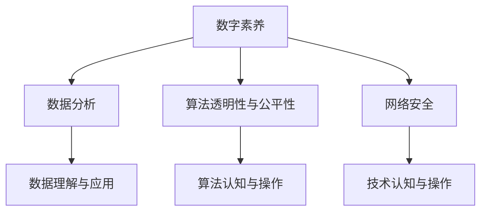

                 

## 1. 背景介绍

在当今数字化日益深入的社会中，数据已成为信息时代的核心资产。无论是个人生活、企业运营，还是政府管理，都高度依赖于数字化的技术和服务。因此，提升数字素养，掌握数字技能，成为人们适应未来发展趋势的关键。

### 1.1 问题由来
随着互联网、物联网、大数据等技术的不断成熟和普及，数字化已经成为驱动全球经济增长和社会进步的重要引擎。然而，数字化带来的同时也伴随着一系列的挑战。如数据安全问题、隐私保护问题、算法偏见问题等，需要社会各界共同面对和解决。数字素养作为个体和组织适应数字化环境的基础能力，显得尤为重要。

### 1.2 问题核心关键点
在数字化时代，提升数字素养的关键点包括：

1. **数据理解与应用**：能够理解数据的价值和意义，掌握数据分析的基本方法，并应用数据分析结果驱动决策。
2. **技术认知与操作**：熟悉各类数字化工具和平台的操作，如办公软件、网络浏览器、社交媒体等。
3. **信息获取与判断**：具备判断信息真伪的能力，能够从海量信息中提取有用内容，避免信息过载和误导。
4. **网络安全意识**：了解网络安全的基本知识，掌握防护措施，保护个人和组织的信息安全。
5. **算法伦理考量**：理解算法的运行原理和潜在风险，如算法偏见、算法透明性等，推动算法伦理的发展。

这些关键点共同构成了提升数字素养的核心内容，帮助个体和组织更好地适应和利用数字技术。

### 1.3 问题研究意义
提升数字素养对于促进个人成长、企业发展和社会进步具有重要意义：

1. **提升个人竞争力**：数字素养为个人提供了更多技能和知识，使其在职业发展中更具优势。
2. **推动企业创新**：数字化工具和平台的应用，能够帮助企业实现流程优化、效率提升、市场拓展等目标。
3. **促进社会治理**：政府机构通过数字化手段，提升公共服务水平，推动社会治理的智能化、精准化。

综上所述，提升数字素养，不仅是个体和组织发展的需要，也是社会整体进步的重要推动力。

## 2. 核心概念与联系

### 2.1 核心概念概述

为更好地理解数字素养及其应用，本节将介绍几个密切相关的核心概念：

- **数字素养**：指个体或组织在数字化环境中所需具备的知识、技能和态度。涵盖数据处理、技术使用、信息获取、安全防护等多个方面。
- **数据分析**：指对数据进行收集、处理、分析和解释，以获取有用信息和知识的过程。
- **算法透明性与公平性**：指确保算法决策过程的透明性，避免算法偏见和歧视，保护个体权益。
- **网络安全**：指保护网络系统和数据不受未经授权的访问、破坏或泄露的技术和措施。

这些核心概念之间的逻辑关系可以通过以下Mermaid流程图来展示：



这个流程图展示了大语言模型的核心概念及其之间的关系：

1. 数字素养由数据分析、算法透明性与公平性、网络安全等多个方面组成。
2. 数据分析是理解数据、获取有用信息的基础。
3. 算法透明性与公平性确保算法决策的公正和可靠。
4. 网络安全保护数据和系统的安全，为数字化环境提供坚实保障。

## 3. 核心算法原理 & 具体操作步骤
### 3.1 算法原理概述

提升数字素养的核心在于算法驱动的数字化技术应用。数字素养的核心算法原理可以概括为以下三点：

1. **数据分析算法**：通过数据收集、处理、分析和解释，从数据中提取知识和洞察，辅助决策和预测。
2. **算法透明性与公平性算法**：确保算法的透明性、公平性和可解释性，减少算法偏见，提升算法信任度。
3. **网络安全算法**：保护网络系统和数据的安全性，防止数据泄露和恶意攻击。

这些算法原理相互支持，共同构成数字素养的技术基础。

### 3.2 算法步骤详解

提升数字素养的具体步骤可以概括为以下几个关键环节：

**Step 1: 数据收集与处理**
- 确定数据收集目标和范围，选择合适的数据收集方法。
- 对数据进行清洗和预处理，去除噪声和异常值，保证数据质量。
- 使用数据处理工具和技术，如Python的Pandas库，进行数据整理和转换。

**Step 2: 数据分析与建模**
- 选择合适的分析方法和模型，如回归分析、聚类分析、分类模型等。
- 使用数据分析工具和技术，如Python的Scikit-learn库，进行数据建模和预测。
- 对模型进行评估和优化，确保模型的准确性和泛化能力。

**Step 3: 算法透明性与公平性优化**
- 对算法进行透明性评估，确保算法的决策过程可解释。
- 进行公平性测试，确保算法在不同群体间表现一致。
- 对算法进行优化，消除偏见，提升算法公正性。

**Step 4: 网络安全措施实施**
- 安装和配置防火墙、VPN等安全设备，保护网络边界。
- 使用加密技术保护数据传输和存储，防止数据泄露。
- 定期进行安全审计和漏洞扫描，发现并修复潜在的安全问题。

通过这些步骤，可以系统性地提升数字素养，确保个体和组织在数字化环境中具备必要的知识和技能。

### 3.3 算法优缺点

提升数字素养算法具有以下优点：
1. **系统化**：通过规范化步骤和流程，系统地提升数字素养，避免盲目操作。
2. **科学性**：借助数据分析和算法优化，提升数字素养的科学性和有效性。
3. **灵活性**：能够适应不同场景和需求，根据实际情况进行优化。

同时，该算法也存在一些局限性：
1. **复杂度**：步骤较多，需要投入大量时间和精力。
2. **技术门槛**：需要掌握一定的数据分析和算法技能，门槛较高。
3. **数据隐私**：数据处理和分析过程中可能存在隐私泄露风险。

尽管存在这些局限性，但总体而言，提升数字素养的算法仍是大语言模型应用的重要组成部分，具有广阔的应用前景。

### 3.4 算法应用领域

提升数字素养的算法已经在多个领域得到广泛应用，涵盖个人生活、企业运营、政府管理等多个方面，例如：

- **个人生活**：通过数据分析算法，帮助用户优化时间管理、健康管理等。
- **企业运营**：使用数据分析和算法优化，提升企业的运营效率、决策精准度等。
- **政府管理**：通过数据分析和网络安全措施，提升政府服务的智能化和安全性。
- **教育培训**：借助算法透明性与公平性，优化教育资源配置，提升教育质量。

除了上述这些经典应用外，提升数字素养的算法还在智能家居、智能制造、智慧城市等诸多领域发挥着重要作用，推动社会各领域的数字化转型。

## 4. 数学模型和公式 & 详细讲解
### 4.1 数学模型构建

提升数字素养的核心数学模型可以概括为以下几个关键组成部分：

1. **数据模型**：用于描述数据收集、处理、分析和解释的基本模型。
2. **算法模型**：用于描述算法透明性、公平性和网络安全的基本模型。
3. **优化模型**：用于描述模型评估、优化和改进的基本模型。

这些数学模型相互关联，共同构成提升数字素养的数学框架。

### 4.2 公式推导过程

以线性回归模型为例，推导提升数字素养的数据分析算法。

假设有一组数据 $(x_i,y_i)$，其中 $x_i$ 为自变量，$y_i$ 为因变量。线性回归模型的目标是通过最小化平方误差，拟合出一条直线，使得预测值 $\hat{y}$ 尽可能接近真实值 $y$。

线性回归模型的公式为：

$$
\hat{y} = \theta_0 + \theta_1 x_1 + \theta_2 x_2 + \ldots + \theta_p x_p
$$

其中 $\theta_j$ 为模型参数。

最小化平方误差的公式为：

$$
\min_{\theta} \sum_{i=1}^n (y_i - \hat{y}_i)^2
$$

通过求导，可得：

$$
\theta_j = \frac{\sum_{i=1}^n x_{ij}(y_i - \bar{y})}{\sum_{i=1}^n x_{ij}^2 - \sum_{i=1}^n \bar{x}^2}
$$

其中 $\bar{x}$ 和 $\bar{y}$ 分别为自变量和因变量的均值。

通过上述推导，可以看出线性回归模型的构建过程，可以系统地提升数字素养。

### 4.3 案例分析与讲解

以数据分析在医疗健康领域的应用为例，说明提升数字素养的数学模型和公式的应用。

在医疗健康领域，通过收集患者的病历数据、体检数据等，可以建立多个数据模型，如疾病预测模型、治疗效果评估模型等。以疾病预测模型为例，假设有一组患者的年龄、性别、血压、血糖等特征数据，以及其是否患有某种疾病的标签。

使用线性回归模型进行疾病预测，将年龄、性别、血压、血糖等特征数据作为自变量，预测患病概率。通过公式推导，可以得到预测模型：

$$
\hat{y} = \theta_0 + \theta_1 \text{年龄} + \theta_2 \text{性别} + \theta_3 \text{血压} + \theta_4 \text{血糖}
$$

其中 $\theta_j$ 为模型参数。

通过数据分析和建模，可以系统地提升医疗健康领域的数字素养，帮助医生和患者做出科学决策，提升诊疗效果。

## 5. 项目实践：代码实例和详细解释说明
### 5.1 开发环境搭建

在进行数字素养提升的实践前，我们需要准备好开发环境。以下是使用Python进行数据分析的开发环境配置流程：

1. 安装Anaconda：从官网下载并安装Anaconda，用于创建独立的Python环境。

2. 创建并激活虚拟环境：
```bash
conda create -n data-env python=3.8 
conda activate data-env
```

3. 安装Python数据分析相关的包：
```bash
conda install pandas numpy matplotlib seaborn scipy stats
```

4. 安装数据可视化工具：
```bash
pip install matplotlib seaborn
```

5. 安装数据处理库：
```bash
pip install scikit-learn
```

完成上述步骤后，即可在`data-env`环境中开始数据分析实践。

### 5.2 源代码详细实现

下面我们以数据分析在医疗健康领域的应用为例，给出使用Python进行线性回归模型构建的代码实现。

首先，导入必要的库：

```python
import pandas as pd
import numpy as np
from sklearn.linear_model import LinearRegression
```

然后，读取数据集并进行预处理：

```python
data = pd.read_csv('patient_data.csv')
X = data[['age', 'gender', 'blood_pressure', 'blood_glucose']]
y = data['disease_label']
```

接着，构建线性回归模型并进行训练：

```python
X_train, X_test, y_train, y_test = train_test_split(X, y, test_size=0.2, random_state=42)
model = LinearRegression()
model.fit(X_train, y_train)
```

最后，评估模型并进行预测：

```python
y_pred = model.predict(X_test)
print('模型系数:', model.coef_)
print('模型截距:', model.intercept_)
print('模型评价指标:', model.score(X_test, y_test))
```

以上代码实现了使用Python进行线性回归模型的构建和训练，展示了提升数字素养的实际应用。

### 5.3 代码解读与分析

让我们再详细解读一下关键代码的实现细节：

**数据预处理**：
- `train_test_split`：将数据集划分为训练集和测试集，用于模型训练和评估。

**模型构建**：
- `LinearRegression`：使用线性回归模型进行数据拟合。
- `fit`：训练模型，通过最小化平方误差拟合直线。

**模型评估**：
- `predict`：对测试集进行预测。
- `score`：计算模型在测试集上的准确率，评估模型性能。

通过上述代码，可以系统地提升医疗健康领域的数字素养，为提升诊疗效果提供科学依据。

## 6. 实际应用场景
### 6.1 智能医疗健康

数据分析和算法透明性与公平性在医疗健康领域的应用，可以显著提升诊疗效果和患者体验。

在实际应用中，可以收集患者的病历数据、体检数据、基因数据等，建立疾病预测模型、治疗效果评估模型、患者健康状况监测模型等。通过数据分析和算法透明性与公平性，可以帮助医生和患者做出科学决策，提升诊疗效果，减轻医疗负担。

### 6.2 智能金融

数据分析和网络安全在金融领域的应用，可以帮助金融机构更好地管理风险，保护客户资产。

金融机构可以收集客户的交易数据、信用数据、行为数据等，建立信用评分模型、风险评估模型、欺诈检测模型等。通过数据分析和网络安全措施，可以帮助金融机构识别潜在的风险点，防范欺诈行为，提升客户信任度。

### 6.3 智能制造

数据分析和网络安全在制造业的应用，可以帮助企业提升生产效率，降低运营成本。

制造业企业可以收集设备的运行数据、生产数据、员工数据等，建立设备故障预测模型、生产效率评估模型、员工绩效评估模型等。通过数据分析和网络安全措施，可以帮助企业预测设备故障，优化生产流程，提升生产效率。

### 6.4 智慧城市

数据分析和网络安全在智慧城市的应用，可以提高城市管理水平，提升市民生活质量。

智慧城市可以通过收集交通数据、环境数据、公共服务数据等，建立交通流量预测模型、环境质量评估模型、公共服务优化模型等。通过数据分析和网络安全措施，可以帮助城市管理者优化资源配置，提升城市运行效率，保障市民安全。

## 7. 工具和资源推荐
### 7.1 学习资源推荐

为了帮助开发者系统掌握数字素养提升的理论基础和实践技巧，这里推荐一些优质的学习资源：

1. **Python数据分析教程**：由Python官方文档和第三方资源提供的数据分析教程，涵盖数据预处理、数据可视化、机器学习等内容，适合初学者学习。

2. **《机器学习》课程**：斯坦福大学开设的机器学习课程，由Andrew Ng教授主讲，系统讲解机器学习的基本理论和算法。

3. **《深度学习》书籍**：由Ian Goodfellow、Yoshua Bengio、Aaron Courville合著，深入浅出地介绍了深度学习的基本原理和应用。

4. **《算法透明性与公平性》书籍**：由Christopher Moody合著，系统介绍了算法透明性、公平性和可解释性的基本概念和方法。

5. **Kaggle竞赛平台**：Kaggle是一个数据科学竞赛平台，提供大量的公开数据集和竞赛任务，适合实践数据分析和机器学习算法。

通过对这些资源的学习实践，相信你一定能够快速掌握数字素养提升的精髓，并用于解决实际的数字问题。

### 7.2 开发工具推荐

高效的开发离不开优秀的工具支持。以下是几款用于数字素养提升开发的常用工具：

1. **Jupyter Notebook**：一个交互式的网页编程环境，支持Python、R等多种编程语言，适合数据分析和机器学习任务。

2. **Scikit-learn**：一个Python数据挖掘和机器学习库，提供了丰富的算法实现和工具函数。

3. **TensorFlow**：由Google主导开发的深度学习框架，支持分布式训练和模型部署。

4. **PyTorch**：由Facebook开发的深度学习框架，支持动态图和静态图，适合研究和原型开发。

5. **OpenSSL**：一个开源的加密库，提供了多种加密算法和协议，用于保护数据传输和存储安全。

合理利用这些工具，可以显著提升数字素养提升的开发效率，加快创新迭代的步伐。

### 7.3 相关论文推荐

数字素养提升的研究源于学界的持续研究。以下是几篇奠基性的相关论文，推荐阅读：

1. **《数据科学导论》**：由Foster Provost、Tom Fawcett合著，系统介绍了数据科学的基本概念和方法。

2. **《机器学习实战》**：由Peter Harrington合著，提供了大量实际案例和代码实现，适合实践学习。

3. **《深度学习中的可解释性》**：由Brendan O'Donoghue合著，系统介绍了深度学习算法的可解释性和公平性问题。

4. **《网络安全原理与实践》**：由Douglas W. Stansifer、Joseph Iannuzzi合著，系统介绍了网络安全的基本原理和技术。

这些论文代表了大语言模型微调技术的发展脉络。通过学习这些前沿成果，可以帮助研究者把握学科前进方向，激发更多的创新灵感。

## 8. 总结：未来发展趋势与挑战
### 8.1 总结

本文对数字素养提升的方法进行了全面系统的介绍。首先阐述了数字素养提升的重要性，明确了数字素养提升的关键点。其次，从原理到实践，详细讲解了提升数字素养的数学原理和关键步骤，给出了数字素养提升的完整代码实例。同时，本文还广泛探讨了数字素养提升在医疗健康、金融、制造、城市管理等多个领域的应用前景，展示了数字素养提升的广泛潜力。此外，本文精选了数字素养提升的各类学习资源，力求为读者提供全方位的技术指引。

通过本文的系统梳理，可以看到，数字素养提升作为个体和组织适应数字化环境的基础能力，其重要性日益凸显。未来，随着数字化技术的不断进步，提升数字素养将成为每个人的必备技能，促进社会各领域的数字化转型。

### 8.2 未来发展趋势

展望未来，数字素养提升将呈现以下几个发展趋势：

1. **数据驱动决策**：数据分析和算法驱动的决策将成为各行业的常态，推动各行业向数据驱动转型。
2. **算法透明性与公平性**：随着算法伦理的重视，算法透明性、公平性将更加受到关注，推动算法伦理的发展。
3. **网络安全防护**：网络安全技术将不断进步，提升数据和系统的安全性，保障数字化环境的安全稳定。
4. **跨学科融合**：数字素养提升将与更多学科领域进行融合，如计算机科学、数学、统计学等，推动数字素养的全面提升。
5. **个性化定制**：基于用户行为和偏好，提供个性化的数字素养提升方案，提升用户体验。

以上趋势凸显了数字素养提升技术的广阔前景。这些方向的探索发展，必将进一步提升各行业的数字化水平，为社会各领域的数字化转型提供有力支持。

### 8.3 面临的挑战

尽管数字素养提升已经取得了显著成效，但在迈向更加智能化、普适化应用的过程中，它仍面临着诸多挑战：

1. **数据隐私**：在数据收集和处理过程中，可能存在隐私泄露的风险。如何保护用户隐私，是提升数字素养需要解决的重要问题。
2. **算法偏见**：算法透明性和公平性问题需要进一步解决，避免算法偏见，提升算法的公正性。
3. **技术门槛**：数字素养提升需要掌握一定的数据分析和算法技能，门槛较高。如何降低技术门槛，普及数字素养提升，是未来需要解决的问题。
4. **模型解释性**：深度学习模型的黑盒特性需要进一步解决，提升模型的可解释性，确保用户信任。
5. **安全防护**：网络安全技术需要不断进步，提升数据和系统的安全性，保障数字化环境的安全稳定。

这些挑战需要研究者、开发者和用户共同努力，推动数字素养提升技术的不断进步。

### 8.4 研究展望

面对数字素养提升面临的挑战，未来的研究需要在以下几个方面寻求新的突破：

1. **数据隐私保护**：引入隐私保护技术，如差分隐私、联邦学习等，确保数据隐私的安全性。
2. **算法透明性与公平性优化**：开发更加透明和公平的算法，减少算法偏见，提升算法公正性。
3. **技术普及与教育**：通过社区教育、在线课程等方式，普及数字素养提升技术，降低技术门槛。
4. **模型解释性与可理解性**：开发更加可解释的模型，提升模型的可理解性，确保用户信任。
5. **网络安全技术创新**：不断创新网络安全技术，提升数据和系统的安全性，保障数字化环境的安全稳定。

这些研究方向的探索，必将引领数字素养提升技术的不断进步，为个体和组织在数字化环境中提供更强大的支持。未来，数字素养提升技术将在各行业得到更广泛的应用，为社会各领域的数字化转型提供有力支撑。

## 9. 附录：常见问题与解答

**Q1：如何系统地提升数字素养？**

A: 系统提升数字素养需要遵循一定的步骤和方法，主要包括以下几个环节：

1. **数据收集与处理**：确定数据收集目标和范围，选择合适的数据收集方法，对数据进行清洗和预处理，去除噪声和异常值，保证数据质量。
2. **数据分析与建模**：选择合适的分析方法和模型，如回归分析、聚类分析、分类模型等，使用数据分析工具和技术，进行数据建模和预测。
3. **算法透明性与公平性优化**：对算法进行透明性评估，确保算法的决策过程可解释。进行公平性测试，确保算法在不同群体间表现一致。对算法进行优化，消除偏见，提升算法公正性。
4. **网络安全措施实施**：安装和配置防火墙、VPN等安全设备，保护网络边界。使用加密技术保护数据传输和存储，防止数据泄露。定期进行安全审计和漏洞扫描，发现并修复潜在的安全问题。

通过以上步骤，可以系统性地提升数字素养，确保个体和组织在数字化环境中具备必要的知识和技能。

**Q2：提升数字素养需要掌握哪些技能？**

A: 提升数字素养需要掌握以下技能：

1. **数据分析技能**：熟悉数据分析的基本方法和工具，如Python的Pandas库、Scikit-learn库等。
2. **算法认知与操作技能**：掌握常见的算法模型和实现，如回归分析、分类模型、聚类算法等。
3. **网络安全技能**：了解网络安全的基本知识，掌握防护措施，保护个人和组织的信息安全。
4. **数据处理技能**：掌握数据清洗、数据可视化等技能，保证数据质量和可用性。
5. **系统优化技能**：了解优化模型、提高系统效率的方法，如梯度积累、混合精度训练等。

这些技能是提升数字素养的基础，通过系统学习，可以有效提升数字素养水平。

**Q3：数字素养提升有哪些应用场景？**

A: 数字素养提升在多个领域都有广泛应用，包括：

1. **医疗健康**：通过数据分析和算法透明性与公平性，提升诊疗效果，减轻医疗负担。
2. **金融**：通过数据分析和网络安全，帮助金融机构管理风险，保护客户资产。
3. **制造**：通过数据分析和网络安全，提升生产效率，降低运营成本。
4. **智慧城市**：通过数据分析和网络安全，提升城市管理水平，保障市民安全。
5. **教育培训**：通过算法透明性与公平性，优化教育资源配置，提升教育质量。

这些应用场景展示了数字素养提升技术的广泛应用，推动各行业的数字化转型。

**Q4：数字素养提升有哪些未来趋势？**

A: 数字素养提升的未来趋势包括：

1. **数据驱动决策**：数据分析和算法驱动的决策将成为各行业的常态，推动各行业向数据驱动转型。
2. **算法透明性与公平性**：随着算法伦理的重视，算法透明性、公平性将更加受到关注，推动算法伦理的发展。
3. **网络安全防护**：网络安全技术将不断进步，提升数据和系统的安全性，保障数字化环境的安全稳定。
4. **跨学科融合**：数字素养提升将与更多学科领域进行融合，如计算机科学、数学、统计学等，推动数字素养的全面提升。
5. **个性化定制**：基于用户行为和偏好，提供个性化的数字素养提升方案，提升用户体验。

这些趋势凸显了数字素养提升技术的广阔前景，推动各行业的数字化转型。

**Q5：提升数字素养需要哪些资源支持？**

A: 提升数字素养需要以下资源支持：

1. **学习资源**：选择优质的学习资源，如Python数据分析教程、机器学习课程、深度学习书籍等，系统学习数字素养提升理论和方法。
2. **开发工具**：选择高效的开发工具，如Jupyter Notebook、Scikit-learn、TensorFlow等，进行数据分析和算法实现。
3. **论文和书籍**：阅读前沿的论文和书籍，如《数据科学导论》、《机器学习实战》、《深度学习中的可解释性》等，掌握数字素养提升的最新进展。

这些资源支持可以显著提升数字素养提升的效率和效果，推动个体和组织在数字化环境中取得更好的成果。

---

作者：禅与计算机程序设计艺术 / Zen and the Art of Computer Programming

