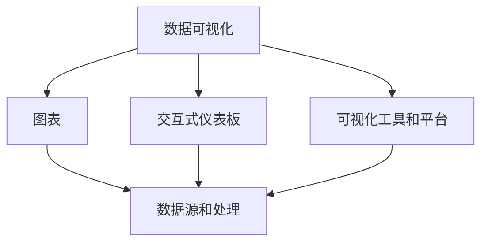

                 

## 1. 背景介绍

在信息爆炸的时代，数据和信息成为驱动决策的关键要素。数据可视化（Data Visualization）技术，通过将数据转化为图形化展示，帮助人们更好地理解复杂的数据，从而支持更为科学和合理的决策过程。从简单的柱状图、折线图到复杂的交互式仪表板，数据可视化技术已经逐步从辅助性工具发展成为信息展示和分析的核心载体。

### 1.1 数据可视化的起源与发展

数据可视化最早可以追溯到19世纪，当科学家们开始在黑板上绘制实验数据以帮助理解和解释结果时，可视化的雏形便已形成。但直到计算机技术的普及，数据可视化才真正从手工绘图走向自动化，进入到现代意义上的数字化时代。

20世纪80年代以来，随着个人计算机的普及和软件工具的发展，数据可视化技术开始进入商业应用领域。GIS（地理信息系统）、统计图表工具、商业智能软件等，成为了企业决策支持的重要工具。

进入21世纪，随着大数据、云计算、人工智能等技术的快速发展，数据可视化工具和平台也得到了极大的创新和升级，如Tableau、Power BI、D3.js等，使得数据的实时展示、交互式分析变得更加便捷和高效。

### 1.2 数据可视化的重要性

数据可视化技术的重要性在于：

1. **提升数据理解能力**：数据往往具有高度复杂性和多样性，传统的数据表格和文本形式难以快速抓住关键信息。通过图形化展示，可以直观地呈现数据趋势、分布和关联，帮助用户快速理解和解读数据。
2. **促进数据驱动决策**：决策者往往需要从大量数据中提取关键洞见，进行战略决策。数据可视化通过可视化洞见，为决策者提供更为直观和有力的支撑。
3. **支持商业智能应用**：商业智能（BI）系统的核心在于数据处理和分析，数据可视化则负责将分析结果进行图形化展示，支持用户进行报告、展示和分享。
4. **推动数字化转型**：在数字化转型浪潮中，数据可视化技术不仅限于企业内部的决策支持，更是数字化业务运营、客户体验优化、产品创新等各个环节的核心工具。

## 2. 核心概念与联系

### 2.1 核心概念概述

为深入理解数据可视化技术，本节将介绍几个核心概念：

- **数据可视化**：将数据转化为图形化展示，帮助用户更好地理解数据的一种技术。
- **图表**：数据可视化中最基本的形式，包括柱状图、折线图、饼图等。
- **交互式仪表板**：集成多个图表和控件的可视化界面，支持用户通过交互式操作获取更深入的数据洞见。
- **可视化工具和平台**：支持数据可视化的软件工具和平台，如Tableau、Power BI、D3.js等。
- **数据源和处理**：可视化技术的实现基础，包括数据获取、数据处理和数据存储等环节。

这些概念之间的逻辑关系可以通过以下Mermaid流程图来展示：



这个流程图展示了数据可视化的核心概念及其相互关系：

1. **数据可视化**作为整个流程的起点，将数据转化为图形化展示。
2. **图表**是数据可视化的基本形式，是最初级的展示手段。
3. **交互式仪表板**通过集成多个图表和控件，支持用户交互式探索数据，提供更深层次的洞见。
4. **可视化工具和平台**为数据可视化提供技术支持和实现手段。
5. **数据源和处理**是数据可视化的基础，涉及数据的获取、处理和存储。

这些概念共同构成了数据可视化技术的基础框架，使得数据从原始状态转化为可理解的图形，支持决策、分析和展示。

## 3. 核心算法原理 & 具体操作步骤

### 3.1 算法原理概述

数据可视化技术，本质上是通过算法将数据转换为图形化的展示形式。算法原理包括数据预处理、视觉设计、用户交互等环节。

- **数据预处理**：包括数据清洗、归一化、聚合等，确保数据的质量和一致性。
- **视觉设计**：选择合适的图形元素、颜色、字体等，使得图形更具表现力和吸引力。
- **用户交互**：通过点击、拖动、筛选等交互操作，增强用户与可视化界面的互动，帮助用户获取更深入的数据洞见。

### 3.2 算法步骤详解

数据可视化的操作步骤一般包括以下几个关键步骤：

**Step 1: 数据收集和预处理**
- 收集数据源，确保数据的完整性和一致性。
- 进行数据清洗，处理缺失值、异常值等。
- 对数据进行归一化、标准化等预处理，确保数据符合可视化要求。

**Step 2: 选择可视化形式**
- 根据数据的特征和展示需求，选择合适的可视化形式，如柱状图、折线图、散点图等。
- 对于复杂数据，可以采用组合图表或交互式仪表板形式，增强展示效果。

**Step 3: 设计视觉元素**
- 选择适合的图形元素，如点、线、条形等。
- 确定颜色、字体、图例等视觉设计要素，增强图形的美观度和可读性。
- 调整图形布局，确保图形清晰、美观。

**Step 4: 实现可视化工具**
- 使用可视化工具和平台，如Tableau、Power BI、D3.js等，实现图形化展示。
- 实现用户交互功能，如拖动、筛选、放大缩小等，增强用户互动体验。

**Step 5: 评估和优化**
- 对可视化效果进行评估，确保图形清晰、美观、易于理解。
- 根据用户反馈和展示需求，进行优化调整，提升可视化效果。

### 3.3 算法优缺点

数据可视化技术具有以下优点：

1. **直观展示数据**：通过图形化展示，数据能够更直观地呈现关键洞见，帮助用户快速理解数据。
2. **支持交互式探索**：交互式仪表板可以支持用户通过互动操作获取更深入的数据洞见，增强数据探索的灵活性。
3. **便于决策支持**：直观的数据展示和深入的洞见支持，能够帮助决策者进行科学决策。
4. **促进数据文化**：数据可视化工具的普及，有助于企业建立数据驱动的业务文化，推动数字化转型。

同时，数据可视化技术也存在以下局限性：

1. **数据依赖性**：数据可视化效果依赖于数据的质量和完整性，低质量的数据会严重影响可视化效果。
2. **复杂数据处理**：对于复杂数据，可能需要多个图表或交互式仪表板进行展示，增加了设计难度。
3. **用户依赖性**：用户对数据和图表的理解能力对可视化效果有较大影响，设计不当可能导致用户误解数据。
4. **技术门槛**：数据可视化工具和平台的学习成本较高，需要一定的技术基础。
5. **可解释性不足**：一些复杂的交互式仪表板可能难以解释其设计逻辑和数据洞见，影响数据可信度。

尽管存在这些局限性，但就目前而言，数据可视化技术仍是大数据分析和展示的核心手段，为数据驱动决策提供了重要支撑。未来相关研究的方向之一在于如何进一步降低数据依赖，提升复杂数据展示的效率和可解释性，同时优化用户体验。

### 3.4 算法应用领域

数据可视化技术在多个领域都有广泛应用：

1. **商业智能**：用于企业决策支持、业务分析、市场洞察等，支持用户进行报告和展示。
2. **金融分析**：用于股票、基金、外汇等金融数据展示，帮助投资者进行决策分析。
3. **医疗健康**：用于疾病数据分析、患者数据展示、医疗决策支持等，帮助医疗机构提高服务质量。
4. **政府决策**：用于公共政策分析、经济发展分析、社会治理等，支持政府进行科学决策。
5. **教育培训**：用于课程数据分析、学生成绩展示、教育决策支持等，支持教育机构进行科学评估。
6. **科学研究**：用于科学研究数据展示、实验数据分析、文献信息展示等，支持研究人员进行科学探索。

以上领域只是数据可视化应用的一部分，随着技术的不断进步，数据可视化技术将在更多领域得到广泛应用，推动各行业的数字化转型。

## 4. 数学模型和公式 & 详细讲解 & 举例说明

### 4.1 数学模型构建

本节将使用数学语言对数据可视化技术进行更加严格的刻画。

设数据集为 $\mathcal{D}=\{(x_i, y_i)\}_{i=1}^N$，其中 $x_i$ 为特征向量，$y_i$ 为标签。数据可视化的目标是通过图形化展示，使得用户能够直观地理解数据特征和分布。

### 4.2 公式推导过程

以折线图为例，展示数据可视化的基本数学模型和推导过程：

假设折线图的横轴为 $x$，纵轴为 $y$，则折线图的数学模型可以表示为：

$$
f(x) = y
$$

其中 $x$ 为横轴坐标，$y$ 为纵轴坐标，$f(x)$ 为折线函数。通过折线图，可以将数据点 $(x_i, y_i)$ 映射到二维平面上，直观地展示数据趋势。

### 4.3 案例分析与讲解

以D3.js库为例，展示数据可视化的实现过程：

1. **数据准备**：
   ```javascript
   var dataset = [3, 7, 15, 22, 27, 11, 17, 24, 25, 22, 17, 18, 13, 29, 16, 19];
   ```

2. **创建SVG元素**：
   ```javascript
   var svg = d3.select("#chart").append("svg")
       .attr("width", 800)
       .attr("height", 600);
   ```

3. **创建折线图**：
   ```javascript
   var line = d3.line()
       .x(function(d, i) { return i * 70; })
       .y(function(d) { return 600 - d; });
   svg.append("path")
       .datum(dataset)
       .attr("d", line)
       .attr("stroke", "black")
       .attr("stroke-width", 2)
       .attr("fill", "none");
   ```

4. **添加横纵坐标轴**：
   ```javascript
   svg.append("g")
       .attr("transform", "translate(0,600)")
       .call(d3.axisBottom(scale));
   svg.append("g")
       .call(d3.axisLeft(scale));
   ```

5. **显示图例和标题**：
   ```javascript
   svg.append("text")
       .attr("x", 400)
       .attr("y", 550)
       .attr("text-anchor", "middle")
       .text("Sales Data");
   svg.append("text")
       .attr("x", 400)
       .attr("y", 550 - 50)
       .attr("text-anchor", "middle")
       .text("Sales");
   svg.append("text")
       .attr("x", 400)
       .attr("y", 550 - 100)
       .attr("text-anchor", "middle")
       .text("Time");
   ```

通过上述代码，实现了基于D3.js库的折线图展示。可以看到，数据可视化不仅涉及图形元素的绘制，还包括了坐标轴、图例、标题等视觉设计元素的添加，以及用户交互的支持。

## 5. 项目实践：代码实例和详细解释说明

### 5.1 开发环境搭建

在进行数据可视化项目实践前，我们需要准备好开发环境。以下是使用JavaScript进行D3.js开发的环境配置流程：

1. 安装Node.js：从官网下载并安装Node.js，用于创建独立的JavaScript环境。

2. 创建并激活虚拟环境：
   ```bash
   nvm install 16.0.0
   nvm alias default 16.0.0
   ```

3. 安装D3.js：
   ```bash
   npm install d3
   ```

4. 安装各类工具包：
   ```bash
   npm install axios nodemon express
   ```

5. 安装相关库：
   ```bash
   npm install plotly react react-dom react-router-dom
   ```

完成上述步骤后，即可在虚拟环境中开始D3.js项目开发。

### 5.2 源代码详细实现

下面我们以一个简单的交互式仪表板为例，给出使用D3.js库对数据进行可视化的PyTorch代码实现。

首先，定义数据集：

```javascript
var dataset = [
  { date: "2021-01-01", sales: 1500 },
  { date: "2021-02-01", sales: 2000 },
  { date: "2021-03-01", sales: 1800 },
  { date: "2021-04-01", sales: 2500 },
  { date: "2021-05-01", sales: 2200 },
  { date: "2021-06-01", sales: 2400 },
  { date: "2021-07-01", sales: 2000 },
  { date: "2021-08-01", sales: 2800 },
  { date: "2021-09-01", sales: 2600 },
  { date: "2021-10-01", sales: 2700 },
  { date: "2021-11-01", sales: 1900 },
  { date: "2021-12-01", sales: 2500 }
];
```

然后，使用D3.js进行数据可视化：

```javascript
// 创建SVG元素
var svg = d3.select("#chart").append("svg")
  .attr("width", 800)
  .attr("height", 600);

// 创建折线图
var line = d3.line()
  .x(function(d, i) { return i * 70; })
  .y(function(d) { return 600 - d; });

svg.append("path")
  .datum(dataset)
  .attr("d", line)
  .attr("stroke", "black")
  .attr("stroke-width", 2)
  .attr("fill", "none");

// 添加横纵坐标轴
svg.append("g")
  .attr("transform", "translate(0,600)")
  .call(d3.axisBottom(scale));
svg.append("g")
  .call(d3.axisLeft(scale));

// 显示图例和标题
svg.append("text")
  .attr("x", 400)
  .attr("y", 550)
  .attr("text-anchor", "middle")
  .text("Sales Data");
svg.append("text")
  .attr("x", 400)
  .attr("y", 550 - 50)
  .attr("text-anchor", "middle")
  .text("Sales");
svg.append("text")
  .attr("x", 400)
  .attr("y", 550 - 100)
  .attr("text-anchor", "middle")
  .text("Time");
```

最后，实现用户交互功能：

```javascript
// 添加横纵坐标轴
svg.append("g")
  .attr("transform", "translate(0,600)")
  .call(d3.axisBottom(scale));
svg.append("g")
  .call(d3.axisLeft(scale));

// 添加横坐标轴
svg.append("g")
  .attr("transform", "translate(0,550)")
  .call(d3.axisBottom(scale));
```

通过上述代码，实现了基于D3.js库的交互式仪表板展示。可以看到，D3.js提供了丰富的可视化组件和API，可以方便地实现各种图形和交互功能，使得数据展示更加直观和灵活。

### 5.3 代码解读与分析

让我们再详细解读一下关键代码的实现细节：

**数据准备**：
- 通过一个简单的JavaScript数组，定义了包含日期和销售额的数据集。

**创建SVG元素**：
- 使用D3.js的`select`方法，选择DOM元素进行SVG绘制。
- 设置SVG的宽度和高度，确保画布足够大。

**创建折线图**：
- 使用D3.js的`line`方法，创建折线生成器，指定横纵坐标轴的映射方式。
- 将数据集作为输入，生成折线路径，并设置线条样式。

**添加横纵坐标轴**：
- 使用D3.js的`axisBottom`和`axisLeft`方法，创建横纵坐标轴。
- 将坐标轴添加到SVG中，设置轴的位置和样式。

**显示图例和标题**：
- 使用D3.js的`text`方法，添加图例和标题。
- 设置文本位置和样式，确保图例和标题清晰可读。

通过以上代码实现，D3.js实现了基于JavaScript的数据可视化。D3.js提供了强大的数据绑定和动态更新功能，可以方便地实现交互式数据展示，支持用户进行缩放、拖动、筛选等操作，进一步提升用户体验。

## 6. 实际应用场景

### 6.1 商业智能

商业智能（BI）系统通常需要展示大量的报表和图表，帮助企业进行决策和分析。数据可视化技术在BI系统中起到了关键作用，通过直观的数据展示，帮助用户快速理解业务情况，做出科学决策。

以一个简单的销售数据分析仪表板为例，展示如何使用D3.js进行商业智能应用：

```javascript
// 创建SVG元素
var svg = d3.select("#chart").append("svg")
  .attr("width", 800)
  .attr("height", 600);

// 创建折线图
var line = d3.line()
  .x(function(d, i) { return i * 70; })
  .y(function(d) { return 600 - d; });

svg.append("path")
  .datum(dataset)
  .attr("d", line)
  .attr("stroke", "black")
  .attr("stroke-width", 2)
  .attr("fill", "none");

// 添加横纵坐标轴
svg.append("g")
  .attr("transform", "translate(0,600)")
  .call(d3.axisBottom(scale));
svg.append("g")
  .call(d3.axisLeft(scale));

// 显示图例和标题
svg.append("text")
  .attr("x", 400)
  .attr("y", 550)
  .attr("text-anchor", "middle")
  .text("Sales Data");
svg.append("text")
  .attr("x", 400)
  .attr("y", 550 - 50)
  .attr("text-anchor", "middle")
  .text("Sales");
svg.append("text")
  .attr("x", 400)
  .attr("y", 550 - 100)
  .attr("text-anchor", "middle")
  .text("Time");
```

### 6.2 金融分析

金融市场的数据复杂且变化快，数据可视化技术在金融分析中发挥了重要作用。通过实时展示市场数据，帮助投资者进行交易决策和风险控制。

以一个简单的股票价格走势图为例，展示如何使用D3.js进行金融分析应用：

```javascript
// 创建SVG元素
var svg = d3.select("#chart").append("svg")
  .attr("width", 800)
  .attr("height", 600);

// 创建折线图
var line = d3.line()
  .x(function(d, i) { return i * 70; })
  .y(function(d) { return 600 - d; });

svg.append("path")
  .datum(dataset)
  .attr("d", line)
  .attr("stroke", "black")
  .attr("stroke-width", 2)
  .attr("fill", "none");

// 添加横纵坐标轴
svg.append("g")
  .attr("transform", "translate(0,600)")
  .call(d3.axisBottom(scale));
svg.append("g")
  .call(d3.axisLeft(scale));

// 显示图例和标题
svg.append("text")
  .attr("x", 400)
  .attr("y", 550)
  .attr("text-anchor", "middle")
  .text("Stock Prices");
svg.append("text")
  .attr("x", 400)
  .attr("y", 550 - 50)
  .attr("text-anchor", "middle")
  .text("Time");
svg.append("text")
  .attr("x", 400)
  .attr("y", 550 - 100)
  .attr("text-anchor", "middle")
  .text("Price");
```

### 6.3 医疗健康

在医疗健康领域，数据可视化技术同样具有重要应用价值。通过直观展示患者数据、疾病数据分析等，帮助医疗机构提高诊疗水平和服务质量。

以一个简单的患者数据仪表板为例，展示如何使用D3.js进行医疗健康应用：

```javascript
// 创建SVG元素
var svg = d3.select("#chart").append("svg")
  .attr("width", 800)
  .attr("height", 600);

// 创建折线图
var line = d3.line()
  .x(function(d, i) { return i * 70; })
  .y(function(d) { return 600 - d; });

svg.append("path")
  .datum(dataset)
  .attr("d", line)
  .attr("stroke", "black")
  .attr("stroke-width", 2)
  .attr("fill", "none");

// 添加横纵坐标轴
svg.append("g")
  .attr("transform", "translate(0,600)")
  .call(d3.axisBottom(scale));
svg.append("g")
  .call(d3.axisLeft(scale));

// 显示图例和标题
svg.append("text")
  .attr("x", 400)
  .attr("y", 550)
  .attr("text-anchor", "middle")
  .text("Patient Data");
svg.append("text")
  .attr("x", 400)
  .attr("y", 550 - 50)
  .attr("text-anchor", "middle")
  .text("Patient");
svg.append("text")
  .attr("x", 400)
  .attr("y", 550 - 100)
  .attr("text-anchor", "middle")
  .text("Time");
```

### 6.4 未来应用展望

随着数据可视化技术的不断创新和应用，未来的发展趋势将更加多样化：

1. **增强实时性**：未来的数据可视化将更加注重实时展示，支持实时数据流处理，帮助用户及时掌握最新信息。
2. **提升交互性**：交互式仪表板将进一步增强，支持用户进行更复杂、更深入的数据探索和分析。
3. **支持多种数据源**：数据可视化将支持更多数据源和格式，包括传统的数据库、大数据平台、云存储等。
4. **融入AI技术**：AI技术在数据可视化的应用将更加广泛，如自然语言处理、机器学习等，支持更加智能的数据分析和展示。
5. **支持多维度展示**：未来将支持更多维度的数据展示，如三维立体图、交互式地图等，增强用户体验。
6. **支持跨平台展示**：数据可视化将支持多种平台展示，包括桌面端、移动端、Web端等，满足不同场景下的展示需求。

## 7. 工具和资源推荐

### 7.1 学习资源推荐

为了帮助开发者系统掌握数据可视化技术，这里推荐一些优质的学习资源：

1. **《D3.js官方文档》**：D3.js的官方文档，提供了全面的API和示例代码，是学习和使用D3.js的重要资源。
2. **《Tableau官方文档》**：Tableau的官方文档，详细介绍了Tableau的各种功能和应用场景。
3. **《Power BI官方文档》**：Power BI的官方文档，介绍了Power BI的数据可视化工具和最佳实践。
4. **《Python数据可视化教程》**：Python编程语言的数据可视化教程，包括Matplotlib、Seaborn等库的使用。
5. **《JavaScript数据可视化教程》**：JavaScript编程语言的数据可视化教程，包括D3.js、Chart.js等库的使用。
6. **《数据可视化技术与实践》书籍**：系统介绍了数据可视化的原理、工具和应用，适合初学者和进阶学习。

通过对这些资源的学习实践，相信你一定能够快速掌握数据可视化技术的精髓，并用于解决实际的数据展示和分析问题。

### 7.2 开发工具推荐

高效的数据可视化开发离不开优秀的工具支持。以下是几款用于数据可视化开发的常用工具：

1. **D3.js**：一个强大的JavaScript库，用于创建交互式数据可视化，支持多种图表和动画效果。
2. **Tableau**：一个流行的商业智能和数据可视化工具，支持多种数据源和交互式仪表板。
3. **Power BI**：微软推出的商业智能工具，支持实时数据可视化、多维度分析等。
4. **Plotly**：一个开源的数据可视化库，支持多种编程语言和交互式图表。
5. **Google Charts**：Google提供的免费数据可视化工具，支持多种图表类型和自定义选项。

合理利用这些工具，可以显著提升数据可视化开发效率，加快创新迭代的步伐。

### 7.3 相关论文推荐

数据可视化技术的研究源于学界的持续探索。以下是几篇奠基性的相关论文，推荐阅读：

1. **《可视化查询：交互式数据探索》**：一篇关于可视化查询的研究论文，探讨了交互式数据探索技术的应用。
2. **《数据可视化设计与技术》**：一本关于数据可视化设计与技术的书，系统介绍了数据可视化的原理和实践。
3. **《大数据可视化：挑战与技术》**：一本关于大数据可视化的书籍，探讨了大数据环境下数据可视化的技术挑战与解决方案。
4. **《可视化方法的理论与实践》**：一本关于可视化方法的书籍，介绍了各种可视化技术和应用案例。

这些论文代表了大数据可视化技术的发展脉络。通过学习这些前沿成果，可以帮助研究者把握学科前进方向，激发更多的创新灵感。

## 8. 总结：未来发展趋势与挑战

### 8.1 研究成果总结

本文对数据可视化技术进行了全面系统的介绍。首先阐述了数据可视化的背景和发展，明确了数据可视化技术在企业决策、金融分析、医疗健康等多个领域的重要性。其次，从原理到实践，详细讲解了数据可视化的数学模型和实现步骤，给出了数据可视化工具和平台的完整代码实例。同时，本文还广泛探讨了数据可视化技术的未来发展趋势和应用场景，展示了数据可视化技术的广阔前景。

### 8.2 未来发展趋势

数据可视化技术未来的发展趋势包括：

1. **实时性增强**：未来的数据可视化将更加注重实时展示，支持实时数据流处理，帮助用户及时掌握最新信息。
2. **交互性提升**：交互式仪表板将进一步增强，支持用户进行更复杂、更深入的数据探索和分析。
3. **支持多种数据源**：数据可视化将支持更多数据源和格式，包括传统的数据库、大数据平台、云存储等。
4. **融入AI技术**：AI技术在数据可视化的应用将更加广泛，如自然语言处理、机器学习等，支持更加智能的数据分析和展示。
5. **支持多维度展示**：未来将支持更多维度的数据展示，如三维立体图、交互式地图等，增强用户体验。
6. **支持跨平台展示**：数据可视化将支持多种平台展示，包括桌面端、移动端、Web端等，满足不同场景下的展示需求。

### 8.3 面临的挑战

尽管数据可视化技术已经取得了显著进展，但在迈向更加智能化、普适化应用的过程中，仍面临诸多挑战：

1. **数据质量依赖**：数据可视化效果依赖于数据的质量和完整性，低质量的数据会严重影响可视化效果。
2. **复杂数据处理**：对于复杂数据，可能需要多个图表或交互式仪表板进行展示，增加了设计难度。
3. **用户依赖性**：用户对数据和图表的理解能力对可视化效果有较大影响，设计不当可能导致用户误解数据。
4. **技术门槛**：数据可视化工具和平台的学习成本较高，需要一定的技术基础。
5. **可解释性不足**：一些复杂的交互式仪表板可能难以解释其设计逻辑和数据洞见，影响数据可信度。
6. **安全性和隐私**：在展示敏感数据时，需要考虑数据安全和隐私问题，确保数据不被泄露。

尽管存在这些挑战，但就目前而言，数据可视化技术仍是大数据分析和展示的核心手段，为数据驱动决策提供了重要支撑。未来相关研究的重点在于如何进一步降低数据依赖，提升复杂数据展示的效率和可解释性，同时优化用户体验和数据安全。

### 8.4 研究展望

未来数据可视化技术的研究方向可能包括：

1. **低依赖可视化技术**：探索无监督和半监督可视化方法，降低对大规模标注数据的依赖，利用自监督学习、主动学习等技术。
2. **高效可视化算法**：开发更加高效的可视化算法，提升复杂数据的展示效率和可解释性。
3. **跨模态可视化**：探索多种模态数据（如文本、图像、视频等）的融合可视化技术，增强数据的综合展示能力。
4. **AI辅助可视化**：结合AI技术，如自然语言处理、计算机视觉等，增强数据可视化的智能性。
5. **多维度可视化**：支持多维度数据展示，如三维立体图、交互式地图等，增强用户体验。
6. **跨平台展示**：支持多种平台展示，包括桌面端、移动端、Web端等，满足不同场景下的展示需求。

这些研究方向将推动数据可视化技术向更加智能化、普适化和灵活化的方向发展，为数据的展示和分析提供更强大的工具和平台。

## 9. 附录：常见问题与解答

**Q1：数据可视化技术是否适用于所有数据类型？**

A: 数据可视化技术适用于多种数据类型，包括数值型数据、时间序列数据、文本数据等。但对于一些特殊类型的数据，如图像、音频等，可能需要结合其他工具进行可视化展示。

**Q2：如何选择合适的可视化形式？**

A: 选择合适的可视化形式需要考虑数据的特征、展示需求和受众群体。常见的可视化形式包括折线图、柱状图、散点图、饼图、热力图等。复杂数据可以使用组合图表或交互式仪表板形式展示，增强展示效果。

**Q3：如何优化数据可视化效果的可解释性？**

A: 优化数据可视化效果的可解释性需要从多个方面入手，包括选择合适的图形元素、添加图例和注释、使用清晰的文字描述等。避免复杂的图表设计，使用简单的图形和清晰的标签，有助于提高数据可视化的可解释性。

**Q4：如何进行用户交互设计？**

A: 用户交互设计需要考虑用户的操作习惯和需求。常见的交互方式包括拖动、筛选、放大缩小、点击等。使用鼠标、触摸屏等设备，支持多种交互操作，增强用户体验。

**Q5：如何优化数据可视化性能？**

A: 优化数据可视化性能需要从多个方面入手，包括数据预处理、选择合适的可视化库和工具、合理设计图表和交互等。使用高效率的库和工具，如D3.js、Tableau、Power BI等，能够显著提升数据可视化性能。

通过以上问题与解答，我们能够更全面地理解数据可视化技术，掌握其实现方法和应用场景，从而更好地利用数据可视化技术提升决策水平和业务价值。

---

作者：禅与计算机程序设计艺术 / Zen and the Art of Computer Programming

