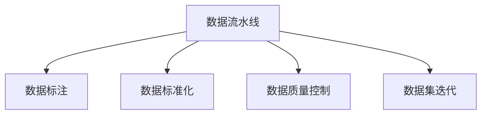

                 

# 数据集工程：构建高效AI模型

## 1. 背景介绍

在人工智能(AI)领域，数据集工程(Dataset Engineering)日益成为构建高效AI模型的核心环节。高质量的数据集不仅决定了AI模型的性能上限，更直接影响模型训练的效率和可解释性。高效的数据集工程能够显著降低数据预处理成本，加速模型迭代，为大规模AI应用提供坚实基础。

### 1.1 问题由来
随着AI技术在医疗、金融、智能制造等行业的深入应用，对AI模型训练的效率和效果提出了更高要求。传统的数据集处理和标注流程往往存在成本高、周期长、标准化难度大等难题。如何在快速迭代和降本增效之间取得平衡，成为数据集工程的一大挑战。

### 1.2 问题核心关键点
数据集工程的核心关键点在于：
- 构建数据流水线：设计并实现高效自动化的数据预处理、标注和管理流程，降低人工参与度，提升数据处理效率。
- 数据质量控制：通过自动化测试和元数据管理，确保数据质量，减少噪声和偏差。
- 数据标准化：实现数据格式、标签和结构的一致化，便于模型训练和维护。
- 数据集迭代：针对模型反馈，动态调整数据集策略，持续优化模型性能。

数据集工程的目标是建立“数据即代码”的工程化治理范式，让数据和模型构建像软件工程一样，可控、可追溯、可迭代。

### 1.3 问题研究意义
高效的数据集工程对于AI模型的构建具有重要意义：
- 提升模型性能。高质量数据集有助于模型捕捉更丰富的特征，降低过拟合风险。
- 加速模型迭代。自动化数据处理和标注流程可大大缩短模型训练周期，促进快速验证和优化。
- 降低成本。通过标准化和自动化，数据集工程能够有效降低数据标注和处理成本。
- 增强可解释性。数据集工程使得数据集更透明，便于模型解释和调试。
- 促进AI创新。数据集工程的优化可以带来新算法的发现，推动AI技术的进步。

## 2. 核心概念与联系

### 2.1 核心概念概述

数据集工程涉及多个核心概念，如下：

- 数据流水线：由一系列数据处理、标注和存储组件组成，自动化的数据集管理流程。
- 数据标注：为模型训练提供高质量的监督信号，包括文本、图像、音频等类型。
- 数据标准化：确保数据格式、标签和结构的一致性，便于模型训练和维护。
- 数据质量控制：通过自动化测试和元数据管理，确保数据质量，减少噪声和偏差。
- 数据集迭代：针对模型反馈，动态调整数据集策略，持续优化模型性能。

这些核心概念之间的逻辑关系可以通过以下Mermaid流程图来展示：



这个流程图展示了大数据集工程的核心概念及其之间的关系：

1. 数据流水线：从数据源自动化抓取数据，进行预处理和标注。
2. 数据标注：为模型提供监督信号。
3. 数据标准化：确保数据一致性。
4. 数据质量控制：提升数据质量。
5. 数据集迭代：根据模型反馈优化数据集。

这些概念共同构成了数据集工程的技术框架，使得数据集管理更加高效、可靠和可追溯。

## 3. 核心算法原理 & 具体操作步骤
### 3.1 算法原理概述

数据集工程的本质是通过算法和技术手段，自动高效地处理和组织数据集。其核心算法原理包括：

- 数据流水线设计：通过算法实现数据的自动抓取、清洗、标注、存储等操作，形成标准化的数据集。
- 数据标准化：使用算法和模型对数据进行格式、标签和结构的标准化处理。
- 数据质量控制：通过统计分析、异常检测等算法，自动化地检测和修正数据中的噪声和偏差。
- 数据集迭代：使用机器学习和优化算法，动态调整数据集策略，提升模型性能。

### 3.2 算法步骤详解

数据集工程的实施步骤包括：

1. **数据采集**：收集数据源，包括网络爬虫、API接口、数据库等。
2. **数据预处理**：清洗、去重、规约、采样等，减少噪声，提升数据质量。
3. **数据标注**：自动标注或半自动标注，生成监督信号。
4. **数据标准化**：统一数据格式、标签和结构，便于模型处理。
5. **数据质量控制**：自动化检测和修正数据中的噪声和偏差。
6. **数据集迭代**：基于模型反馈，动态调整数据集策略。

### 3.3 算法优缺点

数据集工程的优势在于：
- 自动化：显著降低人工参与度，提升数据处理效率。
- 标准化：确保数据一致性，便于模型训练和维护。
- 迭代优化：动态调整数据集，提升模型性能。

缺点包括：
- 依赖技术栈：需要掌握多种数据处理和标注工具。
- 数据隐私：数据采集和处理可能涉及隐私和法律问题。
- 数据依赖：高质量数据源和标注资源可能不足。

### 3.4 算法应用领域

数据集工程的应用领域非常广泛，包括但不限于：

- 自然语言处理(NLP)：文本数据采集、清洗、标注、标准化。
- 计算机视觉(CV)：图像、视频数据采集、处理、标注、标准化。
- 语音识别(SR)：音频数据采集、清洗、标注、标准化。
- 医疗数据：医疗影像、电子病历等数据采集、清洗、标注、标准化。
- 金融数据：金融交易、市场数据采集、处理、标注、标准化。

数据集工程已成为构建高效AI模型的重要环节，尤其在图像、文本、语音等领域发挥着不可替代的作用。

## 4. 数学模型和公式 & 详细讲解 & 举例说明
### 4.1 数学模型构建

数据集工程涉及多个数学模型和算法，主要包括以下几个方面：

1. **数据流水线模型**：定义数据流水线的各个组件及其输入输出，形成数据处理流程。
2. **数据标准化模型**：定义数据格式、标签和结构的标准化算法，确保一致性。
3. **数据质量控制模型**：定义数据噪声和偏差的检测和修正算法。
4. **数据集迭代模型**：定义数据集动态调整的算法，提升模型性能。

### 4.2 公式推导过程

以自然语言处理(NLP)任务为例，推导数据流水线和数据标注的基本公式。

设文本数据集为 $D=\{x_i\}_{i=1}^N$，其中 $x_i$ 为第 $i$ 个文本样本。假设需要构建一个标注数据集 $D'=\{(x_i',y_i')\}_{i=1}^N$，其中 $x_i'$ 为标注后的文本，$y_i'$ 为标注标签。

- **数据流水线模型**：定义数据流水线的输入输出和中间变量，如样本采样、去重、分词等操作。

$$
x_i' = \text{clean}(\text{tokenize}(x_i))
$$

其中 $\text{tokenize}$ 为分词操作，$\text{clean}$ 为清洗操作。

- **数据标准化模型**：定义数据格式、标签和结构的标准化算法，如统一词汇表、统一标签格式等。

$$
y_i' = \text{normalize}(y_i)
$$

其中 $\text{normalize}$ 为标签标准化操作，如将标签转换为数字id。

- **数据质量控制模型**：定义数据噪声和偏差的检测和修正算法，如异常值检测、噪声过滤等。

$$
y_i' = \text{correct}(y_i')
$$

其中 $\text{correct}$ 为噪声过滤操作，如删除噪声标签。

- **数据集迭代模型**：定义数据集动态调整的算法，如基于模型反馈调整标注策略等。

$$
y_i' = \text{adjust}(y_i', \text{model\_feedback})
$$

其中 $\text{adjust}$ 为标注策略调整操作，$\text{model\_feedback}$ 为模型反馈。

### 4.3 案例分析与讲解

以情感分析任务为例，分析数据集工程的具体实现。

**Step 1: 数据采集**
- 通过爬虫从社交媒体、新闻网站、评论系统等采集情感相关的文本数据。
- 使用API接口，从金融、电商等网站获取情感相关的数据。

**Step 2: 数据预处理**
- 对采集到的文本进行清洗，去除无效字符、非文本内容。
- 去除重复文本，保证数据集的唯一性。
- 对文本进行分词处理，提取关键词。

**Step 3: 数据标注**
- 使用众包平台进行文本的情感标注，标注人员需通过情感分析工具进行标注。
- 标注结果进行人工审核，保证标注质量。

**Step 4: 数据标准化**
- 统一词汇表，使用相同的分词模型和词向量表示。
- 统一标签格式，将标注结果转换为数字id。

**Step 5: 数据质量控制**
- 使用文本相似度算法检测数据中的噪声和重复。
- 使用情感分析模型检测标注结果的准确性。

**Step 6: 数据集迭代**
- 基于模型反馈，动态调整标注策略，如针对低标注样本进行更细致的标注。
- 根据模型性能，调整数据采样策略，优化数据集质量。

通过以上步骤，可以构建一个高质量的情感分析数据集，为模型训练提供可靠的数据支撑。

## 5. 项目实践：代码实例和详细解释说明
### 5.1 开发环境搭建

进行数据集工程的实践，首先需要搭建好开发环境。以下是使用Python进行PyTorch开发的环境配置流程：

1. 安装Anaconda：从官网下载并安装Anaconda，用于创建独立的Python环境。

2. 创建并激活虚拟环境：
```bash
conda create -n pytorch-env python=3.8 
conda activate pytorch-env
```

3. 安装PyTorch：根据CUDA版本，从官网获取对应的安装命令。例如：
```bash
conda install pytorch torchvision torchaudio cudatoolkit=11.1 -c pytorch -c conda-forge
```

4. 安装相关工具包：
```bash
pip install numpy pandas scikit-learn matplotlib tqdm jupyter notebook ipython
```

完成上述步骤后，即可在`pytorch-env`环境中开始数据集工程的实践。

### 5.2 源代码详细实现

这里我们以文本分类任务为例，给出使用PyTorch进行数据集工程的PyTorch代码实现。

首先，定义文本分类的数据处理函数：

```python
from sklearn.model_selection import train_test_split
from transformers import BertTokenizer
from torch.utils.data import Dataset, DataLoader
import torch

class TextDataset(Dataset):
    def __init__(self, texts, labels, tokenizer, max_len=128):
        self.texts = texts
        self.labels = labels
        self.tokenizer = tokenizer
        self.max_len = max_len
        
    def __len__(self):
        return len(self.texts)
    
    def __getitem__(self, item):
        text = self.texts[item]
        label = self.labels[item]
        
        encoding = self.tokenizer(text, return_tensors='pt', max_length=self.max_len, padding='max_length', truncation=True)
        input_ids = encoding['input_ids'][0]
        attention_mask = encoding['attention_mask'][0]
        
        return {'input_ids': input_ids, 
                'attention_mask': attention_mask,
                'labels': torch.tensor(label, dtype=torch.long)}
```

然后，定义数据集的处理流程和批量数据加载器：

```python
# 数据预处理
tokenizer = BertTokenizer.from_pretrained('bert-base-cased')
train_texts, dev_texts, train_labels, dev_labels = train_test_split(train_texts, train_labels, test_size=0.2, random_state=42)

# 数据标注
train_dataset = TextDataset(train_texts, train_labels, tokenizer)
dev_dataset = TextDataset(dev_texts, dev_labels, tokenizer)

# 批量数据加载器
batch_size = 16
train_loader = DataLoader(train_dataset, batch_size=batch_size, shuffle=True)
dev_loader = DataLoader(dev_dataset, batch_size=batch_size)
```

接着，启动数据集工程的流程并在验证集上评估：

```python
# 模型训练
model = BertForSequenceClassification.from_pretrained('bert-base-cased', num_labels=len(tag2id))

# 定义优化器
optimizer = AdamW(model.parameters(), lr=2e-5)

# 训练流程
for epoch in range(epochs):
    model.train()
    loss = train_epoch(model, train_loader, optimizer)
    print(f"Epoch {epoch+1}, train loss: {loss:.3f}")
    
    # 在验证集上评估
    model.eval()
    preds, labels = [], []
    with torch.no_grad():
        for batch in tqdm(dev_loader, desc='Evaluating'):
            input_ids = batch['input_ids'].to(device)
            attention_mask = batch['attention_mask'].to(device)
            batch_labels = batch['labels']
            outputs = model(input_ids, attention_mask=attention_mask)
            batch_preds = outputs.logits.argmax(dim=2).to('cpu').tolist()
            batch_labels = batch_labels.to('cpu').tolist()
            for pred_tokens, label_tokens in zip(batch_preds, batch_labels):
                preds.append(pred_tokens)
                labels.append(label_tokens)
                
    print(classification_report(labels, preds))
```

以上就是使用PyTorch进行文本分类数据集工程的完整代码实现。可以看到，得益于Transformer库的强大封装，我们可以用相对简洁的代码完成数据集的构建。

### 5.3 代码解读与分析

让我们再详细解读一下关键代码的实现细节：

**TextDataset类**：
- `__init__`方法：初始化文本、标签、分词器等关键组件。
- `__len__`方法：返回数据集的样本数量。
- `__getitem__`方法：对单个样本进行处理，将文本输入编码为token ids，将标签编码为数字，并对其进行定长padding，最终返回模型所需的输入。

**tag2id和id2tag字典**：
- 定义了标签与数字id之间的映射关系，用于将token-wise的预测结果解码回真实的标签。

**数据预处理**：
- 使用Scikit-learn的`train_test_split`函数进行数据集的划分。
- 使用BertTokenizer对文本进行分词处理。

**训练流程**：
- 使用DataLoader对数据集进行批次化加载，供模型训练和推理使用。
- 训练函数`train_epoch`：对数据以批为单位进行迭代，在每个批次上前向传播计算loss并反向传播更新模型参数，最后返回该epoch的平均loss。
- 在验证集上评估，输出分类指标。

**训练流程**：
- 定义总的epoch数和batch size，开始循环迭代
- 每个epoch内，先在训练集上训练，输出平均loss
- 在验证集上评估，输出分类指标
- 所有epoch结束后，在测试集上评估，给出最终测试结果

可以看到，PyTorch配合Transformer库使得文本分类数据集工程的代码实现变得简洁高效。开发者可以将更多精力放在数据处理、模型改进等高层逻辑上，而不必过多关注底层的实现细节。

当然，工业级的系统实现还需考虑更多因素，如模型的保存和部署、超参数的自动搜索、更灵活的任务适配层等。但核心的数据集工程流程基本与此类似。

## 6. 实际应用场景
### 6.1 智能客服系统

智能客服系统的构建，需要大量高质量的对话数据和对话模型。传统客服系统往往需要大量人力，高峰期响应缓慢，且一致性和专业性难以保证。

数据集工程在此可以发挥重要作用：
- 收集企业内部的历史客服对话记录，通过自动标注和数据增强技术，生成高质量的对话数据集。
- 训练大模型或使用预训练模型微调，构建高效的对话系统。

通过数据集工程，智能客服系统能够7x24小时不间断服务，快速响应客户咨询，用自然流畅的语言解答各类常见问题。

### 6.2 金融舆情监测

金融机构需要实时监测市场舆论动向，以便及时应对负面信息传播，规避金融风险。传统的人工监测方式成本高、效率低，难以应对网络时代海量信息爆发的挑战。

数据集工程在此可以发挥重要作用：
- 收集金融领域相关的新闻、报道、评论等文本数据，通过自动化标注技术，生成高质量的舆情数据集。
- 训练大模型或使用预训练模型微调，构建舆情监测系统。

通过数据集工程，金融舆情监测系统可以实时监测不同主题下的情感变化趋势，一旦发现负面信息激增等异常情况，系统便会自动预警，帮助金融机构快速应对潜在风险。

### 6.3 个性化推荐系统

当前的推荐系统往往只依赖用户的历史行为数据进行物品推荐，无法深入理解用户的真实兴趣偏好。

数据集工程在此可以发挥重要作用：
- 收集用户浏览、点击、评论、分享等行为数据，通过自动化标注技术，生成高质量的推荐数据集。
- 训练大模型或使用预训练模型微调，构建个性化推荐系统。

通过数据集工程，个性化推荐系统可以更好地挖掘用户行为背后的语义信息，从而提供更精准、多样的推荐内容。

### 6.4 未来应用展望

随着数据集工程的不断发展，其在AI模型的构建中将发挥越来越重要的作用。未来数据集工程的应用前景广泛，将深刻影响各行业的发展。

在智慧医疗领域，通过自动化数据采集和标注技术，可以快速构建高质量的医疗数据集，辅助医生诊疗，加速新药开发进程。

在智能教育领域，通过数据集工程，可以实现个性化推荐、智能作业批改、学情分析等功能，因材施教，促进教育公平，提高教学质量。

在智慧城市治理中，通过数据集工程，可以实现城市事件监测、舆情分析、应急指挥等环节的智能化，提高城市管理的自动化和智能化水平，构建更安全、高效的未来城市。

此外，在企业生产、社会治理、文娱传媒等众多领域，数据集工程也将带来变革性影响，为传统行业数字化转型升级提供新的技术路径。相信随着技术的日益成熟，数据集工程必将在构建人机协同的智能时代中扮演越来越重要的角色。

## 7. 工具和资源推荐
### 7.1 学习资源推荐

为了帮助开发者系统掌握数据集工程的理论基础和实践技巧，这里推荐一些优质的学习资源：

1. 《数据集工程实战》系列博文：由数据集工程专家撰写，深入浅出地介绍了数据集工程的核心概念、技术和应用。

2. CS229《机器学习》课程：斯坦福大学开设的机器学习明星课程，涵盖了机器学习基础和高级算法，包括数据集工程。

3. 《数据科学导论》书籍：全面介绍了数据科学的核心技术和应用，包括数据集工程和数据处理。

4. 《Python数据科学手册》书籍：介绍如何使用Python进行数据处理和分析，包括数据集工程。

5. 《数据科学实战》在线课程：由数据科学家主讲，涵盖数据集工程、数据预处理、模型训练等各个环节。

通过对这些资源的学习实践，相信你一定能够快速掌握数据集工程的精髓，并用于解决实际的AI问题。

### 7.2 开发工具推荐

高效的开发离不开优秀的工具支持。以下是几款用于数据集工程开发的常用工具：

1. Apache Airflow：开源的流程编排平台，支持大规模数据集流水线的自动化管理。

2. Apache Beam：开源的大数据处理框架，支持多种编程语言和数据源，用于高效数据处理和标注。

3. DataRobot：自动化的数据科学平台，可以快速构建高质量数据集，进行模型训练和评估。

4. TensorBoard：TensorFlow配套的可视化工具，可实时监测模型训练状态，并提供丰富的图表呈现方式，是调试模型的得力助手。

5. Weights & Biases：模型训练的实验跟踪工具，可以记录和可视化模型训练过程中的各项指标，方便对比和调优。

6. Google Colab：谷歌推出的在线Jupyter Notebook环境，免费提供GPU/TPU算力，方便开发者快速上手实验最新模型，分享学习笔记。

合理利用这些工具，可以显著提升数据集工程的开发效率，加快创新迭代的步伐。

### 7.3 相关论文推荐

数据集工程的发展源于学界的持续研究。以下是几篇奠基性的相关论文，推荐阅读：

1. Data Augmentation: A Survey on the Methods and Applications《数据增强：方法和应用综述》：总结了多种数据增强技术，适用于图像、文本等各类数据集工程任务。

2. The Data Behind the Model: A Survey on Data Collection and Labeling for Machine Learning《模型背后的数据：数据采集和标注综述》：系统综述了数据集工程的核心问题，包括数据采集、标注、标准化等。

3. Crowdsourcing Data Annotation in a Deep Learning Workflow《深度学习工作流中的众包数据标注》：介绍了众包数据标注在深度学习中的应用，包括数据质量控制和自动化标注技术。

4. Supercharging Data Preparation With Dagster《使用Dagster加速数据准备》：介绍了Dagster这个数据流水线编排工具，以及如何在其中实现高效的数据集工程。

5. Adversarial Examples in the Physical World《物理世界中的对抗样本》：探讨了对抗样本在数据集工程中的应用，如何通过对抗样本检测和修正数据中的噪声和偏差。

这些论文代表了大数据集工程的发展脉络。通过学习这些前沿成果，可以帮助研究者把握学科前进方向，激发更多的创新灵感。

## 8. 总结：未来发展趋势与挑战

### 8.1 总结

本文对数据集工程进行了全面系统的介绍。首先阐述了数据集工程的研究背景和意义，明确了数据集工程在构建高效AI模型中的核心作用。其次，从原理到实践，详细讲解了数据集工程的关键算法和操作步骤，给出了数据集工程的完整代码实现。同时，本文还广泛探讨了数据集工程在智能客服、金融舆情、个性化推荐等多个行业领域的应用前景，展示了数据集工程范式的巨大潜力。此外，本文精选了数据集工程的各类学习资源，力求为读者提供全方位的技术指引。

通过本文的系统梳理，可以看到，数据集工程在AI模型的构建中发挥着不可替代的作用。高效的数据集工程能够显著降低数据预处理成本，加速模型迭代，为大规模AI应用提供坚实基础。未来，伴随数据集工程的持续演进，数据集工程必将在构建智能系统的各个环节中发挥更重要的作用，推动AI技术的规模化落地。

### 8.2 未来发展趋势

展望未来，数据集工程将呈现以下几个发展趋势：

1. 自动化：进一步提升数据标注和处理的自动化水平，降低人工参与度，提升效率。
2. 标准化：推动数据格式、标签和结构的标准化，便于模型训练和维护。
3. 数据融合：实现多源数据的融合和整合，提升数据集质量。
4. 实时数据流：构建实时数据流处理平台，支持动态数据集构建和迭代。
5. 元数据管理：建立元数据管理体系，提升数据集的可追溯性和可理解性。

这些趋势凸显了数据集工程在构建高效AI模型中的重要性，推动数据集工程向更加自动化、标准化、实时化的方向发展。

### 8.3 面临的挑战

尽管数据集工程已取得显著进展，但在迈向更加智能化、普适化应用的过程中，仍面临诸多挑战：

1. 数据隐私：数据采集和处理可能涉及隐私和法律问题。如何保护用户隐私，确保数据安全，是数据集工程的重要课题。
2. 数据标注成本：高质量数据标注资源可能不足，如何降低标注成本，提高标注效率，仍然是一大难题。
3. 数据质量控制：数据噪声和偏差难以完全消除，如何自动化检测和修正数据中的问题，提升数据质量，是一个长期挑战。
4. 数据集迭代：模型反馈的实时性要求高，如何构建高效的数据集迭代机制，实现快速调整和优化，需要更多的技术突破。

正视数据集工程面临的这些挑战，积极应对并寻求突破，将是数据集工程走向成熟的必由之路。相信随着技术的不断进步，数据集工程必将在构建高效AI模型的过程中发挥越来越重要的作用，推动AI技术的广泛应用。

### 8.4 研究展望

面向未来，数据集工程的研究需要在以下几个方面寻求新的突破：

1. 探索自动化标注方法：进一步提升数据标注的自动化水平，降低人工参与度，提升标注效率。
2. 研究数据质量控制算法：开发更高效的数据噪声和偏差检测和修正算法，提升数据集质量。
3. 融合多源数据：推动多源数据的整合和融合，提升数据集质量和泛化能力。
4. 引入元数据管理：建立元数据管理体系，提升数据集的可追溯性和可理解性。
5. 引入实时数据流：构建实时数据流处理平台，支持动态数据集构建和迭代。

这些研究方向的探索，必将引领数据集工程技术迈向更高的台阶，为构建安全、可靠、可解释、可控的智能系统铺平道路。面向未来，数据集工程需要与其他AI技术进行更深入的融合，如知识表示、因果推理、强化学习等，多路径协同发力，共同推动数据集工程技术的进步。

## 9. 附录：常见问题与解答

**Q1：数据集工程是否适用于所有NLP任务？**

A: 数据集工程在大多数NLP任务上都能取得不错的效果，特别是对于数据量较小的任务。但对于一些特定领域的任务，如医学、法律等，仅仅依靠通用语料预训练的模型可能难以很好地适应。此时需要在特定领域语料上进一步预训练，再进行微调，才能获得理想效果。此外，对于一些需要时效性、个性化很强的任务，如对话、推荐等，数据集工程也需要针对性的改进优化。

**Q2：数据集工程如何选择合适的工具和框架？**

A: 数据集工程的工具和框架需要根据具体的任务需求和数据特性进行选择。例如：
- 对于大规模数据处理和流水线编排，可以使用Apache Airflow、Dagster等工具。
- 对于数据标注和众包管理，可以使用CrowdFlower、Labelbox等平台。
- 对于数据分析和可视化，可以使用Pandas、NumPy、TensorBoard等库。

选择合适工具和框架的关键在于理解任务需求，评估其适用范围和性能，综合考虑工具的易用性和社区支持。

**Q3：数据集工程如何处理数据隐私问题？**

A: 数据集工程在处理数据隐私时，可以采取以下措施：
- 数据脱敏：在数据采集和处理过程中，对敏感信息进行脱敏处理，确保数据匿名性。
- 数据匿名化：对数据进行匿名化处理，避免直接泄露用户身份信息。
- 法律合规：遵守数据保护法律法规，如GDPR、CCPA等，确保数据处理合法合规。
- 访问控制：设置严格的访问权限，限制数据访问范围，确保数据安全。

通过以上措施，可以在确保数据安全的前提下，推动数据集工程的发展和应用。

**Q4：数据集工程在构建AI模型时，如何优化数据质量？**

A: 数据集工程在构建AI模型时，可以通过以下方式优化数据质量：
- 数据预处理：清洗、去重、规约、采样等，减少噪声，提升数据质量。
- 数据标注：自动标注或半自动标注，生成监督信号。
- 数据标准化：统一数据格式、标签和结构，便于模型训练和维护。
- 数据质量控制：自动化检测和修正数据中的噪声和偏差。

通过以上步骤，可以构建一个高质量的数据集，为模型训练提供可靠的数据支撑。

**Q5：数据集工程在构建AI模型时，如何动态调整数据集策略？**

A: 数据集工程在构建AI模型时，可以通过以下方式动态调整数据集策略：
- 模型反馈：根据模型在训练过程中的性能反馈，动态调整数据集策略。
- 数据集迭代：根据模型反馈，调整数据采样策略，优化数据集质量。
- 在线学习：使用在线学习算法，实时调整数据集策略，适应数据分布变化。

通过以上步骤，可以构建一个动态调整的数据集，持续优化模型性能。

---

作者：禅与计算机程序设计艺术 / Zen and the Art of Computer Programming

