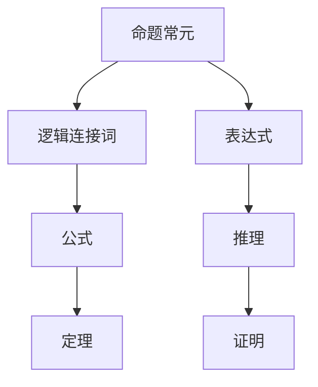

                 

# 数理逻辑：命题常元、谢孚竖

> 关键词：数理逻辑, 命题逻辑, 常元, 公式, 推理, 定理证明, 自然演绎, 谢孚竖

## 1. 背景介绍

数理逻辑（Mathematical Logic）是研究形式化的推理方法的数学分支。它以命题逻辑为基础，进一步发展了谓词逻辑、集合论等理论。数理逻辑的研究涉及形式系统的构建、语义和语法的分析以及自动推理技术的发展。本文将介绍数理逻辑中的基本概念——命题常元和谢孚竖（Tarski's Vertical Bar symbol），并探讨其应用和影响。

## 2. 核心概念与联系

### 2.1 核心概念概述

在数理逻辑中，命题常元（Propositional Constant）是最基本的构建块之一。它表示一个不可分割的、具有独立性质的命题。命题常元可以用符号 $a, b, c, \ldots$ 来表示，如 $a, b$ 分别表示两个不同的命题常元。

谢孚竖（Tarski's Vertical Bar symbol），通常表示为 $|$ 或 $|+$，用于表示逻辑连接词，如“或”和“非”。谢孚竖连接两个命题常元，表示这两个命题的逻辑关系，如 $a|b$ 表示 $a$ 或 $b$ 中至少有一个为真。

### 2.2 核心概念原理和架构的 Mermaid 流程图



上述图表展示了数理逻辑的基本架构：
- 命题常元构成了表达式的基础。
- 逻辑连接词（如谢孚竖）将命题常元连接，形成表达式。
- 表达式进一步组合，形成公式。
- 公式经过推理，得出定理。
- 定理的证明基于逻辑推理规则。

## 3. 核心算法原理 & 具体操作步骤

### 3.1 算法原理概述

数理逻辑的推理过程基于命题逻辑的规则。命题逻辑中最基本的规则有“或”、“且”、“非”和“蕴含”（implication）等。这些规则通过形式化语言定义，确保逻辑推理过程的严格性和可验证性。

### 3.2 算法步骤详解

1. **定义命题常元和逻辑连接词**：
   - 确定命题常元集合 $C$，如 $C = \{a, b, c, \ldots\}$。
   - 定义逻辑连接词的集合 $O$，如 $O = \{\vee, \wedge, \neg, \rightarrow\}$，其中 $\vee$ 表示“或”，$\wedge$ 表示“且”，$\neg$ 表示“非”，$\rightarrow$ 表示“蕴含”。

2. **构建表达式**：
   - 将命题常元和逻辑连接词组合，形成表达式。例如，$a \vee b$ 表示 $a$ 或 $b$ 中至少有一个为真。

3. **构建公式**：
   - 表达式进一步组合，形成公式。例如，$(a \vee b) \wedge (c \rightarrow d)$ 表示 $a$ 或 $b$ 中至少有一个为真，且 $c \rightarrow d$ 为真。

4. **推理过程**：
   - 基于命题逻辑的规则，进行推理。例如，使用德摩根定律（De Morgan's Laws）来简化表达式：$\neg (a \wedge b) \equiv \neg a \vee \neg b$。

5. **定理证明**：
   - 根据逻辑规则和公理，证明公式的真假。例如，使用假言推理（modus ponens）证明 $(a \rightarrow b) \wedge a \rightarrow b$ 的真假。

### 3.3 算法优缺点

**优点**：
- 形式化推理，保证逻辑过程的严格性和可验证性。
- 可扩展性强，适用于各种复杂逻辑关系的表达和推理。

**缺点**：
- 表达和推理过程复杂，对初学者有一定的门槛。
- 不适用于非逻辑关系的情况，如概率和模糊逻辑。

### 3.4 算法应用领域

数理逻辑广泛应用于以下领域：
- **计算机科学**：逻辑编程、定理证明、形式验证。
- **哲学**：逻辑分析、语义分析、哲学论证。
- **数学**：数理逻辑学、集合论、图论。
- **法律**：法律逻辑、推理审判。

## 4. 数学模型和公式 & 详细讲解

### 4.1 数学模型构建

数理逻辑的数学模型由命题常元、逻辑连接词和逻辑规则组成。设 $C$ 为命题常元集合，$O$ 为逻辑连接词集合，则公式 $\phi$ 的形式可以表示为：

$$
\phi ::= c \mid \neg \phi \mid (\phi | \psi) \mid (\phi \wedge \psi) \mid (\phi \rightarrow \psi)
$$

其中 $c \in C$，$|$ 和 $\wedge$ 分别表示“或”和“且”，$\neg$ 表示“非”，$\rightarrow$ 表示“蕴含”。

### 4.2 公式推导过程

数理逻辑的推理基于一些基本公理和推理规则。例如，模态推理（modus ponens）规则为：
- 如果 $(a \rightarrow b)$ 和 $a$ 均为真，则 $b$ 也为真。

形式化表示为：
$$
\frac{a \rightarrow b, a}{b}
$$

### 4.3 案例分析与讲解

考虑以下公式：
$$
(a \rightarrow b) \wedge a \rightarrow b
$$

根据推理规则，可以简化为：
$$
\top
$$

其中 $\top$ 表示逻辑恒真，表示任意命题为真。

## 5. 项目实践：代码实例和详细解释说明

### 5.1 开发环境搭建

在Python中使用Sympy库来表示和推理命题逻辑。首先需要安装Sympy库：

```bash
pip install sympy
```

### 5.2 源代码详细实现

以下是一个使用Sympy库进行命题逻辑推理的示例：

```python
from sympy import symbols, And, Or, Not, Implies, Boolean

# 定义命题常元
a, b, c = symbols('a b c', bool=True)

# 构建表达式
expr = Or(a, Not(b))

# 推理过程
result = Implies(expr, Not(Not(expr)))

# 输出结果
print(result)
```

上述代码中，`Or` 表示“或”，`Not` 表示“非”，`Implies` 表示“蕴含”。程序输出结果为 `True`，表示 $a$ 或 $\neg b$ 蕴含 $\neg (\neg (a \vee \neg b))$。

### 5.3 代码解读与分析

Sympy库的符号计算功能使得数理逻辑的推理过程可以直接通过代码实现。符号 `symbols` 定义了命题常元，`Or` 和 `Not` 表示逻辑连接词，`Implies` 表示蕴含关系。推理过程使用 `And` 和 `Or` 连接命题常元，最终通过 `Implies` 进行逻辑推理。

## 6. 实际应用场景

### 6.1 定理证明

数理逻辑在定理证明中具有重要应用。例如，欧几里得几何中的“直角三角形斜边等于两直角边和”的定理，可以通过命题逻辑进行严格证明。

### 6.2 计算机程序验证

数理逻辑在计算机科学中的应用广泛。程序验证中，可以使用数理逻辑来表示程序的逻辑关系，通过逻辑推理和形式化验证来保证程序的正确性。

### 6.3 哲学论证

数理逻辑在哲学论证中也具有重要应用。例如，康德的哲学论证中，使用数理逻辑来表达其理性主义和经验主义的观点，并进行逻辑推理。

## 7. 工具和资源推荐

### 7.1 学习资源推荐

- 《逻辑学导论》（Introduction to Logic）：罗素和怀特海合著的经典逻辑学教材。
- 《数理逻辑导论》（Introduction to Mathematical Logic）：E. Tarski的经典教材，系统介绍了数理逻辑的基本概念和推理规则。

### 7.2 开发工具推荐

- Sympy：Python中的符号计算库，支持命题逻辑的推理和验证。
- Lean：数学证明助手，基于依赖型编程语言，支持数理逻辑的形式化证明。

### 7.3 相关论文推荐

- 《数理逻辑基础》（Foundations of Mathematical Logic）：Tarski的经典论文，奠定了数理逻辑的基础。
- 《自动推理与数理逻辑》（Automated Reasoning and Mathematical Logic）：H. Dyckhoff等人的综述文章，介绍了自动推理和数理逻辑的发展。

## 8. 总结：未来发展趋势与挑战

### 8.1 研究成果总结

数理逻辑作为数理科学的基础，对计算机科学、哲学等领域产生了深远影响。其严格的逻辑推理和形式化验证方法，为现代科学研究和工程实践提供了重要工具。

### 8.2 未来发展趋势

- 自动化推理：随着人工智能和机器学习的发展，自动化推理技术将得到更广泛的应用。
- 逻辑与语义分析：逻辑与语义分析的结合，将使得数理逻辑在自然语言处理等领域有更多应用。
- 多模态逻辑：逻辑与不同模态数据（如时间、空间、概率等）的结合，将拓展数理逻辑的应用范围。

### 8.3 面临的挑战

- 逻辑复杂性：数理逻辑的复杂性和形式化表达对初学者有一定的门槛。
- 工具和软件支持：现有工具和软件在处理大规模逻辑问题时，效率和可扩展性有待提升。
- 哲学和数学的挑战：数理逻辑的推理和证明过程，需要哲学和数学的深入理解，存在一定的难度。

### 8.4 研究展望

未来的研究将进一步探索数理逻辑与其他数学和计算机科学领域的结合，推动自动化推理、多模态逻辑、逻辑与语义分析等方向的发展。同时，数理逻辑的教育和普及也将成为重要的研究方向。

## 9. 附录：常见问题与解答

**Q1：数理逻辑与计算机科学有什么关系？**

A: 数理逻辑是计算机科学的基础之一。数理逻辑的严格推理方法和形式化表达，为计算机程序的设计和验证提供了重要工具。

**Q2：数理逻辑在实际应用中有哪些限制？**

A: 数理逻辑的表达和推理过程相对复杂，不适用于非逻辑关系的情况。同时，数理逻辑的严格性和形式化，可能在某些实际应用场景中显得过于繁复。

**Q3：数理逻辑在哲学中的作用是什么？**

A: 数理逻辑在哲学中主要用于形式化论证和语义分析。通过逻辑推理，哲学家可以更严格地表达和论证其哲学观点。

**Q4：什么是数理逻辑的公理和推理规则？**

A: 数理逻辑的公理是基本的、无法通过推理得出的命题，如“或”、“且”、“非”等。推理规则是基于公理进行的逻辑推理，如假言推理（modus ponens）、析取律（addition）等。

**Q5：数理逻辑的未来发展方向是什么？**

A: 未来数理逻辑将进一步结合自动化推理、多模态逻辑、逻辑与语义分析等方向，拓展其应用范围和深度。同时，数理逻辑的教育和普及也将成为重要的研究方向。

---

作者：禅与计算机程序设计艺术 / Zen and the Art of Computer Programming

