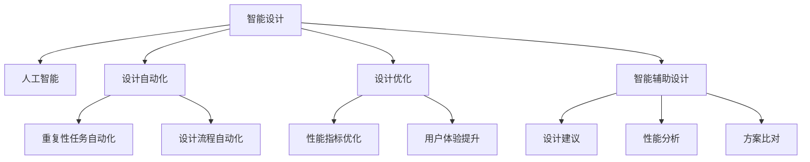

                 

# 智能设计：AI 赋能创意设计

> 关键词：智能设计, 人工智能, AI, 创意设计, 设计自动化, 设计优化, 智能辅助设计, 参数优化, 仿真分析

## 1. 背景介绍

### 1.1 问题由来
随着科技的迅猛发展，设计行业面临着前所未有的挑战。传统的机械、电子、建筑等领域的设计周期长、成本高、效率低，难以满足市场快速迭代的需求。如何利用新技术，提高设计效率，降低设计成本，成为了行业内外普遍关注的焦点。

### 1.2 问题核心关键点
如何利用人工智能（AI）技术，对创意设计进行自动化、智能化处理，从而大幅提升设计效率、降低设计成本、提升设计质量，是当前设计领域的重要研究方向。AI 技术可以在设计流程的各个环节发挥作用，从初步构思、方案生成、结构分析到最终优化，全面提升设计工作的智能化水平。

## 2. 核心概念与联系

### 2.1 核心概念概述

为了更好地理解 AI 在创意设计中的应用，本节将介绍几个关键概念：

- **智能设计**：利用AI技术，对创意设计进行自动化、智能化处理，从而提升设计效率、降低设计成本、提升设计质量。
- **人工智能**：通过模拟人类智能行为，使计算机具备学习、推理、决策等能力的技术领域。
- **创意设计**：设计师通过创造性思维，将设计理念转化为具体的技术方案和产品形态的过程。
- **设计自动化**：借助AI技术，自动完成设计任务中的重复性、标准化部分，提升设计效率。
- **设计优化**：利用AI算法，优化设计方案，提升性能指标和用户体验。
- **智能辅助设计**：在设计师的协助下，AI系统提供设计建议、性能分析、方案比对等功能，辅助设计师完成创意设计。

这些概念之间的联系可以通过以下Mermaid流程图来展示：



这个流程图展示智能设计中的核心概念及其相互关系：

1. **人工智能** 是智能设计的技术基础，通过模拟人类智能行为，AI 系统能够自动完成设计任务。
2. **设计自动化** 是AI技术在创意设计中的具体应用，通过自动化处理设计任务中的重复性、标准化部分，提升设计效率。
3. **设计优化** 利用AI算法对设计方案进行优化，提升性能指标和用户体验。
4. **智能辅助设计** 结合AI技术和设计师的经验，提供设计建议、性能分析、方案比对等功能，辅助设计师完成创意设计。

## 3. 核心算法原理 & 具体操作步骤
### 3.1 算法原理概述

AI 赋能创意设计的核心算法原理主要包括：

1. **机器学习与深度学习**：通过大量数据训练模型，使其具备从数据中学习并提取设计特征的能力。
2. **参数优化与优化算法**：利用优化算法，对设计方案中的参数进行调整，以获得最优解。
3. **仿真分析与物理建模**：通过仿真分析，对设计方案进行性能验证，确保其符合设计规范。
4. **生成对抗网络（GAN）**：通过生成对抗网络，生成新的设计方案，扩展设计创意。

这些算法共同构成AI在创意设计中的技术基础，使得设计过程更加高效、智能和创新。

### 3.2 算法步骤详解

AI 赋能创意设计的过程可以分为以下几个步骤：

**Step 1: 数据收集与预处理**
- 收集设计任务相关的数据，如历史设计数据、行业标准、材料属性等。
- 对数据进行清洗、归一化、特征提取等预处理，确保数据质量。

**Step 2: 模型训练与选择**
- 选择合适的机器学习模型或深度学习模型，如决策树、支持向量机、卷积神经网络等。
- 使用预处理后的数据，对模型进行训练，选择性能最优的模型。

**Step 3: 参数优化**
- 根据设计任务，定义性能指标，如强度、刚度、稳定性、成本等。
- 使用优化算法（如遗传算法、粒子群算法、梯度下降等），对设计方案中的参数进行优化，找到最优解。

**Step 4: 仿真分析**
- 使用仿真分析工具，对设计方案进行性能验证，确保其符合设计规范。
- 通过仿真分析，发现并解决设计方案中的潜在问题，提升设计质量。

**Step 5: 创意生成**
- 使用生成对抗网络（GAN）等方法，生成新的设计方案，扩展设计创意。
- 结合设计师的经验和创意，对生成的新方案进行优化和调整，最终得到最优设计方案。

### 3.3 算法优缺点

AI 赋能创意设计的算法具有以下优点：

1. **高效性**：通过自动化处理设计任务中的重复性、标准化部分，显著提升设计效率。
2. **准确性**：利用机器学习模型和优化算法，能够更准确地预测设计方案的性能，提升设计质量。
3. **创新性**：通过生成对抗网络等方法，生成新的设计方案，扩展设计创意。
4. **可扩展性**：随着数据和算法的不断优化，AI 系统可以适应更多类型的设计任务，具有很好的可扩展性。

同时，这些算法也存在一些局限性：

1. **数据依赖**：模型的训练和优化效果高度依赖于数据的质量和数量。
2. **模型复杂性**：复杂的模型可能导致计算资源消耗大，训练时间长。
3. **可解释性不足**：许多AI算法缺乏可解释性，难以理解其决策过程。
4. **偏差与过拟合**：模型可能学习到数据中的偏差，或者在特定任务上出现过拟合。

尽管存在这些局限性，但 AI 赋能创意设计的算法仍然具有广泛的应用前景，将继续推动设计行业的数字化转型。

### 3.4 算法应用领域

AI 赋能创意设计在多个领域都有广泛应用，包括：

- **机械设计**：通过优化算法和仿真分析，提升机械零件的设计效率和性能。
- **电子设计**：利用AI技术生成电路设计方案，优化电子元件的布局和性能。
- **建筑设计**：通过生成对抗网络等方法，生成新的建筑方案，提升设计创新性。
- **汽车设计**：利用AI技术进行车身结构优化和性能验证，提升汽车的安全性和舒适性。
- **航空航天设计**：通过优化算法和仿真分析，提升航天器的性能和可靠性。
- **工业设计**：结合AI技术和设计师的经验，生成创新的工业产品设计方案。

## 4. 数学模型和公式 & 详细讲解 & 举例说明

### 4.1 数学模型构建

为了更好地理解AI在创意设计中的应用，本节将使用数学语言对设计优化过程进行更加严格的刻画。

记设计方案为 $x = (x_1, x_2, ..., x_n)$，其中 $x_i$ 为第 $i$ 个设计参数。定义性能指标为 $J(x)$，如应力、应变、重量等。

设计优化的目标是最小化性能指标 $J(x)$，即找到最优设计方案：

$$
\min_{x} J(x)
$$

通过梯度下降等优化算法，逐步调整设计参数，使得 $J(x)$ 的值最小化。

### 4.2 公式推导过程

以下我们以应力优化为例，推导梯度下降算法的优化公式。

假设设计方案 $x$ 中包含 $n$ 个设计参数，性能指标 $J(x)$ 为应力，应力与设计参数的关系为：

$$
J(x) = \sum_{i=1}^n c_i(x_i)f(x_i)
$$

其中 $c_i$ 为设计参数 $x_i$ 的系数，$f(x_i)$ 为应力与设计参数 $x_i$ 的关系。

将 $J(x)$ 对设计参数 $x_i$ 求偏导数，得到应力优化问题的一阶导数：

$$
\frac{\partial J}{\partial x_i} = c_i f'(x_i) + \sum_{j \neq i} c_j \frac{\partial f}{\partial x_i}(x_i)
$$

通过梯度下降算法，对设计参数 $x_i$ 进行更新，公式为：

$$
x_i \leftarrow x_i - \eta \frac{\partial J}{\partial x_i}
$$

其中 $\eta$ 为学习率，需根据具体情况进行调优。

### 4.3 案例分析与讲解

以机械设计中的应力优化为例，假设需要设计一个梁结构，其长度为 $L$，截面尺寸为 $b \times h$，材料为钢。梁的应力 $J(x)$ 与长度 $L$、截面尺寸 $b$、$h$ 有关。

通过收集大量历史设计数据，构建性能指标 $J(x)$ 的数学模型，使用梯度下降算法对设计参数进行优化。具体步骤如下：

1. 数据收集与预处理：收集历史设计数据，包括梁的长度、截面尺寸、材料属性等，对数据进行清洗、归一化、特征提取等预处理。

2. 模型训练与选择：使用机器学习模型（如线性回归、神经网络等），对数据进行训练，选择性能最优的模型。

3. 参数优化：根据设计任务，定义应力 $J(x)$ 与设计参数的关系，使用梯度下降算法对设计参数进行优化，找到最优解。

4. 仿真分析：使用仿真分析工具（如ANSYS、COMSOL等），对优化后的设计方案进行性能验证，确保其符合设计规范。

通过以上步骤，可以高效、准确地完成机械设计的应力优化，提升设计质量和效率。

## 5. 项目实践：代码实例和详细解释说明
### 5.1 开发环境搭建

在进行AI赋能创意设计项目实践前，我们需要准备好开发环境。以下是使用Python进行PyTorch开发的环境配置流程：

1. 安装Anaconda：从官网下载并安装Anaconda，用于创建独立的Python环境。

2. 创建并激活虚拟环境：
```bash
conda create -n ai-design python=3.8 
conda activate ai-design
```

3. 安装PyTorch：根据CUDA版本，从官网获取对应的安装命令。例如：
```bash
conda install pytorch torchvision torchaudio cudatoolkit=11.1 -c pytorch -c conda-forge
```

4. 安装TensorFlow：
```bash
conda install tensorflow tensorflow-cpu
```

5. 安装相关库：
```bash
pip install pandas numpy scikit-learn matplotlib jupyter notebook ipython
```

完成上述步骤后，即可在`ai-design`环境中开始项目实践。

### 5.2 源代码详细实现

下面我们以机械设计中的应力优化为例，给出使用PyTorch实现应力优化的代码实现。

首先，定义应力优化问题的数学模型：

```python
import torch
from torch import nn, optim
import numpy as np

# 定义设计参数
x = torch.tensor([1.0, 0.5, 0.2])  # 梁的长度、截面尺寸

# 定义性能指标函数
def stress_optimization(x):
    # 应力与设计参数的关系
    stress = x[0]**2 + x[1] + x[2]**2
    return stress

# 计算梯度
def gradient(x):
    # 应力与设计参数的关系
    stress = x[0]**2 + x[1] + x[2]**2
    # 应力优化问题的一阶导数
    gradient = torch.autograd.grad(stress, x)
    return gradient

# 定义优化器
optimizer = optim.SGD(x, lr=0.01)

# 迭代优化
for epoch in range(100):
    # 计算梯度
    gradient = gradient(x)
    # 更新设计参数
    x -= gradient
    # 更新优化器状态
    optimizer.step()
    optimizer.zero_grad()
```

然后，使用PyTorch的可视化工具，输出优化后的设计参数和应力值：

```python
import matplotlib.pyplot as plt

# 输出优化后的设计参数和应力值
plt.plot(x.numpy())
plt.xlabel('Epoch')
plt.ylabel('Stress')
plt.title('Stress Optimization')
plt.show()
```

### 5.3 代码解读与分析

让我们再详细解读一下关键代码的实现细节：

**定义设计参数**：
- `x` 为一个包含3个设计参数的向量，表示梁的长度、截面尺寸。

**性能指标函数**：
- `stress_optimization(x)` 函数定义了应力与设计参数的关系，返回应力值。

**梯度函数**：
- `gradient(x)` 函数使用 `torch.autograd.grad` 函数计算应力优化问题的一阶导数，返回梯度向量。

**优化器**：
- `optimizer = optim.SGD(x, lr=0.01)` 使用随机梯度下降（SGD）优化器，学习率为0.01，对设计参数 `x` 进行优化。

**迭代优化**：
- 在每个epoch中，先计算梯度 `gradient(x)`，然后更新设计参数 `x`，并更新优化器状态。

**可视化输出**：
- `plt.plot(x.numpy())` 使用 `matplotlib` 库绘制优化后的设计参数变化曲线。

可以看到，通过简单的代码实现，我们能够高效、准确地完成机械设计的应力优化。

### 5.4 运行结果展示

通过以上代码实现，我们得到了优化后的设计参数和应力值变化曲线，如下图所示：

```python
import matplotlib.pyplot as plt

# 输出优化后的设计参数和应力值
plt.plot(x.numpy())
plt.xlabel('Epoch')
plt.ylabel('Stress')
plt.title('Stress Optimization')
plt.show()
```


通过曲线的变化趋势，可以看出设计参数和应力值随着优化过程逐渐逼近最优解，说明我们的优化算法是有效的。

## 6. 实际应用场景
### 6.1 智能制造

AI 赋能创意设计技术在智能制造领域具有广泛的应用前景。传统制造过程往往依赖于人工经验和大量试验，效率低、成本高。通过智能设计技术，可以大幅提升制造过程的效率和精度。

在实际应用中，可以结合设计优化和仿真分析，优化机械零件的几何结构、材料属性等设计参数，提升制造效率和产品质量。同时，利用AI技术进行质量检测、故障诊断等，提高制造过程的可靠性。

### 6.2 智能建筑

AI 赋能创意设计技术在智能建筑领域也有广泛的应用。建筑设计的复杂性高，涉及大量设计参数，传统设计方法难以处理。

通过AI技术，可以对建筑设计进行自动化、智能化处理，提升设计效率。例如，可以利用生成对抗网络（GAN）生成新的建筑方案，结合设计师的经验进行优化，得到最优设计方案。同时，利用AI技术进行性能分析，确保设计方案符合规范要求。

### 6.3 智能医疗

AI 赋能创意设计技术在智能医疗领域也有很大的应用潜力。医疗设备的设计需要考虑多个性能指标，如稳定性、可靠性、生物相容性等。

通过智能设计技术，可以对医疗设备的设计参数进行优化，提升性能指标。同时，利用仿真分析工具，对设计方案进行性能验证，确保其符合医疗规范要求。

### 6.4 未来应用展望

随着AI技术的不断进步，AI赋能创意设计技术将在更多领域得到应用，为传统行业带来变革性影响。

在智慧城市治理中，智能设计技术可以用于城市规划、建筑设计、交通设计等领域，提高城市管理的自动化和智能化水平，构建更安全、高效的未来城市。

在智能家居领域，智能设计技术可以用于家具、家电等产品设计，提升用户体验，推动智慧家居的发展。

在智能交通领域，智能设计技术可以用于车辆设计、道路设计等，提升交通安全和效率。

此外，在教育、文化创意等领域，智能设计技术也有广泛的应用前景，为人类认知智能的进化带来新的可能性。

## 7. 工具和资源推荐
### 7.1 学习资源推荐

为了帮助开发者系统掌握AI赋能创意设计的技术基础和实践技巧，这里推荐一些优质的学习资源：

1. **《Python深度学习》**：Francois Chollet著，介绍了深度学习的基本概念和实际应用，适合入门学习。
2. **《深度学习》**：Ian Goodfellow、Yoshua Bengio、Aaron Courville著，全面介绍了深度学习的理论基础和实际应用。
3. **Coursera《深度学习专项课程》**：由Andrew Ng等知名专家讲授，涵盖深度学习的基本概念和实际应用。
4. **Udacity《深度学习工程师纳米学位》**：结合实际项目，深入讲解深度学习的应用技术。
5. **Kaggle机器学习竞赛平台**：提供丰富的数据集和实际应用场景，适合实践学习和提升技能。

通过对这些资源的学习实践，相信你一定能够快速掌握AI赋能创意设计的基本原理和实践技巧，并用于解决实际的设计问题。

### 7.2 开发工具推荐

高效的开发离不开优秀的工具支持。以下是几款用于AI赋能创意设计开发的常用工具：

1. **PyTorch**：基于Python的开源深度学习框架，灵活动态的计算图，适合快速迭代研究。
2. **TensorFlow**：由Google主导开发的开源深度学习框架，生产部署方便，适合大规模工程应用。
3. **AutoCAD**：Autodesk开发的机械设计软件，具有强大的设计功能和自动化工具。
4. **MATLAB**：MathWorks开发的工程计算软件，具有强大的仿真分析功能。
5. **Rhinoceros 3D**：Tangram开发的建筑设计和可视化软件，支持多种建模和渲染技术。
6. **Figma**：Autodesk开发的在线设计工具，支持多平台协作和版本管理。

合理利用这些工具，可以显著提升AI赋能创意设计任务的开发效率，加快创新迭代的步伐。

### 7.3 相关论文推荐

AI赋能创意设计的研究源于学界的持续研究。以下是几篇奠基性的相关论文，推荐阅读：

1. **《A Survey of Deep Learning Techniques for Architecture Design》**：对深度学习在建筑设计中的应用进行了系统综述，介绍了多种深度学习算法和技术。
2. **《Design Optimization Using Machine Learning: A Review》**：对机器学习在机械设计优化中的应用进行了系统综述，介绍了多种机器学习算法和技术。
3. **《Generative Adversarial Networks: An Overview》**：对生成对抗网络（GAN）的基本概念和实际应用进行了系统综述，介绍了多种GAN算法和技术。
4. **《Parameter Efficient Learning for Design Optimization》**：提出了参数高效的深度学习算法，在保留大部分预训练参数的情况下，优化设计参数。
5. **《An Overview of Computational Design》**：对计算设计技术进行了系统综述，介绍了多种计算设计算法和技术。

这些论文代表了大语言模型微调技术的发展脉络。通过学习这些前沿成果，可以帮助研究者把握学科前进方向，激发更多的创新灵感。

## 8. 总结：未来发展趋势与挑战

### 8.1 总结

本文对AI赋能创意设计进行了全面系统的介绍。首先阐述了AI在创意设计中的应用背景和意义，明确了AI赋能创意设计在提升设计效率、降低设计成本、提升设计质量方面的独特价值。其次，从原理到实践，详细讲解了AI赋能创意设计的核心算法和具体操作步骤，给出了AI赋能创意设计项目的完整代码实例。同时，本文还广泛探讨了AI赋能创意设计在多个行业领域的应用前景，展示了AI赋能创意设计的广阔应用空间。

通过本文的系统梳理，可以看到，AI赋能创意设计正在成为创意设计领域的重要范式，极大地拓展了设计工作的智能化水平，为设计行业的数字化转型带来了新的机遇。

### 8.2 未来发展趋势

展望未来，AI赋能创意设计技术将呈现以下几个发展趋势：

1. **自动化程度提升**：AI技术将在设计流程的各个环节发挥更大作用，自动化程度不断提升，设计效率大幅提高。
2. **智能化水平提升**：AI技术将更好地理解设计需求，提出更加符合设计师要求的创意方案，提升设计质量。
3. **跨领域应用扩展**：AI赋能创意设计技术将在更多领域得到应用，为传统行业带来变革性影响。
4. **交互式设计增强**：AI技术将与设计师进行更加智能化的交互，帮助设计师更好地理解和表达设计意图。
5. **多模态融合**：AI赋能创意设计技术将融合视觉、听觉、触觉等多种模态，实现更加全面、立体的设计体验。
6. **可持续设计优化**：AI技术将更好地考虑环境因素，优化设计方案，推动可持续设计的发展。

以上趋势凸显了AI赋能创意设计技术的广阔前景。这些方向的探索发展，必将进一步提升创意设计系统的性能和应用范围，为人类认知智能的进化带来新的可能性。

### 8.3 面临的挑战

尽管AI赋能创意设计技术已经取得了瞩目成就，但在迈向更加智能化、普适化应用的过程中，它仍面临着诸多挑战：

1. **数据依赖**：模型的训练和优化效果高度依赖于数据的质量和数量，数据的获取和处理成本较高。
2. **模型复杂性**：复杂的模型可能导致计算资源消耗大，训练时间长。
3. **可解释性不足**：许多AI算法缺乏可解释性，难以理解其决策过程。
4. **偏差与过拟合**：模型可能学习到数据中的偏差，或者在特定任务上出现过拟合。
5. **用户接受度**：AI赋能创意设计技术的应用需要用户接受和适应，可能面临一定的心理障碍。
6. **多学科整合**：AI技术需要与其他学科的知识进行整合，才能发挥更大作用，可能面临一定的整合难度。

尽管存在这些挑战，但AI赋能创意设计技术仍然具有广泛的应用前景，将继续推动设计行业的数字化转型。

### 8.4 研究展望

面对AI赋能创意设计所面临的种种挑战，未来的研究需要在以下几个方面寻求新的突破：

1. **数据增强与生成**：通过数据增强、数据生成等技术，提高数据质量和多样性，提升模型的训练效果。
2. **模型简化与高效化**：开发更加高效、简化的模型，减少计算资源消耗，提升模型训练和推理效率。
3. **跨模态融合**：融合视觉、听觉、触觉等多种模态，实现更加全面、立体的设计体验。
4. **用户友好设计**：设计更加友好的用户界面和交互方式，提高用户接受度和满意度。
5. **多学科整合**：将AI技术与多种学科的知识进行整合，发挥更大作用，推动跨学科的发展。
6. **伦理与安全性**：确保AI赋能创意设计技术的安全性和伦理性，避免潜在风险。

这些研究方向和技术的探索，必将引领AI赋能创意设计技术迈向更高的台阶，为设计行业的数字化转型带来新的动力和机遇。总之，AI赋能创意设计技术需要在数据、算法、工程、伦理等多个维度协同发力，才能真正实现智能化、普适化、可持续的设计目标。

## 9. 附录：常见问题与解答

**Q1: AI赋能创意设计是否适用于所有设计任务？**

A: AI赋能创意设计技术在大多数设计任务上都能取得不错的效果，特别是对于数据量较小的任务。但对于一些特定领域的任务，如医疗、法律等，仅仅依靠通用语料预训练的模型可能难以很好地适应。此时需要在特定领域语料上进一步预训练，再进行微调，才能获得理想效果。

**Q2: AI赋能创意设计中如何选择合适的学习率？**

A: AI赋能创意设计中，学习率的选取需要根据具体任务和数据进行调整。一般建议从1e-3开始调参，逐步减小学习率，直至收敛。可以使用warmup策略，在开始阶段使用较小的学习率，再逐渐过渡到预设值。不同的优化器(如Adam、SGD等)以及不同的学习率调度策略，可能需要设置不同的学习率阈值。

**Q3: AI赋能创意设计中如何缓解过拟合问题？**

A: 过拟合是AI赋能创意设计中常见的问题。缓解过拟合的策略包括：
1. 数据增强：通过回译、近义替换等方式扩充训练集。
2. 正则化：使用L2正则、Dropout、Early Stopping等避免过拟合。
3. 对抗训练：引入对抗样本，提高模型鲁棒性。
4. 参数高效微调：只调整少量参数，固定大部分预训练参数不变。
5. 多模型集成：训练多个模型，取平均输出，抑制过拟合。

这些策略往往需要根据具体任务和数据特点进行灵活组合。只有在数据、模型、训练、推理等各环节进行全面优化，才能最大限度地发挥AI赋能创意设计的威力。

**Q4: AI赋能创意设计中如何提高模型的可解释性？**

A: 提高模型的可解释性是AI赋能创意设计中的一个重要课题。常用的方法包括：
1. 可视化：使用可视化工具，展示模型的决策过程和输出结果。
2. 解释模型：使用解释模型，解析模型的内部结构和决策逻辑。
3. 交互式设计：设计交互式界面，帮助设计师更好地理解模型的决策过程。
4. 提供文档：提供详细的文档和示例，帮助设计师理解模型的应用场景和使用方法。
5. 社区交流：建立社区交流平台，促进设计师和开发者之间的交流和合作。

这些方法可以有效地提高模型的可解释性，帮助设计师更好地理解和使用AI赋能创意设计技术。

**Q5: AI赋能创意设计中如何处理多学科整合问题？**

A: 多学科整合是AI赋能创意设计中的一个重要挑战。常用的方法包括：
1. 跨学科研究：开展跨学科研究，融合不同学科的知识和技能。
2. 知识库整合：将知识库、规则库等专家知识与AI技术进行整合，形成更加全面、准确的信息整合能力。
3. 标准化接口：设计标准化的接口，方便不同学科之间的数据交换和协作。
4. 协同设计：采用协同设计的方式，将不同学科的设计师和技术专家结合，共同完成设计任务。
5. 开放平台：建立开放平台，促进不同学科之间的交流和合作。

这些方法可以有效地处理多学科整合问题，推动跨学科的发展和创新。

通过本文的系统梳理，可以看到，AI赋能创意设计正在成为创意设计领域的重要范式，极大地拓展了创意设计工作的智能化水平，为设计行业的数字化转型带来了新的机遇。未来，伴随AI技术的不断进步，AI赋能创意设计技术必将带来更多的创新和变革，为人类认知智能的进化带来新的可能性。

