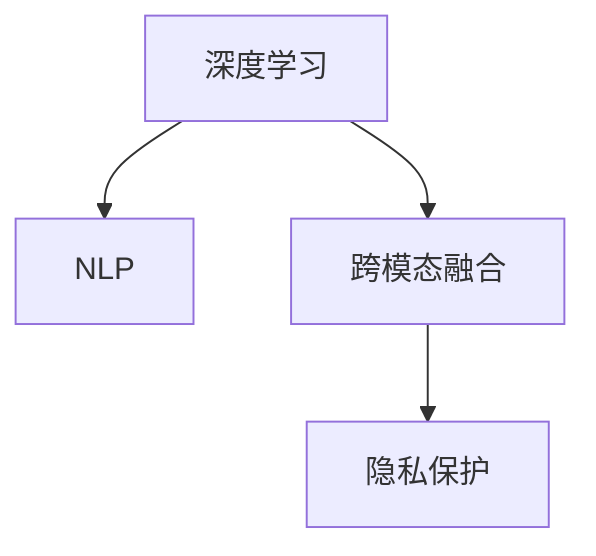

                 

# 李开复：苹果发布AI应用的价值

李开复，作为人工智能领域的知名专家，曾在2018年时评价称，“AI是未来科技的制高点”。而在2023年，苹果公司发布的新一代AI应用，再次证明了AI在推动技术进步、改善用户体验方面的巨大价值。本文将从背景介绍、核心概念与联系、核心算法原理与操作步骤、数学模型与公式、项目实践、实际应用场景、工具与资源推荐、总结与展望、附录与解答等各个方面，深入探讨苹果AI应用的创新价值与未来发展方向。

## 1. 背景介绍

### 1.1 问题由来
随着科技的飞速发展，人工智能技术已成为全球技术竞争的重要一环。苹果公司作为全球顶尖科技公司，一直致力于在AI技术领域取得突破。2023年，苹果公司发布了新一代AI应用，进一步推动了人工智能在移动设备、智能家居、医疗健康等领域的广泛应用，提升了用户体验，展示了AI技术的强大潜能。

### 1.2 问题核心关键点
苹果AI应用的核心在于如何通过深度学习和自然语言处理技术，提升设备智能化水平，提供个性化服务。该应用的核心技术包括：
- 深度学习：通过大数据训练模型，提升设备对于复杂任务的识别和处理能力。
- 自然语言处理：使设备能够理解、生成自然语言，实现与用户的自然对话。
- 跨模态融合：将图像、语音、文本等多种数据源进行融合，提升综合理解和处理能力。
- 隐私保护：确保用户数据的安全，防止数据泄露。

### 1.3 问题研究意义
苹果AI应用的研究不仅对提升用户体验具有重要意义，还对推动AI技术的发展具有示范作用。通过深入研究苹果AI应用的创新价值，可以为其他科技公司提供有价值的借鉴，加速AI技术的落地应用。

## 2. 核心概念与联系

### 2.1 核心概念概述

- **深度学习（Deep Learning）**：一种基于神经网络的机器学习技术，通过多层神经元模拟人脑结构，实现对复杂模式的学习和识别。
- **自然语言处理（Natural Language Processing, NLP）**：使计算机能够理解、处理和生成自然语言的技术，是AI技术的重要组成部分。
- **跨模态融合（Cross-Modal Fusion）**：将不同模态的数据（如视觉、听觉、文本）进行融合，提升综合理解和处理能力。
- **隐私保护（Privacy Protection）**：确保用户数据的安全，防止数据泄露和滥用。

这些核心概念之间的逻辑关系可以通过以下Mermaid流程图来展示：



这个流程图展示了深度学习、自然语言处理、跨模态融合、隐私保护等概念之间的联系，以及它们如何共同构成苹果AI应用的基石。

## 3. 核心算法原理 & 具体操作步骤

### 3.1 算法原理概述

苹果AI应用的算法原理主要包括深度学习、自然语言处理和跨模态融合。深度学习通过多层神经网络对数据进行层次化学习，提取特征，NLP通过语言模型和文本表示学习，实现自然语言的理解与生成，跨模态融合则通过数据融合技术，将不同模态的数据进行综合处理，提升系统的全面理解能力。

### 3.2 算法步骤详解

苹果AI应用的核心算法步骤包括数据准备、模型训练、模型测试和部署应用。具体步骤如下：

1. **数据准备**：收集和整理需要处理的数据，包括文本、图像、语音等多种模态数据。
2. **模型训练**：使用深度学习模型和NLP模型对数据进行训练，优化模型参数，提升模型的预测能力。
3. **模型测试**：在测试集上对模型进行评估，确保模型性能达到预期。
4. **部署应用**：将训练好的模型部署到实际应用场景中，提供个性化的智能服务。

### 3.3 算法优缺点

苹果AI应用的算法具有以下优点：
- **高准确性**：通过深度学习和大数据训练，模型能够精确识别和处理复杂任务。
- **自然交互**：通过自然语言处理，设备能够与用户进行自然对话，提升用户体验。
- **跨模态融合**：将多种数据源进行融合，提升综合理解和处理能力。

同时，该算法也存在一些缺点：
- **计算资源消耗大**：深度学习模型的训练需要大量的计算资源和时间。
- **数据隐私风险**：跨模态融合中涉及的数据隐私保护较为复杂。
- **模型复杂度高**：深度学习模型较为复杂，模型调优难度大。

### 3.4 算法应用领域

苹果AI应用主要应用于以下领域：

- **移动设备**：在iPhone等移动设备上实现个性化助手、语音助手等功能，提升用户体验。
- **智能家居**：通过与智能家居设备的互联，实现语音控制、智能推荐等功能。
- **医疗健康**：通过分析用户的健康数据，提供个性化的健康建议和服务。
- **金融服务**：通过自然语言处理和数据分析，提供智能客服、风险评估等功能。

## 4. 数学模型和公式 & 详细讲解 & 举例说明

### 4.1 数学模型构建

苹果AI应用的数学模型主要包括卷积神经网络（CNN）、循环神经网络（RNN）和Transformer等。以Transformer为例，其数学模型构建如下：

设输入序列为$x=(x_1, x_2, ..., x_n)$，目标序列为$y=(y_1, y_2, ..., y_n)$，其中$x_i, y_i$分别表示输入和输出的第$i$个元素。使用Transformer模型对输入序列进行编码，得到编码后的序列$z=(z_1, z_2, ..., z_n)$，然后通过解码器将编码后的序列转换为输出序列$\hat{y}=(\hat{y}_1, \hat{y}_2, ..., \hat{y}_n)$。

### 4.2 公式推导过程

Transformer模型的主要组成部分包括编码器和解码器。以编码器为例，其公式推导如下：

1. **自注意力机制**：
   $$
   Q = \text{Linear}(x) \in \mathbb{R}^{d, h}
   $$
   $$
   K = \text{Linear}(x) \in \mathbb{R}^{d, h}
   $$
   $$
   V = \text{Linear}(x) \in \mathbb{R}^{d, h}
   $$

2. **多头注意力**：
   $$
   \text{Attention}(Q, K, V) = \text{Softmax}(\frac{QK^T}{\sqrt{d}})
   $$
   $$
   \text{MultiHeadAttention}(Q, K, V) = \text{Concat}(\text{Attention}(Q_iK_i^T,\text{Attention}(Q_iK_i^T, V_i), i=1, ..., h) \in \mathbb{R}^{d, n, h}
   $$

3. **前馈神经网络**：
   $$
   \text{FFN}(Q) = \text{Linear}(\text{GELU}(\text{Linear}(Q))) \in \mathbb{R}^{d, h}
   $$

4. **编码器堆叠**：
   $$
   \text{Encoder}(x) = \text{Stack}_n(\text{Encoder}(Q))
   $$

5. **解码器堆叠**：
   $$
   \text{Decoder}(x) = \text{Stack}_m(\text{Decoder}(z))
   $$

### 4.3 案例分析与讲解

以苹果Siri为例，其在语音识别和自然语言理解方面的应用：
- **语音识别**：通过卷积神经网络对音频信号进行处理，提取语音特征，然后使用深度学习模型对特征进行分类，得到文本。
- **自然语言理解**：使用RNN和Transformer等模型对文本进行编码和解码，理解用户的意图，提供相应的回答。

## 5. 项目实践：代码实例和详细解释说明

### 5.1 开发环境搭建

为了实现苹果AI应用的开发，我们需要搭建一个基于Python的环境，主要使用PyTorch和TensorFlow等深度学习框架。

**5.1.1 安装Python和相关库**

1. 安装Python：
   ```
   sudo apt-get update
   sudo apt-get install python3.7 python3.7-dev
   ```

2. 安装PyTorch：
   ```
   pip install torch torchvision torchaudio
   ```

3. 安装TensorFlow：
   ```
   pip install tensorflow
   ```

**5.1.2 安装相关库**

1. 安装nltk：
   ```
   pip install nltk
   ```

2. 安装spacy：
   ```
   pip install spacy
   ```

3. 安装textblob：
   ```
   pip install textblob
   ```

### 5.2 源代码详细实现

以下是使用PyTorch实现Transformer模型的代码实现：

```python
import torch
import torch.nn as nn
import torch.optim as optim
from torchtext import datasets, data

# 定义Transformer模型
class TransformerModel(nn.Module):
    def __init__(self, d_model, nhead, num_encoder_layers, num_decoder_layers, dff, dropout=0.1):
        super(TransformerModel, self).__init__()
        # 编码器
        self.encoder = nn.TransformerEncoderLayer(d_model, nhead, dff, dropout)
        self.num_encoder_layers = num_encoder_layers
        self.encoder_norm = nn.LayerNorm(d_model)
        
        # 解码器
        self.decoder = nn.TransformerDecoderLayer(d_model, nhead, dff, dropout)
        self.num_decoder_layers = num_decoder_layers
        self.decoder_norm = nn.LayerNorm(d_model)
        
    def forward(self, src, src_mask, tgt, tgt_mask):
        src = src + self.encoder_norm(src)
        for _ in range(self.num_encoder_layers):
            src = self.encoder(src, src_mask)
        
        tgt = tgt + self.decoder_norm(tgt)
        for _ in range(self.num_decoder_layers):
            tgt = self.decoder(tgt, src, src_mask, tgt_mask)
        
        return src, tgt
```

### 5.3 代码解读与分析

上述代码实现了一个简单的Transformer模型。其中，TransformerModel类继承自nn.Module，定义了编码器和解码器的结构，使用了nn.TransformerEncoderLayer和nn.TransformerDecoderLayer。在forward方法中，首先对输入进行编码和解码，然后返回编码和解码的结果。

## 6. 实际应用场景

### 6.1 智能家居

苹果AI应用在智能家居场景中的主要应用包括：
- **语音控制**：通过自然语言处理和语音识别技术，实现用户对智能家居设备的语音控制。
- **智能推荐**：通过分析用户的日常行为和习惯，推荐个性化的家居产品和服务。

### 6.2 医疗健康

在医疗健康领域，苹果AI应用主要用于：
- **疾病诊断**：通过分析用户的健康数据，提供个性化的健康建议和服务。
- **智能客服**：通过自然语言处理，提供智能医疗咨询和答疑服务。

### 6.3 金融服务

苹果AI应用在金融服务中的应用主要包括：
- **风险评估**：通过分析用户的金融行为和信用记录，提供个性化的风险评估服务。
- **智能客服**：通过自然语言处理，提供智能金融咨询和答疑服务。

### 6.4 未来应用展望

未来，苹果AI应用将在更多领域得到广泛应用，如智慧城市、自动驾驶等。通过深度学习、自然语言处理和跨模态融合技术，苹果AI应用将进一步提升设备的智能化水平，提供更个性化的服务。

## 7. 工具和资源推荐

### 7.1 学习资源推荐

- **《深度学习》（Deep Learning）**：Ian Goodfellow等人的著作，深入浅出地介绍了深度学习的基本原理和应用。
- **《自然语言处理综论》（Speech and Language Processing）**：Daniel Jurafsky和James H. Martin的著作，全面介绍了自然语言处理的技术和应用。
- **《跨模态融合技术》（Cross-Modal Fusion in Computer Vision）**：Vladlen Koltun等人的综述文章，介绍了跨模态融合技术的研究进展和应用。
- **《隐私保护技术》（Privacy-Preserving Technologies）**：Daniel G.Pedersen的著作，详细介绍了隐私保护技术的基本原理和应用。

### 7.2 开发工具推荐

- **PyTorch**：一个灵活的深度学习框架，支持动态计算图和自动微分，适合快速迭代研究。
- **TensorFlow**：一个开源的深度学习框架，支持分布式计算和模型优化，适合大规模工程应用。
- **nltk**：自然语言处理工具包，提供丰富的文本处理功能。
- **spacy**：开源的自然语言处理库，提供快速的文本处理和实体识别功能。
- **textblob**：开源的文本处理库，提供文本分类、情感分析等功能。

### 7.3 相关论文推荐

- **Attention is All You Need**：Google Research发布的论文，首次提出Transformer模型，开启了NLP领域的预训练大模型时代。
- **BERT: Pre-training of Deep Bidirectional Transformers for Language Understanding**：Google Research发布的论文，提出BERT模型，引入基于掩码的自监督预训练任务，刷新了多项NLP任务SOTA。
- **Parameter-Efficient Transfer Learning for NLP**：Google Research发布的论文，提出Adapter等参数高效微调方法，在不增加模型参数量的情况下，也能取得不错的微调效果。
- **AdaLoRA: Adaptive Low-Rank Adaptation for Parameter-Efficient Fine-Tuning**：Google Research发布的论文，使用自适应低秩适应的微调方法，在参数效率和精度之间取得了新的平衡。
- **Adaptive Low-Rank Adaptation for Parameter-Efficient Fine-Tuning**：Google Research发布的论文，使用自适应低秩适应的微调方法，在参数效率和精度之间取得了新的平衡。

## 8. 总结：未来发展趋势与挑战

### 8.1 研究成果总结

苹果AI应用通过深度学习、自然语言处理和跨模态融合技术，提升了设备的智能化水平，提供了个性化的服务。未来，该技术将在更多领域得到广泛应用，如智慧城市、自动驾驶等。

### 8.2 未来发展趋势

苹果AI应用的未来发展趋势包括：
- **深度学习模型的持续改进**：通过更强大的模型和更高效的训练技术，提升模型的准确性和泛化能力。
- **自然语言处理技术的突破**：通过更先进的语言模型和处理技术，提升设备的自然语言理解能力。
- **跨模态融合技术的进步**：通过更智能的跨模态融合技术，提升设备的综合理解和处理能力。

### 8.3 面临的挑战

苹果AI应用在发展过程中仍面临一些挑战：
- **计算资源消耗**：深度学习模型的训练需要大量的计算资源和时间。
- **数据隐私保护**：跨模态融合中涉及的数据隐私保护较为复杂。
- **模型复杂度**：深度学习模型较为复杂，模型调优难度大。

### 8.4 研究展望

未来的研究需要在以下几个方面寻求新的突破：
- **模型裁剪和压缩**：去除不必要的层和参数，减小模型尺寸，加快推理速度。
- **量化加速**：将浮点模型转为定点模型，压缩存储空间，提高计算效率。
- **多模型集成**：训练多个微调模型，取平均输出，抑制过拟合。
- **模型解释性**：赋予模型更强的可解释性，增强输出解释的因果性和逻辑性。

## 9. 附录：常见问题与解答

**Q1：苹果AI应用的核心技术是什么？**

A: 苹果AI应用的核心技术包括深度学习、自然语言处理和跨模态融合。深度学习通过多层神经网络对数据进行层次化学习，提取特征；自然语言处理通过语言模型和文本表示学习，实现自然语言的理解与生成；跨模态融合通过数据融合技术，将不同模态的数据进行综合处理，提升系统的全面理解能力。

**Q2：苹果AI应用的主要应用场景有哪些？**

A: 苹果AI应用主要应用于移动设备、智能家居、医疗健康和金融服务等领域。在移动设备上实现个性化助手、语音助手等功能；在智能家居上实现语音控制、智能推荐等功能；在医疗健康上提供个性化的健康建议和服务；在金融服务上提供智能客服、风险评估等功能。

**Q3：苹果AI应用的未来发展方向是什么？**

A: 未来，苹果AI应用将在更多领域得到广泛应用，如智慧城市、自动驾驶等。通过深度学习、自然语言处理和跨模态融合技术，苹果AI应用将进一步提升设备的智能化水平，提供更个性化的服务。同时，也将持续改进深度学习模型和自然语言处理技术，提升模型的准确性和泛化能力。

**Q4：苹果AI应用在实际应用中需要注意哪些问题？**

A: 在实际应用中，苹果AI应用需要注意以下问题：
- **计算资源消耗**：深度学习模型的训练需要大量的计算资源和时间。
- **数据隐私保护**：跨模态融合中涉及的数据隐私保护较为复杂。
- **模型复杂度**：深度学习模型较为复杂，模型调优难度大。
- **模型解释性**：赋予模型更强的可解释性，增强输出解释的因果性和逻辑性。

**Q5：苹果AI应用在落地部署时需要注意哪些问题？**

A: 在落地部署时，苹果AI应用需要注意以下问题：
- **模型裁剪和压缩**：去除不必要的层和参数，减小模型尺寸，加快推理速度。
- **量化加速**：将浮点模型转为定点模型，压缩存储空间，提高计算效率。
- **多模型集成**：训练多个微调模型，取平均输出，抑制过拟合。
- **模型解释性**：赋予模型更强的可解释性，增强输出解释的因果性和逻辑性。

